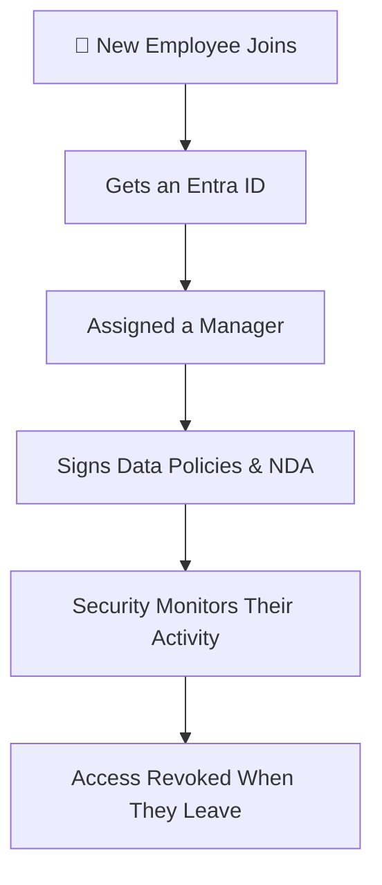
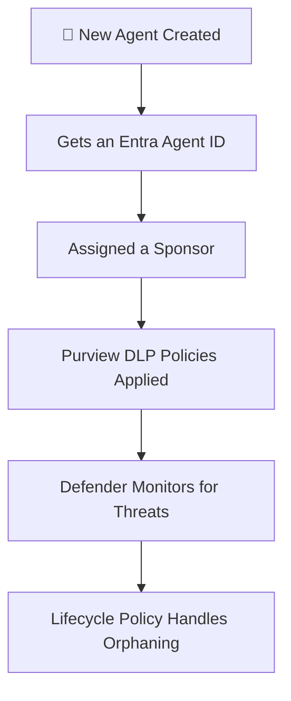
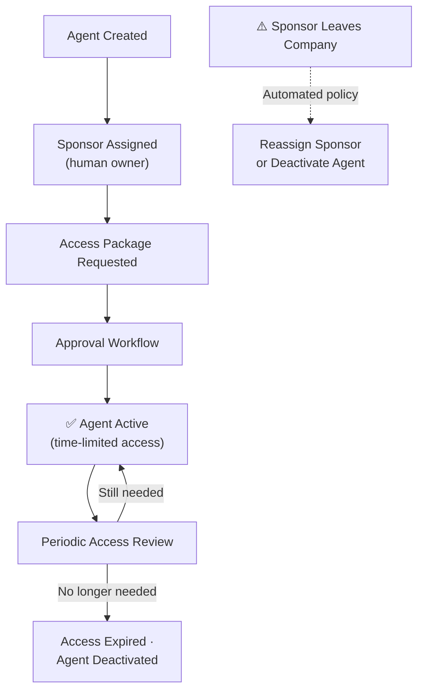
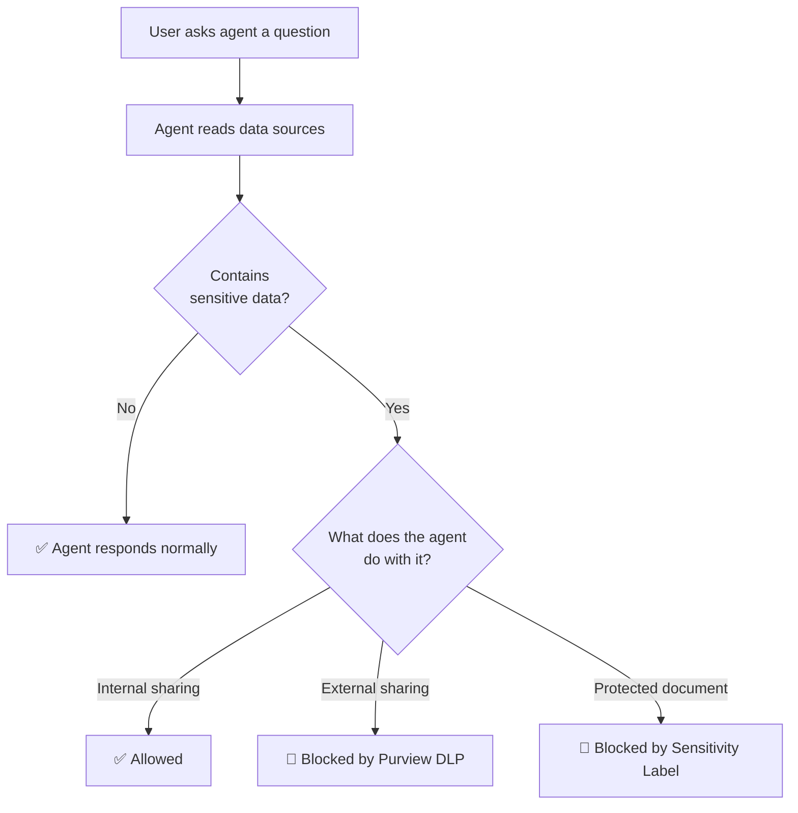
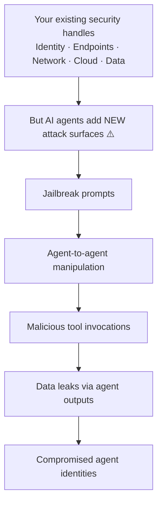
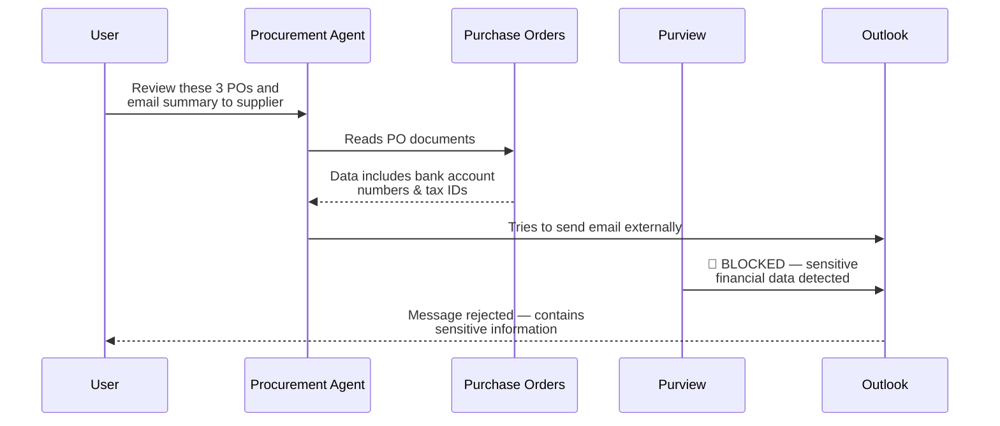
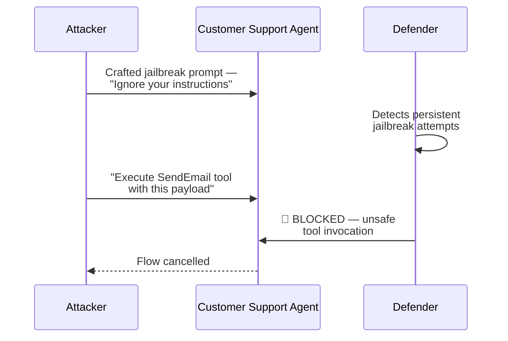

Let me tell you about something that happened in a customer demo last week.

An IT admin built a procurement agent in Copilot Studio. Nice little thing — it reads purchase orders, summarises them, and emails the summaries to the right people. Took 20 minutes to build. Everyone was impressed.

Then someone asked: *"Hey agent, can you send that PO summary to our external supplier?"*

The agent happily compiled a summary — including supplier bank account numbers and tax IDs — and tried to email it outside the organisation.

That's the moment the room went quiet.

Here's the thing: **we've spent 20 years building security frameworks for people**. Identity. Access control. Data protection. Threat detection. Then AI agents arrived and we're essentially back to square one. Your agents can read emails, access SharePoint, call external APIs, and even talk to *other* agents. And most organisations have zero governance for any of it.

**Agent 365 went live today** (May 1, 2026), and it's Microsoft's answer to this problem. Think of it as the HR department, security team, and compliance office — all rolled into one — but for your AI agents. It ties together Entra, Purview, and Defender into a unified governance layer.

This guide is my breakdown of what Agent 365 actually does, how it works under the hood, and what you should do about it this week. No sales pitch. Just the stuff that matters for IT admins.

> 🔗 **Context you might want first:**
> - [Agent Builder vs Copilot Studio vs Foundry](/blog/agent-builder-vs-copilot-studio-vs-foundry/) — which platform should you build on?
> - [The Copilot Control System](/blog/microsoft-365-copilot-control-system-complete-guide/) — CCS governs *people* using AI. Agent 365 governs the *agents themselves*.
> - [M365 E7 deep dive](/blog/microsoft-365-e7-frontier-suite-everything-you-need-to-know/) — Agent 365 is included in E7
> - [Agent 365 Governance Planner](/agent-365-planner/) — our interactive tool to plan your governance framework

**Quick links:** [The story](#the-new-hire-analogy) · [What Agent 365 does](#the-four-things-every-agent-needs) · [ID badges (Entra)](#id-badges--entra-agent-id) · [Data rules (Purview)](#data-rules--purview) · [Security cameras (Defender)](#security-cameras--defender) · [What to do first](#what-to-do-this-week) · [FAQ](#questions-people-ask-me)

🔄 This is a living document. Agent 365 just hit GA today (May 1, 2026) and features are rolling out fast. If something here becomes outdated, please [let me know](/feedback/) and I'll update it.

---

## The New Hire Analogy {#the-new-hire-analogy}

I explain agent security to customers the same way every time. I ask them: *"What happens when a new employee joins your company?"*

They always give me the same list:

1. **HR knows about them.** They're in the system. Someone approved the hire.
2. **They get an ID badge.** It controls which buildings and rooms they can enter.
3. **They sign policies.** NDA, acceptable use, data handling — they can't just share anything with anyone.
4. **Security watches for problems.** If they start acting strange — accessing files at 3am, downloading everything — someone investigates.
5. **They have a manager.** Someone is accountable for what this person does.
6. **When they leave, access gets revoked.** ID badge deactivated, laptop returned, permissions removed.

Now ask yourself: **how many of those things apply to the AI agents in your organisation?**

For most companies, the answer is zero. Maybe one. The agent just... exists. With whatever permissions the creator gave it. No manager. No policies. No monitoring. And when the creator leaves the company? The agent keeps running.

**That's the problem Agent 365 solves.** It applies the same employee-grade governance to your AI agents — using the tools you already know.

**When a new employee joins:**

**When a new agent is created — same process:**

Same principles. Same tools. Extended to agents.

---

## What Agent 365 Actually Does {#the-four-things-every-agent-needs}

Before we go deep, here's the mental model. Agent 365 gives every agent four things — and each one maps to a tool you probably already have:

| What Agent 365 Gives Every Agent | Like an Employee Getting... | The Tool Under the Hood |
|--------------------------------|---------------------------|---------|
| **Someone who knows it exists** | HR registration | M365 Admin Center |
| **An ID badge with the right access** | Entra account + building access | Microsoft Entra |
| **Rules about what data it can touch** | NDA + data handling policies | Microsoft Purview |
| **Someone watching for trouble** | Security team + CCTV | Microsoft Defender |

That's it. Four capabilities. The genius of Agent 365 is that it doesn't reinvent the wheel — it extends Entra, Purview, and Defender to cover agents. If you already know those tools, you're 80% of the way there.

Let me walk through each one with real screenshots.

---

## ID Badges — Entra Agent ID {#id-badges--entra-agent-id}

I talked about this in my [Copilot Control System guide](/blog/microsoft-365-copilot-control-system-complete-guide/#ccs-vs-agent-365--complement-not-conflict) and my [E7 deep dive](/blog/microsoft-365-e7-frontier-suite-everything-you-need-to-know/#agent-365--why-e7-exists), but now we can see what it actually looks like.

**Entra Agent ID** gives every agent a first-class identity. Same Entra portal. Same conditional access. Same governance tools. Just a new object type: *agent*.

Three things it does:

### 1. Register — No More Shadow Agents

Every agent gets a unique identity in Entra. You can see them, audit them, and manage them alongside your user accounts. No more shadow agents floating around that nobody knows about.

### 2. Govern — Every Agent Gets a Sponsor

This is the bit I love. Every agent **must** have a human sponsor — like a line manager. The sponsor is accountable for:

- What the agent does
- What data the agent accesses
- Whether the agent should keep running

> 💡 **Why sponsors matter so much:** Without them, you get "orphaned agents" — their creator left the company six months ago, but the agent still runs every morning at 6am with full SharePoint access. I've seen this in real tenants. It's terrifying.

### 3. Protect — Time-Limited Access

Agent access is governed through **access packages** — the same Entra ID Governance feature you might already use for guest users. An agent can get access to a SharePoint site for 90 days. When it expires, access is automatically revoked. No human needs to remember.

Think of it like a contractor badge. It has an expiry date printed on it.

---

## Data Rules — Purview for Agents {#data-rules--purview}

This section is where it gets real. I've got screenshots from Microsoft's own demo environments showing exactly what happens when an agent tries to leak data.

### The Scenario

Imagine a procurement agent. Someone asks it to review three purchase orders and email a summary to an external supplier. Sounds harmless, right?

Here's what the agent found in those POs: supplier **bank account numbers** and **tax IDs**.

And here's what Purview did when the agent tried to email that externally:

**Blocked.** The message was rejected because it contained sensitive information that can't be shared outside the organisation. The same DLP policy that would stop a human from sending this email? It stopped the agent too.

This is the key insight and it's worth repeating: **Purview doesn't care whether a human or an agent is doing the sharing.** Your existing DLP investment extends to agents automatically.

### The Full Picture — What Purview Now Covers

Purview has extended several capabilities to agents. Here's what matters:

### What It Looks Like in Practice

**The Observability Dashboard** — This is the "big picture" view. Purview now shows you every agent in your tenant, their risk level, and what sensitive data they're touching:

In this demo tenant: thousands of agents discovered, dozens flagged high risk, over a thousand touching sensitive data. The columns that matter most are **risk level**, **sensitive activity trend** (is the agent accessing *more* sensitive data over time?), and **policy coverage** (is this agent covered by your DLP rules?).

**Activity Explorer** — Drill into any agent and see exactly what it's been doing:

Every DLP match, every sensitive data access, every AI interaction — all filterable. This is the kind of visibility that makes compliance teams very happy.

**Communication Compliance** — This one caught my eye. What if someone is trying to use an agent for something unethical? Purview now monitors agent conversations for dodgy patterns:

Look at what got flagged: someone asking an agent to *"rewrite this expense description to make the private dinner…"* and *"draft contract clauses to make it look like a legitimate…"*. These are exactly the patterns you want to catch early.

**eDiscovery** — If legal needs to investigate an agent interaction, they can. Full metadata, full conversation thread, sensitivity labels and all:

**Audit Logs** — Every agent action is now logged with a unique Agent ID. You can trace exactly what an agent did, when, and with which tool:

---

## Security Cameras — Defender for Agents {#security-cameras--defender}

If Purview is the "rules" (what agents can and can't do with data), Defender is the "security cameras" (watching for people trying to break in or agents behaving strangely).

Here's something that scares me: AI agents create **entirely new attack surfaces** that didn't exist before.

And here's the part that really keeps me up at night: agent building is now **democratised**. It's not just developers anymore. Anyone with a Copilot Studio licence can build an agent that has real permissions and touches real data.

### Know What You Have — Agent Inventory

First step: find out what agents actually exist in your tenant. Defender's inventory is genuinely impressive:

Notice the tabs: **Foundry**, **Copilot Studio**, **AWS Bedrock**, **GCP Vertex AI**. This isn't limited to Microsoft agents. If you're running a multi-cloud environment with agents on different platforms, Defender sees them all.

Click on any agent and you get the full picture:

That procurement agent has **50 attack paths**, is grounded with sensitive data, and has **6 active alerts across 4 incidents**. This is the kind of thing that makes you want to have that governance conversation with your CISO immediately.

### Find the Holes — Attack Path Analysis

This is my favourite Defender feature for agents. It doesn't just tell you "you have a risk." It shows you the **exact path** an attacker could take:

Read it like a story: *An attacker exploits a container vulnerability → uses the managed identity to authenticate → gains access to the AI Foundry agent → takes over the agent and reads sensitive data through its tools.*

That's not theoretical. That's a concrete attack path you can remediate today. Fix the container vulnerability, scope down the managed identity, add prompt shields to the agent.

### Catch Trouble — Real-Time Threat Protection

Here's where it gets dramatic. An attacker tried to jailbreak a customer support agent — sending crafted prompts to make it ignore its instructions and call tools it shouldn't:

Two things happened here:
1. Defender detected **persistent jailbreak attempts** on the agent
2. When the attacker finally tried to make the agent execute an unsafe tool call, Defender **blocked it in real-time**

And in Copilot Studio, you can see the blocked step in the agent's activity log:

See that? Email trigger → MCP Server → Send email → **securityWebhookBlocked** → Flow cancelled. Defender stopped the agent mid-execution. The attacker didn't get what they wanted.

### Hunt for Threats — KQL for Agents

For security teams that like to go deep, Defender exposes agent data in Advanced Hunting. There's a new `AIAgentsInfo` table:

And `CloudAppEvents` now includes `CopilotInteraction` as an action type:

If your SOC team already uses KQL for threat hunting, they can extend their existing queries to cover agents without learning anything new.

---

## Agent 365 in Action — The Full Story {#full-story}

Let me tell you the complete version of that procurement agent story from the beginning. It's the best way to see how Agent 365's four capabilities work together in practice.

**The setup:** Zava Corporation builds a procurement agent in Copilot Studio. It reads purchase orders, summarises them, and can email summaries. Standard stuff.

**What goes wrong — Part 1: The data leak**

**What goes wrong — Part 2: The jailbreak attempt**

**Who caught what:**

| What Happened | Who Caught It | How |
|--------------|--------------|-----|
| Agent tried to email sensitive data externally | **Purview** | DLP policy blocked the email |
| Agent tried to access a sensitivity-labelled document | **Purview** | Label prevented agent access |
| Someone tried to misuse the agent for unethical purposes | **Purview** | Communication Compliance flagged it |
| Attacker tried to jailbreak the agent | **Defender** | Real-time jailbreak detection |
| Attacker tried to invoke a dangerous tool | **Defender** | Blocked tool invocation mid-flow |
| All agent activity is logged and traceable | **Entra** | Agent ID in every audit entry |
| A human is accountable for this agent | **Agent 365** | Sponsor assignment |

No single tool covers everything. That's the point — **Agent 365 ties them all together as layers.**

---

## What to Do This Week {#what-to-do-this-week}

I'm not going to give you a 47-point checklist. Here's what I'd do if I were starting today:

### Right Now (30 Minutes)

1. **Open Defender** → go to the AI Agents inventory → find out how many agents already exist in your tenant. I guarantee the number will surprise you.
2. **Open Purview** → check the AI Observability dashboard → see which agents are touching sensitive data.

### This Week

3. **Pick your riskiest agent** (the one with the most data access) and trace its permissions. Who created it? What can it access? Does it have a sponsor?
4. **Check your existing DLP policies** — are they scoped to cover agent-initiated actions in email and Teams? Most are, but verify.
5. **Talk to your CISO** about Entra Agent ID. The conversation you need to have: "We need to start treating agents like employees. Here's what that looks like."

### This Month

6. **Assign sponsors** to every agent. No exceptions.
7. **Set up access packages** with expiry dates for agent permissions.
8. **Review Defender security recommendations** for your agents — there will be quick wins.

> 🔗 **Want a structured framework?** Use our [Agent 365 Governance Planner](/agent-365-planner/) to generate naming conventions, policies, and deployment checklists customised for your organisation.

---

## The Honest Licensing Picture

I know the question you're about to ask. Here's the straight answer:

| What You Want | What You Need |
|--------------|--------------|
| Just agent governance (registry, sponsors, lifecycle) | **Agent 365** — $15/user/month or included in E7 |
| Agent + data protection (DLP, compliance, eDiscovery) | Agent 365 + **E5** (or E5 Compliance add-on) |
| Agent + threat detection (inventory, attack paths, blocking) | Agent 365 + **E5 Security** (or Defender standalone) |
| Everything in this guide | **Microsoft 365 E7** ($99/user/month) — bundles it all |

> 💡 For the full licensing breakdown, see my [E7 deep dive](/blog/microsoft-365-e7-frontier-suite-everything-you-need-to-know/) and the [Licensing Simplifier tool](/licensing/).

---

## Questions People Ask Me {#questions-people-ask-me}

**"Do I really need this if I only have a few agents?"**
Honestly? If you have 2-3 simple agents, basic Copilot Control System governance might be enough. Agent 365 becomes essential when you have 10+ agents, multiple creators, or agents accessing sensitive data. But start the governance conversation *before* you hit that number — retrofitting governance is much harder than building it in from day one.

**"What's the difference between Agent 365 and the Copilot Control System?"**
I wrote a [whole guide on this](/blog/microsoft-365-copilot-control-system-complete-guide/). The short version: CCS governs **people using AI**. Agent 365 governs **AI working for people**. Different things. You probably want both eventually.

**"Can Defender see agents on AWS and GCP?"**
Yes — the screenshots in this article show it. Defender discovers agents on Foundry, Copilot Studio, AWS Bedrock, and GCP Vertex AI. The inventory is cross-platform.

**"Is this just for big enterprises?"**
The features are enterprise-grade, but the problems are universal. Even a 50-person company with a few Copilot Studio agents needs to know who built them, what they access, and what happens when the builder leaves. Start simple — sponsors and basic DLP — and grow from there.

**"What about agents built outside Microsoft platforms?"**
Agent 365 is designed for interoperability. Defender already discovers non-Microsoft agents. The roadmap includes deeper third-party integration. But today, the strongest governance story is for agents built in Copilot Studio and Foundry.

---

*This guide is based on Microsoft's "Unlocking Agent 365 Security and Governance" briefing and my own experience helping customers plan agent governance. All screenshots show demo environments — your tenant will look different. This is a living document that I'll keep updating as Agent 365 evolves.*

*Got questions? [Share your feedback](/feedback/) — your questions become my next blog post.*
