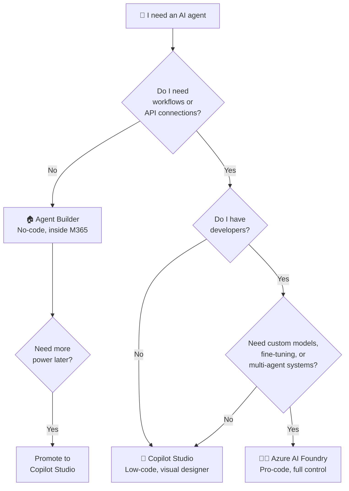
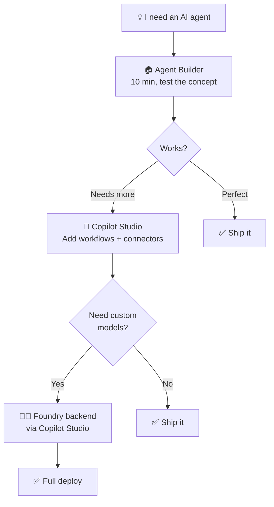

Microsoft now gives you **three different ways** to build AI agents. If you're an IT admin or decision-maker trying to figure out which one to use, you're not alone — this is one of the most common questions I hear from customers.

I wrote this guide because the official docs are spread across three different Learn sites, and nobody puts all three side-by-side in a way that helps you **decide**. That's what this post does.

**Quick links:**

- [TL;DR — The 30-Second Answer](#tldr)
- [The Mental Model — Three Kitchens](#mental-model)
- [What Licence Do You Need?](#licensing)
- [Agent Builder — The Microwave](#agent-builder)
- [Copilot Studio — The Home Kitchen](#copilot-studio)
- [Azure AI Foundry — The Restaurant Kitchen](#foundry)
- [Agent 365 — The Health Inspector](#agent-365)
- [The Graduation Path](#graduation)
- [Side-by-Side Comparison](#comparison)
- [Real-World Scenarios](#scenarios)
- [Planning Your Rollout](#planning)
- [IT Admin Checklist](#admin-checklist)
- [Do's and Don'ts](#best-practices)
- [FAQ](#faq)

🔄 This is a living document. The AI agent landscape changes fast — Microsoft is shipping updates monthly. If you spot anything out of date, please [send me feedback](/feedback/) and I'll update it. Last verified: April 2026.

> ⚠️ **Government cloud note:** Agent Builder and Copilot Studio are available in GCC, but feature availability may lag commercial cloud. GCCH and DoD have more limited availability — always check [Microsoft 365 Roadmap](https://www.microsoft.com/microsoft-365/roadmap) and your Microsoft account team for current government cloud support.

## TL;DR — The 30-Second Answer {#tldr}

| Question | Agent Builder | Copilot Studio | Azure AI Foundry |
|----------|--------------|----------------|-----------------|
| **Who is it for?** | Business users | Power users / IT admins | Developers |
| **Code required?** | None | Low-code | Pro-code (Python, C#) |
| **Best for** | Quick Q&A agents | Departmental workflows | Enterprise-grade AI apps |
| **Where does it live?** | Inside M365 Copilot | copilotstudio.microsoft.com | Azure portal |
| **Cost model** | Per-user licence or metered | Copilot Credits | Consumption (pay-per-token) |

**One sentence:** Start with Agent Builder, graduate to Copilot Studio when you need workflows, and only go to Foundry when you have developers and complex requirements.

> 📋 **Do these 3 things today:**
>
> 1. Build a simple FAQ agent in Agent Builder (10 minutes, free) — check your readiness with our [Copilot Readiness Checker](/copilot-readiness/) first
> 2. Identify one workflow that needs automation → that's your Copilot Studio candidate
> 3. Ask your dev team if they have Azure AI Foundry use cases → if no dev team, you don't need Foundry

## The Mental Model — Three Kitchens {#mental-model}

Think of Microsoft's three platforms as three different kitchens. They all make food (agents), but for very different situations.

🏠 **Agent Builder = Your home microwave.** Pop in the ingredients (instructions + SharePoint files), press a button, and dinner's ready. You don't need cooking skills. The options are limited — you can't make a soufflé — but for reheating leftovers and quick meals, it's perfect. That's Agent Builder: fast, simple, limited.

🍳 **Copilot Studio = A fully equipped home kitchen.** You've got a stove, oven, fridge, recipe books, and all the utensils. You can make almost anything if you follow the recipes. You don't need to be a chef — just a confident home cook. That's Copilot Studio: powerful, visual, guided.

👨‍🍳 **Azure AI Foundry = A commercial restaurant kitchen.** Industrial ovens, walk-in fridges, specialised equipment, a team of sous-chefs. You can make anything at any scale. But you need a trained chef — and the equipment costs money whether you use it or not. That's Foundry: unlimited power, requires developers, consumption costs.

## What Licence Do You Need? {#licensing}

This is always the first question. Here's the honest answer — more nuanced than most guides admit.

| Platform | Free Tier | Metered (No Copilot Licence) | With M365 Copilot ($30/user/mo) |
|----------|-----------|------------------------------|--------------------------------|
| **Agent Builder** | ✅ Basic (web/Bing grounded) | ✅ Pay-as-you-go for enterprise knowledge | ✅ Full access to SharePoint, OneDrive, emails |
| **Copilot Studio** | ❌ | ✅ $0.01/credit PAYG or $200/mo for 25K credits | ✅ Some interactive use included; autonomous actions always require credits |
| **Azure AI Foundry** | ✅ Portal exploration | ✅ Consumption-based (Azure sub required) | N/A — Foundry billing is separate from M365 |
| **Agent 365** | ❌ | $15/user/month standalone | Included in E7 ($99/user/month) |

> 💡 **Tip:** Use the [Licensing Simplifier](/licensing/) to compare your M365 plan options, and the [AI Cost Calculator](/ai-cost-calculator/) to model total cost across platforms.

> ⚠️ **Copilot Studio credit consumption varies wildly.** A simple response costs 2 credits. A generative answer with enterprise data costs 10. An autonomous trigger costs 25. Use Microsoft's [Copilot Credit Estimator](https://microsoft.github.io/copilot-studio-estimator/) before budgeting.

## Agent Builder — The Microwave {#agent-builder}

Agent Builder lives inside M365 Copilot. Open Copilot, click "New agent", start talking.

### What it can do

- Answer questions from SharePoint (up to 100 files), OneDrive, web (4 URLs), uploaded files (20), and Teams chats (5)
- Follow custom instructions in plain English — the better your instructions, the better the agent. Use our [Prompt Engineering Guide](/prompt-guide/) to write effective ones
- Respect existing M365 permissions — if a user can't access a document, the agent can't either
- Deploy instantly to yourself or share with a team

### What it cannot do

- ❌ Call external APIs or databases
- ❌ Trigger workflows or automations
- ❌ Connect to systems outside Microsoft 365
- ❌ Run autonomously (no scheduled triggers)

> 📌 **Admin action:** Agent Builder is **enabled by default** for Copilot-licensed tenants. Manage in M365 Admin Centre → Settings → Copilot → Agents. You can control who creates, shares, and which data sources agents access. Review data access settings carefully — uploaded files have different sharing behaviour than M365-native content.

> 📚 [Agent Builder — Microsoft Learn](https://learn.microsoft.com/microsoft-365/copilot/extensibility/agent-builder)

## Copilot Studio — The Home Kitchen {#copilot-studio}

Copilot Studio is where most IT admins will spend their time. Think of it as Power Automate for AI agents.

### What it adds over Agent Builder

- Multi-step workflows with branching logic and approvals
- 1,500+ Power Platform connectors (Salesforce, ServiceNow, SAP, custom APIs)
- Autonomous agents that run on schedules or event triggers — not just when someone asks a question
- Multi-channel publishing: Teams, web chat, Facebook, custom apps
- Enterprise governance: version your agents, run separate dev/test/prod environments, set role-based access, and track analytics
- Parent/child agent architecture for breaking complex scenarios into smaller specialist agents

### What it cannot do

- ❌ Fine-tune or train custom models
- ❌ Build complex multi-agent orchestration (beyond parent/child)
- ❌ Access models outside Microsoft's supported catalogue
- ❌ Full CI/CD with source control (no native Git integration — use Power Platform ALM pipelines instead)

### Common gotcha

> ⚠️ **The biggest surprise with Copilot Studio is the credit cost.** I've seen admins launch an agent expecting it to cost $200/month, then discover it was burning $600/month because autonomous triggers fire frequently and each costs 25 credits. Before you go live, turn on credit monitoring in the Power Platform Admin Centre, set usage alerts, and start with a small pilot group. Use our [AI Cost Calculator](/ai-cost-calculator/) to model your expected consumption.

### When to pick Studio over Agent Builder

If your agent needs to **do something** (create a ticket, update a record, send an email, kick off an approval) rather than just **answer a question**, you need Copilot Studio. The moment you think "and then it should..." — that's your Studio trigger.

> 📌 **Admin action:** Manage through [Power Platform Admin Centre](https://admin.powerplatform.microsoft.com). Set DLP policies to control which connectors agents can use — this prevents shadow IT agents accessing systems you haven't approved. Use the [Copilot Feature Matrix](/copilot-matrix/) to check feature availability in your licence tier.

> 📚 [Copilot Studio — Microsoft Learn](https://learn.microsoft.com/microsoft-copilot-studio/fundamentals-what-is-copilot-studio)

## Azure AI Foundry — The Restaurant Kitchen {#foundry}

Azure AI Foundry (recently rebranded "Microsoft Foundry") is for developers. If nobody on your team writes Python or C#, you don't need this — but understand what it is so you can have the right conversation when someone asks "can we do more?"

### What only Foundry can do

- 1,800+ models: GPT-4o, GPT-5, Claude, Llama, Phi, Mistral, Cohere, DeepSeek
- Fine-tune models on proprietary data
- Multi-agent orchestration where specialised agents collaborate (Semantic Kernel, LangChain, LangGraph)
- Air-gapped sovereign deployments for government or highly regulated environments
- Full CI/CD pipelines with Azure DevOps or GitHub
- Custom evaluation and testing pipelines to measure agent quality before production

### Who needs to own this

This is not an IT admin tool — it's a development team tool. If your org is exploring Foundry, here's who's involved:

| Role | Responsibility |
|------|---------------|
| **Developers / Data Scientists** | Build, test, and deploy agents using SDKs |
| **Platform/Cloud Engineers** | Manage Azure infrastructure, networking, and cost |
| **IT Admin (you)** | Governance via Agent 365, budget oversight, compliance alignment |
| **Security Team** | VNet configuration, private endpoints, data classification |

As an IT admin, your job isn't to build in Foundry — it's to **govern what comes out of it** and ensure it meets your org's compliance requirements.

### What changes operationally

Moving to Foundry is like adding a new department. Here's what shifts:

- **Cost ownership moves to Azure.** You now need Azure cost management, budget alerts, and resource tagging — this is separate from your M365 bill
- **Support model changes.** Foundry issues go through Azure support, not M365 support
- **Deployment pipeline needed.** Agents need CI/CD, staging, and production environments managed by developers
- **Monitoring is Azure Monitor.** Not the M365 Admin Centre — you'll need Application Insights, Log Analytics, and potentially Grafana

### When NOT to choose Foundry

- You don't have developers — Foundry without a dev team is a recipe for failure
- Your use case works in Copilot Studio — don't over-engineer
- Budget predictability matters more than flexibility — consumption billing can surprise you
- You're just starting your AI journey — build confidence with Agent Builder and Studio first

### What it costs

| Cost Driver | Example Rate (April 2026) |
|-------------|--------------------------|
| GPT-4o input tokens | $2.50 per million |
| GPT-4o output tokens | $10.00 per million |
| Code Interpreter | $0.033 per session |
| Vector storage | $0.11/GB/day (1 GB free) |
| PTU (reserved capacity) | ~$1/hour per PTU |

### What does this look like for real?

For a **500-person org** with one Foundry agent handling ~1,000 queries/day (moderate complexity):

- **Model costs:** ~$150–$400/month depending on model and response length
- **Storage:** ~$5–$20/month for vector indexes
- **Compute:** $0 if using serverless, $500+/month if using reserved PTUs
- **Total:** Roughly **$200–$500/month** for a moderately busy agent — but a high-volume agent with expensive models could easily reach **$2,000+/month**

Compare this to Copilot Studio doing similar work: ~500–1,000 credits/day × $0.01 = **$150–$300/month**. The value of Foundry isn't cheaper — it's capability you can't get elsewhere.

> ⚠️ **Pricing changes frequently.** Always check the [Azure AI Foundry pricing page](https://azure.microsoft.com/pricing/details/ai-foundry/). Use our [AI Cost Calculator](/ai-cost-calculator/) to model costs before committing.

> 📚 [Microsoft Foundry — Microsoft Learn](https://learn.microsoft.com/azure/ai-foundry/what-is-azure-ai-foundry)

## Agent 365 — The Health Inspector {#agent-365}

**Who governs all these agents?** Agent 365 — the health inspector visiting all three kitchens. GA **May 1, 2026**.

- **Agent Registry** — centralised catalogue of all agents
- **Entra Agent ID** — identity and RBAC for agents
- **Lifecycle management** — versioning, approval workflows, retirement
- **Compliance** — Defender and Purview integration
- **Observability** — performance dashboards

| Scenario | Need Agent 365? |
|----------|----------------|
| One person, one agent | ❌ Not yet |
| 5 departments with agents | ✅ Need visibility |
| Foundry agents in production | ✅ Need governance |
| 50+ agents across org | ✅ Absolutely |

> 📚 Use our [Agent 365 Planner](/agent-365-planner/) for an interactive governance assessment. Compare plans including E7 with our [Licensing Simplifier](/licensing/).

## The Graduation Path {#graduation}

Microsoft designed these as a ladder, not a choice. Most organisations use more than one.

> 💡 **Tip:** Many orgs use hybrid — quick agents in Agent Builder, departmental solutions in Copilot Studio, complex AI in Foundry. Agent 365 ties them together. Use our [ROI Calculator](/roi-calculator/) to build the business case.

### What carries over when you graduate

| Moving from → to | What transfers | What you rebuild |
|-------------------|---------------|-----------------|
| Agent Builder → Copilot Studio | Instructions, knowledge sources, configuration (one-click copy) | Topic tree, workflow logic, connectors |
| Copilot Studio → Foundry backend | Nothing automatic — different paradigm | Agent logic, data connections, orchestration code |
| Agent Builder → Foundry | Nothing automatic | Everything — start from code |

**The key takeaway:** Agent Builder → Copilot Studio is seamless. Going to Foundry is a rebuild — that's why you should only go there when Studio genuinely can't do what you need.

## Planning Your Rollout {#planning}

### Suggested timeline by platform

| Phase | Agent Builder | Copilot Studio | Azure AI Foundry |
|-------|-------------|----------------|-----------------|
| **Pilot** (1–2 weeks) | Day 1 — build in minutes, test with 5 users | 2–4 weeks — design, build, test with pilot group | 4–8 weeks — dev sprint, staging, UAT |
| **Rollout** (2–4 weeks) | Share to team, done | Phased by department, DLP policies first | Production deploy with monitoring |
| **Steady state** | Minimal — update knowledge sources | Monthly credit review, connector audits | Ongoing DevOps, cost monitoring |

### How to convince leadership

If you need buy-in, here are three talking points that work:

1. **"We're already exposed."** Agent Builder is on by default for Copilot-licensed users. People may already be building agents. We need visibility and governance — Agent 365 gives us that.

2. **"Start small, prove value."** Build one HR FAQ agent in Agent Builder (free, 10 minutes). Track deflected questions for a month. Show the ROI before asking for Copilot Studio credits.

3. **"This is a ladder, not a leap."** We're not buying a $100K AI platform. We're turning on a feature we already have, testing it, and graduating as we prove value. Use our [ROI Calculator](/roi-calculator/) to model the numbers.

### What happens when things go wrong

| Problem | Agent Builder | Copilot Studio | Foundry |
|---------|-------------|----------------|---------|
| Agent gives wrong answer | Update instructions or knowledge sources | Edit topic flow, improve grounding | Debug code, adjust prompts, retrain |
| Agent goes down | Microsoft handles infrastructure | Microsoft handles infrastructure | You manage Azure resources — check quotas, endpoints, model health |
| Costs spike unexpectedly | N/A (flat per-user) | Set credit usage alerts in Power Platform Admin Centre | Set Azure budget alerts + resource locks |
| Security concern | Disable agent sharing in M365 Admin Centre | Disable environment or revoke connector access | Remove Azure resource permissions, disable endpoint |
| User builds something inappropriate | Admin controls who can build/share | DLP policies block specific connectors | Azure RBAC + Agent 365 governance |

## Side-by-Side Comparison {#comparison}

| Feature | Agent Builder | Copilot Studio | Azure AI Foundry |
|---------|-------------|----------------|-----------------|
| **Code** | None | Low-code | Python, C# |
| **Knowledge** | SP (100 files), URLs (4), files (20), Teams (5) | M365 + 1,500+ connectors + Dataverse | Any data source |
| **Workflows** | ❌ | ✅ Multi-step branching | ✅ Custom |
| **External APIs** | ❌ | ✅ Connectors + plugins | ✅ Any API |
| **Autonomous** | ❌ | ✅ Scheduled + events | ✅ Any trigger |
| **Models** | Microsoft-managed | Managed + custom Azure OpenAI | 1,800+ models |
| **Fine-tuning** | ❌ | ❌ | ✅ |
| **Multi-agent** | ❌ | Limited (parent/child) | ✅ Full |
| **CI/CD** | ❌ | Power Platform ALM | Azure DevOps/GitHub |
| **Sovereign** | ❌ | ❌ | ✅ |

## Real-World Scenarios {#scenarios}

These are based on real conversations I've had with customers. The names are made up but the problems are very real.

### "We need an HR FAQ bot"

> **Situation:** Sarah from HR calls you. Her team answers the same 20 questions every single day — "How much annual leave do I have?", "Where's the expenses policy?", "What's the parental leave process?" She's got 200 pages of policy documents sitting in SharePoint that nobody reads. She wants a bot that answers from those documents.

**I'd go with Agent Builder.** This is literally what it was built for. Open M365 Copilot, click "New agent", point it at Sarah's SharePoint site, write clear instructions like "You are an HR policy assistant. Answer questions only from the uploaded HR policies. If you don't know, say so and direct the user to hr@company.com."

Ten minutes later, Sarah has a working bot. No tickets, no dev team, no budget approval. She tests it with her team for a week, tweaks the instructions, and shares it to the whole company.

If it works well and Sarah later says "can it also submit leave requests?" — that's when you promote it to Copilot Studio and add the workflow.

### "We need IT helpdesk that creates tickets"

> **Situation:** Your IT service desk gets 300 tickets a day. Half are password resets and access requests. Your team lead wants a bot that triages incoming requests, answers the easy stuff ("how do I reset my MFA?"), and creates ServiceNow tickets for everything else — with the right priority and category pre-filled.

**This is Copilot Studio territory.** Agent Builder can answer the FAQ part, but the moment you need "and then create a ticket in ServiceNow" — you need a workflow. Copilot Studio has a ServiceNow connector out of the box. You design the flow: user describes issue → bot categorises it → if it's a known issue, answer directly → if not, collect details and create the ticket.

One gotcha I've seen: admins forget to set up the DLP policy first, and suddenly the bot has access to connectors it shouldn't. **Set your DLP before building your first agent.** Seriously.

### "We need a document processing pipeline"

> **Situation:** The legal team processes 2,000 contracts a year. Each one needs: key term extraction, risk scoring against a template, compliance checks, redlining suggestions, and routing to the right lawyer for approval. They need full audit trails and the system has to work with their existing document management system.

**This is Azure AI Foundry.** The level of customisation here — fine-tuned models for legal language, multi-step orchestration, custom evaluation pipelines, integration with a third-party DMS — is beyond what Copilot Studio can handle. You'll need developers building this.

Your role as the IT admin? Make sure Agent 365 governs it, set Azure budget alerts (legal document processing can get expensive), and ensure the security team signs off on the data classification. You're not building the agent — you're making sure it's built safely.

### "No developers but need more than Q&A"

> **Situation:** The marketing team wants an agent that reads their brand guidelines from SharePoint, pulls campaign performance data from HubSpot, and posts draft campaign briefs to a Teams channel for the team to review. "Can we do this without bothering IT too much?"

**Copilot Studio, and they might even be able to build it themselves.** The HubSpot connector exists in Power Platform. Teams integration is native. SharePoint knowledge is built in. A confident power user in the marketing team could build this with some guidance from you.

If I were you, I'd set up a dedicated Power Platform environment for marketing, apply DLP policies so they can only use approved connectors, and let them experiment. That's the sweet spot — empowerment with guardrails.

## IT Admin Checklist {#admin-checklist}

Every IT admin needs clear answers to these seven questions. Here they are per platform.

### 1. What licence do I need?

- **Agent Builder:** Free for web-grounded agents. M365 Copilot licence ($30/user/month) or metered pay-as-you-go for enterprise knowledge (SharePoint, emails, OneDrive).
- **Copilot Studio:** Copilot Credits — $0.01/credit PAYG or $200/month for 25,000 credits. M365 Copilot users get some interactive usage included, but autonomous actions always require credits.
- **Foundry:** Azure subscription with consumption billing. No per-user licence — pay per token, per tool, per storage unit.

Use the [Licensing Simplifier](/licensing/) to compare options.

### 2. How do I turn it on or off?

- **Agent Builder:** Enabled by default. M365 Admin Centre → Settings → Copilot → Agents. Restrict by security group. You can disable agent creation entirely or allow it for specific groups only.
- **Copilot Studio:** Power Platform Admin Centre → Environments. Control access by creating/restricting environments. DLP policies control which connectors agents can use.
- **Foundry:** Azure RBAC at subscription, resource group, or resource level. No tenant-wide toggle — access is granted explicitly through Azure role assignments.

### 3. Can I target specific users or groups?

- **Agent Builder:** Yes — use Entra ID security groups in the M365 Admin Centre to control who can create and share agents. You can also restrict which data sources agents can access.
- **Copilot Studio:** Yes — through Power Platform environment security roles and maker permissions. You can restrict who builds agents and who consumes them separately.
- **Foundry:** Yes — through Azure RBAC. You can scope permissions to specific subscriptions, resource groups, or individual resources.

### 4. Can I audit and monitor it?

- **Agent Builder:** Unified audit log in Microsoft Purview captures agent creation, sharing, and usage events. Agent 365 adds richer observability when deployed. Depth of audit depends on your Purview licence tier.
- **Copilot Studio:** Built-in analytics dashboard shows usage, session counts, and outcomes. Purview audit log integration for compliance. Agent 365 provides cross-platform visibility.
- **Foundry:** Azure Monitor, Application Insights, and built-in tracing provide deep operational telemetry. You configure the monitoring depth — it's not automatic.

### 5. What happens if I do nothing?

- **Agent Builder:** Copilot-licensed users **can already build and share agents today**. If you haven't reviewed your settings, check now — someone may have already created agents accessing sensitive SharePoint sites.
- **Copilot Studio:** Requires explicit credit provisioning, so organic sprawl is less likely — but if credits are enabled on a broad environment, makers can build without your knowledge.
- **Foundry:** Requires an Azure subscription and explicit resource creation. Very low risk of accidental sprawl.

### 6. What stays the same regardless?

Regardless of which platform you use, these protections remain in place:

- M365 permissions still apply — agents can't access data the user can't access
- Sensitivity labels are respected (subject to Purview configuration and licensing)
- Existing compliance and DLP policies continue to function
- Agents don't get their own licence or bypass conditional access

### 7. What about government cloud?

- **Agent Builder:** Available in GCC. Some features may lag commercial cloud by weeks/months. GCCH and DoD have limited availability — check the [M365 Roadmap](https://www.microsoft.com/microsoft-365/roadmap).
- **Copilot Studio:** Available in GCC. GCCH support varies by feature — confirm with your Microsoft account team.
- **Foundry:** Available in Azure Government regions, but model availability may differ (some third-party models like Claude may not be available in government regions). Check [Azure Government services](https://learn.microsoft.com/azure/azure-government/compare-azure-government-global-azure).

## Do's and Don'ts {#best-practices}

| ✅ Do | ❌ Don't |
|-------|---------|
| Start with Agent Builder for experiments | Jump to Foundry without validating |
| Use the graduation path | Build everything in Foundry "just in case" |
| Budget Copilot Studio credits before launch | Assume Studio is free because Copilot is licensed |
| Set Azure budget alerts for Foundry | Deploy Foundry agents without cost controls |
| Deploy Agent 365 at 5+ production agents | Wait for 50 agents with no visibility |
| Write structured instructions ([Prompt Guide](/prompt-guide/)) | Give vague one-line instructions |
| Check readiness first ([Readiness Checker](/copilot-readiness/)) | Skip assessment and wonder why adoption fails |

## FAQ {#faq}

**1. Can I start with Agent Builder and move to Copilot Studio later?**

Yes, and this is actually the path I'd recommend. Microsoft built a one-click promotion — you copy your agent from Agent Builder into Copilot Studio and everything carries over: instructions, knowledge sources, configuration. You then layer on workflows, connectors, and governance. Think of it like drafting a letter in Notepad and then moving it to Word when you need formatting.

**2. Do I need an Azure subscription for Foundry?**

Yes. Foundry is an Azure service, so billing goes against your Azure subscription — completely separate from your M365 bill. This catches some admins off guard because they're used to everything being per-user licensing. With Foundry, you're paying for compute, tokens, and storage. If you don't have an Azure subscription today, that's a whole procurement conversation on its own.

**3. What is Agent 365 and do I really need it?**

Think of Agent 365 as the "CISO's dashboard for AI agents." It gives you a single view of every agent across Agent Builder, Copilot Studio, and Foundry — who built it, what data it accesses, how it's performing. At $15/user/month (or included in E7), it's worth it once you have more than a handful of agents in production. For one or two experimental agents? You can wait.

**4. How much does each platform actually cost for a real org?**

For a 500-person org, roughly: Agent Builder is free (basic) or $30/user/month × your licensed users. Copilot Studio depends heavily on volume — budget $200–$600/month per active agent as a starting point, but model your specific scenario with the [AI Cost Calculator](/ai-cost-calculator/). Foundry is the wildcard — a moderate agent runs $200–$500/month, but a busy one with expensive models can hit $2,000+. Always set budget alerts.

**5. Can the three platforms work together?**

Yes, and that's the whole point. Microsoft designed them as an ecosystem, not competitors. The most common pattern I see in large orgs: business users build quick agents in Agent Builder, IT manages departmental agents in Copilot Studio, the dev team builds specialised AI in Foundry, and Agent 365 provides the governance umbrella. Copilot Studio can even call a Foundry-hosted model as its backend — best of both worlds.

**6. I'm not a developer. Which should I use?**

Agent Builder, full stop. You can build a genuinely useful agent in 10 minutes without writing a single line of code. If you outgrow it, Copilot Studio is still low-code — think drag-and-drop, not Python. I'd only send you to Foundry if you have developers on your team who are asking for it. If nobody's asking, you don't need it.

**7. What about data security — can I trust agents with sensitive data?**

Each platform handles security differently, so let me be specific. Agent Builder respects your existing M365 permissions — if a user can't see a document, the agent can't surface it. But watch out for uploaded files, which have different sharing rules than M365-native content. Copilot Studio adds Power Platform DLP policies on top, which control which connectors agents can use. Foundry depends on your Azure architecture — VNet isolation, private endpoints, and your choice of model provider all matter. The honest answer: the security is as good as your configuration. Don't assume it's secure by default — validate it.

**8. Are there limits on what I can build?**

Yes, and they're different per platform. Agent Builder: up to 100 SharePoint files, 4 web URLs, 20 uploaded files, and 5 Teams chats per agent. That's plenty for most Q&A scenarios. Copilot Studio: up to 1,000 topics and 200 triggers per agent — more than enough for even complex departmental bots. Foundry: no practical agent limits, just Azure subscription quotas and your budget.

---

> **Disclaimer:** The views and opinions expressed in this article are my own and do not represent the official positions of Microsoft. All pricing mentioned is in USD and was sourced from official Microsoft pricing pages at the time of writing — pricing, features, and availability are subject to change. Always refer to [official Microsoft documentation](https://learn.microsoft.com) for the most up-to-date information.

---

**Tools to help your agent journey:**

- [Copilot Readiness Checker](/copilot-readiness/) — assess readiness
- [Agent 365 Planner](/agent-365-planner/) — governance assessment
- [Copilot Feature Matrix](/copilot-matrix/) — licence feature comparison
- [Licensing Simplifier](/licensing/) — compare M365 plans
- [AI Cost Calculator](/ai-cost-calculator/) — model total AI costs
- [ROI Calculator](/roi-calculator/) — calculate Copilot ROI
