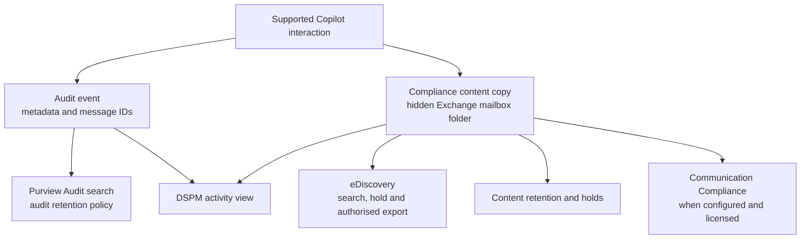

"Can we actually see what Copilot did?" is a question I hear often from security and compliance teams. The short answer: yes — for supported experiences, when auditing is on (it's on by default for E3/E5). The catch: the controls live in **Microsoft Purview**, not the Microsoft 365 admin center where most people look first.

Here's what I could piece together from the current Microsoft documentation — what's logged in a single Copilot interaction, where to find it, how agents and apps show up, who's actually allowed to read prompts, and how long audit records are kept.

**Quick links:** [TL;DR](#tldr) · [The big picture](#the-big-picture) · [What's in one record](#whats-captured-in-a-single-interaction) · [Where to look](#where-to-look-in-purview) · [Apps & agents](#how-apps-and-agents-show-up) · [Beyond audit](#beyond-audit-the-other-purview-tools) · [Where the data lives](#where-the-data-lives-and-can-you-delete-it) · [Before you search](#before-you-search) · [Privacy](#privacy-who-can-actually-read-prompts) · [Troubleshooting](#troubleshooting-why-you-see-nothing) · [FAQ](#common-questions)

## TL;DR

- Supported Copilot interactions are logged to the **Microsoft Purview audit log** as `CopilotInteraction` records by Audit (Standard) — when auditing is on (on by default for E3/E5).
- It lives in **Microsoft Purview** (`purview.microsoft.com`), not the Microsoft 365 admin center.
- The record identifies prompt and response **message IDs**, the app or agent, and available resource and policy metadata. It does not contain the full conversation text or guarantee a complete trace of every downstream tool.
- Three related Purview workflows help — not one datastore: **Audit** searches the events, DSPM shows a dashboard (the older DSPM for AI is now labelled classic), and eDiscovery searches — and can delete — the mailbox-backed content.
- **Agents are audited too**, and Purview can also audit supported **non-Microsoft AI** apps (ChatGPT, Gemini) once the required collection is set up.
- **Within Purview, reading prompt/response text requires content-access or eDiscovery permissions.** Separately authorised export applications can retrieve supported interactions too. Being a manager alone grants neither route.
- **Copilot audit records default to 180 days, even on E5.** Longer retention needs an eligible custom audit policy. The mailbox-backed content follows separate retention and holds.

**Documentation reviewed: 15 September 2026.** This update checks public Microsoft documentation, not tenant behaviour. The existing lab screenshots illustrate earlier portal views; no policies, audit collection or deletion workflows were tested for this update. [Tell me](/feedback/) if something has moved.

## The big picture

Here's the distinction that matters: an interaction can leave an audit event and a separate compliance copy of its content. Purview tools use those records for different purposes.

I'm a Copilot Solution Engineer at Microsoft NZ. This is the write-up I wish I'd had the first time a CISO asked me to walk them through Copilot's audit trail.

The rest of this guide walks each of those boxes.

## What's captured in a single interaction

For supported Copilot experiences with auditing enabled, Purview writes a `CopilotInteraction` audit record. These are useful fields in the documented schema; their presence and detail depend on the experience:

- **The prompt and the response.** The `Messages` field identifies the prompt and response messages by `ID`, marks each with `IsPrompt`, and can carry a `JailbreakDetected` flag when a prompt looks like a jailbreak attempt. (The message *text* isn't stored in this record — it's retrieved separately, behind the permission gate covered below.)
- **Resource references.** `AccessedResources` can include file, email or other resource IDs, `SensitivityLabelId`, `Action` (read/create/modify), policy details, status and an `XPIADetected` flag. Use the recorded references as evidence. An empty or incomplete field is not proof that no content was accessed, and this schema is not a complete trace of every custom agent's tools.
- **Where the user was.** `Contexts` records the file, Teams chat, or meeting the interaction happened in.
- **The app.** `AppHost` tells you the surface (more on that below).
- **The agent.** `AgentId`, `AgentName`, and `AgentVersion` when an agent was involved.
- **Web and plugins.** `AISystemPlugin` identifies plugins or extensions associated with an interaction, such as `BingWebSearch`. Correlate it with available web-query evidence rather than treating the plugin ID alone as the query text.
- **DLP signals.** `DLPEvaluationDeferred` is a bitmask showing which data-loss-prevention evaluations couldn't complete immediately and were deferred for later — `Prompt`, `Response`, `Grounding`, or `WebGrounding`.
- **Model and record classification.** `ModelTransparencyDetails` identifies the model provider. The current schema says model name and version are not available for Microsoft 365 Copilot scenarios. `Operation`, `RecordType` and `Workload` distinguish Copilot from connected and other AI-app events.

You can see the raw shape of this in the audit log itself. Here's a single record opened up, and its expandable `CopilotEventData`:

*One Copilot interaction, opened in the audit log. (Lab demo data — identifiers redacted.)*

*Inside `CopilotEventData` — the app, the resources Copilot accessed, and the message data. (Lab demo data — user and URLs redacted.)*

## Where to look in Purview

Three surfaces. They can each investigate the same interaction, but they play different roles — Audit searches the audit events, DSPM presents AI activity, and eDiscovery searches the stored prompt and response items (which live in user mailboxes, under their own retention).

### 1. Purview Audit — search the audit trail

This is the searchable Microsoft Purview audit log — the record that an interaction happened. Go to **Purview → Audit → Search**, filter by the `CopilotInteraction` record type (or the Copilot activities group), set a date range, and run it.

*Microsoft Purview → Audit. This is the home of Copilot's audit records — not the Microsoft 365 admin center. (Lab demo data.)*

*Audit results filtered to `CopilotInteraction`. (Lab demo data — user and IP columns redacted.)*

Prefer the command line? You can pull the same records with **`Search-UnifiedAuditLog`** in Exchange Online PowerShell and export them for analysis.

### 2. DSPM — the friendly dashboard

If reading raw records isn't your idea of fun, Purview's **DSPM** gives you the same story as a dashboard. One wrinkle: there are two of them in the portal right now, and the menu path differs.

- **DSPM** — the current one. AI activity sits at Discover → Activity explorer → AI activities.
- **DSPM for AI (classic)** — the older one, where Activity explorer is a top-level item.

Either way you land on the same AI activity, with filters for web search, agents, app, and sensitivity. Microsoft's documentation says most new features go to the current version only, so that's the one worth learning. The screenshots here are from it.

*DSPM → Discover → Activity explorer. Note the **Web searched** and Agents involved filters, and the retirement banner running across the top. (Lab demo data.)*

Open a single AI interaction and you get a clean, readable view of the app and the plugins it used — plus, if you hold the right roles, the user's risk level and the prompt and response themselves:

*A single interaction showing the BingWebSearch plugin. Check the available query details when investigating web use. (Existing lab screenshot; client IP redacted.)*

*DSPM can display the prompt, the response, and the files Copilot used to viewers who have the required permissions. Note the "permissions to view prompts and responses" link. (Lab demo data — SharePoint URL redacted.)*

Open a whole app rather than a single interaction, and DSPM rolls the same data up — including the **sensitivity labels** and file types Copilot referenced over the last 30 days. It's a quick way to spot when Copilot is reaching into sensitive content.

*The per-app "Referenced content" rollup — the sensitivity labels and file types Copilot touched. (Lab demo data.)*

#### What's actually different in the new DSPM

Worth answering properly, because "DSPM or DSPM for AI (classic)" hides a real change. Three things matter if you're using it to audit Copilot.

**Objectives are a new front door.** After the initial setup tasks you get *Data security objectives* as prominent, selectable cards, also surfaced in context from the Posture page. They're goals rather than metrics — *Prevent data exposure in Microsoft 365 Copilot and Microsoft Copilot interactions*, *Prevent oversharing of sensitive data*, *Discover sensitive data in your organization*. Choose one and it pulls the relevant Purview solutions into a single workflow, each with a remediation plan, one-click policies and recommended actions. The Posture dashboard is still there; you just aren't forced to start with it.

**There's an AI observability page.** It inventories AI apps and agents with collected activity in the last 30 days, including supported Microsoft Agent 365 activity. It shows risk and sensitive-interaction counts, with agent and policy details. Its completeness depends on collection coverage. It is separate from the *Apps and agents* page below.

**Check migration notices in your tenant.** The existing lab screenshot shows a classic-solution retirement banner. The public documentation reviewed for this update says most new features go to the current DSPM; it does not establish a universal retirement date. Use your tenant's current notice for migration planning.

And the part people usually want to know, which hasn't changed at all: the permission gate on reading prompt and response text is identical in both versions. Each one's permissions table carries the same row — viewing the prompts and responses inside `AI Interaction` events is unsupported for Compliance Administrator, Global Administrator and the Purview Compliance Administrator role group, and needs **Content Explorer Content Viewer** or Microsoft Purview Data Security AI Content Viewer on top. Moving to the new DSPM doesn't widen who can read prompts.

### 3. eDiscovery — for legal and investigations

For legal hold and investigations, **Purview → eDiscovery** can search Copilot interactions — and, when you need to, delete them (for example to clean up a data-spillage event). It's a proper workflow with its own storage, roles and hold behaviour, so I've given it [its own section below](#where-the-data-lives-and-can-you-delete-it).

## How apps and agents show up

One detail I found useful: it isn't only "Copilot Chat" that's logged — supported apps and agents show up too. Here's a real activity list from a lab tenant:

*One list, many surfaces: Business Chat, Word, Copilot Studio — and named agents like a Word Drafting Agent. (Lab demo data — user column redacted.)*

Want the bird's-eye view instead? DSPM → Discover → Apps and agents lists the AI apps and agents Purview has found, each with a protection status — first-party Copilots, the agents your team builds, *and* third-party tools, all in one place. One gap to know about: this page doesn't cover Microsoft Agent 365, and its detail view goes as far as the top 20 most recently used agents. If you're running Agent 365, the [AI observability page](#whats-actually-different-in-the-new-dspm) is the one that sees it.

*In this configured lab tenant the inventory shows Microsoft Copilots, custom agents, and ChatGPT Enterprise as **Monitored** — third-party coverage depends on the required connector or browser collection plus pay-as-you-go setup. (Lab demo data.)*

**Which app?** `AppHost` identifies the host *category*, but not always the exact client — `BizChat` and `Bing`, for instance, can each map to several clients:

| `AppHost` value | What it means |
|---|---|
| `BizChat` | Microsoft 365 Copilot Chat (Teams, the app, or microsoft365.com/copilot) |
| `Bing` | Business Chat via the Bing/Windows/Edge sidebar or copilot.cloud.microsoft.com |
| `Office` | Copilot via office.com / microsoft365.com |
| `Word`, `Excel`, `PowerPoint`, `OneNote` | Copilot inside that specific app |
| `Bookings`, `Copilot in Azure`, others | Other hosted Copilot experiences |

**Which agent?** The schema includes `AgentId`, `AgentName` and `AgentVersion`, with examples such as `CopilotStudio.Declarative.<guid>` and `CopilotStudio.CustomEngine.<guid>`. Microsoft Agent 365 documents human-to-agent, agent-to-human, agent-to-tool and agent-to-agent auditing for its agent instances. That coverage must not be generalised to unintegrated custom agents. Copilot Studio also documents channel exclusions and logging prerequisites.

**Which Copilot?** The `AppIdentity` field distinguishes first-party Copilots (`Copilot.MicrosoftCopilot.Microsoft365Copilot`, `Copilot.Security.SecurityCopilot`, `Copilot.Fabric.CopilotforPowerBI`), Copilot Studio apps, and third-party apps — so Copilot in Fabric or Security Copilot are audited too, not only Microsoft 365 Copilot.

### It's not only Microsoft's AI

Purview groups AI apps into three buckets, and can audit across all of them:

- **Copilot experiences & agents** — Microsoft 365 Copilot, Security Copilot, Copilot in Fabric, Copilot Studio.
- **Enterprise AI apps** — Microsoft Foundry, Entra-registered apps, **ChatGPT Enterprise**, Anthropic Claude (Enterprise).
- **Other AI apps**: supported third-party tools covered through configured browser or network collection, such as ChatGPT, Google Gemini, consumer Copilot and DeepSeek.

Relevant non-Microsoft interactions use `ConnectedAIAppInteraction` or `AIAppInteraction`. Non-Microsoft AI auditing is pay-as-you-go with 180-day retention. Collection prerequisites vary by app and channel. An inventory entry or a website visit is not proof that full prompt content was captured. Microsoft applications, including Copilot Studio and Foundry, are included in Audit Standard; other Purview capabilities can have separate billing.

## Beyond audit: the other Purview tools

Auditing is the front door, but Microsoft 365 Copilot interactions are supported across a whole set of Purview solutions (they don't all use one datastore). Each is supported for Copilot:

| Purview capability | What it does for Copilot |
|---|---|
| **Audit** | Searchable audit records for supported interactions (this guide's focus) |
| **DSPM** | Dashboards, objectives, insights, and one-click policies for AI activity |
| **eDiscovery** | Search — and delete — Copilot data for legal cases and spillage cleanup |
| **Communication Compliance** | Flag risky or non-compliant prompts and responses |
| **Data Loss Prevention** | Exclude labelled files/emails; restrict prompts or web search within documented coverage. Prompt blocking is preview/rolling out |
| **Insider Risk Management** | Factor Copilot use into a user's risk score |
| **Data Lifecycle Management** | Retain or delete Copilot interactions on a schedule |
| **Sensitivity labels & classification** | Carry label context into the audit record |
| **Compliance Manager** | Map AI use to regulatory controls |

**Admin activity has its own operations.** Use the [audit activity catalogue](https://learn.microsoft.com/en-us/purview/audit-log-activities) for the product you are investigating. Plugin, workspace and promptbook examples include Security Copilot operations; they are not a universal Microsoft 365 Copilot settings trail. Copilot Studio separately documents events such as `BotUpdateOperation-BotAuthUpdate` and `BotUpdateOperation-BotPublish`.

## Where the data lives — and can you delete it?

If you're in legal, compliance or security, the audit trail is only half the question. The other half is: *where does the actual prompt-and-response content sit, who can pull it, and can we remove it?* Here's the honest picture.

**Where the compliance copy is stored.** Supported Microsoft 365 Copilot prompts and responses are copied to a hidden folder in the user's Exchange Online mailbox. The folder is for compliance tools, not direct browsing. Items have message classes such as `IPM.SkypeTeams.Message.Copilot.BizChat`. This does not mean every agent's operational logs live only in Exchange: [Copilot Studio has additional stores and controls](/blog/microsoft-365-copilot-agents-data-flow-governance/#where-the-data-lives-two-different-stacks).

**What eDiscovery shows.** In Purview → eDiscovery, you create a case, search the user's mailbox, and add a condition — *Type → Copilot activity*, or a specific item class. Copilot turns come back looking like little emails: a **prompt** item (from the user, to the Copilot app identity) and a response item (from the Copilot app, back to the user), including the citations to whatever grounded the answer. You can preview, review and export them (as PST, individual messages, or via Microsoft Graph) — much like mail.

Here's that whole path in my lab, end to end — from finding eDiscovery to reading a stored Copilot turn:

*1) eDiscovery lives in **Purview → Solutions** — not the Microsoft 365 admin center. (Lab demo.)*

*2) Create a case. This lab used Premium, but the screenshot does not establish that Premium is required for all Copilot content searches. Match the workflow to your licence.*

*3) This Premium case shows Searches, Hold policies, Review sets and Exports. Available features depend on the case and licence. (Lab demo.)*

*4) Point the search at the user's mailbox — that's where their Copilot turns live. (User details redacted; lab demo.)*

*5) The lab query uses `itemclass:IPM.SkypeTeams.Message.Copilot*`. A valid query is not proof of complete coverage. Microsoft's broader "Copilot activity" condition includes other AI item classes; memories use `IPM.Contact` and need separate attention. (Existing lab screenshot.)*

*6) The payoff: each turn is stored like a little email — a prompt item and a response item — and opening one reveals the actual prompt and response text. (Content redacted; lab demo.)*

Microsoft documents three deletion routes, subject to their prerequisites and any preservation duties:

- **On a schedule**: a policy for the *Microsoft Copilot experiences* location can delete content when configured to do so, subject to processing delays and preservation requirements. A retain-only policy does not automatically delete remaining content at expiry.
- **By the user** — people can clear their own Copilot history from the *My Account* portal (`myaccount.microsoft.com`).
- **By an authorised investigator**: the eDiscovery search-and-delete workflow can remove selected content through Microsoft Graph after results, roles and preservation requirements have been reviewed.

**The purge limit is unclear in the current docs.** The [Copilot deletion guide](https://learn.microsoft.com/en-us/purview/edisc-search-copilot-data) says 10 items per mailbox, while the [Graph v1.0 `ediscoverySearch: purgeData` reference](https://learn.microsoft.com/en-us/graph/api/security-ediscoverysearch-purgedata?view=graph-rest-1.0) says 100 per location. I have not tested which limit applies to a Copilot incident. Confirm the supported route with Microsoft before planning a purge. Do not use deletion or hold removal as a demonstration.

The scheduled route is worth seeing, because it shows Copilot has *its own* place in retention now:

*Retention policy → locations: **Microsoft Copilot experiences** is its own toggle, separate from Teams chats. (Lab demo.)*

*Set a period, then **Delete items automatically** — that's the scheduled expiry that eventually clears the stored Copilot turns. (Lab demo.)*

And the **user's own** delete looks like this — first the compliance-facing route in the My Account portal, then the everyday one inside the Copilot app:

*A user's self-service delete: My Account → Settings & Privacy → Privacy → Copilot activity history → Delete history. (Profile details redacted; lab demo.)*

*The everyday version: inside the Copilot app, the **⋯ → Delete** on a conversation clears that chat. Handy to know — but remember, neither of these wipes the compliance copy if a hold applies. (Lab demo.)*

Deleting a conversation does not delete a separately stored Copilot memory. Include memory and any copied or exported content in an incident's scope.

**Preservation requirements take precedence.** Content can pass through the hidden `SubstrateHolds` folder before permanent deletion. Timer jobs typically run within 1–7 days, but multiple stages mean this is not an end-to-end deletion deadline. Applicable retention, Litigation Hold, delay hold or eDiscovery hold can suspend deletion. Retained data can remain in an inactive mailbox after account deletion. Clearing visible history is not proof that the compliance copy has gone.

**Who can actually get to it.** eDiscovery requires appropriate roles and case access, not just a general admin role. Check search, preview/review and export permissions for the workflow. Deletion separately requires **Search And Purge** and the applicable Graph permissions. Grant these only to authorised investigators.

*Purview → Settings → Roles and scopes → Role groups: eDiscovery Manager and **eDiscovery Reviewer** are dedicated role groups — reading Copilot content isn't something a general admin can just do. (Lab demo.)*

**One licensing note.** Content search, hold and export and Premium eDiscovery have different entitlements. Microsoft's service description lists E3 + Copilot for basic Copilot interaction discovery and E5 or eligible Purview combinations for premium search. Copilot Chat also produces compliance data without a paid Copilot add-on; do not mistake "no paid Copilot licence" for "nothing to audit". Check the [current licensing table](https://learn.microsoft.com/en-us/office365/servicedescriptions/microsoft-365-service-descriptions/microsoft-365-tenantlevel-services-licensing-guidance/microsoft-purview-service-description#microsoft-purview-ediscovery) for the users and workflow in scope.

## Before you search

A short checklist so your first search actually returns something:

- **Auditing must be on.** It's on by default for Microsoft 365 **E3 and E5**. On Business plans it may be off — open Purview → Audit and select Start recording user and admin activity if you see that banner. (PowerShell equivalent: `Set-AdminAuditLogConfig -UnifiedAuditLogIngestionEnabled $true`.)
- **The user needs access to the relevant Copilot experience** and must have generated activity in your date range — otherwise there's no record to find.
- **Check roles separately.** Audit Logs or View-Only Audit Logs permits audit search. eDiscovery and DSPM content viewing require their own roles.
- **Check audit retention.** Copilot defaults to 180 days on E3 and E5. Longer retention needs a matching custom policy and eligible user licences; changes do not recover expired records or update already committed records.
- **Allow for ingestion.** There is no guaranteed instant arrival time for Copilot events. Record when the source activity occurred and when you searched.

## Privacy: who can actually read prompts?

This is the question employees quietly worry about, and it deserves a straight answer.

Within Purview, viewing prompt and response text requires the appropriate content-access or eDiscovery permissions. The interaction view links to those requirements. Being someone's manager does not itself grant that access.

There is also a separate application route. Microsoft's [interaction export API](https://learn.microsoft.com/en-us/microsoft-365/copilot/extensibility/api/ai-services/interaction-export/aiinteractionhistory-getallenterpriseinteractions#permissions) can retrieve supported prompts and responses through an authorised application with `AiEnterpriseInteraction.Read.All`. It requires a valid Microsoft 365 Copilot licence with the **Microsoft Copilot with Graph-grounded chat** service plan. Returned interactions depend on licensing and which experiences write to the history service; agents created by Copilot Studio are excluded. This application permission is separate from Purview roles.

For users: *within Purview, content access requires the appropriate permissions. Separately authorised export applications can also retrieve supported interactions. Being your manager alone grants neither.*

## Troubleshooting: why you see nothing

If a search comes back empty, it's usually one of these:

- **If only the web-query results are empty:** Copilot only writes a web query when it actually used the public web — many prompts won't have one.
- **If the whole search is empty**, work through these: auditing may be off (common on Business plans — turn it on, then wait); the user may not have used the relevant Copilot experience in your date range; the date range may be too narrow; or the data may simply not have propagated yet.
- **DSPM needs time** — allow at least 24 hours for new DSPM policies and reports to collect data.

## A reply you can copy

If someone asks you the short version:

> Supported Copilot interactions generate metadata in Purview Audit when auditing is on. The record contains message IDs and available resource references, not the full prompt and response text. Authorised eDiscovery or DSPM workflows retrieve content separately. Copilot audit records default to 180 days, including on E5; longer retention needs an eligible custom policy. Content retention and holds are separate. Agent and third-party coverage depends on the configured integration and channel.

## Common questions

How can I prove logging works — a quick smoke test?
For an authorised test, use harmless content, note the user, app and time, then search Copilot activities in Purview Audit after ingestion. Check `Messages`, `AppHost` and available resource references. Finding it confirms that interaction on that surface, not all apps or tools. This documentation review did not perform that test.

Does "supported" mean it's included in my licence?
Not necessarily. Audit Standard, Premium eDiscovery, extended audit retention and content-protection policies have different licensing requirements. The current service description lists prompt DLP for all Copilot and Copilot Chat users, while file/email processing restrictions need eligible E5 or Purview entitlements. Prompt blocking is still documented as preview and rolling out.

Are the audit record and the prompt/response content kept and deleted together?
No. The audit event defaults to 180 days, including on E5, unless an eligible custom audit policy applies. The mailbox-backed prompt and response content follows separate retention and holds.

Where is the actual prompt/response content stored?
In a hidden folder in the user's own Exchange Online mailbox — the same place Teams messages live. It's not meant to be opened directly, but compliance tools like eDiscovery can search it.

If a user clears their Copilot history, is it gone?
Not necessarily. Applicable retention requirements and holds can preserve content in the hidden SubstrateHolds folder, including in an inactive mailbox after the person leaves. Deletion is asynchronous; neither a cleared chat list nor a delete-only policy proves that every compliance copy has gone.

Can my manager read my prompts?
Being a manager alone grants no access. Within Purview, viewing content requires appropriate content-access or eDiscovery permissions. Separately authorised export applications can retrieve supported interactions, subject to the [API's licensing and coverage limits](https://learn.microsoft.com/en-us/microsoft-365/copilot/extensibility/api/ai-services/interaction-export/aiinteractionhistory-getallenterpriseinteractions#permissions), which exclude agents created by Copilot Studio.

**What about ChatGPT or Gemini?**
Purview can audit supported third-party AI apps, with 180-day pay-as-you-go audit retention. Configure the required connector, browser or network collection, and check whether you collected activity metadata, content, or both.

---

### Related reading

- [Copilot Control System — the complete guide](/blog/microsoft-365-copilot-control-system-complete-guide/) — which admin portal owns which control.
- [SharePoint oversharing controls for Copilot](/blog/sharepoint-oversharing-controls-microsoft-365-copilot/) — what Copilot can and can't surface.
- [Copilot deployment best practices — the checklist](/blog/microsoft-365-copilot-deployment-best-practices-ultimate-checklist/) — where auditing fits in a rollout.
- [Copilot app unification — the admin guide](/blog/microsoft-copilot-app-unification-what-it-admins-need-to-know/) — the August 2026 app merge and the new `copilot.cloud.microsoft` address.

### Sources

- [Audit logs for Copilot and AI applications](https://learn.microsoft.com/en-us/purview/audit-copilot) — the record schema, `AppHost`, `AgentId`, `AccessedResources`, record types.
- [Audit log retention policies](https://learn.microsoft.com/en-us/purview/audit-log-retention-policies): default workloads, custom policies and per-user licensing.
- [Copilot Studio audit logging](https://learn.microsoft.com/en-us/microsoft-copilot-studio/admin-logging-copilot-studio): metadata, separate transcript retrieval and channel limitations.
- [DLP for Microsoft 365 Copilot and Copilot Chat](https://learn.microsoft.com/en-us/purview/dlp-microsoft365-copilot-location-learn-about): supported controls and preview boundaries.
- [Microsoft Purview data security and compliance protections for Copilot and generative AI apps](https://learn.microsoft.com/en-us/purview/ai-microsoft-purview) — the AI app categories.
- [Use Microsoft Purview to manage data security & compliance for Microsoft 365 Copilot](https://learn.microsoft.com/en-us/purview/ai-m365-copilot) — the capabilities-supported table.
- [Use Microsoft Purview to manage data security & compliance for Microsoft Agent 365](https://learn.microsoft.com/en-us/purview/ai-agent-365) — auditing agents.
- [Data Security Posture Management (DSPM) for AI — classic](https://learn.microsoft.com/en-us/purview/dspm-for-ai) — the version that's now labelled classic.
- [Learn about Data Security Posture Management](https://learn.microsoft.com/en-us/purview/data-security-posture-management-learn-about) — the current version: data security objectives, AI observability, and the page-by-page walkthrough.
- [Permissions for Data Security Posture Management](https://learn.microsoft.com/en-us/purview/data-security-posture-management-permissions) — the permissions-by-activity table, including who can read prompts and responses.
- [Find familiar tasks that you did in DSPM for AI or in DSPM](https://learn.microsoft.com/en-us/purview/dspm-task-mapping) — the old-menu-to-new-menu map.
- [Audit log activities — Copilot activities](https://learn.microsoft.com/en-us/purview/audit-log-activities)
- [Search for and delete AI application data in eDiscovery](https://learn.microsoft.com/en-us/purview/edisc-search-copilot-data) — where Copilot data is stored, and how to search or delete it.
- [Learn about retention for Microsoft Copilot](https://learn.microsoft.com/en-us/purview/retention-policies-copilot) — storage, holds, and the SubstrateHolds lifecycle.
- [Turn auditing on or off](https://learn.microsoft.com/en-us/purview/audit-log-enable-disable)
- [Data, privacy, and security for web search in Microsoft 365 Copilot](https://learn.microsoft.com/en-us/microsoft-365/copilot/manage-public-web-access)

Spotted something that's moved on? [Tell me here](/feedback/) — I keep the IT-admin posts current because these are the questions I get asked in the field.

