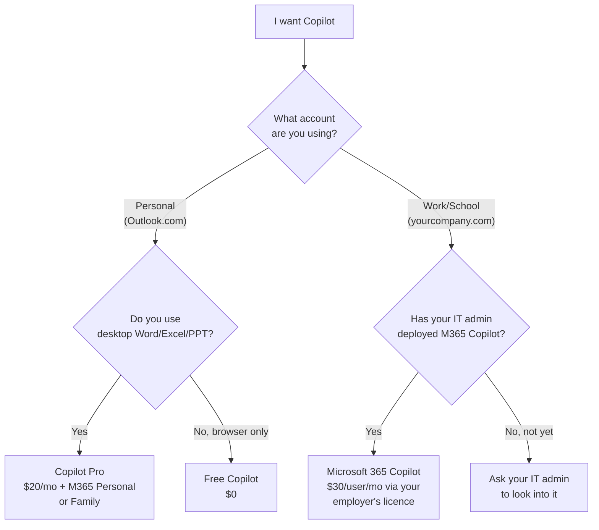

Microsoft sells **two products with almost the same name**, both called "Copilot", and the difference between them is the single most confusing $10/month decision in their entire AI lineup.

I'm a Copilot solution engineer at Microsoft, and this is genuinely the question I get asked most often — not by enterprise customers, by friends and family. So this is the plain-English answer.

If you're reading this, you've probably been on Microsoft's pricing page going back and forth. **Copilot Pro is $20. Microsoft 365 Copilot is $30.** They both promise "AI in your Office apps." So what's the actual difference?

Eight friends have texted me this exact question in the last six months. Eight.

**Quick links:**

- [TL;DR — the 30-second answer](#tldr)
- [The mental model — three coffee shops](#mental-model)
- [The 5 questions that tell you which one](#five-questions)
- [What Copilot Pro actually is](#copilot-pro)
- [What Microsoft 365 Copilot actually is](#m365-copilot)
- [What about Microsoft 365 E7?](#e7)
- [The side-by-side that actually helps](#comparison)
- [Real scenarios — which one I'd buy](#scenarios)
- [The hidden costs nobody mentions](#hidden-costs)
- [Common mistakes I see people make](#mistakes)
- [Your 4-week trial plan](#trial-plan)
- [FAQ](#faq)

🔄 **Living document. All prices in USD at time of writing (May 2026).** Microsoft tweaks Copilot pricing and features regularly — what you see here may differ from Microsoft's checkout page today. I've also simplified for clarity (channels, regional pricing, and EA discounts vary). For today's exact numbers, [Microsoft's pricing pages](https://www.microsoft.com/microsoft-365) are the source of truth. Spotted something off? [Let me know](/feedback/) and I'll update.

## TL;DR — The 30-Second Answer {#tldr}

| Question | Copilot Pro | Microsoft 365 Copilot |
|----------|-------------|------------------------|
| **Who is it for?** | Individuals, freelancers, side-businesses | Employees of organisations |
| **What account?** | Personal Microsoft account (the one you use for Xbox / Outlook.com) | Work or school account |
| **Headline price** | $20/user/month | $30/user/month |
| **Real all-in cost** | ~$30–$33/month (needs M365 Personal or Family) | $44–$99/user/month (depends on your base M365 plan) |
| **Who buys it?** | You. With a credit card. | Your IT admin. Via EA, CSP or Microsoft 365 Admin Centre. |
| **Sees your work emails/files?** | ❌ No — personal files only | ✅ Yes — your org's M365 data |
| **AI in Teams meetings?** | ❌ | ✅ |
| **Build custom AI agents?** | ❌ | ✅ (Agent Builder included; Copilot Studio is a paid add-on) |
| **Compliance, audit, eDiscovery?** | ❌ | ✅ |

**One sentence:** Copilot Pro is the AI for your personal life. Microsoft 365 Copilot is the AI for your work life. They are not interchangeable.

> 📋 **Do these 3 things before you buy anything:**
>
> 1. Open your Office apps. Are you signed in with a personal account (gmail-style) or a work account (yourcompany.com)? That answers half the question.
> 2. Ask yourself: do I want AI to read my work emails and files? If yes, you need M365 Copilot — which means your IT admin must deploy it. You can't buy it yourself.
> 3. If you're paying out of pocket and it's *for work*, stop. Ask your employer about Microsoft 365 Copilot first. Many companies are rolling it out and you might be reimbursed — or already entitled.

## The Mental Model — Three Coffee Shops {#mental-model}

The clearest way I've found to explain this is three coffee shops on the same street.

☕ **Free Copilot = the takeaway window.** You order at a window, take your coffee, walk away. The barista doesn't know you, doesn't know what you usually order, doesn't see what's in your bag. You get a coffee. That's it. Free Copilot is the AI web chat — you ask, it answers, nothing is connected to anything else.

🍵 **Copilot Pro = the indoor café where you bring your own laptop.** Same barista, same coffee, but now you've got a table, you're plugged in, your laptop is open with your own personal files. The barista can help you with anything on YOUR laptop — review your novel draft, polish your CV, fix that Excel budget you've been wrestling with — but she has no idea what your employer is paying you to do this week. Copilot Pro adds AI to YOUR Office apps — your personal Word, Excel, PowerPoint, Outlook.

🏢 **Microsoft 365 Copilot = the office café in your company building.** Different shop entirely. Your employee badge gets you in. The barista has access to your work calendar, your team's shared drive, the meeting notes from last Tuesday, the project files your colleague shared yesterday. She can help you with anything on YOUR WORK account — and the bill goes to your employer. **This is a fundamentally different product**, not just "Copilot Pro for businesses."

The most expensive mistake people make is buying Copilot Pro thinking it'll cover them for work. It won't. The work account simply can't see Copilot Pro features — they live in different worlds.

## The 5 Questions That Tell You Which One {#five-questions}

If the coffee-shop metaphor and the decision tree above haven't fully landed it yet, run through these five questions. Your answers will pin you to exactly one product.

### 1. Whose Office account do you mostly use?

- **Personal Microsoft account (Outlook.com, Hotmail, Live)** → Copilot Pro lane
- **Work or school account (yourcompany.com)** → M365 Copilot lane

### 2. Who's paying?

- **You** → Copilot Pro lane
- **Your employer** → M365 Copilot lane (or M365 E7 if they're going all in)

### 3. Do you need AI to see your work data?

- **No, I just want AI to help with my personal docs** → Copilot Pro
- **Yes, I want it to know about my work emails / files / meetings** → M365 Copilot

### 4. Will you use AI inside the desktop Office apps?

- **Yes** → You need Copilot Pro **+** M365 Personal/Family, OR your employer's M365 Copilot
- **No, browser-only is fine** → Free Copilot might be enough; skip both

### 5. Are you using this for work but paying personally?

- **Yes** → 🚩 Stop. Ask your employer about Microsoft 365 Copilot. Copilot Pro can't legally access your work data and may violate your employer's data-handling policy.

If you scored "all personal" on those five → Copilot Pro. If you scored "any work" on any of them → talk to your IT admin about M365 Copilot.

## What Copilot Pro Actually Is {#copilot-pro}

Copilot Pro is Microsoft's **consumer** AI subscription. Same Copilot brand, very different product underneath.

### What you get for $20/month

- **AI inside your desktop Office apps** — Word, Excel, PowerPoint, Outlook, OneNote on Windows and Mac
- **Priority access to the latest available OpenAI models** — when the free tier is busy, Pro users keep getting the latest models Microsoft has rolled out
- **Higher daily image generation limits** in Designer than the free tier
- **AI in Outlook for personal Outlook.com email** (not your work mailbox — that's M365 Copilot)
- **Copilot Pages** for collaborative drafting

### What you need underneath

Here's the part Microsoft's pricing page does not lead with: Copilot Pro on its own only gives you the web chat. To get AI inside desktop Office apps you also need a Microsoft 365 Personal or Family subscription.

| Combo | Approx monthly cost | What you actually get |
|-------|------------------------|------------------------|
| Copilot Pro alone | $20 | Web chat + priority models + image gen. No in-app AI. |
| Copilot Pro + M365 Personal | ~$30 | Full Pro experience — 1 person, 1 Microsoft account |
| Copilot Pro + M365 Family | ~$33 | Full Pro experience — Family covers up to 6 accounts for the M365 base, but **Copilot Pro is per-user** so each Pro user pays $20 extra |

This is the catch most people miss. The marketing says $20. The realistic bill is closer to $30 once you add the base plan.

### What it cannot do

- ❌ Read your work email, work calendar, work SharePoint or work OneDrive
- ❌ Join Teams meetings on your behalf and summarise them
- ❌ Be deployed centrally by IT — there's no admin centre, no audit, no policy
- ❌ Comply with most enterprise data-handling rules (it's a consumer SKU)
- ❌ Build agents or use Copilot Studio
- ❌ Use any organisation-purchased Microsoft licence — it's tied to your personal Microsoft account

> 📌 **Where to buy:** Direct from Microsoft at [copilot.microsoft.com](https://www.microsoft.com/en-us/store/b/copilotpro). Credit card, monthly billing, cancel anytime. There is no enterprise channel for Copilot Pro — by design.

> 📚 [Copilot Pro plan details on Microsoft](https://www.microsoft.com/en-us/store/b/copilotpro) · [Compare plans on this site](/licensing/copilot-pro/)

## What Microsoft 365 Copilot Actually Is {#m365-copilot}

Microsoft 365 Copilot is a **completely different product**, sold to organisations through your IT admin.

### What you get for $30/user/month

- **AI inside your work Office apps** — Word, Excel, PowerPoint, Outlook, OneNote
- **AI in Teams** — meeting summaries, action items, "what did I miss?"
- **Microsoft 365 Copilot Chat (the big one)** — ask Copilot about your org's data and it actually answers. "Summarise the last three emails from my CFO." "Where are the slides from last Tuesday's launch review?" "Draft a one-pager based on the strategy doc John shared in Teams yesterday."
- **Grounding on Microsoft Graph** — your emails, files, calendar, Teams chats, SharePoint, OneDrive for Business. Copilot only sees what you can see — same permissions, same security model.
- **Agent Builder included** — build no-code agents for your team without extra licensing
- **Interactive use of Copilot Studio** (autonomous agents and Studio credits are a separate add-on)
- **IT admin controls** — Purview audit, eDiscovery, sensitivity labels, content safety, conditional access, restricted SharePoint search
- **Enterprise data protection** — your prompts and responses are not used to train AI models, they stay inside Microsoft's service boundary, they're auditable

### What you need underneath

| Combo | Approx monthly cost per user | Who it's for |
|-------|------------------------------|---------------|
| M365 Business Standard + Copilot | ~$44 | Small business (≤300 users) |
| M365 Business Premium + Copilot | ~$52 | Small business that needs security |
| M365 E3 + Copilot | ~$69 | Enterprise — productivity baseline |
| M365 E5 + Copilot | ~$90 | Enterprise — full security suite |
| M365 E7 (Frontier Suite) | $99 | Enterprise — E5 + Copilot + Entra Suite + Agent 365, all in one SKU |

This is why "is M365 Copilot expensive?" depends entirely on what base plan you're already paying for.

### What it cannot do (and what it can)

- ❌ Be bought by individuals — no consumer SKU exists
- ❌ Be deployed without a qualifying M365 base plan
- ⚠️ Annual commitment used to be required, but Microsoft now offers monthly billing in most channels — check your specific contract or seller
- ✅ Be governed properly — every prompt, response and web search is logged in Purview
- ✅ Respect your existing M365 permissions — Copilot can only see what each user can see
- ✅ Work in regulated environments — GCC, GCCH, DoD have specific availability paths

> 📌 **Where to buy:** Your IT admin deploys this through Microsoft 365 Admin Centre, an Enterprise Agreement, or a Cloud Solution Provider. There is no "buy with a credit card" route — by design.

> 📚 [Microsoft 365 Copilot plan details on this site](/licensing/microsoft-365-copilot/) · [Copilot Control System guide](/blog/microsoft-365-copilot-control-system-complete-guide/) · [How M365 Copilot works layer-by-layer](/blog/how-microsoft-365-copilot-works-layer-by-layer/)

## What About Microsoft 365 E7? {#e7}

Worth a mention before the comparison table — because it changes the maths. **Microsoft 365 E7 (Frontier Suite)** went GA on 1 May 2026 at $99/user/month. It bundles E5 + Microsoft 365 Copilot + Entra Suite + Agent 365 in one SKU — roughly 15% cheaper than buying those components separately.

If your organisation already has E5 and is rolling out Copilot at scale, E7 is the cheaper path. Full breakdown: [Microsoft 365 E7 — Plain-English Guide](/blog/microsoft-365-e7-frontier-suite-everything-you-need-to-know/).

E7 has nothing to do with Copilot Pro — they're different markets entirely. But if you're deciding for an organisation, E7 belongs in the maths.

## The Side-by-Side That Actually Helps {#comparison}

Most comparison tables stop at "AI in Word — yes/yes" and leave you no wiser. Here's the version that actually answers the question.

| What you want to do | Free Copilot | Copilot Pro ($20) | M365 Copilot ($30) |
|----------------------|:------------:|:------------------:|:-------------------:|
| Chat with AI in a browser | ✅ | ✅ | ✅ |
| Use AI in desktop Word/Excel/PowerPoint | ❌ | ✅ | ✅ |
| Use AI in Outlook on **personal** email | ❌ | ✅ | ❌ |
| Use AI in Outlook on **work** email | ❌ | ❌ | ✅ |
| Generate images | Limited | ✅ (higher daily limit) | ✅ |
| Priority access to latest models | ❌ | ✅ | ✅ |
| "Summarise this Teams meeting" | ❌ | ❌ | ✅ |
| "What did my CFO email me last week?" | ❌ | ❌ | ✅ |
| "Find the slides from the launch review" | ❌ | ❌ | ✅ |
| "Draft from our shared SharePoint doc" | ❌ | ❌ | ✅ |
| Build a custom agent | ❌ | ❌ | ✅ (Agent Builder included; Studio is a separate add-on) |
| Be audited / discovered for legal hold | ❌ | ❌ | ✅ |
| Be paid for by your employer | ❌ | ❌ | ✅ (the whole point) |
| Be paid for by you personally | ✅ | ✅ | ❌ (no consumer route) |
| Cancel monthly with no commitment | ✅ | ✅ | Depends on contract — monthly is now available in most channels |

The pattern is unmistakable: **everything that involves work data is on the M365 Copilot side**. Everything that involves personal data is on the Copilot Pro side. There is no overlap on the data dimension.

## Real Scenarios — Which One I'd Buy {#scenarios}

Five real conversations, with the names changed.

### "I'm a freelance copywriter — 20 hours a week in Word"

> **Situation:** Mei runs her own copywriting business. She drafts blog posts, sales pages and email sequences for clients. Everything lives in OneDrive Personal. She uses Outlook.com for client comms. She wants AI to help her draft and polish faster.

**Copilot Pro all the way.** This is exactly what it was built for. Around $30/month all-in gets her AI in Word (where she lives), priority access to the latest models (matters for drafting quality), and image generation in Designer for hero images. Microsoft 365 Copilot wouldn't even be available to her — she's not a member of an organisation tenant. The free Copilot Chat would work but she'd lose the in-app drafting, which is the whole point.

### "I work at a 200-person consultancy that just rolled out M365 Copilot"

> **Situation:** Raj is a senior consultant. His IT team rolled out M365 Copilot to all consultants two months ago. He's been ignoring it. Now he sees Copilot Pro for $20 on the Microsoft store and wonders if he should also get that.

**Stop. He already has the better product.** Microsoft 365 Copilot does everything Copilot Pro does in the apps, AND grounds on his work data. Buying Copilot Pro on top would only help him on personal files he keeps on a personal Microsoft account — and most consultancies prefer you don't mix work and personal. What he actually needs is a 30-minute walkthrough of how to use the M365 Copilot his employer already pays $30/month for. Use [my 22 Copilot features guide](/blog/20-copilot-features-you-should-be-using/) — that's the better next step.

### "I'm a student and I want AI in PowerPoint for assignments"

> **Situation:** Alex is at uni, has a personal Microsoft account, uses Office on a MacBook for assignments. Saw Copilot Pro and is wondering.

**Check if your university has Microsoft 365 Education first.** Many universities now include some form of M365 plan — A1, A3 or A5 — and Copilot for Education is increasingly available either bundled or as an inexpensive add-on through the institution. If your uni doesn't offer it: Copilot Pro is fine for personal use, just remember the $20 doesn't include the M365 Personal you need to actually get it inside PowerPoint on your Mac.

### "I'm a small business owner with 8 staff"

> **Situation:** Sarah runs a small marketing agency. Eight staff. Everyone uses Microsoft 365 Business Standard. Half her team is asking about AI.

**Microsoft 365 Copilot via M365 Business Standard** is what she wants — that's the only path that connects AI to her business email, shared SharePoint, and Teams meetings. Total per person: roughly $44/month. She'd buy that through her Microsoft partner or directly in the M365 Admin Centre. **Do not buy Copilot Pro for staff** — it's a consumer SKU, tied to personal Microsoft accounts, with no admin controls, no audit trail, and no ability to see her company's data. It would be a worse experience AND a compliance headache.

### "My company hasn't deployed Copilot yet, but I want it for work"

> **Situation:** Tom works at a 5,000-person enterprise. They're "evaluating" Copilot. He's tired of waiting. Sees Copilot Pro for $20 and thinks he'll expense it.

**Don't.** Three reasons:

1. Copilot Pro literally cannot access his work data, so it won't even do the thing he wants.
2. Mixing personal AI subscriptions with corporate data may violate his employer's data-handling policy — check first.
3. The smarter move is to be the person who pushes the evaluation along internally. Send your IT or productivity lead [the deployment best practices guide](/blog/microsoft-365-copilot-deployment-best-practices-ultimate-checklist/). Many large orgs are pilot-ready and just need an internal champion.

## The Hidden Costs Nobody Mentions {#hidden-costs}

Both products have hidden costs the pricing pages don't lead with. Here they are honestly.

### Copilot Pro's hidden costs

| What | Cost | Why it's hidden |
|-------|------|-----------------|
| **M365 Personal/Family base subscription** | ~$10–$13/month | Required for in-app AI but priced separately |
| **No way to deduct as business expense** for consumer SKU in some tax jurisdictions | varies | Different to a business subscription |
| **Time spent context-switching** between personal and work accounts | hard to quantify | Most users discover this after they buy |
| **No autosave to your work cloud** | $0 but real | You can't save Pro-generated content to OneDrive for Business directly |

### Microsoft 365 Copilot's hidden costs

| What | Cost | Why it's hidden |
|-------|------|-----------------|
| **Base M365 plan requirement** | $14–$60/user/month | Pricing pages often quote just the $30 add-on |
| **Annual commitment** in many enterprise contracts | year-locked spend | Monthly is now available in most channels but EA defaults often still annualise |
| **Internal rollout effort** — change management, training, governance | substantial | Mostly invisible until you start |
| **SharePoint cleanup before deploy** to fix oversharing | weeks to months | This is the #1 thing IT admins underestimate |

The SharePoint cleanup is real. The whole point of M365 Copilot is that it sees what you can see — and most orgs have overshared permissions they never noticed.

> 💡 **Quick admin checklist:** Use the [Copilot Readiness Checker](/copilot-readiness/) to assess oversharing risk before rolling out M365 Copilot. And the [AI Cost Calculator](/ai-cost-calculator/) to model the total cost across your organisation.

## Common Mistakes I See People Make {#mistakes}

### Mistake 1: "I'll just buy Copilot Pro for work"

**The problem:** Copilot Pro is tied to a personal Microsoft account. Your work data lives in a tenant under a separate work account. They don't see each other. Even if you sign in with both, Pro features only fire on personal files.

**The fix:** Either get your employer to deploy M365 Copilot, or use Pro only for genuinely personal work.

### Mistake 2: "Copilot Pro and M365 Copilot are the same product, just at different prices"

**The problem:** They share the brand and overlap on "AI in Office apps" but they are architecturally different. Pro is a consumer SaaS. M365 Copilot is an enterprise grounded-AI platform with audit, compliance, multi-app orchestration and admin controls.

**The fix:** Read this entire post. The architecture is different, the data is different, the governance is different.

### Mistake 3: Buying Copilot Pro before checking with your employer

**The problem:** Many organisations are already rolling out M365 Copilot, are part of a Frontier Programme pilot, or have included it in a new contract. Some employers reimburse productivity tools.

**The fix:** Ask first. Slack your manager: *"Is the company looking at Microsoft 365 Copilot? I'd find it useful in my role."* You might save yourself $240/year.

### Mistake 4: Skipping the M365 Personal/Family base subscription

**The problem:** Pay $20 for Copilot Pro, install it, then notice there's no Copilot button in your Word desktop. The in-app integration needs the M365 base subscription.

**The fix:** Add M365 Personal (~$9.99/month) if it's just you, or Family (~$12.99/month) if it covers your household. Both unlock the desktop apps with Pro AI inside.

### Mistake 5: Confusing the names — "Microsoft 365 Copilot" vs "Copilot in Microsoft 365"

**The problem:** Microsoft uses both phrasings on different pages. *"Microsoft 365 Copilot"* (capitalised, no preposition) is the actual enterprise SKU at $30/user/month. *"Copilot in Microsoft 365"* is a marketing umbrella that can mean either Pro features bolted into M365 Personal/Family OR the enterprise SKU — depending on which page you're reading.

**The fix:** Always check the actual SKU name on your order confirmation or invoice. The two purchasable SKUs are literally **"Copilot Pro"** (consumer, $20) and **"Microsoft 365 Copilot"** (enterprise, $30/user). If your checkout page can't tell you which one you're buying in plain words, you're probably on the wrong page — back out and start again from [the official Copilot page](https://www.microsoft.com/copilot).

## Your 4-Week Trial Plan {#trial-plan}

If you've genuinely decided which product you need, here's how to validate it actually works for you before locking in.

### If you chose Copilot Pro

| Week | Do this |
|------|---------|
| **1** | Subscribe via [copilot.microsoft.com](https://www.microsoft.com/en-us/store/b/copilotpro). Make sure M365 Personal or Family is active. Open Word on desktop, write one document end-to-end using Copilot to draft / rewrite / summarise. |
| **2** | Excel week. Pick one spreadsheet you've been avoiding — budget, side-business expenses, anything. Use Copilot to generate formulas, summarise trends, build a chart from a prompt. |
| **3** | PowerPoint week. Convert a Word document into slides ("Create a presentation from this document"). Polish with Designer image generation. |
| **4** | Outlook personal email — try thread summarisation, tone-coached replies, "find the email where my landlord said…" patterns. By end of month, you'll know if the ~$30 all-in is worth it for you. |

### If you chose M365 Copilot (your employer deployed it)

| Week | Do this |
|------|---------|
| **1** | Make Meeting Recap your habit. After every Teams meeting, open the recap, pull action items, save them somewhere. This alone changes how you work. |
| **2** | Personalisation. Let M365 Copilot Chat learn how you write — feed it 3 samples of your typical emails and ask it to mirror your tone. |
| **3** | Try "What did I miss from [colleague]" and "Find the slides from [event/project]" prompts. These are the queries that prove the grounding actually works. |
| **4** | Build one Agent Builder agent for repetitive Q&A. 10 minutes. See [Agent Builder vs Copilot Studio vs Foundry](/blog/agent-builder-vs-copilot-studio-vs-foundry/) for which one to use. |

> 💡 **Track your time.** I genuinely recommend writing down what you saved per week. The proof of whether AI is worth it for *your* workflow is in how many hours you reclaimed — not what Microsoft Research says about other people.

## Final word

If you remember nothing else: the $10/month between Copilot Pro and Microsoft 365 Copilot is the difference between AI that helps with your life and AI that helps with your job. Both are useful. They are not interchangeable. Buying the wrong one is the most expensive mistake in this whole product line.

The [licensing simplifier](/licensing/) and [AI cost calculator](/ai-cost-calculator/) on this site can model the maths for your specific situation before you click buy.

## FAQ {#faq}

**1. What is the difference between Copilot Pro and Microsoft 365 Copilot?**

Copilot Pro ($20/month) is a personal consumer subscription that adds AI to your own Word, Excel, PowerPoint and Outlook. Microsoft 365 Copilot ($30/user/month) is an enterprise product your IT admin deploys — it adds AI to your work apps AND grounds it on your organisation's emails, files, meetings and Teams chats. The difference is the data Copilot can see.

**2. How much does Copilot Pro cost?**

Copilot Pro is $20 per user per month. But that's not the full price — Copilot Pro requires a Microsoft 365 Personal (~$9.99/month) or Microsoft 365 Family (~$12.99/month) subscription to unlock AI inside the desktop Office apps. So the realistic all-in cost is roughly $30 to $33 per month depending on which base plan you pick.

**3. Can I use Copilot Pro for work?**

You can technically install Copilot Pro alongside your work account, but it cannot access your organisation's data (emails, SharePoint, Teams chats, OneDrive for Business). It only works with your personal files. For work use your IT admin needs to deploy Microsoft 365 Copilot — and some organisations have policies that forbid using consumer AI subscriptions for company data.

**4. Is Copilot Pro worth $20 a month?**

It's worth it if you spend significant time in Word, Excel, PowerPoint or Outlook for personal or freelance work — the drafting, formula generation and slide creation features can genuinely save hours per week. It's NOT worth it if you only use Office in a browser, mainly use Outlook for personal email, or your employer has already given you Microsoft 365 Copilot.

**5. Do I need Microsoft 365 to use Copilot Pro?**

Yes if you want the in-app experience. Without a Microsoft 365 Personal or Family subscription, Copilot Pro only works in the Copilot web chat — you lose the in-app AI features in Word, Excel, PowerPoint and Outlook desktop. The $20 by itself buys you priority access to the latest models and higher image generation limits in the web experience, but not the in-app integration most people are actually paying for.

**6. Can my company buy Copilot Pro for employees?**

No. Copilot Pro is a personal consumer subscription tied to a Microsoft account, not a work account. It cannot be centrally managed, audited, or governed by your IT admin. For business and enterprise use, your IT admin needs to deploy Microsoft 365 Copilot ($30/user/month) which requires a base Microsoft 365 plan (E3, E5, Business Standard, or Business Premium).

**7. Can I have both Copilot Pro and Microsoft 365 Copilot?**

Yes, technically — they're tied to different accounts (personal vs work). But there's almost no reason to. If your work has given you Microsoft 365 Copilot, it already does everything Copilot Pro does for personal-style work, plus the enterprise data grounding. The exception is if you have a genuine personal side-business with its own files you keep separate from your employer's account.

**8. Which AI models does Copilot Pro use?**

Copilot Pro gives you priority access to the latest OpenAI models Microsoft offers in the Copilot consumer experience, even during peak hours when free users may be queued or fall back to a lower-tier model. Microsoft updates which specific models power the experience regularly, so exact model names rotate. The durable promise is priority + latest, not a specific model number.

**9. How is Copilot Pro different from the free Copilot chat?**

The free Copilot Chat (formerly Bing Chat / now just "Copilot") is a web experience — AI conversation in a browser. Copilot Pro adds three things: AI inside your desktop Office apps (Word, Excel, PowerPoint, Outlook), priority access to the latest models during peak times, and higher daily image generation limits in Designer.

**10. Does Copilot Pro include image generation?**

Yes. Copilot Pro includes higher image generation limits in Designer than the free tier — a higher daily allocation of fast "boosts". Once you exceed boosts, image generation still works but runs more slowly. Microsoft adjusts the exact boost counts periodically, so check the current Copilot Pro page for today's numbers.

**11. If I leave my job, what happens to my Microsoft 365 Copilot access?**

Microsoft 365 Copilot is tied to your work account — when you leave, your IT admin disables that account and you lose Copilot along with everything else. Your prompts, chat history and any Copilot-generated content in mailboxes/files belong to the organisation, not to you. This is a key reason consumer-AI-for-work doesn't translate cleanly.

### More quick answers

- **"Will Microsoft merge Copilot Pro and M365 Copilot eventually?"** I haven't seen any signal that they will. They serve different markets (consumer vs enterprise) with very different governance requirements. Don't bet on them merging.
- **"Is there a Copilot Pro for business?"** No. The closest thing is Microsoft 365 Copilot at $30/user/month, but it requires a base M365 plan — there's no $20 standalone business AI subscription from Microsoft.
- **"What about Copilot in Bing / Edge / Windows?"** Those are all free Copilot — same product, different surfaces. None of them are Pro.
- **"Does Copilot Pro work in Government / GCC / GCCH?"** Copilot Pro is a commercial consumer SKU; government cloud regulations generally rule it out for work data. Microsoft 365 Copilot has specific availability paths in GCC/GCCH/DoD — check with your account team.

---

> **Disclaimer:** The views and opinions expressed in this article are my own and do not represent the official positions of Microsoft. All pricing mentioned is in USD and was sourced from official Microsoft pricing pages at the time of writing — pricing, features and availability change regularly. For today's exact prices, check Microsoft's [Copilot Pro page](https://www.microsoft.com/en-us/store/b/copilotpro) and [Microsoft 365 Copilot page](https://www.microsoft.com/en-us/microsoft-365/copilot/enterprise).

---

*Have a question I haven't answered, or spotted something out of date? [Send me feedback](/feedback/) — I update this post when things change.*
