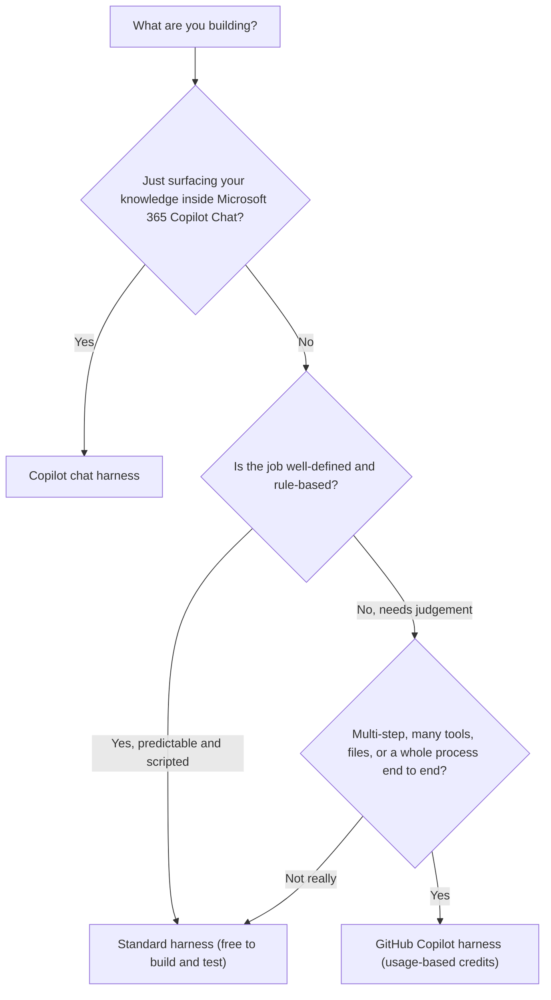

**The short version:** Copilot Studio now runs agents on one of **three "harnesses"** — the engine behind your agent. The new GitHub Copilot harness is the most capable: you describe an agent in plain language and it plans, reasons, works with files, and calls tools to get a job done end to end. The trade-off is billing — it's usage-based (Copilot Credits) from the moment you start building, and the "free with Microsoft 365 Copilot" treatment that applies to the other harnesses doesn't apply here.

> 🧩 **One thing to get straight first:** the GitHub Copilot harness (a runtime *inside Copilot Studio*) is **not** the same as GitHub Copilot (the coding assistant developers buy per seat). Same family name, different products, different bills. [Jump to why ↓](#not-github-copilot)

<p></p>

*This is the new experience (turn on "New experience" if you don't see it). Instead of drawing out topics and flows, you describe the agent in plain language. (Lab tenant.)*

<div class="living-doc-banner">

🔄 **This is a fast-moving area.** The GitHub Copilot harness reached general availability on 3 August 2026 ([announcement](https://techcommunity.microsoft.com/blog/copilot-studio-blog/more-powerful-agents-and-workflows-for-autonomous-business-processes-introducing/4542969)), after a production-ready preview that began in June 2026. Several capabilities *inside* it — memory, the Foundry IQ connection, and connected agents in the new experience — are still previews in their own right, and the billing detail is still settling: developer and trial environments move to usage-based billing on 1 September 2026. Always confirm on Microsoft Learn: [Choose a harness](https://learn.microsoft.com/en-us/microsoft-copilot-studio/harnesses-overview), [usage-based billing overview](https://learn.microsoft.com/en-us/microsoft-copilot-studio/agents-experience/billing-credit-overview) and [manage harness costs](https://learn.microsoft.com/en-us/power-platform/admin/manage-usage-github-copilot-harness). **Last verified: 19 August 2026.**

</div>

*In a hurry? **Admins** → [the 1 September checklist](#sept-billing) and [how to cap the spend](#paying). Makers → [building one, with screenshots](#how-to).*

---

## Wait — what's a "harness"? {#what-is-a-harness}

I'll be honest: the first time I saw the word "harness" I had to go and look it up too. Here's the way I now think about it.

When you build an agent, three things are in play:

1. **Your design** — what you want the agent to do.
2. **The model** — the AI that does the reasoning and writing.
3. **The bit in the middle** — something has to decide *when* to call the model, *what* to send it, how to read the answer, and which tools to call next.

That bit in the middle is the **harness**. In Microsoft's own words:

> "The harness is a *runtime* that exists between the two: it determines when to call the model, what components to send it, interprets what comes back, and calls the right tools."
> — [Microsoft Learn, *Choose a harness*](https://learn.microsoft.com/en-us/microsoft-copilot-studio/harnesses-overview)

If it helps: the model is the engine, your design is the destination, and the harness is the driver deciding the route and when to change gear.

The new part in 2026 is that Microsoft's documentation now describes **three** harnesses — and which one you build on changes what your agent can do and how you're billed.

---

## The three harnesses at a glance {#three-harnesses}

Here's the plain-English comparison, straight from Microsoft's *Choose a harness* guidance:

| | **GitHub Copilot harness** | **Standard harness** | **Copilot chat harness** |
|---|---|---|---|
| **Best for** | Complex, multi-step business processes | Rule-based agents and structured, repeatable conversations | Extending Microsoft 365 Copilot Chat with your own knowledge |
| **How it works** | Takes a goal, breaks it into steps, adapts as it goes | Follows the topics and rules you define | Connects your knowledge into Microsoft 365 Copilot |
| **Recovers from problems** | Retries and finds another path automatically | Follows the paths you built | Not a focus |
| **Works with files** | Natively creates & edits Word, Excel, PowerPoint, PDF | Not a focus | Not a focus |
| **Skills & memory** | Yes | Not a focus | Not a focus |
| **Who you can publish to** | Internal teams **or external customers** | Internal teams **or external customers** | **Internal teams only** |
| **A real example** | Accounts payable — reads invoices, matches them to purchase orders, routes exceptions for approval | Internal help desk — answers common questions and routes simple requests through a workflow | Employee onboarding — answers questions from your SharePoint knowledge |
| **Billing** | **Copilot Credits (usage-based)** | Standard licensing + Copilot Credits | Consumption, or included in the Microsoft 365 Copilot licence |

Two rows there are worth pausing on. **Publishing reach** is the one people discover too late: the Copilot chat harness publishes to internal teams only, so if the agent ever needs to face customers, that harness is out — regardless of how well it fits otherwise. And the examples row is the fastest way I've found to place a new scenario: if it sounds like accounts payable, it's the GitHub Copilot harness; if it sounds like a help desk, standard; if it sounds like "answer from our SharePoint", Copilot chat.

<p></p>

*The **"GitHub Copilot"** tags and the "Uses Copilot Credits" pill are the tell — this is the metered harness. The box at the top is the newer describe-it-in-plain-English route, and "Other ways to build" at the bottom is where the standard, rule-based agents and flows still live. (Lab tenant, recaptured 24 August 2026.)*

Two ways in from this screen. Describe what you want in the box at the top and Copilot Studio drafts the agent or workflow for you — plain English, nothing to wire up first. Or, if you've already written your instructions somewhere else, paste them straight into the same box. Either route lands you on the same harness; it only changes how you start. What neither one gives you is a standard, rule-based agent — that's still behind **"Other ways to build"** at the bottom.

The box drafts an agent. It doesn't finish one. You still read what it wrote and fix the bits it guessed — that part hasn't been automated away.

The one-line summary I keep in my head: standard = follows your rules, GitHub Copilot = works out the steps, Copilot chat = grounds Microsoft 365 Copilot in your knowledge.

---

## When should you use which harness? {#when-to-use}

So which one do you reach for?

- **GitHub Copilot harness** — when the agent needs to reason through a longer task, work across several tools, handle files, or run a real business process end to end. (Onboarding, accounts payable, triage-and-route, "read these and decide" work.)
- **Standard harness** — when the scenario is **well-defined and rule-based** and you want consistent, predictable answers. (FAQ bots, structured intake, "always do exactly this" flows.)
- **Copilot chat harness** — when you just want to extend Microsoft 365 Copilot Chat with your organisation's knowledge so people get grounded answers without leaving Copilot.

Or follow the tree:



*(Choosing between build tools — Agent Builder vs Copilot Studio vs Foundry — rather than harnesses within Copilot Studio? That's a different decision: see [Agent Builder vs Copilot Studio vs Foundry](/blog/agent-builder-vs-copilot-studio-vs-foundry/).)*

### What doesn't come with you {#what-you-lose}

Most harness comparisons — mine included, until I looked properly — measure the new one by what it adds. The uncomfortable half is what it takes away, and that half isn't in the table.

That tree tells you what each harness is *for*. It doesn't tell you what you give up. Microsoft's own [Choose a harness](https://learn.microsoft.com/en-us/microsoft-copilot-studio/harnesses-overview) table has the same shape: a row for everything the GitHub Copilot harness adds, and no row for what it leaves behind.

Three of the constructs you'd reach for when authoring a standard-harness agent are documented as standard-harness features. Because the choice is one-way, it's worth knowing whether your design leans on them:

| Standard-harness authoring construct | What it means for a GitHub Copilot harness agent |
|---|---|
| [Variables](https://learn.microsoft.com/en-us/microsoft-copilot-studio/authoring-variables-about) — topic, global, system and environment scopes | No one-for-one equivalent in agent authoring. State goes into memory, a tool, or a persistent store — and memory is per-user and cleared after inactivity, so it isn't a general-purpose variable. |
| [Power Fx](https://learn.microsoft.com/en-us/microsoft-copilot-studio/advanced-power-fx) expressions inside a topic | Not carried across. That logic gets rebuilt as instructions, a tool, or code — a real shift if your makers are low-code. |
| [Adaptive Cards](https://learn.microsoft.com/en-us/microsoft-copilot-studio/adaptive-cards-overview) authored in a topic | The hardest one. If the value of your agent *is* the form it puts in front of people, validate that experience before you commit. |

One nuance worth keeping straight, because it can look like a contradiction: [Workflows](https://learn.microsoft.com/en-us/microsoft-copilot-studio/workflows-experience/flows-overview) run on the GitHub Copilot harness too, and the Workflow canvas has its own Variable building block. That's a different construct from the standard harness's four-scope variable model — same word, different thing.

The tell is on the Learn pages themselves: all three carry the same banner, *"Features in this article are powered by the standard harness."* This is the sort of thing that moves, so check those three pages before you quote them. **Last verified: 24 August 2026.**

---

## So what *is* the GitHub Copilot harness? {#github-copilot-harness}

Microsoft describes it as a **redesigned authoring and runtime environment** with a natural-language-first approach. Instead of drawing out explicit topics, triggers, and branching flows (the standard-harness way), you describe your agent in plain language and the system builds the underlying configuration.

What this actually lets you do, out of the box:

- **Enhanced orchestration** — it takes a goal, breaks it into steps, and **recovers** when a step fails or the request changes. *In practice: someone asks for their leave balance but never gives an employee ID. Instead of firing the HR lookup and failing, the agent notices what's missing and asks for it first.*
- **Files as first-class** — it can create and edit Word, Excel, PowerPoint, and PDF natively, and reason over them. *So "read these three quotes and give me a one-page comparison" ends with an actual document, not a wall of chat text.*
- **Tools, knowledge & MCP** — it calls connectors, knowledge sources, MCP servers and **connected agents**, deciding when to use each.
- **Skills** — reusable, self-contained instruction packages you build once and add to many agents. *Think a "look up someone's manager" skill: write it once, and your HR, IT and facilities agents all reuse the same one.*
- **Memory** *(preview)* — per-user context so an agent remembers preferences across conversations (it's private from makers, off in group chats and Teams channels, and cleared after ~28 days of inactivity).

Microsoft's example scenario is a good "aha": an **accounts-payable** agent that reads invoices, matches them to purchase orders, and routes the exceptions for approval — the kind of messy, multi-step, decision-heavy process that a rules-based flow struggles with.

The mental shift: on the standard harness you *design the path*. On the GitHub Copilot harness you *describe the destination* and it works out the path.

---

## The timeline — GA, previews, and the 1 September billing change {#whats-new}

A quick, honest timeline (from Microsoft's public announcements and docs — I'm sticking to what's actually documented):

- **June 2026** — the new experience shows up in Copilot Studio's *What's new* as a **production-ready preview**: *"The GitHub Copilot harness uses an enhanced orchestration runtime for improved response quality and reasoning, available alongside the classic experience."* Memory, Skills, connected agents and Microsoft IQ grounding land around the same time.
- **3 August 2026** — **general availability.** Microsoft announces the harness GA on the Copilot Studio blog, [*"More powerful agents and workflows for autonomous business processes"*](https://techcommunity.microsoft.com/blog/copilot-studio-blog/more-powerful-agents-and-workflows-for-autonomous-business-processes-introducing/4542969), describing it as bringing "the coding and reasoning capabilities behind our most advanced agent experiences" into Copilot Studio. (Learn's *What's new* index is a dated log — its June entry still says preview because that's what was true in June.)
- **1 September 2026** — developer and trial environments move to usage-based billing. If your makers have been experimenting in a dev environment, this is the date to plan for. [More below ↓](#sept-billing)
- **As of August 2026** — it's the experience you're guided into at [copilotstudio.microsoft.com](https://copilotstudio.microsoft.com) (toggle **New experience** on if you don't see it). To build the older way, turn the toggle off or choose "Other ways to build."

<p></p>

*The new experience has its own left rail — note **Workflows**, the GitHub Copilot harness automation surface. It isn't just a rename: the classic experience keeps Agents, Flows and Tools, and standard-harness agent flows still live there. That's why the menu looks different depending on which experience you're in. (Lab tenant.)*

One distinction worth holding onto: the new experience has **two** build types, both on the GitHub Copilot harness. Agents reason dynamically — they plan, adapt, and recover. Workflows are deterministic: they follow the exact path you author, so the same input always produces the same output — the month-end expense run that must pull the receipts, build the PDF and mail the manager in that order, every time, is a Workflow, not an Agent. And a nuance that's specific to Workflows — testing them from the designer or an agent's test chat doesn't consume capacity; only their live, executed actions meter. (More in [Workflows overview](https://learn.microsoft.com/en-us/microsoft-copilot-studio/workflows-experience/flows-overview).)

<p></p>

*A Workflow, mid-build. The palette mixes deterministic building blocks (If/Else, Loop, Function) with AI actions and a Human-review step — and every flow hangs off a **trigger** (here, Manual / on-demand). This is the "follows the path you author" half of the harness. (Lab tenant.)*

> ⚠️ **"GA" doesn't mean everything inside it is finished.** General availability applies to the harness — not to every feature you'll touch. Memory, the Foundry IQ connection and connected agents in the new experience are still previews in their own right, and the billing rules are still moving (see [1 September](#sept-billing) below). If you read an earlier version of this post that called the harness a preview, this is the correction.

---

## Is this the same as GitHub Copilot (the coding one)? No. {#not-github-copilot}

This is the question I get asked most, so let's clear it up.

| | **GitHub Copilot** | **GitHub Copilot harness (in Copilot Studio)** |
|---|---|---|
| **What it is** | AI coding assistant for developers | A runtime for building business agents |
| **Where you use it** | VS Code, JetBrains, github.com | copilotstudio.microsoft.com |
| **Who it's for** | Software developers | Business makers & enterprise builders |
| **How it's billed** | Separate GitHub plans (some per user / seat), billed by GitHub | Copilot Credits through Copilot Studio |
| **Do you need it for the other?** | — | **Not listed as a requirement** — Copilot Studio setup doesn't ask for a GitHub Copilot seat |

The way I explain it: Microsoft's GA announcement says the harness brings *"the coding and reasoning capabilities behind our most advanced agent experiences"* into Copilot Studio, naming **Copilot Cowork** and the GitHub Copilot coding agent as those experiences. Shared capabilities, in other words — not a shared product. (When I first wrote this I couldn't find even that stated publicly; the GA post closed the gap.) The part that matters in practice is simpler: you don't buy GitHub Copilot seats to use it. Nothing in the Copilot Studio setup asks for one.

Two different bills, two different products. If a customer's worried "do we need GitHub licences now?" — the answer is no.

---

## The part everyone asks about: credits & consumption {#credits}

Here's the single most important thing to understand, and the reason I wanted to write this down.

On the **standard harness**, the rule of thumb has always been: free to build and test, you pay once you publish and run at scale — and a lot of internal, licensed usage is zero-rated (see our [Copilot Studio pricing guide](/blog/copilot-studio-pricing/) and [What are Copilot Credits?](/blog/copilot-credits-explained/)).

**The GitHub Copilot harness changes that rule.** In Microsoft's own words:

> "Unlike the standard harness, which starts billing after publish, the GitHub Copilot harness charges credits from the moment you start building. Experiences such as creating an automated solution with natural language, previewing and testing the agent, and generating and creating agent evaluations all consume credits."
> — [Microsoft Learn, *usage-based billing overview*](https://learn.microsoft.com/en-us/microsoft-copilot-studio/agents-experience/billing-credit-overview)

And crucially: **the Microsoft 365 Copilot "no extra charge for licensed users" treatment does *not* apply here.** On this harness, **build, test, evaluate and run all consume credits — regardless of whether the person holds a Microsoft 365 Copilot licence. (One exception worth banking: testing a Workflow** from the designer or an agent's test chat doesn't meter — only its live runs do.)

### Where the two models differ — side by side {#billing-compare}

Here's the fuller version — the same at-a-glance matrix Microsoft ships in its **public** [Copilot Studio Licensing Guide](https://go.microsoft.com/fwlink/?linkid=2320995) (August 2026), rebuilt here as a readable table so it's the version you can put in front of a customer:

| | Copilot chat harness | Standard harness | **GitHub Copilot harness** |
|---|---|---|---|
| **Agent creation** | | | |
| Manual (non-LLM) configuration | Not billed | Not billed | Not billed † |
| Natural-language authoring | *n/a* | Not billed | **Usage-based** |
| Evaluations | *n/a* | Not billed | **Usage-based** |
| Test / Preview | Not billed | Not billed | **Usage-based** |
| **Agent runtime** | | | |
| External channels (web, apps, social) | *n/a* | Published rate card | **Usage-based** |
| Users **without** a Microsoft 365 Copilot licence | Published rate card | Published rate card | **Usage-based** |
| Users **with** a Microsoft 365 Copilot licence | Not billed (fair use) | Not billed (fair use) | **Usage-based** |
| **Supporting features** (same for all three) | | | |
| Standard, premium & custom connectors | Not billed | Not billed | Not billed |
| On-premises data transfer for Power Platform connectors | Not billed | Not billed | Not billed |
| Store structured data in Dataverse | Not billed ‡ | Not billed ‡ | Not billed ‡ |
| Managed Environments | Not billed § | Not billed § | Not billed § |
| Manage from the Power Platform admin centre | Not billed | Not billed | Not billed |

<small>**†** Only the LLM-powered maker steps (natural-language authoring, evaluations, preview) bill on the GitHub Copilot harness — purely manual, non-LLM configuration doesn't. In practice you *are* using the LLM to build here, so budget as if it meters from the first build action. ‡ Dataverse for Copilot Studio ships with default capacity (15 GB database, 20 GB file, 2 GB log); more is purchasable in 1 GB increments. § Managed Environments is included for Copilot Studio–related features.</small>

**Read the "Users with a Microsoft 365 Copilot licence" row first — it's the one that changes everything.** On the other two harnesses that person can be zero-rated, but only when it's **employee-facing** use, by an authenticated licensed user, on a Microsoft 365 surface (Copilot / Teams / SharePoint), inside fair-use limits Microsoft can revise as the product evolves. Step outside any one of those and the published rate card applies ([the full boundary here](/blog/copilot-studio-pricing/#included)). On the GitHub Copilot harness, none of it applies: agent authoring, testing, evaluating and running all consume credits, licence or no licence.

The reassuring flip side — the whole **Supporting features** block (connectors, on-premises data movement, Dataverse, Managed Environments, admin-centre management) is not separately billed on *any* harness.

> 🧮 **Want to model it before you build?** Microsoft has a public [Copilot Studio agent usage estimator](https://microsoft.github.io/copilot-studio-estimator/) — pick agent type, traffic, orchestration, knowledge and tools to forecast credit consumption.

### What actually drives the credit burn {#cost-drivers}

Microsoft describes GitHub-Copilot-harness billing as **usage-based and complexity-tiered**, covering three things: the model tokens, the tools it calls (knowledge, MCP, connectors), and the harness itself. So your burn goes up with:

- **Task complexity** — more reasoning steps and retries = more tokens.
- **How much context** the agent pulls in, and **how much of your data** it reaches into.
- **The tools and actions** it invokes to finish the job.

> ⚠️ **One honest gap:** for the standard harness Microsoft publishes a neat per-action rate card (a classic answer = 1 credit, a generative answer = 2, an agent action = 5, tenant graph grounding = 10 — full table in [Copilot Credits explained](/blog/copilot-credits-explained/#rate-card)). For the GitHub Copilot harness, I could *not* find an equivalent public per-action table — Microsoft describes it as token/complexity-based and shows **ranges**, not fixed per-feature prices. So don't promise a customer a tidy "X credits per run." Pilot it, watch the meter, then model it.

### How you pay, set it up, and keep it capped {#paying}

**Two ways to pay:**

- **Pay-as-you-go** — **$0.01 per credit**, billed through a linked Azure subscription. Best for pilots and unpredictable usage.
- **Prepaid capacity** — capacity packs, or pre-purchased **Copilot Credit Commit Units (CCCUs)** (a one-year pool bought in the Azure portal), for steady, predictable usage.

**Setting up pay-as-you-go** *(the part people miss)* — it's an **Azure-billed** meter, so there's a bit of setup:

1. You need an Azure subscription in the tenant, and someone with **Owner/Contributor** on it (to create the resource and register providers).
2. A Power Platform / Global / Dynamics 365 / Environment admin creates a **billing policy** in Power Platform admin centre → Licensing → Pay-as-you-go plans → New billing plan, points it at that Azure subscription + a resource group, and links the environment(s) (production or sandbox).
3. That quietly creates a **"Power Platform account resource"** in Azure — every Copilot Studio meter for those environments bills to it. Full steps: [Set up pay-as-you-go](https://learn.microsoft.com/en-us/power-platform/admin/pay-as-you-go-set-up).

<p></p>

*This is the setup step people skip. One billing policy ties an **Azure subscription + resource group** to your environment(s) — and lists Copilot Studio among the metered products. That link is what routes your credit usage to an Azure bill. (Lab tenant — subscription redacted.)*

**Where the cost actually shows up** — this is the bit I had wrong in my head at first:

| Where | What you see |
|---|---|
| **PPAC → Licensing → Copilot Studio** | Credit **consumption** (units) by environment & agent, plus a downloadable usage report |
| Agent's **Monitor** tab | Credits consumed by that one agent |
| **Azure Cost Management** (on the linked subscription) | The actual **dollars** — filter to the *Power Platform account resource* named after your billing plan / the Copilot Studio meter (updates daily, ~24h lag) |
| **Azure invoice** | Where the PAYG charges land |

So: PPAC tells you the credits; Azure tells you the money. The Microsoft 365 admin centre is where you *buy licences and prepaid capacity packs* — it doesn't show your Copilot Studio PAYG spend. (It does now have a **Copilot → Cost Management** dashboard, but as of August 2026 that covers Copilot Cowork and the Work IQ API, and points Copilot Studio back to PPAC and Azure. Worth knowing anyway: prepaid Copilot Credit capacity is shared across all three, so a heavy month in Copilot Studio leaves less for the others.)

⚠️ **One more gap worth naming:** consumption is attributed at **environment and agent** level — not to the individual maker or end user who triggered it. So you can answer *"which agent burned the credits?"*, but not *"which person?"* from the billing data. Plan your chargeback model around agents and environments, not people.

<p></p>

*And here's the part PPAC won't show you: the **actual dollars**, in Azure Cost Management. Notice it surfaces under the Power Platform / Power Automate service family and your billing-plan resource group — there's no line literally called "Copilot Studio." (Lab tenant — subscription redacted; the figures are lab-tiny.)*

**Keeping it capped** — the levers that actually work:

There are two rings of control here, and people usually only know about the inner one. The **environment** ring decides how a whole environment can reach credits; the agent ring sets a monthly limit for one use case — which becomes an actual stop only if you also switch on the hard stop.

**Ring 1 — the environment.** In PPAC → Licensing → Copilot Studio → Manage Copilot Credits, pick an environment and you set an **allocation** plus four enforcement rules:

| Question | The setting |
|---|---|
| Should this environment have its own reserved prepaid credits? | The **allocation** — how many credits you reserve for it |
| Should admins be warned as it fills up? | **Alert** |
| May it dip into unallocated tenant capacity? | **Tenant pool** — on/off |
| May it keep going by billing Azure? | **Pay-as-you-go** — on/off |
| Should it be cut off when the capacity is gone? | **Deny** further consumption |

- ⚠️ **New environments can appear with tenant-pool draw already on.** That's the quiet one — a maker spins up an environment and it can immediately reach shared capacity nobody budgeted for. Worth a recurring check rather than a one-off.
- ⚠️ **Turning off tenant-pool draw doesn't stop spend if PAYG is linked.** The two switches are independent: block the pool and the consumption just flows to Azure instead. If you actually want a stop, you need **deny** (or the per-agent hard stop below).
- ⚠️ **A governance trap in the tenant settings.** Letting *environment* admins manage credit allocation doesn't scope them to their own environments — it gives them allocation control **across the whole tenant**. Keep that with tenant admins unless you genuinely mean it.

**Ring 2 — the agent.**

- **Per-agent monthly limit (the most precise stop you have).** In PPAC → Licensing → Copilot Studio → Manage Agents, set a monthly credit limit per agent — with notifications *and* an optional hard stop that turns the agent off when it hits the limit. Set the limit without the hard stop and you get a warning, not a ceiling. It works whether the environment is prepaid or PAYG, so it's your best guardrail against a runaway build/test agent.
- **Azure budgets & cost alerts.** On the Power Platform account resource in Azure Cost Management you can set budgets and alerts — but note they only notify; they don't stop spend. Pair them with the per-agent hard stop.
- ⚠️ **Running out of prepaid capacity doesn't stop a PAYG environment.** If PAYG is linked, exhausting the allocation doesn't disable anything — the overage simply flows to Azure. That's convenient, and exactly why the per-agent limit matters.

**Does it actually stop the spending?** The honest summary — and read the ✓s as *operational* stops, not penny-perfect financial ceilings, because some overage runs before enforcement bites:

| Lever | Warns you | Actually stops it |
|---|---|---|
| Azure budget / cost alert | ✓ | − |
| Credit-usage alert on the environment | ✓ | − |
| Turning off tenant-pool draw | − | Only if PAYG is also off |
| **Deny further consumption** (environment) | − | ✓ |
| **Per-agent hard stop** | ✓ | ✓ (that agent) |

**And what does "running out" actually look like?** Worth setting expectations before it happens: when available credits are exhausted, agents stop responding to end users, and makers lose natural-language authoring, preview/test, and evaluation generation in that environment. Microsoft does allow some overage beyond the limit, describing it as similar to a grace period — but don't treat it as guaranteed capacity to plan around. Details: [enforcement policy for credits](https://learn.microsoft.com/en-us/microsoft-copilot-studio/agents-experience/enforcement-policy-credits).

<p></p>

*The guardrail I'd set on anything experimental: a per-agent monthly limit **plus** the "turn off the agent at 100%" hard stop. Azure budgets only *warn* you — this actually stops the spend, and it works for pay-as-you-go too. (Lab tenant.)*

The mental model: PPAC = credits + limits, Azure = dollars + budgets. Set a per-agent hard stop on anything experimental, because the meter runs from the first build action.

<p></p>

*The screen to bookmark for **credits**: Power Platform admin centre → Licensing → Copilot Studio — consumption by environment/agent, plus Manage Agents for per-agent limits. For the actual dollar spend, head to Azure Cost Management on the linked subscription. (Lab tenant — figures zeroed.)*

---

## Governance & keeping costs under control {#governance}

Because the meter runs from the first build action, the questions I get from admins and CISOs are less *"what can it do?"* and more *"who can spend, and how do we cap it?"* Here's what I've been able to confirm from Microsoft's docs.

**Who can build one.** The tenant admin **acquires** the Copilot Studio tenant licence and assigns per-user Copilot Studio user licences to makers in the Microsoft 365 admin centre. You can further restrict *who* builds through the Copilot Studio authors setting in the Power Platform admin centre, which you point at an Entra security group. Two reassuring details: people who just *use* a published agent through a channel need no special licence, and guest users can't access Copilot Studio at all.

**Sharing has a catch worth knowing.** When you share a GitHub-Copilot-harness agent from the *new* experience, you're granting **view-and-test rights only** — and the people you share with need their own Copilot Studio per-user licence (or a trial). To let someone actually edit the agent, you switch it back to the classic experience and grant them environment security roles. So for multi-maker delivery teams, decide up front who builds where. ([Share agents](https://learn.microsoft.com/en-us/microsoft-copilot-studio/agents-experience/authoring-share-agent))

**Turn the model on first.** The natural-language *creation* experience runs on **Anthropic models**. An admin has to allow Anthropic in the Microsoft 365 admin centre and enable external models for the environment; without that, natural-language creation is unavailable (the classic build paths still work). Worth checking two gates and one compliance boundary before you switch it on: Anthropic must be allowed both in the Microsoft 365 admin centre *and* on the Power Platform environment (Settings → Product → Features) — miss either and the toggle stays greyed out. And per Microsoft's current docs, Anthropic models in Copilot Studio are excluded from EU Data Boundary commitments, FedRAMP isn't achieved, and PCI DSS isn't applicable — so if you're bound by any of those, review before enabling. ([External models & exclusions](https://learn.microsoft.com/en-us/power-platform/admin/allow-llm-generative-responses))

<p></p>

*Why the "describe your agent" box sometimes isn't there: it needs both gates. Anthropic has to be allowed in the Microsoft 365 admin centre *and* ticked here on the environment. See **Mistral** right below it — greyed out precisely because it's still off in the admin centre. That's the dependency, made visible. (Lab tenant.)*

**Cap the spend.** I've covered this in full above — the environment allocation and its four enforcement rules, then the per-agent monthly limit with its optional hard stop. Rather than repeat it: [how you pay, and keep it capped](#paying).

**Govern it like the rest of Power Platform.** These agents live in **Power Platform environments** — which is the good news for admins, because the environment strategy and data loss prevention (DLP) policies you already run apply to them too. DLP can restrict which connectors, knowledge sources and channels an agent may use — so keep dev / test / production separate, watch consumption in the admin centre, and download recent conversation transcripts from the agent's Monitor tab for review (any window within the last 29 days; note the data can take up to an hour to appear). One reassurance for security teams: Microsoft says each GitHub-Copilot-harness task runs in a secure sandbox governed by Copilot Studio.

### Find them before you govern them {#find-agents}

The awkward bit: you can't cap what you can't see, and a GitHub-Copilot-harness agent looks like any other agent in a list. There's a property for exactly this — **`isCLIAgent`** marks agents built on the harness.

- **Small estate** — the inventory in the Power Platform admin centre is probably enough.
- **At scale** — query [Power Platform Inventory](https://learn.microsoft.com/en-us/power-platform/admin/power-platform-inventory) via the [Inventory API](https://learn.microsoft.com/en-us/power-platform/admin/inventory-api) or **Azure Resource Graph**, filtering on that property.

Microsoft's Power CAT team publishes the request, so here it is rather than a description of it — this returns every harness agent with its environment and owner:

```http
POST https://api.powerplatform.com/resourcequery/resources/query?api-version=2024-10-01
Content-Type: application/json

{
  "TableName": "PowerPlatformResources",
  "Clauses": [
    { "$type": "where", "FieldName": "type",
      "Operator": "==", "Values": ["'microsoft.copilotstudio/agents'"] },
    { "$type": "where", "FieldName": "properties.isCLIAgent",
      "Operator": "==", "Values": ["true"] },
    { "$type": "project", "FieldList": [
        "name", "properties.displayName", "properties.environmentId",
        "properties.ownerId", "properties.isCLIAgent" ] }
  ]
}
```

Swap the resource type to `microsoft.powerplatform/environments` and the same request sweeps for new environments — useful, because a new environment can arrive with tenant-pool draw already on.

That gives you the agent, its environment and its owner — the three things you need before you can decide who owns the bill. Microsoft's Power CAT team has a full worked governance process in [Adopting the GitHub Copilot Harness: cost control and governance](https://microsoft.github.io/mcscatblog/posts/copilot-harness-cost-governance/).

### Before 1 September 2026 {#sept-billing}

**Developer and trial environments move to usage-based billing on 1 September 2026.** If your makers have been exploring in a dev environment, that exploration starts drawing on real capacity. A short checklist I'd work through:

1. **Inventory** — [find every harness agent](#find-agents) and the environments holding them.
2. **Classify** each environment: maker playground, or funded production? They deserve different settings.
3. **Check tenant-pool draw** on each one — especially environments created recently, since it can be on by default.
4. **Decide the failure mode** — alert, or deny? For a playground, denying is usually kinder than a surprise invoice.
5. **Set a default per-agent limit** on development agents, and tell the owners what it is.
6. **Confirm who owns the cost** for anything heading to production.

If you only do one thing before September: check whether your dev environments can draw from the tenant pool. That's the one that surprises people.

> ⚠️ The admin surface here is still filling in — confirm current behaviour in Microsoft's [enforcement policy](https://learn.microsoft.com/en-us/microsoft-copilot-studio/agents-experience/enforcement-policy-credits), [manage harness costs](https://learn.microsoft.com/en-us/power-platform/admin/manage-usage-github-copilot-harness) and [licensing & access](https://learn.microsoft.com/en-us/microsoft-copilot-studio/requirements-licensing) docs before you design a rollout.

---

## How to actually build one {#how-to}

The workflow's friendlier than I expected — here's the shape of it.

> ✅ Before you build — a 60-second pre-flight:
>
> - **Channel** — is your target surface actually live on this harness *yet*? (Today: Microsoft Teams, Microsoft 365 Copilot, a demo website, or a web app.)
> - **Model** — is Anthropic allowed in both the Microsoft 365 admin centre **and** the Power Platform environment?
> - **Compliance** — are you OK with the current Anthropic caveats (excluded from EU Data Boundary, no FedRAMP, PCI not applicable)?
> - **Access** — who needs **view/test** (needs a Copilot Studio licence) versus edit (classic experience + environment security roles)?
> - **Cost** — have you set a per-agent **hard stop** *before* you start, since the meter runs from the first build action?

> 📋 **Prerequisite worth knowing:** the natural-language creation experience **uses Anthropic models**, and it's only available in environments where access to Anthropic models is turned on. If the "describe your agent" box isn't available, that's one of the first things to check — ask your admin whether Anthropic models are enabled for your environment.

1. **Go to [copilotstudio.microsoft.com](https://copilotstudio.microsoft.com).** The new (GitHub Copilot harness) experience is the one you're steered into — if you don't see it, turn on the New experience toggle. *(Want the classic builder instead? Turn the toggle off, or choose "Other ways to build.")*
2. **Describe what you want** in plain language — e.g. *"Answer employee questions about our leave and expense policies, and draft a short leave-request summary for a manager."*
3. **Answer its clarifying questions.** It analyses the request, decides whether you need a workflow, a conversational agent, or both, and builds it in real time while you watch the Steps and Artifacts.
4. **Refine on the Build tab** — set the agent's instructions (plain-language/Markdown), knowledge, tools, skills, model, and memory.
5. **Try it on the Preview tab** — an interactive test chat with a chain-of-thought trace. *(Remember: this consumes credits on this harness.)*
6. **Check quality on the Evaluate tab** — build test cases (by hand, AI-generated, or CSV) and run them. *(Also consumes credits.)*
7. **Publish** — currently to **Microsoft Teams**, Microsoft 365 Copilot, a demo website, or an embedded web app. *(SharePoint and the messaging / contact-centre channels aren't available on this harness yet — check the [current channel list](https://learn.microsoft.com/en-us/microsoft-copilot-studio/agents-experience/publication-channels-overview) before you promise one.)*
8. **Monitor** — track tasks, files accessed, and usage after go-live.

Here's what that looks like in practice — I spun up a simple *Leave & Expense Assistant* to walk through it.

The Build tab — you write instructions, not flowcharts:

<p></p>

<p></p>

*Notice the model picker — you choose the model that powers the agent's reasoning. My lab tenant showed **Claude Opus 5**, which wasn't yet in public Microsoft Learn when I checked — the public model list currently shows Claude Sonnet 5 (GitHub-harness-only), plus Claude Opus 4.6 / 4.7 and the GPT‑5 family. Availability is regional and release-ring-specific, so trust your own picker over any list you read (mine included). (Separately, the *natural-language creation* step runs on Anthropic models — which is why an admin has to enable those.)*

<p></p>

*The picker, opened up. My lab ring was running Claude Opus 5 as the default and even a **Claude Fable 5 (Experimental)** — both ahead of what public Learn listed the day I checked. The lesson holds: trust your own picker, and mind the *Experimental / Preview* tags before you ship anything. (Lab tenant.)*

The Preview tab — you can watch it reason:

<p></p>

*A nice detail: with no company policy document loaded, it refused to invent a carry-over number and pointed to the HR service desk instead. In this test, refusing was safer than guessing — the behaviour you'd hope for in front of a customer.*

The Evaluate tab — test at scale (and yes, it meters):

<p></p>

*I let it auto-generate 10 test conversations and score them. It scored low **on purpose** — with no policy document connected, the honest "I can't confirm that" answers count as low-quality for a real deployment. The point for this post: generating and running those evaluations consumed credits, before I ever published. On the standard harness, that authoring and testing would be free.*

The Monitor tab — where live consumption lands once you publish:

<p></p>

*Everything reads zero here because I only tested in Preview — the Monitor tab tracks *published* runtime. But this is the dashboard you'll live in once the agent is real: conversation sessions, **Copilot credits consumed**, savings, and tool use, all in one place (and you can download recent conversation transcripts — any period within the last 29 days — for review).*

### Make it actually useful: give it knowledge {#grounding}

Remember how my demo agent *refused* to state a carry-over number? That wasn't a bug — it's the honest behaviour you want. But it also shows the flip side: an agent is only as useful as what you ground it in. Out of the box it reasons well and knows nothing about *your* organisation.

To make it genuinely helpful, add grounding on the Build tab:

- **Knowledge** — your own files, plus SharePoint sites and public websites.
- **Microsoft IQ** — connects the agent to your Microsoft 365 data (emails, files, Teams messages, calendar, people) so answers are grounded in your tenant.
- **Foundry IQ** — added from the Build tab's Tools button (not Knowledge) — connects a knowledge base already built and tuned in Azure AI Foundry.

Beyond your own files, SharePoint and public websites, the **Add knowledge** dialog can also surface ServiceNow, Confluence, Jira, Azure DevOps Work Items, Dataverse, Azure AI Search and Copilot connectors — the exact list depends on your environment and licensing. (Keep one distinction straight: a *knowledge source* is something the maker wires in for everyone at design time; a file a user drops into a single chat is an *attachment*, not knowledge.)

Give the Leave & Expense Assistant the actual leave policy, and when the source contains the answer it can ground its reply in that content — often *with a citation* — instead of declining. Grounding doesn't guarantee correctness, though — validate retrieval and answers in Preview and Evaluate. *(Retrieval and tokens add credits — capability and cost move together.)*

### A few things that surprised me {#gotchas}

Building the little agent made a few of the docs' details finally click for me. The honest list:

- **You can't switch harnesses later.** An agent built on the GitHub Copilot harness can't be transferred to the standard harness (or vice versa) — changing harness means **creating a new agent**. So pick the harness deliberately up front.
- **What you gain isn't the whole story.** Microsoft Learn documents the variable model, topic-level Power Fx and topic-authored Adaptive Cards as standard-harness features, so an agent leaning on them needs rethinking rather than porting. Because the choice is one-way, check that before you build, not after: [what doesn't come with you](#what-you-lose).
- **No Anthropic models, no describe-your-agent box.** If the "describe your agent" experience isn't there, the Anthropic-models setting is one prerequisite worth checking.
- **Evaluations can look brutal — and that's OK.** My agent scored 20%. The general-quality check rates relevance and completeness (it doesn't compare against expected answers), and an ungrounded agent that keeps saying "I can't confirm that" scores low. Grounding usually moves it.
- **"Honest refusal" is a feature.** Declining to invent a number was safer than guessing here. Don't mistake "I can't confirm that" for failure.
- **Monitor stays dark until you publish.** All those zeros aren't a bug — Preview and Evaluate don't count as published runtime.
- **GA doesn't mean finished.** Names, screens and pricing detail are still moving underneath a generally-available harness. I'll keep this post updated.

---

## What I'd tell a customer today {#what-to-know}

If I had five minutes, this is the honest summary I'd give:

- **It can be a real step up for the right work.** Describe-it-and-it-plans is a different way to build — well suited to messy, multi-step processes.
- **The billing model is the thing to get right.** On this harness the meter starts when you start building, and a Microsoft 365 Copilot licence doesn't zero-rate it. Budget for build/test, not just runtime — and remember credits show in PPAC, dollars show in Azure, so set a **per-agent hard stop** on anything experimental.
- **It's generally available — but still moving.** GA landed **3 August 2026**. Several capabilities inside it are still previews, and developer and trial environments move to usage-based billing on 1 September 2026 — so confirm on Learn before you quote numbers.
- **It's not GitHub Copilot.** You don't buy developer seats to use it.
- **Pilot before you promise.** There's no tidy public per-action price yet, so run a small real workload, read the usage reports, then model the cost.

And if I'm *with* a customer, three questions usually sort out whether this harness even fits:

1. **Is the work predictable, or does it need judgement?** Scripted → standard harness. Judgement across steps → GitHub Copilot harness.
2. **Who owns the build/test credit budget?** Because the meter runs from the first build action, someone has to own that spend.
3. **What approved knowledge and tools can it touch?** That decides how useful — and how governable — it'll be.

The simplest rule I'd leave them with: use it for judgement-heavy work, and budget from the first build session. I'm still learning this one as it evolves — if you spot something that's moved on since I wrote this, I'd genuinely love to hear it.

---

## Reference: plain-English glossary {#glossary}

The jargon, minus the jargon:

- **Harness** — the runtime "driver" between your design and the AI model; it decides when to call the model, what to send it, and which tools to use. Copilot Studio has three: GitHub Copilot, standard, and Copilot chat.
- **Orchestration** — the harness working out the *steps* to reach a goal: plan, call a tool, read the result, decide what's next, and recover if something fails.
- **Copilot Credits** — Microsoft's metering unit for agent work. The GitHub Copilot harness bills in credits for build, test, evaluate *and* run — the exception being Workflow tests from the designer, where only live runs meter.
- **Skills** — reusable, self-contained sets of instructions you build once and add to many agents (exportable as Markdown or packages).
- **Memory** *(preview)* — lets an agent remember context and preferences across conversations, per user (private from makers; cleared after ~28 days of inactivity).
- **Connected agents** — other Copilot Studio agents your agent can hand work to, so a "front-door" agent routes to specialists (currently limited to other Copilot Studio agents).
- **Tools** — the connectors, APIs and actions an agent calls to *do* things, not just answer.
- **MCP (Model Context Protocol)** — an open standard for plugging external tools and data sources into an agent in a consistent way.
- **Grounding / knowledge** — the trusted content (files, SharePoint, Microsoft 365 data, a Foundry knowledge base) an agent draws on so its answers reflect *your* organisation.

---

## Where to go next

- **[Is Copilot Studio Free? Pricing, Credits & PAYG Explained](/blog/copilot-studio-pricing/)** — the money side, in full (this post's companion).
- **[What Are Copilot Credits?](/blog/copilot-credits-explained/)** — the meter, the rate card, and what's zero-rated.
- **[Agent Builder vs Copilot Studio vs Foundry](/blog/agent-builder-vs-copilot-studio-vs-foundry/)** — which build tool to pick in the first place.
- **Microsoft Learn:** [Choose a harness](https://learn.microsoft.com/en-us/microsoft-copilot-studio/harnesses-overview) · [Usage-based billing overview](https://learn.microsoft.com/en-us/microsoft-copilot-studio/agents-experience/billing-credit-overview) · [Standard harness licensing](https://learn.microsoft.com/en-us/microsoft-copilot-studio/billing-licensing)
