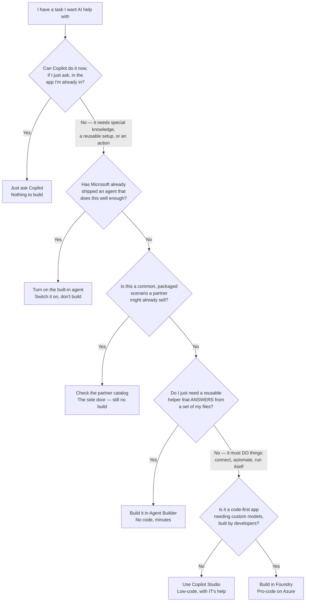

🔄 **A plain-English decision guide** to the whole ladder — from just asking Copilot, through the agents Microsoft ships, up to building your own with Agent Builder, Copilot Studio and Foundry. The landscape moves fast; confirm specifics in [Microsoft Learn — build agents for Copilot](https://learn.microsoft.com/en-us/microsoft-365-copilot/extensibility/agents-overview). **Last verified: 23 June 2026.**

**The short version:** Microsoft gives you a whole ladder of ways to get AI to help with a task — from *just asking Copilot* in the app you're already in, all the way up to *building a custom agent with developers*. Most people only ever need the bottom rung. This guide helps you find the lowest-effort option that actually does your job — and shows you how to step up only if you outgrow it.

*The Microsoft 365 Copilot app — the chat you talk to, with the agents that live alongside it. This guide helps you choose between just asking Copilot, switching on an agent like these, or building your own.*

---

## TL;DR

- **Just ask Copilot** — for most everyday tasks (draft, summarise, look something up, analyse a file you have open) you don't need an agent at all. It's included with your Copilot licence.
- **Use a built-in agent** — Microsoft already ships agents for common jobs: **Facilitator** runs meetings, the **Planner Agent** builds plans, **Researcher** and **Analyst** dig into data. You switch them on; you don't build them.
- **Build a simple one with Agent Builder** — no code, a few minutes, for a reusable helper that answers from a chosen set of your files.
- **Step up to Copilot Studio** — low-code, for when the agent has to *do* things: connect to other systems, run on a schedule, sit on your website.
- **Go pro-code with Foundry** — for developers building custom AI apps with their own models.
- **The rule:** use the lowest rung that does the job — the goal isn't to climb, it's to stop as early as you can.

> 🧭 **Jump to:** [The one question](#start) · [The decision in one picture](#flowchart) · [If you want X, use Y](#table) · [The five options](#options) · [What each costs](#cost) · [When to move up](#graduate) · [Who governs it](#govern) · [Common mix-ups](#mixups) · [Sources](#sources) · [Where next](#next)

---

## The one question that answers most of it {#start}

Before anything else, ask yourself one thing:

> **Can Copilot already do this if I just ask it, in the app I'm in right now?**

If the answer is yes — and surprisingly often it is — you're done. No agent, no building, nothing to set up. Microsoft 365 Copilot can already read your own work files and emails (only the ones *you* have permission to see) through Microsoft Graph, so a one-off "summarise this thread", "find the latest on Project Northwind", or "draft a reply" almost never needs an agent.

You only start climbing the ladder when the answer is **no** — because the task needs *special knowledge*, a *reusable setup* you'll use again and again, or an *action* Copilot can't take on its own.

> 📎 **And sometimes the fix isn't an agent at all.** If the problem is just that Copilot can't *see* some data — a system that lives outside Microsoft 365 — the answer might be a **Graph connector** (usually a job for IT) that brings that data *into* Copilot, so plain Copilot can answer from it. Connect the data first; build an agent only if you still need one.

---

## The decision, in one picture {#flowchart}

Here's the whole thing as a single decision tree. Start at the top and stop at the first box that fits.

> ⚠️ **One thing to settle early:** if the agent will be shared with other people, touch sensitive data, or take actions on your behalf, loop in whoever manages your Microsoft 365 *before* you build. It's far easier to set the guardrails up front than to retrofit them — more on that under [who keeps all this under control](#govern).

---

## If you want X, use Y {#table}

The same decision, as a lookup table. Find the row that matches what you're trying to do.

| If you want to… | Use | Build effort | Good to know |
|---|---|---|---|
| Draft, summarise, rewrite or analyse in the app you're in — a one-off or personal task | **Copilot** — just ask | None | Included with your Copilot licence |
| A job Microsoft already made an agent for — run a meeting, build a plan, deep research, analyse data | A **built-in agent** (Facilitator, Planner, Researcher, Analyst…) | None to build | Comes with your Copilot licence; some are admin-controlled |
| A reusable, shareable helper that **answers** from a chosen set of files or sites | **Agent Builder** (no-code) | Minutes, no code | Best for Q&A and guidance — not actions or automation |
| An agent that **does** things — create a ticket, update a record, run on a schedule, sit on a website | **Copilot Studio** (low-code) | Hours to days | Usually needs IT for connectors, data access + governance |
| A code-first AI app — custom or fine-tuned models, advanced orchestration, full control | **Foundry** (pro-code) | A developer project | If it still mostly lives inside Microsoft 365, check Copilot Studio first |

---

## Where to stop — the five options, simplest first {#options}

The five options below are in order of effort. The whole game is to **stop as low as you can**. Each one says, in plain terms, *when to stop here* — and points you to the deeper guide if that's your landing spot.

> 📎 **Already sure you need to build an agent?** Skip the first two and jump to our head-to-head — [Agent Builder vs Copilot Studio vs Foundry](/blog/agent-builder-vs-copilot-studio-vs-foundry/) — which pits the three build tools against each other on features, licensing and cost. *This* page is the step before that: working out whether you need to build at all.

### 1. Just ask Copilot {#copilot}

**Stop here if:** your task is a one-off, and it's something Copilot can handle inside Word, Excel, Outlook, Teams or the Microsoft 365 Copilot app.

This is the rung most people live on, and it's a perfectly good place to be. Asking Copilot to rewrite a paragraph, summarise a meeting, pull the key points from a document, or analyse the spreadsheet you have open is not "using an agent" — it's just using Copilot. Nothing to set up, nothing to govern, included with your seat. (For *how* Copilot does this safely with your data, see [how Microsoft 365 Copilot works, layer by layer](/blog/how-microsoft-365-copilot-works-layer-by-layer/).)

*Rung 1 in action: ask Microsoft 365 Copilot a real work question and it answers straight away — grounded in your files and meetings, with sources you can check. No agent, nothing built.*

> 💡 **The bigger cousin:**for a longer, multi-step job you'd rather hand off and walk away from, there's **Cowork** — Copilot's more autonomous way of working through a whole task for you. Still nothing to build. → [the complete guide to Cowork](/blog/microsoft-copilot-cowork-complete-guide/).

### 2. Turn on a built-in agent {#built-in}

**Stop here if:** there's already a Microsoft-made agent that does your job *well enough*.

Microsoft ships a growing set of ready-made agents that turn up inside the apps you already use — you allow them and switch them on, you don't design them:

- **Facilitator** — runs your Teams meetings: shared notes, an agenda timer, in-meeting Q&A and a recap.
- **Planner Agent** — builds task plans, works tasks you assign it, writes status reports.
- **Researcher** — deep, source-cited research across your work data and the web.
- **Analyst** — turns your spreadsheets and files into insights and charts.
- **Agents in SharePoint** — answer questions grounded in a site's own files.

*Analyst is one of the agents Microsoft already ships — note the "Created by Microsoft" label. You switch it on; there's nothing to build.*

Two honest caveats. First, *well enough* matters — if the shipped agent nearly fits but you need it grounded in your own specific files or doing something extra, that's a sign to look at building one (rung 3). Second, switching one on isn't always in your hands: agents like Facilitator and the Planner Agent can depend on your licence, app, region and admin settings, while Researcher and Analyst come switched on by default for licensed users. The full map of what Microsoft ships is in [Microsoft 365's built-in agents](/blog/microsoft-365-built-in-agents/).

> 📎 **The side door — buy before you build.** Before you build anything yourself, check the agent **catalog** in the Microsoft 365 admin center. Microsoft partners and software vendors publish ready-made agents there. For a common business scenario, adopting one that a partner already built and supports can beat building your own from scratch — it's an option many teams miss.

### 3. Build a simple one with Agent Builder {#agent-builder}

**Stop here if:** you need a *reusable, shareable* helper that **answers** questions from a specific set of files or sites — and that's all.

Agent Builder lives right inside the Copilot app. You describe what you want in plain English, point it at some knowledge (SharePoint sites, files, a few web pages), and you've got an agent you can use again and share with your team — no code, a few minutes. It's the right tool for scoped question-answering and guidance: an onboarding helper, a "questions about our travel policy" agent, a coach that answers from your team's playbook.

*Agent Builder's starting point: describe what you want in plain English. No code, a few minutes — best for an agent that answers from your files.*

Where Agent Builder *isn't* the right tool: it's built for answering, not for action. If you find yourself wanting it to call another system, update a record, or run on its own, that's your signal to step up to Copilot Studio. One surface note: these agents run in the Copilot app — at microsoft365.com/chat, office.com/chat and the Teams app — not inside a Teams chat conversation. The full no-code walkthrough is in [Microsoft 365 Agent Builder, explained](/blog/m365-agent-builder-explained/).

### 4. Step up to Copilot Studio {#copilot-studio}

**Step up here if:** the agent has to *do* things, not just answer — create a ticket, update a record, run on a schedule, or live on a website or in Teams for lots of people.

Copilot Studio is the low-code builder. It adds the things Agent Builder deliberately leaves out: connectors to other systems (your CRM, your ticketing tool, and many more), multi-step workflows, agents that run on a trigger instead of waiting to be asked, and publishing to channels like a public website. It's still designed for confident business builders rather than developers — but it's a bigger tool.

*Copilot Studio opens with a choice — an agent or a workflow — and far more power: connectors, actions, automation. That extra power is why it's the next step up.*

The honest trade-off: that power usually means involving IT. Connectors need permissions, data access needs checking, and there are environments and governance to set up — so a Copilot Studio agent is rarely a solo weekend project. It's also **metered in Copilot Credits**, so you pay for what it does (see [What each option costs](#cost)). For the full feature-by-feature picture, see [Agent Builder vs Copilot Studio vs Foundry](/blog/agent-builder-vs-copilot-studio-vs-foundry/), and for the credit detail, [Copilot Studio pricing](/blog/copilot-studio-pricing/).

### 5. Go pro-code with Foundry {#foundry}

**Step up here only if:** you have developers and you're building a custom AI *application* — your own or fine-tuned models, advanced orchestration, and full code-level control on Azure.

Foundry (recently renamed **Microsoft Foundry**) is the developer platform. It's where teams pick from a huge catalogue of models, fine-tune on their own data, wire up several specialist agents to work together, and ship with proper code, testing and deployment pipelines. It is not an IT-admin tool and it doesn't live inside Microsoft 365 — it's an Azure project with an Azure bill.

The key reframe for most readers: **if your need still mostly lives inside Microsoft 365 and business workflows, check Copilot Studio first — you probably don't need Foundry.** Reach for it only when developers genuinely need control that the lower rungs can't give. The Foundry section of the [build-tool comparison](/blog/agent-builder-vs-copilot-studio-vs-foundry/#foundry) covers who owns it and what changes, and there's more in the [Build 2026 recap](/blog/microsoft-build-2026-recap/).

---

## What each option costs {#cost}

You don't need exact numbers to make the decision — you need the *shape* of the cost. Here it is.

| Option | Cost shape | How you pay |
|---|---|---|
| Just ask Copilot | **Included** | Your Microsoft 365 Copilot licence |
| Built-in agents | **Included** (mostly) | Your Copilot licence (SharePoint agents also offer pay-as-you-go) |
| Agent Builder | **Included** | Your Copilot licence |
| Copilot Studio | **Metered** | Copilot Credits — you pay for what the agent *does* |
| Foundry | **Consumption** | Azure bill — per use of models, compute and storage |

The pattern is simple: the first three rungs are usually covered by your Copilot licence rather than metered (exact availability varies by agent and tenant), while the two build-your-own-power rungs are **pay-for-use**. Those are the ones to budget and keep an eye on — an agent that runs on its own can quietly add up.

> 💡 **For the actual numbers,** see [Copilot Studio pricing](/blog/copilot-studio-pricing/) for how credits work, and model a budget with the [AI Cost Calculator](/ai-cost-calculator/) and the [Licensing Simplifier](/licensing/).

---

## When to move up a level {#graduate}

You don't pick one rung forever. You move up when you hit a wall — and the wall usually announces itself:

- **Copilot → built-in agent:** you keep doing the same *kind* of task (running meetings, building plans, deep research) and there's a Microsoft agent made for exactly that.
- **Built-in → Agent Builder:** you want the same answer experience again and again, scoped to *your* files, and no shipped agent quite fits.
- **Agent Builder → Copilot Studio:** the moment you think *"…and then it should **do** something"* — connect, automate, act — that's the signal.
- **Copilot Studio → Foundry:** only when developers need custom models or full code control that Studio can't give.

> 📎 **Moving up isn't a reset — but it isn't free either.** Going from Agent Builder to Copilot Studio gives you a head start — the instructions and knowledge you worked out carry forward, even if you reconfigure some of them in the new tool. But you still design, test and govern the new powers you're adding. Going all the way to Foundry is a rebuild. So don't jump rungs for the sake of it — the step-by-step graduation path is in the [build-tool comparison](/blog/agent-builder-vs-copilot-studio-vs-foundry/#graduation).

---

## Who keeps all this under control? {#govern}

Once people start switching on and building agents, someone has to be able to see them all. **Agent 365** — generally available since May 2026 — is the single place IT can find every agent in the tenant, give each one a managed identity, see what it's touching, and govern what it's allowed to do.

*Agent 365 in the Microsoft 365 admin center — one place to see and govern every agent in the tenant, whoever built it.*

You don't need this on day one for one person and one agent. You *do* need it once agents spread across teams, touch real data, or start taking actions. The deep version — Entra, Purview and Defender working together — is in the [Agent 365 security & governance guide](/blog/agent-365-security-governance-complete-guide/), and the data-safety foundations are in [how Copilot works, layer by layer](/blog/how-microsoft-365-copilot-works-layer-by-layer/#layer-7--response--governance).

---

## The mix-ups that trip people up {#mixups}

Most of the confusion comes down to a handful of words doing too much work. Here are the ones worth getting straight:

| The mix-up | The plain truth |
|---|---|
| **"Copilot" and "an agent" are the same thing** | Copilot is the assistant you *talk to*. An agent is a *specialised* helper pointed at one job or one body of knowledge — either one Microsoft ships, or one you build. |
| **"Agent" means one specific thing** | Microsoft calls both the ones it ships *and* the ones you build "agents". When someone says "agent", ask: a **built-in** one, or a **custom** one? |
| **A built-in agent vs an agent you build** | Facilitator and Researcher are *built-in* — Microsoft made them, you switch them on. Agent Builder and Copilot Studio are how you make your *own*. |
| **Agent Builder vs Copilot Studio** | Same idea — build an agent — but Agent Builder *answers* (no-code, minutes) while Copilot Studio also *acts and automates* (low-code, more setup). |
| **Copilot Studio vs Foundry** | Copilot Studio is low-code for business builders; Foundry is pro-code for developers building a custom app on Azure. |

Get those five straight and most of the noise disappears.

---

## Official Microsoft sources {#sources}

- [Build agents for Microsoft 365 Copilot — overview](https://learn.microsoft.com/en-us/microsoft-365-copilot/extensibility/agents-overview)
- [Agent Builder in Microsoft 365 Copilot](https://learn.microsoft.com/en-us/microsoft-365-copilot/extensibility/agent-builder)
- [What is Microsoft Copilot Studio?](https://learn.microsoft.com/en-us/microsoft-copilot-studio/fundamentals-what-is-copilot-studio)
- [Copilot Studio licensing and subscriptions](https://learn.microsoft.com/en-us/microsoft-copilot-studio/requirements-licensing-subscriptions)
- [What is Microsoft Foundry?](https://learn.microsoft.com/en-us/azure/ai-foundry/what-is-azure-ai-foundry)
- [Microsoft 365 Copilot overview](https://learn.microsoft.com/en-us/copilot/microsoft-365/microsoft-365-copilot-overview)

---

## Where to go next {#next}

- [Microsoft 365's built-in agents — the complete guide](/blog/microsoft-365-built-in-agents/) — every agent Microsoft *ships*.
- [Microsoft 365 Agent Builder, explained](/blog/m365-agent-builder-explained/) — build your own, no code.
- [Agent Builder vs Copilot Studio vs Foundry](/blog/agent-builder-vs-copilot-studio-vs-foundry/) — the head-to-head once you know you need to build.
- [How Microsoft 365 Copilot works, layer by layer](/blog/how-microsoft-365-copilot-works-layer-by-layer/) — what's happening under the hood.
- [The complete guide to Copilot Cowork](/blog/microsoft-copilot-cowork-complete-guide/) — hand off a whole task, no building.
- [Agent 365 security & governance](/blog/agent-365-security-governance-complete-guide/) — keeping every agent in line.
