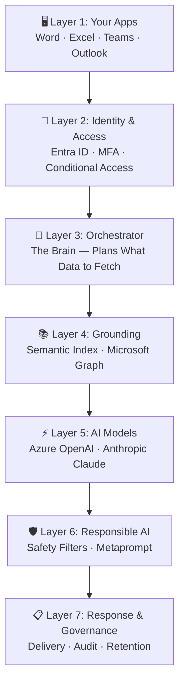
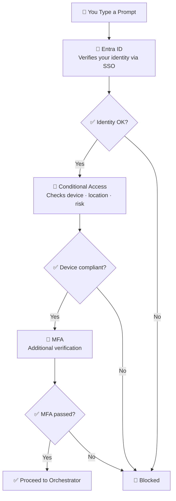
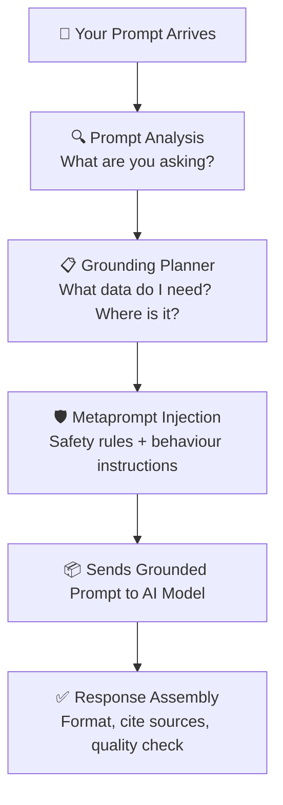
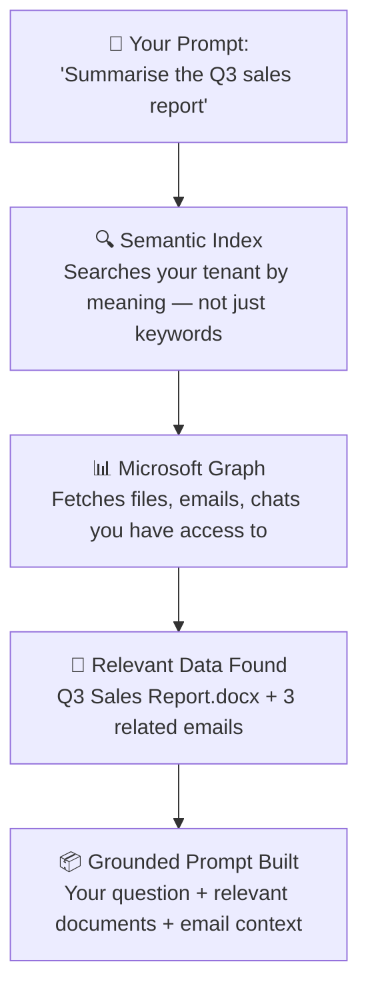
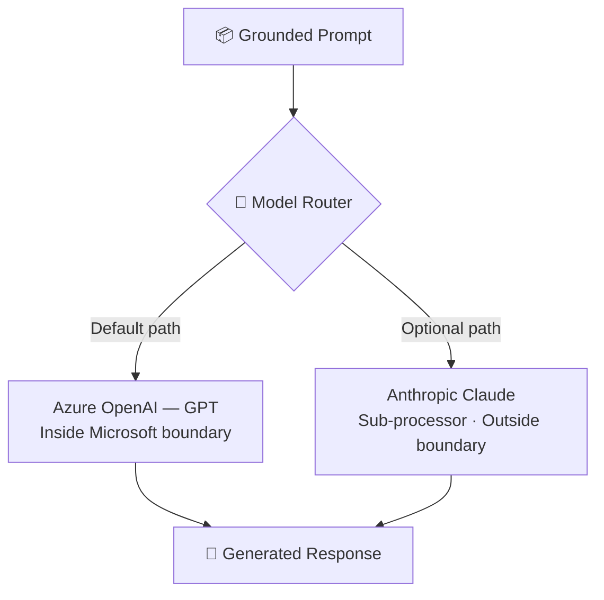
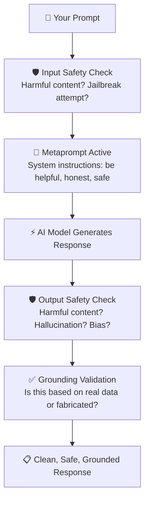
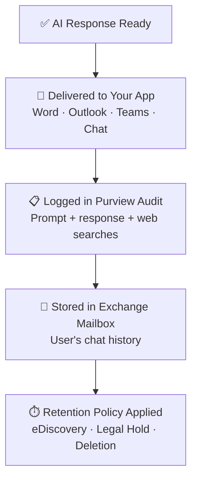
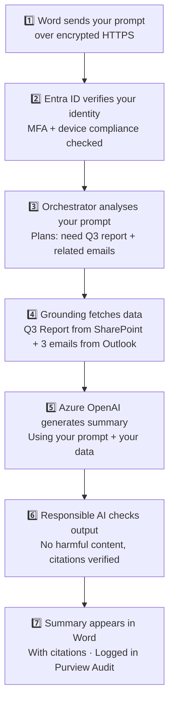

I get the same question every time I do a Copilot demo.

Someone — usually the CISO, sometimes the IT manager, occasionally a very switched-on end user — raises their hand and asks: *"But what actually happens when I type something into Copilot? Where does my data go? Who sees it?"*

And you know what? That's the right question. It's the question everyone should be asking before they roll out AI to thousands of users.

The problem is, most explanations of Copilot's architecture look like this:

*"Microsoft 365 Copilot leverages the Microsoft Graph and Semantic Index to provide grounded responses through Azure OpenAI's large language models within the Microsoft 365 service boundary."*

That sentence is technically correct. It's also completely useless if you're trying to explain it to your leadership team, your security board, or — let's be honest — to yourself at 10pm the night before a deployment review.

So let me try something different. Let me walk you through what happens — step by step, layer by layer — from the moment you type a prompt to the moment you get a response. No marketing language. No hand-waving. Just the actual mechanics, explained in a way that sticks.

> 🔗 **Tools you might want open alongside this:**
> - [Copilot Data Flow Map](/copilot-data-flow/) — interactive version of everything in this blog, with clickable scenarios
> - [Copilot Model Map](/copilot-model-map/) — see which AI models power which Copilot features
> - [Copilot Readiness Assessment](/copilot-readiness/) — check if your tenant is ready
> - [Copilot Control System guide](/blog/microsoft-365-copilot-control-system-complete-guide/) — how the governance framework works

**Quick links:** [The big picture](#the-big-picture) · [Layer 1: Apps](#layer-1--your-apps) · [Layer 2: Identity](#layer-2--identity--access) · [Layer 3: Orchestrator](#layer-3--the-orchestrator) · [Layer 4: Grounding](#layer-4--grounding) · [Layer 5: AI Models](#layer-5--the-ai-models) · [Layer 6: Responsible AI](#layer-6--responsible-ai) · [Layer 7: Response](#layer-7--response--governance) · [The full picture](#putting-it-all-together) · [What to check first](#your-security-checklist) · [FAQ](#questions-people-ask-me)

🔄 This is a living document. Microsoft updates Copilot's architecture regularly — most recently adding Anthropic Claude as an optional sub-processor and expanding the Semantic Index. If something here becomes outdated, please [let me know](/feedback/) and I'll update it.

### TL;DR — The Four Things Your CISO Needs to Know

If you only have 30 seconds, here's the answer to "is Copilot safe?":

1. **Your data stays inside Microsoft's boundary** — for standard Copilot interactions (no web search, no Anthropic), your data never leaves the Microsoft 365 service boundary. Not once.
2. **Copilot only sees what YOU can see** — it inherits your Microsoft Graph permissions. If you can't access a file, neither can Copilot. The risk isn't Copilot — it's overshared SharePoint permissions.
3. **No data trains AI models** — this is contractual (Microsoft DPA), not just a promise. Applies to both OpenAI and Anthropic. Processing is transient.
4. **Every interaction is auditable** — prompts, responses, and web searches are logged in Microsoft Purview Audit. Chat history lives in Exchange. eDiscovery works.

Now let's understand *why* these four things are true — by looking at each layer.

---

## The Big Picture {#the-big-picture}

Before we go layer by layer, here's the 30-second version. Every Copilot interaction passes through seven layers:

Think of it like ordering food at a restaurant:

| Restaurant | Copilot |
|-----------|---------|
| You look at the menu and order | You type a prompt in Word or Teams |
| The waiter checks your reservation | Entra ID verifies your identity |
| The head chef reads your order and plans the dish | The Orchestrator analyses your prompt |
| Kitchen staff fetch the ingredients | Grounding fetches your data from Graph |
| The chef cooks the meal | The AI model generates a response |
| Quality control checks the plate | Responsible AI filters the output |
| The waiter serves your meal and logs the order | Response delivered, interaction audited |

The key thing to notice: **your data is the ingredients, not the recipe.** The AI model doesn't memorise your ingredients for the next customer. It uses them, serves the dish, and moves on.

Now let's look at each layer properly.

---

## Layer 1 — Your Apps {#layer-1--your-apps}

**The prompt starts here.**

Copilot isn't a separate app you install. It's not a website you visit. It's embedded directly into the Microsoft 365 apps you already use — Word, Excel, PowerPoint, Outlook, Teams, and Microsoft 365 Chat (what Microsoft calls "BizChat").

When you type a prompt, it leaves your device over an encrypted HTTPS connection and enters the Copilot service. That's it. No magic. No separate portal.

| App | What Copilot Does Here |
|-----|----------------------|
| **Word, Excel, PowerPoint** | Drafts, summarises, analyses, and creates content within your documents |
| **Outlook** | Summarises email threads, drafts replies, coaches your writing tone |
| **Teams** | Summarises meetings, catches you up on chats, generates meeting notes from transcripts |
| **Microsoft 365 Chat** | The cross-app experience — questions that span emails, files, chats, and calendar in one place |

🔑 **IT Admin takeaway:** Copilot is not a separate app to secure. It inherits the security posture of your existing Microsoft 365 apps. If your apps are secured (device compliance, app protection policies, DLP), Copilot is secured too.

> **The prompt at this stage:** `"Summarise the Q3 sales report"`
>
> Just raw text. No context. No identity. No data.

---

## Layer 2 — Identity & Access {#layer-2--identity--access}

**Before Copilot does anything, it asks: "Who are you?"**

Every Copilot interaction starts with authentication. Microsoft Entra ID (formerly Azure AD) checks your identity using single sign-on. If you've configured Conditional Access policies — and you should have — your device compliance, location, and sign-in risk are also evaluated.

Only after you pass all these checks does Copilot proceed. This isn't optional. This isn't configurable. It's built in.

Here's what most people miss: **Copilot doesn't have its own access control system.** It rides on top of everything you've already set up. Every Conditional Access policy you've configured? Copilot honours it. Every MFA requirement? Copilot enforces it. Every location-based restriction? Copilot respects it.

| Component | What It Does | You Already Have It If... |
|-----------|-------------|--------------------------|
| **Microsoft Entra ID** | Verifies user identity via SSO; issues scoped access tokens | You use Microsoft 365 |
| **Conditional Access** | Evaluates device compliance, location, sign-in risk | You've set up CA policies in Entra |
| **Multi-Factor Authentication** | Requires additional verification beyond passwords | You've enabled MFA (and you really should have) |

🔑 **IT Admin takeaway:** You don't need to configure anything new for Copilot. If a user is blocked from M365 apps by your existing policies, they're blocked from Copilot too. Zero extra configuration.

> **The prompt at this stage:** Copilot now knows WHO is asking. The prompt is authenticated.

---

## Layer 3 — The Orchestrator {#layer-3--the-orchestrator}

**This is the brain of Copilot. And it's the part nobody talks about.**

When your prompt arrives at the Orchestrator, something interesting happens. The Orchestrator doesn't just forward your question to an AI model and hope for the best. It *plans*.

Think of the Orchestrator as a skilled project manager. Someone hands them a task — "summarise the Q3 sales report" — and before they do anything, they think:

- *What data do I need to answer this well?*
- *Where is that data? SharePoint? Outlook? Teams?*
- *What does this user have permission to access?*
- *Should I search the web for public context too?*
- *What instructions should I give the AI model to keep it on track?*

The Orchestrator has four jobs:

| Job | What It Does |
|-----|-------------|
| **Prompt Analysis** | Parses your question, identifies intent, determines what context is needed |
| **Grounding Planner** | Decides which data sources to query — Graph, Semantic Index, web search — based on your prompt |
| **Metaprompt Injection** | Adds system instructions that tell the AI model to be helpful, safe, and honest |
| **Response Assembly** | Combines the AI output with citations, formats it for your app, and applies quality checks |

The Orchestrator is invisible. You'll never see it, configure it, or interact with it directly. But it's the reason Copilot gives you a useful, cited, permission-respecting answer instead of a random guess.

🔑 **IT Admin takeaway:** You can't configure the Orchestrator directly — but it respects every policy you set. Permissions, DLP, sensitivity labels, web search settings — the Orchestrator honours them all.

> **The prompt at this stage:** The Orchestrator has a plan: *"I need the Q3 sales report from SharePoint + recent emails about Q3 performance"*

---

## Layer 4 — Grounding {#layer-4--grounding}

**This is where Copilot becomes useful. Without grounding, it's just another chatbot.**

Here's the thing about AI models: they're incredibly good at generating text. They're also incredibly bad at knowing anything about *your* organisation. An AI model doesn't know what your Q3 sales report says. It doesn't know who your CEO is. It doesn't know what project you're working on.

Grounding fixes this.

Grounding is the process of fetching relevant data from your Microsoft 365 tenant and combining it with your prompt *before* sending it to the AI model. The technical term is **Retrieval-Augmented Generation (RAG)**, but the concept is dead simple:

> 💡 **The "briefing pack" analogy:** Imagine you ask a new employee to summarise a report. If they haven't read it, they'll give you a vague, generic answer. But if you hand them the report first, they can give you a specific, accurate summary. That's grounding — handing the AI model your actual data before asking it to respond.

### How Grounding Works

Two systems work together to fetch the right data:

### The Semantic Index — Finding Meaning, Not Just Keywords

This is one of the cleverest parts of Copilot's architecture. Traditional search works like a librarian who only looks at book titles — if you search for "positive feedback," it finds documents with those exact words. Miss.

The Semantic Index works like a librarian who has actually *read* every book. It creates vector representations (mathematical maps of meaning) of your documents and emails. So when you search for "positive feedback about the design work," it finds the email where your colleague wrote *"I was absolutely thrilled with the vendor's creative approach"* — even though none of your search words appear in that email.

| Traditional Search | Semantic Index |
|-------------------|---------------|
| Matches exact keywords | Understands concepts and relationships |
| "positive feedback" → finds "positive feedback" | "positive feedback" → finds "thrilled," "impressed," "excellent work" |
| Misses synonyms and paraphrases | Captures the meaning behind words |
| You need to know the right words | You describe what you're looking for |

The Semantic Index is:
- **Automatically maintained** — no admin setup required
- **Tenant-level** — covers SharePoint Online files accessible to 2+ users
- **User-level** — personal index of your emails, documents you interact with
- **Permission-respecting** — only surfaces results you already have access to

### Microsoft Graph — The Structured Data Layer

While the Semantic Index finds meaning, Microsoft Graph provides structured access to your data. It's the API that connects Copilot to your emails, files, chats, calendar, people, and org chart.

The critical thing here: **every Graph query is scoped to the signed-in user's permissions.** Copilot can't access data you can't access. Period.

### Web Search (Optional)

When enabled, Copilot can send a short, derived search query to a private Bing service for public web data. This is important to understand:

- ✅ Only a **derived query** is sent — not your full prompt
- ✅ No tenant data, documents, or user identity is shared with Bing
- ✅ Admins can disable web search entirely
- ✅ Zero Query Logging (ZQL) is available

🔑 **IT Admin takeaway:** Grounding is where oversharing becomes a real risk. Copilot surfaces anything the user has permission to access. If your SharePoint permissions are too broad — "Everyone except external users" on sensitive sites — Copilot will happily surface that data. **Review your sharing settings and sensitivity labels before rollout.**

> **The prompt at this stage:** `"Summarise the Q3 sales report"` + the actual Q3 Sales Report content + 3 related emails about Q3 targets. The prompt is now *grounded* — rich with your organisation's real data.

---

## Layer 5 — The AI Models {#layer-5--the-ai-models}

**This is where the magic happens — but it's also the part people worry about most.**

The grounded prompt — your question, combined with the relevant context from your tenant — is sent to a large language model (LLM) that generates the response.

Microsoft uses two model providers:

| | Azure OpenAI (GPT) | Anthropic Claude |
|---|---|---|
| **Hosted by** | Microsoft (Azure infrastructure) | Anthropic (under Microsoft's contractual control) |
| **Data boundary** | Inside Microsoft 365 service boundary | Crosses Microsoft boundary → Anthropic infrastructure |
| **EU Data Boundary** | ✅ Supported | ❌ Excluded |
| **Default status** | Always enabled | Disabled by default in EU/EFTA/UK |
| **Admin control** | Can't disable (it's the core) | Tenant-level toggle — you choose |
| **Training on your data** | ❌ Never | ❌ Never (covered by Microsoft DPA) |
| **Data retention** | Transient — no persistent storage | Transient — no persistent storage |

### Three Things You Need to Know

**1. Neither provider trains on your data.** This is contractual, not just a promise. Microsoft's Data Protection Addendum (DPA) explicitly covers both OpenAI and Anthropic.

**2. Processing is transient.** The model doesn't "remember" your data after generating a response. There's no persistent storage of your prompts or responses at the model layer.

**3. You control the model providers.** Anthropic is opt-in. If your compliance team says "no data outside the Microsoft boundary," you simply don't enable Anthropic. Azure OpenAI handles everything inside the boundary.

🔑 **IT Admin takeaway:** You control who processes your data. Anthropic is disabled by default in EU/EFTA/UK and requires explicit admin opt-in. Azure OpenAI is always available and can't be disabled. If in doubt, leave Anthropic off — you'll still get the full Copilot experience.

> **The prompt at this stage:** The AI model generates: *"The Q3 sales report shows revenue of $4.2M, up 12% from Q2. Key highlights include..."*

---

## Layer 6 — Responsible AI {#layer-6--responsible-ai}

**This layer is different from the others. It doesn't sit at a single point — it wraps around the entire pipeline.**

Responsible AI isn't a filter that runs once at the end. It's woven throughout the process — checking your prompt on the way in, guiding the model while it generates, and filtering the response on the way out.

> 💡 **The "compliance officer" analogy:** Think of Responsible AI as a team of invisible editors reviewing every conversation. Before your prompt reaches the AI model, one editor checks it for harmful content or manipulation attempts. After the AI writes its response, another editor fact-checks it against your actual data and removes anything harmful, fabricated, or inappropriate. A third editor makes sure the AI stays in its lane — helpful, honest, and professional. These editors are always on duty and you can't turn them off.

### What the Safety Guardrails Catch

| Guardrail | What It Does |
|-----------|-------------|
| **Metaprompt** | System instructions prepended to every prompt — tells the AI to be helpful, accurate, cite sources, and never fabricate data |
| **Content Safety Filters** | Classifiers that detect and block hate speech, violence, self-harm, sexual content, and jailbreak attempts |
| **Grounding Validation** | Post-generation checks that verify the response is based on retrieved data — not made up |
| **Prompt Injection Defence** | Detects attempts to override system instructions or manipulate the AI's behaviour |

🔑 **IT Admin takeaway:** Responsible AI controls are built in and always on — you don't need to configure them. For additional control, use Microsoft Purview DLP to add your own content policies on top. Think of it as: Microsoft provides the safety net, you add your own organisational rules.

> **The prompt at this stage:** Safety filters check both the input prompt AND the generated response. Cross-cutting — applied throughout.

---

## Layer 7 — Response & Governance {#layer-7--response--governance}

**The response arrives. But the story doesn't end here.**

After the AI model generates a response and the safety filters approve it, the Orchestrator formats the output for your app and delivers it. But three more things happen that most people don't think about:

### 1. The Response is Delivered

The formatted response appears in your app — as a draft in Word, a summary in Outlook, meeting notes in Teams, or an answer in M365 Chat. It includes citations linking back to the source documents so you can verify the information.

### 2. Everything is Logged

Every Copilot interaction is recorded in **Microsoft Purview Audit**:

| What's Logged | Where |
|--------------|-------|
| Your prompt | Purview Audit |
| Copilot's response | Purview Audit |
| Web searches (if any) | Purview Audit |
| Which model was used | Purview Audit |
| User's chat history | Exchange Online mailbox |

This isn't optional. Every interaction creates an audit trail. Your compliance team can search and review exactly what users asked Copilot and what it returned.

### 3. Retention Policies Apply

Copilot interaction data follows your existing Microsoft 365 retention policies:

- **Chat history** is stored in the user's Exchange Online mailbox
- **Retention policies** control how long interaction data is kept
- **eDiscovery** can search and hold Copilot interactions for legal matters
- **Users can delete** their own chat history
- **DLP post-processing** can inspect responses and prevent sensitive data from being surfaced

🔑 **IT Admin takeaway:** All Copilot interactions are auditable. Use Purview Audit to search and review what users asked and what Copilot returned. Set retention policies to control how long interaction data is kept.

> **The prompt at this stage:** The user sees a formatted summary in Word with citations linking to the original Q3 sales report. The interaction is logged. The story is complete.

---

## Putting It All Together {#putting-it-all-together}

Let's trace a real prompt through all seven layers. You're sitting in Word and you type: *"Summarise the Q3 sales report."*

| Layer | What Happens | Security | Your Data Goes... |
|:---:|-------------|----------|-------------------|
| 1 | You type a prompt in Word | Encrypted (TLS 1.2+) | From your device to Microsoft |
| 2 | Entra ID checks who you are | MFA, Conditional Access | Nowhere — just authentication |
| 3 | Orchestrator plans the query | Inside Microsoft boundary | Stays inside Microsoft |
| 4 | Graph fetches your documents | User permissions enforced | Stays inside Microsoft |
| 5 | AI model generates response | Transient processing, no training | Inside Microsoft (Azure OpenAI) |
| 6 | Safety filters check everything | Always on, can't be disabled | Stays inside Microsoft |
| 7 | Response delivered, interaction logged | Audit trail, retention policies | Stays in your app + Exchange mailbox |

**Notice the pattern?** For a standard Copilot interaction (no web search, no Anthropic), your data never leaves the Microsoft 365 service boundary. Not once.

---

## Your Security Checklist {#your-security-checklist}

Before you roll out Copilot, here are the eight things to verify. I've ranked them by priority:

### Critical — Do These First

| # | Item | Why It Matters |
|:---:|------|---------------|
| 1 | **Data Loss Prevention configured** | Purview DLP policies inspect Copilot prompts and prevent sensitive data leaks |
| 2 | **Sensitivity labels deployed** | Copilot respects encryption and usage rights from labels — if a doc is labelled "Confidential — Encrypt," Copilot can only access it if the user has decrypt rights |
| 3 | **Conditional Access policies set** | MFA, device compliance, and location restrictions enforce who can access Copilot |
| 4 | **SharePoint oversharing reviewed** | This is the #1 risk. Copilot surfaces anything the user can access. Broad permissions = broad Copilot access |

### Important — Do These Next

| # | Item | Why It Matters |
|:---:|------|---------------|
| 5 | **Purview Audit logging enabled** | All Copilot prompts, responses, and web searches are logged for compliance review |
| 6 | **Anthropic sub-processor decision made** | Decide whether to enable Claude models — enabling sends data outside Microsoft boundary |
| 7 | **Web search grounding configured** | Decide whether Copilot can search the web via Bing; enable Zero Query Logging if on |
| 8 | **Microsoft Graph permissions audited** | Review what data each user can access via Graph — Copilot inherits these permissions |

### Compliance Certifications

For the compliance team, M365 Copilot holds these certifications:

| Certification | Category | Status |
|--------------|----------|--------|
| ISO/IEC 27001 | Security | ✅ Certified |
| ISO/IEC 27018 | Privacy | ✅ Certified |
| ISO/IEC 42001 | AI Governance | ✅ Certified |
| SOC 1 & 2 Type II | Security | ✅ Certified |
| GDPR | Privacy | ✅ Compliant |
| HIPAA | Health Data | ✅ Compliant |
| FedRAMP | Government | ⚠️ Commercial only |

> 🛠️ **Want the interactive version?** The [Copilot Data Flow Map](/copilot-data-flow/) has a clickable readiness checklist with progress tracking, a "Copy Security Brief" button for assessments, and the full Architecture tab we built from this research.

---

## What Copilot Does NOT Do {#what-copilot-does-not-do}

I hear these misconceptions so often that they deserve their own section. Pin this to your Teams channel.

| Misconception | Reality |
|--------------|---------|
| "Copilot crawls the internet by default" | ❌ Web search is **optional** and admin-controlled. By default, Copilot only uses your tenant data. When web search IS enabled, only a short derived query goes to Bing — not your prompt, documents, or identity. |
| "Copilot can see everything in my tenant" | ❌ Copilot can only access data **the signed-in user** has permission to see. It never escalates privileges. A junior employee and a CEO get different results for the same prompt. |
| "OpenAI/Anthropic store my data" | ❌ Processing is **transient**. Neither provider persistently stores your prompts, responses, or tenant data. It's processed, the response is generated, and the data is discarded at the model layer. |
| "Copilot remembers previous conversations" | ⚠️ Within a session, yes — Copilot maintains conversation context. But it doesn't learn from your data permanently. Next session, it starts fresh. Chat history is stored in your Exchange mailbox, not in the AI model. |
| "I need a special security setup for Copilot" | ❌ Copilot inherits your existing M365 security stack — Conditional Access, MFA, DLP, sensitivity labels. If your M365 environment is secured, Copilot is secured. No separate setup needed. |
| "Copilot works without a licence" | ❌ Users need a **Microsoft 365 Copilot licence** ($30/user/month). No licence = no Copilot. The Semantic Index is only generated for licenced users. |

---

## Questions People Ask Me {#questions-people-ask-me}

These are the questions I get most often in customer demos and security reviews. I've collected them here so you can share this section with your team.

**"Does Copilot send my data to OpenAI?"**

No — and this is the most misunderstood part. Microsoft hosts OpenAI's models within their own Azure infrastructure. Your data goes to Azure OpenAI (Microsoft-operated), not to OpenAI's own servers. Microsoft controls the infrastructure, the data handling, and the contractual terms.

**"What about Anthropic? That one worries me."**

Fair. When Copilot uses Anthropic Claude (for features like Cowork or custom Studio agents), your grounded prompt does cross the Microsoft boundary to Anthropic's infrastructure. But: it's covered by Microsoft's DPA, Anthropic can't train on your data, and **it's disabled by default in EU/EFTA/UK.** If your compliance team says no, just don't enable it.

**"What if someone asks Copilot to do something harmful?"**

The Responsible AI layer catches this. Content safety filters detect harmful content, jailbreak attempts, and prompt injection attacks in both directions — input and output. The metaprompt also instructs the model to refuse harmful requests. These controls are always on.

**"Can Copilot access files I've shared with 'Everyone'?"**

Yes — and this is the biggest risk. Copilot inherits user permissions from Microsoft Graph. If a user has access to a SharePoint site shared with "Everyone except external users," Copilot will surface that data when relevant. **The fix isn't restricting Copilot — it's fixing your SharePoint permissions.** This was a problem before Copilot; Copilot just makes it visible.

**"Where are the official Microsoft docs on all this?"**

I maintain a curated list of every official security and privacy document in the [Official Docs tab](/copilot-data-flow/) of the Data Flow Map tool. But the key ones are:
- [Data, Privacy & Security for M365 Copilot](https://learn.microsoft.com/en-us/microsoft-365/copilot/microsoft-365-copilot-privacy)
- [M365 Copilot Architecture](https://learn.microsoft.com/en-us/microsoft-365/copilot/microsoft-365-copilot-architecture)
- [Semantic Index for Copilot](https://learn.microsoft.com/en-us/microsoftsearch/semantic-index-for-copilot)
- [Anthropic as a Sub-processor](https://learn.microsoft.com/en-us/microsoft-365/copilot/connect-to-ai-subprocessor)

---

*This post is based on the research behind our [Copilot Data Flow Map](/copilot-data-flow/) and [Copilot Model Map](/copilot-model-map/) tools. If you find it useful, those interactive tools let you explore specific scenarios, compare model providers, and generate copy-pasteable security briefs for your assessments.*

*Got a question I didn't cover? [Let me know](/feedback/) — I read every message and update this guide regularly.*

---

## Related Reading {#related-reading}

If you found this useful, these guides go deeper into specific areas:

- **[Copilot Data Flow Map](/copilot-data-flow/)** — Interactive tool with clickable scenarios, Architecture explorer, and security assessment features
- **[Copilot Model Map](/copilot-model-map/)** — Which AI models power which Copilot features — GPT, Claude, Phi mapped across 16 features
- **[The Copilot Control System](/blog/microsoft-365-copilot-control-system-complete-guide/)** — How the governance framework works for managing Copilot across your organisation
- **[Agent 365 Security & Governance](/blog/agent-365-security-governance-complete-guide/)** — When you go beyond Copilot into AI agents, this is how you govern them
- **[Copilot Deployment Checklist](/blog/microsoft-365-copilot-deployment-best-practices-ultimate-checklist/)** — Step-by-step deployment guide with everything you need before, during, and after rollout
