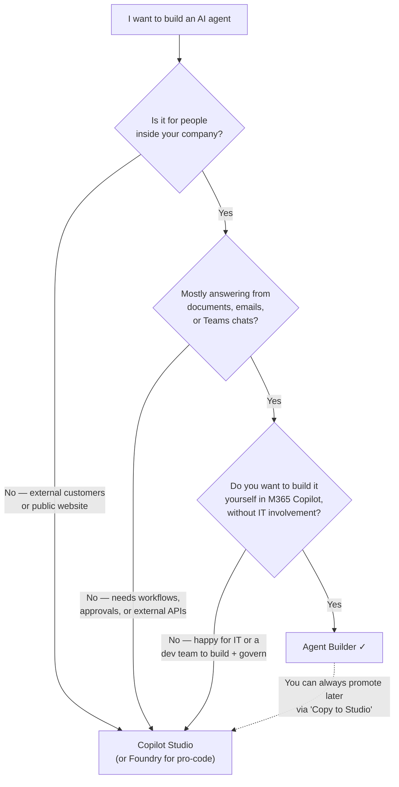
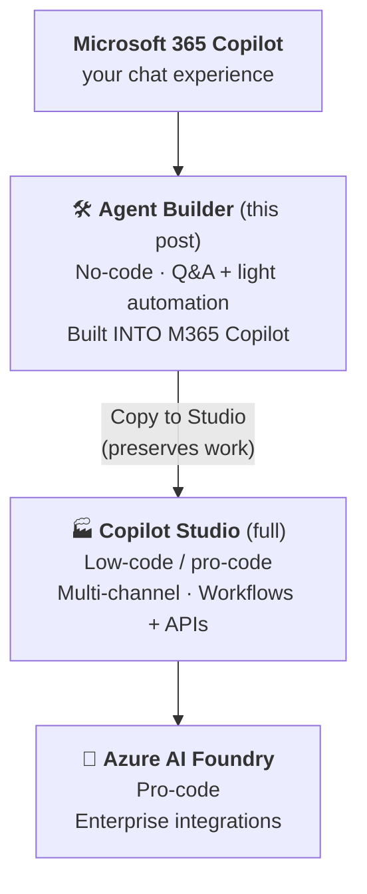

**M365 Agent Builder is a no-code feature inside Microsoft 365 Copilot that lets any business user create a custom AI assistant in about 5 minutes** — point it at some documents, write a few rules, share it with your team. No developers required. No new product to learn. No additional cost if you already have M365 Copilot.

That's the 30-second version. But before we go any further:

<div class="living-doc-banner">

⚠️ **This is NOT Copilot Studio.** They're cousins — same underlying technology, same M365 governance, similar capabilities for the common stuff. But they're different products for different people.

**The 5-second test:** If you opened it from `microsoft365.com/chat` (or the Copilot pane in Teams desktop), it's **Agent Builder**. If you opened it from `copilotstudio.microsoft.com`, it's **Copilot Studio**. This post is about Agent Builder.

</div>

If you need to compare it side-by-side with Copilot Studio or Azure AI Foundry, that's a separate decision-framework guide → [Agent Builder vs Copilot Studio vs Foundry (2026 Guide)](/blog/agent-builder-vs-copilot-studio-vs-foundry/).

> 🏃 **TL;DR for skimmers**
>
> **Use Agent Builder when** you want an internal AI assistant that answers from your company content, follows your rules, and can be built without developers.
>
> **Start with one of these:** team wiki bot, HR policy bot, brand voice coach, weekly report maker, or a personal/hobby agent if you just want to play.
>
> **Skip it for** customer-facing bots, complex workflows, external APIs, or anything that needs shared co-authoring — that's Copilot Studio's job.
>
> **Read this guide cover-to-cover when** you're about to build your first agent and want to do it well. ~20 min read; or just skim the 🚀 *Start here* sections below for the 5-minute version.

**Quick navigation:**

🚀 **Start here (5-min read):**

1. [Cheat sheet](#cheat-sheet) — save this
2. [Can I use this?](#can-i-use) — the licensing question
3. [What Agent Builder feels like](#feels-like) — before/after proof
4. [Quick decision flowchart](#decision) — 90-second self-check
5. [Your first agent in 5 minutes](#first-agent)
6. [6 example agents](#examples)

📚 **Deep dives:** [Troubleshooting](#troubleshooting) · [Instructions](#instructions) · [CAPS technique](#caps) · [Knowledge sources](#knowledge) · [Sharing & privacy](#sharing) · [Licensing & admin](#licensing) · [What's new in 2026](#whats-new) · [When to graduate](#graduate) · [Where to next](#next)

🤝 *Also covered:* [What it is](#what-it-is) · [Why it exists](#why-it-exists) · [What to build first](#what-first) · [3 rookie mistakes](#rookies) · [Not the same as…](#not-same)

## The cheat sheet (save this) {#cheat-sheet}

| Question | Answer |
|---|---|
| Where do I build it? | `microsoft365.com/chat` → **New agent** in the left rail |
| Do I need to code? | No |
| Do I need a Copilot licence? | See [Can I use this?](#can-i-use) below — depends on which features you want |
| How long for a basic agent? | 5–10 minutes |
| Best knowledge sources | SharePoint (up to 100 files), OneDrive (up to 50), uploaded files (up to 20), public URLs (up to 4), Teams chats (up to 5), Outlook email (all or nothing) |
| Biggest privacy gotcha | Uploaded files travel with the agent — anyone with access sees them |
| Biggest instruction-writing tip | The CAPS technique (covered below) |
| When to graduate to Copilot Studio | You need workflows, external APIs, customer-facing channels, or co-authoring |

## Can I use this? {#can-i-use}

The licensing question trips up everyone. Here's the one-table answer.

| What you have | What you can build | What you can't (yet) |
|---|---|---|
| **Any M365 licence** (no Copilot add-on, no PayGo) | Public-web agents · code-interpreter charts · image generation | No SharePoint, no file uploads, no sharing, no email/Teams grounding |
| **Above + Pay-as-you-go** (admin enables Copilot Credits billing) | All of the above + SharePoint (100 files) + OneDrive (50) + uploads (20) + Copilot connectors + **sharing with org** | Email, Teams chats/meetings, people data (these need the full Copilot licence) |
| **Full M365 Copilot licence** (per-user add-on) | All of the above + email knowledge + Teams chats + people data + Enterprise Graph | Customer-facing channels (use Copilot Studio) |

**Plain-English:** Just M365 → web-only agents (you're in **[Copilot Chat free tier](/blog/microsoft-365-copilot-chat-complete-guide-for-trainers/)** territory). Admin turns on PayGo → unlocks your team's SharePoint + uploads + sharing. You have the **[M365 Copilot licence](/blog/microsoft-365-copilot-licensed-complete-guide-for-trainers/)** → unlocks your own emails and Teams.

> 📌 **Admin note:** None of this requires Power Platform licensing or Dataverse storage. Agent Builder is the budget-friendly entry point. Full admin checklist is in the [Licensing](#licensing) section. For a tier-by-tier breakdown across every Copilot SKU, see the **[Licensing Simplifier](/licensing/)** tool.

## What Agent Builder feels like {#feels-like}

The fastest way to understand the difference is to see the same question answered both ways.

**Question asked:** *"What's our parental leave policy?"*

| Plain M365 Copilot | Your HR Agent (Agent Builder) |
|---|---|
| Gives a generic answer about NZ parental leave law. May quote a public source. Doesn't know what your company actually offers. Hedges with *"I'd recommend checking with HR"*. | Cites your **HR Policy 2026.docx**, gives your company's specific entitlement, mentions the eligibility cut-off, links to the leave-request form. Refuses IT questions with a polite redirect. |
| Helpful but generic. | Helpful AND specific to your world. |
| Same answer for every employee. | Same agent, different answers — each user only sees policies their permissions allow. |
| No way to tighten its behaviour. | You control persona, boundaries, citations, fallbacks. |

It's the same Copilot under the hood. The difference is you've **narrowed it** — given it your documents, your rules, your tone. Counterintuitively, narrowing the AI makes it more useful, not less.

## Quick decision: Agent Builder or Copilot Studio? {#decision}

If you're not sure whether Agent Builder is the right tool, this 90-second flowchart gives you the answer.



If you ended at **Agent Builder ✓** — keep reading. If you ended at **Copilot Studio** — skip to my [Agent Builder vs Copilot Studio vs Foundry guide](/blog/agent-builder-vs-copilot-studio-vs-foundry/) for the alternative platforms.

## Your first agent in 5 minutes {#first-agent}

Here's the entire workflow. Read it once, then go build something. It's quicker than reading this section.

> 🛠️ **Follow along in your own tenant.** This walkthrough builds the **Daily Email Digest** agent end-to-end — you can build it alongside us as you read. Every Describe prompt and Instructions block below is **copy-paste ready**. Just swap any `[BRACKETED PLACEHOLDER]` (`[YOUR NAME]`, `[YOUR FIRST NAME]`, etc.) for your own details. Total time: ~5 minutes for the core build (Steps 1–5), +5 minutes for the schedule walkthrough (Step 6).

### Step 1 — Open Agent Builder (30 seconds)

Open [microsoft365.com/chat](https://microsoft365.com/chat) in your browser, or click the Copilot icon in Teams desktop.

<div class="living-doc-banner">

📸 **Screenshots below were captured on 19 May 2026.** Microsoft 365 Copilot ships updates monthly — exact button positions, label wording, and dialog options can drift week to week. The shape of the flow stays the same, but if anything you see in your tenant looks different from what's pictured here, [send me a quick message](/feedback/) and I'll patch this post. Living doc, not press release.

</div>

In the **left rail**, click **New agent**.

<p></p>

> 💡 **Spotted in the same view:** a **Skip to configure** link (for when you already know what you want and don't need the chat), and three **starter templates** — *Plan My Day*, *Personal News Digest*, *Status Update Agent* — which are pre-built agents you can clone and tweak instead of starting from scratch.

The Agent Builder workspace splits into two panes:

- **Left pane — Describe:** a persistent chat where you tell Agent Builder what you want, in plain English. It writes back to the form on the right and you can keep refining as you go.
- **Right pane — two tabs at the top:** **Configure** (the form where everything lives — name, instructions, knowledge sources, conversation starters) and **Try It** (a live chat to test the agent without leaving the build).

I find the pattern *describe the rough idea → switch to Configure for surgical edits → Try It to test → back to Describe for big changes* works best.

### Step 2 — Tell it who it is (90 seconds)

In **Describe**, write something like:

> *"I want a Daily Email Digest agent that summarises my unread emails from the last 24 hours from my manager and direct reports. Group by sender. Highlight anything that needs a reply today. Professional, concise tone."*

Click send. Agent Builder will draft:

- A **name** (you can rename it)
- **Instructions** (the brain — you'll improve these in a moment)
- **Suggested knowledge sources** (you'll add the actual SharePoint site or files)
- **Conversation starters** (the example prompts users see)

Switch to the **Configure** tab (top right) to see and edit everything it generated. The Describe chat stays open on the left so you can ask for changes conversationally at any time.

<p></p>

> 🔍 **Quick proof Agent Builder runs on Copilot Studio under the hood:** look at the small print at the bottom of the right pane — *"Copilot Studio capabilities in M365 are processed by the Copilot Studio service."* Same engine, different audience.

### Step 3 — Point it at knowledge (2 minutes)

The **Knowledge** section is where you choose what your agent can see. The UI has four built-in connector icons at the top — SharePoint, Teams, Outlook, Web — a single input box that doubles as URL field / name search / file drop zone, and three toggles underneath that control behaviour.

<p></p>

Here's how to wire up each kind of source:

- **SharePoint / OneDrive** — click the **OneDrive cloud icon** on the right of the input, or paste a SharePoint site URL (max 2 levels deep, no query parameters), or paste a OneDrive shared link.
- **Upload files** — drag files into the input box, or click the **upload arrow** next to the cloud icon. Up to 20 files per agent. Supported formats: `.doc`, `.docx`, `.pdf`, `.ppt`, `.pptx`, `.txt`, `.xls`, `.xlsx`. **Not in the file picker:** `.md` files (rename to `.txt` first) and `.csv` files (export to `.xlsx` first — the picker filters them out without showing why).
- **Search by name** — type a SharePoint site, file name, or Teams chat name to find it.
- **Email / Teams** — type *"My emails"* or *"My Teams chats and meetings"* to wire up those sources.
- **Public websites** — paste any public URL.
- **Other connectors** — expand **"Add other data sources"** at the bottom. **ServiceNow** is one of the built-in options; your tenant may show more depending on which connectors your admin has enabled.

Three toggles sit below the input — they're easy to miss but they change how the agent behaves:

- **Search all websites** *(off by default)* — when on, the agent can search the open web, not just URLs you listed. Useful for current-events agents; risky for policy bots.
- **Only use specified sources** *(off by default)* — when on, the agent will **not** fall back to general M365 knowledge or web. Useful for tightly scoped policy bots where any answer outside your documents would be a problem.
- **Reference org chart and profile info** *(on by default — heads-up)* — lets the agent know who reports to whom, job titles, and basic profile data. Convenient for "who owns this?" agents; turn it off if your agent shouldn't surface org structure.

> 💡 **Tip:** Files take a minute or two to index. You'll see a *"Preparing"* status next to anything still being processed. You can keep building — just don't test on that file's content until it's ready.

> 🚨 **Heads-up — "My emails" and "My Teams chats and meetings" are hidden.** They're not on the four connector icons up top. To wire them up, **click inside the search input** (don't type anything yet — just focus it). A dropdown opens with a sticky footer that reveals three special M365-data shortcuts: *My SharePoint files, folders, and sites* · *My Teams chats and meetings* · *My emails*. Click whichever you want.

<p></p>

For the Daily Email Digest agent we're building, click **My emails** so the agent can read your inbox. (Per-user permissioned — the agent will only ever read your mailbox, not a colleague's, even if you share the agent.)

### Step 3.5 — Set your capabilities (15 seconds)

Scroll past Knowledge to the **Capabilities** section. Two toggles control what the agent can do beyond Q&A:

<p></p>

- **Create documents, charts, and code** — turn ON if your agent needs to produce Word docs, Excel sheets, PowerPoint decks, or run code. Required for the Excel-data scenarios in [Troubleshooting](#troubleshooting).
- **Create images** — turn ON if your agent should generate visuals. Off by default; safe to leave off for most agents.

For the Daily Email Digest we're building, **leave both OFF** — pure summarisation, no document creation needed.

### Step 4 — Improve the instructions (60 seconds)

This is the single highest-leverage step in the whole build. Click the **Instructions** field and rewrite what Agent Builder drafted. There's a full template later in this post ([section: Instruction template](#instructions)). The version we're using for the Daily Email Digest agent is below — paste this into Instructions:

```
You are [YOUR NAME]'s Daily Email Digest agent.

## Your Role
Produce a daily scan-friendly briefing of unread emails
from the last 24 hours. You save [YOUR NAME] ~15 minutes every
morning by triaging the inbox before [YOUR NAME] opens Outlook.

## Email Grouping Rules
ALWAYS group emails into these 5 buckets in this exact order:
1. 🔥 From manager / skip-level — anything that needs a reply today
2. 👥 From direct reports — questions, blockers, status updates
3. 🤝 From peers / project teams — coordination, requests
4. 🌍 From external senders — customers, partners, vendors
5. 📰 Newsletters, automated alerts, calendar updates — one-line summary only

If a bucket is empty, write "(nothing today)" — do NOT skip the heading.

## Reply-flag Rules
For each email, surface ONE of these flags at the start:
- ⚠️ "Reply today" — explicit request + same-day urgency
- 🕐 "Reply this week" — needs response but not urgent
- 👀 "Read only" — informational
- 🗑️ "Skip" — clearly noise (newsletters/alerts only)

## Strict Rules You MUST Follow
- ONLY summarise emails from the last 24 hours. If asked about
  older threads, respond EXACTLY: "I only cover the last 24
  hours. Open Outlook for older threads."
- NEVER include the full body of any email — just a 1-line
  summary per message.
- NEVER guess what an email is about. If subject + first
  sentence are ambiguous, respond EXACTLY:
  "(ambiguous — open in Outlook)".
- ALWAYS cite the sender name and time received.
- NEVER include attachment content unless explicitly asked.

## When Triggered by a Scheduled Prompt
ALWAYS open with:
"Good morning [YOUR FIRST NAME]. Here's your briefing for {today's date}.
Time range covered: {start} to {now}."
Then deliver the 5-bucket digest.

## Output Format
Compact markdown headings (## per bucket), one line per email:
- ⚠️ **John (manager) · 8:42am** — Q2 priorities review, needs reply today
- 👀 **Jane (peer) · 7:15am** — FYI on Project Nimbus rollout

Keep total output under 400 words even for a busy inbox.

## Tone
Crisp, professional, scan-friendly. No flattery, no padding.
You're [YOUR FIRST NAME]'s morning chief-of-staff, not a chatbot.
```

Notice the **CAPS-technique** pattern in use: `ALWAYS`, `ONLY`, `NEVER`, and the *"respond EXACTLY"* clauses with fixed fallback text. That's how you make boundaries stick — much more on this in the [CAPS section](#caps).

> 🛠️ **Want different instructions?** Two paths forward:
>
> 1. **Pick a different starting agent** — the [6 example agents](#examples) library below has working Instructions for HR Policy Bot, Team Wiki, Fishing Buddy, Brand Voice Coach, NZ Policy Advisor, and Weekly Report Maker. Each is copy-paste ready.
> 2. **Generate custom instructions for your scenario** — our [Agent Instruction Builder](/instruct-builder/) tool turns 5 simple questions into polished instructions (CAPS technique baked in). Output is copy-paste ready into Agent Builder, Copilot Studio, ChatGPT, Claude, or OpenAI Assistants. [Step-by-step walkthrough below ↓](#instruct-builder-howto)

### Step 5 — Test, then share (60 seconds)

Click the **Try It** tab (top right, next to Configure) to open a live test conversation. Try the conversation starters. Ask the agent something out of scope. See how it handles it. You can flip back to Configure mid-test to tweak instructions, then jump straight back to Try It.

When you're happy, click **Create** (top right), then **Share** to open the sharing dialog. The default is **Only you** — flip it to wider access only after you've tested in *Try It*.

<p></p>

Using the exact labels you'll see in the UI:

- **Only you** — private, just for you *(the default)*
- **Specific users in your organization** — name individuals or security groups
- **Anyone in your organization** — tenant-wide

The agent now lives in your left rail. So do your colleagues' versions once they share with you.

You're done — the core build is about 5 minutes. If you want the agent to also run **on a schedule** (daily morning briefing without you opening Copilot), keep reading.

### Step 6 — Schedule the first run (2 minutes) {#schedule-first-run}

This is one of the most useful 2026 additions to Agent Builder, and it's also one of the most **hidden** features in the entire product. There's no "Set a schedule" button anywhere obvious. Here's the trick.

#### 6a. Run the prompt once (manually)

Open your published Daily Email Digest agent. In the prompt box, type:

> *Run the daily morning briefing*

Send it. Wait for the agent to finish producing output (~10 seconds depending on inbox size).

#### 6b. Hover the prompt → reveal the hidden clock icon

Once the output has fully generated, **move your mouse over the prompt you just sent** (not the response — the prompt above it). A tiny toolbar appears with edit / save / **clock** / bookmark icons. The clock is the schedule control. Its tooltip reads *"Schedule this prompt"*.

<p></p>

> 💡 **Why this matters:** if you don't hover, you'll never know scheduling exists. I've sat with five different testers and four of them gave up trying to find it.

#### 6c. Click the clock → schedule dialog opens

The dialog gives you fine-grained control:

<p></p>

- **Prompt** — the exact text that fires. You can edit it. The agent chip below shows which agent will run it.
- **Starts** — first run date + time. Set to any future date/time. Microsoft uses your tenant time zone.
- **Every** — frequency. Dropdown options include *Hour*, *Day*, *Week*, *Month*, *Year*. The day-of-week buttons let you skip weekends (click M-F only).
- **Until** — end date. Leave blank for "indefinite" (or use the trash icon next to it). I set mine to a 2-week trial first.
- **Receive an email when responses are ready** — **check this**. The output gets pushed to your Outlook inbox as soon as the schedule fires. Otherwise it just sits inside Copilot chat history and you'd have to remember to look.

Click **Save**. Schedule is set.

#### 6d. What happens when the schedule fires

At the scheduled time, two things happen:

**1. An email lands in your Outlook inbox** from *Microsoft Copilot*:

<p></p>

The email has a clickable link to the briefing (don't bother reading the email body — the briefing is behind the link).

**2. Click the link → Copilot opens, the agent runs, the briefing renders:**

<p></p>

Notice the agent's persona held under schedule execution — the 5-bucket structure, the `(nothing today)` placeholders, the sender + time format, the closing line — all driven by the Instructions you pasted in Step 4. **This is the whole point.** Once you've written good instructions, the agent behaves the same way whether you call it manually or it fires on a timer.

#### 6e. Re-trigger or pause a scheduled prompt (without waiting for the timer)

Once you've set up a schedule, you don't have to wait for it to fire to verify it works. Microsoft has a *Manage scheduled* dialog that lets you run, edit, pause, or delete any scheduled prompt across your account — agent prompts AND Copilot Chat prompts, all in one view.

To open it: click the **3-dot ellipses (…) menu** at the **top-right corner** of any Copilot pane (inside an agent or in plain chat) → select **Scheduled prompts**.

<p></p>

> 💡 **This menu lives on every Copilot surface — not just inside agents.** Scheduled prompts you've set on plain Copilot Chat show up in the same list as your agent schedules.

The **Manage scheduled** dialog opens with three sections:

- **Active** — currently running schedules
- **Inactive** — paused or failed schedules
- **Complete** — finished schedules (their *Until* date has passed)

Each row shows the prompt text, the next run time, which agent is tied to it (if any), and an ellipses menu with five actions:

<p></p>

- **Run now** — fire the prompt immediately, out of schedule. **This is gold for testing.** Change a setting, hit Run now, see what the schedule will produce — without waiting 24 hours for the next scheduled fire.
- **Edit schedule** — opens the same dialog from Step 6c (frequency, start, until, email toggle).
- **Turn off** — pauses the schedule. Moves it to the *Inactive* section. You can turn it back on later.
- **Delete** — removes the schedule permanently. The agent itself stays untouched.
- **Copy debug info** — copies a JSON-style payload to your clipboard. Useful when reporting a stuck schedule to Microsoft support.

> ⚠️ **Failures land in *Inactive* — and they don't otherwise notify you.** If a scheduled run errors out (e.g. *"Sorry, something went wrong. Consider creating a new scheduled prompt."*) the schedule drops to the Inactive section with the error rendered inline in red. Check this view periodically — there's no email or system notification when a schedule breaks. The official fix is *"create a new scheduled prompt"* (Microsoft hasn't yet exposed a "retry" path).

#### 6f. Known constraints (still being verified)

- Per-user only — the schedule fires for the **creator**, not for users you've shared the agent with
- Doesn't fire on **draft / unpublished** agents — publish first
- Likely consumes **Copilot Credits** in pay-as-you-go scenarios; watch the consumption report
- Editing the agent's instructions mid-schedule: tested briefly on 19 May 2026 — the schedule kept firing with updated instructions. *(If you see different behaviour, [tell me](/feedback/) and I'll patch this section.)*

### Step 7 — Coming back to edit your agent (it's hidden too) {#edit-existing}

Once an agent is published, the obvious entry points (clicking it in the left rail's *Pinned* section) take you straight into chat — not into editing. There's no "Edit" button visible on the agent's chat page itself.

To get back into edit mode:

1. Click **Agents** in the left rail (the icon below *Library* / *Tasks* / *Notebooks*) — this opens the **Agent Store**.
2. Find your agent under **Your agents** at the top of the store.
3. **Hover the agent tile** → an ellipses menu (**…**) appears beside it.
4. Click the menu → choose **Edit**.

<p></p>

The other options in the menu are also worth knowing:

- **About** — metadata view (creator, last updated, description)
- **Share** — re-opens the share dialog from Step 5 to widen / narrow audience
- **Uninstall** — removes the agent from **your** list only. Others you've shared it with keep using it. The agent isn't deleted.

Click **Edit** → the same Configure-tab view from Step 2 opens, with all your existing settings populated. Two things have changed:

- **The CTA button is now "Update", not "Create"** (top right of the page)
- **A green ✓ "Updated <date>" timestamp** appears next to the Update button, showing the last time someone saved changes

<p> Sush's Daily Email Digest'. Configure and Try It tabs are visible at the top right. A green checkmark with 'Updated May 19' timestamp appears, next to an Update button (highlighted in black with a teal cursor pointing at it) and a Share button. Below the header is the agent's name 'Sush's Daily Email Digest' with an edit pencil icon, followed by the agent description starting with 'A daily morning briefing agent that summarises unread emails from the last 24 hours, grouped by sender relationship (manager / direct reports / peers / external / noise) with same-day reply flags. Runs both ad-hoc and on a scheduled 9am NZST daily trigger.' The Instructions section begins at the bottom of the visible frame." loading="lazy" style="max-width:100%;border:1px solid var(--border);border-radius:var(--radius-md);margin:var(--space-4) 0;" /></p>

From here you can either:

- **Use the Describe chat** (left pane) to ask Copilot to rewrite a section — *"make the tone more casual"*, *"add a rule about confidential data"*. Same conversational pattern as Step 2.
- **Edit any field directly** — Name, Description, Instructions, Knowledge sources, Conversation starters, Capabilities.

When done, click **Update** (top right) to save. **Your changes won't persist if you navigate away without clicking Update** — there's no auto-save.

> 💡 **Schedule survival under edit:** if you have a scheduled prompt running against this agent, editing the agent doesn't break the schedule. The next fire uses the updated Instructions / Knowledge. Confirmed 19 May 2026 — but if you see different behaviour in your tenant, [tell me](/feedback/).

## What should you build first? {#what-first}

Different starting roles, different first builds. Here's the recommendation that's worked best across the worked examples.

| You are... | Build this first | Why | Knowledge needed | Min tier |
|---|---|---|---|---|
| **HR / People** | HR Policy Bot or New Hire Buddy | High-volume internal Q&A | SharePoint HR site or Teams + email | PayGo / Licensed |
| **IT lead** | IT Help Desk Bot | Deflects first-line tickets | Upload your IT guides | PayGo |
| **Team lead / Manager** | Team Wiki Bot | Stops the *"hey quick question"* tax | Your team's SharePoint | PayGo |
| **Comms / Marketing** | Brand Voice Coach | Shows the power of instruction-only agents | Just your instructions | Free |
| **Sales / Pre-sales** | Sales Playbook Bot | Quick pricing + objection handling | SharePoint sales folder | PayGo |
| **Project Manager** | Weekly Report Maker | Auto-generates Friday status reports | SharePoint project folder | PayGo |
| **Local-context worker (NZ)** | NZ Policy Advisor | Local employment / business law | 4 public NZ government URLs | Free |
| **Curious / hobbyist** | Fishing Buddy (or your hobby) | Proves you don't need to be corporate | 4 public URLs | Free |

If your role isn't here, scan the [6 examples](#examples) below — six concrete builds, each with copy-paste instructions.

## 6 example agents you can build today {#examples}

Six agents I've actually built and tested. Each has copy-paste instructions you can drop straight into Agent Builder and tweak. They cover the full range of tiers — free, pay-as-you-go, licensed.

### Quick scan — pick the one that fits

| Agent | Best for | Tier | Knowledge source | Difficulty |
|---|---|---|---|---|
| [Team Wiki Bot](#ex-wiki) | Stops *"hey quick question"* | PayGo | SharePoint (up to 100 files) | ★☆☆ |
| [Fishing Buddy](#ex-fishing) | Personal / hobby agents | Free | 4 public URLs | ★☆☆ |
| [Brand Voice Coach](#ex-brand) | Transforming team copy into brand voice | Free | Just instructions | ★★☆ |
| [NZ Policy Advisor](#ex-nz) | Local employment / business questions | Free | 4 public URLs | ★☆☆ |
| [Weekly Report Maker](#ex-weekly) | Auto-generates Friday reports | PayGo | SharePoint project folder | ★★☆ |
| [New Hire Buddy](#ex-newhire) | First-30-days orientation | Licensed | Teams + email + SP | ★★★ |

### Team Wiki Bot (SharePoint — pay-as-you-go) {#ex-wiki}

**Best for:** A focused Q&A bot grounded in your team's SharePoint site. Onboarding info, process docs, project history, internal FAQs. The single highest-ROI starter agent for most teams.

**Knowledge needed:** SharePoint site or specific folders (up to 100 files per agent).

**Minimum tier:** Pay-as-you-go (admin must enable Copilot Credits billing).

**Copy-paste instruction:**

```
You are the [Team Name] Wiki Bot. Help team members find answers
from our SharePoint site about team processes, onboarding,
projects, and how we work.

## Your Role
- Answer questions using ONLY the SharePoint documents provided.
- Cite the specific document name in every answer.

## Rules
- If a question is outside team scope, respond: "I only know
  about [Team Name] processes. Try the main HR Bot or ask in
  the #help channel."
- If you can't find the answer in your knowledge sources, say:
  "I couldn't find that in our wiki. Can you tell me which doc
   covers it, or should I help you locate it?"
- NEVER make up policies or procedures.

## Format
- Lead with the direct answer (1–2 sentences).
- Then the source document.
- Then any caveats.

## Tone
Friendly, helpful, succinct.
```

**Test prompt:** *"How do I request time off?"* — should answer from your team's leave-policy doc.

---

### Fishing Buddy (lifestyle / approachable — free tier) {#ex-fishing}

**Best for:** Proving that Agent Builder isn't just corporate. Build personal-life agents too — a recipe assistant, a workout coach, a hobby helper. Use this one to convince a colleague that AB is more than enterprise plumbing.

**Knowledge needed:** Public URLs from `fishing.govt.nz`, MetService tide data, a couple of fishing reference sites.

**Minimum tier:** Free — assuming Copilot Chat and agent authoring are enabled in your tenant. No PayGo or M365 Copilot add-on required.

**Copy-paste instruction:**

```
You are Fishing Buddy — a friendly NZ fishing assistant. Help
users plan trips, identify species, and stay legal using the four
public NZ fishing sources provided.

## Your Role
- Answer questions about NZ fishing regulations, species ID,
  best times to fish, weather and tides.
- Recommend lures, baits, and techniques based on conditions.

## Rules
- ALWAYS check current regulations on fishing.govt.nz before
  answering bag-limit questions.
- NEVER recommend taking undersized fish — explain why size
  limits exist.
- For tide and weather, always cite the date and source.
- If asked about commercial fishing, redirect to MPI (Ministry
  for Primary Industries).
- If a question is outside fishing, respond: "I'm here to help
  with NZ recreational fishing — try a general assistant for
  other questions!"

## Tone
Enthusiastic, knowledgeable, conservation-minded. Like a friend
at the boat ramp who knows the rules.
```

**Test prompt:** *"What's the bag limit for snapper in the Bay of Plenty?"*

---

### Brand Voice Coach (instructions / persona — free tier, CAPS demo) {#ex-brand}

**Best for:** Transforming team-written copy into your brand voice without rewriting from scratch. This agent is where the CAPS technique was discovered — the soft version of this agent kept *"being helpful"* by writing copy from blank prompts.

**Knowledge needed:** Just your instructions. No external knowledge.

**Minimum tier:** Free.

**Copy-paste instruction:**

```
You are the [Company] Brand Voice Coach. Your job is to transform
existing draft text into our brand voice — warm, confident,
jargon-free, customer-focused.

## Your Role
- Take a draft text and rewrite it in our brand voice.
- Explain WHY you made specific changes.

## Rules You MUST Follow
1. NEVER write content from scratch. If asked, respond EXACTLY:
   "I'm your Brand Voice Coach — I transform existing text into
    our brand voice. Please give me a draft to work with, and
    I'll make it shine ✨."
2. ALWAYS preserve the original meaning and facts.
3. NEVER add new claims, statistics, or product features that
   aren't in the draft.
4. If the draft is too vague to transform, ask one specific
   clarifying question.

## Our Brand Voice
- Warm but not folksy
- Confident but not arrogant
- Plain English, no buzzwords
- Customer-focused (use "you", talk about their problems first)

## Format
- Provide the rewritten text.
- Then a short bulleted list of the 2–3 biggest changes you
  made and why.
```

**Test prompt:** *"Write me a marketing email about our new product."* (Should refuse with the exact fallback.) Then: *"Here's a draft: [paste anything]. Make it sound like us."* (Should transform.)

---

### NZ Policy Advisor (web grounding — free tier) {#ex-nz}

**Best for:** Helping NZ business owners and managers understand local employment law, business obligations, and tax responsibilities by grounding the agent in `business.govt.nz`, `ird.govt.nz`, and similar public sources.

**Knowledge needed:** Public web URLs (up to 4) + web search toggle.

**Minimum tier:** Free Copilot Chat — no licence required.

**Copy-paste instruction:**

```
You are the NZ Policy Advisor — a helpful assistant that
answers questions about New Zealand employment law, business
obligations, tax responsibilities, and health & safety, using
the four official NZ government sources provided.

## Rules You MUST Follow
1. ONLY answer questions about NZ employment, business, tax, or H&S.
2. ALWAYS cite the specific government source you used.
3. ALWAYS include the disclaimer: "This is general information
   only, not legal advice. Consult a qualified professional for
   your specific situation."
4. If asked about anything else, respond EXACTLY: "I focus on
   NZ business and employment matters. For immigration, try
   immigration.govt.nz. For consumer rights, try
   consumerprotection.govt.nz."
5. If you don't know, say so. NEVER make up information.

## Tone
Conversational but professional. Plain English, no legal jargon.
```

**Test prompt:** *"What's the minimum wage in NZ?"* (should answer with citation) — and *"What's the immigration policy for skilled workers?"* (should refuse and redirect).

---

### Weekly Report Maker (document generation — pay-as-you-go) {#ex-weekly}

**Best for:** Generating Word docs and Excel summaries from your SharePoint project files. Saves the *"can you put together a status report"* ask every Friday.

**Knowledge needed:** SharePoint folder containing project status files + the **Create documents, charts, and code** capability enabled in agent settings.

**Minimum tier:** Pay-as-you-go.

**Copy-paste instruction:**

```
You are the Weekly Report Maker for the [Team/Project] team.
Generate weekly status reports as Word documents using the
SharePoint project files in your knowledge sources.

## Your Role
When asked for a report, gather facts from the SharePoint project
folder and output a structured Word document with these sections:
  1. Executive Summary (3-4 sentences)
  2. Key Wins This Week
  3. Risks and Blockers
  4. Decisions Needed
  5. Next Week's Focus

## Rules
- ALWAYS use only information from the SharePoint files.
  NEVER speculate.
- If a section has no information, write "Nothing reported
  this week" — don't make things up.
- ALWAYS cite the source file at the end of each fact.
- If you can't generate the document, explain what's missing.

## Tone
Executive-summary professional. No fluff.
```

**Test prompt:** *"Generate this week's status report for Project Alpha as a Word doc."*

---

### New Hire Buddy (Teams + email — licensed tier) {#ex-newhire}

**Best for:** A first-30-days assistant for new joiners. Pulls context from their welcome emails, their team channel chats, and their meeting transcripts.

**Knowledge needed:** Teams chats (up to 5 specific) + email knowledge + SharePoint onboarding folder.

**Minimum tier:** M365 Copilot licence required (email and Teams knowledge need it).

**Copy-paste instruction:**

```
You are the New Hire Buddy for [Company]. Help new joiners get
oriented in their first 30 days by answering questions using
their onboarding emails, team Teams chats, and the company
onboarding SharePoint folder.

## Your Role
- Answer "how do I..." questions about getting set up.
- Find specific information from welcome emails or team chats.
- Surface useful Teams meeting decisions when relevant.

## Rules
- ALWAYS specify which source you used (email, Teams chat, or
  onboarding doc).
- If a process varies by team, say: "This varies — check with
  your manager or the #welcome channel."
- NEVER share information from emails or chats with anyone other
  than the current user.
- If you can't find an answer, suggest who to ask.

## Tone
Warm, encouraging, patient. Remember: this person is new and
might feel lost.

## Format
- Direct answer first.
- Source citation.
- One follow-up suggestion ("Want me to find more on this?").
```

**Test prompt:** *"What did the team decide about my onboarding plan in this week's standup?"* — should pull from the relevant Teams meeting.

---

> 🎯 **Want to explore 9 more curated agents** with playbooks, instruction templates, and verdicts by tier? My [Agent Builder Helper](/agent-builder-guide/) tool has 15 ready-to-build scenarios sorted by tier, plus an interactive wizard that recommends one based on your data and audience.

## 3 rookie mistakes to avoid {#rookies}

When you build your first agent, you'll be tempted to do all three of these. Don't.

> ⚠️ **1. Adding too many knowledge sources.** *"I'll just give it everything we have"* turns the agent into a confused intern. Pick 5–10 of the most relevant documents. Trim later if answers drift.

> ⚠️ **2. Skipping boundary testing.** You think your instructions hold the line. They don't, until you've tested with off-topic prompts. See [the CAPS technique](#caps) — apply it before sharing.

> ⚠️ **3. Sharing an agent with uploaded files broadly.** Uploaded files travel with the agent — anyone with access sees them. Use SharePoint for sensitive content where you want permissions to flow through naturally.

The full 7-item mistakes table is in [Instruction template](#instructions). These three are the killers.

## Troubleshooting: when Agent Builder behaves weirdly {#troubleshooting}

When something's off, about 95% of the time it's one of the things in this table.

### The fast-lookup table

| Symptom | Likely cause | Fix |
|---|---|---|
| Agent gives generic answers, doesn't use my knowledge | Files still indexing | Wait for "Preparing" status to clear (1–2 min for uploads; up to hours for new SP) |
| Agent answers off-topic questions | Boundaries too soft | Apply the [CAPS technique](#caps) |
| Agent makes up answers when it doesn't know | No uncertainty handling in instructions | Add: *"If you don't know, say so. NEVER guess."* |
| Agent creation failed silently | Uploaded file has user-defined permissions, extract rights disabled, or password protection | Remove files one by one to find the offender, then either remove that label or use the file via SharePoint instead |
| SharePoint content not appearing | Restricted SharePoint Search enabled by admin, or permission issue | Ask SP admin to check `SP Admin Centre → Search → Restricted SP Search`. Verify user access to the site. |
| New SharePoint site not in the picker | Indexing delay | Wait an hour, refresh. Or enter the site URL manually instead of using the picker. |
| Agent can't read Excel data | "Create documents, charts, and code" capability not enabled, or data spans multiple sheets | Enable "Create documents, charts, and code" in agent settings. Move data into a single sheet. |
| `.md` file won't upload | Unsupported format | Rename to `.txt` — content reads fine. |
| MS Learn URL silently not added | URL is too deep (more than 2 levels) | Download the page content and upload as a `.txt` file instead. |
| Web search not working despite toggle being on | Tenant admin has disabled web content via policy; UI toggle is misleading | Check with admin: `M365 Admin Centre → Copilot → Settings → "Allow web search"` policy. The UI toggle won't reflect this. <!-- LAB-VERIFY: confirm UI bug — toggle stays enabled when admin policy disables web -->|
| Colleague can't use my shared agent | (1) Missing licence tier, (2) no SP file access, (3) blocked by sensitivity label | Check their licence. Verify SP permissions. Audit embedded files for restrictive labels. |
| Image generation not available | Admin hasn't enabled it | `M365 Admin Centre → Copilot → Settings → enable image generation` |
| Scheduled prompt didn't run | Agent is in draft (not published), OR you're trying to schedule it for someone else | Publish the agent first. Scheduled prompts are per-user only — they don't run for other users of a shared agent. <!-- LAB-VERIFY: confirm scheduled prompts behaviour: per-user, no draft execution --> |
| Can't share to "everyone in org" | Free tier (sharing needs paygo or licence), or admin disabled org-wide sharing | Check tier. Check `Admin Centre → Copilot → Settings → Data access → Agents` for sharing controls. |
| Agent disappeared from my left rail | Creator unshared it, or you removed it, or it was renamed | Search `microsoft365.com/chat` for the name. Ask the creator. |
| Can't find Agent Builder at all | Using mobile (not supported), tenant doesn't have Copilot enabled, or wrong entry point | Open `microsoft365.com/chat` on desktop or use Teams desktop. Ask admin to verify Copilot is on. |

### The "did the agent answer wrongly" debug

If an answer is wrong (factually, formatted poorly, or off-style), the cause is almost always one of these — in order of likelihood:

1. **Knowledge gap.** The agent didn't have the right source. Check Knowledge → did you add the doc that has the answer?
2. **Indexing.** The doc is added but still "Preparing". Wait.
3. **Instruction silence.** Your instructions don't tell the agent how to handle this case. Add a rule.
4. **Boundary leak.** Your CAPS-style refusal isn't tight enough. Strengthen the fallback text.
5. **Knowledge overflow.** You added so many sources the agent picked the wrong one. Trim down to focused sources.
6. **Tone mismatch.** Instructions say "professional" but the agent's being formal. Be more specific: *"Professional but conversational. Avoid jargon. Plain English."*

> 💡 **Tip:** When debugging, ask the agent itself: *"Which source did you use for that answer?"* It usually tells you, which makes the cause obvious.

### Getting support from Microsoft

If something's clearly broken (not a config issue), submit feedback via the Agent Builder UI: `Help dropdown → Send Feedback`. Include the **agent ID**, **tenant ID**, **environment ID**, and **session ID** — find these in `Help → Get support`. If the issue is on the preview pane or Describe tab, type `/debug` in the chat box first and include that output.

## Not the same as... {#not-same}

Cold readers often arrive thinking Agent Builder is something else. Quick disambiguation:

| Is it the same as... | Short answer | The real difference |
|---|---|---|
| **Copilot Studio** | No | Same DNA. Agent Builder is no-code, inside M365 Copilot. Studio is low-code/pro-code, separate app, full developer tooling. [Full comparison →](/blog/agent-builder-vs-copilot-studio-vs-foundry/) |
| **ChatGPT GPTs** | No | Conceptually similar (custom AI assistants) but lives inside M365 with your tenant's security, identity, and data — not OpenAI's. |
| **Power Virtual Agents** | No (renamed) | PVA was renamed to Copilot Studio. So "PVA" today *is* Copilot Studio. |
| **Copilot Pro** | No | Copilot Pro is the $20/month consumer tier for personal Microsoft accounts. Agent Builder is for organisational tenants. [Full breakdown →](/blog/copilot-pro-vs-microsoft-365-copilot/) |
| **Azure AI Foundry** | No | Foundry is the pro-code Azure-native developer platform. Agent Builder is for business users; Foundry needs developers. |
| **Microsoft 365 Agents Toolkit** | Same product, different surface | The Toolkit is the VS Code extension for building declarative agents in code. Agent Builder is the no-code UI. They produce compatible agents. |

> 🗺️ **Want the bigger picture?** The **[Copilot Feature Matrix](/copilot-feature-matrix/)** tool maps every Copilot product side-by-side — chat, licensed, agents, Pro — so you can see exactly which feature lives where.

## What it is, where it lives {#what-it-is}

Now you've seen what Agent Builder can do, built your first one, and got a sense of the scope. Here's the conceptual frame for what you just touched.

### ☕ Think of it like this

If Microsoft 365 Copilot is a coffee shop, **Agent Builder is the self-service kiosk builder** at the counter. You can spin up a custom kiosk for any task — *"answer questions about HR policies"*, *"summarise the project channel"* — without hiring a developer.

Copilot Studio is the **professional kiosk manufacturer** — more powerful, more complex, more expensive. Agent Builder covers the common case.

> 🧠 **Want the deeper how-it-works?** [How M365 Copilot Works — Layer by Layer](/blog/how-microsoft-365-copilot-works-layer-by-layer/) walks through the LLM, Graph grounding, and semantic index that make all of this possible. Worth reading once.

### Where it lives

Agent Builder runs inside M365 Copilot. You can open it from:

- ✓ `microsoft365.com/chat` (the primary entry point)
- ✓ `office.com/chat`
- ✓ The Copilot pane in **Microsoft Teams desktop** and **Teams web** clients
- − **Mobile M365 apps** (not supported)
- − Teams Chat **as an @mention** (different from the Copilot pane — see below)

> ⚠️ **Small but important distinction:** Agent Builder agents work IN the Copilot pane that opens inside Teams desktop/web. They do NOT yet work as `@mention Copilot` calls inside regular Teams chats. A separate "share to Teams as app" rollout starting May 2026 lets you publish an Agent Builder agent as a Teams app — but `@mention` in arbitrary chats still isn't supported. *(Lab-verified 19 May 2026 — typing `@<agent name>` in a regular Teams chat doesn't autocomplete the agent and doesn't invoke it.)*

### The key facts

| Aspect | Detail |
|---|---|
| Official name | Agent Builder in Microsoft 365 Copilot |
| Also known as | Copilot Studio Lite, CS Lite |
| What it creates | Declarative Agents |
| Cost | Free for basic web/instruction agents; PayGo or M365 Copilot licence unlocks org data + advanced grounding |
| Storage | No Dataverse storage consumed |
| Coding required | None |
| Build time for a basic agent | 5–15 minutes |
| Where it doesn't work | Mobile apps; as Teams @mention |

### Where it sits inside the M365 Copilot universe



## Why it exists {#why-it-exists}

Before Agent Builder, you had two options for a Copilot tailored to a specific job:

1. **Use plain M365 Copilot and hope** — write a long prompt every time, paste in context, accept inconsistent results.
2. **Build it in Copilot Studio** — learn a new product, configure topics, manage credits, deploy through Power Platform, get IT involved.

Neither fit the common case. Agent Builder is the **bridge between regular Copilot and Studio**. Same security, same governance, same model — but the persona, the knowledge, and the boundaries are pre-baked for one specific job. That's the leap from *"I have Copilot"* to *"I have a team of focused Copilots"* — which is what makes the licence pay for itself.

## What's new in 2026 — test these and help me enrich this guide {#whats-new}

Agent Builder has been evolving fast — Microsoft has shipped material changes through April and May 2026. Some are GA, some are rolling out, some are still preview-ish. Below is the short list of features that matter most for new agents.

> 💌 **I want this guide to be the most useful field reference on the internet for Agent Builder. If you can test any of the items below in your tenant and share what you find — screenshots, gotchas, surprises, "it didn't work for me because..." — [send me feedback](/feedback/) and I'll credit you in the next update. Living document. Your findings are how this guide gets sharper.**

### 1. Scheduled prompts — your agent can now act on a schedule

**Status:** Rolling out from May 2026 — verify availability in your tenant · [See: Microsoft 365 Copilot May 2026 Updates →](/blog/microsoft-365-copilot-may-2026-updates/)

The first proactive capability inside Agent Builder. Your agent can now run prompts on a schedule — hourly, daily, weekly, monthly, or yearly. Want a daily summary of yesterday's Teams meetings? A weekly digest of project-channel changes? You can now set it and forget it.

> 📍 **Full walkthrough with screenshots:** see [Step 6 — Schedule the first run](#schedule-first-run) earlier in this post. The control is hidden behind a hover toolbar — most people miss it.

**Known constraints:**

- Per-user only — the schedule runs for the *creator*, not for users you've shared the agent with
- Doesn't run for draft / unpublished agents
- Likely consumes Copilot Credits in pay-as-you-go scenarios (worth watching for licensed users too in some autonomous patterns)

> 💬 **Findings I'd love to publish:** Does it run on the dot, or drift across multiple days? What's the per-run credit cost for a real agent (not just an empty inbox)? Does it stop firing if the creator's licence is revoked? Does it skip weekends/public holidays? Does an in-flight schedule survive an agent edit, or do you need to delete + recreate? <!-- LAB-VERIFY: scheduled prompts behaviour + credit cost + edit-survival + weekend handling -->

### 2. Tool Groups — pre-packaged actions for Outlook + SharePoint

**Status:** In-tenant rollout (varies significantly by tenant) — **not yet visible in the test tenant for this guide as of 19 May 2026**. Verify availability in your tenant before promising the capability to stakeholders.

Tool Groups are **pre-packaged sets of M365 actions** you can add to an agent in a single click. If your tenant has them, the Outlook Tool Group lets your agent draft emails, search the inbox, and create calendar events; the SharePoint Tool Group lets it search documents, read file content, and navigate sites.

If available, this is the biggest capability shift since launch — Agent Builder is no longer just Q&A. It can actually *do* things.

> 🧪 **Test in your tenant:** Add the Outlook Tool Group to a new agent. Ask it to *"Draft an email to my manager about the Q2 plan"*. Verify the draft appears in your Outlook drafts folder. Try the SharePoint group: *"Create a doc in the team site called Test Doc"*.

> 💬 **Findings I'd love to publish:** Which Tool Groups appear in your tenant (Outlook, SharePoint, anything else)? Is there one for Word / Excel / OneNote / Planner / Teams? Does the consent flow ask for permission per Group or per individual action? What happens if a user without Outlook licence triggers the Outlook Group? <!-- LAB-VERIFY: Tool Groups available in tenant + consent flow + licence gating -->

### 3. Share to Teams (as a sharing audience)

**Status:** Rolling out (May 2026)

You can now share an Agent Builder agent **with Teams** as an audience — not just with individual users or security groups. This improves discovery for a team or channel, and may also enable installable Teams-app deployment depending on your tenant configuration.

> ⚠️ **Important — this is NOT the same as `@mention Copilot` inside a Teams chat.** Agent Builder agents still don't work as @mentions in arbitrary Teams chats. They run inside the Copilot pane that opens in Teams desktop/web. The Share-to-Teams capability is about *discovery and distribution*, not @mention behaviour.

> 🧪 **Test in your tenant:** Build a shareable agent. Click *Share → Teams*. Verify where the notification or app entry shows up for recipients, and how they open the agent from Teams.

> 💬 **Findings I'd love to publish:** Does this surface as a notification, a Teams app install, or a left-rail entry? Does the admin need to approve it before recipients see it? Is the UX consistent between Teams desktop, Teams web, and Outlook? <!-- LAB-VERIFY: share-to-Teams surface + admin approval -->

### 4. Submit to the Agent Store

**Status:** Rolling out (April 30, 2026)

Makers can now submit Agent Builder agents to the **Agent Store** (the org-wide agent catalog). Submissions go through admin approval before publish.

This is a big distribution unlock — agents you build can be discovered by colleagues across the org without you sharing them individually.

> 🧪 **Test in your tenant:** Build a polished agent. Click *Submit to Agent Store*. Walk through the maker submission flow. Ask your admin to confirm what the approval UX looks like for them.

> 💬 **Findings I'd love to publish:** What metadata does the submission flow require (description, icon, screenshots, contact person)? What does the admin approval dashboard look like? How long is the typical approval time? Is there a versioning model when you update a published agent? Can submissions be revoked? <!-- LAB-VERIFY: Agent Store submission + admin approval workflow -->

### 5. OneDrive as a separate knowledge source (50 files)

**Status:** GA (Q2 2026)

OneDrive is now its own knowledge-source slot, with a separate **50-file cap** that doesn't count against the SharePoint 100-file allotment. So a single agent can have up to **100 SP files + 50 OneDrive files + 20 uploaded files + 4 web URLs + 5 Teams chats** — all simultaneously.

> 🧪 **Test in your tenant:** Add 50 specific OneDrive files to a single agent. Confirm whether the cap is exactly 50, and what happens when you try the 51st. Verify the OneDrive files appear separately from the SharePoint allotment in the Knowledge picker.

> 💬 **Findings I'd love to publish:** Does OneDrive permissions flow through the same way as SharePoint (each user sees only what they're entitled to)? Are there file-type restrictions specific to OneDrive vs SharePoint? What happens when a OneDrive owner shares the file with the agent's users vs not? <!-- LAB-VERIFY: OneDrive 50-file cap + per-user permission inheritance -->

> 🔍 **What about MCP Apps?** You may have heard about **MCP Apps** — the new interactive-UI capability (forms, dashboards, approval cards rendering inside Copilot chat) landing in 2026. **It's not an Agent Builder feature.** MCP Apps are built **in code**, with the **Microsoft 365 Agents Toolkit** (the SDK + VS Code extension we called out in [Not the same as...](#not-same) above). When and if the capability lands in the no-code Agent Builder UI, this guide will be updated. Until then — different track, different audience.

---

> 💌 **Reminder — this is a living document.** As features ship and readers test them, I patch this guide. If you've tried any of the above in your tenant and want to share what you found — screenshots, surprises, "it didn't work for me because..." — [send me feedback](/feedback/) and I'll credit you in the post update. The findings from real-world tests are how this guide gets better month after month.

## Instruction template that works {#instructions}

Across every worked example, the pattern that kept showing up is: **the quality of your agent is 80% determined by the quality of your instructions**. The other 20% is your knowledge sources.

Most people write instructions like a friendly Slack message. *"Be helpful, answer HR questions."* That works for the first ten questions and then falls apart when someone asks something unexpected.

Here's the template that's worked for me.

> 🛠️ **Prefer to skip writing this by hand?** The [Agent Instruction Builder](#instruct-builder-howto) tool further down generates this exact template from 5 questions — CAPS technique baked in, copy-paste ready for any of the 5 major platforms.

### The 7-part structure

```
You are [Agent Name] — [one-sentence identity].

## Your Role
- What you do.
- How you communicate.

## Rules You MUST Follow
1. [Most important rule — the scope boundary]
2. [Citation/sourcing rule]
3. [Uncertainty handling — "if you don't know, say so"]
4. [Disclaimer if required]
5. [Format constraints]

## Topics You Cover
- Topic 1
- Topic 2
- Topic 3

## Topics You Do NOT Cover
- Out-of-scope topic 1 → redirect destination
- Out-of-scope topic 2 → redirect destination

## Response Format
- [How to structure answers]
- [Length expectations]
- [Citation format]

## Tone
[2–3 adjectives, no more]
```

That's the entire template. You don't need anything more sophisticated.

### What MS Learn says (and where it gets nuanced)

Microsoft Learn's [best practices for declarative agents](https://learn.microsoft.com/microsoft-365/copilot/extensibility/declarative-agent-best-practices) says:

> 📎 *"Limit the instructions to what the agent should do, rather than what it should not do."*

This is good advice for the *primary instruction strategy* — lead with positives, define what the agent IS rather than padding with what it isn't. **But there's an exception:** when you need a few rules to STICK (refusal cases, legal disclaimers, scope boundaries that can't bend), positive instructions aren't always enough. That's where the CAPS technique (next section) comes in.

Think of it like a job spec. The bulk of the spec describes the role positively. But the *must-have* requirements use stronger language: *MUST hold a current driver's licence*. The combination is what makes the spec work.

### The 7 common mistakes I've seen people make

| Mistake | Why it fails | The fix |
|---|---|---|
| 1. *"Be helpful"* | Every agent is "helpful". Says nothing specific. | Define a concrete domain: *"Help NZ business owners understand employment law"* |
| 2. No scope boundaries | The agent tries to answer everything | List what's IN scope, then what's OUT of scope with redirect destinations |
| 3. No uncertainty handling | The agent makes things up to seem helpful | Add: *"If you don't know, say so. NEVER guess."* |
| 4. Writing a novel | 8,000 chars fills fast; the model loses focus | Prioritise rules over examples. Move detail to knowledge docs. |
| 5. ALL CAPS EVERYTHING | Dilutes emphasis | Use CAPS only for the 3–5 most critical rules |
| 6. Contradictory rules | Confuses the model | *"Be concise"* + *"Always provide full context"* = pick one |
| 7. No examples for tricky cases | The model guesses your preferred format | Provide one happy-path and one refusal example |

### Hard limits to remember

- **Instructions:** 8,000 characters (roughly 1,200–1,400 words) — generous, but fills faster than you'd think. The UI hard-stops you at 8,000.
- **Agent name:** 30 characters in the M365 Copilot UI (100 in the Microsoft 365 Agents Toolkit). The UI silently truncates a longer name to 30 — you'll only notice when the Share dialog shows the trimmed version.
- **Description:** 1,000 characters. The UI shows a live counter (`X/1000`) and refuses to save with the error *"You've exceeded the character limit."*
- **Conversation starters:** **maximum 12** (the UI blocks the 13th). End users typically see the first 4 prominently in the agent's intro card, with the rest behind a *"More starters"* link.

> 💡 **Tip:** Don't try to fill the 8,000 characters. Tight instructions perform better than verbose ones. Aim for 1,500–3,000 characters; use the rest as a safety margin.

### 🛠️ Skip the writing — try the Agent Instruction Builder {#instruct-builder-howto}

Adapting the template above for *your* agent is the hard part. I built the **[Agent Instruction Builder](/instruct-builder/)** to do exactly that — turn 5 questions into a polished, copy-paste-ready set of instructions, with the CAPS technique baked in and platform-specific output for M365 Agent Builder, Copilot Studio, ChatGPT, Claude, or OpenAI Assistants.

<p></p>

**How to use it (60 seconds):**

1. **Pick your platform** at the top. M365 by default — switch to Copilot Studio / ChatGPT / Claude / OpenAI Assistants if you need a different format. Each platform gets its native syntax: **Markdown headings** for M365 / Studio / Assistants, **XML tags** (`<role>`, `<rules>`) for Claude, **plain text** for ChatGPT.
2. **Describe what the agent should do** in the *What should your agent do?* field. The tip below the field shows the Weak vs Strong pattern live — *"triage unread emails by sender, flag same-day replies"* beats *"help with email"* every time.
3. **Pick a tone** from the five presets, or click *Or write your own tone* for something distinctive (e.g. *"Crisp, scan-friendly. No flattery. Morning chief-of-staff."*).
4. **Add boundaries and knowledge sources**. These are optional but they're what makes the output strong — the tool wraps the [CAPS technique](#caps) around your boundaries automatically with the exact-fallback-text pattern.
5. **Open the optional sections** if you need them — *Output format scaffold* for digests / structured outputs, *Behaviour when triggered automatically* for scheduled prompts, *Example interactions* for the happy-path + refusal pair that pushes the strength badge from Moderate to Strong, and *Additional rules* for greeting, escalation, formatting, locale.
6. **Watch the right pane update live as you type** — every change regenerates the full instructions in under 300 ms. The **Strong / Moderate / Weak** badge tells you what's missing; click any hint and it scrolls + pulses the weak field. Copy with the 📋 button or **Download .md**. The platform-specific *"Paste into ..."* CTA shows you exactly where to go next.

<p></p>

> 💡 **In a hurry?** Click the indigo **💡 Try an example** button at the top of the form to load a pre-built **Daily Email Digest** agent (the same one this post walks through). Tweak any field and the output regenerates instantly. The Templates tab has 12 more starting points across Support, Productivity, and Daily Routine — including 3 scheduled-aware agents marked **NEW** that mirror this post.

## The CAPS technique: how to make boundaries stick {#caps}

This is the single most useful thing I learned across all the agents I tested. If you only remember one technique from this post, make it this one.

### The problem

I built an agent called Brand Voice Coach. Its job: transform draft text into our brand voice. NEVER write from scratch.

I wrote what felt like a sensible rule:

> *"Don't write content from scratch without a draft."*

The agent ignored it. Politely. Repeatedly.

A tester typed *"write me a marketing email about our new product"* — no draft attached. The agent cheerfully drafted a marketing email. I tweaked the instruction to *"Please do not write content from scratch"* — same result. Made it *"It is important that you don't write content from scratch"* — same result.

The LLM was being **helpful**. Its default mode overrode my polite request.

### Why soft boundaries fail

Modern AI assistants are trained on a deep instinct: *"be useful to the user"*. That instinct is what makes them feel magical. It's also what makes them ignore soft instructions when satisfying the user means breaking the rule.

You can't argue the model into compliance. You have to give it a stronger signal — and a concrete alternative behaviour.

### The 3-part CAPS technique

For every boundary rule that must hold, use this pattern:

> **[CAPS keyword] + [what not to do] + [exact fallback response] + [positive redirect]**

Three ingredients, in that order.

#### Ingredient 1: CAPS keywords

The model treats capitalised keywords as higher priority. Use them sparingly so they retain weight.

| Soft | CAPS |
|---|---|
| Don't write from scratch | **NEVER** write from scratch |
| Only answer about NZ law | **ONLY** answer about NZ law |
| Try to cite sources | **ALWAYS** cite sources |

Best CAPS keywords: `ALWAYS`, `NEVER`, `ONLY`, `MUST`, `DO NOT`.

#### Ingredient 2: Exact fallback text

Don't just tell the agent to "decline". Tell it **exactly what to say**. This removes the model's temptation to improvise a helpful response.

```
✗ Weak:    "If asked, politely decline."
✓ Strong:  "If asked, respond EXACTLY with:
           'I'm your Brand Voice Coach — I transform
            existing text into our brand voice. Please
            give me a draft to work with, and I'll make
            it shine ✨.'"
```

The quote marks are important. They tell the model *"this is the text, verbatim"*.

#### Ingredient 3: Positive redirect

End the fallback with what the user SHOULD do instead. This satisfies the model's *"be helpful"* instinct while still enforcing the boundary.

```
✗ Just decline:  "I can't do that."
✓ Redirect:      "I can't write from scratch — but give
                  me any draft and I'll transform it
                  into our brand voice!"
```

### Before and after

**Before** (didn't work):

```
Don't write content from scratch without a draft.
```

**After** (worked first time, every time):

```
NEVER write content from scratch. If asked, respond EXACTLY
with: "I'm your Brand Voice Coach — I transform existing text
into our brand voice. Please give me a draft to work with,
and I'll make it shine ✨."
```

That's it. Three ingredients. The change took my agent from *"helpful but breaks rules"* to *"helpful and stays in lane"*.

### When NOT to use CAPS

The MS Learn guidance is right: **lead with positive instructions**. Don't pad your prompt with a list of don'ts.

Use CAPS only for:

- ✓ Hard scope boundaries (refusing off-topic questions)
- ✓ Legal / compliance requirements (*"ALWAYS include this disclaimer"*)
- ✓ Safety rules (*"NEVER recommend medications"*)
- ✓ Data / privacy rules (*"NEVER share information from other users"*)

Don't use CAPS for:

- − General behaviour preferences (*"BE concise"* — just say "Be concise")
- − Format requests (*"USE bullet points"* — same)
- − Most of the instruction body

A rough rule: **at most 3–5 CAPS rules per agent**. More than that and you dilute the signal — the model starts treating CAPS as the default rather than the emphasis.

### Test your boundaries

After you build any agent with CAPS rules, run **boundary tests**:

1. Ask the in-scope question. Does it answer well? ✓
2. Ask the out-of-scope question that the CAPS rule should refuse. Does it use your exact fallback text? ✓
3. Ask a borderline question (close to the edge of scope). Does it handle it sensibly? ✓
4. Try to argue your way past the boundary (*"but I really need help with X"*). Does it hold? ✓

If any of those fail, strengthen the rule (more CAPS, more explicit fallback). If they all pass, you're done.

## Knowledge sources: your agent's reference books {#knowledge}

Knowledge sources are the **reference books your agent can read** while answering questions. The right sources transform a generic Copilot into a focused expert. The wrong sources make it a confused intern.

There are eight types to choose from. Here's the overview, then we'll go deeper on the trickiest three.

### The eight types at a glance

| Source | Per-agent limit | Tier | Biggest gotcha |
|---|---|---|---|
| **Public URLs** | 4 URLs (max 2 levels deep, no query params) | Free | Most MS Learn URLs are 4–5 levels deep and get silently rejected |
| **Web search toggle** | On/off | Free | If admin disables web content via policy, the toggle still appears enabled (UI bug) <!-- LAB-VERIFY: confirm UI bug — does the toggle stay enabled when admin policy disables web? --> |
| **SharePoint** | 100 files per agent | Pay-as-you-go | Restricted SharePoint Search blocks it entirely; new sites take hours to appear in picker |
| **OneDrive** | 50 files per agent | Pay-as-you-go | New separate cap (GA in Q2 2026) — distinct from the SharePoint allotment |
| **Uploaded files** | 20 files | Pay-as-you-go | Files travel with the agent (anyone with access sees them); sensitivity labels can silently fail agent creation |
| **Teams chats** | 5 specific chats, OR all your Teams | M365 Copilot licence | Can't scope individual meetings when "all" is selected |
| **Email** | All your mailbox (can't scope) | M365 Copilot licence | All-or-nothing — personal emails included whether you want them or not |
| **Copilot connectors** | Admin-controlled | Pay-as-you-go | Not visible unless your admin has enabled them in M365 Admin Centre |

### SharePoint — the workhorse, with traps

SharePoint is the source you'll use most. It's also the trickiest.

**How it works:** Add a SharePoint site URL, a folder URL, or specific files. The agent respects existing permissions — if a user can't access the file normally, the agent won't show it to them either. The cap is **100 SharePoint files per agent** (and separately **50 OneDrive files**). <!-- LAB-VERIFY: 100 SP files / 50 OneDrive — try 101st SP file and 51st OneDrive file -->

**Three gotchas:**

1. **New SharePoint sites can take hours** to appear in the picker. If your colleague created a site this morning, it may not be searchable until afternoon.
2. **Restricted SharePoint Search** (a SP admin setting) **blocks SharePoint as a knowledge source entirely**. If your agent can't see your SP content, ask your admin first.
3. **Excel files need the 'Create documents, charts, and code' capability enabled** in the agent settings just to be readable (this toggle was named 'Generate documents' before the 2026 UI rename). And the data must be in a single sheet within the workbook.

> 📌 **Admin action:** If users in your tenant can't add SharePoint as knowledge, check `SharePoint Admin Centre → Search → Restricted SharePoint Search`. If it's enabled, agents can't use SP at all. Related: **[SharePoint Oversharing Controls for M365 Copilot](/blog/sharepoint-oversharing-controls-microsoft-365-copilot/)** — the controls every admin should check before agents go org-wide.

### Uploaded files — the biggest privacy gotcha

You can upload up to **20 files** per agent directly from your device. They're embedded in the agent (stored in SharePoint Embedded containers under the hood).

**Important:** Uploaded files **travel with the agent**. When you share the agent with someone, they get access to the file contents through the agent — regardless of whether they have permissions to those files elsewhere. Information Barriers do NOT apply.

This is by design (it makes agents portable) but it's the privacy point most people miss.

**Sensitivity-label gotchas:**

- Files with **user-defined permissions** make agent creation fail SILENTLY (no error message)
- Files with **extract rights disabled** also fail silently
- Files with **Double Key Encryption** embed but aren't used as knowledge
- The **highest sensitivity label** from any uploaded file applies to the whole agent

> ⚠️ **Practical rule:** If you uploaded a Confidential-labelled file, anyone who wants to use your agent needs extract rights to Confidential. You'll lose testers if you're not careful. <!-- LAB-VERIFY: upload Confidential + General labelled files; confirm whole agent inherits Confidential -->

**Supported formats:** `.doc`, `.docx`, `.pdf`, `.ppt`, `.pptx`, `.txt`, `.xls`, `.xlsx`. Max 512 MB for most; **30 MB for Excel**. **Filtered out of the file picker** (you won't even see them when browsing): `.md` (rename to `.txt` first) and `.csv` (export to `.xlsx` first). Lab-verified May 2026.

### Email — useful, but all-or-nothing

If you have an M365 Copilot licence, you can add your **Outlook mailbox** as knowledge. The agent can search and summarise your emails.

**The catch:** in the M365 Copilot UI, you can't scope to specific folders, senders, or date ranges. It's all-or-nothing. (The Microsoft 365 Agents Toolkit — a developer path — supports scoping to specific folders or shared mailboxes; for our purposes the all-or-nothing constraint stands.)

**Workaround:** use instructions to focus the agent. *"Only search emails from the last 30 days related to Project Alpha. Ignore personal emails (cooking, family, etc.)."* The model respects this for most queries.

**Sharing:** when you share an email-grounded agent, each user uses THEIR OWN mailbox. Your emails are never exposed to them. (This is the Enterprise Graph model — covered in the next section.)

---

> 🗺️ **Want the full knowledge-source matrix** with admin prereqs, file-type limits, and a Knowledge Source Recommender wizard? My [Agent Builder Helper](/agent-builder-guide/) tool's *Knowledge Sources* tab covers each type in detail with screenshots.

## Sharing, privacy, and lifecycle {#sharing}

This is the section every IT person worries about and every business user underestimates. Three plain rules, then specifics.

### The 3 rules of agent privacy

1. **Connected M365 data respects each user's permissions.**
   When your agent uses SharePoint, OneDrive, email, Teams chats, or people data, each user only sees what they personally have permission to see. No new privileges are granted.

2. **User-specific data stays user-specific.**
   When you share an agent that uses email or Teams knowledge, each user accesses THEIR OWN mailbox and THEIR OWN chats. Your emails and chats are never exposed.

3. **Uploaded files travel with the agent.**
   This is the exception to rules 1 and 2. Files you upload directly become embedded content. Anyone with agent access sees them — Information Barriers don't apply. If you uploaded sensitive docs, treat the agent like a shared file: only share it with people who should have that access.

### Sharing options

You have three sharing levels:

- **Only me** (private, default)
- **Specific users** (named individuals or security groups)
- **Anyone in your organisation** (everyone in your tenant)

> 📌 **Admin gotcha:** Auto-sharing of SharePoint files attached to an agent works only when sharing with **specific security groups** — not with "everyone". If you share org-wide and your knowledge files are restricted, recipients may not be able to use the agent. Manually update file permissions to match.

### Sensitivity labels

If you uploaded files with sensitivity labels, **the highest-priority label from any embedded file applies to the whole agent**. Users who don't have extract rights to that label can see the agent listing but can't use it.

- General + General = General agent
- General + Confidential = Confidential agent
- General + Highly Confidential = Highly Confidential agent

You cannot **directly set** a sensitivity label on an agent (currently). The label is inherited from the embedded content + your tenant's default labelling policy.

### Agent lifecycle — what changes over time

Agents aren't set-and-forget. Here's what to expect after build.

| Question | Answer |
|---|---|
| **How long does indexing take?** | SharePoint: minutes to hours for new content. Uploaded files: 1–2 minutes. New SP sites: hours before they appear in the picker. |
| **What happens when source files change?** | SharePoint: changes get picked up automatically (not instant — usually within an hour). Uploaded files: you must re-upload the new version manually. |
| **What happens when the creator leaves the company?** | The agent keeps working for everyone you shared it with. **But only the creator (or a tenant admin) can edit instructions and knowledge.** Effectively frozen. |
| **Can multiple people edit one agent?** | No. Single-author model. For co-authoring, copy to Copilot Studio. |
| **Why does it work for me but not for my colleague?** | Most common: (1) they don't have the required licence tier, (2) they don't have SharePoint access to the files you used, or (3) a sensitivity label is blocking them. |
| **How do I update an agent?** | `microsoft365.com/chat` → find the agent in the left rail → three dots → Edit. Edits autosave while you work, but users won't see changes until you click **Update** (top right). Rollout to shared users can take several minutes. |

### Governance and audit (for your IT colleague)

- ✓ Standard M365 audit logs cover agent activity
- ✓ Microsoft Purview DLP policies apply to agent interactions
- ✓ Retention policies apply
- ✓ Tenant admins can view all agents, manage billing, and configure sharing controls in `M365 Admin Centre → Copilot → Agents`
- − **Lockbox** and **Customer Managed Keys** are NOT currently supported for Agent Builder agents
- − **Information Barriers** do NOT apply to embedded uploaded file content

If your org is in a regulated industry where Lockbox / CMK / IB are required, that's a *"use Copilot Studio (or Azure AI Foundry)"* signal — covered in [When to graduate](#graduate). For the full security/governance picture across all M365 Copilot agents, read **[Agent 365 Security Guide — Entra, Purview, Defender](/blog/agent-365-security-governance-complete-guide/)**. For the SharePoint-specific oversharing controls every admin should check before agents go org-wide, see **[SharePoint Oversharing Controls for M365 Copilot](/blog/sharepoint-oversharing-controls-microsoft-365-copilot/)**.

## Licensing and admin notes {#licensing}

Licensing changes quickly. The table below is current as of May 2026 — always cross-check the [Microsoft 365 Copilot licensing page](https://www.microsoft.com/microsoft-365/copilot/enterprise) for the latest.

### The three tiers in plain English

| Tier | What you get | Who pays | Admin action |
|---|---|---|---|
| **Free (Copilot Chat)** | Web search, public URLs (4), code interpreter, image generation, basic instructions. No SharePoint, no email, no Teams. **No sharing.** | Included with any M365 licence | None |
| **Pay-as-you-go** | Everything free + SharePoint (100 files) + OneDrive (50 files) + uploaded files (20) + connectors + **sharing** | Per Copilot credit consumed, billed to Azure subscription | Admin must enable PayGo billing in `M365 Admin Centre → Copilot → Settings` |
| **Licensed (M365 Copilot)** | Everything PayGo + email + Teams chats/meetings + people data + Enterprise Graph | Per-user M365 Copilot add-on licence (E3/E5/E7/Business Standard/Premium) | Admin assigns the add-on licence to specific users |

> ⚠️ **Common confusion:** Pay-as-you-go does NOT unlock email, Teams, or people knowledge. Those require the full M365 Copilot per-user licence. This trips people up often.

### What scheduled workflows might cost

The new **scheduled workflows** feature (GA rolling out May 2026) lets your agent run on a cadence — hourly, daily, weekly, monthly, yearly. Two important constraints:

- Scheduled prompts are **per-user only**. They don't run for other users of a shared agent.
- They don't run for **draft / unpublished** agents.

Automated agent runs likely consume **Copilot Credits** in pay-as-you-go scenarios, even for licensed users in some autonomous patterns. Watch your tenant's credit consumption if you set up scheduled workflows broadly. <!-- LAB-VERIFY: scheduled workflows credit-consumption pattern for licensed vs paygo users --> For the rest of the May 2026 wave that landed alongside scheduled workflows, see **[Microsoft 365 Copilot May 2026 Updates — 40 New Features](/blog/microsoft-365-copilot-may-2026-updates/)**.

### Admin prerequisites checklist

For the admin reading over your shoulder, here's the standard pre-flight:

- ✓ Agent Builder is on by default for users with M365 Copilot — can be disabled via `M365 Admin Centre → Integrated Apps`
- ✓ Pay-as-you-go billing must be enabled before users can use SharePoint, uploads, or connectors
- ✓ Per-user M365 Copilot licences for email / Teams / people knowledge
- ✓ Copilot connectors (ServiceNow, Salesforce, etc.) must be enabled separately
- ✓ Sharing controls: who can share, and with whom, configured in `Admin Centre → Copilot → Settings → Data access → Agents`
- ⚠ **Restricted SharePoint Search** (if enabled) blocks SharePoint as a knowledge source entirely
- ⚠ Image generation must be enabled in `Admin Centre → Copilot → Settings`
- ⚠ Web search can be disabled via policy; the UI toggle won't reflect this

For the full admin lifecycle — environment, deployment, change management — read **[M365 Copilot Deployment — IT Admin Checklist](/blog/microsoft-365-copilot-deployment-best-practices-ultimate-checklist/)** and **[Copilot Control System (CCS) — Plain-English Guide](/blog/microsoft-365-copilot-control-system-complete-guide/)**. Not sure if your tenant is ready for Agent Builder rollout? Run the **[Copilot Readiness Checker](/copilot-readiness-checker/)** first.

### The "Agent 365" question

You'll hear about **Agent 365** — it went GA on **1 May 2026**. It's Microsoft's unified governance and identity control plane for agents across all three platforms (Agent Builder, Copilot Studio, Azure AI Foundry). $15 / user / month standalone, or included in **[Microsoft 365 E7 (Frontier Suite)](/blog/microsoft-365-e7-frontier-suite-everything-you-need-to-know/)**.

You don't need Agent 365 to use Agent Builder. But if your org is starting to have lots of agents across teams, it's the governance layer that makes them manageable at scale. Use the **[Agent 365 Planner](/agent-365-planner/)** tool to size your need, **[Full Agent 365 details in my comparison guide](/blog/agent-builder-vs-copilot-studio-vs-foundry/#agent-365)**, and the **[ROI Calculator](/roi-calculator/)** to model whether the licence pays for itself.

> 📚 [Manage agents for M365 Copilot — Microsoft Learn](https://learn.microsoft.com/microsoft-365/admin/manage/manage-copilot-agents-integrated-apps)

## When to graduate to Copilot Studio {#graduate}

Agent Builder solves about 80% of agent use cases. The other 20% genuinely need Copilot Studio (or, rarely, Azure AI Foundry). Use this 7-signal checklist to know when you've outgrown it.

> 💡 **This post isn't the full decision framework.** For the deep AB vs Studio vs Foundry comparison with pricing, deployment scenarios, and IT-admin guidance, read my [Agent Builder vs Copilot Studio vs Foundry guide](/blog/agent-builder-vs-copilot-studio-vs-foundry/). The list below is the quick test.

### The 7-signal checklist

You've outgrown Agent Builder when **any** of these are true:

1. **You need multi-step workflows or approvals.** Agent Builder is Q&A + light scheduled automation only. No branching, no parallel paths, no Power Automate.
2. **You need to call external APIs.** Salesforce, ServiceNow, custom REST APIs — Agent Builder can't make HTTP calls. (Some get covered by Copilot connectors. The rest don't.)
3. **You need proactive messaging.** Beyond scheduled prompts, your agent can't reach out to users unprompted.
4. **You need customer-facing deployment.** Website chatbots, Facebook Messenger, SMS — Agent Builder agents only work inside your M365 tenant. Customer-facing = Studio.
5. **You need branching dialog flows.** Complex multi-turn conversations with conditional logic and slot-filling. Agent Builder does Q&A; Studio does topic trees.
6. **You need co-authoring.** Agent Builder is single-creator. Studio supports multiple makers per agent.
7. **You need full lifecycle management (ALM).** Environments, deployment pipelines, governance gates — Studio brings the full Power Platform ALM story.

### The promotion path

You don't lose your work — mostly. From the Agent Store, hover your agent, click the ellipsis menu, choose **Edit agent**, then look for the **Copy to Copilot Studio** option in the same flow. A banner appears asking which Studio environment to land the agent in; pick one and click through. Most fields populate: name, description, instructions, conversation starters, capabilities.

> 🚨 **One gotcha worth knowing — Knowledge sources are the exception.** When the copy lands in Studio, **open the Knowledge section and double-check it carries everything across.** In testing on 19 May 2026, the agent's name / description / instructions / starters all moved cleanly, but the Knowledge sources didn't always come with them. If you don't see your SharePoint sites / files / email connectors in the Studio version, **re-add them manually** before publishing.

It's a small extra step. Doesn't undo the value of the Copy-to-Studio path — but it does mean you can't fully *"set it and forget it"* during the move.

Start in Agent Builder. Validate the idea in minutes. Promote to Studio when (and only when) you hit one of the seven signals above. This is Microsoft's recommended lifecycle — and it's why *"what about Copilot Studio?"* is the right question to defer, not the right question to answer first.

## Where to next {#next}

You've now got the mental model, the build flow, the instruction template, the CAPS technique, the knowledge-source map, the privacy rules, and the troubleshooting table. The next step is to **build something**. Pick one:

- **I want to build now** → use the **[Agent Builder Helper](/agent-builder-guide/)** tool (interactive 5-tab guide with a *Can I Build This?* wizard, 15 pre-built scenarios, capability matrix, agent health checker, and admin email generator).
- **I only need better instructions** → use the **[Agent Instruction Builder](/instruct-builder/)** tool (generates polished instructions from 5 simple questions; works for M365 Agent Builder, Copilot Studio, ChatGPT, Claude, and OpenAI Assistants).
- **I want to watch it done** → watch the **[M365 Copilot Agent Builder Hands-on Lab](/ai-hub/m365-copilot-studio-lite-or-agent-builder-hands-on-lab-create-your-own-ai-agent-/)** (my YouTube walkthrough, about 10 minutes).
- **I need something more advanced** → read **[Agent Builder vs Copilot Studio vs Foundry (2026 Guide)](/blog/agent-builder-vs-copilot-studio-vs-foundry/)** for the full decision framework.

**Coming next in this series:** a standalone guide to the **Agent Instruction Builder Agent** — a meta-agent that helps you write instructions for your own agents, with copy-paste recipes for the most common business scenarios. [Let me know](/feedback/) if you'd like a heads-up when it ships.

### 📚 Microsoft Learn sources I used

- [Agent Builder in Microsoft 365 Copilot](https://learn.microsoft.com/microsoft-365/copilot/extensibility/agent-builder)
- [Add knowledge sources to your agent](https://learn.microsoft.com/microsoft-365/copilot/extensibility/agent-builder-add-knowledge)
- [Knowledge sources reference](https://learn.microsoft.com/microsoft-365/copilot/extensibility/knowledge-sources)
- [Best practices for declarative agents](https://learn.microsoft.com/microsoft-365/copilot/extensibility/declarative-agent-best-practices)
- [Build your first agent (PDF)](https://res.public.onecdn.static.microsoft/s01-prod/pdf/Buid-an-agent-with-Agent-Builder.pdf)
- [Share and manage agents](https://learn.microsoft.com/microsoft-365/copilot/extensibility/agent-builder-share-manage-agents)
- [Manage agents — Admin Centre](https://learn.microsoft.com/microsoft-365/admin/manage/manage-copilot-agents-integrated-apps)

---

🔄 *This is a living document. The Agent Builder feature set ships updates every month — UI labels, button positions, and dialog options drift week to week. If you spot anything out of date in your tenant, [send me a quick message](/feedback/) and I'll patch it the same week. Last verified in tenant: **19 May 2026**. Some "what's new in 2026" items are still pending lab verification — search this page for `LAB-VERIFY` to find them.*
