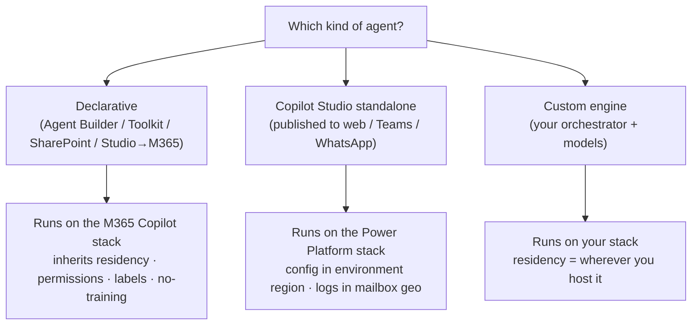

If you've answered the Copilot security questions and the data-residency questions, there's a third wave coming: **agents**. And the first thing to know is that *"is an agent safe with our data?"* has no single answer — it depends entirely on which **kind** of agent you're talking about.

A declarative agent inside Microsoft 365 Copilot inherits everything you've already assured. A Copilot Studio agent runs on a different stack, in a different data location. A custom engine agent runs on whatever you bring. And an *autonomous* agent can act on someone else's credentials. So this guide does the one thing the marketing slides don't: it tells you **where each kind of agent's data actually goes, and how you govern it** — with the honest caveats.

This is the agent companion to the [data residency guide](/blog/microsoft-365-copilot-data-residency-anz-government/), which flagged that Copilot Studio agents have their own residency rules. Here's the detail.

*An agent's data flow depends on its type: declarative agents run on the Microsoft 365 stack; Copilot Studio standalone agents on the Power Platform stack; custom engine agents on your own — with Agent 365 as the control plane over all.*

**Quick links:**

- [The 30-second answer](#the-30-second-answer)
- [First: the four things people call an "agent"](#first-the-four-things-people-call-an-agent)
- [Where the data lives: two different stacks](#where-the-data-lives-two-different-stacks)
- [Do agents respect permissions? (mostly — with one big exception)](#do-agents-respect-permissions-mostly--with-one-big-exception)
- [Agent identity: Entra Agent ID & Agent 365](#agent-identity-entra-agent-id--agent-365)
- [Governing who can build and use agents](#governing-who-can-build-and-use-agents)
- [DLP and channels for Copilot Studio](#dlp-and-channels-for-copilot-studio)
- [Connectors and data egress](#connectors-and-data-egress)
- [Purview for agents](#purview-for-agents)
- [Residency: Copilot Studio vs Microsoft 365 Copilot](#residency-copilot-studio-vs-microsoft-365-copilot)
- [Your agent governance checklist](#your-agent-governance-checklist)
- [Common misconceptions](#common-misconceptions-the-agent-gotchas)
- [FAQ](#frequently-asked-questions)

This is a living document. The agent landscape is moving fast — products, names and controls change monthly. If you spot anything out of date, please [send me feedback](/feedback/) and I'll update it. Last verified: June 2026.

> ⚠️ **The one-line caveat to lead with:** an agent doesn't add a security layer — it **inherits** your existing permissions and surfaces whatever the caller (or, for autonomous agents, the *maker*) can already reach. Fix oversharing first; the agent will faithfully expose whatever you left open.

---

## The 30-second answer

| The question | The short answer |
|---|---|
| **Does agent data stay in the M365 boundary?** | Declarative agents: the core interaction, yes — but actions/connectors can send data out. Copilot Studio & custom engine: a different stack. |
| **Where's a Copilot Studio agent's data?** | Config in the Power Platform **environment region**; conversation logs in each user's **Exchange mailbox geo**. |
| **Do agents respect permissions?** | Yes for user-facing agents — **except autonomous ones**, which run on the **maker's** credentials. |
| **Who controls which agents run?** | M365 admin center (M365 Copilot agents) + Power Platform admin center DLP (Copilot Studio). |
| **Can we audit them?** | Yes — Purview audit log, DSPM for AI, and eDiscovery. |
| **What governs it all at scale?** | **Agent 365** — the control plane (registry, map, lifecycle), GA since May 2026. |

### The three caveats worth knowing up front

1. **"Agent" means four different things** — and they don't share a data stack. Always ask *which kind*.
2. **Autonomous agents run on the maker's credentials.** There's no service-account option today, so an event-triggered agent can expose data the maker can reach.
3. **DLP for Copilot Studio lives in the Power Platform admin center**, not Purview — and Purview's DLP coverage for Copilot Studio is limited. Don't assume your M365 Copilot DLP policy covers a Copilot Studio agent.

---

## First: the four things people call an "agent"

Get this taxonomy right and every other answer falls into place.

| Kind | Built with | Runs on | Data stack |
|---|---|---|---|
| **Declarative agent** | Agent Builder, Agents Toolkit, SharePoint, or Copilot Studio (published to M365 Copilot) | The **Microsoft 365 Copilot** orchestrator, models and trusted AI services | M365 — inherits Copilot residency, permissions, labels, no-training |
| **Custom engine agent** | M365 Agents SDK, Teams SDK, Copilot Studio, or Microsoft Foundry | **Your** orchestration and AI models | Wherever you host them |
| **Copilot Studio standalone agent** | Copilot Studio, published to web/Teams/WhatsApp etc. | The **Power Platform** stack | Power Platform environment + Dataverse |
| **Agent 365** | — | It's the **control plane**, not an agent | Governs registered/integrated agents |

> **A note on Microsoft's official taxonomy:** Microsoft's documentation describes **two** categories — *declarative* and *custom engine*. This guide splits out **"Copilot Studio standalone"** as its own row because a Copilot Studio agent published to non-Copilot channels carries meaningfully different data-residency obligations — even though, in Microsoft's classification, it's technically a *custom engine* agent. The quick test: **if the agent is available inside Microsoft 365 Copilot chat, it's declarative (M365 stack); if it's published to standalone channels via Copilot Studio, treat it as the Power Platform stack** regardless of label.

> **The detail that catches people:** even a declarative agent built with **Agent Builder** (the simplest, in-Copilot tool) has its capabilities *processed by Copilot Studio* — data can flow to and from both Microsoft 365 and Copilot Studio, governed by the product terms for each. The core interaction stays in the Microsoft 365 boundary; agent *actions and plugins* can reach beyond it. So "declarative = fully inside M365" is true for the conversation, with an asterisk for what its actions call.

*Sources: [Declarative agents](https://learn.microsoft.com/en-us/microsoft-365-copilot/extensibility/overview-declarative-agent) · [Custom engine agents](https://learn.microsoft.com/en-us/microsoft-365-copilot/extensibility/overview-custom-engine-agent) · [Agent Builder](https://learn.microsoft.com/en-us/microsoft-365-copilot/extensibility/agent-builder) · [Agent 365](https://learn.microsoft.com/en-us/microsoft-agent-365/overview).*

---

## Where the data lives: two different stacks

This is the question the residency guide pointed here for. **Declarative agents** follow Microsoft 365 Copilot's residency exactly — home geo, with Advanced Data Residency or Multi-Geo to pin it (see the [residency guide](/blog/microsoft-365-copilot-data-residency-anz-government/)). **Copilot Studio agents are different**, and in a way that surprises people:

- **Configuration** (the agent definition, topics, flows, in Dataverse) is stored in the **Power Platform environment's region**, which an admin chooses when the environment is created. If your tenant's location isn't supported, it **defaults to the United States**.
- **Conversation and activity logs** are stored in **the geographic region of each end user's Exchange mailbox** — *regardless of the environment region* — and are governed by **Microsoft 365 terms**, not Azure compliance.

| Aspect | M365 Copilot (declarative agents) | Copilot Studio agents (Power Platform) |
|---|---|---|
| Config / definition | M365 stack | **Power Platform environment region** (defaults to US if unsupported) |
| Conversation & activity logs | M365 home geo (ADR / Multi-Geo to pin) | **End user's Exchange mailbox geo** (M365 terms) |
| How you control the geo | ADR or Multi-Geo add-on | Choose the **environment region** at creation |
| EU Data Boundary | M365 EU Data Boundary service | In scope **only if every environment** is in an EUDB region |
| Governed by | Product Terms + DPA | Power Platform terms **+** Microsoft Product Terms |

> ⚠️ **The practical upshot for ANZ:** an Australian user's Copilot Studio conversation logs land in Australia (their mailbox geo) even if the environment was created elsewhere — but a colleague with a non-AU mailbox interacting with the same agent has *their* logs stored in *their* mailbox geo. And the agent's Dataverse configuration follows the environment region, not the mailbox. Two different storage stories in one agent.

You also get two extra controls on the Copilot Studio side: **disable cross-geo data movement** for generative-AI features outside the US, and **Customer Managed Keys** for Copilot Studio environments (though **not** for Agent Builder agents).

*Sources: [Copilot Studio data location](https://learn.microsoft.com/en-us/microsoft-copilot-studio/data-location) · [Manage activity data in M365](https://learn.microsoft.com/en-us/microsoft-copilot-studio/manage-activity-data-m365) · [Geo & data residency](https://learn.microsoft.com/en-us/microsoft-copilot-studio/geo-data-residency) · [Power Platform data storage](https://learn.microsoft.com/en-us/power-platform/admin/security/data-storage).*

---

## Do agents respect permissions? (mostly — with one big exception)

**The good news:** user-facing agents run on the **signed-in user's identity**. A declarative agent only surfaces what the user can already access — the semantic index honours the user's identity-based access boundary — and a Copilot Studio agent using **generative answers over SharePoint** queries SharePoint **as the end user**, scoped to what they're allowed to see. An agent doesn't add permissions; it inherits yours. So your **oversharing problem is the agent's oversharing problem** — fix SharePoint and OneDrive permissions before you scale.

**The big exception — say it plainly:**

> ⚠️ **Autonomous, event-triggered agents run on the *maker's* credentials.** When a Copilot Studio agent acts automatically on an event (a SharePoint item created, a file added, a task completed) rather than in response to a user, *"all triggers and actions that require authentication must use the maker's credentials."* There is **no service-account or system-identity option** today. That means a user who can invoke such an agent may reach data and systems the **maker** can access — not just what they themselves can. Microsoft shows a warning at publish time. If that risk isn't acceptable, **block event triggers** with Power Platform DLP.

And one more: a Copilot Studio agent published with **"No authentication"** lets **anyone with the link** chat with it. That's fine for a public FAQ bot; it's a data-exposure incident waiting to happen if the agent has access to anything sensitive. Require Entra authentication (and you can enforce that tenant-wide with DLP).

*Sources: [Microsoft 365 Copilot privacy](https://learn.microsoft.com/en-us/copilot/microsoft-365/microsoft-365-copilot-privacy) · [About triggers (maker credentials)](https://learn.microsoft.com/en-us/microsoft-copilot-studio/authoring-triggers-about) · [End-user authentication](https://learn.microsoft.com/en-us/microsoft-copilot-studio/configuration-end-user-authentication).*

---

## Prompt injection and tool misuse

The risk that's unique to agents — versus a static app — is that an agent reads **untrusted content and acts on it**. A malicious instruction hidden in a web page, an email or a document an agent ingests can try to make it call a tool, leak data, or take an action it shouldn't — an *indirect prompt injection* (XPIA). Microsoft 365 Copilot's always-on jailbreak/XPIA classifiers cover declarative agents, but the moment an agent has **tools, connectors and autonomous triggers**, the blast radius grows. Govern it:

- **Least-privilege tools** — give an agent only the connectors and actions it needs; default-deny the rest with DLP.
- **Human-in-the-loop for high-impact actions** — don't let an agent send mail, write to a system of record, or move money without a confirmation step.
- **Allowlist endpoints** — use endpoint filtering so the HTTP node and web/SharePoint knowledge can only reach approved destinations.
- **Trust the source, not just the agent** — treat any knowledge source containing user-generated or external content as a potential injection vector.
- **Monitor and red-team** — watch for risky AI usage in DSPM and Microsoft Defender, and test agents with adversarial prompts before publishing.

*Source: [Microsoft 365 Copilot privacy (content safety & protections)](https://learn.microsoft.com/en-us/copilot/microsoft-365/microsoft-365-copilot-privacy).*

---

## Agent identity: Entra Agent ID & Agent 365

Agents are a new class of identity — they make dynamic decisions and act on their own, so they need stronger identity governance than a static service principal.

**Microsoft Entra Agent ID** gives each agent a purpose-built identity with **enforced human sponsorship** (every agent has an owner), **lifecycle governance** from provisioning to deactivation, identity *blueprints* for consistent policy at scale, and standard protocols (OAuth 2.0, MCP, agent-to-agent). It can even bring **non-Microsoft agents** (AWS Bedrock, n8n) under a governed Entra identity. The full agent-security controls — Conditional Access, Identity Protection and governance *for agents* — require **Microsoft 365 E7**, or **E5 plus an Agent 365 licence**, or standalone Entra P1/P2 add-ons that **each also require a Microsoft Agent 365 licence** (so don't budget Entra P1/P2 alone).

**Microsoft Agent 365** is the **control plane** (generally available since **1 May 2026**) that sits on top:

- **Agent Registry** — every agent in the tenant, with adoption, activity and health.
- **Agent Map** — a visual map of how agents interact across the enterprise.
- **Lifecycle management** — access, compliance and reviews across the M365 admin center, Entra and Purview.
- **Ownerless-agent reassignment** — bulk-reassign orphaned agents to the previous owner's manager via the Entra hierarchy (currently limited to **Agent Builder–created** agents).

*Agent 365's registry in the Microsoft 365 admin center — every agent in the tenant, with at-risk, ownerless and blocked counts. (Microsoft demo environment.)*

> **Why this matters:** the failure mode for agents isn't one rogue bot — it's *sprawl*: hundreds of agents, unknown owners, unclear access. Entra Agent ID + Agent 365 are how you keep an inventory and an owner for every one.

*Sources: [Microsoft Entra Agent ID](https://learn.microsoft.com/en-us/entra/agent-id/what-is-microsoft-entra-agent-id) · [Agent 365 overview](https://learn.microsoft.com/en-us/microsoft-agent-365/overview).*

---

## Governing who can build and use agents

**For Microsoft 365 Copilot agents**, the controls are in the **Microsoft 365 admin center**:

- **Integrated Apps** — view the **permissions, data access, terms of use and privacy statement** each agent declares, and allow, block or disable it. *"A user can only access the agents that their admin allows."*
- **Allowed agent types** — selectively permit agents built **by Microsoft**, **by your organisation**, or **by external publishers**.
- **Sharing & user-access controls** — restrict who can share and who can use agents (all / none / specific users or groups).

**For Copilot Studio agents**, governance is in the **Power Platform admin center** — primarily **DLP** (below) plus **environment routing**, which automatically steers makers into a controlled environment instead of the permissive default.

> **A note on the "Copilot Control System":** you'll hear that term for the overall framework that manages how people use Copilot and agents. In practice it's not a single screen — the controls are split between the **Microsoft 365 admin center** (for M365 Copilot agents) and the **Power Platform admin center** (for Copilot Studio agents). [Here's the deeper guide to the Copilot Control System](/blog/microsoft-365-copilot-control-system-complete-guide/).

*Sources: [Microsoft 365 Copilot privacy (Integrated Apps)](https://learn.microsoft.com/en-us/copilot/microsoft-365/microsoft-365-copilot-privacy) · [Agent settings](https://learn.microsoft.com/en-us/microsoft-365/admin/manage/agent-settings).*

---

## DLP and channels for Copilot Studio

Data Loss Prevention for Copilot Studio lives in the **Power Platform admin center**, and it's more capable than people expect.

**Connector groups** — every connector sits in one of three groups, and **connectors in different groups can't share data**:

| Group | Behaviour |
|---|---|
| **Business** | Shares data only with other Business connectors |
| **Non-Business** | Shares data only with other Non-Business connectors |
| **Blocked** | Can't be used at all |

Enforcement is **real-time** — makers and users see an error on any violation — and policy changes can take **up to 24 hours** to fully propagate.

**Virtual connectors** are the powerful bit: they're on/off switches for agent *features*, not data sources. With DLP you can:

- **Require Entra authentication** (block "Chat without Microsoft Entra ID authentication")
- **Block knowledge sources** — SharePoint/OneDrive, public web, or uploaded documents
- **Block the HTTP node** (arbitrary egress — see below)
- **Block event triggers** (the autonomous-agent risk above)
- **Block publish channels** — Teams/M365, Direct Line/custom website, and others

You can also use **endpoint filtering** to allow specific SharePoint sites, websites or HTTP endpoints instead of blocking a whole connector type.

> **A useful default to know:** connectors introduced after 2019 — including the no-auth chat connector and Direct Line channels — usually land in the **Non-Business** group, which many organisations **block by default**. So these riskier channels may already be off in your tenant. Confirm, don't assume.

**Channels and authentication** — where you publish changes the exposure:

| Channel | Authentication | Exposure |
|---|---|---|
| **Teams + M365 Copilot** | Entra SSO (automatic) | Highest control — user always authenticated |
| **SharePoint** | Entra (Microsoft) | Scoped to the site |
| **Custom website / Direct Line** | No-auth / Entra / manual | ⚠️ No-auth = public access |
| **Facebook / WhatsApp** | External OAuth | Data transits the external platform |

*Sources: [Copilot Studio DLP](https://learn.microsoft.com/en-us/microsoft-copilot-studio/admin-data-loss-prevention) · [Power Platform DLP](https://learn.microsoft.com/en-us/power-platform/admin/wp-data-loss-prevention) · [Security & governance](https://learn.microsoft.com/en-us/microsoft-copilot-studio/security-and-governance).*

---

## Connectors and data egress

An agent's **actions** are where data leaves the tenant. When an agent calls an external connector (Salesforce, SAP, anything), conversation and context data is sent to that system — and for non-Microsoft connectors, *"the responsibility belongs to the agent maker."*

The sharpest edge is the **HTTP request node** in Copilot Studio: it can call **any endpoint**, which is arbitrary data egress. Block the HTTP connector with DLP if you don't want makers reaching the open internet, or use endpoint filtering to allow only specific URLs. Note too that **blocking a Power Platform connector also blocks the tools in any MCP server** that relies on it — useful as agents increasingly use MCP.

> **The governance principle:** treat every connector and the HTTP node as a potential exfiltration path, and default-deny the ones you haven't reviewed. DLP connector groups are how you make "default-deny" real.

*Sources: [Power Platform DLP](https://learn.microsoft.com/en-us/power-platform/admin/wp-data-loss-prevention) · [Copilot Studio DLP](https://learn.microsoft.com/en-us/microsoft-copilot-studio/admin-data-loss-prevention) · [Geo & data residency (connectors)](https://learn.microsoft.com/en-us/microsoft-copilot-studio/geo-data-residency).*

---

## Purview for agents

Microsoft Purview extends across all three agent surfaces — but **not evenly**, and the gaps matter.

| Capability | M365 Copilot (declarative) | Copilot Studio | Agent 365 |
|---|---|---|---|
| DSPM for AI · Audit · eDiscovery | ✅ | ✅ | ✅ |
| Data classification | ✅ | ✅ | ✅ |
| Sensitivity labels | ✅ | ✅ (SharePoint/OneDrive + Dataverse sources) | ✅ |
| **Encryption without sensitivity labels** | ✅ | ❌ | ❌ |
| **DLP** | ✅ | ⚠️ **Endpoint DLP only** (SharePoint knowledge; broader DLP via the Power Platform admin center) | ✅ |
| Insider Risk · Comms Compliance · Retention | ✅ | ✅ | ✅ |

**The honest gaps to flag in a review:**

- **DLP for Copilot Studio is limited.** Purview's Endpoint DLP only restricts Copilot Studio agents from processing sensitive content when the **knowledge source is SharePoint** and the policy is scoped to the Microsoft 365 Copilot location. For everything else, your DLP is the **Power Platform admin center**, not Purview.
- **Agent 365 content doesn't inherit labels.** *"Newly created content from Agent 365 doesn't inherit sensitivity labels from the source items"* — so an agent can generate an output that isn't labelled like its inputs.
- **Lockbox and CMK gaps.** Customer Lockbox **and Customer Managed Keys** don't cover the data sent from Copilot Studio as part of Agent 365 security audit logging — and **neither Lockbox nor CMK** is supported for agents built with Agent Builder.
- **Agent 365 files must be explicitly shared.** *"For agent instances to access files, the files must be explicitly shared with them"* — a deliberate, tighter model than user-identity inheritance.

On the positive side, the current **Data Security Posture Management (DSPM)** gives you a single dashboard for agent usage with one-click policies (detect risky AI usage, sensitive info shared with AI), agent prompts and responses land in the **unified audit log**, and **Agent 365 instances are automatically enabled** for audit, data classification and the AI assessments in Compliance Manager.

*DSPM's AI observability gives one view of agent risk — oversharing, exfiltration — across the estate. (This is the current DSPM, not the classic "DSPM for AI". Microsoft demo environment.)*

> ⚠️ **DSPM version matters.** Agent 365 activity surfaces in the **current** Data Security Posture Management (via its *AI observability* page) — **not** in the first-generation *"DSPM for AI (classic)."* If your compliance team is still on the classic console, they have **no visibility into Agent 365 activity**. Confirm you're on the current DSPM before you rely on it for agent governance.

*Sources: [Purview for AI](https://learn.microsoft.com/en-us/purview/ai-microsoft-purview) · [Purview & Copilot Studio](https://learn.microsoft.com/en-us/purview/ai-copilot-studio) · [Purview & Agent 365](https://learn.microsoft.com/en-us/purview/ai-agent-365).*

---

## Residency: Copilot Studio vs Microsoft 365 Copilot

Pulling the residency thread together, because it's the single most-asked agent governance question for regulated ANZ customers:

- **Declarative agents** = Microsoft 365 Copilot residency. Australia is committed automatically via the Product Terms; New Zealand needs **ADR or Multi-Geo**. (Full detail in the [residency guide](/blog/microsoft-365-copilot-data-residency-anz-government/).)
- **Copilot Studio agents** = Power Platform residency. The **environment region** (chosen at creation) holds the config and Dataverse; the **end user's Exchange mailbox geo** holds the conversation logs; unsupported locations **default to the US**; and the **EU Data Boundary applies only if every environment** is in an EUDB region.
- **Controls you have:** pick the right environment region up front, **disable cross-geo data movement** outside the US, and use **Customer Managed Keys** for Copilot Studio environments.

> **The assurance-team takeaway:** you can't answer "where does our agent's data live?" with one sentence. You answer it per agent *type*, and for Copilot Studio you answer it twice — once for the environment (config) and once for the mailbox geo (logs).

*Sources: [Copilot Studio data location](https://learn.microsoft.com/en-us/microsoft-copilot-studio/data-location) · [Data residency for M365 Copilot](https://learn.microsoft.com/en-us/microsoft-365/enterprise/m365-dr-workload-copilot).*

---

## The agent data-flow review worksheet

Before you approve any agent, walk its data flow end to end. One row per agent — this is the artifact to keep on file:

| Field | What to capture |
|---|---|
| **Agent type** | Declarative (M365 stack) · Copilot Studio standalone (Power Platform) · custom engine |
| **Channel & auth** | Where it's published, and whether it requires Entra auth (or runs no-auth) |
| **Acting identity** | The signed-in user — or, for autonomous triggers, the **maker's** connections |
| **Knowledge sources** | SharePoint/OneDrive · Graph · uploaded files · public web · Dataverse |
| **Actions / connectors / MCP** | Every connector, HTTP endpoint and MCP tool it can call (each is an egress path) |
| **External endpoints** | Any non-Microsoft system data is sent to (Salesforce, SAP, HTTP, social channels) |
| **Storage** | Config region (Power Platform environment) · conversation-log geo (user mailbox) |
| **Audit / eDiscovery** | Where interactions are logged, and how you'd discover them |
| **Owner & kill switch** | The human owner, and exactly how you'd disable or unpublish it fast |

> Treat **MCP tools and agent-to-agent calls like connectors**: inventory the endpoint, the auth, the data passed, the logging, and whether a downstream agent or tool can persist or forward your content. Indirect access paths are where audits get interesting.

---

## Your agent governance checklist

Staged — because you can act on most of this before any Agent 365 procurement lands:

**Day 0 — close the obvious holes**
1. **Fix SharePoint/OneDrive oversharing first** — the agent faithfully surfaces whatever you left open.
2. **Require Entra authentication** and **block the no-auth connector** with Power Platform DLP.
3. **Block event triggers, the HTTP node and risky channels** unless you've explicitly accepted the risk.
4. **Decide which agent types you allow** (Microsoft / organisation / external) in the M365 admin center.

**Day 30 — build the guardrails**
5. **Route makers into a controlled environment**, and set tenant-wide DLP with endpoint filtering for what you do allow.
6. **Choose the environment region** at creation; disable cross-geo data movement (and M365-powered activity logging) if residency demands it.
7. **Confirm your DSPM, audit, eDiscovery and retention** actually cover agent interactions — on the *current* DSPM, not the classic one.
8. **Vet external / ISV agents** before allowing them: publisher trust, the permissions and data destinations they declare, retention/deletion, tenant consent, support access, and the disable path.

**Scale — govern the estate**
9. **Stand up Agent 365 + Entra Agent ID** so every agent has an owner, an identity and a registry entry — before sprawl sets in.
10. **Keep an incident-response runbook for agents:** identify the owner, disable/unpublish the agent, block the connector/channel, revoke the maker's connections, preserve audit/eDiscovery evidence, rotate any exposed secrets, and notify your data/security teams.

---

## Common misconceptions (the agent gotchas)

- **"An agent is safe because it's Microsoft Copilot."** Only declarative agents inherit the M365 stack. Copilot Studio and custom engine agents are different.
- **"Agents only see what the user can see."** True for user-facing agents — but **autonomous agents run on the maker's credentials**.
- **"Our M365 Copilot DLP covers our agents."** Copilot Studio DLP is mostly in the **Power Platform admin center**; Purview DLP coverage for Studio is limited.
- **"The agent's data is wherever we set the environment."** The **config** is; the **conversation logs** follow each user's **mailbox geo**.
- **"Sensitivity labels always carry through."** Agent 365 output **doesn't inherit** labels from its sources, and labels only apply to SharePoint/Dataverse knowledge in Copilot Studio.
- **"Customer Key and Lockbox protect every agent."** Not Agent Builder agents — CMK and Lockbox aren't supported there.
- **"No-auth is fine, it's just a chatbot."** No-auth means **anyone with the link**. Fine for public FAQs; dangerous with sensitive access.

---

## Frequently asked questions

**Do Copilot agents keep data in the Microsoft 365 boundary?**
Declarative agents do (they run on the M365 Copilot stack). Copilot Studio standalone agents run on Power Platform, and custom engine agents on whatever you bring — check which kind you have.

**Where is a Copilot Studio agent's data stored?**
Config in the Power Platform environment region; conversation logs in each user's Exchange mailbox geo (M365 terms). Unsupported locations default to the US.

**Do agents respect permissions?**
User-facing agents run on the signed-in user's identity. Autonomous event-triggered agents run on the maker's credentials — a real oversharing risk to govern.

**Who controls which agents run?**
M365 admin center (Integrated Apps, allowed agent types, sharing/user access) for M365 Copilot agents; Power Platform admin center DLP + environment routing for Copilot Studio.

**How does DLP work for Copilot Studio?**
Power Platform DLP classifies connectors (Business / Non-Business / Blocked), enforced in real time, with virtual connectors to switch features (auth, knowledge, HTTP, triggers, channels) on or off.

**What is Agent 365?**
The control plane for agents (GA May 2026) — registry, map, lifecycle, ownerless-agent reassignment — across the M365 admin center, Entra and Purview. Not an agent type.

**Do agents get their own identity?**
Yes — Microsoft Entra Agent ID, with enforced human sponsorship and lifecycle governance. Full agent security controls need E7, or E5 + Agent 365.

**Can we audit agent activity?**
Yes — Purview unified audit log, DSPM for AI, and eDiscovery (Copilot activity condition). Agent 365 instances are auto-enabled for audit and classification.

**Does the EU Data Boundary cover Copilot Studio?**
Only if every environment is created in an EUDB region — a stricter, admin-driven condition than M365 Copilot's boundary.

**What's the single biggest agent risk?**
Oversharing — your existing SharePoint permissions, plus autonomous agents running on the maker's credentials. Fix permissions and govern triggers before you scale.

---

## Related guides

- [Microsoft 365 Copilot Security: Top Questions Answered](/blog/microsoft-365-copilot-security-questions-answered/) *(the security pillar this guide belongs to)*
- [Copilot Data Residency & Sovereignty for ANZ & Government](/blog/microsoft-365-copilot-data-residency-anz-government/) *(where the data lives — the residency companion)*
- [Copilot Certifications & Compliance for RFPs](/blog/microsoft-365-copilot-compliance-certifications-rfp/) *(what it's certified against)*
- [Agent 365 Security — Entra, Purview, Defender](/blog/agent-365-security-governance-complete-guide/)
- [The Copilot Control System Explained](/blog/microsoft-365-copilot-control-system-complete-guide/)
- [SharePoint Oversharing Controls for Copilot](/blog/sharepoint-oversharing-controls-microsoft-365-copilot/)

*Everything here is grounded in Microsoft's official documentation, linked inline. The agent landscape changes fast — for a formal review, re-check the live Microsoft pages on the day, and confirm anything tenant-specific (your environments, your licensing, your agent inventory) with your Microsoft account team.*
