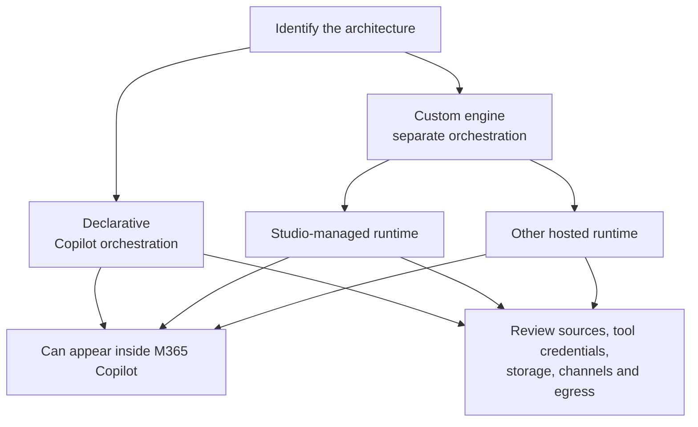

If you've answered the Copilot security and residency questions, agents need a further review. The agent's type matters, but so do its channel, tool credentials, knowledge sources and storage settings.

A declarative agent uses Microsoft 365 Copilot orchestration. A custom-engine agent uses separate orchestration, which can be managed by Copilot Studio or hosted elsewhere. Either category can be available inside Microsoft 365 Copilot. A familiar chat window does not settle the security review.

This is the agent companion to the [data residency guide](/blog/microsoft-365-copilot-data-residency-anz-government/), which flagged that Copilot Studio agents have their own residency rules. Here's the detail.

The diagram below separates architecture from hosting. It replaces the earlier illustration, which incorrectly implied that Copilot Studio and custom-engine agents were separate categories and that all Studio logs followed mailbox geography.

**Quick links:**

- [The 30-second answer](#the-30-second-answer)
- [Architecture, platform and management are different](#first-the-four-things-people-call-an-agent)
- [Where the data lives: several stores](#where-the-data-lives-two-different-stacks)
- [Permissions: check every credential and source](#do-agents-respect-permissions-mostly--with-one-big-exception)
- [Agent identity: Entra Agent ID & Agent 365](#agent-identity-entra-agent-id--agent-365)
- [Governing who can build and use agents](#governing-who-can-build-and-use-agents)
- [DLP and channels for Copilot Studio](#dlp-and-channels-for-copilot-studio)
- [Connectors and data egress](#connectors-and-data-egress)
- [Purview for agents](#purview-for-agents)
- [Residency: Copilot Studio vs Microsoft 365 Copilot](#residency-copilot-studio-vs-microsoft-365-copilot)
- [Your agent governance checklist](#your-agent-governance-checklist)
- [Common misconceptions](#common-misconceptions-the-agent-gotchas)
- [FAQ](#frequently-asked-questions)

**Documentation reviewed: 15 September 2026.** This update checks public Microsoft sources, not tenant behaviour. No agents, policies or retention settings were tested. Existing demo screenshots illustrate the interfaces, not verified coverage in your tenant. Please [send me feedback](/feedback/) if something changes.

> **Start with the acting identity.** End-user sign-in and a tool's connection identity are separate. A signed-in chat can still call a maker-authenticated tool. Review the source permissions and where the result is sent.

---

## The 30-second answer

| The question | The short answer |
|---|---|
| **Does agent data stay in the M365 boundary?** | Trace each flow. Agent Builder involves Studio processing; custom-engine agents can also appear inside Copilot. |
| **Where's a Copilot Studio agent's data?** | Environment data, supported Dataverse transcripts, M365-powered mailbox history, temporary storage and external logs have separate rules. |
| **Do agents respect permissions?** | User-authenticated retrieval respects source access; maker-provided tools can use broader credentials even during chat. |
| **Who controls which agents run?** | M365 admin center (M365 Copilot agents) + Power Platform admin center DLP (Copilot Studio). |
| **Can we audit them?** | Supported metadata is in Purview Audit; content retrieval and coverage must be checked separately. |
| **What helps govern agents at scale?** | **Agent 365** provides registry, map and lifecycle capabilities for supported integrations; Commercial GA since 1 May 2026. |

### The three caveats worth knowing up front

1. **Architecture is not the chat channel.** Declarative and custom-engine agents can both be hosted inside Microsoft 365 Copilot.
2. **Maker credentials are not just an autonomous-agent issue.** Studio tools can use them in an interactive conversation too.
3. **DLP has more than one policy surface.** Power Platform connector policies and Purview content policies cover different risks.

---

## Architecture, Platform and Management Are Different {#first-the-four-things-people-call-an-agent}

Microsoft documents two architectural categories. Copilot Studio is a platform that can build agents; Agent 365 is a management service, not a third architecture.

| Term | What it means | Runtime | Review focus |
|---|---|---|---|
| **Declarative agent** | Instructions, knowledge and capabilities using Copilot orchestration | Microsoft 365 Copilot, with connected services as configured | Sources, permissions, processing and tools |
| **Custom-engine agent** | Separate orchestration, built with Studio, SDKs or other platforms | Studio-managed or independently hosted; can be surfaced in M365 Copilot | Runtime, credentials, stores and egress |
| **Copilot Studio** | A builder and managed platform, not a mutually exclusive agent type | Depends on the agent and publication path | Environment, authentication, transcripts and policies |
| **Agent 365** | Management and security for registered/integrated agents | Not an agent runtime category | Inventory coverage, identity, ownership and policy scope |

> **Do not classify by the window.** Microsoft's [custom-engine overview](https://learn.microsoft.com/en-us/microsoft-365/copilot/extensibility/overview-custom-engine-agent) explicitly includes Copilot Studio agents operating inside Microsoft 365 Copilot. Inspect the agent's architecture and deployment, not just where the user opens it.

Agent Builder creates declarative agents, but its capabilities are processed by Copilot Studio. Microsoft's documentation says data can flow between Microsoft 365 and Studio under the respective product terms. Tools and connectors add further destinations. "Declarative" does not mean every part of the data flow stays in one service.

```mermaid
flowchart TD
    Q["Identify the architecture"] --> D["Declarative<br/>Copilot orchestration"]
    Q --> C["Custom engine<br/>separate orchestration"]
    C --> S["Studio-managed runtime"]
    C --> H["Other hosted runtime"]
    D --> U["Can appear inside M365 Copilot"]
    S --> U
    H --> U
    D --> R["Review sources, tool credentials,<br/>storage, channels and egress"]
    S --> R
    H --> R
```

*Sources: [Declarative agents](https://learn.microsoft.com/en-us/microsoft-365-copilot/extensibility/overview-declarative-agent) · [Custom engine agents](https://learn.microsoft.com/en-us/microsoft-365-copilot/extensibility/overview-custom-engine-agent) · [Agent Builder](https://learn.microsoft.com/en-us/microsoft-365-copilot/extensibility/agent-builder) · [Agent 365](https://learn.microsoft.com/en-us/microsoft-agent-365/overview).*

---

## Where the Data Lives: Several Stores {#where-the-data-lives-two-different-stacks}

Start with the Microsoft 365 service commitments for the core Copilot experience, then trace the connected processing and storage. For Studio, distinguish these records:

| Store or flow | Documented location or behaviour | Governance consequence |
|---|---|---|
| **Environment data** | Power Platform environment geography, with documented service exceptions | Review the chosen region, configuration and connected services |
| **Agent Builder embedded files** | Tenant default geography, not the user's preferred data location | Review agent sharing and embedded-content protection separately from live source permissions |
| **M365-powered historical activity** | End user's Exchange mailbox geography, regardless of environment geography | This specific history uses M365 retention; the trigger invoker can be the maker |
| **Dataverse ConversationTranscript** | Operational transcripts in supported environments | Default bulk deletion after 30 days is configurable; this is not the audit retention period |
| **Studio temporary/session storage** | Separately documented temporary storage for up to 28 days | Changing Dataverse retention does not change this store |
| **Purview audit** | Activity metadata and correlation identifiers | Separate permissions, retention and channel coverage |
| **Tools and external logs** | The connected service's storage and terms | Review payloads, logs, exports and deletion separately |

**Dataverse coverage is not universal.** Microsoft's transcript documentation excludes Dataverse for Teams environments and "Microsoft 365 Copilot agents". Because the Copilot UI can also host custom-engine agents, confirm the documented product and publication path instead of inferring transcript coverage from the window. SharePoint-grounded responses are redacted in supported Dataverse transcripts, but questions and source `search_results` can remain.

**Access and switches differ.** Environment Maker alone does not grant transcript access; the Bot Transcript Viewer role is relevant for Power Apps access. Disabling transcript writing or M365-powered historical activity affects future records, not existing data. Turning off a store also reduces evidence available for investigation. Review that trade-off with compliance before changing it.

For ANZ reviews, use the actual mailbox geography, not the user's physical country, for the M365-powered history calculation. Do not extend that rule to all logs. Check cross-region processing settings and key-management support per feature; Agent Builder currently does not support Customer Managed Keys.

*Sources: [Copilot Studio data location](https://learn.microsoft.com/en-us/microsoft-copilot-studio/data-location) · [Manage activity data in M365](https://learn.microsoft.com/en-us/microsoft-copilot-studio/manage-activity-data-m365) · [Geo & data residency](https://learn.microsoft.com/en-us/microsoft-copilot-studio/geo-data-residency) · [Power Platform data storage](https://learn.microsoft.com/en-us/power-platform/admin/security/data-storage).*

Transcript details: [Control transcript storage and access](https://learn.microsoft.com/en-us/microsoft-copilot-studio/admin-transcript-controls) and [work with conversation transcripts](https://learn.microsoft.com/en-us/microsoft-copilot-studio/analytics-transcripts-powerapps).

---

## Permissions: Check Every Credential and Source {#do-agents-respect-permissions-mostly--with-one-big-exception}

User-authenticated retrieval of live SharePoint content respects the user's source permissions. But that is one flow, not a guarantee about every tool in the agent.

**Interactive tools can use maker credentials.** Copilot Studio tools default to **End user authentication**, but makers can select **Maker-provided credentials**. This applies during user chat as well as autonomous use. Signing into the agent does not force every downstream call to use that user's identity.

**Event triggers use configured maker connections.** Microsoft documents that authenticated triggers and autonomous actions need maker credentials that work without user input. Their output can reach recipients or systems with less access than the connection owner. Review the connection principal, permissions and recipients; do not generalise this into a claim that no agent platform or connector supports service identities.

**Agent sharing and source sharing are different.** Agent Builder can offer to share selected SharePoint files/folders when the owner has sharing permission. Removing access to the agent does **not** remove those source grants. Admin restrictions on new agent sharing also do not revoke existing shares. Review both permission sets.

**A copy is not a live source.** Embedded uploaded files and live SharePoint references have different sharing and protection behaviour. Do not assume that changing the original file's ACL removes a copy embedded in an agent.

Agent Builder documents that **Information Barriers are not supported on embedded files**. People with access to the agent can receive answers grounded in that content, subject to the embedded-content label and EXTRACT-rights requirements. Embedded files are stored in the tenant's default geography, not the user's preferred data location. Review those rules before uploading sensitive knowledge.

And one more: a Copilot Studio agent published with **"No authentication"** lets anyone with the link chat with it. That's fine for a public FAQ bot; it's a data-exposure incident waiting to happen if the agent has access to anything sensitive. Require Entra authentication (and you can enforce that tenant-wide with DLP).

Sources: [Tool authentication](https://learn.microsoft.com/en-us/microsoft-copilot-studio/add-tools-custom-agent#authentication-considerations-for-tools), [event triggers](https://learn.microsoft.com/en-us/microsoft-copilot-studio/authoring-triggers-about), [end-user authentication](https://learn.microsoft.com/en-us/microsoft-copilot-studio/configuration-end-user-authentication), [Agent Builder sharing](https://learn.microsoft.com/en-us/microsoft-365/copilot/extensibility/agent-builder-share-manage-agents) and [knowledge sources](https://learn.microsoft.com/en-us/microsoft-365/copilot/extensibility/agent-builder-add-knowledge).

---

## Prompt injection and tool misuse

An agent can read untrusted content and act on it. A malicious instruction in a page, email or document can try to make it misuse a tool or disclose data: an indirect prompt injection. Microsoft's documented Copilot protections help, but are not a guarantee that every tool or custom runtime is protected. Useful safeguards include:

- **Least-privilege tools:** allow only needed connectors and actions; use DLP where supported, plus runtime and API permissions.
- **Human-in-the-loop for high-impact actions** — don't let an agent send mail, write to a system of record, or move money without a confirmation step.
- **Allowlist endpoints** — use endpoint filtering so the HTTP node and web/SharePoint knowledge can only reach approved destinations.
- **Trust the source, not just the agent** — treat any knowledge source containing user-generated or external content as a potential injection vector.
- **Monitor and red-team** — watch for risky AI usage in DSPM and Microsoft Defender, and test agents with adversarial prompts before publishing.

*Source: [Microsoft 365 Copilot privacy (content safety & protections)](https://learn.microsoft.com/en-us/copilot/microsoft-365/microsoft-365-copilot-privacy).*

---

## Agent identity: Entra Agent ID & Agent 365

Agent identities need an accountable owner, reviewed permissions and a lifecycle plan.

**Microsoft Entra Agent ID** provides purpose-built identities and blueprints for integrated agents, including supported third-party platforms. It does not automatically replace each tool's configured connection. The platform is available to Entra customers; extending Entra security features to agents requires Agent 365 and the applicable prerequisites. Current guidance lists E7 inclusion and eligible add-on combinations. Check the linked terms rather than assuming Entra P1/P2 alone covers the full agent controls.

**Microsoft Agent 365** became generally available for the **Commercial segment on 1 May 2026**, with per-user licensing. Its management capabilities include:

- **Agent Registry:** inventory and status for agents within its supported discovery and integration coverage.
- **Agent Map** — a visual map of how agents interact across the enterprise.
- **Lifecycle management** — access, compliance and reviews across the M365 admin center, Entra and Purview.
- **Ownership management:** review ownerless agents and the reassignment options supported for their source.

*Agent 365's registry showing at-risk, ownerless and blocked counts. Reconcile the inventory with your agent sources; this demo is not evidence of complete tenant coverage.*

> **Use the inventory as a review input.** Reconcile it with environments, app registrations and approved external runtimes. Investigate missing or ownerless entries rather than assuming every agent was discovered.

*Sources: [Microsoft Entra Agent ID](https://learn.microsoft.com/en-us/entra/agent-id/what-is-microsoft-entra-agent-id) · [Agent 365 overview](https://learn.microsoft.com/en-us/microsoft-agent-365/overview).*

---

## Governing who can build and use agents

**For Microsoft 365 Copilot agents**, the controls are in the **Microsoft 365 admin center**:

- **Agent registry and applicable Integrated Apps controls:** review publication, availability, declared permissions, data access and publisher terms. Check the controls supported for each source.
- **Allowed agent types** — selectively permit agents built **by Microsoft**, by your organisation, or by external publishers.
- **Sharing & user-access controls** — restrict who can share and who can use agents (all / none / specific users or groups).

**For Copilot Studio agents**, use Power Platform DLP and environment governance as well. Environment routing must be configured; do not assume every maker has already been routed away from the default environment.

Restricting future Agent Builder sharing does not revoke old shares. Review existing agent access and any source permissions granted during sharing separately.

> **A note on the "Copilot Control System":** you'll hear that term for the overall framework that manages how people use Copilot and agents. In practice it's not a single screen — the controls are split between the Microsoft 365 admin center (for M365 Copilot agents) and the Power Platform admin center (for Copilot Studio agents). [Here's the deeper guide to the Copilot Control System](/blog/microsoft-365-copilot-control-system-complete-guide/).

*Sources: [Microsoft 365 Copilot privacy (Integrated Apps)](https://learn.microsoft.com/en-us/copilot/microsoft-365/microsoft-365-copilot-privacy) · [Agent settings](https://learn.microsoft.com/en-us/microsoft-365/admin/manage/agent-settings).*

---

## DLP and channels for Copilot Studio

Copilot Studio uses Power Platform data policies for connector and feature restrictions. Purview content policies cover separate, documented scenarios.

**Connector groups** — every connector sits in one of three groups, and connectors in different groups can't share data:

| Group | Behaviour |
|---|---|
| **Business** | Shares data only with other Business connectors |
| **Non-Business** | Shares data only with other Non-Business connectors |
| **Blocked** | Can't be used at all |

Microsoft documents real-time policy enforcement. After changing a policy, verify the affected agent paths before relying on it; this review did not measure propagation.

**Virtual connectors** represent capabilities such as knowledge, authentication and channels. With DLP you can:

- **Require Entra authentication** (block "Chat without Microsoft Entra ID authentication")
- **Restrict knowledge sources:** use the specific connectors for public web, local uploads and SharePoint/OneDrive uploads. Blocking local document upload does not block the separate SharePoint/OneDrive upload connector.
- **Block the HTTP node** (arbitrary egress — see below)
- **Block event triggers:** the Microsoft Copilot Studio connector controls these and authenticated automated evaluations.
- **Block publish channels** — Teams/M365, Direct Line/custom website, and others

You can also use **endpoint filtering** to allow specific SharePoint sites, websites or HTTP endpoints instead of blocking a whole connector type.

> **Non-business does not mean blocked.** It is a data-separation group. Use the Blocked group for prohibited connectors, and inspect the actual policy rather than assuming a default group prevents use.

**Channels and authentication** — where you publish changes the exposure:

| Channel or setting | What to verify | Exposure |
|---|---|---|
| **Teams / M365 Copilot** | User sign-in, deployment scope and each tool's credentials | SSO does not make maker-authenticated tools user-scoped |
| **SharePoint** | Agent access, source grants and tool credentials | Being on a site does not limit every connected data source to that site |
| **Custom website / Direct Line** | No authentication, Microsoft authentication or manual configuration | No authentication permits anyone with the link to chat |
| **External messaging channels** | Supported authentication and platform terms | The external platform can be a separate data destination |

*Sources: [Copilot Studio DLP](https://learn.microsoft.com/en-us/microsoft-copilot-studio/admin-data-loss-prevention) · [Power Platform DLP](https://learn.microsoft.com/en-us/power-platform/admin/wp-data-loss-prevention) · [Security & governance](https://learn.microsoft.com/en-us/microsoft-copilot-studio/security-and-governance).*

---

## Connectors and data egress

An agent's tools and channels can send data to external systems. Review the actual payload rather than assuming every call sends the whole conversation, or that a read-only tool sends nothing. The connected service can retain requests and results under its own terms.

The sharpest edge is the **HTTP request node** in Copilot Studio: it can call any endpoint, which is arbitrary data egress. Block the HTTP connector with DLP if you don't want makers reaching the open internet, or use endpoint filtering to allow only specific URLs. Note too that blocking a Power Platform connector also blocks the tools in any MCP server that relies on it — useful as agents increasingly use MCP.

> **The governance principle:** review endpoints, credentials, payloads and logs. Block unapproved connectors where supported, and use API permissions and runtime controls for paths DLP does not cover. Merely placing a connector in Non-business is not default-deny.

*Sources: [Power Platform DLP](https://learn.microsoft.com/en-us/power-platform/admin/wp-data-loss-prevention) · [Copilot Studio DLP](https://learn.microsoft.com/en-us/microsoft-copilot-studio/admin-data-loss-prevention) · [Geo & data residency (connectors)](https://learn.microsoft.com/en-us/microsoft-copilot-studio/geo-data-residency).*

---

## Purview for agents

A product-level tick does not establish coverage for a particular source or channel:

| Area | What the current documentation supports | What to check |
|---|---|---|
| **Audit** | Supported interaction and administration metadata | Channel exclusions, integration, role and event arrival |
| **Content investigation** | Supported mailbox content through eDiscovery; other stores have separate access | Case scope, item classes, transcript exclusions and licences |
| **Studio SharePoint knowledge DLP** | Label-based processing restrictions at the Microsoft 365 Copilot location for supported Teams, SharePoint and Copilot channels | Correct source, channel, label, policy scope and propagation |
| **Agent 365 file protection** | Explicit file sharing and, for encrypted files, explicit VIEW and EXTRACT rights for the instance | Do not assume an "all users" encryption grant includes the instance |
| **Retention and risk policies** | Capabilities vary by product and captured data | Configure policy scope and retain each required store separately |

The honest gaps to flag in a review:

- **Name the actual DLP control.** The Studio-specific Purview page places its SharePoint knowledge restriction under an "Endpoint DLP" heading, but describes a policy scoped to the **Microsoft 365 Copilot location**. Do not present it as only a device/browser control. Its documented scope is labelled SharePoint knowledge for Studio agents in Teams, SharePoint and Microsoft 365 Copilot, not every source or external channel. Endpoint DLP protection for browser uploads is a separate scenario.
- **Agent 365 content doesn't inherit labels.** *"Newly created content from Agent 365 doesn't inherit sensitivity labels from the source items"* — so an agent can generate an output that isn't labelled like its inputs.
- **Key and access-control support varies.** Agent Builder does not currently support Customer Managed Keys. Check each store and logging path before asserting that Customer Key or Lockbox covers the entire agent.
- **Agent 365 files must be explicitly shared.** *"For agent instances to access files, the files must be explicitly shared with them"* — a deliberate, tighter model than user-identity inheritance.

Purview audit records contain metadata and message or thread IDs, **not full prompt and response text**. Supported content is retrieved separately through authorised workflows. Agent 365 instances are automatically enabled for audit, classification and AI Compliance Manager assessments; other policies must include the relevant instances. Copilot workload audit defaults to **180 days even on E5**, unless an eligible custom audit policy applies. Content retention is separate.

Viewing DSPM content requires a content-viewer role, such as Content Explorer Content Viewer or Microsoft Purview Data Security AI Content Viewer; a broad admin role alone is not sufficient. eDiscovery needs its own roles and case access. See the [audit guide](/blog/auditing-microsoft-365-copilot/) for those distinctions.

*DSPM's AI observability gives one view of agent risk — oversharing, exfiltration — across the estate. (This is the current DSPM, not the classic "DSPM for AI". Microsoft demo environment.)*

> **Use the documented Agent 365 view.** Its specific Purview guidance points to the current DSPM **AI observability** page. Do not confuse this with the older *Apps and agents* page, which excludes Agent 365. Dashboard availability is separate from whether audit or eDiscovery evidence exists.

*Sources: [Purview for AI](https://learn.microsoft.com/en-us/purview/ai-microsoft-purview) · [Purview & Copilot Studio](https://learn.microsoft.com/en-us/purview/ai-copilot-studio) · [Purview & Agent 365](https://learn.microsoft.com/en-us/purview/ai-agent-365).*

---

## Residency: Copilot Studio vs Microsoft 365 Copilot

Pulling the residency thread together, because it's the single most-asked agent governance question for regulated ANZ customers:

- **Core Copilot processing and storage:** check the applicable Microsoft 365 service commitments, tenant eligibility and residency settings. Do not extend an at-rest commitment to all processing, models or connectors.
- **Studio:** map environment data, supported Dataverse transcripts, M365-powered mailbox history and temporary storage separately. The data-location page lists geography defaults and exceptions; external services add their own destinations.
- **EU Data Boundary:** Studio's documented condition includes an **EU/EFTA tenant billing address and every environment in an EUDB region**. Review service and model exceptions too.
- **Controls:** select the environment region, review cross-region processing and historical-activity settings, and check key-management coverage for each feature. Disabling history affects evidence collection and does not relocate or delete existing records.

> **The review needs one row per data flow**, not just one country per agent. Include configuration, live retrieval, embedded copies, conversation stores, audit and external tool logs.

*Sources: [Copilot Studio data location](https://learn.microsoft.com/en-us/microsoft-copilot-studio/data-location) · [Data residency for M365 Copilot](https://learn.microsoft.com/en-us/microsoft-365/enterprise/m365-dr-workload-copilot).*

---

## The agent data-flow review worksheet

Before approving an agent, record these details and expand the sources, credentials and stores into one row per data flow:

| Field | What to capture |
|---|---|
| **Architecture and runtime** | Declarative or custom engine; Studio-managed or another runtime |
| **Channel & auth** | Where it's published, and whether it requires Entra auth (or runs no-auth) |
| **Acting identity** | End-user or maker-provided credentials per tool; trigger principal; any agent identity |
| **Knowledge sources** | Live SharePoint/OneDrive, Graph, embedded copies, public web or Dataverse; source-sharing grants |
| **Actions / connectors / MCP** | Every connector, HTTP endpoint and MCP tool it can call (each is an egress path) |
| **External endpoints** | Any non-Microsoft system data is sent to (Salesforce, SAP, HTTP, social channels) |
| **Storage** | Environment data, Dataverse transcripts, M365-powered history, temporary storage and external logs |
| **Audit / eDiscovery** | Metadata versus content, coverage, roles, licences, retention and holds |
| **Owner & kill switch** | The human owner, and exactly how you'd disable or unpublish it fast |

> Treat MCP tools and agent-to-agent calls like connectors: inventory the endpoint, the auth, the data passed, the logging, and whether a downstream agent or tool can persist or forward your content. Indirect access paths are where audits get interesting.

---

## Your agent governance checklist

Staged — because you can act on most of this before any Agent 365 procurement lands:

Day 0 — close the obvious holes
1. **Fix SharePoint/OneDrive oversharing first** — the agent faithfully surfaces whatever you left open.
2. **Require Entra authentication** and **block the no-auth connector** with Power Platform DLP.
3. **Block event triggers, the HTTP node and risky channels** unless you've explicitly accepted the risk.
4. **Decide which agent types you allow** (Microsoft / organisation / external) in the M365 admin center.

Day 30 — build the guardrails
5. **Route makers into a controlled environment**, and set tenant-wide DLP with endpoint filtering for what you do allow.
6. **Review each storage and processing setting** with security and compliance. If disabling history is required, document the evidence gap and treatment of existing records.
7. **Confirm DSPM, audit, eDiscovery and retention coverage** for the actual architecture and channel, including authorised content access.
8. **Vet external / ISV agents** before allowing them: publisher trust, the permissions and data destinations they declare, retention/deletion, tenant consent, support access, and the disable path.

**Scale — govern the estate**
9. **Evaluate Agent 365 and Entra Agent ID** for supported integrations, then reconcile the inventory and owners with your approved agent estate.
10. **Keep an incident-response runbook for agents:** identify the owner, disable/unpublish the agent, block the connector/channel, revoke the maker's connections, preserve audit/eDiscovery evidence, rotate any exposed secrets, and notify your data/security teams.

---

## Common misconceptions (the agent gotchas)

- **"Inside Copilot means declarative."** Custom-engine Studio agents can appear there too.
- **"Chat tools always use my permissions."** A tool can use maker-provided credentials even during chat.
- **"Non-business means blocked."** It is a connector separation group, not a prohibition.
- **"All Studio logs follow the mailbox."** That describes M365-powered history, not Dataverse transcripts, temporary storage or external logs.
- **"Revoking the agent revokes its sources."** Source grants made during sharing remain until separately removed.
- **"Sensitivity labels always carry through."** Newly created Agent 365 output does not inherit source labels.
- **"Customer Key and Lockbox protect every flow."** Check feature-specific support; Agent Builder excludes CMK.
- **"No-auth is fine, it's just a chatbot."** No-auth means anyone with the link. Fine for public FAQs; dangerous with sensitive access.

---

## Frequently asked questions

Do Copilot agents keep data in the Microsoft 365 boundary?
Check architecture, runtime and connections. Declarative agents use Copilot orchestration, but Agent Builder also involves Studio processing and tools can send data elsewhere. Custom-engine agents can run inside Microsoft 365 Copilot too.

Where is a Copilot Studio agent's data stored?
Environment data, supported Dataverse transcripts, M365-powered mailbox history, temporary storage and external logs have separate rules. Only the M365-powered historical-activity rule follows the end user's mailbox geography.

**Do agents respect permissions?**
User-authenticated retrieval respects source permissions, but each tool can use end-user or maker-provided credentials. Event triggers use configured maker connections. Source sharing and embedded copies need separate review.

**Who controls which agents run?**
Use Microsoft 365 agent publication and access controls plus Power Platform environment and DLP controls where relevant. Changes restricting future agent sharing do not revoke existing agent shares or source grants.

How does DLP work for Copilot Studio?
Power Platform DLP separates Business and Non-business connectors and prevents use of Blocked connectors. Purview separately supports label-based SharePoint knowledge restrictions at the Copilot location for documented Studio channels. Check both policy surfaces.

**What is Agent 365?**
A management and security service, not an agent architecture. Commercial GA began on 1 May 2026, with per-user licensing. Registry, map, lifecycle and ownership-management coverage depend on the supported agent source and integration.

Do agents get their own identity?
Entra Agent ID supports purpose-built identities for integrated agents. It does not replace every connection credential automatically. Agent security features require Agent 365 and the applicable plan prerequisites.

**Can we audit agent activity?**
Supported metadata is audited; full conversation content is separate. Check channel coverage, transcript stores, roles and case access. Copilot audit defaults to 180 days even on E5 unless an eligible custom policy applies. Content retention and holds are independent.

Does the EU Data Boundary cover Copilot Studio?
Studio documentation requires an EU/EFTA tenant billing address and every environment in an EUDB region. Service exceptions, models and external destinations still need review.

What's the single biggest agent risk?
Review broad permissions, maker-provided tools, embedded copies and downstream recipients. The credential risk is not limited to autonomous agents.

---

## Related guides

- [Microsoft 365 Copilot Security: Top Questions Answered](/blog/microsoft-365-copilot-security-questions-answered/) *(the security pillar this guide belongs to)*
- [Copilot Data Residency & Sovereignty for ANZ & Government](/blog/microsoft-365-copilot-data-residency-anz-government/) *(where the data lives — the residency companion)*
- [Copilot Certifications & Compliance for RFPs](/blog/microsoft-365-copilot-compliance-certifications-rfp/) *(what it's certified against)*
- [Agent 365 Security — Entra, Purview, Defender](/blog/agent-365-security-governance-complete-guide/)
- [The Copilot Control System Explained](/blog/microsoft-365-copilot-control-system-complete-guide/)
- [SharePoint Oversharing Controls for Copilot](/blog/sharepoint-oversharing-controls-microsoft-365-copilot/)

*Everything here is grounded in Microsoft's official documentation, linked inline. The agent landscape changes fast — for a formal review, re-check the live Microsoft pages on the day, and confirm anything tenant-specific (your environments, your licensing, your agent inventory) with your Microsoft account team.*
