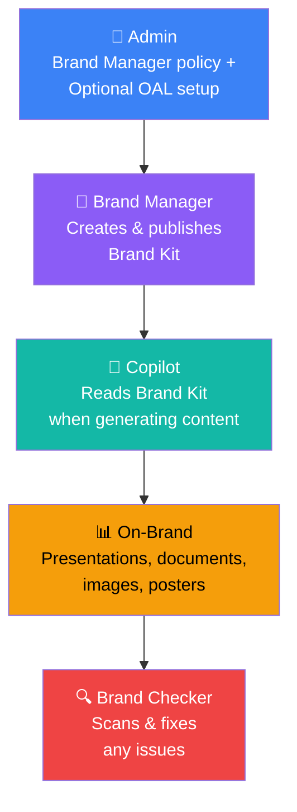
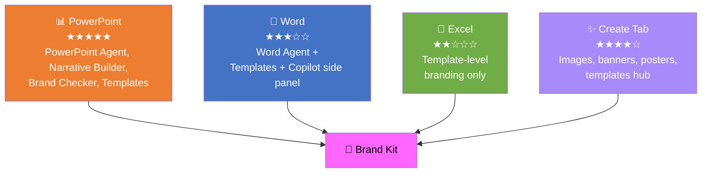

I just wrapped up two Train-the-Trainer sessions on Microsoft 365 Copilot, and one question came up more than any other: **"How do I make Copilot use our brand?"** — followed closely by "What's a Brand Kit?", "How do I create one?", and "Will Copilot actually use our PowerPoint templates?"

If you've been wondering the same thing, this guide is for you.

<div class="living-doc-banner">

🔄 This is a living document. The AI world changes every day — features roll out, names change, and new capabilities appear. If you spot anything out of date, please [send me feedback](/feedback/) and I'll update it. Last verified: April 2026.

</div>

### Quick Links

- [The Hotel Analogy — What Brand Kit Actually Is](#the-hotel-analogy--what-brand-kit-actually-is)
- [What's Inside a Brand Kit?](#whats-inside-a-brand-kit)
- [What Licence Do You Need?](#what-licence-do-you-need)
- [Where Brand Kit Works — App by App](#where-brand-kit-works--app-by-app)
- [The Three Types of Brand Kits](#the-three-types-of-brand-kits)
- [Admin Setup — Step by Step](#admin-setup--step-by-step)
- [Building a PowerPoint Template Optimised for Copilot](#building-a-powerpoint-template-optimised-for-copilot)
- [Brand Checker — Your Quality Inspector](#brand-checker--your-quality-inspector)
- [What Doesn't Work Yet](#what-doesnt-work-yet-current-limitations)
- [Real-World Scenarios](#real-world-scenarios)
- [Best Practices](#best-practices)
- [Your Brand Kit Checklist](#your-brand-kit-checklist)
- [FAQ](#faq)

## TL;DR — The 60-Second Summary

If you only have a minute, here's what you need to know:

| Question | Answer |
|----------|--------|
| **What is it?** | A collection of your org's brand rules (logos, colours, fonts, voice, templates) that Copilot follows automatically |
| **Who manages it?** | Brand managers — designated by IT admin through a policy |
| **Where does it work?** | PowerPoint (deepest), Word, Create tab, Designer. Excel templates can be uploaded |
| **What licence?** | Microsoft 365 Copilot ($30/user/month). Unlicensed users can only open templates |
| **How to set up?** | (1) Brand Manager policy → (2) Create and publish kit. Optional: SharePoint OAL for PowerPoint integration |
| **Killer feature?** | Brand Checker in PowerPoint — scans and fixes off-brand slides in one click |
| **Time to set up?** | Allow 24 hours after policy configuration |

> 📌 **Do these three things today:**
>
> 1. Create a mail-enabled security group with your brand managers
> 2. Enable the Enterprise Brand Manager policy at [config.office.com](https://config.office.com)
> 3. Optionally, set up a SharePoint Organizational Asset Library for templates and images (recommended for PowerPoint)

## The Hotel Analogy — What Brand Kit Actually Is

Think of your organisation as a hotel chain — like Hilton or Marriott.

Every hotel in the chain has to follow the **brand book**: the exact shade of blue for the logo, where it sits on signage, the font on the room doors, the style of lobby furniture, even the tone of voice the reception team uses. Without that brand book, every hotel would look different, and guests wouldn't trust the brand.

**Brand Kit is your hotel chain's brand book — but for Copilot.**

Here's how it maps:

| Hotel World | Microsoft 365 World |
|------------|-------------------|
| 🏨 Hotel chain headquarters | Your Microsoft 365 tenant |
| 📐 Brand book (rules & guidelines) | **Brand Kit** (logos, colours, fonts, voice, templates) |
| 🏗️ Approved furniture & materials warehouse | **Organizational Asset Library** (SharePoint) |
| 👔 Brand compliance team | **Brand managers** (assigned by IT admin) |
| 🔍 Quality inspector who checks rooms | **Brand Checker** in PowerPoint |
| 📋 Pre-approved room layouts & lobby designs | **Templates** (.potx, .dotx, .xltx) |
| 🎨 Interior designers creating new rooms | **Copilot** generating on-brand content |
| 🏨🏨🏨 Multiple hotel brands under one company | **Multiple Brand Kits** (Corporate, Product, Regional) |

Without a Brand Kit, asking Copilot to "create a customer proposal" gives you generic content. With a Brand Kit, Copilot knows your colours, your logo, your tone of voice, and your template layouts — so the proposal comes out looking like *your* organisation created it.



## What's Inside a Brand Kit?

A Brand Kit is more than just a logo and a colour code. Here's everything you can include:

### Visual Identity

| Element | What to Include | Why It Matters |
|---------|----------------|---------------|
| **Logos** | Primary, secondary, variations (dark/light/icon-only) | Copilot picks the right logo for the right context |
| **Colour palette** | HEX codes for primary, secondary, and accent colours | Charts, backgrounds, and text follow your palette |
| **Fonts** | Heading and body typefaces, size hierarchy | Consistent typography across all generated content |
| **Icons** | Approved icon library | Used in presentations and infographics |
| **Photography rules** | Picture styles, composition guidelines, approved imagery | Copilot generates and selects on-brand images |
| **Data visualisation** | Chart styles, table formats, diagram patterns | Ensures data slides match your brand |
| **Layout patterns** | Spacing, composition, alignment rules | Consistent slide and document structure |

### Verbal Identity

| Element | What to Include | Why It Matters |
|---------|----------------|---------------|
| **Brand voice** | Tone, personality, communication style | Copilot writes in your brand's voice |
| **Terminology** | Preferred terms, words to avoid | Consistent language across generated content |
| **Writing guidance** | Dos and don'ts for copy style | Ensures professional, on-brand writing |

### Templates

| Format | File Type | Used By |
|--------|-----------|---------|
| PowerPoint | `.potx` or `.pptx` | PowerPoint Agent, Narrative Builder |
| Word | `.dotx` | Document generation |
| Excel | `.xltx` | Spreadsheet templates |
| Designer | Various | Images, banners, posters |

> 💡 **Tip:** You can upload your existing brand guidelines as a **PDF**, and Copilot's AI will automatically extract colour palettes, fonts, typography rules, photography styles, layout structures, and brand voice patterns. You review and refine before publishing — it saves hours of manual setup.

## What Licence Do You Need?

This is the question everyone asks first. Here's the clear answer:

| Action | Copilot Licence Required? | Notes |
|--------|--------------------------|-------|
| Create a Brand Kit | ✅ Yes | Must also be a designated brand manager |
| Edit or publish Brand Kits | ✅ Yes | Brand manager role required |
| Use Brand Kit styling when creating content | ✅ Yes | Colours, fonts, voice applied automatically |
| Use Brand Checker in PowerPoint | ✅ Yes | Scans and fixes off-brand slides |
| Use PowerPoint/Word/Excel Agents | ✅ Yes | Powered by Anthropic Claude models |
| Open templates from Brand Kits | ❌ No | Templates are accessible to everyone |
| Use OAL templates in Office apps | ❌ No | Standard Office licence sufficient |

> ⚠️ **Key distinction:** Templates uploaded to a Brand Kit are accessible to **all users** in your tenant — even without a Copilot licence. But the AI-powered features (automatic brand styling, Brand Checker, brand voice, PowerPoint/Word/Excel Agents) require the paid Microsoft 365 Copilot licence.

Want to understand how Copilot licensing works across your organisation? Check our [Licensing Simplifier](/licensing/) for a clear breakdown of every plan and what's included.

> ⚠️ **Government cloud note:** Brand Kit availability may vary across GCC, GCC High, and DoD environments. The guidance in this post is based on commercial tenant availability. Check the [Microsoft 365 service descriptions](https://learn.microsoft.com/en-us/office365/servicedescriptions/) and Message Center for your specific cloud environment before planning rollout.

## Where Brand Kit Works — App by App

This is where it gets practical. Brand Kit doesn't work the same way in every app — PowerPoint has the deepest integration, while Excel is more limited. Here's the honest breakdown:

### PowerPoint — The Star of the Show

PowerPoint has the richest Brand Kit integration by far. There are two distinct approaches — a **new way** and a **traditional way**:

#### The New Way: PowerPoint Agent (in M365 Copilot Chat)

This is the new agentic approach to creating presentations. Instead of opening PowerPoint first, you start in the **Microsoft 365 Copilot app** (or Copilot Chat) and use the **PowerPoint Agent** — powered by **Anthropic Claude models** — to create entire presentations end-to-end through conversation.

When you give the PowerPoint Agent a prompt, it:

1. **Analyses your Brand Kit** — template layouts, colours, fonts, imagery, icons
2. **Pulls from your OAL** — brand images and approved assets from SharePoint
3. **Follows your instructions** — your specific prompt and any clarifying questions it asks
4. **Generates a complete deck** — with speaker notes, visuals, and on-brand formatting

This isn't just applying a theme — the agent understands and replicates your brand's entire presentation approach. It's a multi-turn conversation: the agent asks clarifying questions, iterates based on your feedback, and produces polished slides.

> 💡 **Key difference:** The PowerPoint Agent lives inside the **M365 Copilot app** — you don't need to open PowerPoint first. The agent creates the deck for you, and you can then open it in PowerPoint to refine. Similarly, there's a **Word Agent** and **Excel Agent** for creating documents and spreadsheets from Copilot Chat.

> ⚠️ **Availability note:** As of April 2026, the PowerPoint Agent with Brand Kit support is available in PowerPoint for Windows within the [Insiders Beta Channel](https://support.microsoft.com/topic/join-the-microsoft-365-insider-program-3c7dda4f-4d05-0783-3a9a-182b50acb8a9) and rolling out more broadly. Check the [M365 Roadmap](/m365-roadmap/) for the latest status.

#### The Traditional Way: Narrative Builder (in the PowerPoint App)

This is the approach you're probably already familiar with — opening the PowerPoint desktop app and using Copilot inside it:

1. Open PowerPoint → Copilot → Narrative Builder
2. Give Copilot your prompt and adjust the outline
3. **Choose your organisation's template** from the template picker
4. Copilot generates slides following your template's layouts, fonts, and colours

The templates come from your SharePoint Organizational Asset Library (OAL) or your Brand Kit. This is available in the Current Channel today.

#### Method 3: Start from Template

1. Open a Brand Kit PowerPoint template first
2. Use the Copilot side panel to generate or edit slides
3. Copilot respects the template's layout, fonts, and branding while replacing content

### Word — Templates Plus Copilot (and Word Agent)

Brand Kit in Word works through **two paths**:

**Word Agent (new way):** From M365 Copilot Chat, the Word Agent can create documents end-to-end using your Brand Kit's templates and voice guidelines. Like the PowerPoint Agent, it uses Anthropic Claude models and works through multi-turn conversation.

**Traditional way:** Start with an organisation template (from Brand Kit or OAL), then use Copilot in the Word side panel to generate or edit content. Copilot updates sections, titles, and text while keeping your template's styling and brand formatting.

Both approaches are effective for proposals, reports, memos, and any document that follows a standard format.

### Excel — Template-Level Branding (and Excel Agent)

Excel's Brand Kit integration is more limited than PowerPoint, but growing:

- ✅ You **can** upload Excel templates (`.xltx`) to your Brand Kit
- ✅ Users can start from branded Excel templates via the Create tab
- ✅ Templates maintain brand colours, fonts, chart styles, and layouts
- ✅ The **Excel Agent** (from Copilot Chat) can create workbooks using branded templates
- ⚠️ There is no "Brand Checker" equivalent for Excel — it's template-level, not AI-enforced

> 💡 **Practical tip:** If consistent Excel branding matters to your org, invest in well-designed `.xltx` templates with pre-built chart styles, branded colour schemes, and formatted headers. Upload these to your Brand Kit so users start from a consistent base.

### The Create Tab — Your Brand Hub

The Create tab at [microsoft365.com](https://microsoft365.com) is where Brand Kits live:

- **Brand managers** create, edit, and publish kits here
- **All users** browse and select Brand Kits when creating content
- Generate branded **images, banners, posters, and infographics** using your brand colours, logos, and style
- Access **branded templates** for PowerPoint, Word, and Excel
- Filter between **Official**, **Shared**, and personal kits

To access Brand Kits: **Microsoft 365 Copilot app → Create → More... → Brand kits**

### Designer — Visual Content

When generating images, banners, and posters through the Create tab, Copilot uses your Brand Kit to apply:

- Organisation colours and palette
- Logo placement rules
- Icon and illustration styles
- Photography guidelines
- Brand tone and messaging



## The Three Types of Brand Kits

Not every Brand Kit needs to be organisation-wide. Microsoft gives you three levels:

| Type | Who Can Create | Who Can Access | Best For |
|------|---------------|---------------|----------|
| **Official** | Brand managers only | Everyone in the tenant | Organisation-wide branding |
| **Shared** | Any Copilot user | People you share with | Department or project branding |
| **Personal** | Any Copilot user | Only the creator | Individual use |

> 💡 **Tip:** Most organisations should start with **one official Brand Kit** for the corporate brand. Then add shared kits for sub-brands, product lines, or acquired entities as needed. Don't overcomplicate it on day one.

## Admin Setup — Step by Step

Setting up Brand Kit has two required steps and one recommended step. Here's the exact walkthrough:

### Step 1: Assign the Brand Manager Role (Required)

Brand managers are the people who create and publish official Brand Kits. Only they can make a Brand Kit "official" (available to the entire tenant).

1. **Create a mail-enabled security group** in Microsoft Entra ID (Azure AD) containing your brand managers
2. Go to [config.office.com](https://config.office.com) and sign in as an admin
3. Navigate to **Customization → Policy Management**
4. Select your existing tenant-level policy (or create one with scope "Apply to all users")
5. Go to the **Policies** tab
6. Search for **"Brand Manager"**
7. Select **"Elevated role for Brand Managers"**
8. Set the policy to **Enabled**
9. Enter the **security group email address** for your brand managers group
10. Select **Apply**

> ⚠️ **It takes up to 24 hours** after enabling the policy for brand managers to receive permission to create official kits. Don't panic if it doesn't appear immediately.

### Step 2: Brand Manager Creates and Publishes the Kit (Required)

Once the policy is active, your designated brand managers can create the kit:

1. Open the [Microsoft 365 Copilot app](https://microsoft365.com)
2. Select **Create** in the left navigation
3. Select **More... → Brand kits**
4. Select **+ New Brand kit** and give it a name
5. Configure each section:
   - **Logos** — Upload primary, secondary, and variant logos
   - **Colours** — Define HEX codes for your brand palette
   - **Fonts** — Select heading and body typefaces
   - **Images and Icons** — Add approved visuals
   - **Templates** — Upload `.potx`, `.dotx`, `.xltx` files
   - **Brand voice** — Define tone, terminology, and writing guidelines
   - **Brand guidelines** — Upload your brand guidelines PDF (Copilot auto-extracts rules)
   - **Style** — Upload representative images or describe your visual style
   - **Data Visualisation** — Include example slides showing chart and table styles
6. Select **Publish** to make it available organisation-wide

> 💡 **Pro tip:** Upload your **existing brand guidelines PDF** first. Copilot's AI will extract colour palettes, fonts, photography styles, layout structures, and brand voice patterns automatically. Review and refine — it saves significant setup time.

> ⚠️ **Change management warning:** When you update a published Brand Kit, changes are saved and available to users immediately — there's no built-in version history or rollback. Treat Brand Kit updates like production deployments: review carefully before saving, and consider keeping a backup of your assets offline.

### Step 3: Set Up a SharePoint Organizational Asset Library (Recommended)

While Brand Kit works with directly uploaded assets, setting up a SharePoint OAL unlocks additional benefits — especially for PowerPoint's Narrative Builder and the PowerPoint Agent, which can pull templates and brand images directly from your library.

**What you need:**
- A SharePoint site (communication site or team site)
- A document library for templates
- A document library for images (optional but recommended)

**Set up the template library:**

1. Create a SharePoint site for brand assets (e.g., `https://contoso.sharepoint.com/sites/branding`)
2. Create a document library called "Templates"
3. Upload your `.potx`, `.dotx`, and `.xltx` template files
4. Set permissions — add "Everyone except external users" as visitors (read access)
5. Open SharePoint Online Management Shell and run:

```powershell
# Connect to SharePoint Online
Connect-SPOService -Url https://contoso-admin.sharepoint.com

# Register as an Office Template Library
Add-SPOOrgAssetsLibrary -LibraryUrl "https://contoso.sharepoint.com/sites/branding/Templates" -OrgAssetType OfficeTemplateLibrary
```

**Set up the image library (for brand images used by Copilot):**

```powershell
# Register as an Image Document Library
Add-SPOOrgAssetsLibrary -LibraryUrl "https://contoso.sharepoint.com/sites/branding/BrandImages" -ThumbnailUrl "https://contoso.sharepoint.com/sites/branding/BrandImages/logo.jpg" -OrgAssetType ImageDocumentLibrary
```

> ⚠️ **Important notes:**
>
> - You can have up to **30 OAL libraries** per tenant, but they must all be on the **same SharePoint site**
> - Allow up to **24 hours** for the OAL to appear in Office desktop apps
> - Template files must be in the correct format: `.potx` (PowerPoint), `.dotx` (Word), `.xltx` (Excel)
> - Users need at least **read permissions** on the root site for the OAL to appear

> 💡 **Third-party DAM support:** Brand Kits also support assets from **third-party Digital Asset Management systems** like Templafy. If your organisation already uses a DAM, you can reference those assets directly from your Brand Kit without re-uploading — check your DAM provider's Microsoft 365 integration documentation.

Need help building these PowerShell commands? Try our [PowerShell Command Builder](/ps-builder/) — it has recipes for SharePoint Online administration.

## Building a PowerPoint Template Optimised for Copilot

This is the section your marketing and design teams need. A well-built template is the foundation for great on-brand Copilot output. Here's what to get right:

### Use Slide Master — Not Manual Styling

Copilot learns from **theme definitions**, not individual formatting. Everything should be set in Slide Master:

- **Theme Colours:** Slide Master → Colors → Create New Theme Colors
- **Theme Fonts:** Define heading and body fonts in the theme
- **Shape Styles:** Consistent borders, rounded corners, fills

> ⚠️ **Common mistake:** Manually formatting text instead of using theme styles. If you bold a title by selecting it and clicking Bold, Copilot won't learn that pattern. Define it in the theme instead.

### Use Placeholders — Not Text Boxes

Placeholders tell Copilot where content goes. Text boxes don't.

- Insert placeholders via **Slide Master → Insert Placeholder**
- Keep placeholders readable and non-overlapping
- Avoid placing decorative elements on top of text or image areas

### Include 12+ Representative Slide Types

Copilot learns from the variety of slides in your template. The more realistic examples you provide, the better. Microsoft recommends including:

| Category | Slide Types |
|----------|------------|
| **Opening** | Title, Agenda |
| **Structure** | Section Header, Section Divider |
| **Content** | Text layouts, Bullet points, Icons, Image layouts |
| **Data** | Charts, Tables, Statistics, Dashboards, KPIs |
| **Process** | Timelines, Flow charts, Process diagrams, Lists |
| **People** | Team slides, Introductions, Quotes, Testimonials |
| **Closing** | Summary, Key Takeaways, Q&A, Next Steps, Thank You |
| **Specialist** | Case Studies, Maps, Calendars, Contacts |

### Show Different Content Densities

Your template should demonstrate how your brand handles varying information:

- **Light:** Title and subtitle only, generous whitespace
- **Medium:** Text on one side, large image on the other
- **Heavy:** Multi-column, dense text, detailed charts

### Show Your Data Visualisation Style

Include example slides that show how your brand presents:

- Bar charts, line charts, pie charts
- Tables and comparison grids
- Process diagrams and timelines
- Infographics and statistics callouts

Copilot will replicate these styles when generating data slides.

### Upload the Template

Once your template is ready:

1. Open the **Microsoft 365 Copilot app**
2. Go to **Create → More... → Brand kits**
3. Open your Brand Kit → **Templates**
4. Click **Upload Template** (or select from your OAL)
5. Upload your `.potx` or `.pptx` file
6. Add meta-tags (optional, helps with search)
7. Click **Add to Brand kit**

> ⚠️ **Template upload may fail if:** Fonts aren't available tenant-wide, embedded objects exist, unsupported layout types are used, or floating text boxes overlap with other elements. Test your template before a wide rollout.

## Brand Checker — Your Quality Inspector

Brand Checker is one of the most impressive features of Brand Kit. Think of it as the quality inspector who visits every hotel room before a guest arrives.

### What It Does

Brand Checker scans your entire presentation against your Brand Kit and flags:

- ❌ **Incorrect colours or fonts** — someone used the wrong shade of blue
- ❌ **Misplaced or unapproved logos** — wrong version, wrong position
- ❌ **Off-brand imagery** — photos that don't match your style guidelines
- ❌ **Layout and alignment issues** — spacing, composition problems

### How It Works

1. Open a presentation in PowerPoint
2. Brand Checker runs automatically (or on-demand)
3. It highlights issues across your slides
4. Each issue includes a **one-click fix** — Copilot automatically replaces, adjusts, or realigns the off-brand element
5. Review and accept the fixes

### The Processing Order

When both a template and a Brand Kit are available, here's what happens:

1. **Template applied first** — Copilot uses your template's layouts and structure
2. **Brand Kit rules applied second** — Copilot enforces colours, logo rules, brand voice, and imagery guidelines

This means your template is the primary source of truth, and the Brand Kit adds the guardrails on top.

## What Doesn't Work Yet (Current Limitations)

I want to be honest about what's still evolving. As of April 2026:

| Scenario | Status | Notes |
|----------|--------|-------|
| PowerPoint Agent with Brand Kit | ⚠️ Insiders Beta (Windows) | Rolling out more broadly, uses Anthropic Claude |
| Brand Checker in PowerPoint | ⚠️ Insiders Beta (Windows) | Part of the PowerPoint Agent experience |
| Select org template in Narrative Builder | ✅ Available | Current Channel |
| Start from Brand Kit template | ✅ Available | Current Channel |
| Brand Kit in Create tab (images, banners) | ✅ Available | Web |
| Upload brand guidelines PDF for AI extraction | ✅ Available | In Brand Kit creation |
| Brand Checker for Word | ❌ Not yet | No equivalent feature |
| Brand Checker for Excel | ❌ Not yet | Template-level only |
| Copilot automatically selecting org template from prompt | ❌ Not yet | Must select template manually |

> 📖 **What this means practically:** Today, users need to manually select their organisation's template (either in Narrative Builder or by starting from the template). You can't just say "create a customer proposal" and have Copilot automatically pick the right template — that's a manual step for now.

## Real-World Scenarios

Here are three scenarios that show how Brand Kit changes the game:

### Scenario 1: The Sales Team

**Without Brand Kit:** A sales rep creates a proposal in PowerPoint. They grab slides from three old decks, use slightly different colours, paste in a logo from Google Images (wrong version), and the fonts are inconsistent. The client sees a messy presentation.

**With Brand Kit:** The sales rep opens PowerPoint, starts from the company's branded proposal template (via Brand Kit), and tells Copilot: *"Create a 10-slide proposal for Contoso's cloud migration project based on this Word document."* Copilot generates slides using the correct template layouts, brand colours, approved imagery, and consistent fonts. Brand Checker flags one slide where a manually-pasted chart uses the wrong colour scheme — one click to fix.

### Scenario 2: The Marketing Department

**Without Brand Kit:** Five team members create social media graphics using different shades of the brand colour, different logo versions, and inconsistent font sizes. The social feed looks fragmented.

**With Brand Kit:** The team uses the Create tab → Brand Kit to generate branded banners, posters, and images. Every piece automatically uses the correct palette, logo, and style — because Copilot reads the Brand Kit.

### Scenario 3: The IT Admin Onboarding New Staff

**Without Brand Kit:** New employees spend their first week hunting for templates on SharePoint, asking colleagues which logo to use, and getting told their deck "doesn't look right."

**With Brand Kit:** New employees open the Create tab, see the official Brand Kit, and start creating on-brand content from day one. No hunting, no guessing, no brand police emails.

## Best Practices

### Do This

| Practice | Why |
|----------|-----|
| Start with **one official Brand Kit** | Get the foundation right before adding complexity |
| Upload your brand guidelines **PDF** | Let Copilot extract rules automatically — faster and more accurate |
| Use **Slide Master** for templates | Theme definitions, not manual formatting |
| Include **12+ slide types** in templates | More variety = better Copilot output |
| Test templates before wide rollout | Catch upload failures and rendering issues early |
| Review extracted brand rules | AI extraction is good but not perfect — verify colours, fonts, and voice |
| Assign **2-3 brand managers** | Shared responsibility, not a single point of failure |
| Train your brand managers | They need to understand both branding AND the Copilot tools |

### Don't Do This

| Anti-Pattern | Why It Fails |
|-------------|-------------|
| Use text boxes instead of placeholders | Copilot can't understand the content structure |
| Manually format instead of using themes | Copilot learns from theme definitions, not one-off formatting |
| Create 10 Brand Kits on day one | Overwhelms users — start simple, expand later |
| Skip the OAL setup | Without OAL, Copilot can't access your images and templates in PowerPoint |
| Forget to test on different channels | Insiders, Current, and Monthly may behave differently |
| Ignore template update cadence | Brand evolves — schedule quarterly template reviews |
| Let everyone be a brand manager | Too many cooks. Limit to your actual brand/marketing team |

## Your Brand Kit Checklist

Use this as your implementation checklist:

### IT Admin Tasks

- [ ] Create a mail-enabled security group for brand managers
- [ ] Enable the Enterprise Brand Manager policy at [config.office.com](https://config.office.com)
- [ ] Wait 24 hours and verify brand managers have access
- [ ] Verify Copilot licences are assigned to brand managers and target users
- [ ] Check the update channel for your users (Insiders Beta for PowerPoint Agent)
- [ ] (Recommended) Create a SharePoint site for brand assets
- [ ] (Recommended) Set up an Image Asset Library (OAL) with `Add-SPOOrgAssetsLibrary`
- [ ] (Recommended) Set up a Template Library (OAL) with `Add-SPOOrgAssetsLibrary -OrgAssetType OfficeTemplateLibrary`
- [ ] (Recommended) Set permissions — "Everyone except external users" as visitors

### Brand Manager Tasks

- [ ] Gather all brand assets (logos, colours, fonts, icons, photography rules)
- [ ] Prepare brand guidelines PDF for AI extraction
- [ ] Create the Brand Kit in the Copilot Create tab
- [ ] Upload logos (primary + secondary + variants)
- [ ] Define colour palette with HEX codes
- [ ] Set fonts (heading + body)
- [ ] Upload approved images and icons
- [ ] Define brand voice and writing guidelines
- [ ] Upload templates (.potx, .dotx, .xltx)
- [ ] Upload brand guidelines PDF for auto-extraction
- [ ] Review AI-extracted brand rules and refine
- [ ] Publish the official Brand Kit
- [ ] Test by creating content in PowerPoint, Word, and Create tab
- [ ] Run Brand Checker on a test presentation

### Ongoing Maintenance

- [ ] Schedule quarterly template reviews
- [ ] Update Brand Kit when brand evolves (logo refresh, colour changes)
- [ ] Monitor user feedback on template usability
- [ ] Check for new Copilot capabilities that leverage Brand Kit
- [ ] Review and update brand voice guidelines as communication style evolves

Want to check if your organisation is ready for Copilot? Our [Copilot Readiness Checker](/copilot-readiness/) assesses your environment across 7 pillars — including governance and data readiness that directly impact Brand Kit success.

## FAQ

**1. What is a Microsoft 365 Copilot Brand Kit?**

A Brand Kit is a collection of your organisation's approved brand elements — logos, colour palettes, fonts, templates, icons, photography rules, brand voice, and style guidelines. When published, Copilot uses these elements to generate on-brand content automatically across PowerPoint, Word, and the Create tab.

**2. Do I need a paid licence to use Brand Kit?**

Yes. Creating, managing, and using Brand Kits requires a Microsoft 365 Copilot licence ($30/user/month). Users without a Copilot licence can only open templates from Brand Kits — they cannot create kits, use brand styling, or access the Brand Checker.

**3. Where does Brand Kit work?**

Brand Kit has the deepest integration in PowerPoint (PowerPoint Agent, Narrative Builder, Brand Checker). It also works in Word through the Word Agent and templates, in the Create tab for images, banners, and posters, and Excel templates can be uploaded to Brand Kits for consistent spreadsheet formatting.

**4. What is the Brand Checker?**

Brand Checker scans your entire presentation against your Brand Kit and flags issues — incorrect colours or fonts, misplaced logos, off-brand imagery, and layout problems. It offers one-click fixes to bring everything back on brand automatically.

**5. How do I set up Brand Kit as an IT admin?**

Two required steps: (1) Create a mail-enabled security group with your brand managers and enable the Enterprise Brand Manager policy at [config.office.com](https://config.office.com), then (2) your brand managers create and publish the kit. Optionally, set up a SharePoint OAL for enhanced PowerPoint template integration. Allow 24 hours for the policy to take effect.

**6. What is the difference between Brand Kit and the OAL?**

The OAL is SharePoint-based storage for templates and images. Brand Kit adds richer capabilities on top — brand voice, AI guidelines extraction, Brand Checker, multiple brand support, and enforcement of your visual and verbal identity. They work together — Brand Kit references your OAL assets.

**7. Can Copilot extract my brand guidelines automatically?**

Yes. Upload your existing brand guidelines PDF to a Brand Kit, and Copilot's AI extracts colour palettes, fonts, typography rules, photography styles, layout structures, and brand voice patterns. Review and refine before publishing.

**8. How do I create a PowerPoint template optimised for Copilot?**

Use Slide Master with theme colours and fonts (not manual styling), include 12+ representative slide layouts, use placeholders instead of text boxes, show different content densities and data visualisation styles, and avoid overlapping elements. Upload as `.potx` or `.pptx` to your Brand Kit.

**9. Can I have multiple Brand Kits?**

Yes. You can create and maintain multiple Brand Kits — for example, Corporate, Product, and Regional brands. Users can switch between them. Each kit has its own templates, colours, fonts, and assets.

**10. Are the PowerPoint, Word, and Excel Agents generally available?**

As of April 2026, the PowerPoint Agent (including Brand Kit) is available in PowerPoint for Windows within the Insiders Beta Channel and is rolling out more broadly. These agents are powered by Anthropic Claude models and represent a new way of creating content directly from within the M365 Copilot app. Check the [M365 Roadmap](/m365-roadmap/) for the latest availability.

---

**Related guides you might find useful:**

- [Copilot Licensed — Complete Train-the-Trainer Guide](/blog/microsoft-365-copilot-licensed-complete-guide-for-trainers/) — deep-dive into every Copilot app
- [Copilot Chat — Complete Guide for Trainers](/blog/microsoft-365-copilot-chat-complete-guide-for-trainers/) — foundations for all users
- [Copilot Readiness Checker](/copilot-readiness/) — assess your org's readiness across 7 pillars
- [Copilot Feature Matrix](/copilot-matrix/) — compare what's available in each tier
- [Licensing Simplifier](/licensing/) — understand every M365 licence and what it includes
- [Prompt Library](/prompts/) — 84 ready-to-use prompts across 8 platforms

---

> **Disclaimer:** The views and opinions expressed in this article are my own and do not represent the official positions of Microsoft. Feature availability and rollout timelines may change — always refer to [official Microsoft documentation](https://learn.microsoft.com) for the most up-to-date information. PowerPoint/Word/Excel Agent availability varies by update channel and platform.
