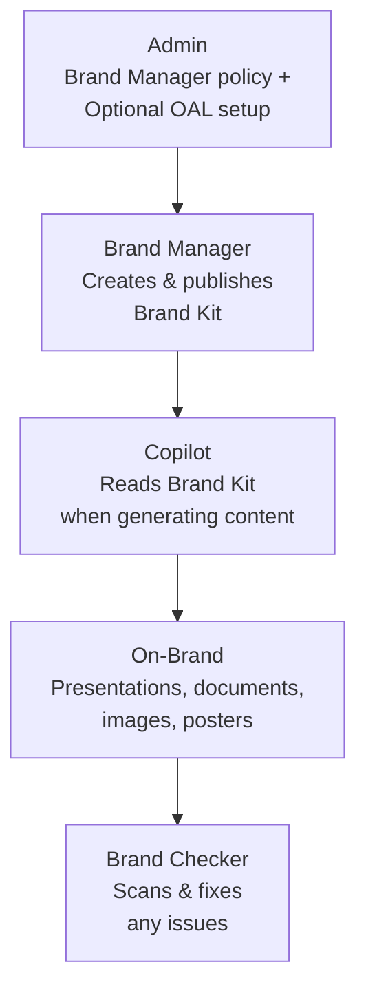
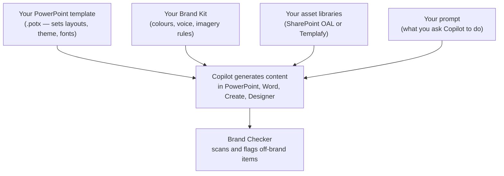
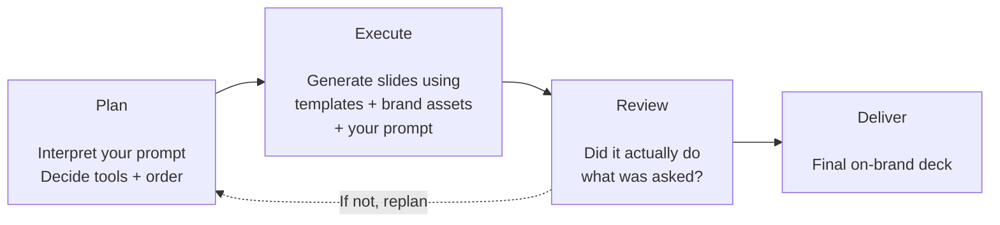
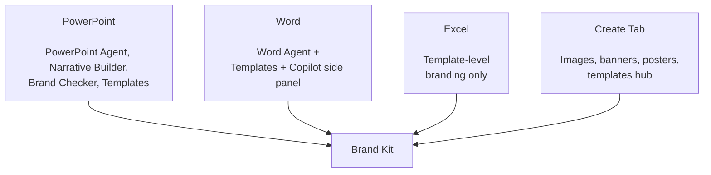

I just wrapped up two Train-the-Trainer sessions on Microsoft 365 Copilot, and one question came up more than any other: **"How do I make Copilot use our brand?"** — followed closely by "What's a Brand Kit?", "How do I create one?", and "Will Copilot actually use our PowerPoint templates?"

If you've been wondering the same thing, this guide is for you.

<div class="living-doc-banner">

🔄 This is a living document. The AI world changes every day — features roll out, names change, and new capabilities appear. If you spot anything out of date, please [send me feedback](/feedback/) and I'll update it. Last verified: May 2026.

</div>

**Quick Links**

- [The Hotel Analogy — What Brand Kit Actually Is](#the-hotel-analogy--what-brand-kit-actually-is)
- [What's Inside a Brand Kit?](#whats-inside-a-brand-kit)
- [Brand Voice — Beyond Logos and Colours](#brand-voice--beyond-logos-and-colours)
- [How the Pieces Work Together](#how-the-pieces-work-together)
- [What Licence Do You Need?](#what-licence-do-you-need)
- [Where Brand Kit Works — App by App](#where-brand-kit-works--app-by-app)
- [The Three Types of Brand Kits](#the-three-types-of-brand-kits)
- [Admin Setup — Step by Step](#admin-setup--step-by-step)
- [Governance — Who Owns What](#governance--who-owns-what)
- [Building a PowerPoint Template (Inside and Outside Copilot)](#building-a-powerpoint-template-inside-and-outside-copilot)
- [Stock Images and Brand Images — What Goes Where](#stock-images-and-brand-images--what-goes-where)
- [Designer vs Adobe Express vs Brand Kit](#designer-vs-adobe-express-vs-brand-kit)
- [Brand Checker — Your Quality Inspector](#brand-checker--your-quality-inspector)
- [Troubleshooting — When Things Don't Work](#troubleshooting--when-things-dont-work)
- [What Doesn't Work Yet](#what-doesnt-work-yet-current-limitations)
- [Real-World Scenarios](#real-world-scenarios)
- [Best Practices](#best-practices)
- [Your Brand Kit Checklist](#your-brand-kit-checklist)
- [FAQ](#faq)

## TL;DR — The 60-Second Summary

If you only have a minute, here's what you need to know:

| Question | Answer |
|----------|--------|
| **What is it?** | A collection of your org's brand rules (logos, colours, fonts, voice, templates) that Copilot follows automatically |
| **Who manages it?** | Brand managers — designated by IT admin through a policy |
| **Where does it work?** | PowerPoint (deepest), Word, Create tab, Designer. Excel templates can be uploaded |
| **What licence?** | Microsoft 365 Copilot ($30/user/month). Unlicensed users can only open templates |
| **How to set up?** | (1) Brand Manager policy → (2) Create and publish kit. Optional: SharePoint OAL for PowerPoint integration |
| **Killer feature?** | Brand Checker in PowerPoint — scans and fixes off-brand slides in one click |
| **Time to set up?** | Allow 24 hours after policy configuration |

> 📌 **Do these three things today:**
>
> 1. Create a mail-enabled security group with your brand managers
> 2. Enable the Enterprise Brand Manager policy at [config.office.com](https://config.office.com)
> 3. Optionally, set up a SharePoint Organizational Asset Library for templates and images (recommended for PowerPoint)

> 🧭 **Choose your reading path:**
>
> - **IT admin:** [Licence](#what-licence-do-you-need) → [Admin Setup](#admin-setup--step-by-step) → [Governance](#governance--who-owns-what) → [Troubleshooting](#troubleshooting--when-things-dont-work) → [Checklist](#your-brand-kit-checklist)
> - **Brand or marketing manager:** [What's Inside](#whats-inside-a-brand-kit) → [Brand Voice](#brand-voice--beyond-logos-and-colours) → [PowerPoint Template](#building-a-powerpoint-template-inside-and-outside-copilot) → [Stock Images](#stock-images-and-brand-images--what-goes-where) → [Brand Checker](#brand-checker--your-quality-inspector)
> - **Executive sponsor:** [TL;DR](#tldr--the-60-second-summary) → [Scenarios](#real-world-scenarios) → [What Doesn't Work Yet](#what-doesnt-work-yet-current-limitations)

> 🌱 **Minimum viable Brand Kit (start here if you're new):**
>
> - One approved logo set (primary, secondary, dark, light)
> - Primary and secondary colours (HEX)
> - Heading and body fonts
> - **One** PowerPoint template with 12+ representative layouts (`.potx`)
> - A one-page voice and tone guide (or your existing brand guidelines PDF)
> - A named brand manager group (2–3 people)
> - 50–100 starter approved images, with a plan to grow toward 1,000+
> - A test deck to run Brand Checker against
>
> You can ship that in a week. Everything else is iteration.

## The Hotel Analogy — What Brand Kit Actually Is

Think of your organisation as a hotel chain — like Hilton or Marriott.

Every hotel in the chain has to follow the **brand book**: the exact shade of blue for the logo, where it sits on signage, the font on the room doors, the style of lobby furniture, even the tone of voice the reception team uses. Without that brand book, every hotel would look different, and guests wouldn't trust the brand.

**Brand Kit is your hotel chain's brand book — but for Copilot.**

Here's how it maps:

| Hotel World | Microsoft 365 World |
|------------|-------------------|
| 🏨 Hotel chain headquarters | Your Microsoft 365 tenant |
| 📐 Brand book (rules & guidelines) | **Brand Kit** (logos, colours, fonts, voice, templates) |
| 🏗️ Approved furniture & materials warehouse | **Organizational Asset Library** (SharePoint) |
| 👔 Brand compliance team | **Brand managers** (assigned by IT admin) |
| 🔍 Quality inspector who checks rooms | **Brand Checker** in PowerPoint |
| 📋 Pre-approved room layouts & lobby designs | **Templates** (.potx, .dotx, .xltx) |
| 🎨 Interior designers creating new rooms | **Copilot** generating on-brand content |
| 🏨🏨🏨 Multiple hotel brands under one company | **Multiple Brand Kits** (Corporate, Product, Regional) |
| 🖼️ Approved art gallery for guest rooms | **Brand Images library** (SharePoint OAL or Templafy) |
| 🎙️ Reception team's tone of voice | **Brand voice** (tone, terminology, do/don't rules) |

Without a Brand Kit, asking Copilot to "create a customer proposal" gives you generic content. With a Brand Kit, Copilot knows your colours, your logo, your tone of voice, and your template layouts — so the proposal comes out looking like *your* organisation created it.

Skip Brand Kit and every deck looks like Microsoft's defaults.



## What's Inside a Brand Kit?

A Brand Kit is more than just a logo and a colour code. Here's everything you can include:

### Visual Identity

| Element | What to Include | Why It Matters |
|---------|----------------|---------------|
| **Logos** | Primary, secondary, variations (dark/light/icon-only) | Copilot picks the right logo for the right context |
| **Colour palette** | HEX codes for primary, secondary, and accent colours | Charts, backgrounds, and text follow your palette |
| **Fonts** | Heading and body typefaces, size hierarchy | Consistent typography across all generated content |
| **Icons** | Approved icon library | Used in presentations and infographics |
| **Photography rules** | Picture styles, composition guidelines, approved imagery | Copilot generates and selects on-brand images |
| **Data visualisation** | Chart styles, table formats, diagram patterns | Ensures data slides match your brand |
| **Layout patterns** | Spacing, composition, alignment rules | Consistent slide and document structure |

### Verbal Identity

| Element | What to Include | Why It Matters |
|---------|----------------|---------------|
| **Brand voice** | Tone, personality, communication style | Copilot writes in your brand's voice |
| **Terminology** | Preferred terms, words to avoid | Consistent language across generated content |
| **Writing guidance** | Dos and don'ts for copy style | Ensures professional, on-brand writing |

### Templates

| Format | File Type | Used By |
|--------|-----------|---------|
| PowerPoint | `.potx` or `.pptx` | PowerPoint Agent, Narrative Builder |
| Word | `.dotx` | Document generation |
| Excel | `.xltx` | Spreadsheet templates |
| Designer | Various | Images, banners, posters |

> 💡 **Tip:** You can upload your existing brand guidelines as a **PDF**, and Copilot's AI will automatically extract colour palettes, fonts, typography rules, photography styles, layout structures, and brand voice patterns. You review and refine before publishing — it saves hours of manual setup.

## Brand Voice — Beyond Logos and Colours

Most people think Brand Kit is about logos and colours. The half that gets overlooked is **voice** — how your organisation sounds when it writes. Copilot pays attention to this when it drafts content, so it's worth getting right.

Brand voice in a Brand Kit covers three things:

| Element | Example for a fictional bank "NorthRiver" |
|---|---|
| **Tone** | "Confident but not corporate. Warm but not casual. Avoid hype and superlatives." |
| **Terminology** | Use "customers" not "clients". Use "support" not "ticket". Always "NorthRiver" not "the bank". |
| **Do / don't rules** | Do: short sentences, plain English, active voice. Don't: jargon, marketing speak, exclamation marks. |

When a user asks Copilot to *"write a proposal cover note for Contoso"*, Copilot blends three signals: the prompt, the template in use, and the voice rules in your Brand Kit. With voice rules defined, the cover note sounds like NorthRiver — not generic Microsoft default.

### What AI extracts well from a brand guidelines PDF

Pretty reliably:

- Colour palettes (HEX codes from a brand guide page)
- Typography rules (heading and body font names, hierarchy)
- Photography style descriptions ("warm, natural light, real people")
- Layout structures (spacing rules, grid patterns)
- Recurring tone words ("confident", "approachable")

### What still needs a human eye

- Subtle tone ("friendly but authoritative" — AI gets the words but not the nuance)
- Context-specific rules ("formal for legal, casual for community posts")
- Sector or regional exceptions (NZ English vs US English, EDU vs Enterprise)
- "Words we never use" lists — easy to miss in a long PDF

**Practical advice:** treat the AI extraction as a first draft. A brand manager should sit with the extracted rules for an hour before publishing, especially the voice section.

### Multilingual notes

A Brand Kit can hold one voice guide. If your organisation operates in multiple languages, you have two practical options:

- Keep one English voice guide and let translators adapt as they write (simplest)
- Maintain separate Brand Kits per region/language (more work, more control)

Microsoft hasn't published official multilingual brand voice guidance as of last verified, so this is a "watch the roadmap" area.

## How the Pieces Work Together

People get confused by all the moving parts: Brand Kit, OAL, templates, Brand Checker, Adobe Express, Designer. Here's the mental model I use in customer conversations.

> ℹ️ This isn't an official Microsoft processing pipeline — it's a practical way to explain how the parts relate.



| Piece | What it does | Where it lives |
|---|---|---|
| **Template** | Teaches Copilot your layouts, fonts, and theme. Also usable directly by anyone, with or without Copilot. | Uploaded to Brand Kit and/or SharePoint OAL |
| **Brand Kit** | The rule book — colours, voice, imagery style, logo placement | Microsoft 365 Copilot app → Create → Brand kits |
| **OAL (or Templafy)** | The asset library — templates, approved images, icons | SharePoint, surfaced via PowerShell setup |
| **Brand Checker** | The inspector — flags off-brand slides and offers one-click fixes | PowerPoint, with Copilot licence |
| **Designer / Adobe Express** | Visual creation tools — both can use Brand Kit colours and styles | Copilot Create and Copilot Chat |

**Rule of thumb:**
> Templates teach Copilot. Brand Kit governs the rules. OAL supplies the assets. Brand Checker enforces.

> 💡 **Template precedence — which one wins?** When Copilot needs a template for generation, it looks in this order: (1) **Brand Kit templates first** (highest priority), then (2) **OAL templates** as backup, then (3) **Microsoft default templates** as last resort. So if you upload a template to both your Brand Kit AND your OAL, the Brand Kit version is what Copilot uses for generation. The OAL copy still serves users opening it from File → New — that's why putting the same `.potx` in both places is a perfectly reasonable pattern.

You don't need every piece on day one. Start with a Brand Kit and one good template. Add an OAL when you're ready to invest in approved imagery. Add Brand Checker as soon as your team is generating Copilot decks regularly.

## What Licence Do You Need?

This is the question everyone asks first. Here's the clear answer:

| Action | Copilot Licence Required? | Notes |
|--------|--------------------------|-------|
| Create a Brand Kit | ✓ Yes | Must also be a designated brand manager |
| Edit or publish Brand Kits | ✓ Yes | Brand manager role required |
| Use Brand Kit styling when creating content | ✓ Yes | Colours, fonts, voice applied automatically |
| Use Brand Checker in PowerPoint | ✓ Yes | Scans and fixes off-brand slides |
| Use PowerPoint/Word/Excel Agents | ✓ Yes | Powered by Anthropic Claude models |
| Open templates from Brand Kits | − No | Templates are accessible to everyone |
| Use OAL templates in Office apps | − No | Standard Office licence sufficient |

> ⚠️ **Key distinction:** Templates distributed through your SharePoint **Organizational Asset Library (OAL)** can be opened by any user with a standard Office licence — no Copilot needed. The **Brand Kit experiences in the Copilot Create app** (the rules, the Brand Checker, the AI-powered styling) require the paid Microsoft 365 Copilot licence. So the same `.potx` template can serve both audiences — just from two different surfaces.

> 💡 **PowerPoint, Word, and Excel Agents nuance:** The agents can appear in the Copilot Chat experience for Microsoft 365 users in some configurations, but **enterprise data grounding** (using your tenant's templates, OAL, Brand Kit, and Work IQ context) requires the Microsoft 365 Copilot licence. If you want users generating real on-brand decks, plan for the licence.

Want to understand how Copilot licensing works across your organisation? Check our [Licensing Simplifier](/licensing/) for a clear breakdown of every plan and what's included.

> ⚠️ **Government cloud note:** Brand Kit availability may vary across GCC, GCC High, and DoD environments. The guidance in this post is based on commercial tenant availability. Check the [Microsoft 365 service descriptions](https://learn.microsoft.com/en-us/office365/servicedescriptions/) and Message Center for your specific cloud environment before planning rollout.

### Cost — What Else You Might Pay For

Brand Kit itself doesn't have a separate price tag, but a few adjacent things do. Customers in my sessions usually ask about these:

| Item | Extra cost? | Notes |
|---|---|---|
| Microsoft 365 Copilot licence | Yes — $30/user/month | Required for any AI-powered Brand Kit feature |
| SharePoint OAL storage | Included in tenant storage | Still consumes your SharePoint quota — check tier |
| Microsoft Syntex image tagging | Per-use or capacity-based | Only if you use Syntex to auto-tag images |
| Templafy / Bynder / Frontify / Aprimo | Third-party licensing | Pricing varies — talk to the vendor |
| Microsoft stock images in Office | Included | Standard usage rights apply |
| Adobe Express agent | Free for many features; some require Adobe Express paid plans for advanced tools | Check current licensing |
| Custom font licensing | Depends on font | If you use commercial fonts (e.g., Helvetica), check distribution rights |

> 💡 **Practical tip:** The Copilot licence is the only hard requirement. Everything else can start small. Most organisations begin with just Brand Kit + a SharePoint OAL, and add Syntex or third-party DAMs later if needed.

## Where Brand Kit Works — App by App

This is where it gets practical. Brand Kit doesn't work the same way in every app — PowerPoint has the deepest integration, while Excel is more limited. Here's the honest breakdown:

### PowerPoint — The Star of the Show

PowerPoint has the richest Brand Kit integration by far. There are two distinct approaches — a **new way** and a **traditional way**:

#### The New Way: PowerPoint Agent (in M365 Copilot Chat)

This is the new agentic approach to creating presentations. Instead of opening PowerPoint first, you start in the **Microsoft 365 Copilot app** (or Copilot Chat) and use the **PowerPoint Agent** — powered by **Anthropic Claude models** — to create entire presentations end-to-end through conversation.

When you give the PowerPoint Agent a prompt, it:

1. **Analyses your Brand Kit** — template layouts, colours, fonts, imagery, icons
2. **Pulls from your OAL** — brand images and approved assets from SharePoint
3. **Follows your instructions** — your specific prompt and any clarifying questions it asks
4. **Generates a complete deck** — with speaker notes, visuals, and on-brand formatting

This isn't just applying a theme — the agent understands and replicates your brand's entire presentation approach. It's a multi-turn conversation: the agent asks clarifying questions, iterates based on your feedback, and produces polished slides.

#### How the Agent Actually Works — Plan → Execute → Review → Deliver

Under the hood, the PowerPoint Agent isn't one-shot generation. It runs a self-correcting **agentic loop**:



That's why a Copilot-generated deck can take a few minutes (or longer for big decks) — it's not just text generation, it's reasoning over layouts, objects, structure, and brand rules across many slides at once. The review step can send the agent back to re-plan if the output didn't meet the prompt.

Three things the agent does that a basic text generator doesn't:

1. **Complex planning** — handles multi-slide, multi-step asks like *"create a 10-slide proposal in the company template with charts on slides 4–6 and a closing call-to-action"*
2. **Grounding** — pulls context from your work files (Work IQ), the web, and the current presentation, not just the prompt
3. **Brand use** — autonomously uses your Brand Kit assets, your template layouts, your colours, your fonts, and your brand voice without you having to ask for each one explicitly

> 💡 **Key difference:** The PowerPoint Agent lives inside the **M365 Copilot app** — you don't need to open PowerPoint first. The agent creates the deck for you, and you can then open it in PowerPoint to refine. Similarly, there's a **Word Agent** and **Excel Agent** for creating documents and spreadsheets from Copilot Chat.

> ⚠️ **Availability note:** As of last verified (May 2026), the PowerPoint Agent with Brand Kit and Brand Checker (Brand Reviewer) is generally available on Windows, Mac, and Web for tenants with a Microsoft 365 Copilot licence. Specific capabilities are still rolling out across channels, so behaviour can differ between **Current Channel**, **Monthly Enterprise Channel**, and **Beta Channel**. Check the [M365 Roadmap](/m365-roadmap/) and your Message Center for your tenant's status.

#### The Traditional Way: Narrative Builder (in the PowerPoint App)

This is the approach you're probably already familiar with — opening the PowerPoint desktop app and using Copilot inside it:

1. Open PowerPoint → Copilot → Narrative Builder
2. Give Copilot your prompt and adjust the outline
3. **Choose your organisation's template** from the template picker
4. Copilot generates slides following your template's layouts, fonts, and colours

The templates come from your SharePoint Organizational Asset Library (OAL) or your Brand Kit. This is available in the Current Channel today.

#### Method 3: Start from Template

1. Open a Brand Kit PowerPoint template first
2. Use the Copilot side panel to generate or edit slides
3. Copilot respects the template's layout, fonts, and branding while replacing content

### Word — Templates Plus Copilot (and Word Agent)

Brand Kit in Word works through **two paths**:

**Word Agent (new way):** From M365 Copilot Chat, the Word Agent can create documents end-to-end using your Brand Kit's templates and voice guidelines. Like the PowerPoint Agent, it uses Anthropic Claude models and works through multi-turn conversation.

**Traditional way:** Start with an organisation template (from Brand Kit or OAL), then use Copilot in the Word side panel to generate or edit content. Copilot updates sections, titles, and text while keeping your template's styling and brand formatting.

Both approaches are effective for proposals, reports, memos, and any document that follows a standard format.

### Excel — Template-Level Branding (and Excel Agent)

Excel's Brand Kit integration is more limited than PowerPoint, but growing:

- ✓ You **can** upload Excel templates (`.xltx`) to your Brand Kit
- ✓ Users can start from branded Excel templates via the Create tab
- ✓ Templates maintain brand colours, fonts, chart styles, and layouts
- ✓ The **Excel Agent** (from Copilot Chat) can create workbooks using branded templates
- ⚠️ There is no "Brand Checker" equivalent for Excel — it's template-level, not AI-enforced

> 💡 **Practical tip:** If consistent Excel branding matters to your org, invest in well-designed `.xltx` templates with pre-built chart styles, branded colour schemes, and formatted headers. Upload these to your Brand Kit so users start from a consistent base.

### The Create Tab — Your Brand Hub

The Create tab at [microsoft365.com](https://microsoft365.com) is where Brand Kits live:

- **Brand managers** create, edit, and publish kits here
- **All users** browse and select Brand Kits when creating content
- Generate branded **images, banners, posters, and infographics** using your brand colours, logos, and style
- Access **branded templates** for PowerPoint, Word, and Excel
- Filter between **Official**, **Shared**, and personal kits

To access Brand Kits: **Microsoft 365 Copilot app → Create → More... → Brand kits**

### Designer — Visual Content

When generating images, banners, and posters through the Create tab, Copilot uses your Brand Kit to apply:

- Organisation colours and palette
- Logo placement rules
- Icon and illustration styles
- Photography guidelines
- Brand tone and messaging



## The Three Types of Brand Kits

Not every Brand Kit needs to be organisation-wide. Microsoft gives you three levels:

| Type | Who Can Create | Who Can Access | Best For |
|------|---------------|---------------|----------|
| **Official** | Brand managers only | Everyone in the tenant | Organisation-wide branding |
| **Shared** | Any Copilot user | People you share with | Department or project branding |
| **Personal** | Any Copilot user | Only the creator | Individual use |

> 💡 **Tip:** Most organisations should start with **one official Brand Kit** for the corporate brand. Then add shared kits for sub-brands, product lines, or acquired entities as needed. Don't overcomplicate it on day one.

### Multi-Geo and Multi-Region Branding — Two Patterns

If your organisation operates across geos with regional variations (different imagery, regional logos, language-specific fonts, region-specific compliance copy), there are two practical patterns:

| Pattern | When to use | How |
|---|---|---|
| **Shared Brand Kits per geo** | Parent brand stays the same, regional assets vary | Set up the regional kits as **Shared Brand Kits** and share them only with users in that geo or org. Each user picks the kit relevant to their region when generating content. |
| **Replicated Official kits per geo** | Governance requires a separate "official" kit per region (e.g., legal entity differences) | Duplicate the official Brand Kit per region and customise it with region-specific imagery, icons, templates, and voice. Each becomes its own official kit visible to users in that region. |

Both approaches work — choose based on your governance model and how strictly each region needs to be policed. Microsoft has indicated they're working on more refined geo/group-targeting controls for official kits; check Message Center for updates.

## Admin Setup — Step by Step

Setting up Brand Kit has two required steps and one recommended step. Here's the exact walkthrough:

### Step 1: Assign the Brand Manager Role (Required)

Brand managers are the people who create and publish official Brand Kits. Only they can make a Brand Kit "official" (available to the entire tenant).

1. **Create a mail-enabled security group** in Microsoft Entra ID (Azure AD) containing your brand managers
2. Go to [config.office.com](https://config.office.com) and sign in as an admin
3. Navigate to **Customization → Policy Management**
4. Select your existing tenant-level policy (or create one with scope "Apply to all users")
5. Go to the **Policies** tab
6. Search for **"Brand Manager"**
7. Select **"Elevated role for Brand Managers"**
8. Set the policy to **Enabled**
9. Enter the **security group email address** for your brand managers group
10. Select **Apply**

> ⚠️ **It takes up to 24 hours** after enabling the policy for brand managers to receive permission to create official kits. Don't panic if it doesn't appear immediately.

### Step 2: Brand Manager Creates and Publishes the Kit (Required)

Once the policy is active, your designated brand managers can create the kit:

1. Open the [Microsoft 365 Copilot app](https://microsoft365.com)
2. Select **Create** in the left navigation
3. Select **More... → Brand kits**
4. Select **+ New Brand kit** and give it a name
5. Configure each section:
   - **Logos** — Upload primary, secondary, and variant logos
   - **Colours** — Define HEX codes for your brand palette
   - **Fonts** — Select heading and body typefaces
   - **Images and Icons** — Add approved visuals
   - **Templates** — Upload `.potx`, `.dotx`, `.xltx` files
   - **Brand voice** — Define tone, terminology, and writing guidelines
   - **Brand guidelines** — Upload your brand guidelines PDF (Copilot auto-extracts rules)
   - **Style** — Upload representative images or describe your visual style
   - **Data Visualisation** — Include example slides showing chart and table styles
6. Select **Publish** to make it available organisation-wide

> 💡 **Pro tip:** Upload your **existing brand guidelines PDF** first. Copilot's AI will extract colour palettes, fonts, photography styles, layout structures, and brand voice patterns automatically. Review and refine — it saves significant setup time.

> ⚠️ **Change management warning:** When you update a published Brand Kit, changes are saved and available to users immediately — there's no built-in version history or rollback. Treat Brand Kit updates like production deployments: review carefully before saving, and consider keeping a backup of your assets offline.

### Step 3: Set Up a SharePoint Organizational Asset Library (Recommended)

While Brand Kit works with directly uploaded assets, setting up a SharePoint OAL unlocks additional benefits — especially for PowerPoint's Narrative Builder and the PowerPoint Agent, which can pull templates and brand images directly from your library.

**What you need:**
- A SharePoint site (communication site or team site)
- A document library for templates
- A document library for images (optional but recommended)

**Set up the template library:**

1. Create a SharePoint site for brand assets (e.g., `https://contoso.sharepoint.com/sites/branding`)
2. Create a document library called "Templates"
3. Upload your `.potx`, `.dotx`, and `.xltx` template files
4. Set permissions — add "Everyone except external users" as visitors (read access)
5. Open SharePoint Online Management Shell and run:

```powershell
# Connect to SharePoint Online
Connect-SPOService -Url https://contoso-admin.sharepoint.com

# Register as an Office Template Library (ThumbnailUrl is optional but recommended)
Add-SPOOrgAssetsLibrary `
  -LibraryUrl "https://contoso.sharepoint.com/sites/branding/Templates" `
  -ThumbnailUrl "https://contoso.sharepoint.com/sites/branding/Templates/contosologo.jpg" `
  -OrgAssetType OfficeTemplateLibrary
```

**Set up the image library (for brand images used by Copilot):**

```powershell
# Register as an Image Document Library
Add-SPOOrgAssetsLibrary `
  -LibraryUrl "https://contoso.sharepoint.com/sites/branding/BrandImages" `
  -ThumbnailUrl "https://contoso.sharepoint.com/sites/branding/BrandImages/logo.jpg" `
  -OrgAssetType ImageDocumentLibrary
```

> 💡 The cmdlet also accepts `-OrgAssetType BrandKitLibrary` and `-CopilotSearchable $true` in newer versions of the SharePoint Online Management Shell (16.0.24915.12000+) — useful when explicitly wiring Brand Kit content for Copilot retrieval. See [the official reference](https://learn.microsoft.com/powershell/module/microsoft.online.sharepoint.powershell/add-spoorgassetslibrary) for current syntax.

> ⚠️ **Important notes:**
>
> - You can have up to **30 OAL libraries** per tenant, but they must all be on the **same SharePoint site**
> - Allow up to **24 hours** for the OAL to appear in Office desktop apps
> - Template files must be in the correct format: `.potx` (PowerPoint), `.dotx` (Word), `.xltx` (Excel)
> - Users need at least **read permissions** on the root site for the OAL to appear

> 💡 **Third-party DAM support:** Brand Kits also support assets from **third-party Digital Asset Management systems** like Templafy. If your organisation already uses a DAM, you can reference those assets directly from your Brand Kit without re-uploading — check your DAM provider's Microsoft 365 integration documentation.

Need help building these PowerShell commands? Try our [PowerShell Command Builder](/ps-builder/) — it has recipes for SharePoint Online administration.

## Governance — Who Owns What

Once Brand Kit is live, the question becomes operational: who can change what, who reviews changes, and what happens when someone leaves? Customers in IT and brand teams keep asking, so here's how I think about it.

### Roles and responsibilities

| Role | Owns | Typical team |
|---|---|---|
| **IT Admin** | Policy at config.office.com, security group membership, OAL setup, font deployment | Modern Workplace / M365 team |
| **Brand Manager** | Brand Kit content (logos, colours, voice, templates), publishing | Marketing / Brand / Design |
| **SharePoint Site Owner** | OAL site permissions, library structure, image library hygiene | Often the brand or marketing team |
| **End user** | Uses the kit when generating content | Everyone with a Copilot licence |

> 💡 **Tip:** Keep IT admin and brand manager roles separate. IT enables the plumbing, brand owns the content. Trying to put both on the same person tends to slow things down.

### Versioning and rollback

Brand Kit doesn't have built-in version history or one-click rollback today. Treat updates like a production release:

- Keep your **source files** (logos, fonts, templates, voice guide) in a versioned SharePoint library or OneDrive folder
- Note the date and who made each change in your own log
- Test changes against a small group before applying broadly
- If something breaks, the fastest "rollback" is to re-upload your prior versions of the assets

### When a brand manager leaves

- Make sure the brand manager security group has **at least two members** at all times
- Update the group, not the policy, when people change
- Run a quarterly review of who's in the group

### Permissions and sensitivity

- For an OAL hosting logos and brand images, "Everyone except external users" as **Visitors** is the usual baseline
- Add sensitivity labels to the brand assets library if any of the content is internal-only
- Don't expose **draft** brand work in the same library that publishes to all users — keep work-in-progress separate

### What's auditable today

- Microsoft 365 audit log captures SharePoint file operations on your OAL libraries (uploads, edits, permission changes)
- Direct audit of Brand Kit edits in the Copilot Create surface is **limited** today — assume that lock-down comes from controlling brand manager membership, not from after-the-fact audit
- This is an active roadmap area — check Message Center for new audit events

## Building a PowerPoint Template (Inside and Outside Copilot)

This is the section everyone underestimates and the one your customer will lean on the hardest. A well-built template is the foundation for great on-brand output — whether that's Copilot generating a deck or a user grabbing the template from File → New.

The good news: a template built properly works **both ways**. Same `.potx` file, two audiences:

- People with a Copilot licence: Copilot uses it for Narrative Builder, PowerPoint Agent, and Brand Checker
- People without a Copilot licence: they open it directly from File → New and build slides the old-fashioned way

You don't need to build two templates. You need to build one good one.

### Start with the Foundation — Slide Master, Not Manual Styling

Open PowerPoint. Go to **View → Slide Master**. This is where every great template starts.

What to set in the master:

| Setting | Where | Why |
|---|---|---|
| **Theme Colours** | Slide Master → Colors → Create New Theme Colors | Defines your palette so charts, fills, and accents follow your brand automatically |
| **Theme Fonts** | Slide Master → Fonts → Customize Fonts | One pair: heading + body. Used everywhere. Don't override locally. |
| **Theme Effects** | Slide Master → Effects | Shape styling, shadows, fills — keep them consistent |
| **Layout Masters** | Insert Layout under the master | One per slide type (title, agenda, content, data, closing, etc.) |

> ⚠️ **Common mistake:** Manually formatting a title by selecting it and clicking Bold. Copilot won't learn that pattern. Define it in the Slide Master theme instead.

### Use Placeholders, Not Text Boxes

This is the single biggest thing that separates a good template from a bad one.

- **Placeholders** tell PowerPoint (and Copilot) "this is where the title goes", "this is where the body text goes", "this is where an image goes"
- **Text boxes** are just floating rectangles — neither PowerPoint nor Copilot understands their role

Insert placeholders via **Slide Master → Insert Placeholder**. Keep them readable, non-overlapping, and consistent across layouts.

### Sample Slides — The Strongest Signal You Can Give Copilot

This is the single most important section I've added since I first wrote this guide. After two more T3 sessions and a lot of customer questions, the same thing kept coming up: **sample slides matter more than people think**, and most enterprise templates don't have enough of them.

Microsoft has been clear about this in their template optimisation guidance: *"Copilot primarily uses your sample slides, and secondarily your template's structure and layouts."* ([Microsoft Support — Keep your presentation on-brand with Copilot](https://support.microsoft.com/en-gb/topic/keep-your-presentation-on-brand-with-copilot-046c23d5-012e-49e0-8579-fe49302959fc))

Think of your template as four layers, each doing a different job:

| Element | What it is | What it does for Copilot |
|---|---|---|
| **Slide Master** | The top-level design layer | Defines global rules — theme colours, theme fonts, default styles, logos. Inherited by every layout below. |
| **Layouts** | Reusable slide blueprints | Pre-defined arrangements of placeholders. Each layout says "this slide is for a title", "this is for content + an image", and so on. |
| **Placeholders** | Semantic structure inside layouts | Defined containers (title, body, image, chart, table). Tell Copilot what *kind* of content goes where. |
| **Sample slides** | Concrete instances of layouts, with real content | Real slides built using those layouts, with realistic content density, composition, and visual hierarchy. **This is what Copilot actually learns your brand from.** |

And a fifth thing worth calling out:

> 💡 **Placeholder text is for styling cues, not instructions.** Copilot does **not** read "Add title here" as a semantic instruction. It reads the placeholder text for *styling information* — font family, size, casing, bold/italic, colour, heading-vs-body treatment — and uses the placeholder TYPE + POSITION + SIZE for intent. So use real words or lorem ipsum; what matters is how the text is *styled*, not what it says. Copilot also differentiates between image, icon, SmartArt, and chart placeholders — so an icon placeholder won't get a full-bleed photo, and a chart placeholder won't get a static image. Match the type to the content type.

#### Why Sample Slides Matter So Much

Sample slides are the difference between Copilot understanding your brand in theory versus understanding how your brand actually presents content in practice. Microsoft's own words: *"If your template does not contain enough sample slides, Copilot falls back to the Slide Master — which may result in less optimal output: generic layouts, minimal formatting, slides that do not match brand intent."*

What Copilot extracts from a good sample slide:

- **Layout choice** — which layout is right for this slide intent
- **Placeholder usage** — which placeholders work together on a slide
- **Content density** — how much text and imagery your brand fits per slide
- **Visual hierarchy** — what's biggest, what supports, what's tertiary
- **Object relationships** — how charts, text, icons, and images sit together

Without sample slides, Copilot has the structure but no examples of how it's used in practice — like giving someone a floor plan with no photos of how the rooms are actually furnished.

#### How Many Sample Slides Per Intent?

| Question | Practical answer |
|---|---|
| Per slide *intent* (title, agenda, content, etc.) | **4–6 sample slides** showing realistic variation |
| Per layout in your template | Don't aim for one sample per layout — focus on the intents your team actually uses |
| Minimum useful total | Fewer than 3 sample slides → Copilot mostly falls back to the Slide Master |
| Maximum useful | Some brands cover everything in ~20 slides; large global brands often have 100+ |

> ⚠️ **A subtle but important behaviour:** Microsoft has confirmed *"Copilot never changes the font size or placeholder size."* If your generated content needs more room than the placeholder allows, Copilot adds more design elements (extra process steps, more rows in a table, additional bullets) rather than resizing the placeholder or shrinking the font. Plan placeholder sizes for the content density you actually want — don't expect Copilot to make text fit by shrinking it.

> 💡 **Slide Master vs Sample Slides — which wins?** When suitable sample slides exist, Copilot prioritises those over the Slide Master, and the output follows the sample slide's layout and styling. The Slide Master is the *fallback* — used when sample slides aren't there or aren't appropriate for the intent. Don't think of Slide Master as the primary teaching tool; think of it as the safety net.

### Recommended Sample Slide Types

Cover the common intents most decks use, then add specialised ones based on the slides your team actually builds. This list aligns with [Microsoft's recommendations](https://support.microsoft.com/en-gb/topic/keep-your-presentation-on-brand-with-copilot-046c23d5-012e-49e0-8579-fe49302959fc) for representative coverage.

> 💡 The grouping below is my practical categorisation — the underlying slide types come straight from Microsoft's template optimisation guidance, but the headings are mine.

| Category | Layouts to include |
|---|---|
| **Opening** | Title, Agenda |
| **Structure** | Section Header, Section Divider |
| **Content** | Text layouts, Bullet points, Icons, Image layouts |
| **Data** | Charts, Tables, Statistics, Dashboards, KPIs |
| **Process** | Timelines, Flow charts, Process diagrams, Lists |
| **People** | Team slides, Introductions, Quotes, Testimonials |
| **Closing** | Summary, Key Takeaways, Q&A, Next Steps, Thank You |
| **Specialist** | Case Studies, Maps, Calendars, Contacts |

### Show Different Content Densities

Your template should demonstrate how your brand handles varying information:

- **Light:** Title and subtitle only, generous whitespace
- **Medium:** Text on one side, large image on the other
- **Heavy:** Multi-column, dense text, detailed charts

### Show Your Data Visualisation Style

Include example slides with:

- Bar charts, line charts, pie charts in your brand colours
- Tables and comparison grids
- Process diagrams and timelines
- Infographics and statistics callouts

Copilot replicates these styles when generating data slides. So do users when they copy-paste a slide as a starting point.

### Don't Forget Accessibility

A great template is also accessible. Bake this in once, save everyone time later:

| Check | Why |
|---|---|
| Body text ≥ 18pt; headings ≥ 24pt | Readable on screen and projection |
| Sufficient colour contrast (use [WebAIM Contrast Checker](https://webaim.org/resources/contrastchecker/)) | Avoids accessibility complaints |
| Alt text fields on all image placeholders | Screen readers, plus searchable in OAL |
| Consistent reading order | Tab order matches visual order |
| No critical info conveyed by colour alone | Add an icon or label too |

### Keep Instructional Slides Out of the Template

If you've ever opened an org template and seen slides that say "DO NOT EDIT" or "This template is for proposals only" — those are *instructional slides*. They exist to coach humans, but they create a problem when Copilot uses the template: Copilot can mistake them for content samples and try to reproduce their content and style.

Microsoft's explicit guidance: *"Keep your template focused on reusable layouts and place any instructional or guidance content outside the template."* ([Microsoft Support](https://support.microsoft.com/en-gb/topic/keep-your-presentation-on-brand-with-copilot-046c23d5-012e-49e0-8579-fe49302959fc))

Two practical patterns:

| Pattern | What it looks like | Best for |
|---|---|---|
| **Two-file approach** | A thin `.potx` for users with only the layouts they need + a separate richer "sample reference deck" that lives in your Brand Kit and is what Copilot learns from | Larger brands with mature governance |
| **One-file approach** | Keep instructional content minimal, separate it visually from sample content, and make instructional slides clearly different (no real content, no styling that mimics samples) | Smaller orgs or where two files would be too much overhead |

If you must keep "do not edit" style slides in a shared template, label them clearly and make them visually distinct from your sample slides. Better: move that guidance to a wiki page, a SharePoint page, or your brand intranet — somewhere Copilot won't try to learn from it.

### Save It as a Real Template — `.potx`, Not `.pptx`

This trips people up. The file extension matters:

- **`.pptx`** is a regular presentation. If someone opens it from File → New, they're editing the original, not a copy.
- **`.potx`** is a template. Opening it from File → New creates a fresh deck **based on** the template. The original stays clean.
- For **OAL template distribution, `.potx` is required** (alongside `.dotx` for Word and `.xltx` for Excel). Brand Kit's own upload accepts `.pptx` too, but `.potx` is the right format if you want the template to show up properly in File → New.

To save: **File → Save As → PowerPoint Template (`.potx`)**. PowerPoint will default to your local Custom Office Templates folder — change the location if needed before saving.

> 💡 **Naming tip:** Use a clear, dated name like `Contoso-Corporate-Deck-v2-2026-05.potx`. Future-you will thank past-you when there are three versions floating around.

### How Users Open It WITHOUT Copilot

This is the part that often gets missed. A `.potx` is useful even without any AI in the picture, but **where it appears depends on the platform**. Here are the four common paths:

| Path | Where users find it | Best for |
|---|---|---|
| **SharePoint OAL — desktop apps** | PowerPoint / Word / Excel desktop → File → New → switch to the **organisation tab** (named after your tenant) | Default org-wide distribution on Windows and Mac |
| **PowerPoint web — Office Template Library** | PowerPoint for the web → start page → **Office Template Library** card (users need Office 365 E3 or E5 to see the org library on the web) | Web-only users with E3/E5 |
| **Custom Office Templates folder** | File → New → Custom → Custom Office Templates (per-user folder) | Power users, designers |
| **SharePoint document library link** | Users open the doc library and click the template | Brand or marketing site |
| **Pinned to PowerPoint Start screen** | File → New → pin a template for easy access | Common for executive teams |

> 💡 **Heads-up on the web:** OAL templates **do not surface the same way in Word for the web or Excel for the web** today. If your audience is mostly web users, plan around PowerPoint web (with E3/E5) and OneDrive/SharePoint links.

The **SharePoint OAL path is still the most scalable for desktop** — one upload, every user with a desktop Office app sees it. This is also why setting up an OAL pays off even if you weren't going to use Copilot.

### How the Same Template Plugs Into Copilot

Once you've built and saved the `.potx`, here's how Copilot uses it:

1. Open the **Microsoft 365 Copilot app**
2. Go to **Create → More... → Brand kits**
3. Open your Brand Kit → **Templates**
4. Click **Upload Template** (or pick it from your OAL)
5. Upload your `.potx` or `.pptx` file
6. Add meta-tags (optional, helps with search)
7. Click **Add to Brand kit**

After this, the template is used by:

- **Narrative Builder** in the PowerPoint desktop app (template picker)
- **PowerPoint Agent** in the M365 Copilot Chat (used as the structural foundation)
- **Brand Checker** (rules from this template inform the audit)

> ⚠️ **Template upload may fail if:** fonts aren't available tenant-wide, embedded objects exist, unsupported layout types are used, or floating text boxes overlap with placeholders. Test your template before a wide rollout — see the [troubleshooting section](#troubleshooting--when-things-dont-work) below.

### Versioning and Retirement

A template isn't a one-off. Plan for change:

- **Quarterly review** — does the template still represent the brand? Has the company adopted a new visual style?
- **Single source of truth** — keep only the **current** version in the OAL. Archive prior versions elsewhere.
- **Communicate changes** — when you swap a template, tell users. Otherwise you'll see decks built on the old one for months.
- **Sunset old templates** — if the company rebrands, retire old templates from the OAL after a transition period (a quarter is reasonable).

### Template Optimisation Checklist — Is Your Template Ready for Copilot?

Run through this before you upload your template to Brand Kit. This is the checklist I use with customers — it covers what Microsoft's PowerPoint Experiences team recommends for enterprise template reviews:

- [ ] **Sample slides exist** — 4–6 per common intent (title, agenda, content, data viz, process, etc.)
- [ ] **Sample slides show different content densities** — light, medium, heavy versions of similar layouts
- [ ] **Placeholders are used everywhere** — not text boxes — for title, body, image, chart, table content
- [ ] **Placeholder types match content types** — image placeholders for images, icon placeholders for icons, chart placeholders for charts, no crossover
- [ ] **Placeholders don't overlap** other objects — negative space matters for how Copilot reads layouts
- [ ] **Placeholder text styles content properly** — font, size, casing, bold, colour reflect what Copilot should apply (not instructions written to humans)
- [ ] **Theme colours, theme fonts, theme effects** are defined in Slide Master (not hard-coded per slide)
- [ ] **Instructional / "do not edit" slides** are minimal or moved out of the template entirely
- [ ] **Sample slides have clear, recognisable purpose** — each intent obvious at a glance
- [ ] **Complete end-to-end slides** — not isolated icons, charts, or shapes lying around as "library" slides
- [ ] **No floating text boxes** overlapping placeholders
- [ ] **Tested standalone** — you can open from File → New and build a deck without Copilot, and it makes sense
- [ ] **Tested with Copilot** — generated a test deck through Brand Kit + ran Brand Reviewer
- [ ] **Saved as `.potx`** for OAL distribution (or `.pptx` if going straight to Brand Kit only)

If the answer to most of these is "yes", the template is ready. If you're missing more than two or three, fix those first — uploading a weak template to Brand Kit just gives Copilot weaker signals.

## Stock Images and Brand Images — What Goes Where

The image story confuses people. Office has several different image sources, and Copilot doesn't treat them all the same. Here's the map.

> 🖼️ Think back to the hotel analogy. Microsoft stock images are the generic art the hotel chain provides as a fallback. **Brand Images** is the approved art gallery — only paintings your brand director has signed off on.

### The Four Image Sources

| Source | What it is | User can insert manually? | Copilot can use? | Admin setup required? |
|---|---|---|---|---|
| **Microsoft stock images** | Free, royalty-free library built into Office (Insert → Pictures → Stock Images) | Yes — anyone with Office | Sometimes, depending on app and prompt | None |
| **Org Brand Images (SharePoint OAL)** | Your approved photos, logos, icons | Yes — via Insert → Pictures → Brand Images | Yes — when OAL is configured | Yes — PowerShell + SharePoint |
| **Templafy / third-party DAM** | Your DAM provider's library | Yes — via DAM add-in | Yes — when Graph connector is enabled | Yes — connector + DAM licence |
| **AI-generated images (Designer / Adobe Express)** | Generated on the fly from a prompt | Yes — Copilot Create or in-app | N/A — Copilot is creating them | None beyond Copilot licence |

> 💡 **Practical clarity:** "Insert → Pictures → Brand Images" doesn't mean Copilot will *always* choose your brand images for generated decks. Image retrieval depends on the prompt, the image metadata, and the image source toggle (more on that below). Brand Images is what *enables* it — not what guarantees it.

### Setting Up Brand Images (the SharePoint OAL Path)

You already set up an OAL for templates in the admin section above. The same site can host your image library. Run this against your branding site:

```powershell
# Connect to SharePoint Online
Connect-SPOService -Url https://contoso-admin.sharepoint.com

# Register the image library as an OAL
Add-SPOOrgAssetsLibrary `
  -LibraryUrl "https://contoso.sharepoint.com/sites/branding/BrandImages" `
  -ThumbnailUrl "https://contoso.sharepoint.com/sites/branding/BrandImages/logo.jpg" `
  -OrgAssetType ImageDocumentLibrary
```

After registration:

- Allow up to 24 hours for the library to appear in Office apps
- Users get **Insert → Pictures → Brand Images** in PowerPoint and Word
- Copilot can pull from this library when generating presentations (when the OAL is connected to Copilot)

> ⚠️ **Prerequisites to confirm before running this command:**
>
> - Your SharePoint Online Management Shell is **version 16.0.24915.12000 or later** — earlier versions don't support newer OAL parameters
> - The library is on the **same SharePoint site** as your other OALs (Microsoft's hard rule: all OAL libraries must be on the same site, up to 30 libraries)
> - `ImageDocumentLibrary` is the type required for Brand Images search inside PowerPoint — `OfficeTemplateLibrary` is the type for templates
> - For users to see the org library in **PowerPoint for the web**, they need an **Office 365 E3 or E5** licence
> - Newer versions of the cmdlet also support `-OrgAssetType BrandKitLibrary` and a `-CopilotSearchable $true` switch — useful when wiring Brand Kit content explicitly. Check the [official cmdlet reference](https://learn.microsoft.com/powershell/module/microsoft.online.sharepoint.powershell/add-spoorgassetslibrary) for current syntax.

### How Big Should the Library Be?

Microsoft recommends a **significant image set** — ideally **1,000+ images** — for the best Copilot retrieval results. Don't panic if you don't have that many yet.

> 💡 **Honest tip:** Start with what you have. 50 approved images is better than zero. As you grow toward 1,000+, expect more consistent image matching. The library quality matters as much as quantity — well-tagged, properly named, descriptive images beat a flood of vague ones.

### Tagging Matters — How Copilot Finds Images

Copilot's image search relies heavily on **metadata** — file name, description, tags, and folder location. Without good metadata, an image of a Wellington harbour sunset is just `IMG_1042.jpg` to Copilot's retrieval. Visual analysis can help in some scenarios, but planning for rich metadata gives you far more predictable results.

What to fill in on each image:

| Field | What to enter | Example |
|---|---|---|
| **File name** | Descriptive, lower-case, dashed | `wellington-harbour-sunset.jpg` |
| **Description** | One sentence, plain English | "Sunset over Wellington harbour with city skyline in background" |
| **Tags** | Comma-separated keywords | "wellington, harbour, sunset, cityscape, new zealand" |
| **Folder structure** (Templafy) | Logical hierarchy by topic | `/cities/wellington/landscapes/` |

### Speed It Up with Microsoft Syntex (Optional)

If your image library is large and manually tagging 1,000+ files sounds painful, Microsoft Syntex can auto-tag images using AI. It adds a tag column and populates it for you.

- Syntex is a **paid add-on** (per-use or capacity-based pricing)
- Useful for libraries above a few hundred images
- Smaller libraries: a brand coordinator with a spreadsheet works fine

### Verifying the Image Source

When Copilot generates a deck with images, it usually notes the source in the **slide's Notes pane**. Open the Notes pane after generation to see where each image came from — your OAL, Templafy, Microsoft stock, or AI-generated.

If you're trying to lock generation to brand images only, look for an **image source toggle** in PowerPoint Copilot's Create a Presentation flow. Microsoft has been adjusting where this lives, so check the [official Microsoft guidance](https://support.microsoft.com/en-gb/topic/keep-your-presentation-on-brand-with-copilot-046c23d5-012e-49e0-8579-fe49302959fc) for the current location.

### Microsoft Stock vs Org Stock vs AI-Generated — When to Use Which

| Need | Use | Why |
|---|---|---|
| Quick illustration for an internal deck | Microsoft stock | Free, fast, no setup |
| Customer-facing slide with real product photos | Org Brand Images | Legally cleared, visually consistent |
| Hero image for a marketing poster | Adobe Express or Designer + Brand Kit colours | Creative freedom within brand guardrails |
| Diversity-representative photo of "a team in a meeting" | Org Brand Images if you've curated for diversity, else Microsoft stock | Microsoft's library is usually solid, but org-curated wins on representation |
| Concept image that doesn't exist in real life | AI-generated (Designer) | Faster than briefing a photographer |

### Third-Party DAMs — Honest Take

| DAM | Copilot integration status (last verified May 2026) |
|---|---|
| **Templafy** | Supported via Microsoft Graph connector. Documented by both Microsoft and Templafy. |
| **Adobe Experience Manager Assets** | Microsoft Graph connector documented for Copilot search scenarios. Less tight integration with the in-app Brand Images flow than Templafy. |
| **Bynder, Frontify, Aprimo, Brandfolder, others** | No documented native Copilot Brand Images integration yet. You can still use them as your DAM, but assets won't flow into Copilot the same way. Vendor roadmaps may change. |

If you're already invested in Bynder, Frontify, or AEM Assets and waiting for tighter Copilot integration, two practical options:

1. **Mirror approved assets** into a SharePoint OAL for Copilot to use, while keeping the DAM as your master
2. **Use the DAM's own M365 add-in** for manual insertion, and accept that Copilot won't auto-retrieve

## Designer vs Adobe Express vs Brand Kit

Customers ask: "we already have Designer; do we need Adobe Express? And how does Brand Kit fit?" Here's the positioning I use.

> 💡 **Quick primer — what is Adobe Express?**
> Adobe Express is Adobe's free creative design tool (think: Canva, from Adobe). It does posters, social posts, animated graphics, short videos, magazine-style layouts. Inside Copilot Chat you invoke it with **`@Adobe Express`** to browse Adobe templates, swap in your images, animate designs, and export the result back to Microsoft formats (PNG, JPG, MP4, PPTX). Most office workers won't reach for it daily — but marketing, comms, and design teams will.

### Decision tree — which one do I use?

<figure class="diagram">
  
  <figcaption style="text-align: center; font-size: 0.9rem; color: #666; margin-top: 0.5rem;">
    Save or share:
    <a href="/diagrams/brand-kit-decision-tree.png" download>PNG (high-res, LinkedIn-ready)</a> ·
    <a href="/diagrams/brand-kit-decision-tree.svg" download>SVG (vector)</a> ·
    <a href="/diagrams/brand-kit-decision-tree.excalidraw" download>.excalidraw source</a>
    (open in <a href="https://excalidraw.com" target="_blank" rel="noopener">excalidraw.com</a> or aka.ms/excalidraw to edit)
  </figcaption>
</figure>

### Positioning at a glance

| Tool | What it's for | Strength | Where to access |
|---|---|---|---|
| **Microsoft Designer** | Quick branded visuals — banners, posters, infographics, images for Copilot Create | Fast, integrated, free with Copilot | Copilot Create → More options |
| **Adobe Express agent** | Deeper creative editing — animation, advanced layouts, Adobe template library | Creative depth and professional output | Copilot Chat: `@Adobe Express` |
| **Brand Kit** | The rule book that guides both | Consistency and governance | M365 Copilot app → Create → Brand kits |

**Mental model:**

> Designer is "fast and good-enough". Adobe Express is "creative depth". Brand Kit sets the rules both should follow.

In practice:

- For an internal social post or email banner — start with **Designer**
- For an animated explainer, a social campaign, or a magazine-style layout — `@Adobe Express` in Copilot Chat
- Either way, your **Brand Kit colours, fonts, and imagery rules** help guide the output in supported surfaces

> ⚠️ **Honest caveat:** Brand enforcement is **tighter in Microsoft-native surfaces** (Designer, PowerPoint Brand Checker / Brand Reviewer) than in Adobe Express today. Adobe Express is adjacent to your Brand Kit, not governed by it the same way — treat brand alignment inside Express as a manual or Adobe-side step until Microsoft confirms deeper integration. If brand consistency is mission-critical for a specific asset, generate it through Designer or PowerPoint.

### Adobe Express Agent — How It Works in Copilot

1. Open Microsoft 365 Copilot Chat
2. Type `@Adobe Express` and your request — *"create an animated LinkedIn post for our product launch using our brand colours"*
3. Adobe Express agent surfaces template options
4. Pick one, refine in chat, or open in Adobe Express for deep editing
5. Export to a Microsoft format (PNG, JPG, MP4, PPTX) and use it in your deck or email

This is genuinely useful for marketing and comms teams who already think in Adobe-style workflows. For pure office workers, Designer covers most needs.

## Brand Checker — Your Quality Inspector

Brand Checker — sometimes called **Brand Reviewer** in current Microsoft documentation — is one of the most impressive features of Brand Kit. Think of it as the quality inspector who visits every hotel room before a guest arrives.

### What It Does

Brand Checker scans your entire presentation against your Brand Kit and flags:

- − **Incorrect colours or fonts** — someone used the wrong shade of blue
- − **Misplaced or unapproved logos** — wrong version, wrong position
- − **Off-brand imagery** — photos that don't match your style guidelines
- − **Layout and alignment issues** — spacing, composition problems

### How It Works

1. Open a presentation in PowerPoint
2. Brand Checker runs automatically (or on-demand)
3. It highlights issues across your slides
4. Each issue includes a **one-click fix** where one is available — Copilot replaces, adjusts, or realigns the off-brand element
5. Review and accept the fixes — you stay in control

> 💡 **Heads-up:** Brand Checker is good at the structural stuff (colours, fonts, layout). It's less reliable on nuanced calls (is this *photo style* really off-brand?). Treat its suggestions as a strong first pass, not the final word.

### Walkthrough — What It Looks Like on My Build (June 2026)

> 🔄 **Reality check:** Copilot's UI shifts constantly. The "automatic scan + one-click fixes" description above is the broader documented behaviour, but when I ran a brand review in my tenant this week, the entry point looked different — there wasn't a dedicated "Brand Reviewer" button I could spot in the ribbon. So I just typed what I wanted into the Copilot pane and it worked. Yours may look different by next month — that's normal for any feature this new.

Here's what I actually saw on my build, end to end. Three screenshots, three steps:

**Step 1 — Open the Copilot pane and just ask.**

<figure>
  
  <figcaption style="text-align: center; font-size: 0.9rem; color: #666; margin-top: 0.5rem;">
    On my build today, I couldn't spot a dedicated Brand Reviewer button — but typing <em>"check this presentation against my brand"</em> into the Copilot pane kicked off the same workflow. The magic phrase, for now: works.
  </figcaption>
</figure>

**Step 2 — Copilot asks which Brand Kit to compare against.**

<figure>
  
  <figcaption style="text-align: center; font-size: 0.9rem; color: #666; margin-top: 0.5rem;">
    Copilot picks up that there could be more than one Brand Kit to compare against and asks you to choose. Microsoft ships demo kits (Zava, Xbox, Adventure Works) you can test against — handy if your own kit isn't fully published yet. After this it asks which dimensions to check — Colours and fonts, Logo and imagery, Layout and structure, or all of the above.
  </figcaption>
</figure>

**Step 3 — The payoff: a detailed brand-by-brand audit.**

<figure>
  
  <figcaption style="text-align: center; font-size: 0.9rem; color: #666; margin-top: 0.5rem;">
    Then a detailed brand-by-brand comparison — Typography, Colour palette, Logo and imagery, Layout and structure — each with Current vs Brand spec vs Verdict, plus a bottom-line summary. On my build today, one-click fixes weren't surfaced; it's a thorough report you act on manually. That may change with the next release — track Message Center.
  </figcaption>
</figure>

> 💡 **Why this matters for your customer conversations:** The blog-quoted "runs automatically, includes one-click fixes" framing is the *direction* Microsoft is heading, but on the builds most enterprises have today, Brand Reviewer is a *conversational analyst* — you ask, it produces a structured report, you decide what to fix. That's still hugely valuable (a brand manager doesn't have to manually review every deck), but it's worth setting that expectation with leadership before someone Googles a Microsoft blog and expects an auto-fix experience that hasn't landed in their channel yet.

See [How the Pieces Work Together](#how-the-pieces-work-together) above for how templates, Brand Kit, OAL, and Brand Checker relate.

## Troubleshooting — When Things Don't Work

This is the section people skip until something breaks, then come back to. Bookmark it.

| Symptom | Likely cause | What to try |
|---|---|---|
| Brand Kit not visible to a brand manager | Policy not propagated yet, or wrong group membership | Wait up to 24h, check membership of the security group, confirm policy at config.office.com is **Enabled** and targets the right group |
| Brand Manager menu missing for everyone | The Enterprise Brand Manager policy was never enabled, or scope is wrong | At config.office.com, confirm the policy applies to "All users" or the right scope, and Apply was clicked |
| Copilot decks look generic, ignore your template | Template was built with text boxes instead of placeholders, or Slide Master wasn't used | Rebuild the template using Slide Master, Theme Colours, Theme Fonts, and placeholders — see the [template section](#building-a-powerpoint-template-inside-and-outside-copilot) |
| Brand Images not appearing in Insert → Pictures | OAL not connected to PowerPoint, permissions wrong, or 24h propagation hasn't completed | Verify the OAL was registered with the correct `OrgAssetType`, set "Everyone except external users" as Visitors, wait up to 24h |
| Copilot picks poor or generic images | Sparse library or missing image metadata | Add more approved images, fill in file names / descriptions / tags, consider Syntex auto-tagging |
| Fonts get replaced in generated decks | The font isn't deployed tenant-wide or isn't licensed for that user's device | Use tenant-safe fonts (Aptos, Segoe UI, Arial) or deploy your custom font via Intune / Endpoint Manager |
| Template upload to Brand Kit fails | Embedded objects, unsupported layouts, overlapping placeholders, or unsupported file format | Open the template, remove embedded objects, simplify layouts, save as `.potx`, try again |
| Brand Checker flags everything | Kit rules too strict, or kit hasn't fully captured your real brand | Refine the brand rules — sometimes the kit needs tuning, not the deck |
| Brand Checker missing in PowerPoint | User isn't on a build that includes the feature, or doesn't have a Copilot licence | Confirm Copilot licence is assigned, check the update channel, see the [limitations](#what-doesnt-work-yet-current-limitations) table |
| `Add-SPOOrgAssetsLibrary` errors | SharePoint Online Management Shell not connected to admin URL, or insufficient permissions | Run `Connect-SPOService -Url https://contoso-admin.sharepoint.com` first, use a SharePoint admin account |

> 💡 **Practical tip:** When something doesn't work, the answer is almost always one of three: (1) wait — propagation isn't done; (2) check group membership and policy scope; (3) the template was built with text boxes instead of placeholders. Those three cover ~80% of customer issues I see.

## What Doesn't Work Yet (Current Limitations)

I want to be honest about what's still evolving. As of last verified (May 2026):

| Scenario | Status | Notes |
|----------|--------|-------|
| PowerPoint Agent with Brand Kit | ✓ Generally available | Windows, Mac, Web. Powered by Anthropic Claude. Specific capabilities still rolling out by channel. |
| Brand Checker (Brand Reviewer) in PowerPoint | ✓ Generally available | Windows, Mac, Web. Behaviour can differ between Current and Beta Channels. |
| Select org template in Narrative Builder | ✓ Available | Current Channel |
| Start from Brand Kit template | ✓ Available | Current Channel |
| Brand Kit in Create tab (images, banners, posters) | ✓ Available | Web |
| Upload brand guidelines PDF for AI extraction | ✓ Available | In Brand Kit creation, in supported tenants |
| Brand Images via SharePoint OAL | ✓ Available | After PowerShell registration |
| Brand Images via Templafy | ✓ Available | Via Microsoft Graph Connector |
| Adobe Express agent in Copilot Chat | ✓ Available for many customers | `@Adobe Express` — check tenant availability |
| Brand Kit voice in Outlook Copilot | ⚠️ Limited | No tight enforcement today — Copilot uses tenant defaults |
| Brand Checker for Word | − Not yet | No equivalent feature today |
| Brand Checker for Excel | − Not yet | Template-level branding only |
| Brand Kit in Loop, Whiteboard, Forms | − Not documented | These apps use their own themes/templates |
| Copilot auto-selecting a Brand Kit template from a prompt | − Not yet | Template must be picked manually |
| Audit log for Brand Kit edits in Copilot Create | ⚠️ Limited | SharePoint OAL changes are auditable; Brand Kit edits not fully covered yet |
| Built-in versioning / rollback for Brand Kit | − Not yet | Keep source files versioned outside (see [Governance](#governance--who-owns-what)) |
| Other DAMs (Bynder, Frontify, Aprimo) into Copilot Brand Images | − Not documented | Mirror to OAL or use the DAM's own M365 add-in |

> 📖 **What this means practically:** Today, users need to manually select their organisation's template. You can't just say *"create a customer proposal"* and have Copilot automatically pick the right template — that's a manual step for now. Loop, Whiteboard, Forms, and (largely) Outlook still need their own branding effort outside Brand Kit.

## Real-World Scenarios

Here are four scenarios that show how Brand Kit changes the game:

### Scenario 1: The Sales Team

**Without Brand Kit:** A sales rep creates a proposal in PowerPoint. They grab slides from three old decks, use slightly different colours, paste in a logo from Google Images (wrong version), and the fonts are inconsistent. The client sees a messy presentation.

**With Brand Kit:** The sales rep opens PowerPoint, starts from the company's branded proposal template (via Brand Kit), and tells Copilot: *"Create a 10-slide proposal for Contoso's cloud migration project based on this Word document."* Copilot generates slides using the correct template layouts, brand colours, approved imagery, and consistent fonts. Brand Checker flags one slide where a manually-pasted chart uses the wrong colour scheme — one click to fix.

### Scenario 2: The Marketing Department

**Without Brand Kit:** Five team members create social media graphics using different shades of the brand colour, different logo versions, and inconsistent font sizes. The social feed looks fragmented.

**With Brand Kit:** The team uses the Create tab → Brand Kit to generate branded banners, posters, and images. For an animated launch campaign, marketing reaches for `@Adobe Express` in Copilot Chat and exports back to PNG and MP4. Every piece uses the correct palette, logo, and style — because the Brand Kit colours and fonts guide every tool the team uses.

### Scenario 3: The IT Admin Onboarding New Staff

**Without Brand Kit:** New employees spend their first week hunting for templates on SharePoint, asking colleagues which logo to use, and getting told their deck "doesn't look right."

**With Brand Kit:** New employees open the Create tab, see the official Brand Kit, and start creating on-brand content from day one. They can also grab the same `.potx` template directly from File → New → Office (because the OAL surfaces it there) — useful for the team members who don't yet have a Copilot licence. No hunting, no guessing, no brand police emails.

### Scenario 4: The Education Faculty

**Without Brand Kit:** Lecturers create course materials in PowerPoint with their personal style — different colours, mismatched logos, no university crest. Students see inconsistent slides across modules and the brand director sends frustrated emails.

**With Brand Kit:** The faculty has a single Brand Kit with the university's official template, colours, fonts, and a small but well-tagged image library of campus photography. A lecturer asks Copilot: *"Create a 12-slide lecture deck on photosynthesis, undergraduate level."* The deck comes out using the institution template, the official crest in the right corner, campus imagery for break slides, and the faculty's preferred typography. Brand Checker catches one slide where the lecturer pasted a stock image from outside the OAL and offers to swap it for an approved campus photo.

This pattern works just as well for **multi-brand holding companies** — each subsidiary gets its own Brand Kit, users switch between them when creating content, and the parent governance stays clean.

## Best Practices

### Do This

| Practice | Why |
|----------|-----|
| Start with **one official Brand Kit** | Get the foundation right before adding complexity |
| Upload your brand guidelines **PDF** | Let Copilot extract rules automatically — faster and more accurate |
| Use **Slide Master** for templates | Theme definitions, not manual formatting |
| Include **12+ slide types** in templates | More variety = better Copilot output |
| Build **one template that works inside AND outside Copilot** | `.potx` in the OAL surfaces in File → New for everyone |
| Test templates before wide rollout | Catch upload failures and rendering issues early |
| Review extracted brand rules | AI extraction is good but not perfect — verify colours, fonts, and especially voice |
| Tag every image in your library | Copilot finds images by metadata, not visual inspection |
| Assign **2–3 brand managers** | Shared responsibility, not a single point of failure |
| Train your brand managers | They need to understand both branding AND the Copilot tools |
| Version your source files outside Brand Kit | Brand Kit has no rollback — keep originals safe |

### Don't Do This

| Anti-Pattern | Why It Fails |
|-------------|-------------|
| Use text boxes instead of placeholders | Copilot can't understand the content structure |
| Manually format instead of using themes | Copilot learns from theme definitions, not one-off formatting |
| Create 10 Brand Kits on day one | Overwhelms users — start simple, expand later |
| Skip the OAL setup | Without OAL, Copilot can't access your images and templates in PowerPoint |
| Upload untagged images | Copilot can't retrieve images it can't search |
| Treat Brand Kit as a DAM replacement | It governs and surfaces assets, but DAMs handle scale, rights, and workflow |
| Forget to test on different channels | Beta, Current, and Monthly Enterprise Channels may behave differently |
| Ignore template update cadence | Brand evolves — schedule quarterly template reviews |
| Let everyone be a brand manager | Too many cooks. Limit to your actual brand/marketing team |
| Assume Brand Kit covers every app | Loop, Whiteboard, Forms, and largely Outlook still need their own branding work |

## Your Brand Kit Checklist

Use this as your implementation checklist:

### IT Admin Tasks

- [ ] Create a mail-enabled security group for brand managers
- [ ] Enable the Enterprise Brand Manager policy at [config.office.com](https://config.office.com)
- [ ] Wait 24 hours and verify brand managers have access
- [ ] Confirm Copilot licences are assigned to brand managers and target users
- [ ] Check the update channel for your users (Beta / Current / Monthly Enterprise — behaviour can vary)
- [ ] (Recommended) Create a SharePoint site for brand assets
- [ ] (Recommended) Set up an Image Asset Library (OAL) with `Add-SPOOrgAssetsLibrary`
- [ ] (Recommended) Set up a Template Library (OAL) with `Add-SPOOrgAssetsLibrary -OrgAssetType OfficeTemplateLibrary`
- [ ] (Recommended) Set permissions — "Everyone except external users" as visitors
- [ ] (Recommended) Decide your image library growth plan — start small, grow toward 1,000+ approved images
- [ ] (Optional) Enable Microsoft Syntex for AI image tagging on large image libraries
- [ ] (Optional) Enable Microsoft Graph Connector for Templafy or another third-party DAM
- [ ] Confirm your default tenant fonts (Aptos, Segoe UI) cover your template needs, or deploy custom fonts via Intune
- [ ] Document your governance model — who can create, edit, and publish (see the Governance section)

### Brand Manager Tasks

- [ ] Gather all brand assets (logos, colours, fonts, icons, photography rules)
- [ ] Prepare brand guidelines PDF for AI extraction
- [ ] Create the Brand Kit in the Copilot Create tab
- [ ] Upload logos (primary + secondary + variants)
- [ ] Define colour palette with HEX codes
- [ ] Set fonts (heading + body)
- [ ] Upload approved images and icons (start with 50–100 if that's what you have, plan to grow)
- [ ] Tag every image with a clear file name, description, and keywords
- [ ] Define brand voice (tone, terminology, do/don't rules — see the [Brand Voice section](#brand-voice--beyond-logos-and-colours))
- [ ] Upload templates (.potx, .dotx, .xltx) — built with Slide Master and placeholders
- [ ] Verify the template works **standalone** (open it from File → New, build a deck without Copilot)
- [ ] Upload brand guidelines PDF for auto-extraction
- [ ] Review AI-extracted brand rules and refine (especially voice)
- [ ] Publish the official Brand Kit
- [ ] Test by creating content in PowerPoint, Word, and Create tab
- [ ] Run Brand Checker on a test presentation
- [ ] (Optional) Try `@Adobe Express` in Copilot Chat to confirm creative-depth workflows

### Ongoing Maintenance

- [ ] Schedule quarterly template reviews
- [ ] Update Brand Kit when brand evolves (logo refresh, colour changes)
- [ ] Keep source files versioned outside Brand Kit (Brand Kit has no built-in version history)
- [ ] Monitor user feedback on template usability
- [ ] Grow the image library — quality and quantity both matter
- [ ] Re-tag or improve metadata on under-performing images
- [ ] Review brand manager group membership (at least two people, no single point of failure)
- [ ] Check for new Copilot capabilities that leverage Brand Kit
- [ ] Review and update brand voice guidelines as communication style evolves

Want to check if your organisation is ready for Copilot? Our [Copilot Readiness Checker](/copilot-readiness/) assesses your environment across 7 pillars — including governance and data readiness that directly impact Brand Kit success.

## FAQ

**1. What is a Microsoft 365 Copilot Brand Kit?**

A Brand Kit is a collection of your organisation's approved brand elements — logos, colour palettes, fonts, templates, icons, photography rules, brand voice, and style guidelines. When published, Copilot uses these elements to generate on-brand content automatically across PowerPoint, Word, and the Create tab.

**2. Do I need a paid licence to use Brand Kit?**

Yes. Creating, managing, and using Brand Kits requires a Microsoft 365 Copilot licence ($30/user/month). Users without a Copilot licence can only open templates from Brand Kits — they cannot create kits, use brand styling, or access the Brand Checker.

**3. Where does Brand Kit work?**

Brand Kit has the deepest integration in PowerPoint (PowerPoint Agent, Narrative Builder, Brand Checker). It also works in Word through the Word Agent and templates, in the Create tab for images, banners, and posters, and Excel templates can be uploaded to Brand Kits for consistent spreadsheet formatting.

**4. What is the Brand Checker?**

Brand Checker scans your entire presentation against your Brand Kit and flags issues — incorrect colours or fonts, misplaced logos, off-brand imagery, and layout problems. It offers one-click fixes to bring everything back on brand automatically.

**5. How do I set up Brand Kit as an IT admin?**

Two required steps: (1) Create a mail-enabled security group with your brand managers and enable the Enterprise Brand Manager policy at [config.office.com](https://config.office.com), then (2) your brand managers create and publish the kit. Optionally, set up a SharePoint OAL for enhanced PowerPoint template integration. Allow 24 hours for the policy to take effect.

**6. What is the difference between Brand Kit and the OAL?**

The OAL is SharePoint-based storage for templates and images. Brand Kit adds richer capabilities on top — brand voice, AI guidelines extraction, Brand Checker, multiple brand support, and enforcement of your visual and verbal identity. They work together — Brand Kit references your OAL assets.

**7. Can Copilot extract my brand guidelines automatically?**

Yes. Upload your existing brand guidelines PDF to a Brand Kit, and Copilot's AI extracts colour palettes, fonts, typography rules, photography styles, layout structures, and brand voice patterns. Review and refine before publishing — especially the voice section, where nuance often needs a human eye.

**8. How do I create a PowerPoint template optimised for Copilot?**

Use Slide Master with theme colours and fonts (not manual styling), include 12+ representative slide layouts, use placeholders instead of text boxes, show different content densities and data visualisation styles, and avoid overlapping elements. Upload as `.potx` or `.pptx` to your Brand Kit. See the [PowerPoint Template section](#building-a-powerpoint-template-inside-and-outside-copilot) for the full walkthrough.

**9. Can I have multiple Brand Kits?**

Yes. You can create and maintain multiple Brand Kits — for example, Corporate, Product, and Regional brands. Users can switch between them. Each kit has its own templates, colours, fonts, and assets.

**10. Are the PowerPoint, Word, and Excel Agents generally available?**

As of last verified (May 2026), the PowerPoint Agent (including Brand Kit and Brand Checker / Brand Reviewer) is generally available on Windows, Mac, and Web for tenants with a Microsoft 365 Copilot licence. Specific capabilities are still rolling out across channels, and behaviour can differ between Current Channel, Monthly Enterprise Channel, and Beta Channel. These agents are powered by Anthropic Claude models. Check the [M365 Roadmap](/m365-roadmap/) and your Message Center for the latest status in your tenant.

**11. How do I create a standalone PowerPoint template my team can use even without Copilot?**

Build it in PowerPoint using the Slide Master (Theme Colours, Theme Fonts, Layouts, Placeholders), save it as a `.potx` file, then host it in a SharePoint Organizational Asset Library. After the OAL is configured, the template appears in **File → New → Office** for every user, with or without a Copilot licence. The same `.potx` can then be uploaded to your Brand Kit to power Copilot's output too — one template, two audiences. See the [PowerPoint Template section](#building-a-powerpoint-template-inside-and-outside-copilot) for step-by-step.

**12. What's the difference between Brand Images and Microsoft stock images?**

Microsoft stock images are the free royalty-free library built into Office (Insert → Pictures → Stock Images). **Brand Images** are your organisation's approved photos, logos, icons, and illustrations, surfaced from your SharePoint Organizational Asset Library or Templafy under Insert → Pictures → Brand Images. Copilot prefers Brand Images when generating presentations — so they keep generated content visually on-brand, while stock images are a fallback for generic visuals.

**13. How does Brand Kit work with Adobe Express and Microsoft Designer?**

Designer (built into Copilot Create) handles fast, good-enough visuals — banners, posters, infographics — using your Brand Kit colours, fonts, and style. Adobe Express agent (invoked via `@Adobe Express` inside Copilot Chat) offers deeper creative editing with Adobe templates, then exports back to Microsoft formats. Your Brand Kit colours, fonts, and rules help guide both — though brand enforcement is tighter in Designer than in Adobe Express today.

**14. Does Brand Kit work in Outlook, Loop, Whiteboard, or Forms?**

Mostly no today. Copilot writing in Outlook reflects your tenant defaults, but explicit Brand Kit voice enforcement in Outlook is limited. Loop, Whiteboard, and Forms don't have documented Brand Kit support yet — they use their own themes and templates. This is an active area in Microsoft's roadmap, so check Message Center for changes.

---

**Related guides you might find useful:**

- [Copilot Licensed — Complete Train-the-Trainer Guide](/blog/microsoft-365-copilot-licensed-complete-guide-for-trainers/) — deep-dive into every Copilot app
- [Copilot Chat — Complete Guide for Trainers](/blog/microsoft-365-copilot-chat-complete-guide-for-trainers/) — foundations for all users
- [Copilot Readiness Checker](/copilot-readiness/) — assess your org's readiness across 7 pillars
- [Copilot Feature Matrix](/copilot-matrix/) — compare what's available in each tier
- [Licensing Simplifier](/licensing/) — understand every M365 licence and what it includes
- [Prompt Library](/prompts/) — 84 ready-to-use prompts across 8 platforms

**Additional Microsoft resources:**

- [Keep your presentation on-brand with Copilot — Microsoft Support](https://support.microsoft.com/en-gb/topic/keep-your-presentation-on-brand-with-copilot-046c23d5-012e-49e0-8579-fe49302959fc) — Microsoft's deepest treatment of template optimisation, sample slides, content density, and placeholder usage
- [Create and manage official Brand kits in the Microsoft 365 Copilot app — Microsoft Support](https://support.microsoft.com/en-us/Microsoft-365-Copilot/create-and-manage-official-brand-kits-in-the-microsoft-365-copilot-app) — the canonical setup guide for brand managers
- [Use guidelines to manage brand kits in the Microsoft 365 Copilot app — Microsoft Support](https://support.microsoft.com/en-us/microsoft-365-copilot/use-guidelines-to-manage-brand-kits-in-the-microsoft-365-copilot-app) — managing the brand guidelines PDF that Copilot extracts from
- [Use branded templates in the Microsoft 365 Copilot app — Microsoft Support](https://support.microsoft.com/en-us/Microsoft-365-Copilot/use-branded-templates-in-the-microsoft-365-copilot-app) — where templates show up for end users in the Create flow
- [Microsoft 365 Copilot Success Kit](https://adoption.microsoft.com/en-us/copilot/success-kit/) — Microsoft's adoption resources, including readiness frameworks

---

> **Disclaimer:** The views and opinions expressed in this article are my own and do not represent the official positions of Microsoft. Feature availability and rollout timelines may change — always refer to [official Microsoft documentation](https://learn.microsoft.com) for the most up-to-date information. Brand Kit, Brand Checker, PowerPoint / Word / Excel Agent, and Adobe Express agent availability varies by tenant, channel, region, and licence. Last verified: May 2026.
