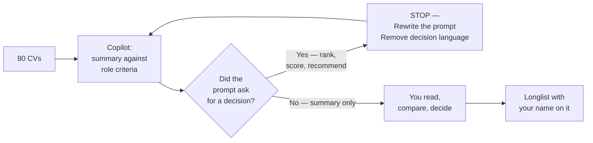

**Microsoft 365 Copilot does not change anyone's job. It changes the typing.** Whatever role you're in, your judgment stays where it is. This playbook walks through five personas — Recruiters & HR, Operations, Finance, IT Admin, Sales & Marketing — with the daily workflows, worked prompts, and guardrails that actually matter in each.

This is the role-specific companion to the [Prompt Engineering hub guide](/blog/prompt-engineering-microsoft-365-copilot/). If you haven't read that yet, **read it first** — it covers Microsoft's four-block framework (Goal · Context · Expectations · Source), the iteration habit, and the privacy basics. Everything below sits on top of those.

> 🏃 **TL;DR for skimmers**
>
> Five personas, same four-block framework underneath, different prompts on top. Read your own role's section first. Skim the others — the patterns repeat more than you'd expect.
>
> The hard line for every persona: Copilot drafts. You decide.

**Quick navigation:**

🚀 **Start here:**

1. [What Copilot must NOT do](#guardrails) — applies to every persona
2. [Before you paste anything](#privacy)
3. [The universal cheat sheet](#cheat-sheet)
4. [The 4-block refresher](#refresher)

👥 **The five personas:**

- [1 · Recruiters & HR](#p1) — talent, candidate comms, interviews, inclusive ads
- [2 · Operations](#p2) — processes, partners, launches, risk, deal management
- [3 · Finance](#p3) — close, forecasting, compliance, contracts, cash flow
- [4 · IT Admin](#p4) — tenant ops, security, support, documentation, audit
- [5 · Sales & Marketing](#p5) — account prep, outreach, pipeline, content

🤝 [4-week practice plan](#practice) · [Where to next](#next) · [FAQ](#faq)

🔄 **Living document.** Microsoft 365 Copilot ships changes monthly. The workflows in this guide don't move — but specific button positions, feature names, or supported file types may have shifted by the time you read this. Spotted something off? [Let me know](/feedback/) and I'll update.

## What Copilot must NOT do {#guardrails}

This section comes before everything else because the same principle applies in every role: **Copilot is a drafting and summarising assistant. Not a decision-maker.** Bookmark this section. It's the line that protects you, your team, and the people on the receiving end of your work.

**Across every persona in this playbook, Copilot must not:**

- Make decisions on your behalf. Hiring outcomes, ratings, ranking, customer commitments, financial commitments, security verdicts, deal closures — all human-owned.
- Be the sole basis for any decision that affects another person's employment, finances, opportunities, or security access.
- Score, rank, or filter people (candidates, employees, customers, vendors) by demographic or inferred demographic traits.
- Infer protected characteristics from any source material — age, gender, ethnicity, disability, religion, pregnancy, sexual orientation, union status, health status, nationality, visa status.
- Replace structured human review against job-related, audit-grade, or policy-grade criteria.
- Generate customer-facing or candidate-facing communication that goes out without a human reviewing every word.
- Override legal, HR, DEI, compliance, works council, union, or local policy requirements anywhere.
- Process regulated data (candidate PII, customer financial info, health records, identity documents) outside your approved workflow.

Frame Copilot's job as: **drafting, summarising, structuring, comparing, flagging, helping you read faster.** The decisions stay with you. So does the accountability.

> 📎 **One test.** If a prompt feels like it's asking Copilot to decide — "rank these candidates", "score this customer's likelihood to churn", "flag this transaction as fraud" — rewrite it. Ask for a structured summary instead. Read the summary. Decide yourself. That five-second rewrite is the difference between defensible AI use and a problem.

## Before you paste anything {#privacy}

Three rules, same in every persona section that follows:

**1. Use your organisation's licensed Microsoft 365 Copilot.** Never paste customer data, candidate PII, internal financials, security alerts, or anything regulated into a consumer AI tool. Your enterprise Copilot keeps the data inside the tenant boundary; consumer tools may not.

**2. Respect existing permissions and tenant policy.** Copilot only sees what you can already see. That includes things you can see but probably shouldn't — over-permissioned SharePoint folders, an old shared drive, a Teams channel you joined for one meeting two years ago. Before you ground Copilot in something sensitive, check who has access to the source.

**3. Validate before you publish.** Copilot drafts. You publish. Always check facts, names, numbers, dates, and especially anything regulated. Treat every first draft the way you'd treat a confident new hire's first draft — useful but in need of a once-over.

> 🚨 **If you're unsure what your tenant allows, pause and ask.** A 15-minute conversation with your IT or HR Ops lead is cheaper than a data-handling incident.

## The universal cheat sheet {#cheat-sheet}

Print this. Stick it next to your monitor. Works in every role.

### The 4-block prompt recipe

| Block | Plain-English question | Example |
|---|---|---|
| **Goal** | What do you want Copilot to do? | "Summarise…" / "Draft…" / "Compare…" / "Find…" |
| **Context** | What does Copilot need to know? | Audience, situation, tone, constraints |
| **Expectations** | What does good look like? | Length, format, what to avoid, what to flag |
| **Source** | Where should it ground its answer? | /file, /meeting, /email, /chat |

### Three guardrail phrases — paste these into any prompt that touches people or money

1. *"Do not rank. Do not recommend. Do not decide."*
2. *"Only use criteria from the source documents. Do not infer anything else."*
3. *"Flag missing information rather than guessing."*

These three phrases keep Copilot in the lane where it belongs.

### Cross-persona one-liner — the prompt that works in every role

> *"Using /[your real source file], [summarise / draft / compare / find] [what you actually need]. [Format and length]. [What to avoid or watch out for]. Do not speculate beyond the source — flag if information is missing."*

That single template, with the four blocks filled in honestly, will get you a useful first draft for ~80% of the tasks across every persona in this playbook. The rest is iteration.

## The 4-block framework — quick refresher {#refresher}

If you've read the [Prompt Engineering hub guide](/blog/prompt-engineering-microsoft-365-copilot/), you can skip this. If not, here are the four blocks in 30 seconds:

- **Goal** — the verb. "Summarise" / "Draft" / "Compare". Not "help me with".
- **Context** — what Copilot needs to know. Audience, situation, tone, constraints.
- **Expectations** — what good looks like. Length, format, what to avoid, what to flag.
- **Source** — what to ground in. /file, /meeting, /email, /chat. Without this, Copilot writes from general knowledge — fine for brainstorming, not fine for your-specific-work output.

Every prompt in the persona sections below uses this shape. Once you've seen 20 of them, you'll be writing your own without thinking about it.

---

# 1 · Recruiters & HR {#p1}

Recruitment is the highest-judgment job inside HR. Every CV is a person. Every interview question shapes someone's career. Every rejection email lands in someone's inbox at the end of their day. Copilot does not change any of that — Copilot just removes the blank-page tax.

## The recruiter's day with Copilot

| Time | Task | Copilot pattern |
|---|---|---|
| 8:30am | Triage overnight email | Outlook Copilot — summarise threads, draft warm short replies |
| 9:00am | Role intake with a hiring manager | Take notes manually; afterwards: *"Summarise /Intake meeting into role goals, must-haves, nice-to-haves, hiring timeline, open questions."* |
| 10:00am | Job description + inclusive advert | Word + Copilot Chat — draft JD, flag exclusionary language |
| 11:00am | Outreach to passive candidates | Outlook — personalised drafts grounded in role + candidate background |
| 1:00pm | Read incoming CVs | Copilot Chat — *summary against role criteria* prompts (never ranking) |
| 2:00pm | Prep for interviews | Word — interview guides with behavioural + technical + bias check |
| 4:30pm | Reject candidates from earlier stage | Outlook — empathetic, neutral rejection grounded in your template |
| 5:00pm | Pipeline check | Excel — funnel variances, time-to-hire, source-of-hire commentary |

## Six worked prompt patterns

### Pattern 1.1 — Summarise a role intake meeting

> **Goal:** Summarise the role intake notes into a structured role brief.
>
> **Context:** Just finished a 45-minute intake with the hiring manager for a Senior Data Engineer role in our risk team.
>
> **Expectations:** Five sections — Role purpose · Key responsibilities · Must-have skills · Nice-to-have skills · Timeline and open questions. Plain English. Flag any contradictions between what the hiring manager said and the existing JD template.
>
> **Source:** Using /Senior DE intake meeting and /Risk team org chart.

### Pattern 1.2 — Inclusive job advert rewrite

> **Goal:** Review this job advert and rewrite it through a DEI lens.
>
> **Context:** We want to widen the candidate pool, not narrow it. We've had feedback our adverts sound male-coded and overly senior.
>
> **Expectations:** Three outputs — (1) a list of exclusionary or unintentionally gendered phrases with one-line explanations, (2) a rewritten version in plain inclusive language, (3) a short note flagging any phrasing that might still need a DEI partner review. Do not invent commitments we have not made.
>
> **Source:** Paste the draft job advert into the chat when you run this prompt.

Worked examples of what Copilot will catch:

| Original phrasing | Why it's flagged | Rewrite |
|---|---|---|
| "We're looking for a rockstar engineer" | Male-coded language | "We're looking for an experienced engineer who…" |
| "Must have 10+ years of experience" | Often narrows the pool unnecessarily and can function as a proxy that reduces inclusivity | "Significant hands-on experience with…" |
| "Aggressive deadlines, fast-paced environment" | Can read as 'expect overwork' | "Clear priorities and a focus on shipping outcomes" |
| "Native English speaker required" | Often unlawful, excludes most of the world's English speakers | "Strong written and spoken English" |

### Pattern 1.3 — Outreach email to a passive candidate

> **Goal:** Draft an outreach email to a passive candidate.
>
> **Context:** Senior Data Engineer role at a regulated industry. Candidate is at a fintech. Public profile shows interest in cloud migrations. Tone is warm but not gushing.
>
> **Expectations:** 120 words. Three short paragraphs. Sign off as me. Match the tone of my last two outreach emails (paste two when you run this). Don't fabricate any benefit, salary range, or detail that isn't in the source.
>
> **Source:** /Senior DE Job Description plus two example emails of yours for tone matching.

### Pattern 1.4 — CV summary against role criteria (the safest pattern)

> **Goal:** Summarise this CV against the essential criteria in the job description.
>
> **Context:** I'm reading 80 CVs and need a consistent shape so I can read faster — not so Copilot can decide.
>
> **Expectations:** Output a table — Criterion · Evidence in CV · Missing or unclear. **Do not rank. Do not recommend. Do not score. Do not advance or reject.** Do not infer age, gender, ethnicity, or any protected characteristic. Flag missing or ambiguous information.
>
> **Source:** /Senior DE Job Description. Paste the CV text when you run this prompt.

### Pattern 1.5 — Interview question bias check

> **Goal:** Review my draft interview questions for bias and leading language.
>
> **Context:** Interview kit for the Senior Data Engineer role. I want a pass-through before they go to interviewers.
>
> **Expectations:** For each question, output — Question · Bias risk (low/medium/high) · Why · Suggested rewrite. Be explicit about leading language, demographic-coded language, vague questions that invite subjective judgment, or questions that probe protected characteristics.
>
> **Source:** Paste your draft interview questions when you run this prompt.

### Pattern 1.6 — Empathetic rejection email

> **Goal:** Draft a rejection email for a candidate who reached final round.
>
> **Context:** Someone we'd like to stay in touch with for future roles. Strong, just not the right fit for this specific opening.
>
> **Expectations:** 80-100 words. Warm, factual, no platitudes ("strong field", "very difficult decision"). Be specific about staying in touch without committing to a timeline. No individual feedback unless I add specific bullets below — the legal boundary depends on local law.
>
> **Source:** /Rejection email template grounded in our HR policy plus the example email below.

## Persona-specific guardrails — Recruitment & HR

In addition to the universal guardrails above, recruiters and HR partners face a specific risk: **AI being treated as an automated decision-maker for hiring**. That's a regulatory and reputational landmine.

- **Never** ask Copilot to rank, score, shortlist, or recommend candidates.
- **Never** ask Copilot to infer or use proxies for protected characteristics (career gaps, school names, postcodes, names, accents, photo analysis).
- **Never** send candidate-facing communication without human review of every word.
- **Always** ground candidate summaries in role criteria, not general impressions.
- **Always** document that decisions were human-made and based on job-related criteria.

If your country, state, or sector regulates automated decision-making (NYC Local Law 144, EU AI Act, etc.), check what your AI policy team has approved for your tenant.

## Scenario — Mei the recruiter, 80 CVs and two days

Mei has a senior data engineer role with 80 applicants and a hiring manager waiting for a longlist. She uses Pattern 1.4 to summarise each CV against the role criteria. She does not ask Copilot to rank. She gets 80 consistent tables, reads them at her own pace, and brings her own longlist to the hiring manager.

She is faster than she would have been. She is also more consistent — every CV gets read against the same shape, not "first 20 deeply, last 60 skim". A meaningful time saving across the week. Quality: better, because the comparison is structured.

---

# 2 · Operations {#p2}

Operations is the role where Copilot saves the most time in the least visible way. Process documentation, partner reviews, launch readiness, risk registers, deal pipelines — every one of them lives in documents, meetings, and spreadsheets, and every one of them used to take half a day of typing. Copilot turns those half-days into hours.

## The ops lead's day with Copilot

| Time | Task | Copilot pattern |
|---|---|---|
| 8:30am | Email triage + Teams catch-up | Copilot Chat — *"Catch me up on /ops project across emails and Teams last 24 hours"* |
| 9:00am | Process documentation review | Word + Copilot — turn meeting notes into a work instruction document |
| 11:00am | Partner / supplier monthly business review (MBR) prep | Copilot Chat — pull last 3 MBRs into a one-page summary |
| 1:00pm | Launch readiness check | Word + Copilot — build issues & risks register from launch docs |
| 2:00pm | Risk and control review | Excel + Copilot — turn process map into a Failure Mode & Effects Analysis (FMEA) |
| 3:00pm | Deal pipeline review with partner | Copilot Chat — summarise active deals from emails + Teams chats |
| 4:30pm | SOP draft / update | Word + Copilot — convert process notes into formal SOP |

## Six worked prompt patterns

### Pattern 2.1 — Work instructions from a process overview

> **Goal:** Create a work instruction document.
>
> **Context:** Our team has an existing operational procedure overview. We need a documented work instruction that a new joiner can follow.
>
> **Expectations:** Document format. Include a table of contents, a version table with today's date as creation date, a stakeholder table, and a step-by-step overview. Plain English. Flag any steps where the source is ambiguous — do not invent.
>
> **Source:** /Operational Procedure Overview.

### Pattern 2.2 — High-level process flow diagram

> **Goal:** Create a high-level process flow diagram.
>
> **Context:** I need a swim-lane process flow showing ownership across roles, systems, and tools.
>
> **Expectations:** Suggest the diagram structure (swim lanes + flow steps) in markdown / Mermaid syntax. Identify ownership clearly. Do not invent steps not in the source.
>
> **Source:** /Operational Procedure Overview.

### Pattern 2.3 — Monthly Business Review (MBR) preparation

> **Goal:** Prepare for an upcoming MBR with our key supplier.
>
> **Context:** I have the last three monthly MBR presentations. I need a consolidated view of supplier performance challenges and improvement opportunities.
>
> **Expectations:** Five bullets summarising key challenges and improvement opportunities across the three MBRs. Plain English. Cite the MBR each point came from.
>
> **Source:** /Monthly Business Reviews 1, /Monthly Business Reviews 2, /Monthly Business Reviews 3.

### Pattern 2.4 — Launch issues & risks register

> **Goal:** Help me build a first-draft Issues & Risks register for an upcoming launch.
>
> **Context:** Launch is set to land in mid-Q3. We have a launch readiness assessment document.
>
> **Expectations:** Table format — Issue/Risk · Category · Likelihood · Impact · Owner · Mitigation · Status. Pull explicit issues/risks from the source first. Then propose candidate risks I might have missed, but mark them clearly as `[suggested — needs SME review]`. Plain English. Flag any source-grounded risk where information is missing.
>
> **Source:** /Launch Readiness Assessment.

### Pattern 2.5 — Failure Mode and Effects Analysis (FMEA) — draft support

> **Goal:** Help me draft an FMEA on this process — first surface candidate failure modes, then leave the scoring for SME review.
>
> **Context:** Our risk team needs a structured FMEA on this operational process flow. The numerical scoring (severity, likelihood, detectability) needs to come from the SMEs who know the process, not from Copilot guessing.
>
> **Expectations:** For each process step, propose 1-2 candidate failure modes with — Step · Possible failure mode · Possible effect · Possible cause · Suggested questions for the SME to assess severity/likelihood/detectability. Plain English. Mark anything you can't ground in the source as `[suggested — confirm with SME]`. Do not invent scoring numbers.
>
> **Source:** /Operational Process Flow Diagram.

### Pattern 2.6 — SOP draft from existing process notes

> **Goal:** Draft a Standard Operating Procedure for an existing informal process.
>
> **Context:** Our team operates this process informally. We need it documented as an SOP for consistency and onboarding new joiners.
>
> **Expectations:** Document format. Sections — Purpose · Scope · Roles · Step-by-step process · Tools used · Decision points · Escalation paths · Quality checks · Revision history. Plain English. Do not invent steps not in the source notes — flag gaps for me to fill.
>
> **Source:** /Informal process notes plus /SOP template.

## Persona-specific guardrails — Operations

- **Process changes that affect compliance, audit, or regulatory posture** need formal change control. Copilot can draft the change proposal, not approve it.
- **FMEA and risk register outputs** are starting points for human review by your risk and audit teams, not final assessments.
- **Partner / supplier communication** drafted by Copilot still goes through your standard approval flow.
- **SOPs** drafted by Copilot are documentation drafts, not authoritative guidance, until your process owner signs off.

## Scenario — Priya the ops lead, weekly business review prep

Priya runs a 12-person operations team. Every Tuesday she presents to her director: what shipped, what slipped, what's at risk. It used to take her Sunday afternoon.

She grounds Copilot Chat in three weeks of meeting recaps, the team's Loop planning page, and a Teams chat: *"Using /WBR meetings (last three) and /Ops planning page and /Ops leads chat from the last 7 days, draft a 4-bullet weekly business review for my director. Lead with: shipped, slipped, at risk, asks. Plain English. No marketing tone."*

First draft is 80% there. She iterates a few times: shorter on the wins, more specific on the risks, swap one phrasing. The job that used to eat her Sunday afternoon is now done before Monday's first coffee.

---

# 3 · Finance {#p3}

Finance is the role where Copilot saves the most time on the most-disliked task on every finance manager's desk: **commentary**. Variance commentary, forecast narrative, executive summary, audit response. The numbers are in the spreadsheet — but the prose that wraps them used to take an hour per page. Copilot drafts it in two minutes. You spend the saved time on the actual judgment call: which variances need exec attention, which need an investigation, which are noise.

## The finance manager's day with Copilot

| Time | Task | Copilot pattern |
|---|---|---|
| 8:30am | Daily flash review | Excel + Copilot — *"Find the biggest variances vs forecast in this sheet"* |
| 9:00am | Month-end close prep | Excel + Copilot — standardise formatting, identify inconsistencies |
| 11:00am | Variance commentary for leadership | Excel + Copilot — drivers + plain-English narrative |
| 1:00pm | Forecast review meeting prep | Copilot Chat — one-page briefing across forecast + recent meetings |
| 2:00pm | Contract / supplier spend analysis | Excel + Copilot — actual vs committed, flag variances |
| 3:00pm | Compliance / regulation update | Copilot Chat — summarise external updates, compare to internal policy |
| 4:30pm | Cash flow / receivables review | Excel + Copilot — aging receivables, flag risks |

## Six worked prompt patterns

### Pattern 3.1 — Standardise close data before reconciling

> **Goal:** Identify formatting inconsistencies in this dataset.
>
> **Context:** Aggregate sales invoice and payment data ahead of reconciliation. I need a clean output ready for matching.
>
> **Expectations:** A step-by-step list of formatting inconsistencies (extra spaces, inconsistent capitalisation, date formats, text vs numeric values, negative signs). For each, propose an Excel formula or transformation to normalise. Plain English. Flag fields where the format is ambiguous.
>
> **Source:** /Aggregate sales invoice and payment data.

### Pattern 3.2 — Variance commentary for leadership

> **Goal:** Analyse the variance summary and draft leadership commentary.
>
> **Context:** Monthly variance analysis vs forecast. Leadership wants the three biggest variances explained, plus implications. Audience is the steering committee.
>
> **Expectations:** Short narrative (3-4 paragraphs). For each of the top three variances — Variance amount and direction · Likely driver based on the data · Implication for next month. Plain English. Clearly label assumptions. Do not speculate beyond the source — if a driver isn't clear, say so.
>
> **Source:** /Variance analysis summary.

### Pattern 3.3 — Reusable close reporting template

> **Goal:** Create a reusable Copilot-friendly close reporting template.
>
> **Context:** Monthly reporting package is a mix of Excel and PowerPoint. I want a repeatable template Copilot can use each period.
>
> **Expectations:** Output — (1) a slide outline section with placeholders for revenue, Gross Margin Percentage (GM%), key drivers, top risks, and (2) a table of required inputs with where to pull each from. Plain English.
>
> **Source:** /Monthly reporting package (Excel + PPT).

### Pattern 3.4 — Compare accounting amendments

> **Goal:** Compare two accounting amendments and summarise the differences.
>
> **Context:** Two amendments to an accounting standard. I need to brief my team on what changed and what to action.
>
> **Expectations:** Output — (1) a simple table highlighting the key differences (Topic · Amendment A · Amendment B · Implication), (2) a concise paragraph summarising the two documents in plain English. Flag any clause where the difference is ambiguous.
>
> **Source:** /Amendment A and /Amendment B.

### Pattern 3.5 — Contract clauses requiring deeper review

> **Goal:** Review this contract and identify clauses that may need additional review.
>
> **Context:** Vendor contract going through procurement. I want a finance-led risk flag before it goes to legal.
>
> **Expectations:** For each flagged clause, briefly explain why it could create financial or contractual risk. Look specifically for unilateral changes, auto-renewals, broad limitations of liability, payment-term traps, and currency clauses. Output as a table — Clause · Section · Risk type · Why it's risky · Suggested next step.
>
> **Source:** /Contract.

### Pattern 3.6 — Aging receivables and overdue invoices

> **Goal:** Identify overdue invoices and recommend next steps.
>
> **Context:** Aging receivables report plus recent customer email threads. I need to act before month-end.
>
> **Expectations:** Table — Customer · Invoice · Days overdue · Issue · Recommended next step. Plain English. Recommended next steps should be process-aligned (send reminder, escalate to Collections, raise dispute, etc.) — do not invent customer-specific commitments.
>
> **Source:** /Aging receivables report and recent /Customer name email threads.

## Persona-specific guardrails — Finance

- **Output from Copilot is not financial advice.** Variance commentary, risk flags, and contract reviews are drafting and analysis support — final accounting, tax, or financial decisions require qualified human judgment.
- **Audit trail matters.** Document which Copilot prompts informed which work products, especially anything that ends up in audited financials or board materials.
- **Regulated data** (PII, payment card data, banking details) — check your tenant policy before grounding Copilot in source files containing these.
- **Forecasts** drafted by Copilot are starting points for human FP&A review, not final commitments.

## Scenario — Tom the finance manager, variance commentary

Tom owns monthly variance commentary for his business unit. Forecast vs actuals, by category, with a one-paragraph "why" on each big variance. It's the most disliked task on his desk.

He grounds Copilot in his variance Excel: *"In this sheet, find the three biggest unfavourable variances and the two biggest favourable ones. For each, draft a one-sentence likely driver based on the row data. Do not speculate beyond what's in the sheet — flag if a driver isn't clear."*

He spends the saved time on the actual judgment call — which variances need exec attention, which need a deeper investigation, which are noise. The typing is gone; the thinking is still his.

---

# 4 · IT Admin {#p4}

IT admins live in the gap between policy and practice. Tenant configuration, security alerts, user support tickets, audit prep, runbooks, change requests — every one of them is a documentation-heavy task that used to mean copy-pasting between dashboards, ticket systems, and Word. Copilot handles the documentation and summarisation layer while you stay focused on the actual administration.

## The IT admin's day with Copilot

| Time | Task | Copilot pattern |
|---|---|---|
| 8:30am | Overnight alerts triage | Copilot Chat — summarise alert volume + patterns, not verdicts |
| 9:00am | Service health + incident comms | Outlook + Copilot — draft maintenance / outage communications |
| 11:00am | User support ticket follow-ups | Outlook + Copilot — empathetic, plain-English responses |
| 1:00pm | Runbook update | Word + Copilot — turn recent incident notes into a runbook addition |
| 2:00pm | Policy explanation for end users | Word + Copilot — translate policy into plain language |
| 3:00pm | Audit / compliance prep | Copilot Chat — assemble evidence package from across documents |
| 4:30pm | Change request documentation | Word + Copilot — RFC structure from technical notes |

## Six worked prompt patterns

### Pattern 4.1 — Incident communication draft

> **Goal:** Draft a service incident communication for impacted users.
>
> **Context:** Mid-severity incident affecting one of our line-of-business apps. We have technical incident notes. Communication needs to go to ~400 users.
>
> **Expectations:** Short email format. Subject line + four sections — What's happening · Who's affected · What we're doing · When to expect an update. Plain English. No technical jargon. No SLA promises that aren't in the source notes.
>
> **Source:** /Incident technical notes.

### Pattern 4.2 — Translate a technical policy into plain language

> **Goal:** Translate this conditional access policy into a plain-English explanation for end users.
>
> **Context:** End users are seeing more MFA prompts after we tightened policy. They need to understand what changed, why, and what they should do.
>
> **Expectations:** Three paragraphs. What changed (in plain English) · Why we changed it · What users should do now. Reassuring tone. No jargon. No expectations of users that aren't actually required.
>
> **Source:** /Conditional access policy document.

### Pattern 4.3 — Runbook update from incident notes

> **Goal:** Update our existing runbook with what we learnt from this incident.
>
> **Context:** We resolved an incident last night. Engineer wrote rough technical notes. We need to fold the new diagnosis steps into our existing runbook.
>
> **Expectations:** Output the suggested new runbook section with — Symptom · Diagnostic steps · Resolution · Things to check first. Match the formatting of the existing runbook. Flag anything in the engineer's notes that needs verification before we add to the runbook.
>
> **Source:** /Existing runbook and /Last night incident notes.

### Pattern 4.4 — User support response — empathetic and clear

> **Goal:** Draft a response to a user support ticket.
>
> **Context:** User can't access a SharePoint site. We've checked — it's a permissions issue, not a configuration error. Site owner needs to grant access. User is frustrated.
>
> **Expectations:** 80-100 words. Empathetic, factual. Explain what's happening, what they need to do (request access from the site owner), and how long it should take. No blame language. No false reassurance.
>
> **Source:** /Support ticket thread.

### Pattern 4.5 — Audit evidence package summary

> **Goal:** Summarise our compliance posture for the SOC 2 access control criterion.
>
> **Context:** External audit prep. Auditor wants evidence that our access control policy is implemented as documented. We have the policy doc, recent access review exports, and conditional access configuration.
>
> **Expectations:** Two-paragraph summary citing each source — what the policy says, what the evidence shows, any gaps. Plain English. Do not claim a compliance status — that's the auditor's call. Flag anything where evidence is missing or ambiguous.
>
> **Source:** /Access control policy, /Access reviews export, /Conditional access config.

### Pattern 4.6 — Change request (RFC) drafting

> **Goal:** Draft an RFC for an upcoming change.
>
> **Context:** Engineer has written rough technical notes for an upcoming change to our DNS configuration. Change board meets Friday and needs a structured RFC.
>
> **Expectations:** Standard RFC format — Summary · Background · Proposed change · Risk and impact · Rollback plan · Testing approach · Approvals required · Timeline. Plain English. Do not invent risks not in the engineer's notes — flag any section where source is thin so I can fill it in.
>
> **Source:** /Engineer change notes.

## Persona-specific guardrails — IT Admin

- **Security alerts and incident verdicts** are not Copilot's decision — analyst review remains required for every alert and incident classification.
- **Change requests** drafted by Copilot still go through your normal change-board approval. Copilot makes them faster to write, not less reviewed.
- **End-user communications** about incidents, outages, or policy changes need a clear human approver before sending — especially anything that touches SLA or downtime.
- **Tenant configuration** changes happen via your approved tools and processes. Copilot drafts the change documentation, not the change itself.
- **Privacy** — be careful with logs, audit exports, and incident notes that contain user identifiers. Use your enterprise Copilot only.

## Scenario — Rohan the IT admin, audit prep without the all-nighter

Rohan runs IT operations for a 1,500-person company. SOC 2 audit prep used to mean a weekend of cross-referencing policies, access reviews, and conditional access configurations into evidence packs. He uses Pattern 4.5 for each of the 30+ control criteria the auditor asks about.

Copilot doesn't claim compliance — it pulls together the policy, the configuration, and the audit logs into a structured one-pager per criterion. Rohan reviews each one, fills the gaps, and walks into the audit with a coherent evidence package. The auditor still asks hard questions. The difference is Rohan has the answers ready.

The time saving across an audit cycle is significant. More importantly, the work is more consistent because every criterion gets the same structured treatment.

---

# 5 · Sales & Marketing {#p5}

Sellers and marketers live in the gap between **research** (knowing your customer deeply) and **execution** (writing the thing, prepping the thing, sending the thing). Copilot doesn't sell. It does the research, drafting, and follow-up legwork so you walk into customer conversations more prepared and walk out with better notes.

## The seller / marketer's day with Copilot

| Time | Task | Copilot pattern |
|---|---|---|
| 8:30am | Account prep for today's calls | Copilot Chat — research summary across emails, meetings, public info |
| 9:00am | Outreach to new prospects | Outlook + Copilot — personalised, grounded in account research |
| 11:00am | Discovery call recap and follow-up | Teams + Outlook — recap, action items, customer-ready follow-up email |
| 1:00pm | Proposal / RFP response drafting | Word + Copilot — first-draft sections grounded in win-themes + product docs |
| 2:00pm | Pipeline review | Excel + Copilot — pipeline variance commentary, deal-at-risk flags |
| 3:00pm | Marketing content drafting | Word + Copilot — first draft of campaign content from brief |
| 4:30pm | Customer-facing comms | Outlook + Copilot — status updates, milestone notifications |

## Eight worked prompt patterns — sales + marketing

### Pattern 5.1 — Account research summary before a customer call

> **Goal:** Prepare a one-page account brief for tomorrow's discovery call.
>
> **Context:** First call with a new prospect. We've exchanged two emails. The prospect is in financial services. I need to walk in informed.
>
> **Expectations:** Sections — Account snapshot (size, industry, recent news) · What they likely care about · Our prior interactions · Open questions to ask · Risks. Plain English. Cite each fact's source. Flag any inference that isn't grounded in a source — I'll check it.
>
> **Source:** Recent /Email thread, /Their public website, any /Prior meeting notes.

### Pattern 5.2 — Personalised outreach email

> **Goal:** Draft a personalised outreach email.
>
> **Context:** Reaching out to a prospect at [Company]. Their public profile shows they're hiring data analysts and posted about migrating from on-prem to cloud. Our product accelerates that migration.
>
> **Expectations:** 100 words. Three short paragraphs — why I'm reaching out · what's specifically relevant about us to them · soft ask for 20-minute call. Match the tone of my last two outreach emails (paste two when you run this). Don't fabricate stats, customer references, or capabilities not in our /Product overview.
>
> **Source:** /Product overview plus two example outreach emails of yours for tone matching.

### Pattern 5.3 — Discovery call recap and customer-ready follow-up

> **Goal:** Recap this discovery call and draft a customer-ready follow-up email.
>
> **Context:** 45-minute discovery call with a new prospect. I took notes. I want a recap for myself + a clean follow-up to send.
>
> **Expectations:** Two outputs — (1) my internal recap (situation, pain, agreed next steps, deal risks), (2) the customer-facing follow-up email (recap of what we agreed, our next steps, soft ask). 120 words for the email. Plain English. Do not invent commitments — flag if I need to confirm something.
>
> **Source:** /My meeting notes.

### Pattern 5.4 — Pipeline variance commentary

> **Goal:** Analyse my pipeline and draft commentary for the weekly forecast call.
>
> **Context:** My personal pipeline export from CRM. I need to explain what changed this week vs last week and flag the deals at risk.
>
> **Expectations:** Three sections — Pipeline movement (in/out, value change, stage shifts) · Deals at risk (with reason) · Asks (manager support needed). Plain English. Do not invent reasons for stage changes — flag where source is unclear.
>
> **Source:** /CRM pipeline export and /Last week's pipeline notes.

### Pattern 5.5 — RFP response section drafting

> **Goal:** Draft a first cut of these RFP response questions.
>
> **Context:** RFP from a public sector customer. 25 questions across security, support, pricing, references. I want first drafts I can refine.
>
> **Expectations:** For each question — Question · First-draft answer (grounded in our product docs and approved RFP library) · Confidence (high/medium/low) · Source. Flag any question where I should escalate to a SME. Do not invent capabilities, references, or commercial terms not in the source.
>
> **Source:** /RFP document, /Approved RFP answer library, /Product overview.

### Pattern 5.6 — Marketing content first draft from a brief

> **Goal:** Draft the first cut of a marketing email campaign.
>
> **Context:** Launching a new feature next month. Brief is attached. Audience is existing customers in mid-market segment. We want them to attend a webinar.
>
> **Expectations:** Three outputs — (1) subject line (3 options), (2) preview text (3 options), (3) email body 150 words. Plain English, no marketing fluff. Lead with value to the customer, not company news. End with a clear CTA to register. Do not invent claims about results, customers, or capabilities not in the brief.
>
> **Source:** /Campaign brief.

### Pattern 5.7 — Marketing performance commentary

> **Goal:** Analyse this campaign's performance and draft commentary for the marketing review.
>
> **Context:** Recent webinar campaign. Need a short commentary for the weekly marketing review — what worked, what didn't, what to test next.
>
> **Expectations:** Three sections — Headline metrics (only what's actually in the data) · Top 3 observations (each grounded in a specific data point) · Hypotheses to test next sprint. Plain English, no marketing fluff. Do not speculate beyond the data — flag where a metric is missing.
>
> **Source:** /Campaign performance dashboard export and /Last week's marketing review notes.

### Pattern 5.8 — Customer-facing case study draft from raw notes

> **Goal:** Draft a customer case study from raw interview notes and our internal win story.
>
> **Context:** 60-minute customer interview transcript plus our internal "why we won" notes. We want a case study to publish externally, with the customer's sign-off, within 4 weeks.
>
> **Expectations:** Output a draft case study — Problem · Approach · Outcome · Customer quote (only quotes that are verbatim in the source) · A line about what's next. Plain English. Mark every customer-attributable claim with `[NEEDS CUSTOMER SIGN-OFF]` so we know what to confirm. Do not fabricate metrics. Flag any section where the source is too thin to publish.
>
> **Source:** /Customer interview transcript and /Internal win story notes.

## Persona-specific guardrails — Sales & Marketing

- **Customer-facing communication** drafted by Copilot needs human review of every word before sending — your name and the brand are on it.
- **Pricing, commercial terms, contractual commitments** never get drafted by Copilot without explicit approved guidance — these can become binding.
- **Customer data** (CRM exports, customer email threads, support ticket data) — use your enterprise Copilot only. Customer data into a consumer AI tool is a breach.
- **Competitive claims** drafted by Copilot need approval through your standard marketing and legal review — Copilot can draft, only your team can approve.
- **Pipeline forecasts** are starting points for human review — never use Copilot's pipeline analysis as a final forecast number.

## Scenario — Anna the seller, ten discovery calls in a week

Anna runs four to ten customer discovery calls a week. She used to spend an hour after each call writing up her notes, drafting the follow-up email, and updating CRM. That's six to ten hours a week of post-call admin.

She uses Pattern 5.3 after every call. Internal recap + customer follow-up email + CRM-ready notes, all from her meeting notes in five minutes. She still reads every customer-facing email twice before sending. The CRM updates still get a manual sense-check. But the typing tax is gone.

The compound effect: she runs *more* discovery calls, because the post-call admin doesn't pile up. The hours she used to spend on after-call admin are now hours she spends on the next conversation — and that's the real shift.

---

## Your 4-week practice plan {#practice}

This plan works for every persona in this playbook. Same shape, different prompts.

| Week | Focus | What success looks like |
|---|---|---|
| **1 — Email & meetings** | Outlook summaries and replies, Teams meeting recaps. Three Copilot-drafted comms a day, iterated at least once. | By Friday, the four-block framework feels natural and the iteration habit is automatic. |
| **2 — Role-specific drafting** | Pick the two highest-typing-tax tasks in your role (recruiter = JDs + rejection emails · ops = SOP drafts + MBR prep · finance = variance commentary + reconciliation · IT = incident comms + runbook · sales = outreach + follow-up). Use Copilot for one each, daily. | By Friday, you have a personal library of working prompts you can reuse. |
| **3 — Cross-source reasoning** | Move to Copilot Chat with grounding across files, emails, and meetings. *"Catch me up on /[project] across the last 7 days."* | By Friday, you've felt the time-saving compound effect. |
| **4 — Reporting & analysis** | Excel Copilot for the analysis task that used to take half a day. Funnel for recruiters, pipeline for sales, variance for finance, KPI dashboards for ops, audit prep for IT. | By Friday, you have your first "I'd struggle to go back" moment. |

> 💡 **Track what you save.** A one-line note at the end of each day: *"Today Copilot helped me on X — felt like it saved me real time."* By the end of week two you'll have your own evidence — your mileage will vary, but the trend usually tells the story.

## Where to go next {#next}

This playbook is the role-specific companion. Start with the hub if you haven't:

- 🌱 **[Prompt Engineering for Microsoft 365 Copilot — A Plain-English Field Guide](/blog/prompt-engineering-microsoft-365-copilot/)** — the universal hub. The four-block framework, per-app tips, privacy basics, and the mistakes everyone makes.

Also on this site:

- 📚 **[The Prompt Engineering Guide](/prompt-guide/)** — 8 deeper techniques, hands-on practice for each.
- 🧪 **[The Advanced Prompt Lab](/prompt-lab/)** — 12 expert techniques (Chain of Thought, Tree of Thought, ReAct, Meta-Prompting, etc.) for when the four blocks aren't enough.
- 📋 **[The Prompt Library](/prompts/)** — 500+ tested prompts. Filter by app and persona.
- 🎯 **[The Prompt Polisher](/prompt-polisher/)** — paste your prompt, get a score and a better version.
- 🧪 **[The Prompt Tester](/prompt-tester/)** — A/B compare two prompts.

**Useful Microsoft references:**

- **Microsoft role-based Prompt Packs** for HR, Operations, and Finance (and more rolling out) — ask your Microsoft account team, partner manager, or solution engineer for the latest. These are a strong companion resource to this playbook.
- [Microsoft Learn — Write effective prompts](https://learn.microsoft.com/en-us/training/modules/write-effective-prompts-do-more-prompting/)
- [Microsoft 365 Copilot — Get started writing prompts](https://support.microsoft.com/en-us/microsoft-365-copilot/get-started-writing-prompts-in-microsoft-365-copilot)

**Related guides on this site:**

- [Copilot Pro vs Microsoft 365 Copilot — Which Do You Need?](/blog/copilot-pro-vs-microsoft-365-copilot/)
- [How Microsoft 365 Copilot Works, Layer by Layer](/blog/how-microsoft-365-copilot-works-layer-by-layer/)
- [M365 Agent Builder — Plain-English Field Guide](/blog/m365-agent-builder-explained/)
- [22 Copilot features you should be using](/blog/20-copilot-features-you-should-be-using/)

---

✎ **One more thought.** Five personas, same skill underneath. The pattern is always the same: **you bring the judgment, Copilot brings the typing speed.** The roles change. The line doesn't.

If this playbook has been useful, the next thing worth doing is picking one prompt from your persona section, opening Copilot Chat right now, and trying it on a real task you have on your plate today. Iterate once. Notice what changed. Do the same tomorrow. By Friday, you'll have a habit. By the end of the month, you'll wonder how you ever worked without it.

— Sush

## FAQ {#faq}

The most common questions I get when teaching Copilot across these five roles.

