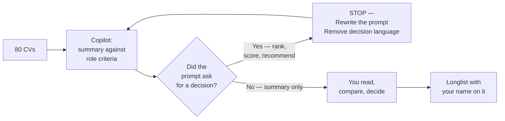

**Microsoft 365 Copilot does not change anyone's job. It changes the typing.** Whatever role you're in, your judgment stays where it is. This playbook walks through five personas — Recruiters & HR, Operations, Finance, IT Admin, Sales & Marketing — with the daily workflows, worked prompts, and guardrails that actually matter in each.

This is the role-specific companion to the [Prompt Engineering hub guide](/blog/prompt-engineering-microsoft-365-copilot/). If you haven't read that yet, **read it first** — it covers Microsoft's four-block framework (Goal · Context · Expectations · Source), the iteration habit, and the privacy basics. Everything below sits on top of those.

> 🏃 **TL;DR for skimmers**
>
> Five personas, same four-block framework underneath, different prompts on top. Read your own role's section first. Skim the others — the patterns repeat more than you'd expect.
>
> The hard line for every persona: Copilot drafts. You decide.

**Quick navigation:**

🚀 **Start here:**

1. [What Copilot must NOT do](#guardrails) — applies to every persona
2. [Before you paste anything](#privacy)
3. [The universal cheat sheet](#cheat-sheet)
4. [The 4-block refresher](#refresher)

👥 **The five personas:**

- [1 · Recruiters & HR](#p1) — talent, candidate comms, interviews, inclusive ads
- [2 · Operations](#p2) — processes, partners, launches, risk, deal management
- [3 · Finance](#p3) — close, forecasting, compliance, contracts, cash flow
- [4 · IT Admin](#p4) — tenant ops, security, support, documentation, audit
- [5 · Sales & Marketing](#p5) — account prep, outreach, pipeline, content

🤝 [4-week practice plan](#practice) · [Where to next](#next) · [FAQ](#faq)

<div class="living-doc-banner">

🔄 **Living document.** Microsoft 365 Copilot ships changes monthly. The workflows in this guide don't move — but specific button positions, feature names, or supported file types may have shifted by the time you read this. Spotted something off? [Let me know](/feedback/) and I'll update.

</div>

## What Copilot must NOT do {#guardrails}

This section comes before everything else because the same principle applies in every role: **Copilot is a drafting and summarising assistant. Not a decision-maker.** Bookmark this section. It's the line that protects you, your team, and the people on the receiving end of your work.

**Across every persona in this playbook, Copilot must not:**

- Make decisions on your behalf. Hiring outcomes, ratings, ranking, customer commitments, financial commitments, security verdicts, deal closures — all human-owned.
- Be the sole basis for any decision that affects another person's employment, finances, opportunities, or security access.
- Score, rank, or filter people (candidates, employees, customers, vendors) by demographic or inferred demographic traits.
- Infer protected characteristics from any source material — age, gender, ethnicity, disability, religion, pregnancy, sexual orientation, union status, health status, nationality, visa status.
- Replace structured human review against job-related, audit-grade, or policy-grade criteria.
- Generate customer-facing or candidate-facing communication that goes out without a human reviewing every word.
- Override legal, HR, DEI, compliance, works council, union, or local policy requirements anywhere.
- Process regulated data (candidate PII, customer financial info, health records, identity documents) outside your approved workflow.

Frame Copilot's job as: **drafting, summarising, structuring, comparing, flagging, helping you read faster.** The decisions stay with you. So does the accountability.

> 📎 **One test.** If a prompt feels like it's asking Copilot to decide — "rank these candidates", "score this customer's likelihood to churn", "flag this transaction as fraud" — rewrite it. Ask for a structured summary instead. Read the summary. Decide yourself. That five-second rewrite is the difference between defensible AI use and a problem.

## Before you paste anything {#privacy}

Three rules, same in every persona section that follows:

**1. Use your organisation's licensed Microsoft 365 Copilot.** Never paste customer data, candidate PII, internal financials, security alerts, or anything regulated into a consumer AI tool. Your enterprise Copilot keeps the data inside the tenant boundary; consumer tools may not.

**2. Respect existing permissions and tenant policy.** Copilot only sees what you can already see. That includes things you can see but probably shouldn't — over-permissioned SharePoint folders, an old shared drive, a Teams channel you joined for one meeting two years ago. Before you ground Copilot in something sensitive, check who has access to the source.

**3. Validate before you publish.** Copilot drafts. You publish. Always check facts, names, numbers, dates, and especially anything regulated. Treat every first draft the way you'd treat a confident new hire's first draft — useful but in need of a once-over.

> 🚨 **If you're unsure what your tenant allows, pause and ask.** A 15-minute conversation with your IT or HR Ops lead is cheaper than a data-handling incident.

## The universal cheat sheet {#cheat-sheet}

Print this. Stick it next to your monitor. Works in every role.

### The 4-block prompt recipe

| Block | Plain-English question | Example |
|---|---|---|
| **Goal** | What do you want Copilot to do? | "Summarise…" / "Draft…" / "Compare…" / "Find…" |
| **Context** | What does Copilot need to know? | Audience, situation, tone, constraints |
| **Expectations** | What does good look like? | Length, format, what to avoid, what to flag |
| **Source** | Where should it ground its answer? | /file, /meeting, /email, /chat |

### Three guardrail phrases — paste these into any prompt that touches people or money

1. *"Do not rank. Do not recommend. Do not decide."*
2. *"Only use criteria from the source documents. Do not infer anything else."*
3. *"Flag missing information rather than guessing."*

These three phrases keep Copilot in the lane where it belongs.

### Cross-persona one-liner — the prompt that works in every role

> *"Using /[your real source file], [summarise / draft / compare / find] [what you actually need]. [Format and length]. [What to avoid or watch out for]. Do not speculate beyond the source — flag if information is missing."*

That single template, with the four blocks filled in honestly, will get you a useful first draft for ~80% of the tasks across every persona in this playbook. The rest is iteration.

## The 4-block framework — quick refresher {#refresher}

If you've read the [Prompt Engineering hub guide](/blog/prompt-engineering-microsoft-365-copilot/), you can skip this. If not, here are the four blocks in 30 seconds:

- **Goal** — the verb. "Summarise" / "Draft" / "Compare". Not "help me with".
- **Context** — what Copilot needs to know. Audience, situation, tone, constraints.
- **Expectations** — what good looks like. Length, format, what to avoid, what to flag.
- **Source** — what to ground in. /file, /meeting, /email, /chat. Without this, Copilot writes from general knowledge — fine for brainstorming, not fine for your-specific-work output.

Every prompt in the persona sections below uses this shape. Once you've seen 20 of them, you'll be writing your own without thinking about it.

---

# 1 · Recruiters & HR {#p1}

Recruitment is the highest-judgment job inside HR. Every CV is a person. Every interview question shapes someone's career. Every rejection email lands in someone's inbox at the end of their day. Copilot does not change any of that — Copilot just removes the blank-page tax.

> 📚 **Pairs with Microsoft's official HR Prompt Pack.** The 5 scenarios + 26 worked patterns below follow the same structure as Microsoft's HR Prompt Pack. Ask your Microsoft contact (account team, partner manager, or solution engineer) for the latest pack — it's a strong complement to this playbook.

## The recruiter's day with Copilot

| Time | Task | Copilot pattern |
|---|---|---|
| 8:30am | Triage overnight email | Outlook Copilot — summarise threads, draft warm short replies |
| 9:00am | Role intake with a hiring manager | Take notes manually; afterwards: *"Summarise /Intake meeting into role goals, must-haves, nice-to-haves, hiring timeline, open questions."* |
| 10:00am | Job description + inclusive advert | Word + Copilot Chat — draft JD, flag exclusionary language |
| 11:00am | Outreach to passive candidates | Outlook — personalised drafts grounded in role + candidate background |
| 1:00pm | Read incoming CVs | Copilot Chat — *summary against role criteria* prompts (never ranking) |
| 2:00pm | Prep for interviews | Word — interview guides with behavioural + technical + bias check |
| 4:30pm | Reject candidates from earlier stage | Outlook — empathetic, neutral rejection grounded in your template |
| 5:00pm | Pipeline check | Excel — funnel variances, time-to-hire, source-of-hire commentary |

## The 5 HR scenarios

Microsoft's official HR Prompt Pack organises HR work into five scenarios. This playbook follows the same structure so the patterns line up with what your Microsoft contact will share.

### Scenario 1 — Recruiting workflows

The earliest stage of HR. Quality here decides quality everywhere downstream.

#### Pattern 1.1 — Summarise a role intake meeting

> **Goal:** Summarise the role intake notes into a structured role brief.
>
> **Context:** Just finished a 45-minute intake with the hiring manager for a Senior Data Engineer role in our risk team.
>
> **Expectations:** Five sections — Role purpose · Key responsibilities · Must-have skills · Nice-to-have skills · Timeline and open questions. Plain English. Flag any contradictions between what the hiring manager said and the existing JD template.
>
> **Source:** Using /Senior DE intake meeting and /Risk team org chart.

**Copy-paste this prompt:**

```text
Summarise the role intake notes into a structured role brief. Just finished a 45-minute intake with the hiring manager for a Senior Data Engineer role in our risk team. Five sections — Role purpose · Key responsibilities · Must-have skills · Nice-to-have skills · Timeline and open questions. Plain English. Flag any contradictions between what the hiring manager said and the existing JD template. Using /Senior DE intake meeting and /Risk team org chart.
```

#### Pattern 1.2 — Inclusive job advert rewrite

> **Goal:** Review this job advert and rewrite it through a DEI lens.
>
> **Context:** We want to widen the candidate pool, not narrow it. We've had feedback our adverts sound male-coded and overly senior.
>
> **Expectations:** Three outputs — (1) a list of exclusionary or unintentionally gendered phrases with one-line explanations, (2) a rewritten version in plain inclusive language, (3) a short note flagging any phrasing that might still need a DEI partner review. Do not invent commitments we have not made.
>
> **Source:** Paste the draft job advert or upload it when you run this prompt.

**Copy-paste this prompt:**

```text
Review this job advert and rewrite it through a DEI lens. We want to widen the candidate pool, not narrow it. We've had feedback our adverts sound male-coded and overly senior. Three outputs — (1) a list of exclusionary or unintentionally gendered phrases with one-line explanations, (2) a rewritten version in plain inclusive language, (3) a short note flagging any phrasing that might still need a DEI partner review. Do not invent commitments we have not made. Paste the draft job advert or upload it when you run this prompt.
```

##### Why this pattern matters

Every company says *"we care about DEI in our ads."* Almost no team has a working **per-ad check** before publishing. Well-meaning ads with phrases like "rockstar" and "10+ years" go live every week, and the team finds out months later — or worse, a candidate calls it out. This is the 30-second check that closes the gap. Most importantly: Copilot doesn't replace your DEI partner. It gives them a better starting point. The conversations with the partner become shorter, more substantive, and more useful for the people you're trying to attract.

##### The crucial guardrail in this prompt

**"Do not invent commitments we have not made."** Copilot's default when rewriting marketing-style content is to ADD nice-sounding commitments — *"we offer flexible hours, hybrid work, generous parental leave..."* — even if the source says none of those things. In a job ad, that's a legal-and-reputational landmine. The guardrail stops the invention dead.

##### What the prompt looks like in M365 Copilot Chat

The draft advert goes in via the `+` upload button. The prompt is shorter than you'd expect — the **structure** of "three outputs" does the heavy lifting.

<p></p>

##### What Copilot actually does with it

Copilot caught **14+ flagged phrases in this draft** — and gave each one a specific one-line explanation grounded in actual DEI principles. Notice the citation chips next to each flag — Copilot quotes the source ad verbatim, not paraphrased.

<p></p>

##### What to notice in the output (count the flags out loud)

1. **14+ flags from a single draft.** When you demo this, count them out loud — *"one, two, three..."* — by the time you hit ten the room understands the scale.
2. **One-line explanations.** Not jargon. Not abstract DEI theory. Each flag has a concrete reason — *"explicitly age-coded"*, *"reads as combative and is often perceived as gender-coded"*, *"can deter candidates with caring responsibilities, disabilities, or different working patterns"*. The DEI partner reads this faster than they'd write it themselves.
3. **Citation chips.** Every flag has a paperclip icon linking back to the source paragraph. Auditable.
4. **No invention.** The "do not invent commitments" guardrail held — Copilot didn't add flexible hours, parental leave, or anything that wasn't in the source.
5. **The closing note (further down).** Copilot will typically add a *"some phrasing may still benefit from a DEI partner review"* note — drawing its own line about where AI judgment ends and human DEI judgment begins.

##### The iteration loop on top of this pattern

- *"Now produce the rewritten version of the advert with all 14 flags addressed. Plain inclusive language. Do not add commitments not in the source."*
- *"Now flag any specific phrasing in the rewritten version that may still need a DEI partner to sign off for local jurisdiction reasons."*
- *"Suggest 3 alternative phrasings for the 'must have 10+ years' line that signal seniority without using age-coded language."*

##### The hard line, said out loud

Copilot drafts a better starting point. The DEI partner draws the final line.

#### Pattern 1.3 — Outreach email to a passive candidate

> **Goal:** Draft an outreach email to a passive candidate.
>
> **Context:** Senior Data Engineer role at a regulated industry. Candidate is at a fintech. Public profile shows interest in cloud migrations. Tone is warm but not gushing.
>
> **Expectations:** 120 words. Three short paragraphs. Sign off as me. Match the tone of my last two outreach emails (paste two when you run this). Don't fabricate any benefit, salary range, or detail that isn't in the source.
>
> **Source:** /Senior DE Job Description plus two example emails of yours for tone matching.

**Copy-paste this prompt:**

```text
Draft an outreach email to a passive candidate. Senior Data Engineer role at a regulated industry. Candidate is at a fintech. Public profile shows interest in cloud migrations. Tone is warm but not gushing. 120 words. Three short paragraphs. Sign off as me. Match the tone of my last two outreach emails (paste two when you run this). Don't fabricate any benefit, salary range, or detail that isn't in the source. /Senior DE Job Description plus two example emails of yours for tone matching.
```

#### Pattern 1.4 — CV summary against role criteria (the safest pattern)

> **Goal:** Summarise this CV against the essential criteria in the job description.
>
> **Context:** I'm reading 80 CVs and need a consistent shape so I can read faster — not so Copilot can decide.
>
> **Expectations:** Output a table — Criterion · Evidence in CV · Missing or unclear. **Do not rank. Do not recommend. Do not score. Do not advance or reject.** Do not infer age, gender, ethnicity, or any protected characteristic. Flag missing or ambiguous information.
>
> **Source:** /Senior DE Job Description. Paste the CV text or upload it when you run this prompt.

**Copy-paste this prompt:**

```text
Summarise this CV against the essential criteria in the job description. I'm reading 80 CVs and need a consistent shape so I can read faster — not so Copilot can decide. Output a table — Criterion · Evidence in CV · Missing or unclear. Do not rank. Do not recommend. Do not score. Do not advance or reject. Do not infer age, gender, ethnicity, or any protected characteristic. Flag missing or ambiguous information. /Senior DE Job Description. Paste the CV text or upload it when you run this prompt.
```

##### Why this pattern matters

Recruiters have a real tension: they need to read CVs fast (80+ per role is normal) but they **cannot** let AI rank or score candidates — it's a regulatory risk, a DEI risk, and just plain wrong. Most AI demos for recruitment cross that line. This pattern doesn't. Copilot summarises each CV in a consistent shape, and the recruiter reads structured summaries fast. Copilot does the typing. The recruiter does the judging.

##### The 5 guardrail phrases — what each one prevents

The "Do not..." phrases aren't decoration. Each one stops a specific bad outcome:

| Guardrail | What it stops |
|---|---|
| **Do not rank** | "Candidate A: 4/5, Candidate B: 3/5" — ranking is a decision recruiters can't outsource to AI |
| **Do not recommend** | "I'd advance this candidate" — same problem, slightly disguised |
| **Do not score** | "Score: 80%" — same problem, masked as a metric |
| **Do not advance or reject** | "This candidate should not move forward" — the worst version |
| **Do not infer protected characteristics** | Stops Copilot guessing age from career start, gender from name, ethnicity from school — all illegal to use in hiring |

Copy-paste those 5 lines into **any candidate-related prompt** and you stay safe. That's the recruiter guardrail script.

##### What the prompt looks like in M365 Copilot Chat

Here's the upload + prompt step — the JD and CV go in via the `+` upload button, then the prompt sits underneath. Note how short the prompt is given how much work it's doing — the guardrails do the heavy lifting.

<p></p>

##### What Copilot actually does with it

The output cites both files explicitly and produces a 5-row table — one row per essential criterion. **No ranking. No recommendation. Honest "Missing or unclear" column.** The Evidence column quotes the CV directly with citation chips (📎) pointing back to the source.

<p></p>

##### What to notice in the output (read it like a recruiter would)

1. **Citations on every claim** — each Evidence cell has a paperclip icon pointing back to the source paragraph. If a recruiter wants to verify any line, one click takes them there.
2. **Honest "Missing or unclear"** — Copilot doesn't pretend the CV says things it doesn't. Where the JD asks for something the CV doesn't explicitly cover (depth of dbt usage, code review practices, scale of past platforms), Copilot calls it out. That's the signal a recruiter can dig into in the screen call.
3. **No ranking, no score, no recommendation** — the table ends. The judgment starts with the recruiter.
4. **Same shape every time** — run this 80 times, you get 80 structured tables. The comparison across candidates is now scannable, not exhausting.

##### The iteration loop on top of this pattern

Once you have a good first response, common follow-ups:

- *"Now do the same for Candidate 2's CV — same criteria, same shape."* (Run for each CV in turn.)
- *"Highlight any criterion where the CV is fully missing evidence — across all candidates I've summarised."* (Helps you focus screen calls.)
- *"For each candidate, list 2-3 specific questions I should ask in the screen call based on the missing-or-unclear column."* (Turns the table into action.)

##### The hard line, said out loud

Copilot summarises against criteria. You decide. Always.



#### Pattern 1.5 — Interview question bias check

> **Goal:** Review my draft interview questions for bias and leading language.
>
> **Context:** Interview kit for the Senior Data Engineer role. I want a pass-through before they go to interviewers.
>
> **Expectations:** For each question, output — Question · Bias risk (low/medium/high) · Why · Suggested rewrite. Be explicit about leading language, demographic-coded language, vague questions that invite subjective judgment, or questions that probe protected characteristics.
>
> **Source:** Paste your draft interview questions or upload the draft document when you run this prompt.

**Copy-paste this prompt:**

```text
Review my draft interview questions for bias and leading language. Interview kit for the Senior Data Engineer role. I want a pass-through before they go to interviewers. For each question, output — Question · Bias risk (low/medium/high) · Why · Suggested rewrite. Be explicit about leading language, demographic-coded language, vague questions that invite subjective judgment, or questions that probe protected characteristics. Paste your draft interview questions or upload the draft document when you run this prompt.
```

##### Why this pattern matters

Interview questions are where the most damage gets done in recruitment. Not because recruiters are biased — because they're rushed. A template gets borrowed, tweaked for the role, and small problems slip through: leading phrasing, adversarial framing, questions that probe protected territory. Run this every time you build a new interview kit. Five minutes. Catches the things you'd be embarrassed about in twelve months.

##### What the prompt looks like in M365 Copilot Chat

The draft questions document goes in via the `+` upload button. The prompt names the 4 columns Copilot must produce per question, and explicitly spells out the **categories** of bias to look for — that specificity is what makes the output useful instead of generic.

<p></p>

##### What Copilot actually does with it

The output is **per-question** — each question gets the same 4-part treatment (Question · Bias risk · Why · Suggested rewrite). The Why section is bulleted, with specific reasons. The rewrites are concrete, not generic.

<p></p>

##### What to notice in the output

1. **Copilot catches subtler bias than I predicted.** I'd thought Question 1 ("Tell me about a time you successfully convinced a difficult stakeholder...") looked fine. Copilot flagged it **Medium** with three specific reasons — *"adversarial framing"*, *"assumes success = persuading others to agree with you"*, *"penalises collaborative or consensus-driven styles"*. That's the kind of subtle pattern a busy recruiter would miss.
2. **The "Why" bullets are educational.** Each reason builds a recruiter's intuition for next time. Over a few rounds, the recruiter writes better questions unaided.
3. **The rewrite is concrete, not generic.** *"Tell me about a time you worked with stakeholders who had different views"* — same competency assessed, neutral framing, opens space for collaborative styles to score well.
4. **High vs Medium ratings are useful, not blunt.** A High flag means *"don't ask this"*. A Medium flag means *"keep the intent, fix the framing"*. The recruiter triages.

##### The iteration loop on top of this pattern

- *"Now produce the final, bias-checked interview kit — keep only the questions rated Low risk or rewritten."*
- *"For Questions 4 and 15 (protected-characteristic questions), explain to a hiring manager why these can't go in an interview kit, in plain English. 60 words each."*
- *"Suggest two additional behavioural questions that probe the same competency as Question 2 (working under deadline) but without the overwork framing."*

##### The hard line, said out loud

Copilot flags. Recruiters and DEI partners decide. Hiring managers are coached on the why.

#### Pattern 1.6 — Empathetic rejection email

> **Goal:** Draft a rejection email for a candidate who reached final round.
>
> **Context:** Someone we'd like to stay in touch with for future roles. Strong, just not the right fit for this specific opening.
>
> **Expectations:** 80-100 words. Warm, factual, no platitudes ("strong field", "very difficult decision"). Be specific about staying in touch without committing to a timeline. No individual feedback unless I add specific bullets — the legal boundary depends on local law.
>
> **Source:** /Rejection email template grounded in our HR policy plus your example email of choice.

**Copy-paste this prompt:**

```text
Draft a rejection email for a candidate who reached final round. Someone we'd like to stay in touch with for future roles. Strong, just not the right fit for this specific opening. 80-100 words. Warm, factual, no platitudes ("strong field", "very difficult decision"). Be specific about staying in touch without committing to a timeline. No individual feedback unless I add specific bullets — the legal boundary depends on local law. /Rejection email template grounded in our HR policy plus your example email of choice.
```

#### Pattern 1.7 — Audit offer outcomes for pattern detection

> **Goal:** Audit our offer outcomes for the last quarter to identify improvement areas.
>
> **Context:** I have anonymised offer-outcome data — role title, offer date, acceptance/rejection status, rejection reasons where given, time-to-decision. I want to find patterns and propose questions to investigate, not draw conclusions.
>
> **Expectations:** Output — (1) acceptance rate by role family, (2) top 3 rejection reasons, (3) any patterns in time-to-decision, (4) questions to investigate (not conclusions). Plain English. Do not infer demographic patterns. Flag any sample size too small to draw real signal from.
>
> **Source:** /Offer outcome data export (anonymised).

**Copy-paste this prompt:**

```text
Audit our offer outcomes for the last quarter to identify improvement areas. I have anonymised offer-outcome data — role title, offer date, acceptance/rejection status, rejection reasons where given, time-to-decision. I want to find patterns and propose questions to investigate, not draw conclusions. Output — (1) acceptance rate by role family, (2) top 3 rejection reasons, (3) any patterns in time-to-decision, (4) questions to investigate (not conclusions). Plain English. Do not infer demographic patterns. Flag any sample size too small to draw real signal from. /Offer outcome data export (anonymised).
```

#### Pattern 1.8 — Talent market research as background

> **Goal:** Provide a high-level overview of skills, experience expectations, and hiring trends for this role and location.
>
> **Context:** Hiring a Senior Data Engineer in [location]. I want background research to inform recruiting discussions and pay benchmarking conversations.
>
> **Expectations:** Two-page brief — Commonly referenced skills · Typical experience levels · General hiring trends · Compensation ranges (only if specific public data is available — otherwise say "varies; check internal benchmarking"). Cite sources. This is *background*, not the basis for our role definition.
>
> **Source:** /Senior DE Job Description and recent labour market information from the web.

**Copy-paste this prompt:**

```text
Provide a high-level overview of skills, experience expectations, and hiring trends for this role and location. Hiring a Senior Data Engineer in [location]. I want background research to inform recruiting discussions and pay benchmarking conversations. Two-page brief — Commonly referenced skills · Typical experience levels · General hiring trends · Compensation ranges (only if specific public data is available — otherwise say "varies; check internal benchmarking"). Cite sources. This is background, not the basis for our role definition. /Senior DE Job Description and recent labour market information from the web.
```

### Scenario 2 — Employee experience & engagement

HR's other half — making the workplace better for the people already inside it. Less about pipeline, more about culture, listening, and signals.

#### Pattern 1.9 — Cultural calendar + Rhythm of Business

> **Goal:** Identify cultural celebrations in [country] and propose ways to incorporate them into our team's Rhythm of Business.
>
> **Context:** We have an office in [country] and want to acknowledge cultural moments meaningfully without performative tokenism.
>
> **Expectations:** Output — (1) calendar of culturally significant dates in the country, (2) 3-5 lightweight activity suggestions per moment (e.g., learning lunch, shared meal, recognition), (3) one paragraph on what to avoid (tokenism flags). Plain English. Do not invent traditions — flag where the source is too thin for a confident recommendation.
>
> **Source:** /Cultural calendar reference document.

**Copy-paste this prompt:**

```text
Identify cultural celebrations in [country] and propose ways to incorporate them into our team's Rhythm of Business. We have an office in [country] and want to acknowledge cultural moments meaningfully without performative tokenism. Output — (1) calendar of culturally significant dates in the country, (2) 3-5 lightweight activity suggestions per moment (e.g., learning lunch, shared meal, recognition), (3) one paragraph on what to avoid (tokenism flags). Plain English. Do not invent traditions — flag where the source is too thin for a confident recommendation. /Cultural calendar reference document.
```

#### Pattern 1.10 — Employee engagement feedback mechanism

> **Goal:** Design a feedback mechanism and iteration plan based on our recent engagement insights.
>
> **Context:** We have an engagement insights report with quantitative satisfaction trends. We want to set up an ongoing feedback loop, not another one-off survey.
>
> **Expectations:** Document — (1) feedback mechanism design (channels, cadence, anonymity) · (2) iteration plan for next 12 months · (3) how we'll use the data to refine the Rhythm of Business. Plain English. Flag any design choice where we need legal or works-council input.
>
> **Source:** /Employee engagement insights report.

**Copy-paste this prompt:**

```text
Design a feedback mechanism and iteration plan based on our recent engagement insights. We have an engagement insights report with quantitative satisfaction trends. We want to set up an ongoing feedback loop, not another one-off survey. Document — (1) feedback mechanism design (channels, cadence, anonymity) · (2) iteration plan for next 12 months · (3) how we'll use the data to refine the Rhythm of Business. Plain English. Flag any design choice where we need legal or works-council input. /Employee engagement insights report.
```

#### Pattern 1.11 — Manager email summarising org health insights

> **Goal:** Draft a manager-facing email summarising org health insights and action plan timelines.
>
> **Context:** Our HR team has reviewed organisational health data and built an action plan. I need to communicate this to people managers in [org] so they understand what's happening and when.
>
> **Expectations:** Email format. 250 words. Sections — Key findings · What we're doing about it · Timelines · What managers need to do · How to ask questions. Plain English, no jargon. Warm but unambiguous.
>
> **Source:** /Organisational health insights report and /HR review action plan.

**Copy-paste this prompt:**

```text
Draft a manager-facing email summarising org health insights and action plan timelines. Our HR team has reviewed organisational health data and built an action plan. I need to communicate this to people managers in [org] so they understand what's happening and when. Email format. 250 words. Sections — Key findings · What we're doing about it · Timelines · What managers need to do · How to ask questions. Plain English, no jargon. Warm but unambiguous. /Organisational health insights report and /HR review action plan.
```

#### Pattern 1.12 — Plan engagement event logistics

> **Goal:** Plan logistics and required resources for our upcoming engagement events.
>
> **Context:** We have a list of planned engagement events (formats, dates, expected attendance). I need a coordinated resource plan for budgets, people, and materials.
>
> **Expectations:** Table — Event · Date · Budget needed · People required · Materials · Owner · Timeline. Plain English. Flag any event where data is missing.
>
> **Source:** /Employee engagement events plan.

**Copy-paste this prompt:**

```text
Plan logistics and required resources for our upcoming engagement events. We have a list of planned engagement events (formats, dates, expected attendance). I need a coordinated resource plan for budgets, people, and materials. Table — Event · Date · Budget needed · People required · Materials · Owner · Timeline. Plain English. Flag any event where data is missing. /Employee engagement events plan.
```

#### Pattern 1.13 — Actionable culture plan from listening insights

> **Goal:** Design a three-pillar action plan from our employee listening themes.
>
> **Context:** Listening report covers themes from surveys, focus groups, and feedback channels. We want a plan with clear ownership and measurable progress.
>
> **Expectations:** For each theme — (1) connection to a measurable business outcome (innovation / engagement / retention / operational effectiveness), (2) three-pillar action plan covering policy/process · manager enablement · employee communications, (3) accountable owners · key milestones · success KPIs. Plain English. Flag themes where the listening data is too thin for a real action.
>
> **Source:** /Employee listening themes report.

**Copy-paste this prompt:**

```text
Design a three-pillar action plan from our employee listening themes. Listening report covers themes from surveys, focus groups, and feedback channels. We want a plan with clear ownership and measurable progress. For each theme — (1) connection to a measurable business outcome (innovation / engagement / retention / operational effectiveness), (2) three-pillar action plan covering policy/process · manager enablement · employee communications, (3) accountable owners · key milestones · success KPIs. Plain English. Flag themes where the listening data is too thin for a real action. /Employee listening themes report.
```

### Scenario 3 — HR operations & policy communication

The work of turning policy into things employees can actually understand and act on.

#### Pattern 1.14 — Employee newsletter for benefits + programs

> **Goal:** Draft an employee newsletter highlighting our benefits and upcoming HR programs.
>
> **Context:** Quarterly newsletter. Audience is all employees. We want to make our benefits actually visible and used.
>
> **Expectations:** Newsletter format. Sections — Financial benefits · Family support · Health and wellbeing · Upcoming HR events. Friendly, inclusive tone, no HR jargon. Engaging headlines, short paragraphs, clear CTAs. Standalone ready to send.
>
> **Source:** /Company benefits overview and /HR events calendar.

**Copy-paste this prompt:**

```text
Draft an employee newsletter highlighting our benefits and upcoming HR programs. Quarterly newsletter. Audience is all employees. We want to make our benefits actually visible and used. Newsletter format. Sections — Financial benefits · Family support · Health and wellbeing · Upcoming HR events. Friendly, inclusive tone, no HR jargon. Engaging headlines, short paragraphs, clear CTAs. Standalone ready to send. /Company benefits overview and /HR events calendar.
```

#### Pattern 1.15 — Plain-language policy explainer

> **Goal:** Rewrite this benefits or HR policy document as an employee-ready explanation.
>
> **Context:** Recent policy update needs to be communicated to employees. The current document is dense, legalistic, and unreadable.
>
> **Expectations:** Three sections — What's changing · What it means for you · Where to get help. Plain English, no HR jargon. Cover eligibility, coverage changes, effective dates, employee responsibilities, and support contacts. Do not invent commitments not in the source.
>
> **Source:** /Benefits or HR policy document.

**Copy-paste this prompt:**

```text
Rewrite this benefits or HR policy document as an employee-ready explanation. Recent policy update needs to be communicated to employees. The current document is dense, legalistic, and unreadable. Three sections — What's changing · What it means for you · Where to get help. Plain English, no HR jargon. Cover eligibility, coverage changes, effective dates, employee responsibilities, and support contacts. Do not invent commitments not in the source. /Benefits or HR policy document.
```

#### Pattern 1.16 — FAQ document for an upcoming policy change

> **Goal:** Generate an FAQ for an upcoming policy change tailored to multiple audiences.
>
> **Context:** Policy change is rolling out next quarter. Employees, managers, and partners will all have questions, often different ones.
>
> **Expectations:** FAQ document with three sections — for Employees · for Managers · for Partners. Each FAQ has 5-8 questions in the order people will ask them. Clear answers in plain English. Standalone-ready format.
>
> **Source:** /Policy change overview document.

**Copy-paste this prompt:**

```text
Generate an FAQ for an upcoming policy change tailored to multiple audiences. Policy change is rolling out next quarter. Employees, managers, and partners will all have questions, often different ones. FAQ document with three sections — for Employees · for Managers · for Partners. Each FAQ has 5-8 questions in the order people will ask them. Clear answers in plain English. Standalone-ready format. /Policy change overview document.
```

#### Pattern 1.17 — Rewards guidance summary for HRBPs

> **Goal:** Prepare an HRBP-ready summary of rewards guidance to support leader discussions.
>
> **Context:** Rewards season is coming. Our HRBPs need to support leaders confidently with a clear, consistent reference.
>
> **Expectations:** One-page summary — Key dates and milestones · Approved rewards levers · Common leader questions (with answers) · Where to escalate. Plain English. Cite the source for each rewards lever so HRBPs can defend it.
>
> **Source:** Existing company resources and guidelines for rewards (paste links or documents when running).

**Copy-paste this prompt:**

```text
Prepare an HRBP-ready summary of rewards guidance to support leader discussions. Rewards season is coming. Our HRBPs need to support leaders confidently with a clear, consistent reference. One-page summary — Key dates and milestones · Approved rewards levers · Common leader questions (with answers) · Where to escalate. Plain English. Cite the source for each rewards lever so HRBPs can defend it. Existing company resources and guidelines for rewards (paste links or documents when running).
```

#### Pattern 1.18 — Company-wide benefits info for one employee

> **Goal:** Compile a clean summary of benefits info to send to a specific employee.
>
> **Context:** An employee asked about exploring their benefit options. I want a personalised summary email rather than sending generic links.
>
> **Expectations:** Email draft — Greeting · Three-bullet summary of relevant benefits · Links to detailed pages · Soft ask if they want a 15-minute walkthrough. Warm, factual. Do not commit to benefits the company doesn't actually offer.
>
> **Source:** /Company benefits overview plus the employee's role and tenure context.

**Copy-paste this prompt:**

```text
Compile a clean summary of benefits info to send to a specific employee. An employee asked about exploring their benefit options. I want a personalised summary email rather than sending generic links. Email draft — Greeting · Three-bullet summary of relevant benefits · Links to detailed pages · Soft ask if they want a 15-minute walkthrough. Warm, factual. Do not commit to benefits the company doesn't actually offer. /Company benefits overview plus the employee's role and tenure context.
```

### Scenario 4 — Employee relations & case management

The hardest, most human-judgment-heavy part of HR. Copilot helps with prep and tone — never with the decision.

#### Pattern 1.19 — Practise delivering leader feedback with role-play

> **Goal:** Run a role-play to help me practise giving feedback to a senior leader.
>
> **Context:** I need to deliver feedback to a manager in [business area] about [theme]. I have my notes on the key points. I want to rehearse before the real conversation.
>
> **Expectations:** Role-play — You act as the leader. I'll share my points. You ask realistic follow-up questions a leader would ask. After the practice ends, give me feedback on what I could say more clearly, where I was vague, and where the leader might push back.
>
> **Source:** /My notes document with the feedback points.

**Copy-paste this prompt:**

```text
Run a role-play to help me practise giving feedback to a senior leader. I need to deliver feedback to a manager in [business area] about [theme]. I have my notes on the key points. I want to rehearse before the real conversation. Role-play — You act as the leader. I'll share my points. You ask realistic follow-up questions a leader would ask. After the practice ends, give me feedback on what I could say more clearly, where I was vague, and where the leader might push back. /My notes document with the feedback points.
```

#### Pattern 1.20 — HR coaching prep for a manager meeting

> **Goal:** Create coaching follow-up questions based on my last meeting with this manager.
>
> **Context:** I'm an HR Business Partner coaching a manager on people-leader skills. I want structured follow-ups that move the coaching forward.
>
> **Expectations:** Five follow-up questions, each tied to a specific moment from the last meeting. Plain English. Open questions only (no yes/no). Each question paired with one line on "what I'm listening for."
>
> **Source:** /Notes from my last meeting with the manager.

**Copy-paste this prompt:**

```text
Create coaching follow-up questions based on my last meeting with this manager. I'm an HR Business Partner coaching a manager on people-leader skills. I want structured follow-ups that move the coaching forward. Five follow-up questions, each tied to a specific moment from the last meeting. Plain English. Open questions only (no yes/no). Each question paired with one line on "what I'm listening for.". /Notes from my last meeting with the manager.
```

#### Pattern 1.21 — Escalation email to issue summary + questions

> **Goal:** Convert this manager's escalation email into a clean issue summary plus follow-up questions.
>
> **Context:** A manager has emailed HR with a complex employee situation. I need to understand what's explicitly stated vs assumed before I respond.
>
> **Expectations:** Output — (1) issue summary in 4 bullets (what's explicitly stated, by whom, when), (2) what's NOT in the email but probably matters, (3) 5 follow-up questions for the manager. Plain English. No conclusions. No advocacy.
>
> **Source:** /Email from the manager requesting HR guidance.

**Copy-paste this prompt:**

```text
Convert this manager's escalation email into a clean issue summary plus follow-up questions. A manager has emailed HR with a complex employee situation. I need to understand what's explicitly stated vs assumed before I respond. Output — (1) issue summary in 4 bullets (what's explicitly stated, by whom, when), (2) what's NOT in the email but probably matters, (3) 5 follow-up questions for the manager. Plain English. No conclusions. No advocacy. /Email from the manager requesting HR guidance.
```

#### Pattern 1.22 — Empathetic neutral tone review of a draft communication

> **Goal:** Review this draft employee communication for empathy and neutrality.
>
> **Context:** Sensitive employee communication. I want feedback on tone before sending — somewhere between caring and professionally neutral.
>
> **Expectations:** For the draft — (1) phrases that read as cold or clinical (with rewrites), (2) phrases that read as too informal or over-promising (with rewrites), (3) any phrasing that could be misread as judgement. Plain English. The redrafted version at the end should preserve the facts but improve tone.
>
> **Source:** /PII-redacted draft employee communication.

**Copy-paste this prompt:**

```text
Review this draft employee communication for empathy and neutrality. Sensitive employee communication. I want feedback on tone before sending — somewhere between caring and professionally neutral. For the draft — (1) phrases that read as cold or clinical (with rewrites), (2) phrases that read as too informal or over-promising (with rewrites), (3) any phrasing that could be misread as judgement. Plain English. The redrafted version at the end should preserve the facts but improve tone. /PII-redacted draft employee communication.
```

### Scenario 5 — Performance & talent development

Helping managers and employees prepare for the conversations that shape careers.

#### Pattern 1.23 — Performance review resources for managers

> **Goal:** Suggest HR-approved resources I can share with a manager preparing for a performance review.
>
> **Context:** I'm coaching this manager ahead of a performance conversation with a direct report. They need practical tools — not theory.
>
> **Expectations:** Three sections — Talking points the manager should prepare · Approved resources to share · Coaching prompts (in case the conversation goes off-track). Plain English. Source each resource — don't invent.
>
> **Source:** Existing company guidance plus the manager's name and the direct-report's role.

**Copy-paste this prompt:**

```text
Suggest HR-approved resources I can share with a manager preparing for a performance review. I'm coaching this manager ahead of a performance conversation with a direct report. They need practical tools — not theory. Three sections — Talking points the manager should prepare · Approved resources to share · Coaching prompts (in case the conversation goes off-track). Plain English. Source each resource — don't invent. Existing company guidance plus the manager's name and the direct-report's role.
```

#### Pattern 1.24 — Onboarding guide from JD + team docs

> **Goal:** Create a concise onboarding document for a new joiner.
>
> **Context:** [Employee Name] joins on [date]. I want them to walk into a clear picture of their role, the team, and what success looks like in 30/60/90 days.
>
> **Expectations:** Document — Purpose of the role · Key responsibilities · Team-mate overview · Recommended people to meet · Topics to discuss in first 1:1s · 30/60/90-day success markers. Plain English.
>
> **Source:** /Job description, /Job responsibilities, /Team charter, /Team org chart.

**Copy-paste this prompt:**

```text
Create a concise onboarding document for a new joiner. [Employee Name] joins on [date]. I want them to walk into a clear picture of their role, the team, and what success looks like in 30/60/90 days. Document — Purpose of the role · Key responsibilities · Team-mate overview · Recommended people to meet · Topics to discuss in first 1:1s · 30/60/90-day success markers. Plain English. /Job description, /Job responsibilities, /Team charter, /Team org chart.
```

#### Pattern 1.25 — Performance + rewards workback plan

> **Goal:** Build a workback plan for the performance and rewards cycle.
>
> **Context:** Performance and rewards cycle is coming. People managers in [org] need clarity on when to do what.
>
> **Expectations:** Two outputs — (1) workback plan as a table with key dates, activities, and HR-owned resources, (2) draft email to managers communicating upcoming milestones and where to find resources. Plain English. Do not invent dates.
>
> **Source:** /Calendar for Performance and Rewards review.

**Copy-paste this prompt:**

```text
Build a workback plan for the performance and rewards cycle. Performance and rewards cycle is coming. People managers in [org] need clarity on when to do what. Two outputs — (1) workback plan as a table with key dates, activities, and HR-owned resources, (2) draft email to managers communicating upcoming milestones and where to find resources. Plain English. Do not invent dates. /Calendar for Performance and Rewards review.
```

#### Pattern 1.26 — Country-specific PIP guidance for managers

> **Goal:** Provide country-specific guidance for navigating a Performance Improvement Plan (PIP).
>
> **Context:** Manager in [country] is preparing to put an employee on a PIP. They need clear, country-aware steps to follow.
>
> **Expectations:** Guidance document — How to assess the performance concern · How to conduct PIP conversations · Documentation expectations · When to escalate to HR · Country-specific considerations (only if grounded in source). Plain English. Mark anything not in the source as `[CONFIRM with local HR/legal]`.
>
> **Source:** /Manager guidance for handling performance issues and improvement plans.

**Copy-paste this prompt:**

```text
Provide country-specific guidance for navigating a Performance Improvement Plan (PIP). Manager in [country] is preparing to put an employee on a PIP. They need clear, country-aware steps to follow. Guidance document — How to assess the performance concern · How to conduct PIP conversations · Documentation expectations · When to escalate to HR · Country-specific considerations (only if grounded in source). Plain English. Mark anything not in the source as [CONFIRM with local HR/legal]. /Manager guidance for handling performance issues and improvement plans.
```

### Bonus — Atlas-original scenarios (beyond the official prompt pack)

These are scenarios most recruitment teams don't think to try. They're the *"and here's something your team probably isn't doing today"* moments — high-ROI, low-effort, easy to get wrong without guardrails.

#### Atlas Bonus 1 — Boomerang candidate watch

> **Goal:** Identify the top 5 candidates from a 12-month past-candidate dataset most likely to re-engage.
>
> **Context:** Every recruitment team has a database of candidates who got close but didn't accept. Six or twelve months later, they may be open again — counter-offer wore off, fintech turbulence, new manager left. Almost no team systematically goes back. This pattern is the 5-minute scan that turns dormant data into warm leads.
>
> **Expectations:** Rank by signal strength (not contact yet). Output a 5-row table — Candidate ID · Why they're a top-5 signal · Recommended outreach angle. Ground each angle in the original decline reason. Do not contact them — just prioritise.
>
> **Source:** Past-candidate spreadsheet with columns for original decline reason, current employer, public signals, and free-form recruiter notes.

##### Why this pattern matters

Past-candidate data is sitting in every ATS and recruiter notebook. It's the most underused asset in recruitment. Three reasons most teams never act on it:

1. **No time** — going through 12 months of notes manually is half a day.
2. **No prioritisation framework** — *"which 5 should I contact first?"* is the harder question than *"who could I contact?"*.
3. **No tailored angle** — generic re-engagement emails feel like spam.

Copilot solves all three in 5 minutes. Past candidates aren't a dead asset. They're a warm pipeline you've already paid to build.

##### The crucial guardrail in this prompt

**"Do not contact them — just rank by signal strength so I can prioritise outreach."**

Why this matters: as Copilot agents and Studio flows become more capable, prompts that say *"draft and send"* are increasingly tempting. In recruitment, sending boomerang outreach without human review is a brand risk — past candidates remember the original conversation. The guardrail keeps the action with the human, even while Copilot does the prioritisation.

##### What the prompt looks like in M365 Copilot Chat

<p></p>

##### What Copilot actually does with it

A 5-row table reasoning across both the "Open to re-engage signal" column AND the free-form "Notes" column — synthesising signals across multiple data points per candidate. Each Why cell quotes the notes verbatim with citation chips. Each outreach angle is **specific to that candidate's original decline reason** — not generic.

<p></p>

##### What to notice in the output

1. **Cross-column reasoning.** Copilot isn't keyword-matching — it's synthesising the "Signal" column WITH the "Notes" column WITH the public-behaviour observations. That's reasoning the recruiter would otherwise do candidate-by-candidate.
2. **Verbatim quotes with citation chips.** Every "Why" cell quotes the notes exactly. No paraphrasing. Auditable.
3. **Unique outreach angles per candidate.** CN-2025-Q3-067 = *"timing has changed"*. CN-2025-Q3-022 = *"updated pay alignment"*. CN-2025-Q4-092 = *"culture / team environment"*. CN-2025-Q3-031 = *"stretch and fresh challenge"*. Each one tailored to **why they declined the first time**.
4. **The "do not contact" guardrail held.** Copilot prioritised. It did not send. It did not draft outreach in this prompt — that's the next step (intentionally).

##### The iteration loop on top of this pattern

**Step 2** is the magic follow-up:

> *"For each of those top 5, draft a personalised re-engagement email grounded in the original decline reason. Warm, no pressure, 80 words. Match the tone from my last two outreach emails [attach]. Sign off as me."*

That's 5 emails, in 5 minutes, with the right angle per candidate. The recruiter reviews each one before sending — judgment stays human, typing stays gone.

##### The hard line, said out loud

Copilot prioritises. The recruiter contacts. Always.

#### Atlas Bonus 2 — Hire-to-Manager onboarding handoff

> **Goal:** Draft a 5-bullet handoff note from the recruiter to the hiring manager covering the things only the recruiter knows about the candidate from the interview process.
>
> **Context:** A candidate has signed. The recruiter has spent 5+ hours talking to them — knows what closed the deal, what concerns came up, what they're excited to grow into. That signal usually evaporates the moment the offer is signed.
>
> **Expectations:** Five bullets — (1) what closed the deal, (2) where she's strongest, (3) where she'll want stretch, (4) what concerns came up, (5) first person to introduce her to. Plain English, 200 words max. **Mark anything I should verify with the manager as [confirm].**
>
> **Source:** Hire handoff template + the role JD + the candidate's CV. Plus the recruiter's interview memory (held in the recruiter's head, validated against the [confirm] tags).

##### Why this pattern matters

Recruitment-as-a-funnel ends at signature. Recruitment-as-the-start-of-employment doesn't. The 15 minutes the recruiter spends on this handoff is the **single biggest onboarding-quality lever** most companies aren't using. The hiring manager goes into Day 1 with intent — knowing what to lean into, what to challenge, what to address early — instead of starting blind. First-90-day retention compounds from Day 1 decisions.

##### The crucial guardrail in this prompt

**`Mark anything I should verify with the manager as [confirm].`**

Why this matters: Some handoff content — *"what closed the deal"*, *"concerns that came up in interview"* — only the recruiter knows from interview memory. Copilot will make inferences from the JD + CV that may or may not match what the recruiter actually heard. The `[confirm]` tag asks Copilot to **draw its own line** about what's source-grounded vs interview-inferred. The recruiter validates from memory before sending.

This is the same discipline as the "Missing or unclear" column from Pattern 1.4 — **let Copilot tell you where it's uncertain.**

##### What the prompt looks like in M365 Copilot Chat

Three files attached: the handoff template, the role JD, and the candidate's CV. Notice how the prompt tells Copilot exactly what to produce *and* exactly how to handle uncertainty.

<p></p>

##### What Copilot actually does with it

A ready-to-send handoff email — five specific, concrete bullets grounded in the JD and CV. **Bullets 4 and 5 carry `[confirm]` markers** because those areas require recruiter interview memory that Copilot can't read from the CV alone.

<p></p>

##### What to notice in the output

1. **Specific, not generic.** *"Great Expectations + dbt"*, *"major drop in reporting failures"*, *"ingestion/modelling design and roadmap influence"* — all grounded in Jane's actual CV.
2. **"Build and mentor" framing pulled directly from the JD.** Copilot synthesised across the JD context AND Jane's CV signals to identify what closed the deal. That's reasoning, not template-fill.
3. **Two `[confirm]` markers in the right places.** Bullet 4 (interview concerns) and the manager-identification in bullet 5 — both require recruiter memory the CV doesn't reveal. Copilot drew the line itself.
4. **Citation chips throughout.** Every bullet links back to the source paragraph in the attached files. Auditable.
5. **`[Your name]` placeholder.** Copilot didn't invent a recruiter name — it left the signature blank for the recruiter to fill in.

##### The iteration loop on top of this pattern

- *"Now rewrite this 50% shorter. Same 5 bullets, more punch."* (For managers who want a 60-second read.)
- *"Now add a one-line ask at the end — what should the manager do in the Day-1 1:1 specifically."*
- *"Generate the same handoff for [Candidate 2] using their CV [paste]. Same structure."* (Reusable per hire.)

##### The hard line, said out loud

Copilot drafts the bridge. The recruiter validates the [confirm] tags from interview memory. The manager gets a real Day 1.

#### Atlas Bonus 3 — Interview recording → structured insights

> **Goal:** Extract structured candidate insights from this Teams interview recording / transcript.
>
> **Context:** Recorded a 45-minute technical interview yesterday. Teams auto-generated the transcript. The candidate covered design, mentoring, and asked their own questions. I want a structured view I can take to the debrief.
>
> **Expectations:** Three outputs — (1) evidence-against-role-criteria table grounded in candidate quotes with timestamps, (2) verbatim quotes worth following up on in the next round, (3) 3-5 targeted questions for the next interview based on what was and wasn't covered. **Do not rank. Do not recommend. Do not infer protected characteristics.** Cite timestamps where the source allows.
>
> **Source:** The Teams meeting recording or the auto-generated transcript file.

##### Why this pattern matters

Most recruiter / hiring-manager interviews ARE recorded on Teams today, with consent — and the transcript appears automatically. The team just doesn't act on it. Debrief-by-Friday becomes a memory game: *"I think they said something good about..."*. This pattern turns the transcript into a structured, reviewable artefact. You're already capturing the gold. The question is whether you mine it or leave it on the disk.

##### The three sub-patterns that pay off

This is one of those patterns where one prompt does multiple jobs — but it's clearer to learn the three sub-patterns as separate prompts you can mix and match.

###### 3a — Evidence against role criteria from the transcript

> Same as Pattern 1.4 (CV summary) but pointed at spoken interview content instead of a CV. Catches things the CV doesn't show — clarity of reasoning, depth of explanation, communication style under technical pressure.

**Copy-paste this prompt:**

```text
Summarise this interview transcript against the essential criteria in the Senior DE job description. Output a table — Criterion · Evidence from transcript (with timestamp) · Missing or unclear. Do not rank. Do not recommend. Do not score. Do not infer protected characteristics. Flag anywhere the candidate flagged uncertainty themselves so I know what to probe in next round. /Senior DE Job Description plus the attached interview transcript.
```

###### 3b — Verbatim quotes worth following up on

> Surfaces 5-7 specific candidate statements (with timestamps) the recruiter should explore next round or flag in the debrief. Replaces the *"I think they said something about..."* memory game with a structured pull-list.

**Copy-paste this prompt:**

```text
Read this interview transcript and surface 5-7 verbatim quotes worth following up on in the next round. For each quote, give me the timestamp, the candidate's exact words, and a one-line reason why this is worth a deeper conversation (e.g. promising signal that needs more evidence, possible concern that needs probing, or commitment that should be tested in the next round). Plain English. Do not editorialise beyond the one-line reason. /Interview transcript.
```

###### 3c — Targeted follow-up questions for the next interview

> Based on what was and wasn't covered, drafts 3-5 next-round questions tailored to THIS candidate — not generic. Each round of interviews compounds.

**Copy-paste this prompt:**

```text
Based on this interview transcript, suggest 3-5 targeted follow-up questions for the candidate's next round. Each question should either probe an area the candidate flagged uncertainty about themselves, test a claim the candidate made that wasn't fully evidenced, or explore something we expected to cover but didn't have time for. For each question, give me the question, the area it covers, and one line on what we're listening for. Plain English. Do not include any question that probes protected characteristics. /Interview transcript plus /Senior DE Job Description for criteria context.
```

##### What to notice when you run these

1. **Timestamps in the output** — Copilot will cite specific moments in the transcript. When the recruiter wants to revisit the recording, they jump straight to the relevant moment instead of scrubbing.
2. **Candidate-flagged uncertainty becomes the signal.** A great candidate often flags their own gaps (*"I haven't actually run a sub-minute pipeline in production"*). This pattern catches those moments and turns them into productive next-round questions — not weaknesses to penalise.
3. **No protected-characteristic inference.** The guardrail holds across transcripts too — Copilot won't infer age, nationality, family status from accents, name, or off-topic comments.
4. **Pattern 3c compounds.** Round 1 transcript → better Round 2 questions → better Round 2 transcript → better calibration. The whole interview loop gets sharper.

##### Iteration loops on top

- *"Now do the same analysis for [other candidate's] transcript so I can read both with the same shape."*
- *"For the calibration session, surface the three biggest gaps between this candidate's evidence and what Lena said she wanted in the intake."*
- *"Anywhere in the transcript that the interviewer asked something concerning (leading, biased, off-topic) — flag for our internal review. Do not surface to the candidate."*

##### The hard line, said out loud

Copilot reads the transcript. The recruiter judges the candidate. The recording stays with the people in the meeting and the hiring team.

#### Atlas Bonus 4 — Word + Excel in-app for recruiters new to Copilot

> **Goal:** Show new-to-Copilot recruiters that Copilot lives INSIDE their daily apps (Word, Excel) — not only in a separate chat. Same 4-block framework, different surface.
>
> **Context:** Most recruiters open Word and Excel a dozen times a day. The fastest "aha" for a new user is seeing Copilot already there, ready to draft or analyse from the document or sheet they have open.
>
> **Expectations:** Show two Word patterns (draft JD from scratch, polish an offer letter) and two Excel patterns (analyse funnel, build pipeline tracker from scratch). All starting INSIDE the app, not from Copilot Chat.
>
> **Source:** The open document or sheet — plus the prompt typed directly into the in-app Copilot pane.

##### Why this pattern matters

For recruiters who've never used Copilot, the chat surface can feel like *"another tool to remember to open"*. Showing Copilot inside Word and Excel is the **fastest path to a first win** — the AI is in the app they already live in. The recruiter doesn't change their workflow; the workflow gets a co-pilot. First adopt the apps. Then graduate to Chat. Don't reverse the order for newcomers.

##### 4a — Draft a new JD in Word from scratch

> Open Word → New blank document → click the **Draft with Copilot** icon (usually a small Copilot logo at the top of an empty page) → write a brief prompt → review the draft → iterate.

**Copy-paste this prompt** (use in Word's "Draft with Copilot" box):

```text
Draft a Senior Data Engineer job description for Kowhai Bank, an Auckland-based regulated financial services company. The role is hybrid (2 days in-office), reports into the Head of Data Platform, leads a rebuild of the data warehouse on Azure, and will mentor two mid-level engineers. Sections: About the role · What you will do · What we need (must-haves) · What helps (nice-to-haves) · How we work · How to apply. Plain English. No marketing fluff. No age-coded, gender-coded, or exclusionary phrasing. About 500 words.
```

Then iterate inside Word:
- *"Tighten the must-haves to 5 bullets."*
- *"Add a sentence about our regulated-industry context."*
- *"Remove anything that sounds like marketing fluff."*

##### 4b — Polish an offer letter in Word

> Open the offer letter template → select the paragraph you want to improve → click the Copilot icon in the margin → ask for a rewrite.

**Copy-paste this prompt** (select the paragraph first, then use the Copilot margin button):

```text
Rewrite this paragraph in a warmer, more personal tone — without changing any of the commercial terms, dates, or commitments. The candidate is joining a small, friendly team and the current wording sounds too corporate. Plain English. Keep it the same length or shorter.
```

##### 4c — Analyse recruitment funnel data in Excel

> Open the funnel data Excel → click the **Copilot** icon in the Home ribbon → ask for analysis. Excel Copilot can find trends, explain variances, propose formulas, and suggest chart types.

**Copy-paste this prompt** (use in Excel's Copilot side pane):

```text
Find the three biggest variances between April 2026 and May 2026 in this funnel data. For each variance, give me the function affected, the size of the change, and a one-line hypothesis about what might be driving it. Then suggest one chart type that would best show the trend across all three months. Plain English. Do not speculate beyond the data — flag where my data is too thin to draw a conclusion.
```

##### 4d — Build a candidate pipeline tracker from scratch in Excel

> Open a blank Excel workbook → Copilot icon in the Home ribbon → describe the tracker → let Copilot scaffold it.

**Copy-paste this prompt** (use in blank Excel's Copilot pane):

```text
Build me a candidate pipeline tracker for a single role. I need columns for Candidate ID, Source (referral / inbound / agency / direct outreach), Current stage (Applied / HR screen / Technical / Final / Offer / Accepted / Declined / Withdrawn), Days in current stage, Date last contacted, Recruiter name, Notes. Add a header row with bold formatting, freeze the top row, and add a status colour using conditional formatting based on Days in current stage (under 5 days green, 5 to 10 amber, over 10 red). Then add a small summary table on the right counting how many candidates are at each stage.
```

##### What to notice when you run these in-app patterns

1. **The 4-block framework still works.** Goal · Context · Expectations · Source — same shape, just typed into a different box. The framework doesn't change; the surface does.
2. **In-app Copilot is grounded in what's open.** Word Copilot already knows about the document you have open. Excel Copilot already knows about the sheet you have open. You don't need to upload — the file IS the source.
3. **First-attempt drafts are 80% there.** The JD, the polished paragraph, the funnel analysis, the pipeline tracker — each starts as a usable draft and gets to "publish-ready" with 2-3 rounds of iteration.
4. **Iteration loops in-app are even faster.** You see the change happen in the document, accept or reject inline.

##### The hard line, said out loud

Word and Excel Copilot draft the artefacts. The recruiter polishes them. The candidate-facing version always gets a human review before send.

## Persona-specific guardrails — Recruitment & HR

In addition to the universal guardrails above, recruiters and HR partners face a specific risk: **AI being treated as an automated decision-maker for hiring**. That's a regulatory and reputational landmine.

- **Never** ask Copilot to rank, score, shortlist, or recommend candidates.
- **Never** ask Copilot to infer or use proxies for protected characteristics (career gaps, school names, postcodes, names, accents, photo analysis).
- **Never** send candidate-facing communication without human review of every word.
- **Always** ground candidate summaries in role criteria, not general impressions.
- **Always** document that decisions were human-made and based on job-related criteria.

If your country, state, or sector regulates automated decision-making (NYC Local Law 144, EU AI Act, etc.), check what your AI policy team has approved for your tenant.

## Scenario — Mei the recruiter, 80 CVs and two days

Mei has a senior data engineer role with 80 applicants and a hiring manager waiting for a longlist. She uses Pattern 1.4 to summarise each CV against the role criteria. She does not ask Copilot to rank. She gets 80 consistent tables, reads them at her own pace, and brings her own longlist to the hiring manager.

She is faster than she would have been. She is also more consistent — every CV gets read against the same shape, not "first 20 deeply, last 60 skim". A meaningful time saving across the week. Quality: better, because the comparison is structured.

---

# 2 · Operations {#p2}

Operations is the role where Copilot saves the most time in the least visible way. Process documentation, partner reviews, launch readiness, risk registers, deal pipelines — every one of them lives in documents, meetings, and spreadsheets, and every one of them used to take half a day of typing. Copilot turns those half-days into hours.

> 📚 **Pairs with Microsoft's official Operations Prompt Pack.** The 5 scenarios + 26 worked patterns below follow the same structure as Microsoft's Operations Prompt Pack. Ask your Microsoft contact for the latest pack — it's a strong complement to this playbook.

## The ops lead's day with Copilot

| Time | Task | Copilot pattern |
|---|---|---|
| 8:30am | Email triage + Teams catch-up | Copilot Chat — *"Catch me up on /ops project across emails and Teams last 24 hours"* |
| 9:00am | Process documentation review | Word + Copilot — turn meeting notes into a work instruction document |
| 11:00am | Partner / supplier monthly business review (MBR) prep | Copilot Chat — pull last 3 MBRs into a one-page summary |
| 1:00pm | Launch readiness check | Word + Copilot — build issues & risks register from launch docs |
| 2:00pm | Risk and control review | Excel + Copilot — turn process map into a Failure Mode & Effects Analysis (FMEA) |
| 3:00pm | Deal pipeline review with partner | Copilot Chat — summarise active deals from emails + Teams chats |
| 4:30pm | SOP draft / update | Word + Copilot — convert process notes into formal SOP |

## The 5 Operations scenarios

Following Microsoft's official Operations Prompt Pack structure — process management, partner/supplier ops, launch & readiness, deal execution, and risk & compliance.

### Scenario 1 — Process & program management

The bread and butter of operations — turning fuzzy work into documented, repeatable, improvable processes.

#### Pattern 2.1 — Work instructions from a process overview

> **Goal:** Create a work instruction document.
>
> **Context:** Our team has an existing operational procedure overview. We need a documented work instruction that a new joiner can follow.
>
> **Expectations:** Document format. Include a table of contents, a version table with today's date as creation date, a stakeholder table, and a step-by-step overview. Plain English. Flag any steps where the source is ambiguous — do not invent.
>
> **Source:** /Operational Procedure Overview.

**Copy-paste this prompt:**

```text
Create a work instruction document. Our team has an existing operational procedure overview. We need a documented work instruction that a new joiner can follow. Document format. Include a table of contents, a version table with today's date as creation date, a stakeholder table, and a step-by-step overview. Plain English. Flag any steps where the source is ambiguous — do not invent. /Operational Procedure Overview.
```

#### Pattern 2.2 — FAQ document for a process

> **Goal:** Create an FAQ document based on this work instruction.
>
> **Context:** New joiners and stakeholders ask the same questions about this process repeatedly. I want an FAQ to publish alongside the work instruction.
>
> **Expectations:** 8-12 question/answer pairs in the order people will actually ask them. Plain English. Each answer 2-3 sentences max. Flag any question where the source doesn't have a clear answer yet.
>
> **Source:** /Work instruction document describing the process and steps.

**Copy-paste this prompt:**

```text
Create an FAQ document based on this work instruction. New joiners and stakeholders ask the same questions about this process repeatedly. I want an FAQ to publish alongside the work instruction. 8-12 question/answer pairs in the order people will actually ask them. Plain English. Each answer 2-3 sentences max. Flag any question where the source doesn't have a clear answer yet. /Work instruction document describing the process and steps.
```

#### Pattern 2.3 — High-level process flow diagram

> **Goal:** Create a high-level process flow diagram.
>
> **Context:** I need a swim-lane process flow showing ownership across roles, systems, and tools.
>
> **Expectations:** Suggest the diagram structure (swim lanes + flow steps) in markdown / Mermaid syntax. Identify ownership clearly. Do not invent steps not in the source.
>
> **Source:** /Operational Procedure Overview.

**Copy-paste this prompt:**

```text
Create a high-level process flow diagram. I need a swim-lane process flow showing ownership across roles, systems, and tools. Suggest the diagram structure (swim lanes + flow steps) in markdown / Mermaid syntax. Identify ownership clearly. Do not invent steps not in the source. /Operational Procedure Overview.
```

#### Pattern 2.4 — Business Requirements Document (BRD)

> **Goal:** Help me create a detailed Business Requirements Document for an engineering team.
>
> **Context:** I have the project brief and the notes from our Process Improvement Proposal meeting. The engineering team needs a structured BRD to scope and estimate from.
>
> **Expectations:** BRD format — Executive summary · Project scope · Objectives & success criteria · In-scope vs out-of-scope · Assumptions · Risks · Dependencies · Open questions. Plain English. Flag any section where the source is too thin to write confidently.
>
> **Source:** /Project brief and /Process Improvement Proposal meeting notes.

**Copy-paste this prompt:**

```text
Help me create a detailed Business Requirements Document for an engineering team. I have the project brief and the notes from our Process Improvement Proposal meeting. The engineering team needs a structured BRD to scope and estimate from. BRD format — Executive summary · Project scope · Objectives & success criteria · In-scope vs out-of-scope · Assumptions · Risks · Dependencies · Open questions. Plain English. Flag any section where the source is too thin to write confidently. /Project brief and /Process Improvement Proposal meeting notes.
```

#### Pattern 2.5 — Workflow performance + SLA analysis

> **Goal:** Analyse this dataset and identify operational improvement opportunities.
>
> **Context:** Workflow performance data and SLA metrics for the last 90 days. I want a structured view of trends, bottlenecks, and outliers — not just a numerical summary.
>
> **Expectations:** Three outputs — (1) trend table by metric and week, (2) bottlenecks ranked by impact, (3) improvement opportunities organised by recommendation type and time-to-implement (quick win · medium · long-term). Plain English. Flag any metric where the data quality is poor.
>
> **Source:** /Workflow Performance and SLA Metrics dataset.

**Copy-paste this prompt:**

```text
Analyse this dataset and identify operational improvement opportunities. Workflow performance data and SLA metrics for the last 90 days. I want a structured view of trends, bottlenecks, and outliers — not just a numerical summary. Three outputs — (1) trend table by metric and week, (2) bottlenecks ranked by impact, (3) improvement opportunities organised by recommendation type and time-to-implement (quick win · medium · long-term). Plain English. Flag any metric where the data quality is poor. /Workflow Performance and SLA Metrics dataset.
```

### Scenario 2 — Partner & supplier operations

The work of keeping external relationships clear, consistent, and well-documented.

#### Pattern 2.6 — Supplier MBR consolidation

> **Goal:** Summarise challenges and improvement opportunities across recent supplier MBRs.
>
> **Context:** I have the last three monthly MBR presentations with our key supplier. I want a consolidated view I can take to my procurement lead.
>
> **Expectations:** Five bullets summarising key challenges and improvement opportunities across the three MBRs. Plain English. Cite the MBR each point came from. Flag any pattern that may need formal escalation.
>
> **Source:** /Monthly Business Reviews 1, /Monthly Business Reviews 2, /Monthly Business Reviews 3.

**Copy-paste this prompt:**

```text
Summarise challenges and improvement opportunities across recent supplier MBRs. I have the last three monthly MBR presentations with our key supplier. I want a consolidated view I can take to my procurement lead. Five bullets summarising key challenges and improvement opportunities across the three MBRs. Plain English. Cite the MBR each point came from. Flag any pattern that may need formal escalation. /Monthly Business Reviews 1, /Monthly Business Reviews 2, /Monthly Business Reviews 3.
```

#### Pattern 2.7 — Partner-ready content from a launch outline

> **Goal:** Create a one-page partner-facing summary of an upcoming change.
>
> **Context:** We have launch details. Our partners need a clean one-pager — what's changing, when, and what they need to do.
>
> **Expectations:** One page. Sections — What's changing · Key dates · What partners need to do · Where to ask questions. Plain English, no marketing fluff. In our company branding tone. Do not invent commitments not in the source.
>
> **Source:** /Launch details outline.

**Copy-paste this prompt:**

```text
Create a one-page partner-facing summary of an upcoming change. We have launch details. Our partners need a clean one-pager — what's changing, when, and what they need to do. One page. Sections — What's changing · Key dates · What partners need to do · Where to ask questions. Plain English, no marketing fluff. In our company branding tone. Do not invent commitments not in the source. /Launch details outline.
```

#### Pattern 2.8 — Request for Proposal (RFP) draft

> **Goal:** Help me prepare a Request for Proposal document.
>
> **Context:** We're going out to market for [product/service]. I have notes from our internal customer intro meeting. I want a first-draft RFP I can refine.
>
> **Expectations:** RFP format — General Overview · Scope · Best Practice Response Guidelines · Supplier Capabilities · Associated Questions (organised by capability area). Plain English. Mark any section where the source is too thin as `[needs internal alignment]`.
>
> **Source:** /Customer intro meeting notes.

**Copy-paste this prompt:**

```text
Help me prepare a Request for Proposal document. We're going out to market for [product/service]. I have notes from our internal customer intro meeting. I want a first-draft RFP I can refine. RFP format — General Overview · Scope · Best Practice Response Guidelines · Supplier Capabilities · Associated Questions (organised by capability area). Plain English. Mark any section where the source is too thin as [needs internal alignment]. /Customer intro meeting notes.
```

#### Pattern 2.9 — Partner impact analysis from a system export

> **Goal:** Identify potential impacts to partner experience and propose mitigations.
>
> **Context:** I have an export from our Launch Management System. I need to understand what's changing for partners and where we can reduce friction.
>
> **Expectations:** Two outputs — (1) table of potential impacts (partner-facing change · severity · impacted partner group), (2) mitigation opportunities ranked by effort vs impact. Plain English. Do not invent impacts — flag where the source is unclear.
>
> **Source:** /Launch Management System export.

**Copy-paste this prompt:**

```text
Identify potential impacts to partner experience and propose mitigations. I have an export from our Launch Management System. I need to understand what's changing for partners and where we can reduce friction. Two outputs — (1) table of potential impacts (partner-facing change · severity · impacted partner group), (2) mitigation opportunities ranked by effort vs impact. Plain English. Do not invent impacts — flag where the source is unclear. /Launch Management System export.
```

#### Pattern 2.10 — Procedure simplification rewrite

> **Goal:** Suggest a rewrite of this procedure to reduce page count and increase clarity.
>
> **Context:** This procedure document is too long. People don't read it. I want a simpler, shorter version that still covers the same ground.
>
> **Expectations:** Three outputs — (1) the rewritten procedure in plain English, (2) a short note on what was cut and why, (3) a flag for anything that was cut that may need legal/compliance sign-off before publishing.
>
> **Source:** /Procedure document.

**Copy-paste this prompt:**

```text
Suggest a rewrite of this procedure to reduce page count and increase clarity. This procedure document is too long. People don't read it. I want a simpler, shorter version that still covers the same ground. Three outputs — (1) the rewritten procedure in plain English, (2) a short note on what was cut and why, (3) a flag for anything that was cut that may need legal/compliance sign-off before publishing. /Procedure document.
```

### Scenario 3 — Launch & readiness execution

The cross-functional choreography of getting something live, on time, with everyone aligned.

#### Pattern 2.11 — Launch workback plan

> **Goal:** Create a project workback plan for an upcoming launch.
>
> **Context:** Launch is set to land on [date]. I have the BRD. I want a workback plan that aligns engineering, marketing, operations, and customer support.
>
> **Expectations:** Workback table — Milestone · Date · Owner · Predecessor · Status. Plain English. Group milestones by workstream. Flag any milestone where the BRD doesn't have enough detail.
>
> **Source:** /Business Requirements Document.

**Copy-paste this prompt:**

```text
Create a project workback plan for an upcoming launch. Launch is set to land on [date]. I have the BRD. I want a workback plan that aligns engineering, marketing, operations, and customer support. Workback table — Milestone · Date · Owner · Predecessor · Status. Plain English. Group milestones by workstream. Flag any milestone where the BRD doesn't have enough detail. /Business Requirements Document.
```

#### Pattern 2.12 — Launch issues & risks register

> **Goal:** Help me build a first-draft Issues & Risks register for an upcoming launch.
>
> **Context:** Launch is set to land in mid-Q3. We have a launch readiness assessment document.
>
> **Expectations:** Table format — Issue/Risk · Category · Likelihood · Impact · Owner · Mitigation · Status. Pull explicit issues/risks from the source first. Then propose candidate risks I might have missed, but mark them clearly as `[suggested — needs SME review]`. Plain English. Flag any source-grounded risk where information is missing.
>
> **Source:** /Launch Readiness Assessment.

**Copy-paste this prompt:**

```text
Help me build a first-draft Issues & Risks register for an upcoming launch. Launch is set to land in mid-Q3. We have a launch readiness assessment document. Table format — Issue/Risk · Category · Likelihood · Impact · Owner · Mitigation · Status. Pull explicit issues/risks from the source first. Then propose candidate risks I might have missed, but mark them clearly as [suggested — needs SME review]. Plain English. Flag any source-grounded risk where information is missing. /Launch Readiness Assessment.
```

#### Pattern 2.13 — Change management plan + communications

> **Goal:** Draft a change management plan and stakeholder communications for an upcoming launch.
>
> **Context:** Launch goes live on [date]. I need a coordinated plan to communicate the change to internal stakeholders.
>
> **Expectations:** Two outputs — (1) change management plan (audiences · key messages · channels · timing · feedback loops), (2) draft email communications for each audience. Plain English. Do not invent stakeholder commitments.
>
> **Source:** /Updated business requirements.

**Copy-paste this prompt:**

```text
Draft a change management plan and stakeholder communications for an upcoming launch. Launch goes live on [date]. I need a coordinated plan to communicate the change to internal stakeholders. Two outputs — (1) change management plan (audiences · key messages · channels · timing · feedback loops), (2) draft email communications for each audience. Plain English. Do not invent stakeholder commitments. /Updated business requirements.
```

#### Pattern 2.14 — Cross-functional stakeholder mapping

> **Goal:** Identify cross-functional stakeholders to engage for an upcoming launch.
>
> **Context:** I have the launch overview document. I need a clear view of which teams need to know what, and when.
>
> **Expectations:** Stakeholder map — Team · Stakeholder · Why they matter · What they need to know · When · Channel. Plain English. Flag any team where it's unclear whether engagement is needed.
>
> **Source:** /Launch Overview Document.

**Copy-paste this prompt:**

```text
Identify cross-functional stakeholders to engage for an upcoming launch. I have the launch overview document. I need a clear view of which teams need to know what, and when. Stakeholder map — Team · Stakeholder · Why they matter · What they need to know · When · Channel. Plain English. Flag any team where it's unclear whether engagement is needed. /Launch Overview Document.
```

#### Pattern 2.15 — Hypercare + UAT plan

> **Goal:** Create a User Acceptance Testing schedule and post-launch Hypercare plan.
>
> **Context:** Launch goes live on [date]. I have the SOPs and the project workback schedule. I need a structured UAT + Hypercare plan.
>
> **Expectations:** Two outputs — (1) UAT schedule (test case · owner · date · pass criteria), (2) Hypercare plan (period · daily checks · escalation paths · success exit criteria). Plain English.
>
> **Source:** /Standard Operating Procedures and /Project workback schedule.

**Copy-paste this prompt:**

```text
Create a User Acceptance Testing schedule and post-launch Hypercare plan. Launch goes live on [date]. I have the SOPs and the project workback schedule. I need a structured UAT + Hypercare plan. Two outputs — (1) UAT schedule (test case · owner · date · pass criteria), (2) Hypercare plan (period · daily checks · escalation paths · success exit criteria). Plain English. /Standard Operating Procedures and /Project workback schedule.
```

### Scenario 4 — Deal execution & partner operations

The operational layer behind partner-led deals — keeping the pipeline visible and the next actions clear.

#### Pattern 2.16 — Monthly Business Review prep

> **Goal:** Prepare for my upcoming MBR with this partner contact.
>
> **Context:** Monthly Business Review coming up. I want a clean view of open actions, follow-up items, and what to drive in the meeting.
>
> **Expectations:** Three outputs — (1) open actions table (action · owner · due date · status), (2) follow-up items ordered by due date, (3) my talking points for the meeting. Plain English. Flag any action where the status is unclear.
>
> **Source:** Recent meeting recaps and emails with [partner contact name].

**Copy-paste this prompt:**

```text
Prepare for my upcoming MBR with this partner contact. Monthly Business Review coming up. I want a clean view of open actions, follow-up items, and what to drive in the meeting. Three outputs — (1) open actions table (action · owner · due date · status), (2) follow-up items ordered by due date, (3) my talking points for the meeting. Plain English. Flag any action where the status is unclear. Recent meeting recaps and emails with [partner contact name].
```

#### Pattern 2.17 — Active deals summary across email + Teams chats

> **Goal:** Summarise my active deals from the last week's emails and Teams chats.
>
> **Context:** I'm managing multiple deals concurrently. I want a structured weekly view to identify what needs my attention.
>
> **Expectations:** Table — Deal · Current stage · Blockers · Dependencies · Pending actions · At risk this month (yes/no). Plain English. Flag deals where I haven't acted in 7+ days.
>
> **Source:** My emails and Teams chats from the last 7 days.

**Copy-paste this prompt:**

```text
Summarise my active deals from the last week's emails and Teams chats. I'm managing multiple deals concurrently. I want a structured weekly view to identify what needs my attention. Table — Deal · Current stage · Blockers · Dependencies · Pending actions · At risk this month (yes/no). Plain English. Flag deals where I haven't acted in 7+ days. My emails and Teams chats from the last 7 days.
```

#### Pattern 2.18 — Post-close retrospective

> **Goal:** Prepare a post-close retrospective for a completed deal.
>
> **Context:** Deal with [Customer or Partner] just closed. I want to capture what worked and what didn't before the team moves on to the next thing.
>
> **Expectations:** Three sections — What went well · Improvement opportunities · Go-do actions (with owners and timelines). Plain English. Honest tone — no sugar-coating. Flag any item that needs broader team input before publishing.
>
> **Source:** /Customer or Partner deal materials and any /Post-close debrief notes.

**Copy-paste this prompt:**

```text
Prepare a post-close retrospective for a completed deal. Deal with [Customer or Partner] just closed. I want to capture what worked and what didn't before the team moves on to the next thing. Three sections — What went well · Improvement opportunities · Go-do actions (with owners and timelines). Plain English. Honest tone — no sugar-coating. Flag any item that needs broader team input before publishing. /Customer or Partner deal materials and any /Post-close debrief notes.
```

#### Pattern 2.19 — Partner-specific deal summary

> **Goal:** Summarise deals from this partner over a specific period.
>
> **Context:** I work closely with [partner name]. I want a structured summary of recent deals with them — for my own planning and for an upcoming check-in.
>
> **Expectations:** Table — Deal · Customer · Stage · Value range · Key milestone · Next action. Summary paragraph on patterns. Plain English. Flag any deal where the source is missing key fields.
>
> **Source:** My emails and Teams chats from the past [number] of days, filtered for [partner name].

**Copy-paste this prompt:**

```text
Summarise deals from this partner over a specific period. I work closely with [partner name]. I want a structured summary of recent deals with them — for my own planning and for an upcoming check-in. Table — Deal · Customer · Stage · Value range · Key milestone · Next action. Summary paragraph on patterns. Plain English. Flag any deal where the source is missing key fields. My emails and Teams chats from the past [number] of days, filtered for [partner name].
```

#### Pattern 2.20 — Deal trends analysis

> **Goal:** Analyse our deal trends and surface emerging patterns.
>
> **Context:** I have a Power BI report or pipeline export. I want to understand which regions have the highest deal volume and value, which deal types commonly face blockers, and root causes.
>
> **Expectations:** Three sections — Regional volume/value table · Deal types with most blockers · Root-cause hypotheses (clearly marked as hypotheses, not conclusions). Plain English. Do not assert causation — flag for human validation.
>
> **Source:** /Pipeline export or /Power BI report.

**Copy-paste this prompt:**

```text
Analyse our deal trends and surface emerging patterns. I have a Power BI report or pipeline export. I want to understand which regions have the highest deal volume and value, which deal types commonly face blockers, and root causes. Three sections — Regional volume/value table · Deal types with most blockers · Root-cause hypotheses (clearly marked as hypotheses, not conclusions). Plain English. Do not assert causation — flag for human validation. /Pipeline export or /Power BI report.
```

### Scenario 5 — Risk, controls & compliance

The audit-grade side of operations. Copilot helps prep, draft, and structure — never decides.

#### Pattern 2.21 — Failure Mode and Effects Analysis (FMEA) — draft support

> **Goal:** Help me draft an FMEA on this process — first surface candidate failure modes, then leave the scoring for SME review.
>
> **Context:** Our risk team needs a structured FMEA on this operational process flow. The numerical scoring (severity, likelihood, detectability) needs to come from the SMEs who know the process, not from Copilot guessing.
>
> **Expectations:** For each process step, propose 1-2 candidate failure modes with — Step · Possible failure mode · Possible effect · Possible cause · Suggested questions for the SME to assess severity/likelihood/detectability. Plain English. Mark anything you can't ground in the source as `[suggested — confirm with SME]`. Do not invent scoring numbers.
>
> **Source:** /Operational Process Flow Diagram.

**Copy-paste this prompt:**

```text
Help me draft an FMEA on this process — first surface candidate failure modes, then leave the scoring for SME review. Our risk team needs a structured FMEA on this operational process flow. The numerical scoring (severity, likelihood, detectability) needs to come from the SMEs who know the process, not from Copilot guessing. For each process step, propose 1-2 candidate failure modes with — Step · Possible failure mode · Possible effect · Possible cause · Suggested questions for the SME to assess severity/likelihood/detectability. Plain English. Mark anything you can't ground in the source as [suggested — confirm with SME]. Do not invent scoring numbers. /Operational Process Flow Diagram.
```

#### Pattern 2.22 — Define controls for a process

> **Goal:** Help me define a control for this process that mitigates a key risk.
>
> **Context:** We have a risk policy and the process flow document. I need a testable, measurable control to add to our internal control framework.
>
> **Expectations:** Control proposal — Control name · Risk it mitigates · How it's tested · Frequency · Owner · Evidence required to demonstrate it's working. Plain English. Mark anything beyond the source as `[needs SME input]`.
>
> **Source:** /Risk policy and /Process flow document.

**Copy-paste this prompt:**

```text
Help me define a control for this process that mitigates a key risk. We have a risk policy and the process flow document. I need a testable, measurable control to add to our internal control framework. Control proposal — Control name · Risk it mitigates · How it's tested · Frequency · Owner · Evidence required to demonstrate it's working. Plain English. Mark anything beyond the source as [needs SME input]. /Risk policy and /Process flow document.
```

#### Pattern 2.23 — Audit prep — evidence package summary

> **Goal:** Help me prepare for an upcoming audit meeting.
>
> **Context:** External audit on our operational controls. I have the audit meeting agenda and our controls document. I need to walk in with a clean evidence package.
>
> **Expectations:** Table per control — Control · Owner · Test design · Evidence available (cite source) · Gaps · Open questions. Plain English. Do not claim compliance — that's the auditor's call. Flag any control where evidence is thin.
>
> **Source:** /Audit meeting agenda and /Controls document.

**Copy-paste this prompt:**

```text
Help me prepare for an upcoming audit meeting. External audit on our operational controls. I have the audit meeting agenda and our controls document. I need to walk in with a clean evidence package. Table per control — Control · Owner · Test design · Evidence available (cite source) · Gaps · Open questions. Plain English. Do not claim compliance — that's the auditor's call. Flag any control where evidence is thin. /Audit meeting agenda and /Controls document.
```

#### Pattern 2.24 — Risk register wording in ISO-style format

> **Goal:** Convert this control document into formal risk register wording aligned to ISO-style formatting.
>
> **Context:** Our risk team uses an ISO-style risk register. I need to translate an operational control document into the right format.
>
> **Expectations:** Each entry — Risk statement · Cause · Impact · Inherent risk rating · Mitigation · Residual risk rating · Owner. Plain English. Mark anything not in the source as `[needs SME validation]`.
>
> **Source:** /Control document.

**Copy-paste this prompt:**

```text
Convert this control document into formal risk register wording aligned to ISO-style formatting. Our risk team uses an ISO-style risk register. I need to translate an operational control document into the right format. Each entry — Risk statement · Cause · Impact · Inherent risk rating · Mitigation · Residual risk rating · Owner. Plain English. Mark anything not in the source as [needs SME validation]. /Control document.
```

#### Pattern 2.25 — KPI mockup for a control

> **Goal:** Propose KPIs to measure the effectiveness of this control.
>
> **Context:** New control going live. We need KPIs that prove it's working — not just that the activity is happening.
>
> **Expectations:** Three outputs — (1) KPI definitions (metric · target · threshold for action), (2) recommended dashboard visuals, (3) refresh frequency. Plain English. Flag any KPI where measurement is hard.
>
> **Source:** /Control document.

**Copy-paste this prompt:**

```text
Propose KPIs to measure the effectiveness of this control. New control going live. We need KPIs that prove it's working — not just that the activity is happening. Three outputs — (1) KPI definitions (metric · target · threshold for action), (2) recommended dashboard visuals, (3) refresh frequency. Plain English. Flag any KPI where measurement is hard. /Control document.
```

#### Pattern 2.26 — SOP draft from informal process notes

> **Goal:** Draft a Standard Operating Procedure for an existing informal process.
>
> **Context:** Our team operates this process informally. We need it documented as an SOP for consistency and onboarding new joiners.
>
> **Expectations:** Document format. Sections — Purpose · Scope · Roles · Step-by-step process · Tools used · Decision points · Escalation paths · Quality checks · Revision history. Plain English. Do not invent steps not in the source notes — flag gaps for me to fill.
>
> **Source:** /Informal process notes plus /SOP template.

**Copy-paste this prompt:**

```text
Draft a Standard Operating Procedure for an existing informal process. Our team operates this process informally. We need it documented as an SOP for consistency and onboarding new joiners. Document format. Sections — Purpose · Scope · Roles · Step-by-step process · Tools used · Decision points · Escalation paths · Quality checks · Revision history. Plain English. Do not invent steps not in the source notes — flag gaps for me to fill. /Informal process notes plus /SOP template.
```

## Persona-specific guardrails — Operations

- **Process changes that affect compliance, audit, or regulatory posture** need formal change control. Copilot can draft the change proposal, not approve it.
- **FMEA and risk register outputs** are starting points for human review by your risk and audit teams, not final assessments.
- **Partner / supplier communication** drafted by Copilot still goes through your standard approval flow.
- **SOPs** drafted by Copilot are documentation drafts, not authoritative guidance, until your process owner signs off.

## Scenario — Priya the ops lead, weekly business review prep

Priya runs a 12-person operations team. Every Tuesday she presents to her director: what shipped, what slipped, what's at risk. It used to take her Sunday afternoon.

She grounds Copilot Chat in three weeks of meeting recaps, the team's Loop planning page, and a Teams chat: *"Using /WBR meetings (last three) and /Ops planning page and /Ops leads chat from the last 7 days, draft a 4-bullet weekly business review for my director. Lead with: shipped, slipped, at risk, asks. Plain English. No marketing tone."*

First draft is 80% there. She iterates a few times: shorter on the wins, more specific on the risks, swap one phrasing. The job that used to eat her Sunday afternoon is now done before Monday's first coffee.

---

# 3 · Finance {#p3}

Finance is the role where Copilot saves the most time on the most-disliked task on every finance manager's desk: **commentary**. Variance commentary, forecast narrative, executive summary, audit response. The numbers are in the spreadsheet — but the prose that wraps them used to take an hour per page. Copilot drafts it in two minutes. You spend the saved time on the actual judgment call: which variances need exec attention, which need an investigation, which are noise.

> 📚 **Pairs with Microsoft's official Finance Prompt Pack.** The 5 scenarios + 25 worked patterns below follow the same structure as Microsoft's Finance Prompt Pack. Ask your Microsoft contact for the latest pack — it's a strong complement to this playbook.

## The finance manager's day with Copilot

| Time | Task | Copilot pattern |
|---|---|---|
| 8:30am | Daily flash review | Excel + Copilot — *"Find the biggest variances vs forecast in this sheet"* |
| 9:00am | Month-end close prep | Excel + Copilot — standardise formatting, identify inconsistencies |
| 11:00am | Variance commentary for leadership | Excel + Copilot — drivers + plain-English narrative |
| 1:00pm | Forecast review meeting prep | Copilot Chat — one-page briefing across forecast + recent meetings |
| 2:00pm | Contract / supplier spend analysis | Excel + Copilot — actual vs committed, flag variances |
| 3:00pm | Compliance / regulation update | Copilot Chat — summarise external updates, compare to internal policy |
| 4:30pm | Cash flow / receivables review | Excel + Copilot — aging receivables, flag risks |

## The 5 Finance scenarios

Following Microsoft's official Finance Prompt Pack structure — close & reporting, forecasting & analysis, risk & compliance, contract & supplier decisions, and cash flow management.

### Scenario 1 — Financial close & reporting

The most-disliked work on every finance manager's desk: commentary, drivers, and reporting. Copilot saves the most time here.

#### Pattern 3.1 — Standardise close data before reconciling

> **Goal:** Identify formatting inconsistencies in this dataset.
>
> **Context:** Aggregate sales invoice and payment data ahead of reconciliation. I need a clean output ready for matching.
>
> **Expectations:** A step-by-step list of formatting inconsistencies (extra spaces, inconsistent capitalisation, date formats, text vs numeric values, negative signs). For each, propose an Excel formula or transformation to normalise. Plain English. Flag fields where the format is ambiguous.
>
> **Source:** /Aggregate sales invoice and payment data.

**Copy-paste this prompt:**

```text
Identify formatting inconsistencies in this dataset. Aggregate sales invoice and payment data ahead of reconciliation. I need a clean output ready for matching. A step-by-step list of formatting inconsistencies (extra spaces, inconsistent capitalisation, date formats, text vs numeric values, negative signs). For each, propose an Excel formula or transformation to normalise. Plain English. Flag fields where the format is ambiguous. /Aggregate sales invoice and payment data.
```

#### Pattern 3.2 — Identify top revenue categories with trend analysis

> **Goal:** Identify the top three revenue categories and summarise their trends.
>
> **Context:** Reconciliation report transactions for the past three years. I want a structured view of what's growing, what's declining, and any notable shifts.
>
> **Expectations:** Output — (1) short summary paragraph, (2) table of top three categories with revenue and growth rate per year, (3) a chart suggestion that best fits the data. Plain English. Flag any year where data quality is poor.
>
> **Source:** /Reconciliation Report transactions.

**Copy-paste this prompt:**

```text
Identify the top three revenue categories and summarise their trends. Reconciliation report transactions for the past three years. I want a structured view of what's growing, what's declining, and any notable shifts. Output — (1) short summary paragraph, (2) table of top three categories with revenue and growth rate per year, (3) a chart suggestion that best fits the data. Plain English. Flag any year where data quality is poor. /Reconciliation Report transactions.
```

#### Pattern 3.3 — Variance commentary for leadership

> **Goal:** Analyse the variance summary and draft leadership commentary.
>
> **Context:** Monthly variance analysis vs forecast. Leadership wants the three biggest variances explained, plus implications. Audience is the steering committee.
>
> **Expectations:** Short narrative (3-4 paragraphs). For each of the top three variances — Variance amount and direction · Likely driver based on the data · Implication for next month. Plain English. Clearly label assumptions. Do not speculate beyond the source — if a driver isn't clear, say so.
>
> **Source:** /Variance analysis summary.

**Copy-paste this prompt:**

```text
Analyse the variance summary and draft leadership commentary. Monthly variance analysis vs forecast. Leadership wants the three biggest variances explained, plus implications. Audience is the steering committee. Short narrative (3-4 paragraphs). For each of the top three variances — Variance amount and direction · Likely driver based on the data · Implication for next month. Plain English. Clearly label assumptions. Do not speculate beyond the source — if a driver isn't clear, say so. /Variance analysis summary.
```

#### Pattern 3.4 — Reusable close reporting template

> **Goal:** Create a reusable Copilot-friendly close reporting template.
>
> **Context:** Monthly reporting package is a mix of Excel and PowerPoint. I want a repeatable template Copilot can use each period.
>
> **Expectations:** Output — (1) a slide outline section with placeholders for revenue, Gross Margin Percentage (GM%), key drivers, top risks, and (2) a table of required inputs with where to pull each from. Plain English.
>
> **Source:** /Monthly reporting package (Excel + PPT).

**Copy-paste this prompt:**

```text
Create a reusable Copilot-friendly close reporting template. Monthly reporting package is a mix of Excel and PowerPoint. I want a repeatable template Copilot can use each period. Output — (1) a slide outline section with placeholders for revenue, Gross Margin Percentage (GM%), key drivers, top risks, and (2) a table of required inputs with where to pull each from. Plain English. /Monthly reporting package (Excel + PPT).
```

#### Pattern 3.5 — Business drivers impacting close outcomes

> **Goal:** Extract business drivers and updates impacting our close results from the last 30 days.
>
> **Context:** Conversations across a Teams channel, meeting recaps, and an offline tracker file. I want a structured view of what drove this period's actuals away from forecast.
>
> **Expectations:** Table — Driver · Source · Direction (favourable/unfavourable) · Final impact on close. Plain English. Cite the source for each driver — do not infer drivers without grounding.
>
> **Source:** /Teams channel content, /Meeting recaps, /Offline tracker file.

**Copy-paste this prompt:**

```text
Extract business drivers and updates impacting our close results from the last 30 days. Conversations across a Teams channel, meeting recaps, and an offline tracker file. I want a structured view of what drove this period's actuals away from forecast. Table — Driver · Source · Direction (favourable/unfavourable) · Final impact on close. Plain English. Cite the source for each driver — do not infer drivers without grounding. /Teams channel content, /Meeting recaps, /Offline tracker file.
```

### Scenario 2 — Forecasting & performance analysis

The work of looking forward — and explaining the gap between what we said would happen and what is actually happening.

#### Pattern 3.6 — Forecast outlook summary

> **Goal:** Summarise the forecast outlook for our top three product categories.
>
> **Context:** New forecast model just published. I need a one-page briefing for the leadership team — what's expected, key assumptions, and risks.
>
> **Expectations:** One-page briefing format. For each top category — Expected outlook · Key assumptions · Changes from prior forecast · Emerging risks/opportunities. Plain English. Flag any assumption that's high-uncertainty.
>
> **Source:** /Forecast model.

**Copy-paste this prompt:**

```text
Summarise the forecast outlook for our top three product categories. New forecast model just published. I need a one-page briefing for the leadership team — what's expected, key assumptions, and risks. One-page briefing format. For each top category — Expected outlook · Key assumptions · Changes from prior forecast · Emerging risks/opportunities. Plain English. Flag any assumption that's high-uncertainty. /Forecast model.
```

#### Pattern 3.7 — Visualise forecast trends

> **Goal:** Create a simple chart showing forecasted revenue by product category over the next two years.
>
> **Context:** I have the forecast data. I want a chart I can drop into a planning deck, plus a short explanation of what the trend implies.
>
> **Expectations:** Two outputs — (1) chart with appropriate type for the data, (2) two-sentence written explanation of what the trend suggests for planning conversations. Plain English.
>
> **Source:** /Forecast data.

**Copy-paste this prompt:**

```text
Create a simple chart showing forecasted revenue by product category over the next two years. I have the forecast data. I want a chart I can drop into a planning deck, plus a short explanation of what the trend implies. Two outputs — (1) chart with appropriate type for the data, (2) two-sentence written explanation of what the trend suggests for planning conversations. Plain English. /Forecast data.
```

#### Pattern 3.8 — Competitor earnings summary

> **Goal:** Summarise key financial trends from recent competitor earnings releases.
>
> **Context:** I want to inform our internal planning with external signals. Looking for trends in revenue, operating income, profit margin growth, and risks called out by competitors.
>
> **Expectations:** For each competitor — Quarter-over-quarter revenue trend · OI trend · Profit margin growth · Risks called out · Key takeaways. Then a final paragraph synthesising what's relevant to our planning. Plain English. Cite sources. Mark anything as `[needs verification]` if uncertain.
>
> **Source:** Competitor earnings releases plus /Internal planning and performance analysis for context.

**Copy-paste this prompt:**

```text
Summarise key financial trends from recent competitor earnings releases. I want to inform our internal planning with external signals. Looking for trends in revenue, operating income, profit margin growth, and risks called out by competitors. For each competitor — Quarter-over-quarter revenue trend · OI trend · Profit margin growth · Risks called out · Key takeaways. Then a final paragraph synthesising what's relevant to our planning. Plain English. Cite sources. Mark anything as [needs verification] if uncertain. Competitor earnings releases plus /Internal planning and performance analysis for context.
```

#### Pattern 3.9 — Automate repetitive data collection with a Python draft

> **Goal:** Draft a Python script that automates repetitive data collection tasks.
>
> **Context:** I have a Web Data Collection Scope Document. We pull the same data from multiple sources every month. I want a starter script our analyst can refine.
>
> **Expectations:** Python script with clear comments — what each section does · where inputs need updating · where assumptions live. Plain English in the comments. Mark anything beyond the source as `[needs validation]`.
>
> **Source:** /Web Data Collection Scope Document.

**Copy-paste this prompt:**

```text
Draft a Python script that automates repetitive data collection tasks. I have a Web Data Collection Scope Document. We pull the same data from multiple sources every month. I want a starter script our analyst can refine. Python script with clear comments — what each section does · where inputs need updating · where assumptions live. Plain English in the comments. Mark anything beyond the source as [needs validation]. /Web Data Collection Scope Document.
```

#### Pattern 3.10 — Explain model movements (chained 3-step prompt)

> **Goal:** Run a three-step analysis of changes in our revenue planning model.
>
> **Context:** Sentinel revenue planning model has changed month-over-month. I want a clean explanation chain — facts first, then drivers, then exec-level narrative.
>
> **Expectations:** Three numbered outputs:
> 1. Summarise month-over-month changes in ARR, consumption, seat growth, and credits usage in a table (facts only).
> 2. Explain the primary drivers of those changes and note any assumptions or areas of uncertainty.
> 3. Convert the analysis into a concise, executive-level narrative suitable for a weekly forecast call.
>
> Plain English throughout. Flag any change where the driver is unclear.
>
> **Source:** /Sentinel revenue planning model.

**Copy-paste this prompt:**

```text
Run a three-step analysis of changes in our revenue planning model. Sentinel revenue planning model has changed month-over-month. I want a clean explanation chain — facts first, then drivers, then exec-level narrative. Three numbered outputs: 1. Summarise month-over-month changes in ARR, consumption, seat growth, and credits usage in a table (facts only). 2. Explain the primary drivers of those changes and note any assumptions or areas of uncertainty. 3. Convert the analysis into a concise, executive-level narrative suitable for a weekly forecast call. Plain English throughout. Flag any change where the driver is unclear. /Sentinel revenue planning model.
```

### Scenario 3 — Risk & compliance readiness

The audit-grade work that finance owns. Plain language, clear evidence, defensible documentation.

#### Pattern 3.11 — Policy update from leadership feedback

> **Goal:** Summarise leadership feedback and propose updated policy wording.
>
> **Context:** Leadership reviewed our policy and gave feedback. I need to translate that feedback into draft policy updates for legal/compliance review.
>
> **Expectations:** Two outputs — (1) 6-10 bullets summarising the feedback grouped by Decisions · Requested changes · Open questions · Owners/next steps, (2) draft updated wording for the sections impacted, calling out what changed, why, and what needs follow-up review.
>
> **Source:** /Leadership meeting and /Policy document.

**Copy-paste this prompt:**

```text
Summarise leadership feedback and propose updated policy wording. Leadership reviewed our policy and gave feedback. I need to translate that feedback into draft policy updates for legal/compliance review. Two outputs — (1) 6-10 bullets summarising the feedback grouped by Decisions · Requested changes · Open questions · Owners/next steps, (2) draft updated wording for the sections impacted, calling out what changed, why, and what needs follow-up review. /Leadership meeting and /Policy document.
```

#### Pattern 3.12 — Accounting regulation update summary

> **Goal:** Summarise recent accounting regulation updates and what they mean for our policies.
>
> **Context:** Regulatory landscape shifts every quarter. I want to brief my team on what's changed and what we need to do.
>
> **Expectations:** Two-page brief — Recent regulatory changes · What's changing · Effective dates · Implications for our policies · Suggested actions. Plain English. Cite the regulator and the source for each change.
>
> **Source:** Credible finance websites and /Company regulatory guidance.

**Copy-paste this prompt:**

```text
Summarise recent accounting regulation updates and what they mean for our policies. Regulatory landscape shifts every quarter. I want to brief my team on what's changed and what we need to do. Two-page brief — Recent regulatory changes · What's changing · Effective dates · Implications for our policies · Suggested actions. Plain English. Cite the regulator and the source for each change. Credible finance websites and /Company regulatory guidance.
```

#### Pattern 3.13 — Compare accounting amendments

> **Goal:** Compare two accounting amendments and summarise the differences.
>
> **Context:** Two amendments to an accounting standard. I need to brief my team on what changed and what to action.
>
> **Expectations:** Output — (1) a simple table highlighting the key differences (Topic · Amendment A · Amendment B · Implication), (2) a concise paragraph summarising the two documents in plain English. Flag any clause where the difference is ambiguous.
>
> **Source:** /Amendment A and /Amendment B.

**Copy-paste this prompt:**

```text
Compare two accounting amendments and summarise the differences. Two amendments to an accounting standard. I need to brief my team on what changed and what to action. Output — (1) a simple table highlighting the key differences (Topic · Amendment A · Amendment B · Implication), (2) a concise paragraph summarising the two documents in plain English. Flag any clause where the difference is ambiguous. /Amendment A and /Amendment B.
```

#### Pattern 3.14 — Plain-language financial terms

> **Goal:** Rewrite these financial terms in plain language a non-finance person can understand.
>
> **Context:** Our finance team uses jargon-heavy documents. Non-finance stakeholders glaze over. I want plain-English versions for cross-team use.
>
> **Expectations:** For each term — Plain-English definition · Simple example of how it's used in business discussions. No jargon. Mark anything where the term has multiple meanings as `[context-dependent]`.
>
> **Source:** /Financial terms document and /Formulas referenced document.

**Copy-paste this prompt:**

```text
Rewrite these financial terms in plain language a non-finance person can understand. Our finance team uses jargon-heavy documents. Non-finance stakeholders glaze over. I want plain-English versions for cross-team use. For each term — Plain-English definition · Simple example of how it's used in business discussions. No jargon. Mark anything where the term has multiple meanings as [context-dependent]. /Financial terms document and /Formulas referenced document.
```

#### Pattern 3.15 — Long-range finance risks (synthesise risk log)

> **Goal:** Synthesise the top long-range risks for finance.
>
> **Context:** Strategy offsite notes and our finance risk log. I want a structured view of long-range risks (technology shifts, competitive moves, macroeconomics, cloud cost trends).
>
> **Expectations:** Table — Risk · Likelihood · Impact · Early signals to monitor · Mitigation plan · Owner. Plain English. Mark anything beyond the source as `[suggested — confirm at next risk review]`.
>
> **Source:** /Strategy offsite notes and /Finance risk log.

**Copy-paste this prompt:**

```text
Synthesise the top long-range risks for finance. Strategy offsite notes and our finance risk log. I want a structured view of long-range risks (technology shifts, competitive moves, macroeconomics, cloud cost trends). Table — Risk · Likelihood · Impact · Early signals to monitor · Mitigation plan · Owner. Plain English. Mark anything beyond the source as [suggested — confirm at next risk review]. /Strategy offsite notes and /Finance risk log.
```

### Scenario 4 — Contract & supplier decision support

Procurement-adjacent finance work — spending analysis, contract risk, negotiation prep.

#### Pattern 3.16 — Spending variances vs deliverables

> **Goal:** Identify spending variances between planned/committed and actual spend.
>
> **Context:** Contracts cube and invoice cube. I want a structured view of where we're overspending vs commitments, by vendor.
>
> **Expectations:** Table — Vendor · Vendor category · Planned/Committed · Actual (Invoiced/Paid) · Variance · Notes. Plus 3-5 bullets summarising likely drivers of the biggest gaps. Plain English. Do not invent drivers — flag if the data alone can't explain a variance.
>
> **Source:** /Contracts cube and /Invoice cube.

**Copy-paste this prompt:**

```text
Identify spending variances between planned/committed and actual spend. Contracts cube and invoice cube. I want a structured view of where we're overspending vs commitments, by vendor. Table — Vendor · Vendor category · Planned/Committed · Actual (Invoiced/Paid) · Variance · Notes. Plus 3-5 bullets summarising likely drivers of the biggest gaps. Plain English. Do not invent drivers — flag if the data alone can't explain a variance. /Contracts cube and /Invoice cube.
```

#### Pattern 3.17 — Retrieve contract + payment context before negotiation

> **Goal:** Summarise contract terms, renewal dates, and recent payment patterns before a vendor negotiation.
>
> **Context:** I have recent emails with [supplier], the prior contract, and an invoice cube. I want a clean prep summary before the negotiation conversation.
>
> **Expectations:** One-page summary — Latest contract terms · Renewal dates · Recent payment patterns · Open issues · Missed milestones · Pricing changes · Things that may affect negotiation. Plain English. Cite each fact's source.
>
> **Source:** Recent emails with [supplier], /Prior contract, /Invoice cube.

**Copy-paste this prompt:**

```text
Summarise contract terms, renewal dates, and recent payment patterns before a vendor negotiation. I have recent emails with [supplier], the prior contract, and an invoice cube. I want a clean prep summary before the negotiation conversation. One-page summary — Latest contract terms · Renewal dates · Recent payment patterns · Open issues · Missed milestones · Pricing changes · Things that may affect negotiation. Plain English. Cite each fact's source. Recent emails with [supplier], /Prior contract, /Invoice cube.
```

#### Pattern 3.18 — Contract review meeting agenda

> **Goal:** Draft a one-page meeting agenda for an upcoming contract review.
>
> **Context:** I have the latest contract review meeting notes and the customer email requests. I want a focused agenda that drives toward accounting recommendations.
>
> **Expectations:** One-page agenda — Goals · Decision points · Pre-reads · Questions to resolve · Time allocation. Plain English. Mark items that need a specific person prepared as `[requires X prep]`.
>
> **Source:** /Contract review meeting notes and /Customer email requests.

**Copy-paste this prompt:**

```text
Draft a one-page meeting agenda for an upcoming contract review. I have the latest contract review meeting notes and the customer email requests. I want a focused agenda that drives toward accounting recommendations. One-page agenda — Goals · Decision points · Pre-reads · Questions to resolve · Time allocation. Plain English. Mark items that need a specific person prepared as [requires X prep]. /Contract review meeting notes and /Customer email requests.
```

#### Pattern 3.19 — Contract clauses requiring deeper review

> **Goal:** Review this contract and identify clauses that may need additional review.
>
> **Context:** Vendor contract going through procurement. I want a finance-led risk flag before it goes to legal.
>
> **Expectations:** For each flagged clause, briefly explain why it could create financial or contractual risk. Look specifically for unilateral changes, auto-renewals, broad limitations of liability, payment-term traps, and currency clauses. Output as a table — Clause · Section · Risk type · Why it's risky · Suggested next step.
>
> **Source:** /Contract.

**Copy-paste this prompt:**

```text
Review this contract and identify clauses that may need additional review. Vendor contract going through procurement. I want a finance-led risk flag before it goes to legal. For each flagged clause, briefly explain why it could create financial or contractual risk. Look specifically for unilateral changes, auto-renewals, broad limitations of liability, payment-term traps, and currency clauses. Output as a table — Clause · Section · Risk type · Why it's risky · Suggested next step. /Contract.
```

#### Pattern 3.20 — Negotiation deviations vs standard (chained 3-step)

> **Goal:** Assess negotiation deviations from our standard contract template.
>
> **Context:** Vendor has returned a redlined contract. I want a structured 3-step assessment of what's deviated, what the risk is, and what to fall back to.
>
> **Expectations:** Three numbered outputs:
> 1. Compare /Redlined contract to /Standard template and extract only factual deviations into a table (no risk judgment yet).
> 2. Using the extracted deviations, assess financial, legal, and operational risk for each item and assign High/Medium/Low with rationale.
> 3. Based on the highest-risk items, propose fallback language and escalation recommendations.
>
> Plain English. Mark anything legal-significant as `[needs legal review]`.
>
> **Source:** /Redlined contract and /Standard template.

**Copy-paste this prompt:**

```text
Assess negotiation deviations from our standard contract template. Vendor has returned a redlined contract. I want a structured 3-step assessment of what's deviated, what the risk is, and what to fall back to. Three numbered outputs: 1. Compare /Redlined contract to /Standard template and extract only factual deviations into a table (no risk judgment yet). 2. Using the extracted deviations, assess financial, legal, and operational risk for each item and assign High/Medium/Low with rationale. 3. Based on the highest-risk items, propose fallback language and escalation recommendations. Plain English. Mark anything legal-significant as [needs legal review]. /Redlined contract and /Standard template.
```

### Scenario 5 — Cash flow management

Receivables, collections, escalations — the things that quietly determine whether the month closes well or badly.

#### Pattern 3.21 — Aging receivables and overdue invoices

> **Goal:** Identify overdue invoices and recommend next steps.
>
> **Context:** Aging receivables report plus recent customer email threads. I need to act before month-end.
>
> **Expectations:** Table — Customer · Invoice · Days overdue · Issue · Recommended next step. Plain English. Recommended next steps should be process-aligned (send reminder, escalate to Collections, raise dispute, etc.) — do not invent customer-specific commitments.
>
> **Source:** /Aging receivables report and recent /Customer name email threads.

**Copy-paste this prompt:**

```text
Identify overdue invoices and recommend next steps. Aging receivables report plus recent customer email threads. I need to act before month-end. Table — Customer · Invoice · Days overdue · Issue · Recommended next step. Plain English. Recommended next steps should be process-aligned (send reminder, escalate to Collections, raise dispute, etc.) — do not invent customer-specific commitments. /Aging receivables report and recent /Customer name email threads.
```

#### Pattern 3.22 — Escalation plan for overdue accounts

> **Goal:** Recommend an escalation plan for this overdue account.
>
> **Context:** Customer is significantly overdue. We need a defensible escalation path that's empathetic but firm.
>
> **Expectations:** Narrative — Rationale for escalation · Potential customer impact considerations · Steps Finance, Account, or Collections should take if payment isn't received by the defined deadline. Plain English. Mark any step that crosses commercial/legal lines as `[needs sign-off]`.
>
> **Source:** /Account history, /Invoice aging, /Escalation guidelines.

**Copy-paste this prompt:**

```text
Recommend an escalation plan for this overdue account. Customer is significantly overdue. We need a defensible escalation path that's empathetic but firm. Narrative — Rationale for escalation · Potential customer impact considerations · Steps Finance, Account, or Collections should take if payment isn't received by the defined deadline. Plain English. Mark any step that crosses commercial/legal lines as [needs sign-off]. /Account history, /Invoice aging, /Escalation guidelines.
```

#### Pattern 3.23 — Collections call summary

> **Goal:** Summarise this collections call and extract commitments.
>
> **Context:** I had a collections call with a customer. I want a structured recap I can use for follow-up and for our CRM.
>
> **Expectations:** Three outputs — (1) agreed payment dates, (2) risks (with confidence level), (3) follow-up actions with owners. Plain English. Quote any verbatim commitments from the customer. Flag any commitment that's ambiguous.
>
> **Source:** /Collections call meeting recording or transcript.

**Copy-paste this prompt:**

```text
Summarise this collections call and extract commitments. I had a collections call with a customer. I want a structured recap I can use for follow-up and for our CRM. Three outputs — (1) agreed payment dates, (2) risks (with confidence level), (3) follow-up actions with owners. Plain English. Quote any verbatim commitments from the customer. Flag any commitment that's ambiguous. /Collections call meeting recording or transcript.
```

#### Pattern 3.24 — Recurring collection issues — pattern detection

> **Goal:** Identify recurring patterns in collection issues over the past quarter.
>
> **Context:** I want to spot patterns — same customer types, same dispute reasons, same time-in-cycle. So we can fix root causes, not symptoms.
>
> **Expectations:** Three sections — Recurring patterns (with evidence count) · Hypothesised root causes (clearly marked as hypotheses) · Recommended investigations. Plain English. Do not assert root causes from data alone.
>
> **Source:** /Collections case logs from the past quarter.

**Copy-paste this prompt:**

```text
Identify recurring patterns in collection issues over the past quarter. I want to spot patterns — same customer types, same dispute reasons, same time-in-cycle. So we can fix root causes, not symptoms. Three sections — Recurring patterns (with evidence count) · Hypothesised root causes (clearly marked as hypotheses) · Recommended investigations. Plain English. Do not assert root causes from data alone. /Collections case logs from the past quarter.
```

#### Pattern 3.25 — Cash flow forecast narrative

> **Goal:** Draft a cash flow forecast narrative for the next 90 days.
>
> **Context:** I have the cash flow model and the receivables aging report. I want a forward-looking narrative for the next finance leadership review.
>
> **Expectations:** Narrative — Expected inflows · Expected outflows · Key risks (with confidence level) · Mitigations · One paragraph on what would change my view. Plain English. Clearly label assumptions.
>
> **Source:** /Cash flow model and /Receivables aging report.

**Copy-paste this prompt:**

```text
Draft a cash flow forecast narrative for the next 90 days. I have the cash flow model and the receivables aging report. I want a forward-looking narrative for the next finance leadership review. Narrative — Expected inflows · Expected outflows · Key risks (with confidence level) · Mitigations · One paragraph on what would change my view. Plain English. Clearly label assumptions. /Cash flow model and /Receivables aging report.
```

## Persona-specific guardrails — Finance

- **Output from Copilot is not financial advice.** Variance commentary, risk flags, and contract reviews are drafting and analysis support — final accounting, tax, or financial decisions require qualified human judgment.
- **Audit trail matters.** Document which Copilot prompts informed which work products, especially anything that ends up in audited financials or board materials.
- **Regulated data** (PII, payment card data, banking details) — check your tenant policy before grounding Copilot in source files containing these.
- **Forecasts** drafted by Copilot are starting points for human FP&A review, not final commitments.

## Scenario — Tom the finance manager, variance commentary

Tom owns monthly variance commentary for his business unit. Forecast vs actuals, by category, with a one-paragraph "why" on each big variance. It's the most disliked task on his desk.

He grounds Copilot in his variance Excel: *"In this sheet, find the three biggest unfavourable variances and the two biggest favourable ones. For each, draft a one-sentence likely driver based on the row data. Do not speculate beyond what's in the sheet — flag if a driver isn't clear."*

He spends the saved time on the actual judgment call — which variances need exec attention, which need a deeper investigation, which are noise. The typing is gone; the thinking is still his.

---

# 4 · IT Admin {#p4}

IT admins live in the gap between policy and practice. Tenant configuration, security alerts, user support tickets, audit prep, runbooks, change requests — every one of them is a documentation-heavy task that used to mean copy-pasting between dashboards, ticket systems, and Word. Copilot handles the documentation and summarisation layer while you stay focused on the actual administration.

> 📚 **No official Microsoft Prompt Pack yet for IT Admin.** The 6 patterns below draw on widely-shared internal admin workflows and the same 4-block framework. When Microsoft releases an IT Admin Prompt Pack (likely in a future wave), this section will be updated to mirror the official structure.

## The IT admin's day with Copilot

| Time | Task | Copilot pattern |
|---|---|---|
| 8:30am | Overnight alerts triage | Copilot Chat — summarise alert volume + patterns, not verdicts |
| 9:00am | Service health + incident comms | Outlook + Copilot — draft maintenance / outage communications |
| 11:00am | User support ticket follow-ups | Outlook + Copilot — empathetic, plain-English responses |
| 1:00pm | Runbook update | Word + Copilot — turn recent incident notes into a runbook addition |
| 2:00pm | Policy explanation for end users | Word + Copilot — translate policy into plain language |
| 3:00pm | Audit / compliance prep | Copilot Chat — assemble evidence package from across documents |
| 4:30pm | Change request documentation | Word + Copilot — RFC structure from technical notes |

## Six worked prompt patterns

### Pattern 4.1 — Incident communication draft

> **Goal:** Draft a service incident communication for impacted users.
>
> **Context:** Mid-severity incident affecting one of our line-of-business apps. We have technical incident notes. Communication needs to go to ~400 users.
>
> **Expectations:** Short email format. Subject line + four sections — What's happening · Who's affected · What we're doing · When to expect an update. Plain English. No technical jargon. No SLA promises that aren't in the source notes.
>
> **Source:** /Incident technical notes.

### Pattern 4.2 — Translate a technical policy into plain language

> **Goal:** Translate this conditional access policy into a plain-English explanation for end users.
>
> **Context:** End users are seeing more MFA prompts after we tightened policy. They need to understand what changed, why, and what they should do.
>
> **Expectations:** Three paragraphs. What changed (in plain English) · Why we changed it · What users should do now. Reassuring tone. No jargon. No expectations of users that aren't actually required.
>
> **Source:** /Conditional access policy document.

### Pattern 4.3 — Runbook update from incident notes

> **Goal:** Update our existing runbook with what we learnt from this incident.
>
> **Context:** We resolved an incident last night. Engineer wrote rough technical notes. We need to fold the new diagnosis steps into our existing runbook.
>
> **Expectations:** Output the suggested new runbook section with — Symptom · Diagnostic steps · Resolution · Things to check first. Match the formatting of the existing runbook. Flag anything in the engineer's notes that needs verification before we add to the runbook.
>
> **Source:** /Existing runbook and /Last night incident notes.

### Pattern 4.4 — User support response — empathetic and clear

> **Goal:** Draft a response to a user support ticket.
>
> **Context:** User can't access a SharePoint site. We've checked — it's a permissions issue, not a configuration error. Site owner needs to grant access. User is frustrated.
>
> **Expectations:** 80-100 words. Empathetic, factual. Explain what's happening, what they need to do (request access from the site owner), and how long it should take. No blame language. No false reassurance.
>
> **Source:** /Support ticket thread.

### Pattern 4.5 — Audit evidence package summary

> **Goal:** Summarise our compliance posture for the SOC 2 access control criterion.
>
> **Context:** External audit prep. Auditor wants evidence that our access control policy is implemented as documented. We have the policy doc, recent access review exports, and conditional access configuration.
>
> **Expectations:** Two-paragraph summary citing each source — what the policy says, what the evidence shows, any gaps. Plain English. Do not claim a compliance status — that's the auditor's call. Flag anything where evidence is missing or ambiguous.
>
> **Source:** /Access control policy, /Access reviews export, /Conditional access config.

### Pattern 4.6 — Change request (RFC) drafting

> **Goal:** Draft an RFC for an upcoming change.
>
> **Context:** Engineer has written rough technical notes for an upcoming change to our DNS configuration. Change board meets Friday and needs a structured RFC.
>
> **Expectations:** Standard RFC format — Summary · Background · Proposed change · Risk and impact · Rollback plan · Testing approach · Approvals required · Timeline. Plain English. Do not invent risks not in the engineer's notes — flag any section where source is thin so I can fill it in.
>
> **Source:** /Engineer change notes.

## Persona-specific guardrails — IT Admin

- **Security alerts and incident verdicts** are not Copilot's decision — analyst review remains required for every alert and incident classification.
- **Change requests** drafted by Copilot still go through your normal change-board approval. Copilot makes them faster to write, not less reviewed.
- **End-user communications** about incidents, outages, or policy changes need a clear human approver before sending — especially anything that touches SLA or downtime.
- **Tenant configuration** changes happen via your approved tools and processes. Copilot drafts the change documentation, not the change itself.
- **Privacy** — be careful with logs, audit exports, and incident notes that contain user identifiers. Use your enterprise Copilot only.

## Scenario — Rohan the IT admin, audit prep without the all-nighter

Rohan runs IT operations for a 1,500-person company. SOC 2 audit prep used to mean a weekend of cross-referencing policies, access reviews, and conditional access configurations into evidence packs. He uses Pattern 4.5 for each of the 30+ control criteria the auditor asks about.

Copilot doesn't claim compliance — it pulls together the policy, the configuration, and the audit logs into a structured one-pager per criterion. Rohan reviews each one, fills the gaps, and walks into the audit with a coherent evidence package. The auditor still asks hard questions. The difference is Rohan has the answers ready.

The time saving across an audit cycle is significant. More importantly, the work is more consistent because every criterion gets the same structured treatment.

---

# 5 · Sales & Marketing {#p5}

Sellers and marketers live in the gap between **research** (knowing your customer deeply) and **execution** (writing the thing, prepping the thing, sending the thing). Copilot doesn't sell. It does the research, drafting, and follow-up legwork so you walk into customer conversations more prepared and walk out with better notes.

> 📚 **No official Microsoft Prompt Pack yet for Sales & Marketing.** The 8 patterns below cover both seller and marketer workflows using the same 4-block framework. When Microsoft releases a Sales or Marketing Prompt Pack, this section will be restructured to mirror the official scenarios.

## The seller / marketer's day with Copilot

| Time | Task | Copilot pattern |
|---|---|---|
| 8:30am | Account prep for today's calls | Copilot Chat — research summary across emails, meetings, public info |
| 9:00am | Outreach to new prospects | Outlook + Copilot — personalised, grounded in account research |
| 11:00am | Discovery call recap and follow-up | Teams + Outlook — recap, action items, customer-ready follow-up email |
| 1:00pm | Proposal / RFP response drafting | Word + Copilot — first-draft sections grounded in win-themes + product docs |
| 2:00pm | Pipeline review | Excel + Copilot — pipeline variance commentary, deal-at-risk flags |
| 3:00pm | Marketing content drafting | Word + Copilot — first draft of campaign content from brief |
| 4:30pm | Customer-facing comms | Outlook + Copilot — status updates, milestone notifications |

## Eight worked prompt patterns — sales + marketing

### Pattern 5.1 — Account research summary before a customer call

> **Goal:** Prepare a one-page account brief for tomorrow's discovery call.
>
> **Context:** First call with a new prospect. We've exchanged two emails. The prospect is in financial services. I need to walk in informed.
>
> **Expectations:** Sections — Account snapshot (size, industry, recent news) · What they likely care about · Our prior interactions · Open questions to ask · Risks. Plain English. Cite each fact's source. Flag any inference that isn't grounded in a source — I'll check it.
>
> **Source:** Recent /Email thread, /Their public website, any /Prior meeting notes.

### Pattern 5.2 — Personalised outreach email

> **Goal:** Draft a personalised outreach email.
>
> **Context:** Reaching out to a prospect at [Company]. Their public profile shows they're hiring data analysts and posted about migrating from on-prem to cloud. Our product accelerates that migration.
>
> **Expectations:** 100 words. Three short paragraphs — why I'm reaching out · what's specifically relevant about us to them · soft ask for 20-minute call. Match the tone of my last two outreach emails (paste two when you run this). Don't fabricate stats, customer references, or capabilities not in our /Product overview.
>
> **Source:** /Product overview plus two example outreach emails of yours for tone matching.

### Pattern 5.3 — Discovery call recap and customer-ready follow-up

> **Goal:** Recap this discovery call and draft a customer-ready follow-up email.
>
> **Context:** 45-minute discovery call with a new prospect. I took notes. I want a recap for myself + a clean follow-up to send.
>
> **Expectations:** Two outputs — (1) my internal recap (situation, pain, agreed next steps, deal risks), (2) the customer-facing follow-up email (recap of what we agreed, our next steps, soft ask). 120 words for the email. Plain English. Do not invent commitments — flag if I need to confirm something.
>
> **Source:** /My meeting notes.

### Pattern 5.4 — Pipeline variance commentary

> **Goal:** Analyse my pipeline and draft commentary for the weekly forecast call.
>
> **Context:** My personal pipeline export from CRM. I need to explain what changed this week vs last week and flag the deals at risk.
>
> **Expectations:** Three sections — Pipeline movement (in/out, value change, stage shifts) · Deals at risk (with reason) · Asks (manager support needed). Plain English. Do not invent reasons for stage changes — flag where source is unclear.
>
> **Source:** /CRM pipeline export and /Last week's pipeline notes.

### Pattern 5.5 — RFP response section drafting

> **Goal:** Draft a first cut of these RFP response questions.
>
> **Context:** RFP from a public sector customer. 25 questions across security, support, pricing, references. I want first drafts I can refine.
>
> **Expectations:** For each question — Question · First-draft answer (grounded in our product docs and approved RFP library) · Confidence (high/medium/low) · Source. Flag any question where I should escalate to a SME. Do not invent capabilities, references, or commercial terms not in the source.
>
> **Source:** /RFP document, /Approved RFP answer library, /Product overview.

### Pattern 5.6 — Marketing content first draft from a brief

> **Goal:** Draft the first cut of a marketing email campaign.
>
> **Context:** Launching a new feature next month. Brief is attached. Audience is existing customers in mid-market segment. We want them to attend a webinar.
>
> **Expectations:** Three outputs — (1) subject line (3 options), (2) preview text (3 options), (3) email body 150 words. Plain English, no marketing fluff. Lead with value to the customer, not company news. End with a clear CTA to register. Do not invent claims about results, customers, or capabilities not in the brief.
>
> **Source:** /Campaign brief.

### Pattern 5.7 — Marketing performance commentary

> **Goal:** Analyse this campaign's performance and draft commentary for the marketing review.
>
> **Context:** Recent webinar campaign. Need a short commentary for the weekly marketing review — what worked, what didn't, what to test next.
>
> **Expectations:** Three sections — Headline metrics (only what's actually in the data) · Top 3 observations (each grounded in a specific data point) · Hypotheses to test next sprint. Plain English, no marketing fluff. Do not speculate beyond the data — flag where a metric is missing.
>
> **Source:** /Campaign performance dashboard export and /Last week's marketing review notes.

### Pattern 5.8 — Customer-facing case study draft from raw notes

> **Goal:** Draft a customer case study from raw interview notes and our internal win story.
>
> **Context:** 60-minute customer interview transcript plus our internal "why we won" notes. We want a case study to publish externally, with the customer's sign-off, within 4 weeks.
>
> **Expectations:** Output a draft case study — Problem · Approach · Outcome · Customer quote (only quotes that are verbatim in the source) · A line about what's next. Plain English. Mark every customer-attributable claim with `[NEEDS CUSTOMER SIGN-OFF]` so we know what to confirm. Do not fabricate metrics. Flag any section where the source is too thin to publish.
>
> **Source:** /Customer interview transcript and /Internal win story notes.

## Persona-specific guardrails — Sales & Marketing

- **Customer-facing communication** drafted by Copilot needs human review of every word before sending — your name and the brand are on it.
- **Pricing, commercial terms, contractual commitments** never get drafted by Copilot without explicit approved guidance — these can become binding.
- **Customer data** (CRM exports, customer email threads, support ticket data) — use your enterprise Copilot only. Customer data into a consumer AI tool is a breach.
- **Competitive claims** drafted by Copilot need approval through your standard marketing and legal review — Copilot can draft, only your team can approve.
- **Pipeline forecasts** are starting points for human review — never use Copilot's pipeline analysis as a final forecast number.

## Scenario — Anna the seller, ten discovery calls in a week

Anna runs four to ten customer discovery calls a week. She used to spend an hour after each call writing up her notes, drafting the follow-up email, and updating CRM. That's six to ten hours a week of post-call admin.

She uses Pattern 5.3 after every call. Internal recap + customer follow-up email + CRM-ready notes, all from her meeting notes in five minutes. She still reads every customer-facing email twice before sending. The CRM updates still get a manual sense-check. But the typing tax is gone.

The compound effect: she runs *more* discovery calls, because the post-call admin doesn't pile up. The hours she used to spend on after-call admin are now hours she spends on the next conversation — and that's the real shift.

---

## Your 4-week practice plan {#practice}

This plan works for every persona in this playbook. Same shape, different prompts.

| Week | Focus | What success looks like |
|---|---|---|
| **1 — Email & meetings** | Outlook summaries and replies, Teams meeting recaps. Three Copilot-drafted comms a day, iterated at least once. | By Friday, the four-block framework feels natural and the iteration habit is automatic. |
| **2 — Role-specific drafting** | Pick the two highest-typing-tax tasks in your role (recruiter = JDs + rejection emails · ops = SOP drafts + MBR prep · finance = variance commentary + reconciliation · IT = incident comms + runbook · sales = outreach + follow-up). Use Copilot for one each, daily. | By Friday, you have a personal library of working prompts you can reuse. |
| **3 — Cross-source reasoning** | Move to Copilot Chat with grounding across files, emails, and meetings. *"Catch me up on /[project] across the last 7 days."* | By Friday, you've felt the time-saving compound effect. |
| **4 — Reporting & analysis** | Excel Copilot for the analysis task that used to take half a day. Funnel for recruiters, pipeline for sales, variance for finance, KPI dashboards for ops, audit prep for IT. | By Friday, you have your first "I'd struggle to go back" moment. |

> 💡 **Track what you save.** A one-line note at the end of each day: *"Today Copilot helped me on X — felt like it saved me real time."* By the end of week two you'll have your own evidence — your mileage will vary, but the trend usually tells the story.

## Where to go next {#next}

This playbook is the role-specific companion. Start with the hub if you haven't:

- 🌱 **[Prompt Engineering for Microsoft 365 Copilot — A Plain-English Field Guide](/blog/prompt-engineering-microsoft-365-copilot/)** — the universal hub. The four-block framework, per-app tips, privacy basics, and the mistakes everyone makes.

Also on this site:

- 📚 **[The Prompt Engineering Guide](/prompt-guide/)** — 8 deeper techniques, hands-on practice for each.
- 🧪 **[The Advanced Prompt Lab](/prompt-lab/)** — 12 expert techniques (Chain of Thought, Tree of Thought, ReAct, Meta-Prompting, etc.) for when the four blocks aren't enough.
- 📋 **[The Prompt Library](/prompts/)** — 500+ tested prompts. Filter by app and persona.
- 🎯 **[The Prompt Polisher](/prompt-polisher/)** — paste your prompt, get a score and a better version.
- 🧪 **[The Prompt Tester](/prompt-tester/)** — A/B compare two prompts.

**Useful Microsoft references:**

- **Microsoft role-based Prompt Packs** for HR, Operations, and Finance (and more rolling out) — ask your Microsoft account team, partner manager, or solution engineer for the latest. These are a strong companion resource to this playbook.
- [Microsoft Learn — Write effective prompts](https://learn.microsoft.com/en-us/training/modules/write-effective-prompts-do-more-prompting/)
- [Microsoft 365 Copilot — Get started writing prompts](https://support.microsoft.com/en-us/microsoft-365-copilot/get-started-writing-prompts-in-microsoft-365-copilot)

**Related guides on this site:**

- [Copilot Pro vs Microsoft 365 Copilot — Which Do You Need?](/blog/copilot-pro-vs-microsoft-365-copilot/)
- [How Microsoft 365 Copilot Works, Layer by Layer](/blog/how-microsoft-365-copilot-works-layer-by-layer/)
- [M365 Agent Builder — Plain-English Field Guide](/blog/m365-agent-builder-explained/)
- [22 Copilot features you should be using](/blog/20-copilot-features-you-should-be-using/)

---

✎ **One more thought.** Five personas, same skill underneath. The pattern is always the same: **you bring the judgment, Copilot brings the typing speed.** The roles change. The line doesn't.

If this playbook has been useful, the next thing worth doing is picking one prompt from your persona section, opening Copilot Chat right now, and trying it on a real task you have on your plate today. Iterate once. Notice what changed. Do the same tomorrow. By Friday, you'll have a habit. By the end of the month, you'll wonder how you ever worked without it.

— Sush

## FAQ {#faq}

The most common questions I get when teaching Copilot across these five roles.

