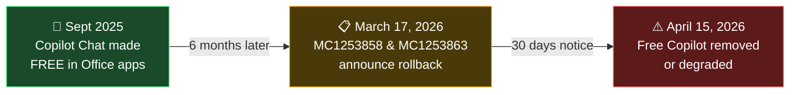
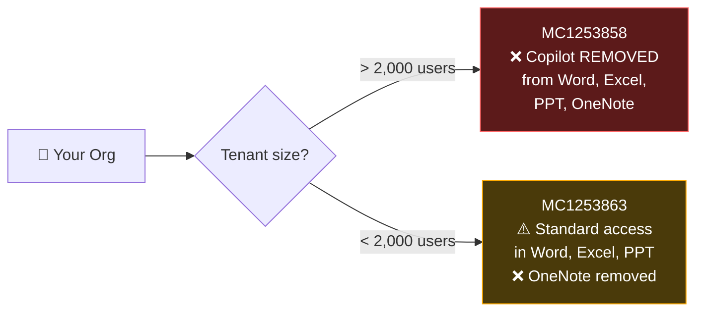
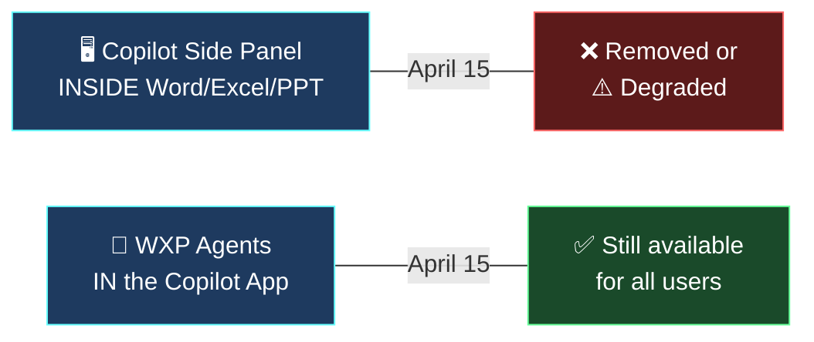
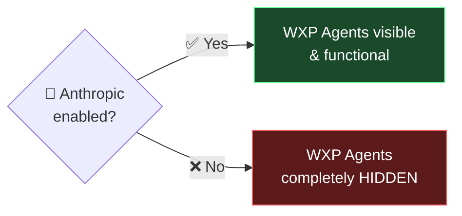
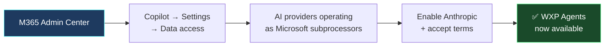

Microsoft is removing free Copilot Chat from Word, Excel, PowerPoint, and OneNote for millions of Microsoft 365 users on **April 15, 2026**. The changes were announced via Message Center posts [MC1253858](#mc1253858--organisations-with-more-than-2000-users) and [MC1253863](#mc1253863--organisations-with-fewer-than-2000-users) on March 17, 2026. Whether you're affected — and how severely — depends on your tenant size. This guide covers everything: what's changing, what stays, the WXP agent loophole most people don't know about, and the Anthropic Claude dependency that controls it all.

**Quick links:** [Who's affected?](#who-is-affected-and-how) · [Basic vs Premium labels](#new-labels-basic-vs-premium) · [WXP agents surprise](#the-wxp-agent-surprise-most-people-miss) · [Anthropic dependency](#the-anthropic-dependency-you-need-to-know-about) · [Pricing](#what-does-the-paid-copilot-licence-cost) · [Admin checklist](#what-should-you-do-now) · [FAQ](#frequently-asked-questions)

🆕 **Last-Minute Update — April 14, 2026**

Two clarifications as we approach go-live:

1. **Rollout may be gradual.** Based on Microsoft's standard Message Center rollout practices, the change may not apply to all tenants simultaneously on April 15. Organisations that received the MC notification later may see the change take effect on a different date. Check your [Message Center](https://admin.microsoft.com/#/MessageCenter) for your specific notification timing.

2. **Product positioning is now explicit.** Microsoft is drawing a clear line: **Copilot Chat = secure AI chat**. **Microsoft 365 Copilot = full orchestration across apps, data, and agents.** This separation is deliberate — ahead of the [Agent 365](https://www.microsoft.com/en-us/microsoft-365/copilot/agent-365) and Copilot Cowork launches in May.

### How We Got Here

## What's Happening on April 15, 2026?

Starting **April 15, 2026**, Microsoft is making significant changes to **Copilot Chat** for users without a paid [Microsoft 365 Copilot license](https://learn.microsoft.com/en-us/copilot/microsoft-365/microsoft-365-copilot-overview). The free in-app Copilot experience inside Word, Excel, PowerPoint, and OneNote is either being **removed** or **degraded**, depending on your organisation's size.

This is a reversal of the [September 2025 announcement](https://techcommunity.microsoft.com/blog/microsoft365copilotblog/what%E2%80%99s-new-in-microsoft-365-copilot--september-2025/4457317) where Microsoft made Copilot Chat available in Office apps for **all** Microsoft 365 users — even without a Copilot license. Six months later, that's being pulled back.

**Two Message Center posts** published on March 17, 2026, detail the changes:

- **MC1253858** — for organisations with **more than 2,000 users**
- **MC1253863** — for organisations with **fewer than 2,000 users**

> 💡 Check your [Microsoft 365 Admin Center → Message Center](https://admin.microsoft.com/#/MessageCenter) to see which message applies to you.

---

## Who Is Affected and How?

The impact depends entirely on your **tenant size**:

### MC1253858 — Organisations With More Than 2,000 Users

For unlicensed users, **Copilot is completely removed** from:

- ❌ Word
- ❌ Excel
- ❌ PowerPoint
- ❌ OneNote

The Copilot button, side panel, and all in-app Copilot experiences disappear. Only users with a paid [Microsoft 365 Copilot license](https://www.microsoft.com/en-us/microsoft-365/copilot) will retain the in-app experience.

### MC1253863 — Organisations With Fewer Than 2,000 Users

Unlicensed users **keep** Copilot Chat in Word, Excel, and PowerPoint, but under **"standard access"** — a new tier that means:

- ⚠️ Speed and quality **vary** based on service capacity
- ⚠️ During peak demand, the experience may be **degraded or slow**
- ⚠️ Licensed users get **priority** in the queue
- ⚠️ Users will see **upgrade prompts** encouraging them to buy a licence

OneNote access is **removed** for all tenant sizes, regardless of user count.

### What Stays for Everyone

Regardless of tenant size, unlicensed users **keep** access to:

- ✅ **[Copilot Chat on the web](https://m365.cloud.microsoft/chat)** — the standalone Copilot app
- ✅ **Copilot in Outlook** — inbox and calendar grounding
- ✅ **Copilot in Teams** — general AI chat
- ✅ **[Copilot Pages](https://support.microsoft.com/topic/36b51e84-26a5-4ad8-a5ef-e7d50a664f93)** — collaborative AI canvas
- ✅ **File upload** and analysis
- ✅ **Enterprise Data Protection** — your data doesn't train AI models

---

## New Labels: "Basic" vs "Premium"

Microsoft is introducing new labels to make the distinction clear:

| Tier | Label | What It Means |
|------|-------|---------------|
| Free (unlicensed) | **Copilot Chat (Basic)** | Web-grounded chat, no organisational data |
| Paid ($30/user/month) | **M365 Copilot (Premium)** | Full experience, Work Graph, Claude, agents |

These labels will appear in the Copilot UI across all apps, so users know which tier they're on.

> For the full comparison between tiers, see [Which Copilot is right for me?](https://learn.microsoft.com/en-us/copilot/which-copilot) on Microsoft Learn.

---

## The WXP Agent Surprise Most People Miss

Here's the part almost nobody is talking about — and it changes the narrative significantly.

### What Are WXP Agents?

**WXP Agents** are AI-driven creation agents for Word, Excel, and PowerPoint that live inside the [Microsoft 365 Copilot app](https://m365.cloud.microsoft/chat). You talk to them in chat, and they create entire documents, workbooks, or presentations for you — with multi-step reasoning and refinement.

They are **different** from the Copilot side panel inside Office apps:

### WXP Agents Stay for Both Tenant Sizes

Even after April 15, unlicensed users in **both** >2K and <2K tenants can still use WXP agents in the Copilot app:

| | Copilot **inside** Word/Excel/PPT | WXP Agents **in Copilot App** |
|---|:---:|:---:|
| >2,000 users (unlicensed) | ❌ Removed | ✅ Available |
| <2,000 users (unlicensed) | ⚠️ Standard access | ✅ Available |

So for a large enterprise user after April 15:

- ❌ Can't open Word and use the Copilot side panel
- ✅ **Can** open the Copilot app → talk to the Word Agent → get a full document created → saved to OneDrive

> For full details, see [Get started with Word, Excel, and PowerPoint Agents](https://learn.microsoft.com/en-us/copilot/microsoft-365/wordexcelppt-agents) on Microsoft Learn.

---

## The Anthropic Dependency You Need to Know About

Here's the critical technical detail: **WXP Agents are powered exclusively by Anthropic's Claude models** — not OpenAI GPT. From the [official Microsoft documentation](https://learn.microsoft.com/en-us/copilot/microsoft-365/wordexcelppt-agents):

> *"These agents exclusively use Anthropic's AI models. This AI model must be enabled. These requirements are mandatory for Word, Excel, and PowerPoint Agents to function."*

This means:

| Anthropic Setting | WXP Agents |
|:-:|:-:|
| ✅ Enabled at tenant level | ✅ Agents visible and functional |
| ❌ Disabled at tenant level | ❌ Agents **completely hidden** |

### Default State by Region

| Region | Anthropic Default | Action |
|--------|:---:|---|
| Commercial (non-EU) | ✅ **ON** by default | Opt out if you don't want it |
| EU/EFTA/UK | ❌ **OFF** by default | Must opt in |
| GCC / GCC High / DoD | ❌ **Not available** | No toggle |

If your admin has done nothing in a **non-EU commercial tenant**, Anthropic is already enabled — and WXP agents are already available.

If you're in the **EU, NZ/AU public sector, or other regulated environments**, Anthropic may be off — which means your users have no WXP agents, even if they have a paid Copilot licence.

### How to Enable Anthropic

1. Go to the [Microsoft 365 Admin Center](https://admin.microsoft.com)
2. Navigate to **Copilot → Settings → Data access**
3. Find **AI providers operating as Microsoft subprocessors**
4. Enable Anthropic and accept the updated terms

Only **Global Administrators** can make this change. For detailed steps, see [Anthropic as a subprocessor for Microsoft Online Services](https://learn.microsoft.com/en-us/microsoft-365/copilot/connect-to-ai-subprocessor).

### Data Protection

Use of Claude in Microsoft 365 Copilot is covered by Microsoft's [Data Protection Addendum (DPA)](https://www.microsoft.com/licensing/docs/view/Microsoft-Products-and-Services-Data-Protection-Addendum-DPA), [Enterprise Data Protection](https://learn.microsoft.com/en-us/copilot/microsoft-365/enterprise-data-protection), and the Customer Copyright Commitment.

⚠️ **Important:** Anthropic models are currently **excluded from the EU Data Boundary** and in-country processing commitments. This is critical for regulated industries.

---

## What Does the Paid Copilot Licence Cost?

| Plan | Tenant Size | Price | Commitment |
|------|-------------|-------|------------|
| M365 Copilot (Enterprise) | >300 users | **$30 USD/user/month** | Annual |
| M365 Copilot Business | <300 users | **$21 USD/user/month** | Annual |

Both are **add-on licenses** on top of an existing Microsoft 365 subscription. You don't have to license every user — consider starting with power users.

---

## What Should You Do Now?

### For IT Admins

- [ ] **Check your tenant size** — this determines which MC message applies
- [ ] **Check your [Anthropic setting](https://learn.microsoft.com/en-us/microsoft-365/copilot/connect-to-ai-subprocessor)** — is it enabled? Do you want it to be?
- [ ] **Review Copilot usage data** — M365 Admin Center → Reports → Usage
- [ ] **Communicate to end users before April 15** — explain what's changing
- [ ] **Decide on licensing** — buy for power users, or accept the downgrade?

### For End Users

- **If you lose in-app Copilot:** Use the [Copilot web app](https://m365.cloud.microsoft/chat) and the WXP agents — they still work
- **In Outlook:** Copilot Chat stays, no change needed
- **Want the full experience back?** Ask your admin about the paid Copilot licence

---

## Summary: Before and After April 15

| Feature | Before April 15 | After April 15 (Unlicensed) |
|---------|:---:|:---:|
| Copilot in Word/Excel/PPT (>2K) | ✅ | ❌ Removed |
| Copilot in Word/Excel/PPT (<2K) | ✅ | ⚠️ Standard access |
| Copilot in OneNote | ✅ | ❌ Removed (all sizes) |
| Copilot in Outlook | ✅ | ✅ No change |
| Copilot web app | ✅ | ✅ No change |
| WXP Agents in Copilot app | ✅ | ✅ No change (if Anthropic ON) |
| Copilot in Teams | ✅ | ✅ No change |

---

## Key Links

| Resource | Link |
|----------|------|
| Manage Microsoft 365 Copilot Chat | [learn.microsoft.com/copilot/manage](https://learn.microsoft.com/copilot/manage) |
| WXP Agents documentation | [learn.microsoft.com/.../wordexcelppt-agents](https://learn.microsoft.com/en-us/copilot/microsoft-365/wordexcelppt-agents) |
| Anthropic as a subprocessor | [learn.microsoft.com/.../connect-to-ai-subprocessor](https://learn.microsoft.com/en-us/microsoft-365/copilot/connect-to-ai-subprocessor) |
| Enterprise Data Protection | [learn.microsoft.com/.../enterprise-data-protection](https://learn.microsoft.com/en-us/copilot/microsoft-365/enterprise-data-protection) |
| Which Copilot is right for me? | [learn.microsoft.com/.../which-copilot](https://learn.microsoft.com/en-us/copilot/which-copilot) |
| Pin Copilot Chat settings | [learn.microsoft.com/.../pin-copilot](https://learn.microsoft.com/en-us/copilot/microsoft-365/pin-copilot) |
| MC1253858 (>2K users) | Check your M365 Admin Center → Message Center |
| MC1253863 (<2K users) | Check your M365 Admin Center → Message Center |

---

## Frequently Asked Questions

### Why is Microsoft removing free Copilot Chat from Office apps?

Only about 3% of Microsoft 365 customers pay for the Copilot add-on licence. Microsoft offered free Copilot Chat in September 2025, hoping users would get hooked and upgrade. That strategy didn't generate enough conversions to justify the AI infrastructure costs. Now Microsoft is tightening the gap between free and paid to drive licence adoption.

### What is MC1253858?

MC1253858 is a [Microsoft 365 Message Center](https://admin.microsoft.com/#/MessageCenter) post published on March 17, 2026, targeted at organisations with **more than 2,000 Microsoft 365 users**. It announces the complete removal of Copilot Chat from Word, Excel, PowerPoint, and OneNote for unlicensed users, effective April 15, 2026.

### What is MC1253863?

MC1253863 is a companion Message Center post for organisations with **fewer than 2,000 users**. Instead of full removal, it announces that Copilot Chat will remain in Word, Excel, and PowerPoint under "standard access" — meaning degraded performance during peak hours and upgrade prompts.

### What is the difference between Copilot Chat Basic and M365 Copilot Premium?

**Copilot Chat (Basic)** is the free tier for unlicensed users — web-grounded AI chat with no access to organisational data. **M365 Copilot (Premium)** is the paid tier ($30/user/month for enterprise, $21 for business) — full in-app Copilot with [Work Graph](https://learn.microsoft.com/en-us/graph/overview) grounding, Claude model access, execution agents, and priority performance.

### Can unlicensed users still use Copilot after April 15?

Yes — but in fewer places. Unlicensed users keep [Copilot Chat on the web](https://m365.cloud.microsoft/chat), Copilot in Outlook, Copilot in Teams, and the WXP agents in the Copilot app. What they lose (in large tenants) is the Copilot side panel **inside** Word, Excel, PowerPoint, and OneNote.

### What are WXP agents and do they still work for free users?

WXP agents are AI-driven creation agents for Word, Excel, and PowerPoint that live inside the [Microsoft 365 Copilot app](https://m365.cloud.microsoft/chat). They create entire documents from a single prompt. **Yes, they still work for free (unlicensed) users** in both large and small tenants — but only if [Anthropic is enabled](https://learn.microsoft.com/en-us/microsoft-365/copilot/connect-to-ai-subprocessor) at the tenant level.

### Why do WXP agents require Anthropic to be enabled?

WXP agents [exclusively use Anthropic's Claude AI models](https://learn.microsoft.com/en-us/copilot/microsoft-365/wordexcelppt-agents) — not OpenAI GPT. If your admin disables Anthropic as a subprocessor, the WXP agents are **completely hidden** from all users. This is a hard dependency, though Microsoft has confirmed a GPT-based version is being developed for the future.

### Is Anthropic Claude enabled by default?

In **non-EU commercial tenants**, yes — Anthropic has been enabled by default since January 7, 2026. In **EU/EFTA/UK tenants**, it's disabled by default and admins must [opt in manually](https://learn.microsoft.com/en-us/microsoft-365/copilot/connect-to-ai-subprocessor). In **government clouds** (GCC, GCC High, DoD), it's not available at all.

### Does Copilot in Outlook change on April 15?

No. Copilot Chat in Outlook remains available for **all** users — licensed and unlicensed, regardless of tenant size. It continues to provide inbox and calendar grounding.

### How much does a Microsoft 365 Copilot licence cost?

For enterprises (>300 users): **$30 USD per user per month**. For businesses (<300 users): **$21 USD per user per month**. Both require an annual commitment and are add-on licences on top of an existing Microsoft 365 subscription. See [Microsoft 365 Copilot pricing](https://www.microsoft.com/en-us/microsoft-365/copilot).

---

## Related Articles

- [Master All 6 Microsoft 365 Copilot Agents](/blog/master-all-6-microsoft-365-copilot-agents/)
- [Microsoft 365 Copilot March 2026 Updates](/blog/microsoft-365-copilot-march-2026-updates/)
- [Microsoft 365 Copilot February 2026 Updates](/blog/microsoft-365-copilot-february-2026-updates/)
- [Agent Builder in Microsoft 365 Copilot — Create AI Agents Without Code](/blog/agent-builder-microsoft-365-copilot-create-ai-agent/)
- [Learn Prompt Engineering with Practical Work-Life Prompts](/blog/learn-prompt-engineering-with-practical-work-life-prompts/)
- [20 Real-World Copilot in Word Use Cases](/blog/20-real-world-copilot-in-word-use-cases/)

---

> **Disclaimer:** The views and opinions expressed in this article are my own and do not represent the official positions of Microsoft. All pricing mentioned is in USD and was sourced from official Microsoft pricing pages at the time of writing — pricing, features, and availability are subject to change. Always refer to [official Microsoft documentation](https://learn.microsoft.com) for the most up-to-date information.

*Published: April 9, 2026 · Last updated: April 14, 2026 · Author: [Sutheesh](https://www.aguidetocloud.com/about/) · Sources: [Microsoft Learn](https://learn.microsoft.com/copilot/manage), [Microsoft 365 Message Center](https://admin.microsoft.com/#/MessageCenter), community analysis*
