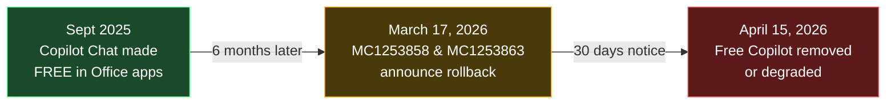
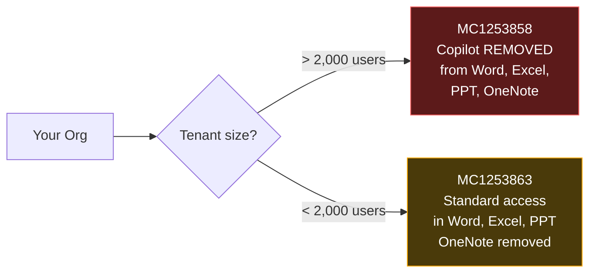
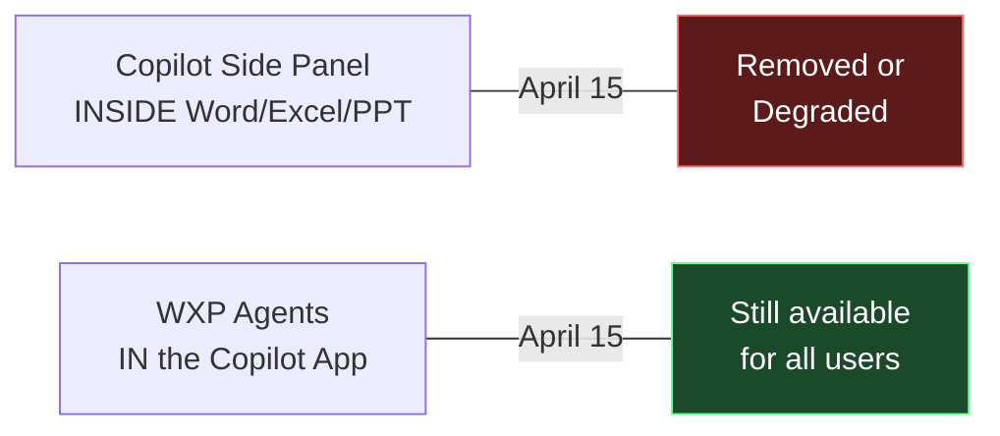
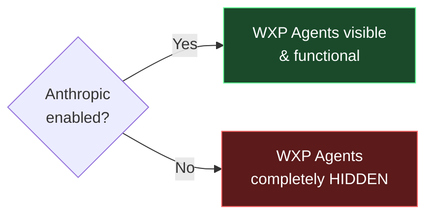

If you're an IT admin who gave users free Copilot Chat in Office apps last year and they loved it — I'm sorry, but you're about to have some awkward conversations. Microsoft is pulling it back on **April 15, 2026**.

The good news? It's not as bad as the headline sounds. There's a loophole most people don't know about (WXP agents), and whether your users even notice depends on how big your organisation is.

Here's the full picture — what's changing, what stays, what you should do before Monday morning.

**Quick links:** [Who's affected?](#who-is-affected-and-how) · [Basic vs Premium labels](#the-new-labels-basic-vs-premium) · [WXP agents surprise](#the-wxp-agent-surprise-most-people-miss) · [Anthropic dependency](#the-anthropic-dependency) · [Pricing](#what-does-a-copilot-licence-cost) · [Admin checklist](#what-should-you-do-now) · [FAQ](#frequently-asked-questions)

**Last-Minute Update — April 14, 2026**

Two things to know as we approach go-live:

1. **Rollout may be gradual.** Not every tenant will see the change on April 15 exactly. Microsoft's standard practice is to roll out based on when each tenant received the notification. Check your [Message Center](https://admin.microsoft.com/#/MessageCenter) for your specific timing.

2. **Microsoft is drawing a clear line.** Copilot Chat = secure AI chat. Microsoft 365 Copilot = full orchestration across apps, data, and agents. This is deliberate — ahead of the [Agent 365](https://www.microsoft.com/en-us/microsoft-365/copilot/agent-365) and Copilot Cowork launches in May.

### The Short Version of What Happened

Think of it like a free trial on your phone. Microsoft gave everyone free access to a premium app feature in September 2025, hoping people would get hooked and upgrade. Six months later, only about 3% of customers actually paid. So the free trial is ending.

---

## Who Is Affected and How?

This is the question I get asked most. The answer depends on one thing: **how many users are in your tenant**.

### Large Organisations (>2,000 users) — MC1253858

If you don't have a paid Copilot licence, the Copilot button **disappears** from:

- Word
- Excel
- PowerPoint
- OneNote

Gone. No side panel, no in-app Copilot, nothing. Only paid users keep the experience.

### Smaller Organisations (<2,000 users) — MC1253863

You get a softer landing. Copilot **stays** in Word, Excel, and PowerPoint — but under "standard access." Here's what that actually means:

- Speed and quality **depend on available capacity**
- During busy times, your experience **slows down**
- Paid users get **priority in the queue**
- You'll see **upgrade prompts** encouraging you to buy a licence

OneNote Copilot is removed for everyone, regardless of size.

### What Stays for Everyone

Here's what doesn't change — and this is important to communicate to your users:

- **[Copilot Chat on the web](https://m365.cloud.microsoft/chat)** — the standalone Copilot app
- **Copilot in Outlook** — inbox and calendar help
- **Copilot in Teams** — AI chat in Teams
- **[Copilot Pages](https://support.microsoft.com/topic/36b51e84-26a5-4ad8-a5ef-e7d50a664f93)** — collaborative AI canvas
- **File upload** and analysis
- **Enterprise Data Protection** — your data doesn't train AI models

---

## The New Labels: "Basic" vs "Premium"

Microsoft is making the free vs paid distinction visible in the UI:

| Tier | Label | What It Means |
|------|-------|---------------|
| Free (unlicensed) | **Copilot Chat (Basic)** | Web-grounded chat, no organisational data |
| Paid ($30/user/month) | **M365 Copilot (Premium)** | Full experience, Work Graph, Claude, agents |

Your users will start seeing these labels across all apps. No more confusion about which version they're using.

> 📚 **Full comparison:** [Which Copilot is right for me?](https://learn.microsoft.com/en-us/copilot/which-copilot) on Microsoft Learn

---

## The WXP Agent Surprise Most People Miss

Here's the part that changes the whole story — and almost nobody is talking about it.

### What Are WXP Agents?

WXP Agents are AI agents for Word, Excel, and PowerPoint that live inside the [Copilot app](https://m365.cloud.microsoft/chat). You talk to them in chat, and they create entire documents, workbooks, or presentations for you.

The key thing: **they're not the same as the Copilot side panel inside Office apps.**

Think of it this way — it's like losing the in-store assistant at a shop, but you still have the personal shopper who delivers to your door. Different experience, but you still get what you need.

### They Stay for Both Tenant Sizes

Even after April 15, unlicensed users in **both** large and small tenants can still use WXP agents:

| | Copilot **inside** Word/Excel/PPT | WXP Agents **in Copilot App** |
|---|:---:|:---:|
| >2,000 users (unlicensed) | Removed | Available |
| <2,000 users (unlicensed) | Standard access | Available |

So a user in a large enterprise who loses the Word side panel can still open the Copilot app, talk to the Word Agent, and get a full document created and saved to OneDrive.

> 📚 **How to use them:** [Get started with Word, Excel, and PowerPoint Agents](https://learn.microsoft.com/en-us/copilot/microsoft-365/wordexcelppt-agents)

---

## The Anthropic Dependency

Here's the catch with WXP agents — and this is the part that trips people up. **They run exclusively on Anthropic's Claude models**, not OpenAI GPT.

From the [official documentation](https://learn.microsoft.com/en-us/copilot/microsoft-365/wordexcelppt-agents):

> *"These agents exclusively use Anthropic's AI models. This AI model must be enabled."*

If your admin has disabled Anthropic as a subprocessor, the WXP agents are **completely hidden**. Your users won't even know they exist.

### Default Settings by Region

This is the part you need to check RIGHT NOW:

| Region | Anthropic Default | What to Do |
|--------|:---:|---|
| Commercial (non-EU) | **ON** by default | Opt out if you don't want it |
| EU/EFTA/UK | **OFF** by default | Must opt in manually |
| GCC / GCC High / DoD | **Not available** | No option |

If you're in a non-EU commercial tenant and haven't touched this setting — Anthropic is already on and WXP agents are working. If you're in the EU, NZ/AU public sector, or a regulated environment, you might need to turn it on.

### How to Enable It

1. Go to the [Microsoft 365 Admin Center](https://admin.microsoft.com)
2. Navigate to **Copilot → Settings → Data access**
3. Find **AI providers operating as Microsoft subprocessors**
4. Enable Anthropic and accept the updated terms

Only **Global Administrators** can do this. Full steps: [Anthropic as a subprocessor](https://learn.microsoft.com/en-us/microsoft-365/copilot/connect-to-ai-subprocessor)

### A Note on Data Protection

Anthropic in Copilot is covered by Microsoft's [Data Protection Addendum](https://www.microsoft.com/licensing/docs/view/Microsoft-Products-and-Services-Data-Protection-Addendum-DPA), Enterprise Data Protection, and the Customer Copyright Commitment.

> ⚠️ **But** — Anthropic models are currently excluded from the **EU Data Boundary** and in-country processing commitments. If you're in a regulated industry, this matters for your compliance assessment.

---

## What Does a Copilot Licence Cost?

| Plan | Who It's For | Price | Commitment |
|------|-------------|-------|------------|
| M365 Copilot (Enterprise) | >300 users | **$30 USD/user/month** | Annual |
| M365 Copilot (Business) | <300 users | **$21 USD/user/month** | Annual |

Both are add-on licences on top of your existing Microsoft 365 subscription. You don't have to licence everyone — start with your power users and expand from there.

> 💡 **Want to build a business case?** Try our [Copilot ROI Calculator](/roi-calculator/) to estimate savings by role.

---

## What Should You Do Now?

### If You're an IT Admin

Here's my checklist — in order of priority:

- [ ] **Check your tenant size** — this determines which MC message applies to you
- [ ] **Check your [Anthropic setting](https://learn.microsoft.com/en-us/microsoft-365/copilot/connect-to-ai-subprocessor)** — is it enabled? Should it be?
- [ ] **Review Copilot usage** — Admin Center → Reports → Usage (see who's actually using it)
- [ ] **Communicate to users before April 15** — don't let them discover it by surprise
- [ ] **Decide on licensing** — buy for power users, accept the downgrade, or both?
- [ ] **Check your [Copilot Readiness score](/copilot-readiness/)** — are your permissions and labels in order?

### If You're an End User

- **Lost the Copilot side panel?** Use the [Copilot web app](https://m365.cloud.microsoft/chat) and WXP agents instead
- **Outlook and Teams?** No change. Copilot still works there
- **Want the full experience?** Ask your IT admin about the paid licence

---

## Summary: Before and After April 15

| Feature | Before April 15 | After April 15 (Unlicensed) |
|---------|:---:|:---:|
| Copilot in Word/Excel/PPT (>2K) | ✅ | Removed |
| Copilot in Word/Excel/PPT (<2K) | ✅ | Standard access |
| Copilot in OneNote | ✅ | Removed (all sizes) |
| Copilot in Outlook | ✅ | No change |
| Copilot web app | ✅ | No change |
| WXP Agents in Copilot app | ✅ | No change (if Anthropic ON) |
| Copilot in Teams | ✅ | No change |

---

## Key Links

| Resource | Link |
|----------|------|
| Manage Microsoft 365 Copilot Chat | [learn.microsoft.com/copilot/manage](https://learn.microsoft.com/copilot/manage) |
| WXP Agents documentation | [learn.microsoft.com/.../wordexcelppt-agents](https://learn.microsoft.com/en-us/copilot/microsoft-365/wordexcelppt-agents) |
| Anthropic as a subprocessor | [learn.microsoft.com/.../connect-to-ai-subprocessor](https://learn.microsoft.com/en-us/microsoft-365/copilot/connect-to-ai-subprocessor) |
| Enterprise Data Protection | [learn.microsoft.com/.../enterprise-data-protection](https://learn.microsoft.com/en-us/copilot/microsoft-365/enterprise-data-protection) |
| Which Copilot is right for me? | [learn.microsoft.com/.../which-copilot](https://learn.microsoft.com/en-us/copilot/which-copilot) |
| Copilot pricing | [microsoft.com/.../copilot](https://www.microsoft.com/en-us/microsoft-365/copilot) |

---

## Frequently Asked Questions

### Why is Microsoft removing free Copilot Chat from Office apps?

About 3% of Microsoft 365 customers actually pay for the Copilot add-on licence. Microsoft gave everyone free access in September 2025, hoping the experience would sell itself. It didn't generate enough upgrades to justify the AI infrastructure costs, so they're pulling back the free tier to create a clearer value gap between free and paid.

### What is MC1253858?

It's a [Message Center](https://admin.microsoft.com/#/MessageCenter) post published March 17, 2026, for organisations with **more than 2,000 users**. It announces complete removal of Copilot Chat from Word, Excel, PowerPoint, and OneNote for unlicensed users.

### What is MC1253863?

The companion post for organisations with **fewer than 2,000 users**. Instead of full removal, Copilot stays in Word, Excel, and PowerPoint under "standard access" — meaning slower performance during peak hours and upgrade prompts.

### What's the difference between Copilot Chat Basic and M365 Copilot Premium?

**Basic** is free — web-grounded AI chat, no access to your organisational data. **Premium** is $30/user/month (enterprise) or $21 (business) — full in-app Copilot with [Work Graph](https://learn.microsoft.com/en-us/graph/overview) grounding, Claude model access, execution agents, and priority performance.

### Can unlicensed users still use Copilot after April 15?

Yes — just in fewer places. You keep [Copilot Chat on the web](https://m365.cloud.microsoft/chat), Copilot in Outlook, Copilot in Teams, and WXP agents. What goes away (in large tenants) is the Copilot side panel inside Word, Excel, PowerPoint, and OneNote.

### What are WXP agents?

AI agents for Word, Excel, and PowerPoint that live in the [Copilot app](https://m365.cloud.microsoft/chat). They create full documents from a chat prompt. **Yes, they work for free users** — but only if [Anthropic is enabled](https://learn.microsoft.com/en-us/microsoft-365/copilot/connect-to-ai-subprocessor).

### Why do WXP agents need Anthropic?

They [exclusively use Claude](https://learn.microsoft.com/en-us/copilot/microsoft-365/wordexcelppt-agents), not GPT. If Anthropic is disabled, the agents are completely hidden. Microsoft is developing a GPT-based version, but it's not available yet.

### Is Anthropic Claude enabled by default?

Non-EU commercial tenants: **yes** (since January 7, 2026). EU/EFTA/UK: **no** — admins must [opt in](https://learn.microsoft.com/en-us/microsoft-365/copilot/connect-to-ai-subprocessor). Government clouds: not available.

### Does Copilot in Outlook change?

No. Copilot in Outlook stays for everyone — licensed and unlicensed, all tenant sizes.

### How much does a licence cost?

Enterprise (>300 users): **$30/user/month**. Business (<300 users): **$21/user/month**. Annual commitment, add-on licence. See [pricing](https://www.microsoft.com/en-us/microsoft-365/copilot).

---

## Related Articles

- [Master All 6 Microsoft 365 Copilot Agents](/blog/master-all-6-microsoft-365-copilot-agents/)
- [Microsoft 365 Copilot March 2026 Updates](/blog/microsoft-365-copilot-march-2026-updates/)
- [Microsoft 365 Copilot Content Safety Controls for IT Admins](/blog/microsoft-365-copilot-content-safety-controls-complete-guide-for-admins/)
- [Agent Builder in Microsoft 365 Copilot — Create AI Agents Without Code](/blog/agent-builder-microsoft-365-copilot-create-ai-agent/)
- [Learn Prompt Engineering with Practical Work-Life Prompts](/blog/learn-prompt-engineering-with-practical-work-life-prompts/)

---

> **Disclaimer:** The views and opinions expressed in this article are my own and do not represent the official positions of Microsoft. All pricing mentioned is in USD and was sourced from official Microsoft pricing pages at the time of writing — pricing, features, and availability are subject to change. Always refer to [official Microsoft documentation](https://learn.microsoft.com) for the most up-to-date information.
