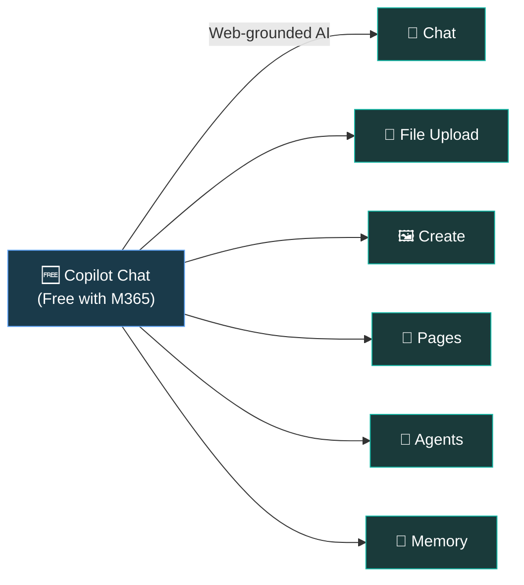
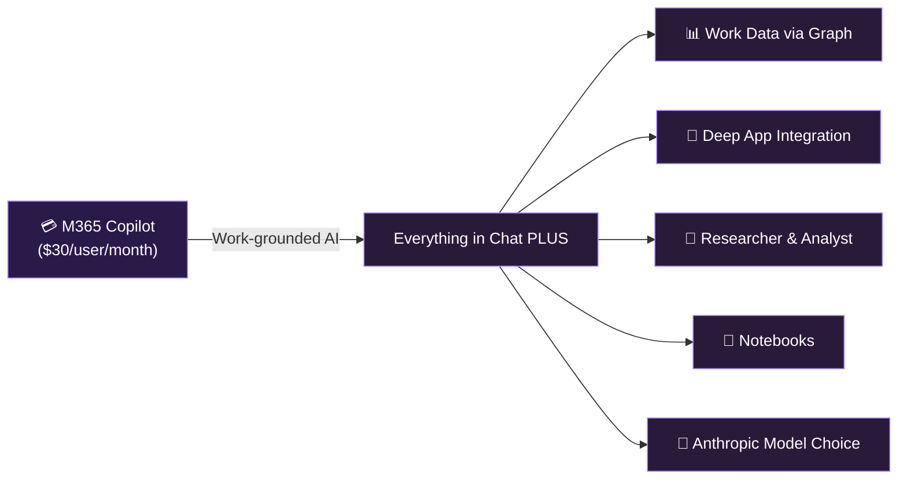
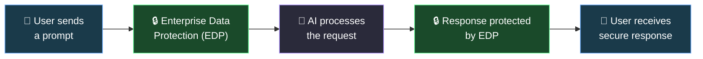
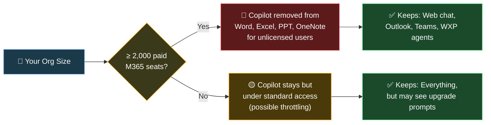
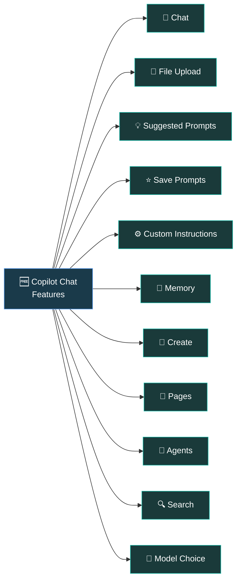
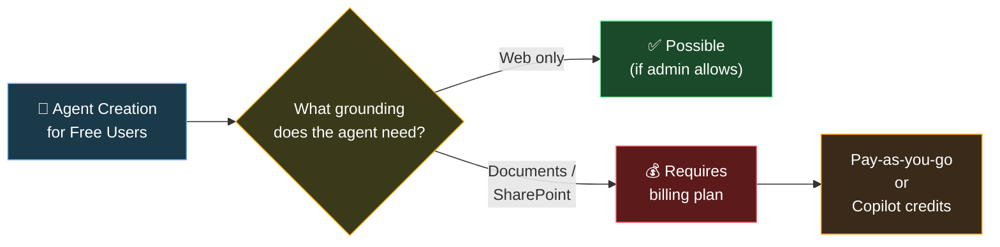

If you're training people on Copilot Chat tomorrow and you're wondering "what exactly am I teaching?" — this guide is for you.

I wrote this for **AI Change Leads**, **Digital Champions**, and anyone running a **Train-the-Trainer** session. It covers everything about **Copilot Chat** (the free tier included with your Microsoft 365 subscription) — not just what buttons to click, but how to explain the value, handle the tough questions, and actually get people excited about using it.

> 📖 **Looking for the paid Copilot guide?** See our [Microsoft 365 Copilot (Licensed) — Complete Trainer Guide](/blog/microsoft-365-copilot-licensed-complete-guide-for-trainers/) for everything about the full $30/month experience.

> 📋 **How to use this guide:** Bookmark it. Share it with your training team. Each section is self-contained — jump to what you need.

This is a living document. The AI landscape changes fast — features get added, renamed, or retired. Bookmark this page rather than printing it, so you always have the latest version. If you spot something outdated, please [let me know](/feedback/) and I'll update it.

### Table of Contents

- [What Is Microsoft 365 Copilot Chat?](#what-is-microsoft-365-copilot-chat)
- [Security & Enterprise Data Protection](#security--enterprise-data-protection)
- [⚠️ Upcoming Changes (April 15, 2026)](#-upcoming-changes-april-15-2026)
- **Deep Dive: Copilot Chat Features**
  - [1. The Chat Experience](#1-the-copilot-chat-experience)
  - [2. Upload Documents](#2-upload-documents-for-better-answers)
  - [3. Suggested Prompts & Adaptive Cards](#3-suggested-prompts--adaptive-cards)
  - [4. Save Your Favourite Prompts](#4-save-your-favourite-prompts)
  - [5. Custom Instructions](#5-custom-instructions)
  - [6. Memory](#6-memory)
  - [7. Create — Images, Videos & More](#7-create--images-videos--more)
  - [8. Copilot Pages](#8-copilot-pages--collaborative-ai-canvas)
  - [9. Chat History & Search](#9-chat-history--search)
  - [10. Agents](#10-agents)
  - [11. Model Choice](#11-model-choice)
- [Copilot Chat Inside M365 Apps](#copilot-chat-inside-microsoft-365-apps)
- [🎯 Training Tomorrow? Start Here](#-training-tomorrow-start-here)
- [Positioning for Different Audiences](#positioning-copilot-chat--for-ai-change-leads)
- [Official Microsoft Resources](#official-microsoft-resources)
- [Tools to Help Your Journey](#tools-i-built-to-help-your-copilot-journey)
- [FAQ](#frequently-asked-questions)

---

## 🎯 Training Tomorrow? Start Here

If you're short on time and need to run a Copilot Chat training session soon, here's your quick-start guide.

### 30-Minute Session Agenda

| Time | Activity | Notes |
|:--|:--|:--|
| **0-5 min** | What is Copilot Chat? + Security/EDP | Build trust first — show the green shield 🛡️ |
| **5-10 min** | Live demo: Chat + File Upload | Ask a question, then upload a document and ask about it |
| **10-15 min** | Live demo: Copilot Pages | Create a page from a chat response, show collaboration |
| **15-20 min** | Prompting tips + Custom Instructions | Teach CRAFT framework, set up custom instructions together |
| **20-25 min** | Agents + Create | Show Prompt Coach agent, generate an image |
| **25-30 min** | Q&A + Resources | Share this blog link, encourage bookmarking |

### Top 3 Demos That Always Land

1. **Upload a document → Ask Copilot to summarise it** — instant "wow" moment
2. **Create a Page from a response → Share with a colleague** — shows collaboration value
3. **Set up Custom Instructions → See the difference** — personalisation clicks immediately

### Pre-Session Checklist

- ✅ Confirm Copilot Chat is pinned for your users (ask IT)
- ✅ Check if your org is >2,000 or <2,000 seats (affects in-app availability)
- ✅ Prepare a sample document to upload during the demo
- ✅ Test Copilot Chat yourself — make sure it works in your tenant
- ✅ Check if agents are visible (admin may have disabled)
- ✅ Check if Anthropic is enabled (affects WXP agents)

### What Might Not Show Up (and What to Say)

| Feature | Why It Might Be Missing | What to Tell Users |
|:--|:--|:--|
| **Memory** | Preview feature — admin may not have enabled Enhanced Personalisation | *"This is rolling out gradually. Ask your IT team about the timeline."* |
| **Agents** | Admin controls who can see/create agents | *"Your IT team manages which agents are available. Check with them."* |
| **Copilot in Word/Excel/PPT** | Org has >2,000 seats (removed April 15) | *"In our org, Copilot Chat is available through the web app, Teams, and Outlook."* |
| **WXP Agents** | Anthropic not enabled in tenant | *"These agents require a specific setting. We're working with IT on it."* |

---

## What Is Microsoft 365 Copilot Chat?

**Microsoft 365 Copilot Chat** is a **free**, **secure** AI assistant included with every Microsoft 365 subscription. Think of it as your organisation's approved AI chat — protected by enterprise-grade security, available to every user, and completely free.

### The Two Tiers at a Glance

| Capability | 🆓 Copilot Chat (Free) | 💳 M365 Copilot (Paid) |
|:--|:--|:--|
| **Price** | Included with M365 subscription | $30/user/month (Enterprise) |
| **AI Chat** | ✅ Web-grounded | ✅ Web + Work data grounded |
| **File Upload** | ✅ Standard access | ✅ Priority access |
| **Image Generation** | ✅ Standard access | ✅ Priority access + branding |
| **Copilot Pages** | ✅ | ✅ |
| **Agents** | ✅ Metered / pay-as-you-go | ✅ Full access included |
| **Notebooks** | ❌ | ✅ |
| **Create (Designer)** | ✅ Templates | ✅ AI + templates + branding |
| **Work Data (Graph)** | ❌ Not in chat | ✅ Emails, files, meetings, chats |
| **In-App Copilot** | ⚠️ Depends on tenant size | ✅ Full integration everywhere |
| **Researcher & Analyst** | ❌ | ✅ |
| **Search** | ✅ Web search | ✅ AI-powered org + web search |
| **Enterprise Data Protection** | ✅ | ✅ |
| **Model Choice** | ✅ Standard access | ✅ Priority access |

💡 **Trainer tip:** Position Copilot Chat as **"your organisation's approved AI"** — it replaces the need for users to go to consumer AI tools like ChatGPT, Google Gemini, or Claude. Same AI power, but with enterprise security built in. This is the Shadow AI story.

> 🔧 **Want a deeper side-by-side comparison?** Use our interactive [Copilot Feature Matrix](/copilot-matrix/) to explore every feature across all Copilot tiers.

---

## Security & Enterprise Data Protection

This is the section that matters most when you're standing in front of a room of sceptical users. Before you teach them a single feature, they need to trust the tool. And the #1 question they'll ask is: **"Is my data safe?"**

Here's how to answer that confidently.

### What Is Enterprise Data Protection?

Think of it like your phone's encryption — it protects everything automatically, you don't have to turn it on. Enterprise Data Protection means Copilot Chat is covered by the **same security commitments** that protect your emails in Exchange and your files in SharePoint. Every user signed in with a work account gets this automatically.

### The Five EDP Promises

| # | Promise | What It Means in Plain English |
|:--|:--|:--|
| **1** | **Your data is secured** | Encrypted at rest and in transit. Physical security controls. Data isolation between tenants. |
| **2** | **Your data is private** | Microsoft won't use your data except as you instruct. Supports GDPR, EU Data Boundary, ISO 27018. |
| **3** | **Your policies apply** | Copilot respects your identity model, permissions, sensitivity labels, retention policies, and audit settings. |
| **4** | **Protected against AI risks** | Safeguards against harmful content, prompt injection attacks, and copyright risks. Microsoft's Customer Copyright Commitment applies. |
| **5** | **Never trains the model** | Your prompts and responses are **never** used to train foundation models. Period. |

### How to Explain Security to Your Users

🗣️ **Say this to your users:**

*"When you see the green shield 🛡️ in Copilot Chat, it means your conversation is protected by the same enterprise security that protects your emails and files. Your data is covered by Microsoft's enterprise terms — it's not used to train AI models, and the same compliance controls your IT team already trusts apply automatically."*

### What About Sharing Data with OpenAI?

A common question your users will ask. The answer is clear:

- ❌ **No data is shared with OpenAI**
- ❌ **No data is used to train OpenAI models**
- ✅ Microsoft uses OpenAI models through **Azure OpenAI Service** — Microsoft controls the infrastructure

> 📖 **Official reference:** [Enterprise Data Protection in Microsoft 365 Copilot and Copilot Chat](https://learn.microsoft.com/en-us/microsoft-365/copilot/enterprise-data-protection)

> 📖 **Privacy & Protections:** [Privacy and protections in Copilot Chat](https://learn.microsoft.com/en-us/copilot/privacy-and-protections)

---

## Upcoming Changes (April 15, 2026)

If you're training people this month, you need to know about this — because your trainees will ask.

Microsoft is pulling back free Copilot Chat from some Office apps on April 15. What happens depends on your organisation's size. Know which category you fall into before you step into the training room.

> 📖 **Full details:** [Copilot Chat Changes April 15 — What Every IT Admin Needs to Know](/blog/microsoft-365-copilot-chat-april-2026-changes-what-admins-need-to-know/)

### What Changes by Organisation Size

| What | 🏢 Large Org (≥ 2,000 seats) | 🏪 Smaller Org (< 2,000 seats) |
|:--|:--|:--|
| **Copilot in Word** | ❌ Removed for unlicensed users | ⚠️ Standard access (may throttle) |
| **Copilot in Excel** | ❌ Removed | ⚠️ Standard access |
| **Copilot in PowerPoint** | ❌ Removed | ⚠️ Standard access |
| **Copilot in OneNote** | ❌ Removed | ⚠️ Standard access |
| **Copilot in Outlook** | ✅ Stays | ✅ Stays |
| **Copilot Chat (web/app)** | ✅ Stays | ✅ Stays |
| **Copilot in Teams** | ✅ Stays | ✅ Stays |
| **WXP Agents** | ✅ Stays (if Anthropic enabled) | ✅ Stays |

> ⚠️ **Important for trainers:** The 2,000-seat count includes **paid M365 E/B/G/O seats** and **any Academic (A) SKU**. Frontline (F) licences are **not** counted. If **any** tenant in your customer's TPID has ≥ 2,000 seats, all tenants for that customer are affected.

### How to Position This to Your Users

For large organisations, frame it as:

🗣️ **Say this to your users:**

*"Copilot Chat continues to be your go-to secure AI assistant. You'll access it through the Copilot app, Teams, and Outlook. For AI features directly inside Word, Excel, and PowerPoint — like drafting documents or analysing data inside the app — that's where the full Microsoft 365 Copilot licence comes in."*

---

## Deep Dive: Copilot Chat Features

Now let's get into the features your users can use **today**. Even as a free tool, Copilot Chat is surprisingly powerful. Here's how to teach each feature effectively.

---

### 1. The Copilot Chat Experience

Copilot Chat is available at [m365copilot.com](https://m365copilot.com), in the Microsoft 365 Copilot app, in Teams, Outlook, and Microsoft Edge.

When users sign in with their work account, they'll see the **green shield 🛡️** — confirming Enterprise Data Protection is active.

#### Where Can Users Access Copilot Chat?

| Platform | How to Access |
|:--|:--|
| **Web** | [m365copilot.com](https://m365copilot.com) or [m365.cloud.microsoft/chat](https://m365.cloud.microsoft/chat) |
| **Microsoft 365 App** | Desktop app (Windows/Mac) or mobile (iOS/Android) |
| **Teams** | Built-in Chat experience |
| **Outlook** | Side pane and full chat |
| **Edge Browser** | Copilot side pane |
| **Word, Excel, PPT** | Side pane (availability depends on tenant size — see [changes above](#-upcoming-changes-april-15-2026)) |

### Prompting Matters — A Lot

The single biggest factor in getting value from Copilot Chat is **the quality of the prompt**. As a trainer, this is your highest-impact teaching moment.

**The CRAFT Framework for Better Prompts:**

| Element | What to Include | Example |
|:--|:--|:--|
| **C**ontext | Background information | *"I'm preparing for a quarterly business review..."* |
| **R**ole | Who Copilot should act as | *"Act as a business analyst..."* |
| **A**ction | What you want done | *"Summarise the key trends..."* |
| **F**ormat | How you want the output | *"Present as a table with bullet points..."* |
| **T**one | The communication style | *"Keep it professional but concise..."* |

**Example — Before and After:**

| ❌ Weak Prompt | ✅ Strong Prompt |
|:--|:--|
| "Write me an email" | "Act as a project manager. Draft a professional email to my team summarising the key decisions from our last sprint review. Use bullet points for action items and keep the tone collaborative." |
| "Help with Excel" | "I have a sales dataset with columns for Region, Product, and Revenue. Create a formula to calculate the total revenue by region, and suggest a chart type to visualise the comparison." |

> 🔧 **Level up your prompting:** Explore our [AI Prompt Library](/prompts/) with 84 ready-to-use prompts across 8 platforms, or try our interactive [Prompt Polisher](/prompt-polisher/) to score and improve any prompt instantly. For a hands-on learning experience, work through our [Prompt Engineering Guide](/prompt-guide/) — 8 techniques with practice sandboxes.

---

### 2. Upload Documents for Better Answers

One of the most powerful features in Copilot Chat is the ability to **upload documents** directly into the conversation. This gives Copilot additional context to provide grounded, accurate responses based on your actual work documents.

#### How It Works

- Click the **"+"** button in the chat input
- Select a file from your device, OneDrive, or SharePoint
- Or type **"/"** and select a file from the ContextIQ menu
- Copilot reads the document and uses it to ground its response

#### What You Can Upload

- Word documents (.docx)
- PDFs
- PowerPoint presentations (.pptx)
- Excel spreadsheets (.xlsx)
- Text files

#### You Can Upload Multiple Files

Need Copilot to compare two documents or synthesise information from several sources? Upload multiple files in the same conversation for richer, more contextual answers.

#### Practical Examples for Training

| Scenario | Prompt to Try |
|:--|:--|
| **Summarise a report** | *Upload a business report →* "Summarise the key findings from this report in 5 bullet points. Highlight any risks mentioned." |
| **Compare documents** | *Upload two policy drafts →* "Compare these two documents and list the key differences in a table." |
| **Extract data** | *Upload a spreadsheet →* "What are the top 5 products by revenue in this data? Present as a ranked table." |
| **Prepare for a meeting** | *Upload meeting agenda →* "Based on this agenda, draft 3 discussion questions for each topic that would help drive productive conversation." |
| **Simplify complex content** | *Upload a technical document →* "Explain the key concepts from this document in plain English, suitable for a non-technical audience." |

💡 **Trainer tip:** This is the feature that makes Copilot Chat genuinely useful for knowledge workers — even without the paid licence. They can get AI-powered analysis of their own documents, securely and privately.

---

### 3. Suggested Prompts & Adaptive Cards

When users first open Copilot Chat, they'll see **suggested prompts** in the centre of the interface. These aren't random — they're contextual adaptive cards designed to help new users get started quickly.

#### Why This Matters for Trainers

- **Reduces the blank-page problem** — users don't have to think of a prompt from scratch
- **Builds confidence** — clicking a pre-built prompt shows users what's possible
- **Personalised** — for licensed users, suggestions include relevant files, people, and meetings

#### How to Use Them in Training

Walk your users through clicking a suggested prompt. Show them how the prompt auto-populates in the input box, and how they can **modify it** before sending. This teaches them the pattern: *"Start with a suggestion → customise → send."*

---

### 4. Save Your Favourite Prompts

Found a prompt that works brilliantly? **Save it.** Copilot Chat lets users bookmark their favourite prompts so they can quickly reuse them later.

#### How to Save a Prompt

- After sending a prompt that works well, look for the **save/bookmark** option
- Saved prompts appear in your prompt collection for quick access
- You can organise and manage your saved prompts from the settings

#### Why This Is Valuable

- **Consistency** — use the same proven prompt structure every time
- **Time-saving** — no retyping complex prompts
- **Knowledge sharing** — trainers can create a library of recommended prompts and share them with the team

💡 **Trainer tip:** Create a team "prompt playbook" — a shared document with your best prompts, categorised by task type. Users can copy-paste from this until they're confident writing their own.

---

### 5. Custom Instructions

Custom instructions let users tell Copilot **how they want all responses to behave** — their role, preferred tone, formatting style, language, and other preferences. This is set once and applies to every conversation.

#### Where to Set Custom Instructions

**Settings → Personalisation → Custom Instructions**

#### Example Custom Instructions

| Instruction | What It Does |
|:--|:--|
| *"I'm a project manager in a healthcare organisation. Always consider compliance and patient privacy in your suggestions."* | Tailors responses to the user's industry context |
| *"I prefer concise bullet points over long paragraphs. Use plain English and avoid jargon."* | Controls the output format and language |
| *"When I ask about data analysis, assume I'm working with Excel unless I say otherwise."* | Sets default tool assumptions |
| *"Always include source references when providing factual information."* | Improves response credibility |

#### Why Custom Instructions Are a Game-Changer

- ⏱️ **Saves time** — no need to repeat context in every chat
- 🎯 **Better relevance** — Copilot understands your role and needs upfront
- 📏 **Consistent quality** — every response follows your preferred style

💡 **Trainer tip:** In your training session, guide every user through setting up their custom instructions. It takes 2 minutes and transforms their entire Copilot experience. This is one of the highest-value, lowest-effort configuration changes.

---

### 6. Memory

Copilot Memory allows Copilot to **remember key facts about you** across conversations — your projects, preferences, working patterns, and context. Unlike custom instructions (which you set manually), memory is built over time as you chat.

#### How Memory Works

- Copilot observes patterns in your conversations and automatically stores relevant details
- For example, if you frequently discuss "Project Atlas," Copilot will remember it
- Memory persists across sessions — you don't need to re-explain context every time

#### Managing Your Memory

- **View your memories:** Go to **Settings → Memory** to see what Copilot has remembered
- **Delete specific memories:** Remove individual items you don't want Copilot to retain
- **Clear all memory:** Reset everything if you want a fresh start

#### Where Is Memory Stored?

Memory data is stored securely in your **Exchange mailbox** (in a hidden folder), meaning it inherits the same security, compliance, and retention policies as your email. Your admin can manage memory settings at the tenant level.

> ⚠️ **Admin note:** Memory requires the **Enhanced Personalisation** control to be enabled at the admin level. If your admin disables it, Copilot won't apply memories but won't delete existing ones. Memory is currently in **preview** — availability varies by tenant, and your users may not see it yet. If it's not available, let users know it's coming and move on to other features.

---

### 7. Create — Images, Videos & More

The **Create** section in the Copilot app lets users generate visual content using AI and templates.

#### What Free Users Can Create

| Content Type | Available? | Notes |
|:--|:--|:--|
| **Images** | ✅ | Generate images from natural language descriptions |
| **Posters & Banners** | ✅ | Using templates |
| **Videos** | ✅ | Using templates |
| **Infographics** | ✅ | Using templates |
| **Brand kit integration** | ❌ | Paid Copilot licence only |

#### Image Generation

Users can create custom images using natural language — describe what you want, and Copilot generates it using Microsoft Designer. Available on desktop and mobile.

- Create images in **multiple aspect ratios** (landscape, portrait, square)
- Use **reference image uploads** as creative foundations for new visuals
- Great for presentations, social media, brainstorming, and visualising ideas

> 💡 **For the paid licence:** Create unlocks **AI-powered creation** (not just templates) plus **brand kit** integration — users can generate content that automatically uses your organisation's approved logos, colours, and fonts.

---

### 8. Copilot Pages — Collaborative AI Canvas

Copilot Pages is one of the most underrated features in Copilot Chat. It turns any AI response into a **persistent, shareable, and collaboratively editable** document.

#### How Pages Work

1. **Start a chat** — ask Copilot anything
2. **Create a Page** — click the "Create a page" button on any response you want to keep
3. **Edit together** — share the page with colleagues. Multiple people can edit simultaneously
4. **Add more AI content** — keep chatting with Copilot directly on the page to refine and expand
5. **Export** — download the page as a Word document or PDF

#### Why Pages Are Powerful

- 🤝 **Real-time collaboration** — like a shared Google Doc, but AI-powered
- 📌 **Persistent** — unlike chat, pages stick around and can be found later
- 🔄 **Iterative** — refine content with Copilot on the page itself
- 📤 **Exportable** — turn the finished page into a proper document

#### Training Scenario

> *"Ask Copilot to brainstorm ideas for your upcoming team offsite. When you get a good response, click 'Create a page.' Share it with your team. Everyone can add their own ideas, and use Copilot on the page to organise and prioritise them. When you're done, export it as a Word document for your manager."*

> 📖 **Official reference:** [Introducing Microsoft 365 Copilot Pages](https://support.microsoft.com/topic/introducing-microsoft-365-copilot-pages-6674bd51-9ff5-42c4-9256-44d9428a726f)

---

### 9. Chat History & Search

Every conversation with Copilot Chat is automatically saved in your **chat history**. Users can:

- **Browse** previous conversations in the left panel
- **Search** for specific chats by keyword
- **Continue** any previous conversation where they left off

#### The Real Value of Search

For Copilot Chat (free) users, Search finds your **previous chats and web content**.

For **paid M365 Copilot users**, Search transforms into an **AI-powered enterprise search** that can find:
- 📧 Emails from Outlook
- 📄 Documents from SharePoint and OneDrive
- 📅 Calendar events
- 💬 Teams messages
- 👥 People in your organisation

This is one of the biggest reasons to upgrade — the ability to find anything across your entire Microsoft 365 ecosystem using natural language.

---

### 10. Agents

Agents are specialised AI assistants designed for specific tasks. They extend what Copilot Chat can do beyond general conversation.

#### What Free Users Get

| Agent Type | Available for Free Users? | Details |
|:--|:--|:--|
| **Pre-built free agents** | ✅ | Prompt Coach, Writing Coach, and other Microsoft-provided agents |
| **Pay-as-you-go agents** | ✅ (if enabled by admin) | Agents that consume metered credits |
| **Create agents (web grounded)** | ⚠️ Selected users | Admin controls who can create |
| **Create agents (doc/SharePoint grounded)** | 💰 Requires billing plan | Needs Copilot credits or pay-as-you-go enabled |
| **Researcher agent** | ❌ | Paid Copilot licence only |
| **Analyst agent** | ❌ | Paid Copilot licence only |

### Key Agents to Highlight in Training

**🎯 Prompt Coach**
Helps users improve their prompts. Perfect for users who are learning to work with AI. Recommend this agent to every new user — it's like having a personal prompting tutor.

**✍️ Writing Coach**
Helps users improve their writing quality. Great for emails, reports, and documentation. Particularly useful for non-native English speakers or anyone who wants to sharpen their communication.

#### Agent Creation — What Trainers Need to Know

The ability to **create** agents depends on your organisation's decisions:

💡 **Recommendation for trainers:** Work with your IT team to understand what agent capabilities are enabled for your users. This varies by organisation and is completely at the admin's discretion. Be prepared to explain why some users can see agents that others can't.

> 📖 **For the paid licence blog:** Licensed users get full agent creation with any grounding source, plus the powerful **Researcher** (deep web research with citations) and **Analyst** (data analysis with Python) agents. These are covered in our [companion guide](/blog/microsoft-365-copilot-licensed-complete-guide-for-trainers/).

---

### 11. Model Choice

Copilot Chat lets users choose how the underlying AI model behaves. By default, it uses **Auto mode** — a smart router that picks the best model for each prompt.

#### The Three Modes

| Mode | What It Does | Best For |
|:--|:--|:--|
| **🤖 Auto** (default) | Smart router — picks the optimal model based on your prompt | General use — recommended for most users |
| **⚡ Quick Response** | Uses a fast, high-throughput model | Simple questions, quick lookups, routine tasks |
| **🧠 Think Deeper** | Uses advanced reasoning (e.g., GPT-5) | Complex analysis, multi-step reasoning, strategic planning |

#### How to Switch Modes

Look for the model selector at the **top right** of the Copilot Chat interface. Click it to switch between Auto, Quick Response, and Think Deeper.

💡 **Trainer tip:** For most users, **Auto mode** is the best default. Only teach "Think Deeper" to users who regularly do complex analysis or strategic work — it's slower but significantly more thorough.

#### Standard vs Priority Access

Free Copilot Chat users get **standard access** to these capabilities. This means:

- ✅ Features work as described
- ⚠️ During high-demand periods, quality or speed may vary
- ⚠️ Users may occasionally see "service is busy" messages

Paid M365 Copilot users get **priority access** — faster, more consistent availability during peak periods, best performance, and access to the latest models.

---

## Copilot Chat Inside Microsoft 365 Apps

Here's something your trainees might not realise — Copilot Chat doesn't just live in the Copilot app. It also shows up as a **side panel** inside some Microsoft 365 apps. What free users get depends on the app:

### Outlook — ✅ Available for All Users

Copilot Chat in Outlook remains available for all users, regardless of tenant size. Users can:

- Summarise email threads
- Draft replies
- Get scheduling help
- Ask questions about their inbox context

### Word, Excel, PowerPoint, OneNote — ⚠️ Depends on Tenant Size

As of **April 15, 2026:**

- **Large orgs (≥ 2,000 seats):** Copilot side pane in these apps is **removed** for unlicensed users
- **Smaller orgs (< 2,000 seats):** Copilot side pane remains under **standard access**

When available, the side pane is **aware of the document you have open** — users can ask questions about the content without uploading it separately.

> ⚠️ **Important:** Even if the side pane is removed from Office apps, the **WXP agents** (Word, Excel, PowerPoint agents) remain available through the Copilot app — **but only if Anthropic is enabled** as a subprocessor in your tenant. These agents run exclusively on Anthropic's Claude AI model. See [our detailed blog](/blog/microsoft-365-copilot-chat-april-2026-changes-what-admins-need-to-know/#the-wxp-agent-surprise-most-people-miss) for the full explanation.

---

## Positioning Copilot Chat — For AI Change Leads

Here's how to frame Copilot Chat for different audiences in your organisation:

### For Leadership / Executives

🗣️ **Say this to executives:**

*"Copilot Chat gives every employee a secure, enterprise-grade AI assistant — at no extra cost. It eliminates the need for shadow AI tools, protects our data, and builds AI fluency across the organisation. It's the foundation for our AI transformation."*

### For IT / Security Teams

🗣️ **Say this to IT teams:**

*"Copilot Chat is covered by Enterprise Data Protection — same DPA, same Product Terms as Exchange and SharePoint. Prompts and responses are protected by the same enterprise terms that cover your emails and files. Admin controls let you manage who can use agents and what data they can access."*

### For End Users

🗣️ **Say this to end users:**

*"Think of Copilot Chat as your personal AI assistant at work. It can help you write emails, brainstorm ideas, summarise documents, create images, and so much more — all within the secure Microsoft environment your company already uses. It's free, it's private, and it's ready to use today."*

### For Sceptics

🗣️ **Say this to sceptics:**

*"You don't have to use Copilot for everything. Start small — try it for one task this week. Maybe summarise a long email thread, or brainstorm ideas for a presentation. The more specific your request, the better the result. And remember, nothing you type is used to train AI models."*

---

## Official Microsoft Resources

| Resource | What It Covers | Link |
|:--|:--|:--|
| **Copilot Chat Overview** | Official product overview | [learn.microsoft.com](https://learn.microsoft.com/en-us/copilot/overview) |
| **Enterprise Data Protection** | Security, privacy, compliance details | [learn.microsoft.com](https://learn.microsoft.com/en-us/microsoft-365/copilot/enterprise-data-protection) |
| **Privacy & Protections** | How data is handled in Copilot Chat | [learn.microsoft.com](https://learn.microsoft.com/en-us/copilot/privacy-and-protections) |
| **Copilot Chat FAQ** | Common questions answered | [learn.microsoft.com](https://learn.microsoft.com/en-us/copilot/faq) |
| **Copilot App Overview** | App features and admin settings | [learn.microsoft.com](https://learn.microsoft.com/en-us/microsoft-365/copilot/microsoft-365-copilot-app-overview) |
| **Which Copilot for Your Org** | Decision guide for licensing | [learn.microsoft.com](https://learn.microsoft.com/en-us/microsoft-365/copilot/which-copilot-for-your-organization) |
| **Anthropic Subprocessor** | Claude model details and admin settings | [learn.microsoft.com](https://learn.microsoft.com/en-us/microsoft-365/copilot/connect-to-ai-subprocessor) |
| **Copilot Memory & Personalisation** | Memory, custom instructions details | [learn.microsoft.com](https://learn.microsoft.com/en-us/microsoft-365/copilot/copilot-personalization-memory) |
| **Copilot Success Kit** | Enablement resources | [adoption.microsoft.com](https://adoption.microsoft.com/copilot/success-kit/) |
| **Copilot Chat Adoption Kit** | Deployment and adoption tools | [adoption.microsoft.com](https://adoption.microsoft.com/copilot-chat/) |
| **Copilot Academy** | Training and skilling | [learn.microsoft.com](https://learn.microsoft.com/en-us/viva/learning/academy-copilot) |
| **Video Tutorials** | Getting started videos | [support.microsoft.com](https://support.microsoft.com/topic/microsoft-365-copilot-chat-video-tutorial-e54fb679-9554-435a-8418-d0e0ce2646c6) |
| **Responsible AI** | Microsoft's AI principles | [microsoft.com](https://www.microsoft.com/ai/responsible-ai) |

---

## Tools I Built to Help Your Copilot Journey

I build free, open tools to make Copilot adoption easier for everyone — trainers, IT pros, and decision-makers. Here are some that go hand-in-hand with this guide:

| Tool | What It Helps With |
|:--|:--|
| 🔧 [Copilot Feature Matrix](/copilot-matrix/) | Compare every Copilot feature across Free, Chat, Pro, and M365 tiers |
| 📋 [Copilot Readiness Checker](/copilot-readiness/) | 30-question assessment across 7 pillars to check if your org is ready |
| 💰 [Copilot ROI Calculator](/roi-calculator/) | Calculate the business value of deploying Copilot |
| 📜 [Microsoft Licensing Simplifier](/licensing/) | Understand M365 licensing plans side-by-side |
| 📝 [AI Prompt Library](/prompts/) | 84 ready-to-use prompts across 8 platforms |
| ✨ [Prompt Polisher](/prompt-polisher/) | Score and improve any prompt with the CRAFTS framework |
| 🎓 [Prompt Engineering Guide](/prompt-guide/) | Learn 8 prompt engineering techniques with hands-on exercises |

---

## Also Read: The Licensed Microsoft 365 Copilot Guide

This guide covers **Copilot Chat** — the free tier. Our companion blog post covers **everything** about the **paid Microsoft 365 Copilot** experience:

- 🔍 **Work Data Grounding** — how Copilot reads your emails, files, meetings, and chats
- 📱 **Deep App Integration** — Copilot in Word, Excel, PowerPoint, Teams, Outlook, OneNote, and more
- 🔬 **Researcher & Analyst** — the advanced reasoning agents
- 🤖 **Full Agent Capabilities** — creating agents with any grounding source
- 📓 **Notebooks** — long-form AI interaction
- 🧬 **Anthropic Claude Model Choice** — selecting AI models in specific apps
- 📊 **Copilot Analytics** — measuring adoption and impact

👉 **Read it here:** [Microsoft 365 Copilot (Licensed) — Complete Trainer Guide](/blog/microsoft-365-copilot-licensed-complete-guide-for-trainers/)

---

## Frequently Asked Questions

**1. What is Microsoft 365 Copilot Chat?**

Microsoft 365 Copilot Chat is a free, secure AI chat experience included with every Microsoft 365 subscription. It's grounded in web data, protected by Enterprise Data Protection (EDP), and gives users access to features like file upload, Copilot Pages, image generation, agents, and more — all at no extra cost.

**2. Is Copilot Chat really free?**

Yes. It's included at no additional cost with any Microsoft 365 or Office 365 subscription. Users get standard access to AI chat, file upload, image generation, Pages, and agents. Some agents run on a metered pay-as-you-go basis.

**3. What is the difference between Copilot Chat and Microsoft 365 Copilot?**

Copilot Chat is the free tier — AI chat grounded in web data. Microsoft 365 Copilot is the paid licence ($30/user/month for enterprise) — it adds work data grounding via Microsoft Graph, deep in-app integration, advanced agents like Researcher and Analyst, Notebooks, and priority access.

**4. Does Copilot Chat use my data to train AI models?**

No. Under Enterprise Data Protection, your prompts and responses are never used to train foundation models. Your data is protected by the same Microsoft enterprise terms that cover your emails and files.

**5. What is changing for Copilot Chat on April 15, 2026?**

For organisations with more than 2,000 paid M365 seats, Copilot Chat will be removed from Word, Excel, PowerPoint, and OneNote for unlicensed users. The web chat, Outlook, Teams, and WXP agents remain. For smaller orgs, it stays but under standard access with possible throttling.

**6. Can Copilot Chat users access agents?**

Yes. Free users can use pre-built agents like Prompt Coach and Writing Coach. They can also access pay-as-you-go agents. Creating agents with document or SharePoint grounding requires a billing plan enabled by the organisation.

**7. What are custom instructions?**

Custom instructions let you tell Copilot how you prefer responses — your role, preferred tone, formatting style, and context. They persist across all chats so Copilot tailors every response automatically.

**8. What model does Copilot Chat use?**

Copilot Chat uses a dynamic model router in Auto mode — GPT-5 for quick questions, deeper reasoning models for complex queries. Users can manually select Quick Response or Think Deeper mode.

**9. What are Copilot Pages?**

Pages is a collaborative canvas where you turn any Copilot response into a shareable, editable page. You can collaborate with colleagues in real time and export pages as Word documents or PDFs.

**10. What features require admin enablement?**

Memory (Enhanced Personalisation toggle), agents (admin controls visibility and creation), Anthropic/Claude (subprocessor toggle), and Copilot Chat pinning in apps. Check with your IT team if features aren't visible.

**11. Can admins or compliance teams see my Copilot prompts and responses?**

Copilot interactions are logged and can be subject to audit, eDiscovery, and retention policies depending on your organisation's Microsoft 365 subscription and compliance configuration. Metadata is always logged. Prompt and response content may be discoverable through Microsoft Purview depending on your setup. Check with your IT team for your organisation's specific policies.

---

> **Disclaimer:** The views and opinions expressed in this article are my own and do not represent the official positions of Microsoft. I work at Microsoft as a Copilot Solution Engineer, but this guide is based on my own research, experience, and publicly available documentation. Features, capabilities, and availability are subject to change. Always refer to [official Microsoft documentation](https://learn.microsoft.com) for the most up-to-date and accurate information.
