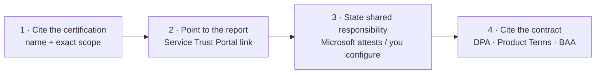

If you're the one who got handed the **security questionnaire** — the spreadsheet that asks *"what is Copilot certified against, and can you prove it?"* — this is the guide I wish someone had handed me.

The good news: the answer is genuinely strong. Microsoft 365 Copilot rides on one of the most heavily certified platforms in the industry, and it adds the AI-specific attestations that matter for 2026. The trick is knowing which certifications name Copilot explicitly, which it inherits from the platform, and exactly where to pull the report an auditor will accept.

So here it is — the full inventory, the contractual backing, where the evidence lives, and a repeatable pattern for answering the questionnaire — with the honest caveats up front.

This is the companion to the [data residency guide](/blog/microsoft-365-copilot-data-residency-anz-government/) — residency answers "where does it live"; this one answers "what's it certified against."

*What Copilot names explicitly (ISO 42001, HIPAA, FedRAMP-gov) versus what it inherits from the Microsoft 365 platform — and where you prove it.*

**Quick links:**

- [The 30-second answer](#the-30-second-answer)
- [The certification inventory](#the-certification-inventory)
- [ISO 42001: the headline AI attestation](#iso-42001-the-headline-ai-attestation)
- [The platform foundation: ISO 27001 & SOC 2](#the-platform-foundation-iso-27001--soc-2)
- [HIPAA and the BAA](#hipaa-and-the-baa)
- [FedRAMP: the one that's gov-only](#fedramp-the-one-thats-gov-only)
- [IRAP, GDPR and the EU AI Act](#irap-gdpr-and-the-eu-ai-act)
- [The contractual layer](#the-contractual-layer-dpa-product-terms-copyright)
- [Where to get the evidence](#where-to-get-the-evidence-the-service-trust-portal)
- [Compliance Manager: score your own posture](#compliance-manager-score-your-own-posture)
- [Shared responsibility](#shared-responsibility-what-microsoft-proves-vs-what-you-configure)
- [How to answer the questionnaire](#how-to-actually-answer-the-questionnaire)
- [Responsible AI & transparency](#responsible-ai-and-transparency-documents)
- [Common misconceptions](#common-misconceptions-the-rfp-gotchas)
- [FAQ](#frequently-asked-questions)

This is a living document. Certifications, scopes and report dates change as Microsoft completes new audit cycles. If you spot anything out of date, please [send me feedback](/feedback/) and I'll update it. Last verified: June 2026.

> ⚠️ **The one-line caveat to lead with:** a Microsoft certificate proves Microsoft's *platform* controls are audited — it is the **start** of your assessment, not the end. You still configure permissions, labels and retention, and you still run your own assessment for any standard *you* must certify against. State that split honestly and your RFP answer gets stronger, not weaker.

---

## The 30-second answer

If your CISO or bid manager wants the short version:

| The question | The short answer |
|---|---|
| **What's it certified against?** | The full M365 stack — ISO 27001/27017/27018/27701, SOC 1/2/3, GDPR, IRAP — plus **ISO 42001** for AI and the **HIPAA BAA**. |
| **Is Copilot named, or does it inherit?** | Explicitly named: **ISO 42001, HIPAA, FedRAMP (gov)**. Inherited from the platform: ISO 27001, SOC 2, IRAP. |
| **Is it FedRAMP?** | Only in **US Government clouds** — commercial (incl. ANZ) is not FedRAMP. |
| **Where's the proof?** | The **Service Trust Portal** — the reports an auditor accepts. |
| **Who's responsible for what?** | Microsoft attests the platform; **you** configure and run your own assessment. |
| **Any copyright cover?** | Yes — the **Customer Copyright Commitment** defends you on output. |

The detail — with the exact scopes and the report locations — is below.

### The three caveats worth knowing up front

1. **"Certified" and "committed to comply" are different.** Copilot has an ISO 42001 *certificate*; it has a *policy commitment* to the EU AI Act. Don't conflate them.
2. **Not every certification names Copilot.** Some (ISO 42001, HIPAA) do; others (SOC 2, IRAP) cover Copilot as part of the platform without listing it separately. Say which is which.
3. **Two things sit outside the compliance envelope — and one of them is on by default.** The optional web search to Bing isn't covered by the DPA, BAA or EU Data Boundary. And **Anthropic models** — enabled by default in most commercial tenants — are *also* out of scope for the EU Data Boundary and in-country processing commitments. See the box below before you answer any EU/UK or healthcare question.

> ⚠️ **The Anthropic exceptions box — read before an EU/UK or healthcare RFP.** Microsoft 365 Copilot can use Anthropic (Claude) models, and they carry three compliance caveats a reviewer will probe:
> - **Outside the EU Data Boundary.** Anthropic models are explicitly out of scope for the EU Data Boundary and in-country LLM processing commitments. EU/EFTA and UK tenants have them **off by default**; other commercial tenants (including ANZ) have them **on by default** and must disable them to keep an EU-boundary-equivalent posture.
> - **Preview models break the contract.** Standard Anthropic models run as a Microsoft subprocessor under the DPA. But *"Preview models with Data Retention"* run under **Anthropic's own terms** — Microsoft's DPA, BAA and Customer Copyright Commitment do **not** apply. They're default-off; keep them off for regulated workloads.
> - **Not in government clouds.** Anthropic isn't available in GCC, GCC High, DoD or sovereign clouds — there's no toggle there, so the exclusion concern simply doesn't arise for those tenants.

---

## The certification inventory

Here's the inventory reviewers ask for most. I've split it into what **names Copilot explicitly**, what **Copilot inherits** from the Microsoft 365 platform, and the **contractual/regulatory commitments** that aren't certifications at all — because a good reviewer will ask, and the honest distinction builds trust.

### Explicitly names Microsoft 365 Copilot

| Standard | What it covers | Note |
|---|---|---|
| **ISO/IEC 42001:2023** | AI management systems | The headline — Copilot is named in scope, independently audited |
| **HIPAA / BAA** | US healthcare | Copilot + Copilot Chat in scope; **web queries excluded** |
| **FedRAMP** | US government | Copilot in the **US Government clouds** (GCC, GCC High) — not commercial |

### Inherited from the Microsoft 365 platform

| Standard | What it covers | Note |
|---|---|---|
| **ISO/IEC 27001:2022** | Information security management | M365 platform certificate, annually audited — validity window on the STP |
| **ISO/IEC 27017** | Cloud security controls | Code of practice (incorporated into the SOC/ISO reports, not a standalone certificate) |
| **ISO/IEC 27018** | PII protection in the cloud | Code of practice; cited directly on the Copilot privacy page |
| **ISO/IEC 27701** | Privacy information management | Extends 27001 to privacy |
| **SOC 1 / 2 / 3 (Type II)** | Service-organisation controls | Annual; SOC 2 covers 5 trust criteria |
| **HITRUST CSF** | US healthcare assurance | BAA-covered services are audited against HITRUST — the credential healthcare reviewers look for first |
| **IRAP (PROTECTED)** | Australian/NZ government | Platform-assessed; Copilot not separately listed — [see the residency guide](/blog/microsoft-365-copilot-data-residency-anz-government/#irap-and-sovereignty-for-government) |
| **CSA STAR (L1/L2)** | Cloud Security Alliance | CAIQ + attestation; via SOC 2's CCM mapping |
| **C5 (Germany)** | BSI cloud computing | M365 in scope |

### Contractual & regulatory commitments (not certifications)

These matter just as much in an RFP — but they're commitments and regulations, not audited certificates. Don't list them as "certifications."

| Commitment | What it is | Note |
|---|---|---|
| **GDPR** | EU data-protection *regulation* | Microsoft commits as your data processor under the DPA — committed for Copilot |
| **EU Data Boundary** | Data-location *commitment* | M365 Copilot in scope; **web queries and Anthropic models are out of scope** |
| **EU AI Act** | AI *regulation* | Microsoft commits to comply; a Compliance Manager template helps you assess your own obligations (there's no Copilot conformity *certificate*) |
| **Customer Copyright Commitment** | Contractual *indemnity* | Microsoft defends you on output copyright; extends to standard Anthropic models |

> **The honest framing for an RFP:**lead with **ISO 42001** (the AI-specific, Copilot-named attestation), then the platform stack underneath it. Where a standard doesn't name Copilot, say "Copilot runs on the assessed Microsoft 365 platform" rather than "Copilot is certified against X" — the precision is what an auditor respects.

*Sources: [ISO 42001 offering](https://learn.microsoft.com/en-us/compliance/regulatory/offering-iso-42001) · [HIPAA/HITECH offering](https://learn.microsoft.com/en-us/compliance/regulatory/offering-hipaa-hitech) · [FedRAMP offering](https://learn.microsoft.com/en-us/compliance/regulatory/offering-fedramp) · [Copilot privacy & compliance](https://learn.microsoft.com/en-us/copilot/microsoft-365/microsoft-365-copilot-privacy).*

---

## The RFP evidence matrix (copy, adapt, cite)

This is the table to keep open next to the questionnaire. For each common question: the short approved answer, what to cite and where to pull it, the honest scope caveat, and the contractual source.

| If they ask… | Approved short answer | Cite + pull from | Scope caveat | Contract |
|---|---|---|---|---|
| Is the AI responsibly governed? | Copilot is **named in scope for ISO/IEC 42001**, independently audited | ISO 42001 certificate — **STP → ISO/IEC** | Management-system standard, not an output guarantee | DPA |
| Information-security certification? | Runs on the **ISO 27001 / SOC 2 Type II**-assessed M365 platform | ISO & SOC reports — **STP → ISO/IEC, SOC** | Copilot inherited, not separately named | DPA |
| Healthcare / HIPAA? | **Copilot + Chat in the HIPAA BAA** (services also HITRUST-audited) | BAA — **STP / embedded in the DPA** | Web queries excluded | DPA + BAA |
| ANZ government / IRAP? | M365 platform **IRAP PROTECTED**; current report on STP | IRAP report — **STP → Australia IRAP** | Copilot not separately listed; an input to your ATO | Product Terms |
| US government / FedRAMP? | FedRAMP in **GCC / GCC High**; not commercial | FedRAMP docs — **STP / aka.ms/MicrosoftFedRAMPAuditDocuments** | Commercial M365 is not FedRAMP | — |
| Is our data used to train? | **No** — prompts/responses/Graph not used to train; no human review | Copilot privacy page | Interaction history is still stored in M365 | DPA |
| What goes to the web? | A de-identified few-word query to Bing | manage-public-web-access | **Outside DPA/BAA/EUDB**; can be turned off | Product Terms |
| AI subprocessors? | OpenAI + **Anthropic** (subprocessor) | aka.ms/subprocessor | Anthropic **outside EUDB**; Preview models = Anthropic's own terms | DPA |
| Where does our data live? | M365 boundary; ADR / Multi-Geo for in-country | Residency guide + **STP** | Web queries + Anthropic excepted | Product Terms + DPA |

> **Other evidence a reviewer might request** — all on the Service Trust Portal: **pen-test & security-assessment** attestations, **SOC bridge letters** (self-attestations), **HITRUST**, **PCI DSS**, **C5**, **CSA STAR** (CAIQ), and Microsoft's own **Copilot & Copilot Chat Risk Assessment Quickstart** questionnaire template (note: **gated behind STP sign-in**, like most reports). For each artifact you submit, record the **report name, period, issue date, valid-to date and your STP download date** — auditors reject stale reports.

---

## ISO 42001: the headline AI attestation

If you only cite one certification for the AI-specific question, cite this one.

**ISO/IEC 42001:2023** is the first international standard for an **Artificial Intelligence Management System (AIMS)** — think "ISO 27001, but for AI governance." It requires a structured way to manage AI risks and opportunities across the AI lifecycle: policies, risk management, transparency, accountability, continual improvement.

**Microsoft 365 Copilot is explicitly listed in scope** for Microsoft's ISO 42001 certification, alongside GitHub Copilot, Copilot Studio, Security Copilot, Dragon Copilot and Microsoft Foundry. The audits are conducted by an **independent third party**, and the certificates and reports are on the Service Trust Portal.

**What it does and doesn't prove — say this plainly:**

- ✅ It attests that Microsoft's **AI governance processes** (its Responsible AI Standard) are in place and independently audited.
- − It is a **management-system** standard, not a product-safety certification. It does **not** certify that every individual Copilot output is accurate, unbiased, or fit for your purpose.
- − You can *reference* Microsoft's certificate, but if **your organisation** needs ISO 42001, you still engage your own assessor for your own AI deployment.

> **Why this matters in 2026:** ISO 42001 is the only third-party-audited, internationally recognised AI governance standard in force, and regulators (including EU AI Act drafters) point to it. Leading with it answers the "how do we know your AI is governed responsibly?" question with evidence, not adjectives.

*Source: [ISO/IEC 42001 — Microsoft compliance offering](https://learn.microsoft.com/en-us/compliance/regulatory/offering-iso-42001).*

---

## The platform foundation: ISO 27001 & SOC 2

Underneath the AI attestation sits the Microsoft 365 platform's security foundation — what most questionnaires actually start with.

**ISO/IEC 27001:2022** — the core information-security management certification, audited annually by an accredited third party. Pull the **current certificate and its exact validity window from the Service Trust Portal** on the day you submit — a lapsed certificate is an audit fail, so don't rely on a date from a blog. ISO 27017 (cloud controls), 27018 (cloud PII) and 27701 (privacy) are assessed alongside it in a single Statement of Applicability — though 27017 and 27018 are *codes of practice* incorporated into the SOC/ISO reports rather than standalone certificates you can download.

**SOC 2 Type II** — examines the Microsoft 365 platform controls across the five Trust Services Criteria: **Security, Availability, Processing Integrity, Confidentiality and Privacy**. It's audited annually by an AICPA-accredited firm over a rolling 12-month period, with **quarterly bridge letters** — which are Microsoft management self-attestations, *not* independently audited reports — covering the gap since the last report. The SOC 2 audit also incorporates the **CSA Cloud Controls Matrix**, which is how Microsoft satisfies CSA STAR Attestation.

> **The honest nuance:** the SOC 2 and ISO 27001 scope tables list the broad Microsoft 365 services (Exchange, SharePoint, Teams…) and don't always enumerate "Microsoft 365 Copilot" as a separate line. Copilot inherits the coverage as part of the platform — so the precise RFP answer is *"Copilot runs on the SOC 2 / ISO 27001-assessed Microsoft 365 platform,"* and the report is on the Service Trust Portal.

*Sources: [ISO 27001 offering](https://learn.microsoft.com/en-us/compliance/regulatory/offering-iso-27001) · [SOC 2 offering](https://learn.microsoft.com/en-us/compliance/regulatory/offering-soc-2).*

---

## HIPAA and the BAA

For healthcare (and anyone who handles health information), the question is the **Business Associate Agreement**.

- **Microsoft 365 Copilot and Copilot Chat are explicitly in scope** for the HIPAA BAA.
- The **BAA is embedded in the Microsoft Data Protection Addendum (DPA)** and is available to covered entities and business associates **by default** — no separate negotiation for the standard terms.
- The BAA-covered services are also audited against **ISO 27001** and the **HITRUST CSF**, adding assurance frameworks.

> ⚠️ **The exclusion a healthcare reviewer must know:** **HIPAA compliance does not apply to web search queries** — they aren't covered by the DPA or the BAA, because the web query goes to the separately operated Bing service with Microsoft as an independent controller. For a HIPAA deployment, either **turn web search off**, or document the exclusion explicitly in your compliance programme.

*Source: [HIPAA/HITECH — Microsoft compliance offering](https://learn.microsoft.com/en-us/compliance/regulatory/offering-hipaa-hitech) · [Enterprise data protection](https://learn.microsoft.com/en-us/copilot/microsoft-365/enterprise-data-protection).*

---

## FedRAMP: the one that's gov-only

This trips people up, so be precise. **FedRAMP applies to Microsoft's US Government clouds only** — Office 365 U.S. Government, U.S. Government High and DoD. Microsoft 365 Copilot is listed in scope within the **GCC and GCC High** tiers (confirm the current DoD listing and per-tier availability on the Service Trust Portal).

**Commercial Microsoft 365 — which is what Australian, New Zealand and most enterprise customers run — is not FedRAMP authorized.** That's not a gap; FedRAMP is a US federal program, and the commercial cloud is assessed against the standards that actually apply to you (ISO, SOC, GDPR, and — for ANZ government — IRAP).

> **So if a questionnaire asks "is Copilot FedRAMP authorized?"** the honest answer is: *yes for US government tenants; not applicable to commercial tenants, which rely on ISO/SOC/IRAP instead.* Don't claim commercial FedRAMP — a sharp reviewer will catch it.

*Source: [FedRAMP — Microsoft compliance offering](https://learn.microsoft.com/en-us/compliance/regulatory/offering-fedramp).*

---

## IRAP, GDPR and the EU AI Act

**IRAP (Australia/NZ government)** — the Microsoft 365 platform is IRAP-assessed at **PROTECTED**, and the reports are on the Service Trust Portal's Australia IRAP page. The publicly documented Office 365 scope list predates Copilot, so Copilot isn't separately enumerated there — but the Service Trust Portal carries a current **M365 IRAP Cloud Security Assessment Report (2026)**, and reading the report is how you confirm exactly what's in scope. The full IRAP-as-an-input-not-an-ATO framing is in the [data residency guide](/blog/microsoft-365-copilot-data-residency-anz-government/#irap-and-sovereignty-for-government).

**GDPR** — Microsoft 365 Copilot is committed to Microsoft's existing GDPR and EU Data Boundary commitments, with Microsoft acting as your data processor under the DPA.

**EU AI Act** — here's the honest distinction. Microsoft has a **public commitment to comply** with the EU AI Act, and **Compliance Manager** ships an **EU AI Act assessment template**. But there is **no published Copilot-specific EU AI Act conformity certificate** the way there is an ISO 42001 certificate. The EU AI Act is a *regulation you assess your own obligations against* — using ISO 42001 and the Compliance Manager template as inputs. Treat "committed to comply" and "certified" as different claims in your RFP.

*Sources: [Australia IRAP offering](https://learn.microsoft.com/en-us/compliance/regulatory/offering-ccsl-irap-australia) · [Copilot privacy (GDPR/EU AI Act)](https://learn.microsoft.com/en-us/copilot/microsoft-365/microsoft-365-copilot-privacy) · [Compliance Manager regulations](https://learn.microsoft.com/en-us/purview/compliance-manager-regulations-list).*

---

## The contractual layer: DPA, Product Terms, copyright

Certifications prove the controls; the **contract** is what you actually hold Microsoft to.

- **Data Protection Addendum (DPA)** — the primary processing contract (latest version **May 2026**). It governs Microsoft as your **data processor**: GDPR obligations, security commitments, breach notification, data-subject-request support, subprocessor disclosure, the **embedded HIPAA BAA**, and data-residency / EU Data Boundary commitments.
- **Microsoft Product Terms** — the service-specific privacy and security terms, including the web-query commitments for Copilot.
- **Customer Copyright Commitment (CCC)** — Microsoft will **defend you and pay adverse judgments or settlements** if a third party sues you for copyright infringement from using Copilot or its output, provided you used the built-in guardrails and content filters. The CCC **also extends to the standard Anthropic models** operating as a Microsoft subprocessor within Copilot. (Exception: Anthropic *Preview models with Data Retention* run under Anthropic's own terms — the CCC, DPA and BAA don't apply; keep them off for regulated work.)
- **Subprocessor list** — the current list (including OpenAI and Anthropic) is published at [aka.ms/subprocessor](https://aka.ms/subprocessor) and linked from the Service Trust Portal.

> **Tip —** in an RFP, the contract beats the brochure. Cite the **DPA** for processing obligations, the **Product Terms** for service specifics, and the **CCC** for the copyright indemnity. The live documents always supersede any summary, including this one.

*Sources: [Microsoft DPA](https://www.microsoft.com/licensing/docs/view/Microsoft-Products-and-Services-Data-Protection-Addendum-DPA) · [Product Terms](https://www.microsoft.com/licensing/terms/product/PrivacyandSecurityTerms/all) · [Connect to an AI subprocessor](https://learn.microsoft.com/en-us/copilot/microsoft-365/connect-to-ai-subprocessor).*

---

## Where to get the evidence: the Service Trust Portal

When a reviewer says *"show me the report,"* this is where you go. The **Microsoft Service Trust Portal** ([servicetrust.microsoft.com](https://servicetrust.microsoft.com)) is the source of record.

*The Service Trust Portal's catalogue of certifications, regulations and standards — the source of record an auditor will accept. The catalogue is browsable; the reports themselves need a signed-in Microsoft account.*

**What it hosts** — under *Certifications, Regulations and Standards*: ISO/IEC (including **42001**), SOC, GDPR, FedRAMP, PCI, CSA STAR, Australia IRAP, Singapore MTCS, Spain ENS. Plus an **AI Resources** section (Copilot-specific compliance docs), a **Pen Test and Security Assessments** section, and industry/regional resources.

**How access works** — the catalogue is browsable, but downloading most reports requires signing in with a **Microsoft Entra organisation account** (an active M365/Azure/Dynamics subscription — a free trial works) and accepting an NDA for compliance materials. Some restricted documents need an admin/compliance role.

**The two documents to grab first for a Copilot RFP:**

1. The **Copilot & Copilot Chat Risk Assessment Quickstart** — Microsoft's own RFP/questionnaire starting template, on the Service Trust Portal.
2. The specific certificate or audit report for each standard the questionnaire asks about (ISO 42001, ISO 27001, SOC 2, BAA, IRAP).

*Source: [Get started with the Service Trust Portal](https://learn.microsoft.com/en-us/compliance/assurance/stp-get-started).*

---

## Compliance Manager: score your own posture

Certifications answer "what has Microsoft done?" **Microsoft Purview Compliance Manager** answers "where are *we*?" — it turns a questionnaire into a documented gap analysis. (It's evidence and workflow support, not a certification or a legal determination of compliance.)

- **Hundreds of regulatory assessment templates** (Microsoft cites 360+) mapped to Microsoft's controls — including AI-specific ones: **ISO 42001, the EU AI Act, ISO 23894 (AI risk) and the NIST AI Risk Management Framework**.
- A points-based **compliance score** across any standard you pick.
- Every control is tagged **Microsoft-managed**, **customer-managed**, or **shared** — so the split is explicit and documentable.
- **Improvement actions** give step-by-step guidance, assignable to people, with evidence storage — exactly what an auditor wants to see.

*Compliance Manager turns "are we compliant?" into a scored posture across each standard — here, a posture breakdown across HIPAA, ISO, PCI and NIST. (Microsoft demo environment.)*

**Licensing note:** the Microsoft Data Protection Baseline is included for all subscriptions; **E5/A5/G5** customers get **three premium regulatory templates free**, with additional templates available to purchase.

*Source: [Compliance Manager](https://learn.microsoft.com/en-us/purview/compliance-manager) · [regulations list](https://learn.microsoft.com/en-us/purview/compliance-manager-regulations-list).*

---

## Shared responsibility: what Microsoft proves vs what you configure

This is the single most important framing for an honest RFP answer.

| Microsoft attests (and audits) | You configure (and must assess) |
|---|---|
| Platform certifications (ISO, SOC, ISO 42001, HIPAA BAA, FedRAMP-gov, IRAP) | **Permissions** — Copilot only surfaces what each user can already access |
| Encryption at rest and in transit; tenant isolation | **Sensitivity labels** and information protection |
| No use of your data to train foundation models | **Retention policies** for Copilot interaction history |
| Responsible-AI controls (jailbreak defence, content filters, protected-material detection) | **Web-search posture** (off removes the BAA/EUDB exclusion concern) |
| Breach notification; subprocessor oversight | **Anthropic model** access (admin toggle — commercial cloud only; off by default in EU/EFTA/UK; not available in GCC/GCC High/DoD) |
| The contractual commitments (DPA, Product Terms, CCC) | **Which agents/plugins** are enabled; your own **assessment** for any standard you certify against |

> The certificate is the **start** of your assessment, not the end. Compliance Manager makes this split concrete — Microsoft-managed controls arrive pre-populated; customer-managed controls show what's left for you.

*Source: [Copilot data, privacy and security](https://learn.microsoft.com/en-us/copilot/microsoft-365/microsoft-365-copilot-privacy).*

---

## How to actually answer the questionnaire

A repeatable four-part pattern for each control or question — it's what makes an answer audit-grade instead of marketing:

A worked example for *"Is Copilot's AI responsibly governed?"*:

1. **Cite:** "Microsoft 365 Copilot is explicitly in scope for Microsoft's **ISO/IEC 42001:2023** certification, independently audited."
2. **Report:** "Certificate and audit report available on the **Service Trust Portal** → ISO/IEC (sign-in required)."
3. **Shared responsibility:** "Microsoft attests its AI management system; **we** run our own ISO 42001 assessment for our deployment and configure our governance controls."
4. **Contract:** "Processing governed by the **Microsoft DPA (May 2026)** and Product Terms, with Microsoft as data processor."

> **Tip —** start from Microsoft's **Copilot & Copilot Chat Risk Assessment Quickstart** on the Service Trust Portal rather than a blank page, then layer your tenant-specific configuration on top.

---

## Responsible AI and transparency documents

Increasingly, questionnaires ask for AI *transparency* artefacts, not just security certs. Microsoft publishes:

- **The Application Card for Microsoft 365 Copilot** — intended uses, capabilities, limitations, and the choices owners can make. The closest thing to a "datasheet" for the AI system.
- **The Responsible AI Transparency Report (2025)** — Microsoft's annual account of its responsible-AI practices.
- **The Responsible AI Standard** — the published general-requirements document, built on six principles: fairness, reliability & safety, privacy & security, inclusiveness, transparency, accountability.

Two data-handling facts worth quoting directly: your data is **not used to train** the foundation models, and Microsoft 365 Copilot has **opted out of Azure OpenAI abuse monitoring**, so there's no human review of your content.

*Source: [Copilot Application Card](https://learn.microsoft.com/en-us/copilot/microsoft-365/microsoft-365-copilot-application-card) · [Responsible AI Transparency Report](https://www.microsoft.com/corporate-responsibility/responsible-ai-transparency-report).*

---

## Common misconceptions (the RFP gotchas)

- **"Copilot is FedRAMP authorized."** Only in US government clouds — not commercial.
- **"ISO 42001 certifies the AI is safe/accurate."** It certifies the *management system*, not individual outputs.
- **"We're committed to the EU AI Act" = "we're EU AI Act certified."** A policy commitment and an assessment template are not a conformity certificate.
- **"The certificate proves we're compliant."** It proves Microsoft's platform is — your configuration and your own assessment are the other half.
- **"Everything is covered by the BAA/DPA."** Web search queries are not — they sit outside the DPA, BAA and EU Data Boundary.
- **"SOC 2 lists Copilot."** It covers Copilot via the platform but may not name it as a separate service — cite it as platform coverage.
- **"The audit reports are public."** The catalogue is browsable, but the reports themselves need a signed-in Microsoft account and an NDA.

---

## Frequently asked questions

**What is Microsoft 365 Copilot certified against?**
The M365 platform stack — ISO 27001/27017/27018/27701, SOC 1/2/3, GDPR, IRAP — plus **ISO 42001** for AI management and the **HIPAA BAA**, both of which name Copilot explicitly. The reports live on the Service Trust Portal.

**Is Copilot ISO 42001 certified?**
Yes — Microsoft 365 Copilot is explicitly in scope for Microsoft's independently audited ISO/IEC 42001 certification. It attests the AI management system, not the correctness of individual outputs.

**Is Copilot FedRAMP authorized?**
Only in US Government clouds (GCC, GCC High, DoD). Commercial Microsoft 365 — including ANZ — is not FedRAMP; it relies on ISO, SOC and IRAP.

**Does the HIPAA BAA cover Copilot?**
Yes — Copilot and Copilot Chat are in scope, via the BAA embedded in the DPA. Web search queries are the documented exclusion.

**Is Copilot explicitly named in every certification?**
No. Named: ISO 42001, HIPAA, FedRAMP (gov). Inherited from the platform (not separately listed): ISO 27001, SOC 2, IRAP. Say which is which.

**Is Copilot EU AI Act compliant?**
Microsoft has a policy commitment to comply, and Compliance Manager has an EU AI Act template — but there's no Copilot-specific EU AI Act conformity certificate. You assess your own obligations.

**Where do we download the audit reports?**
The Service Trust Portal (servicetrust.microsoft.com), signed in with a Microsoft Entra org account. Start with the Copilot & Copilot Chat Risk Assessment Quickstart.

**Is our data used to train the models?**
No — prompts, responses and Graph data aren't used to train the foundation models, and Copilot has opted out of abuse-monitoring human review.

**Are we covered on copyright?**
Yes — the Customer Copyright Commitment defends you and pays adverse judgments for output-related copyright claims, if you used the built-in guardrails. It extends to the Anthropic models.

**What does Compliance Manager give us?**
360+ assessment templates (including ISO 42001, EU AI Act, NIST AI RMF), a compliance score, and an explicit Microsoft-managed / customer-managed / shared control split.

**What's the most honest caveat to include?**
Compliance is shared — Microsoft attests the platform; you configure your tenant and run your own assessment. A certificate is the start of your assessment, not the end.

---

## Related guides

- [Microsoft 365 Copilot Security: Top Questions Answered](/blog/microsoft-365-copilot-security-questions-answered/) *(the security pillar this guide belongs to)*
- [Copilot Data Residency & Sovereignty for ANZ & Government](/blog/microsoft-365-copilot-data-residency-anz-government/) *(where the data lives — the residency companion)*
- [Copilot Agents & Studio — Data-Flow Governance](/blog/microsoft-365-copilot-agents-data-flow-governance/) *(where agent data goes, and how to govern it)*
- [The Copilot Control System Explained](/blog/microsoft-365-copilot-control-system-complete-guide/)
- [SharePoint Oversharing Controls for Copilot](/blog/sharepoint-oversharing-controls-microsoft-365-copilot/)
- [Agent 365 Security — Entra, Purview, Defender](/blog/agent-365-security-governance-complete-guide/)

*Everything here is grounded in Microsoft's official documentation and the Service Trust Portal, linked inline. Certifications and scopes change with each audit cycle — for a formal response, pull the current report from the Service Trust Portal on the day, and confirm anything tenant-specific with your Microsoft account team.*
