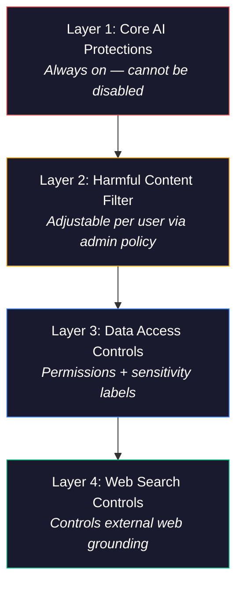
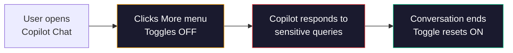
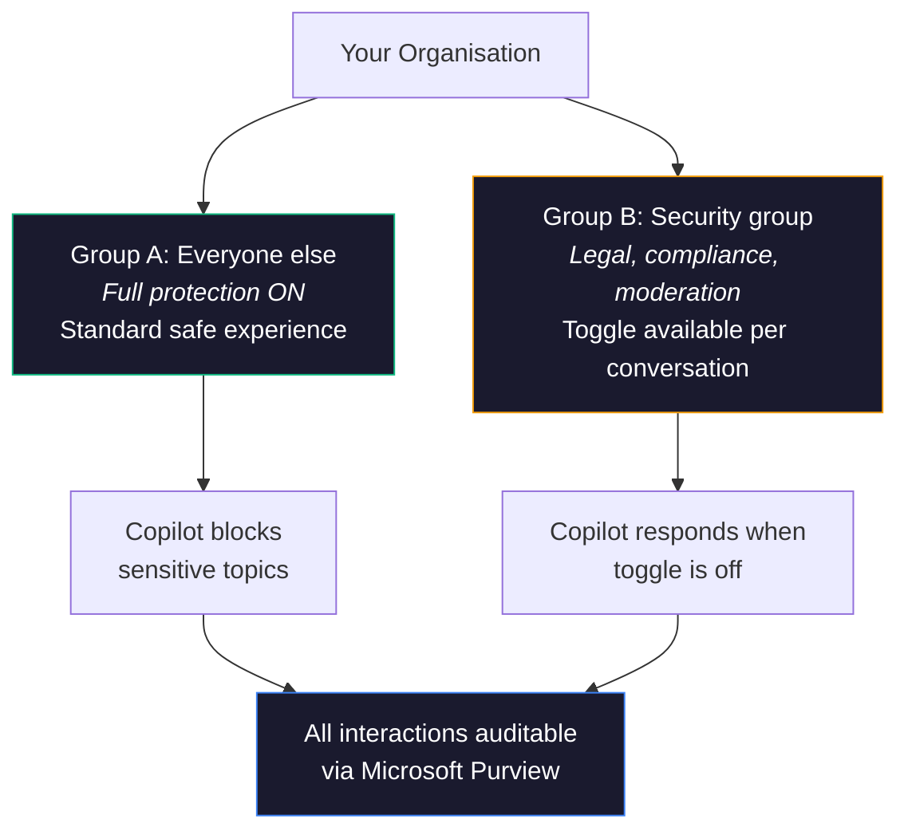
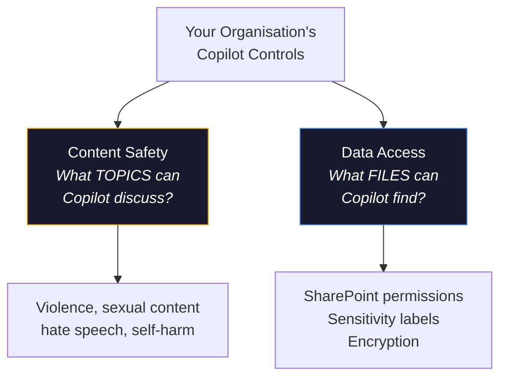

I'll be straight with you — most IT admins I talk to know that Copilot has "some safety stuff built in." But when I ask them how many layers of safety controls they actually have, the answer is usually "one... maybe two?"

You actually have **four**. And understanding which one does what is the difference between a secure Copilot rollout and an uncomfortable conversation with your CISO.

This guide covers every content safety lever you have, when to use each one, and exactly how to set them up.

**Quick links:**

- [The 30-second answer](#tldr--the-4-controls-you-need-to-know)
- [The 4 safety layers explained](#the-4-layers-of-copilot-content-safety)
- [What licence do you need?](#what-licence-do-you-need)
- [The harmful content toggle](#layer-2-the-harmful-content-toggle)
- [How to configure it (step by step)](#step-by-step-configuration)
- [Data access controls](#layer-3-data-access--who-sees-what)
- [Web search controls](#layer-4-web-search-controls)
- [Real-world scenarios](#real-world-scenarios--how-real-teams-use-this)
- [Best practices](#best-practices)
- [FAQ](#frequently-asked-questions)

This is a living document. The AI world changes every day — features ship, settings move, and guidance evolves. If you spot anything out of date, please [send me feedback](/feedback/) and I'll update it. Last verified: April 2026.

> ⚠️ **Government cloud note:** This guide covers commercial tenants. GCC, GCC High, and DoD availability may differ — check with your Microsoft account team before planning rollouts.

---

## TL;DR — The 4 Controls You Need to Know

If your boss asks "what safety controls do we have in Copilot?" — here's your 30-second answer:

| Control | What It Does | Can You Change It? | Your First Action |
|---------|-------------|-------------------|-------------------|
| **Core AI protections** | Blocks prompt injection, copyright theft, biosecurity threats | No — always on | Nothing needed — it's automatic |
| **Harmful content filter** | Blocks violence, sexual content, hate speech, self-harm | Yes — per-user toggle | Decide if any roles need the toggle |
| **Data access controls** | Permissions + sensitivity labels control what Copilot can find | Yes — SharePoint + Purview | Audit SharePoint permissions |
| **Web search** | Controls whether Copilot uses web data | Yes — org or per-group | Decide your web search policy |

### The Thing Most Admins Miss

Here's what makes this powerful — you can run **two different safety postures side by side** in the same tenant:

- **99% of your users:** Full safety ON. Copilot won't discuss sensitive topics. Standard experience.
- **A small group** (legal, compliance, moderation): You give them a toggle to temporarily lower the filter when their job requires it — and it resets automatically every new conversation.

Both groups are fully auditable through Microsoft Purview. Nobody gets a free pass.

> **Three things to do today:**
>
> 1. Audit your SharePoint permissions for oversharing
> 2. Deploy sensitivity labels if you haven't already
> 3. Decide if any roles need the harmful content toggle — and create a dedicated security group

---

## The 4 Layers of Copilot Content Safety

Think of this like a hotel's safety system. The fire alarm and sprinklers (Layer 1) are always on — nobody gets to disable those. The room safe (Layer 3) is there for guests to protect their valuables. And the "adults only" floor access (Layer 2) is something the hotel manager controls — only certain guests get the key.

Copilot works the same way — four layers, each doing something different:

| Layer | What It Controls | Can Be Disabled? | Where to Configure |
|-------|-----------------|-----------------|-----------------|
| **1. Core AI protections** | Prompt injection, copyright, biosecurity, image safety | Never | Built into the platform |
| **2. Harmful content filter** | Violence, sexual content, hate speech, self-harm | Per-user toggle | Cloud Policy → Security group |
| **3. Data access controls** | What data Copilot can find and surface | Configure per your governance | SharePoint + Microsoft Purview |
| **4. Web search** | Whether Copilot can use web data | On/off per org or group | Cloud Policy |

---

## What Licence Do You Need?

Not everything is available to everyone. Here's the honest breakdown:

| Control | Free Copilot Chat | M365 Copilot (Paid) | Copilot Studio |
|---------|:---:|:---:|:---:|
| **Core AI protections** | ✅ Always on | ✅ Always on | ✅ Always on |
| **Harmful content filter** (default) | ✅ Always on | ✅ Always on | ✅ Always on |
| **Harmful content toggle** (adjustable) | ❌ Not available | ✅ Available | N/A |
| **Sensitivity labels** | ❌ Requires E3/E5 | ✅ Requires E3/E5 base | N/A |
| **Web search controls** | ✅ Admin configurable | ✅ Admin configurable | N/A |
| **DLP for Copilot prompts** | ❌ Requires Purview | ✅ Requires Purview | N/A |
| **Audit logging** | ❌ Limited | ✅ Available (with Purview) | ✅ Available |

> 💡 **The bottom line:** The toggle that lets users adjust content filtering requires a **paid M365 Copilot licence** ($30/user/month enterprise, $21/user/month business). Free Copilot Chat users get the default safety filters but can't change them. Purview features (DLP, audit, eDiscovery) have their own licensing requirements.

---

## Layer 1: Core AI Protections — The Fire Alarm

These are the safety features that are always on. Think of them like the fire alarm in a hotel — nobody gets to disable it, and nobody should want to.

| Protection | What It Blocks | Can Be Turned Off? |
|-----------|---------------|-------------------|
| **Prompt injection defence** | Attempts to trick Copilot into ignoring its rules | Never |
| **Copyright safeguards** | Copilot won't reproduce protected material verbatim | Never |
| **Biosecurity filters** | Content about creating biological threats | Never |
| **Image safety** | Harmful, explicit, or violent image generation | Never |
| **Agent safety** | Agents can't bypass safety guardrails | Never |

> 💡 **This is your safety floor.** When someone in leadership asks "but can someone jailbreak it?" — the answer is these five protections are always active, non-negotiable, and you can't accidentally turn them off.

---

## Layer 2: The Harmful Content Toggle

This is the big one — the control that generates the most questions. Introduced in **September 2025** via [MC1133507](https://learn.microsoft.com/en-us/copilot/microsoft-365/harmful-content-protection-copilot-chat).

### What It Filters (When Enabled)

By default, Copilot Chat will block or limit responses about:

- **Sexual material** — explicit or suggestive content
- **Violence** — graphic descriptions of harm or injury
- **Hate speech** — content targeting protected groups
- **Self-harm** — content that promotes or describes self-harm
- **Fairness concerns** — content that could be discriminatory

### What Happens When Someone Turns It Off

Here's the important part — this isn't a permanent switch. It works more like a hotel's "Do Not Disturb" sign. The guest puts it on for their current stay, and the hotel resets it for the next guest.

**What you need to know:**

- Only affects **the current conversation** — resets every time
- Once off in a conversation, it **stays off** until the conversation ends
- Only affects **text responses in Copilot Chat** — not images, agents, or Copilot in other apps
- Core AI protections (copyright, prompt injection, biosecurity) **stay active regardless**

### Who Actually Needs This?

I'd keep this list very short. This is for people whose job requires them to work with sensitive content:

| Role | Why They Need It |
|------|----------|
| **Legal teams** | Reviewing case files involving violence or abuse |
| **Law enforcement** | Investigating criminal activity |
| **Content moderators** | Screening user-generated content |
| **Social workers** | Reviewing reports involving harm or neglect |
| **HR investigators** | Analysing complaints involving sensitive behaviour |
| **Compliance teams** | Investigating workplace misconduct |

If someone's role isn't on a list like this, they probably don't need it.

### Two Safety Postures, One Tenant

This is what I think makes this feature genuinely well-designed. You're not choosing "safe for everyone" or "open for everyone." You run both, side by side:

**Key details:**

- **Not tenant-wide** — the policy targets a security group. Everyone else has no idea the toggle exists
- **Not permanent** — resets automatically every conversation
- **Fully auditable** — both groups' interactions are captured in Purview
- **Reversible** — remove someone from the group and the toggle disappears

---

## Step-by-Step Configuration

If you've decided some users need the toggle, here's how to set it up. The whole process takes about 10 minutes — but the policy can take up to 24 hours to apply.

### What You Need First

- ✅ Microsoft 365 Copilot licences assigned to the target users
- ✅ **Office Apps Administrator** or **Global Administrator** role
- ✅ A security group in Entra ID

### Step 1: Create the Security Group

1. Go to **[Entra ID Admin Centre](https://entra.microsoft.com)** → Groups → New group
2. Group type: **Security**
3. Name it something obvious: e.g., `Copilot - Reduced Content Safety`
4. Add **only** the users who need this
5. Save

> ⚠️ **Keep this group small.** I'd treat this like privileged admin access — only people whose role specifically requires working with sensitive content.

### Step 2: Configure the Cloud Policy

1. Go to **[config.office.com](https://config.office.com)**
2. Navigate to **Customization** → **Policy Management** → **Create**
3. Search for: **"Adjust responsible AI protections for Microsoft 365 Copilot"**
4. Set to: **Enabled**
5. Under Options: **"Provide users with the option to adjust harmful content protection"**
6. Click **Apply**

### Step 3: Assign to the Security Group

1. In the same policy, go to **Assignments**
2. Select the security group from Step 1
3. Save

### Step 4: Test It

1. Ask someone in the group to open **Copilot Chat**
2. Look for the **More** menu (⋯) in the top-right
3. A **Harmful content protection** toggle should appear
4. It should be **ON by default**

> 💡 **Give it time.** Cloud Policy settings can take up to 24 hours to apply. If the toggle doesn't appear, wait and try again before troubleshooting.

---

## Layer 3: Data Access — Who Sees What

This is where I see the most confusion. People mix up "content safety" (what topics Copilot will discuss) with "data access" (what files Copilot can find). They're completely separate systems.

Here's the simplest way I can explain it:

- **Content safety** = Can Copilot talk about violence? → That's the toggle above
- **Data access** = Can Copilot see that confidential HR document? → That's permissions and labels

Think of it like your phone. Parental controls decide what types of content are allowed. But app permissions decide which apps can see your photos. Different systems, different problems.

| | Content Safety | Data Access |
|---|---|---|
| **Controls** | What **topics** Copilot will discuss | What **files** Copilot can find |
| **Example problem** | "Copilot refuses to summarise a violent incident report" | "Copilot showed someone a confidential HR document" |
| **Fix** | Harmful content toggle | SharePoint permissions + sensitivity labels |
| **Configured in** | Cloud Policy | SharePoint Admin + Purview |
| **Scope** | Copilot Chat text only | All Copilot across all apps |

### Do You Need Both?

Almost certainly. Here's what I'd recommend:

> 💡 **Fix permissions first, toggle second.** Deploy sensitivity labels and clean up SharePoint permissions as your foundation. The harmful content toggle is a targeted tool for a small group — it's not your main security strategy.

> 📚 **Official reference:** [Data, Privacy, and Security for Microsoft 365 Copilot](https://learn.microsoft.com/en-us/copilot/microsoft-365/microsoft-365-copilot-privacy) · [Microsoft Purview sensitivity labels](https://learn.microsoft.com/en-us/purview/sensitivity-labels)

---

## Layer 4: Web Search Controls

The last layer controls whether Copilot can pull in web data when responding to users.

| Setting | Where | What It Does |
|---------|-------|--------|
| **Allow web search in Copilot** | Cloud Policy | Master on/off for web grounding |
| **Web content toggle** (user) | M365 Copilot work chat only | Users can turn off web for a session |
| **Enabled everywhere** | Cloud Policy | Full web access in all modes |
| **Disabled in Work mode only** | Cloud Policy | No web in Work mode; web available in Web mode |
| **Disabled everywhere** | Cloud Policy | No web grounding at all |

For **GCC and DoD tenants**, web search is **off by default**. You'd need to turn it on explicitly.

### A Note for Regulated Organisations

If you work in government, financial services, or healthcare, this matters: web search has **different privacy boundaries** than other Copilot interactions.

When web search is on, Copilot sends search queries (not your full prompt) to Bing. Those queries are handled under the Microsoft Services Agreement — **not** the Data Protection Addendum. HIPAA and EU Data Boundary **don't apply** to those web queries. The queries aren't used for training, ads, or profiling — but they're not covered by your enterprise data protection commitments.

> 📚 **Official reference:** [Data, privacy, and security for web search in Copilot](https://learn.microsoft.com/en-us/copilot/microsoft-365/manage-public-web-access)

> 💡 **My recommendation:** If your compliance framework requires data processor commitments for all AI interactions, disable web search for those user groups.

---

## Real-World Scenarios — How Real Teams Use This

### Scenario 1: Content Moderation Team

A trust and safety team needs Copilot to help analyse flagged user content that may contain violence or hate speech.

**What I'd set up:**

1. Create a small security group: `Content Moderation - Copilot Access`
2. Assign the harmful content policy
3. Staff toggle the filter off when reviewing flagged content — it resets automatically
4. Long-term: Build a Copilot Studio agent with structured moderation criteria for a more consistent workflow

### Scenario 2: Legal Team Investigating Harassment

Legal counsel needs Copilot to summarise complaints and witness statements that describe harassment.

**What I'd set up:**

1. Add legal counsel to the security group
2. They toggle off protection when reviewing case files
3. Sensitivity labels on the case files ensure only authorised staff can access them
4. Two layers working together: labels control who sees the data, the toggle controls whether Copilot can discuss it

### Scenario 3: Government Compliance Officer

A compliance officer needs to analyse social media posts for hate speech as part of an investigation.

**What I'd set up:**

1. Add the officer to the security group
2. Enable web search for this officer specifically
3. Enable the harmful content toggle so Copilot can analyse the content
4. Everything logged in Purview for the audit trail

### Scenario 4: Everyone Else

99% of your users just use Copilot for emails, meeting summaries, and document drafting.

**What I'd set up:**

- ✅ Leave all defaults
- ✅ Deploy sensitivity labels
- ✅ No toggle needed
- ✅ Web search on

---

## Best Practices

### Do This

| Practice | Why |
|----------|-----|
| **Keep the security group small** | Treat it like privileged access — review quarterly |
| **Name the group clearly** | `Copilot - Reduced Content Safety` so it's obvious in audit |
| **Deploy sensitivity labels first** | That's your foundation before touching content filters |
| **Document your policy** | Write down who has access and why |
| **Enable Purview audit logging** | Track all Copilot interactions |
| **Train the approved users** | Make sure they understand what the toggle does |
| **Review the group quarterly** | Remove people who no longer need it |

### Don't Do This

| Mistake | Risk |
|---------|------|
| **Adding the whole org to the group** | That defeats the entire purpose |
| **Skipping sensitivity labels** | Content toggle without data governance = uncontrolled risk |
| **Forgetting to communicate** | Users with the toggle need clear expectations |
| **Assuming it covers images** | Image protections are separate and always on |
| **Calling it "disabling safety"** | Core AI protections stay active — you're adjusting one filter |

---

## Complete Admin Checklist

Here's the full checklist — bookmark this and work through it:

- [ ] **Audit your current state** — check if policies already exist in Cloud Policy
- [ ] **Deploy sensitivity labels** via Microsoft Purview
- [ ] **Identify who needs the toggle** — specific roles, not whole departments
- [ ] **Create a dedicated Entra ID security group**
- [ ] **Configure the Cloud Policy** at config.office.com
- [ ] **Assign the policy to the group**
- [ ] **Test** — verify the toggle appears (allow 24 hours)
- [ ] **Document** — who has access, why, and the review schedule
- [ ] **Configure web search** per your data handling requirements
- [ ] **Enable Copilot audit logging** in Purview
- [ ] **Set a quarterly review** for group membership
- [ ] **Train the approved users**

> 💡 **Related tools on this site:** [Copilot Readiness Checker](/copilot-readiness/) — scored assessment across 7 pillars · [CA Policy Builder](/ca-builder/) — design Conditional Access policies · [Copilot Feature Matrix](/copilot-matrix/) — features by app and licence

---

## Beyond Content Safety

Content safety is one piece of a secure Copilot deployment. Here are the other controls you should know about:

| Control | What It Does | Where |
|---------|-------------|-------|
| **DLP for Copilot prompts** | Prevent sensitive data in prompts and responses | Purview → DLP |
| **Oversharing governance** | Fix SharePoint/OneDrive permissions | SharePoint Admin + access reviews |
| **Retention policies** | Control how long Copilot conversations are kept | Purview → Retention |
| **eDiscovery** | Search and export Copilot interactions for legal | Purview → eDiscovery |
| **Audit logging** | Track usage, prompts, and responses | Purview → Audit |
| **DSPM for AI** | Monitor AI-related data security posture | Purview → DSPM |

> 💡 **The #1 security risk most admins miss with Copilot isn't content safety — it's oversharing.** If your SharePoint permissions are too broad, Copilot will surface documents that users technically can access but shouldn't see. Fix permissions before you scale.

---

## Summary

| Control | What It Does | Default | Scope |
|---------|-------------|---------|-------|
| **Core AI protections** | Blocks prompt injection, copyright, biosecurity | Always ON | All Copilot |
| **Harmful content filter** | Blocks violence, sexual, hate, self-harm | ON (toggle for approved users) | Copilot Chat text only |
| **Data access** | Permissions + labels control what data Copilot surfaces | Permissions always active | All Copilot |
| **Web search** | Controls web grounding | ON (OFF for GCC/DoD) | Copilot Chat + Work mode |
| **DLP policies** | Blocks sensitive data in prompts/responses | Off until configured | All Copilot |

---

## Frequently Asked Questions

**1. Can I completely disable all Copilot content filters?**

No. Core AI protections — prompt injection defence, copyright safeguards, biosecurity measures, and image safety — are always on. The harmful content toggle only affects text responses in Copilot Chat.

**2. Does the harmful content toggle affect Copilot in Word, Excel, or Teams?**

No. It only affects Copilot Chat text responses. Copilot in Word, Excel, PowerPoint, Teams, Outlook, and every other app is unaffected. Images and agents are also unaffected.

**3. What licence do users need for the toggle?**

A Microsoft 365 Copilot licence. The toggle only appears if you've assigned the Cloud Policy to their security group.

**4. Can a user keep it off permanently?**

No. It resets every new conversation. They have to toggle it off each time they need it.

**5. What's the difference between content safety and sensitivity labels?**

Content safety controls what **topics** Copilot will discuss. Sensitivity labels control what **data** Copilot can find. Completely separate systems.

**6. Is the toggle available in government clouds?**

Check with your Microsoft account team. GCC, GCC High, and DoD rollout timelines typically differ.

**7. Can I audit who uses the toggle?**

You can track group membership, and all Copilot interactions are available through Purview audit logs and eDiscovery.

**8. Can DLP stop Copilot from processing sensitive data?**

Yes. Purview DLP can detect sensitive information in Copilot prompts and responses. This is separate from the content toggle — DLP protects data, the toggle controls topics.

**9. What's the biggest security risk most admins miss?**

Oversharing. Copilot surfaces anything a user has access to. If SharePoint permissions are too broad, Copilot will find documents people shouldn't see. Fix permissions before you scale.

**10. What happens if someone shares a conversation with the toggle off?**

It's stored and auditable like any other Copilot conversation — subject to your retention and DLP policies. But it may contain sensitive material, so have clear usage policies.

---

> **Disclaimer:** The views and opinions expressed in this article are my own and do not represent the official positions of Microsoft. This article is not legal, compliance, or product-commitment advice. All information was sourced from official Microsoft documentation at the time of writing — features, settings, and availability are subject to change and may vary by cloud environment, tenant, and licensing. Always refer to [official Microsoft documentation](https://learn.microsoft.com) for the most up-to-date information.
