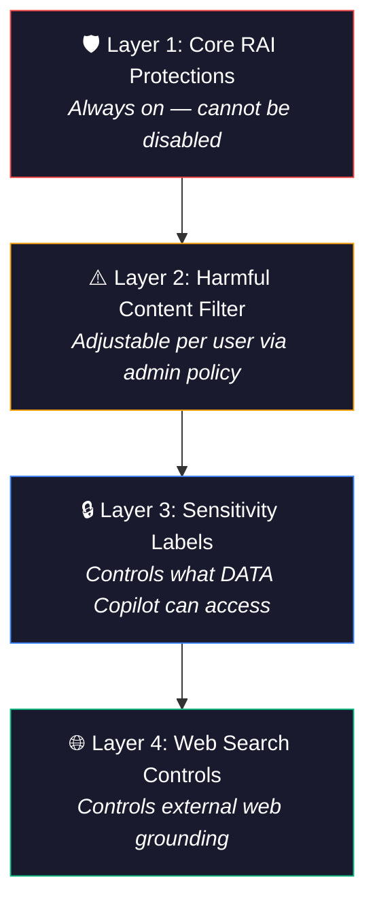
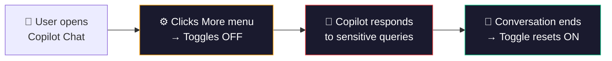
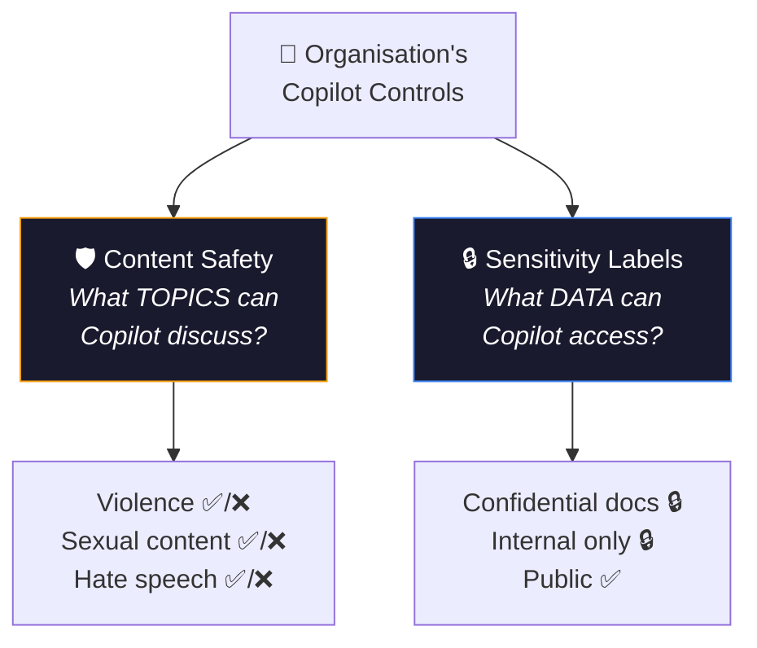

Microsoft 365 Copilot includes multiple layers of content safety controls — but most IT admins only know about one or two of them. With the introduction of the **harmful content protection toggle**, admins now have more granular control than ever over what Copilot can discuss. This guide covers every content safety lever available to you, when to use each one, and how to configure them step by step.

**Quick links:** [The 4 safety layers](#the-4-layers-of-copilot-content-safety) · [Harmful content toggle](#layer-2-harmful-content-protection-toggle) · [How to configure](#step-by-step-configuration) · [Sensitivity labels vs content safety](#sensitivity-labels-vs-content-safety--the-confusion-explained) · [Real-world scenarios](#real-world-scenarios) · [Best practices](#best-practices-for-it-admins) · [FAQ](#frequently-asked-questions)

---

## The 4 Layers of Copilot Content Safety

Microsoft 365 Copilot doesn't have just one safety system — it has **four distinct layers** that work together. Understanding which layer does what is essential for configuring Copilot correctly in your organisation.

| Layer | What It Controls | Can Be Disabled? | Configured Where |
|-------|-----------------|-----------------|-----------------|
| **1. Core RAI Protections** | Prompt injection, copyright, biosecurity, image safety | ❌ Never | Built into the platform |
| **2. Harmful Content Filter** | Violence, sexual content, hate speech, self-harm, fairness | ⚠️ Per-user toggle | Cloud Policy → Security group |
| **3. Sensitivity Labels** | What organisational data Copilot can access and surface | N/A (data classification) | Microsoft Purview |
| **4. Web Search Controls** | Whether Copilot can use web data in responses | ✅ On/off per org or user | Cloud Policy |

---

## Layer 1: Core Responsible AI Protections

These are built-in protections that **remain enforced and cannot be disabled** by any admin or user. They are always active regardless of any other setting.

| Protection | What It Blocks | Can Be Turned Off? |
|-----------|---------------|-------------------|
| **Prompt injection defence** | Attempts to manipulate Copilot into ignoring its safety rules | ❌ Never |
| **Copyright safeguards** | Copilot won't reproduce protected material verbatim | ❌ Never |
| **Biosecurity filters** | Content related to creating biological threats | ❌ Never |
| **Image safety** | Harmful, explicit, or violent image generation | ❌ Never |
| **Agent safety** | Agents/bots cannot bypass safety guardrails | ❌ Never |

> 💡 **Key takeaway:** No matter what else you configure, these five protections are always active. When discussing content safety with stakeholders, you can confidently say that Copilot has a non-negotiable safety floor.

---

## Layer 2: Harmful Content Protection Toggle

This is the newest and most significant admin control — introduced in **September 2025** via [Message Center post MC1133507](https://learn.microsoft.com/en-us/copilot/microsoft-365/harmful-content-protection-copilot-chat).

### What It Filters (When Enabled)

When harmful content protection is **on** (the default), Copilot Chat blocks or limits responses related to:

- 🔴 **Sexual material** — explicit or suggestive content
- 🔴 **Violence** — graphic descriptions of harm or injury
- 🔴 **Hate speech** — content targeting protected groups
- 🔴 **Self-harm** — content that promotes or describes self-harm
- 🔴 **Fairness concerns** — content that could be discriminatory

### What Happens When a User Disables It

When an authorised user turns the toggle **off** in Copilot Chat:

**Critical details:**

- The toggle applies to **the current conversation only**
- Once disabled in a conversation, it **cannot be re-enabled** until starting a new conversation
- Protection **automatically resets to ON** in every new conversation
- Only affects **text responses in Copilot Chat** — not images, not agents, not Copilot in other apps
- Core RAI protections (copyright, prompt injection, biosecurity) **remain active** regardless

### Who Should Get This?

This feature is designed for roles that **must** work with sensitive content as part of their job:

| Role | Scenario |
|------|----------|
| **Legal teams** | Reviewing case files involving violence or abuse |
| **Law enforcement** | Investigating criminal activity, analysing evidence |
| **Content moderators** | Screening user-generated content for policy violations |
| **Social workers** | Reviewing reports involving harm, abuse, or neglect |
| **Compliance teams** | Investigating workplace harassment or misconduct |
| **Policy/publication reviewers** | Reviewing publications or media for restricted or harmful content |
| **HR investigators** | Analysing complaints involving sensitive behaviour |
| **Journalism/media** | Fact-checking or summarising sensitive news stories |

---

## Step-by-Step Configuration

### Prerequisites

- ✅ Microsoft 365 Copilot licences assigned to target users
- ✅ **Office Apps Administrator** or **Global Administrator** role
- ✅ A security group in Entra ID for approved users

### Step 1: Create the Security Group

1. Go to **[Entra ID Admin Centre](https://entra.microsoft.com)** → Groups → New group
2. Group type: **Security**
3. Name: e.g., `Copilot - Reduced Content Safety`
4. Add **only** the users who need this capability
5. Save

> ⚠️ **Keep this group small.** Treat access like privileged admin access — only people whose role specifically requires reviewing sensitive content.

### Step 2: Configure the Policy

1. Go to **[config.office.com](https://config.office.com)** (Microsoft 365 Apps Admin Centre)
2. Navigate to **Customization** in the left nav
3. Select **Policy Management** → **Create** (or edit existing)
4. Search for: **"Adjust responsible AI protections for Microsoft 365 Copilot"**
5. Set Configuration setting to: **Enabled**
6. Under Options, select: **"Provide users with the option to adjust harmful content protection"**
7. Click **Apply**

### Step 3: Assign to the Security Group

1. In the same policy configuration, go to the **Assignments** section
2. Select the security group you created in Step 1
3. Save the policy

### Step 4: Verify

1. Ask a user in the security group to open **Copilot Chat**
2. They should see the **More** menu (⋯) in the top-right
3. Inside the menu, a **Harmful content protection** toggle should appear
4. The toggle should be **ON by default**

> 💡 **Policy propagation takes time.** Cloud Policy settings can take up to **24 hours** to apply. If the toggle doesn't appear immediately, wait and try again.

---

## Sensitivity Labels vs Content Safety — The Confusion Explained

These two features both include the word "sensitivity" and both relate to Copilot, but they do completely different things. This is the most common source of confusion.

| | Content Safety (Harmful Content Toggle) | Sensitivity Labels (Microsoft Purview) |
|---|---|---|
| **What it controls** | What **topics** Copilot will talk about | What **data** Copilot can access — honours existing permissions, encryption, and label-based restrictions |
| **Example problem** | "Copilot refuses to summarise a violent incident report" | "Copilot showed a confidential HR document to someone" |
| **Configured in** | Cloud Policy → per user/security group | Microsoft Purview → applied to documents, emails, sites |
| **Scope** | Copilot Chat text responses only | All Copilot interactions across all apps |
| **Licence needed** | M365 Copilot | M365 E3/E5 (Purview included) |
| **When to use** | Legal, law enforcement, content moderation scenarios | Always — should be deployed across your entire environment |

### Do You Need Both?

**Almost certainly yes**, especially for government and regulated organisations. Here's the relationship:

- **Sensitivity labels** add classification and protection — Copilot honours existing permissions, encryption, and label-based restrictions when deciding what data to surface
- **Content safety toggle** ensures authorised staff can review sensitive material without Copilot refusing

> 💡 **Best practice:** Deploy sensitivity labels **first** as your data governance foundation. Then enable the harmful content toggle **only** for the small group of users who need it.

---

## Layer 4: Web Search Controls

The next admin-configurable safety layer controls whether Copilot can use web data in its responses.

### Configuration Options

| Setting | Where | Effect |
|---------|-------|--------|
| **Allow web search in Copilot** | Cloud Policy | Master on/off for web grounding |
| **Web content toggle** (user) | M365 Copilot work chat only (not available in Copilot Chat) | Users can disable web content per session |
| **Enabled in Work mode + Web mode** | Cloud Policy option | Full web access everywhere |
| **Disabled in Work mode only** | Cloud Policy option | No web in Work mode; web available in Web mode and Copilot Chat |
| **Disabled everywhere** | Cloud Policy option | No web grounding at all |

### Government Cloud Default

For **GCC and DoD tenants**, web search is **off by default**. Admins must explicitly enable it via Cloud Policy.

---

## Real-World Scenarios

### Scenario 1: Content Moderation Team

> **Situation:** A trust and safety team needs Copilot to help analyse flagged user-generated content that may contain violence, hate speech, or other harmful material.

**Solution:**

1. Create a security group: `Content Moderation - Copilot Access` (small team only)
2. Assign the harmful content protection policy
3. Staff disable the toggle when reviewing flagged content, protection resets automatically next conversation
4. **Long-term:** Build a Copilot Studio agent with structured moderation criteria for a more consistent, auditable workflow

### Scenario 2: Legal Team Investigating Workplace Harassment

> **Situation:** Legal counsel needs Copilot to summarise employee complaints and witness statements that contain descriptions of harassment.

**Solution:**

1. Add legal counsel to the security group
2. They disable harmful content protection when reviewing case files
3. Sensitivity labels on the case files ensure only authorised legal staff can access them
4. **Both layers working together:** labels control who accesses the data, toggle controls whether Copilot can discuss the sensitive content

### Scenario 3: Government Compliance Officer

> **Situation:** A compliance officer needs to analyse social media posts for hate speech as part of an investigation.

**Solution:**

1. Add the officer to the security group
2. Disable web search for general users but **enable it for this officer** (so Copilot can access the web content)
3. Enable the harmful content toggle so Copilot can analyse hate speech without refusing
4. All interactions are logged in Purview for the audit trail

### Scenario 4: Standard Office Workers (No Changes Needed)

> **Situation:** 99% of your users just use Copilot for emails, meeting summaries, and document drafting.

**Solution:**

- ✅ Leave all defaults in place
- ✅ Deploy sensitivity labels on organisational data
- ✅ No harmful content toggle needed
- ✅ Web search on (default)

---

## Best Practices for IT Admins

### ✅ Do

| Practice | Why |
|----------|-----|
| **Keep the security group small** | Treat it like privileged access — quarterly reviews |
| **Name the group clearly** | e.g., `Copilot - Reduced Content Safety` so it's obvious in audit |
| **Deploy sensitivity labels first** | Data governance is your foundation before adjusting content filters |
| **Document your policy** | Write an internal policy explaining who has access and why |
| **Enable Purview audit logging** | Track all Copilot interactions for compliance |
| **Train authorised users** | Explain the toggle, what it does, and organisational expectations |
| **Review the group quarterly** | Remove users who no longer need access |

### ❌ Don't

| Anti-Pattern | Risk |
|-------------|------|
| **Don't add the whole org to the security group** | Defeats the purpose — exposure to harmful content |
| **Don't skip sensitivity labels** | Content toggle without data governance = uncontrolled risk |
| **Don't forget to communicate** | Users with the toggle need to understand their responsibilities |
| **Don't assume it covers images** | Image and agent protections are always enforced regardless |
| **Don't treat this as "disabling safety"** | Core RAI protections remain active — this only adjusts the harmful content filter |

---

## What Copilot Blocks — The Content Categories

Copilot has two distinct sets of safety controls. It's important to understand which ones can be adjusted and which cannot.

### Harmful Content Filter Categories (Adjustable via Toggle)

These are the categories controlled by the harmful content protection toggle. When the toggle is **on** (default), Copilot blocks or limits these. When an authorised user turns it **off**, Copilot can respond to queries in these areas:

| Category | Examples |
|----------|---------|
| **Sexual content** | Explicit descriptions, suggestive material |
| **Violence** | Graphic injury, weapons, harm |
| **Hate speech** | Content targeting race, religion, gender, etc. |
| **Self-harm** | Suicide, self-injury promotion |
| **Fairness** | Discriminatory or biased content |

### Always-On Safeguards (Cannot Be Disabled)

These protections are separate from the harmful content filter. They remain enforced at all times, regardless of the toggle setting:

| Safeguard | What It Prevents |
|-----------|-----------------|
| **Prompt injection / jailbreak defence** | Attempts to manipulate Copilot into ignoring safety rules |
| **Protected material detection** | Reproducing copyrighted content verbatim |
| **Biosecurity protections** | Content related to creating biological threats |
| **Image safety filters** | Harmful, explicit, or violent AI-generated imagery |
| **Agent safety guardrails** | Agents/bots bypassing safety boundaries |

---

## Complete Admin Checklist

Use this checklist when configuring content safety for your organisation:

- [ ] **Audit your current state** — check if any policies are already in Cloud Policy
- [ ] **Deploy sensitivity labels** via Microsoft Purview (if not already done)
- [ ] **Identify who needs the harmful content toggle** — specific roles, not departments
- [ ] **Create a dedicated Entra ID security group** with only those users
- [ ] **Configure the Cloud Policy** at config.office.com
- [ ] **Assign the policy to the security group**
- [ ] **Verify the toggle appears** for a test user (allow 24 hours for propagation)
- [ ] **Document your policy** — who has access, why, review schedule
- [ ] **Configure web search controls** per your organisation's data handling requirements
- [ ] **Enable Copilot audit logging** in Microsoft Purview
- [ ] **Set a quarterly review** for the security group membership
- [ ] **Train authorised users** on the toggle, its scope, and their responsibilities

---

## Beyond Content Safety — Other Critical Admin Controls

Content safety is just one piece of a secure Copilot deployment. These additional controls are equally important and should be configured as part of your overall governance strategy:

| Control | What It Does | Where to Configure |
|---------|-------------|-------------------|
| **DLP for Copilot prompts** | Prevent sensitive data from being included in Copilot prompts and responses | Microsoft Purview → DLP policies |
| **Oversharing governance** | Ensure SharePoint/OneDrive permissions are correct — Copilot surfaces anything a user can access | SharePoint Admin Centre + access reviews |
| **Retention policies** | Control how long Copilot interactions are retained | Microsoft Purview → Retention |
| **eDiscovery** | Search and export Copilot prompts and responses for legal/compliance | Microsoft Purview → eDiscovery |
| **Audit logging** | Track Copilot usage, prompts, and responses (subject to Purview configuration and licensing) | Microsoft Purview → Audit |
| **DSPM for AI** | Monitor and manage AI-related data security posture | Microsoft Purview → Data Security Posture Management |

> 💡 **The most common Copilot security issue isn't content safety — it's oversharing.** If your SharePoint permissions are too broad, Copilot will surface documents that users technically have access to but shouldn't see. Fix permissions **before** scaling Copilot.

---

## Summary Table — All Content Safety Controls at a Glance

| Control | What It Does | Where to Configure | Scope | Default |
|---------|-------------|-------------------|-------|---------|
| **Core RAI protections** | Blocks prompt injection, copyright, biosecurity | N/A (always on) | All Copilot | Always ON |
| **Harmful content filter** | Blocks violence, sexual, hate, self-harm | Cloud Policy → per security group | Copilot Chat text only | ON (toggle for approved users) |
| **Sensitivity labels** | Adds classification and protection to data | Microsoft Purview | All Copilot + all M365 | Off until deployed |
| **Web search** | Controls web grounding in responses | Cloud Policy → org or per group | Copilot Chat + Work mode | ON (OFF for GCC/DoD) |
| **DLP policies** | Prevents sensitive data in prompts/responses | Microsoft Purview | All Copilot | Off until configured |
| **Optional connected experiences** | Master switch for many Copilot features | Group Policy / Cloud Policy | All M365 apps | ON |

---

> **Disclaimer:** The views and opinions expressed in this article are my own and do not represent the official positions of Microsoft. This article is not legal, compliance, or product-commitment advice. All information was sourced from official Microsoft documentation at the time of writing — features, settings, and availability are subject to change and may vary by cloud environment, tenant, and licensing. Always refer to [official Microsoft documentation](https://learn.microsoft.com) for the most up-to-date information.
