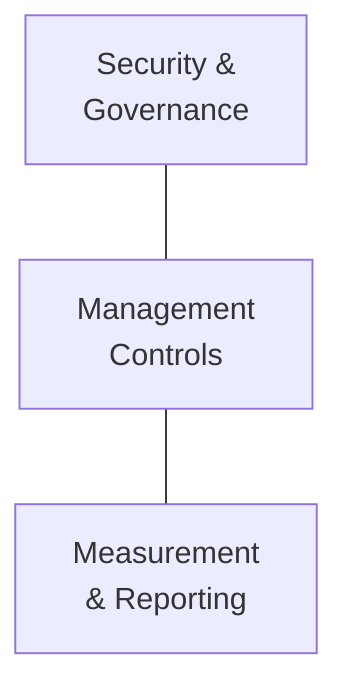

Here's a conversation I keep having. An IT admin tells me: "We've deployed Copilot. It's great. People love it." And then they pause and say: "But my CISO just asked me — how do we actually *govern* this thing?"

That question — **how do we control AI safely at enterprise scale?** — is exactly what the Copilot Control System answers. And if you're also hearing about Agent 365 and wondering how the two fit together (or if one replaces the other), you're not alone. I've seen this confuse Microsoft partners, IT pros, and even some folks inside Microsoft.

Let me untangle it for you.

**Quick links:** [TL;DR](#tldr--the-30-second-version) · [What is CCS?](#so-what-is-ccs-really) · [The 3 buckets](#the-3-buckets-i-use-to-explain-ccs) · [CCS vs Agent 365](#ccs-vs-agent-365--complement-not-conflict) · [Licensing](#what-licence-do-you-need) · [Real scenarios](#three-stories-that-make-this-real) · [What to do now](#what-should-you-do-now) · [FAQ](#questions-people-always-ask-me)

This is a living document. The AI governance landscape is evolving fast — features ship, names change, and guidance evolves. If you spot anything out of date, please [send me feedback](/feedback/) and I'll update it. Last verified: April 2026.

---

## TL;DR — The 30-Second Version

If someone stops you in the hallway and asks "what's the Copilot Control System?" — here's your answer:

| | Copilot Control System (CCS) | Agent 365 |
|---|---|---|
| **What it is** | A governance framework | A product (SKU) |
| **What it governs** | How people use Copilot | How AI agents work for people |
| **Is it new to buy?** | No — uses your existing licences | Yes — $15/user/month (or in E7) |
| **3 pillars** | Security · Management · Measurement | Registry · Identity · Lifecycle |
| **Who needs it** | Everyone using Copilot | Organisations deploying agents at scale |
| **Where it lives** | M365 Admin, Purview, Defender, SharePoint | M365 Admin Center ("Agents" blade) |

> 📌 **The one-liner to remember:** CCS governs **people using AI**. Agent 365 governs **AI working for people**. Together, they cover the full spectrum.

---

## So What Is CCS, Really?

Let's start with what CCS is *not* — because that clears up most of the confusion.

- ❌ It's **not** a product
- ❌ It's **not** a new licence or SKU
- ❌ It's **not** a single admin portal

CCS is a **governance framework**. It's a collection of controls and capabilities that are spread across tools you probably already use — the Microsoft 365 Admin Center, Microsoft Purview, Microsoft Defender, SharePoint Admin, and the Power Platform Admin Center.

### The Hotel Analogy

Think of your organisation like a hotel. You've just installed a brilliant AI concierge (Copilot) in the lobby. Guests love it — it answers questions, finds information, and helps people work faster.

But the hotel manager has questions:

- **"Who's allowed to use the concierge?"** → That's management controls
- **"Is it accidentally sharing guest information with the wrong people?"** → That's security and governance
- **"How many guests used it today? Are they happier?"** → That's measurement and reporting

**CCS is the hotel's operations manual.** It doesn't *make* the coffee or *answer* the questions. It makes sure the AI concierge is **safe, managed, and measurable**.

Without CCS: You have a powerful AI assistant with no guardrails.
With CCS: You have an **enterprise-grade AI platform** that your CISO can actually sign off on.

### Where CCS Actually Shows Up

CCS provides governance for:

- ✅ **Microsoft 365 Copilot** (in Word, Excel, PowerPoint, Outlook, Teams, OneNote)
- ✅ **Copilot Chat** (the standalone web and mobile experience)
- ✅ **Microsoft prebuilt agents** (the ones that come out of the box)
- ✅ **Copilot Studio agents** published to Microsoft 365

---

## The 3 Buckets I Use to Explain CCS

When I explain CCS to customers, I break it into three buckets. Each one answers a different question your leadership team will ask.

### 🔐 Pillar 1: Security & Governance

This is the one every CISO asks me about first. And honestly, it's the most important one to get right.

**The question it answers:** *"Is Copilot safe to use with our data?"*

When you deploy Copilot, people start interacting with organisational data in new ways. That creates new risks. Here's what this pillar includes:

| Capability | What It Does | Where to Configure |
|-----------|-------------|-------------------|
| **Data security** | Prevent sensitive data from being surfaced in Copilot responses | Purview DLP, Sensitivity Labels |
| **AI security** | Detect risky prompts, anomalous AI behaviour, prompt injection attempts | Defender XDR, Purview Insider Risk |
| **Compliance & privacy** | Retain and log Copilot interactions, eDiscovery, audit trails | Purview Compliance, Audit Logs |
| **Oversharing detection** | Find broadly shared content that Copilot could surface | SharePoint Advanced Management |
| **Prompt-level DLP** | Block Copilot from returning responses grounded in sensitive data (some features still in preview) | Purview DLP for Copilot |

> 💡 **The thing most admins miss:** The biggest "Copilot security risk" isn't actually a Copilot problem. It's an oversharing problem that already existed — Copilot just makes it visible. If someone in Marketing can already access the CEO's performance reviews in SharePoint, Copilot will surface that document when asked. Fix permissions first, then layer Copilot on top.

### ⚙️ Pillar 2: Management Controls

I call this the "who gets what" pillar. It's less glamorous than security, but it's where most of the day-to-day admin work happens.

**The question it answers:** *"Who gets Copilot, and what can they do with it?"*

Back to the hotel analogy: this is about deciding which guests get a room key, which floors they can access, and what time the restaurant opens.

When I walk admins through this, these are the controls I point to first:

| Capability | What It Does |
|-----------|-------------|
| **Licensing governance** | Deploy Copilot licences to the right users, track utilisation |
| **Agent lifecycle** | Manage agent creation, approval, publishing, and retirement |
| **Access control** | Control who can use which AI capabilities (role-based, group-based) |
| **Policy enforcement** | Connection approvals, agent publishing controls, data flow rules |
| **Controlled rollout** | Phase deployment by department, geography, or user group |

These controls live across the M365 Admin Center, Power Platform Admin Center, and SharePoint Admin Center.

> 📌 **My recommendation:** Never go tenant-wide on day one. Start with IT or a pilot group, get comfortable with the controls, then expand. Every organisation I've seen rush a Copilot rollout regretted it.

### 📊 Pillar 3: Measurement & Reporting

This is the pillar people ignore — until renewal season. Then suddenly everyone wants numbers.

**The question it answers:** *"Is Copilot actually working? Can we prove it?"*

This is the pillar that gets you budget for year two. Your CFO doesn't care about features — they care about impact. Here's what you can measure:

| Capability | What It Does |
|-----------|-------------|
| **Readiness tracking** | Are permissions clean? Is data labelled? Ready for rollout? |
| **Adoption metrics** | Who's using Copilot? How often? Which features? |
| **Productivity impact** | Time saved, meetings summarised, emails drafted |
| **Business value / ROI** | Demonstrate tangible returns to leadership |
| **Licence optimisation** | Identify underutilised licences and reassign to active users |

The main tool here is **Copilot Analytics**, available in the M365 Admin Center and through Viva Insights.

> Situation: Your CIO asks in a quarterly review: "We spent $360,000 on Copilot licences last year. What did we get for it?" Without Pillar 3, you're scrambling for anecdotes. *With* Pillar 3, you pull up a dashboard showing 29% faster task completion, 40% of users active weekly, and 14,000 hours of meetings summarised. That's not a cost — that's an investment with receipts.

---

## CCS vs Agent 365 — Complement, Not Conflict

This is the section that matters most. If you've been hearing about both CCS and Agent 365, you're probably wondering: do I need one, or both? Is one replacing the other?

I totally understand the confusion. Here's the simple version.

### The Mental Model

Imagine your organisation as a company that has both **human employees** and **robot workers**.

- **CCS** is your **HR department** — it manages how humans interact with AI tools. Who gets access? What data can they reach? Are they using it appropriately?
- **Agent 365** is your **robot workforce management system** — it manages the robots themselves. Which robots do you have? What are they allowed to do? Who built them? Are any going rogue?

Different things being governed. Same goal: keeping your organisation safe.

### Here's the Simplest Way to Compare Them

Here's the honest comparison — no marketing fluff:

| | Copilot Control System | Agent 365 |
|---|---|---|
| **Type** | Framework (not a product) | Product (SKU) |
| **Governs** | The Copilot experience (how people use AI) | Agent execution (how AI works for people) |
| **Identity** | Users have Entra ID | Agents get **Entra Agent ID** (new!) |
| **Security** | Prompt-level DLP, audit, compliance | Agent threat detection, quarantine |
| **Analytics** | Copilot usage and adoption | Agent performance and observability |
| **Lifecycle** | Licence assignment, feature controls | Agent creation → deployment → retirement |
| **Cost** | Included with existing M365 licences | [$15/user/month](https://www.microsoft.com/en-us/microsoft-agent-365) or included in [E7](https://www.microsoft.com/en-us/microsoft-365/enterprise/e7) |
| **Admin portal** | M365 Admin, Purview, Defender, SharePoint | M365 Admin Center (new "Agents" blade) |
| **GA status** | Available now | [May 1, 2026](https://www.microsoft.com/en-us/microsoft-365/blog/2025/11/18/microsoft-agent-365-the-control-plane-for-ai-agents/) |

### When Do You Need Which?

Not everyone needs both. Here's the honest assessment:

| Your Situation | What You Need |
|---------------|-------------|
| Deploying Copilot only | **CCS** — and you probably already have it |
| Copilot + a few Copilot Studio agents | **CCS** + start thinking about Agent 365 |
| Copilot + lots of agents from multiple sources | **CCS + Agent 365** (or Microsoft 365 E7) |
| Enterprise-scale AI with autonomous agents | **E7** — gets you everything in one bundle |

### So Why Did Microsoft Split These Up?

This is worth understanding. CCS and Agent 365 solve fundamentally different problems:

**CCS** exists because organisations deploying Copilot need answers to: "How do we protect our data? Who can use what? Is it working?" These are **human-centric** governance questions.

**Agent 365** exists because the world is moving from "AI that helps humans" to "AI that works alongside humans." When you have 50 AI agents running across your organisation — some built by IT, some by Marketing, some from vendors — somebody needs to keep track. You need a way to manage agents like you manage devices with Intune or users with Entra.

> 💡 **The analogy I use with customers:** Entra manages human identities. Intune manages devices. Agent 365 manages AI agents. CCS is the governance layer that sits across the top, making sure the *human* experience with all of this is secure and measurable.

---

## What Licence Do You Need?

Here's the part nobody seems to explain clearly. Since CCS isn't a product, what you "get" depends on what you already own:

| Capability | E3 + Copilot | E5 + Copilot | E7 |
|-----------|:---:|:---:|:---:|
| **Basic admin controls** (M365 Admin Center) | ✅ | ✅ | ✅ |
| **SharePoint permission management** | ✅ | ✅ | ✅ |
| **Copilot Analytics** (usage dashboards) | ✅ | ✅ | ✅ |
| **SharePoint Advanced Management** (oversharing) | ✅ | ✅ | ✅ |
| **Baseline DLP** (SharePoint, Exchange, OneDrive) | ✅ Basic | ✅ Advanced | ✅ Advanced |
| **Purview DLP for Copilot prompts** | ❌ | ✅ (partially in preview) | ✅ (partially in preview) |
| **Defender XDR** (AI threat detection) | ❌ | ✅ | ✅ |
| **Purview Insider Risk** | ❌ | ✅ | ✅ |
| **eDiscovery** (legal/compliance review) | ✅ Standard | ✅ Premium | ✅ Premium |
| **Advanced audit** | ❌ | ✅ | ✅ |
| **Agent 365** (agent governance) | ❌ | ❌ (add-on $15) | ✅ Included |
| **Full Entra Suite** | ❌ | ❌ (add-on $12) | ✅ Included |

> 💡 **The bottom line:** Most organisations on E5 + Copilot already have a very solid CCS foundation. The jump to E7 makes sense when you need Agent 365 and the Entra Suite — and at $99/month compared to buying E5 ($60) + Copilot ($30) + Agent 365 ($15) + Entra Suite ($12) separately ($117/month), the bundle saves you real money.

For a deeper dive into E7, check out my [complete E7 guide](/blog/microsoft-365-e7-frontier-suite-everything-you-need-to-know/).

---

## Three Stories That Make This Real

I learn best from real examples, and I'm guessing you do too. These are based on conversations I've had with customers and partners — names changed, obviously.

### Sarah Asks Copilot One Innocent Question

> Situation: Sarah is an HR manager at a 2,000-person company. She types a simple prompt into Copilot: "Summarise recent company strategy documents." What comes back shocks her — extracts from confidential board meeting minutes. Her manager sees this. The CISO gets called. Suddenly, the entire Copilot rollout is on the line.
>
> **What actually happened:** The board documents lived in a SharePoint site with overly broad permissions. Anyone in the company could technically access them. Nobody noticed until Copilot made it easy to find.
>
> **What CCS would have caught:** SharePoint Advanced Management would have flagged this oversharing *before* Copilot was deployed. Sensitivity labels on the documents would have blocked Copilot from surfacing them. Purview DLP could have stopped the response in real time.
>
> **The real lesson:** Copilot didn't create this problem. It revealed a problem that was always there. CCS helps you fix the root cause — not just slap a band-aid on the symptom.

### James Has 500 Licences and 80 Users

> Situation: James is an IT Director who fought hard to get 500 Copilot licences approved. Three months later, his CFO asks for a usage report. James pulls up the admin center and his stomach drops — only 80 people used Copilot last month. That's $12,600/month for 80 users. Not a great look.
>
> **What Copilot Analytics showed him:** Sales adopted Copilot immediately — demos and email drafting were easy wins. But Finance never got proper training. They didn't know what to ask Copilot for. Marketing was somewhere in between.
>
> Armed with this data, James reassigned 200 unused licences back to the pool, ran targeted training for Finance, and presented a revised adoption plan. His next quarterly report showed 340 active users. The CFO was happy. James kept his budget.

### Marketing Built 5 Agents and IT Had No Idea

> Situation: The Marketing team at a financial services company got creative. They built five Copilot Studio agents — campaign planning, social media scheduling, brand guidelines, competitive analysis, and one that could access customer data for segmentation. Nobody told IT. IT found out when one of the agents accidentally emailed a customer list to an external vendor. Compliance was not pleased.
>
> **Where both CCS and Agent 365 come in:** CCS management controls would have required approval before agents could be published. Agent 365 would have registered each agent in a central catalog, given them unique identities, and applied governance policies. The agent touching customer data would have been flagged by Defender. Conditional Access would have restricted what data it could reach.
>
> **The takeaway:** This is where CCS and Agent 365 overlap — and where organisations with lots of agents need both. CCS handles the governance policies. Agent 365 handles the agent lifecycle.

---

## What Should You Do Now?

Whether you're just starting your Copilot journey or already deep into agents, here are the practical steps:

### If You're Rolling Out Copilot Today

1. **Audit SharePoint permissions** — This is step zero. Find and fix oversharing before Copilot makes it visible. Use SharePoint Advanced Management if you have it.
2. **Deploy sensitivity labels** — If you haven't already, label your sensitive content. Copilot respects these labels.
3. **Set up Copilot Analytics** — Turn on the dashboards in the M365 Admin Center so you can track adoption from day one.
4. **Plan a phased rollout** — Start with a pilot group. Use Conditional Access and licence groups to control who gets Copilot and when.
5. **Review Purview DLP policies** — If you have E5, configure DLP policies for Copilot prompts (note: some features are still rolling out from preview). This is your real-time safety net.

### If Agents Are Starting to Pop Up Everywhere

1. **Inventory your agents** — Do you know how many agents exist in your org? Who built them? What data they access? If you can't answer these questions, you have agent sprawl.
2. **Evaluate Agent 365** — [GA is May 1, 2026](https://www.microsoft.com/en-us/microsoft-agent-365). The standalone price is $15/user/month. If you're also considering E7, the bundle math might work better.
3. **Define agent governance policies** — Before deploying Agent 365, decide: Who can create agents? What approval process do they go through? What data can agents access?
4. **Connect to your security stack** — Agent 365 integrates with Defender and Purview. Make sure your security team is in the conversation early.

> 📚 **Related reading:**
> - [Microsoft 365 E7 (Frontier Suite) — Everything You Need to Know](/blog/microsoft-365-e7-frontier-suite-everything-you-need-to-know/)
> - [Copilot Content Safety Controls — Complete Guide for Admins](/blog/microsoft-365-copilot-content-safety-controls-complete-guide-for-admins/)
> - [Copilot Deployment Best Practices — Ultimate Checklist](/blog/microsoft-365-copilot-deployment-best-practices-ultimate-checklist/)
> - [Copilot Control System overview — Microsoft Learn](https://learn.microsoft.com/en-us/copilot/microsoft-365/copilot-control-system/overview)

---

## Questions People Always Ask Me

These are the questions I keep hearing — from customers, partners, and fellow IT pros. If your question isn't here, [send me feedback](/feedback/) and I'll add it.

**1. What is the Copilot Control System?**

The Copilot Control System (CCS) is a governance framework — not a product and not a separate licence. It's a collection of integrated controls across Microsoft 365 that help IT teams secure, manage, and measure how people use Copilot and agents. Think of it as the operations manual for AI in your organisation. The controls live inside tools you probably already own — the M365 Admin Center, Purview, Defender, SharePoint Admin, and Power Platform Admin Center.

**2. Is CCS a product I need to buy?**

No — and this is the part that surprises most people. CCS is not a SKU. There's nothing to purchase separately. The capabilities are distributed across your existing Microsoft 365 licences. E3 already gives you basic DLP, eDiscovery, and admin controls. E5 significantly expands those with advanced Purview, Defender, and compliance features. Adding a Copilot licence unlocks Copilot Analytics and SharePoint Advanced Management. You're probably already paying for most of CCS without realising it.

**3. How is CCS different from Agent 365?**

The simplest way to remember it: CCS governs how **people use AI** (the Copilot experience), while Agent 365 governs how **AI works for people** (agents acting autonomously). CCS is a framework built into your existing licences. Agent 365 is a product you buy separately at $15/user/month (or get included with Microsoft 365 E7). If you only use Copilot, CCS has you covered. The moment you start deploying AI agents at scale, Agent 365 becomes essential.

**4. Do I need both CCS and Agent 365?**

It depends on where you are in your AI journey. If you're only deploying Microsoft 365 Copilot today, CCS gives you everything you need — data protection, compliance, usage analytics. But if your organisation is building or deploying AI agents (through Copilot Studio, third-party tools, or custom solutions), you'll want Agent 365 for agent identity, lifecycle management, and centralised governance. They complement each other — they're not competing products.

**5. What licence do I need for CCS capabilities?**

CCS capabilities scale with your existing licences. E3 with Copilot gives you basic admin controls, SharePoint management, baseline DLP, and standard eDiscovery. E5 with Copilot expands significantly — advanced Purview DLP (including for Copilot prompts), Defender XDR, Insider Risk Management, advanced eDiscovery, and full audit. Copilot Analytics is included with the Copilot licence itself. No separate CCS licence to buy.

**6. What are the 3 pillars of CCS?**

Security and Governance (protecting data, detecting risky AI behaviour, ensuring compliance), Management Controls (deciding who gets Copilot, managing agents, controlling rollout), and Measurement and Reporting (tracking adoption, measuring productivity impact, demonstrating ROI). Together, they answer the three questions every CISO asks: Is it safe? Who controls it? Is it working?

**7. Can CCS prevent Copilot from leaking sensitive data?**

Yes — through multiple layers. Copilot already respects your existing permissions (it can only access what a user can access). Sensitivity labels add another layer of data classification. Purview DLP policies can detect sensitive information in Copilot prompts and block responses grounded in that data. SharePoint Advanced Management helps you find overshared content before Copilot surfaces it. The key insight: most "Copilot data leakage" is actually a pre-existing oversharing problem that Copilot makes visible.

**8. When does Agent 365 become available?**

Agent 365 reaches general availability on May 1, 2026. It will be available as a standalone add-on at $15/user/month for any Microsoft 365 plan that includes Copilot, or included in the new [Microsoft 365 E7](https://www.microsoft.com/en-us/microsoft-365/enterprise/e7) at $99/user/month.

---

> Disclaimer: This blog is my personal take based on what I've seen working with customers and partners. It doesn't represent official Microsoft guidance. Always check [Microsoft Learn](https://learn.microsoft.com/en-us/copilot/microsoft-365/copilot-control-system/overview) for the latest official documentation and confirm details with your Microsoft account team.
