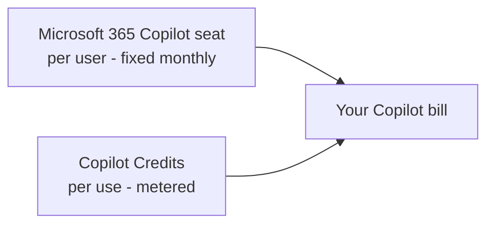
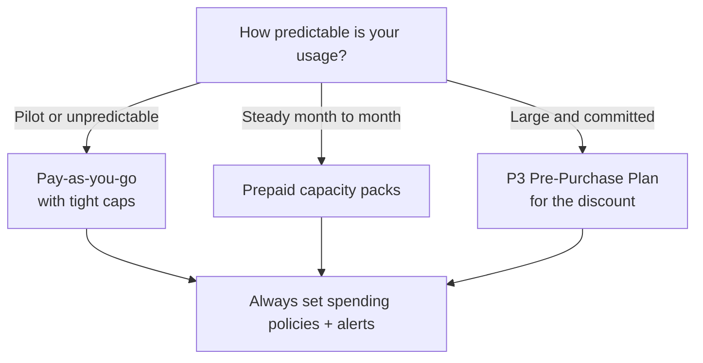

🔄 **Part of the [Microsoft Copilot Pricing & Tiers](/blog/microsoft-copilot-pricing-tiers-explained/) series.** Prices are published US list rates, current as of June 2026; actual pricing varies by currency, region and agreement, and Microsoft's figures are estimates, not quotes. Confirm in [Microsoft Learn — usage-based billing](https://learn.microsoft.com/en-us/microsoft-365/copilot/usage-based-billing-overview-copilot-credits). **Last verified: 25 June 2026.**

**The short version:** Microsoft 365 Copilot now has *two* kinds of cost — the **per-user seat** you already know, and **usage-based Copilot Credits** for the agent work it runs — today Copilot Cowork and the Work IQ API, with more services to come. This page is the admin's guide to the second one: how you're billed, how you choose a billing model, where you control it, and how to roll it out without a surprise invoice.

> 🧭 **Jump to:** [Setup by scenario](#setup) · [Billing models](#billing-models) · [The P1/P2/P3 myth](#p1-p2-p3) · [P3 &amp; CCCUs](#p3-cccu) · [Dashboard walkthrough](#walkthrough) · [Common mistakes](#mistakes) · [Hitting a limit](#limits) · [Where charges land](#charges) · [Admin roles](#roles) · [Procurement](#procurement) · [Rollout](#rollout) · [Sources](#sources)

---

## TL;DR

- Microsoft 365 Copilot has **two cost layers**: the **per-user seat** (fixed) and **Copilot Credits** for usage-based agent work (metered).
- Credits are managed in **two admin surfaces**: the **Microsoft 365 admin center → Cost Management** (for Cowork, Work IQ API) and the **Power Platform admin center** (for Copilot Studio agents). They coexist without double-charging.
- **Three ways to pay:** pay-as-you-go ($0.01/credit), prepaid **capacity packs** ($200 / 25,000 credits a month, no rollover), or the annual **P3 Pre-Purchase Plan** (discounted by volume).
- **There is no Copilot P1 or P2.** "P3" is just the name of the Pre-Purchase Plan. The P1/P2 you remember were retired Power Apps/Power Automate plans — unrelated.
- The new **Cost Management dashboard** lets you set **spending policies** (tenant, group, user), **hard caps**, **alerts**, and watch consumption on **Overview** and **Consumption** tabs.
- **Limits are hard.** Hit the cap and metered services pause until the first of the month; users can request more from inside the experience.
- **Pilot first:** scope a Specific-groups policy, set a cap and alerts, watch the spend, then expand.

> ⚡ **In a hurry?** Jump to **[recommended setup by scenario](#setup)** or the **[safe rollout pattern](#rollout)**.

---

## If you only need the answer — recommended setup by scenario {#setup}

Skip the theory and start here. Match your situation to a setup, then read on for the *why*.

| Your situation | Recommended setup |
|---|---|
| **Pilot or unknown usage** | **Pay-as-you-go**, scoped to a **Specific-groups** policy, with a **low monthly cap + per-user cap** and alerts. Review after 2–4 weeks. |
| **Steady, predictable usage** | **Prepaid capacity packs** sized to your **floor, not your peak** — keep pay-as-you-go on for controlled overage. |
| **Large, committed rollout** | Model your **annual burn**, confirm **MACC / discount** treatment with licensing, then commit to a **P3 pre-purchase**. |
| **Never** | A **tenant-wide, uncapped pay-as-you-go** policy — the one reliable way to get a surprise bill. |

Everything below explains how these pieces work and how to set them up.

---

## Two kinds of money: seats vs credits {#two-kinds}

The single thing that unlocks every other decision: Copilot now bills in **two layers**.

- **The seat** is a per-user subscription (the Microsoft 365 Copilot licence, list $30/user/month). It's the *entry point* — it unlocks the experiences. Predictable, fixed, easy to budget.
- **Copilot Credits** are a **meter** — the unit consumed when an agent does work: a Cowork task, a Work IQ API call, a Copilot Studio agent action. Variable, usage-based, and the part that needs *controls*.

The clean mental model: **seat = access · credit = usage meter · spending policy = permission to spend · Azure / Microsoft 365 invoice = where the charge lands.** Get those four straight and the rest falls into place.

> 🧩 **What's a credit, exactly?** A Copilot Credit is one unit on the meter; pay-as-you-go it's **$0.01**, and different actions cost different amounts. This page is about **billing and control** — for what a single credit *is* and the full per-action rate card, see **[What Are Copilot Credits? Rates & Costs](/blog/copilot-credits-explained/)**.

> 🧩 **Not everything touches the meter.** A lot of internal, licensed, in-Microsoft-365 agent use is **zero-rated** within fair-use limits — employee-facing agents inside Microsoft 365 Copilot, Teams, or SharePoint. You mainly pay credits for **external or customer-facing** agents, **unlicensed** users, and runs **not tied to a licensed user's identity**. The full "is this zero-rated?" decision table lives on the credits page — see **[What Are Copilot Credits? → what's zero-rated](/blog/copilot-credits-explained/#not)**.

The rest of this guide is about the credits layer: where you manage it, how you pay for it, and how you keep it under control.

---

## Where cost management actually lives — the two admin centers {#surfaces}

This trips people up, so let's be clear: there are **two** places Copilot billing is managed, and which one you use depends on the workload.

The quick abstraction: **the Microsoft 365 admin center is where you control *who can spend*; Azure is where much of the money *lands*.** Power Platform is the older control surface, for Copilot Studio environments.

| | **Microsoft 365 admin center** | **Power Platform admin center** |
|---|---|---|
| **URL** | admin.microsoft.com → **Copilot → Cost Management** | admin.powerplatform.microsoft.com → **Licensing → Copilot Studio** |
| **Best for** | Usage-based services: **Copilot Cowork, Work IQ API** (and more to come) | **Copilot Studio** agents and environments |
| **What you do there** | Activate usage-based billing, set spending policies, budgets, alerts, view Overview + Consumption | Allocate credits to environments, set pay-as-you-go billing policies, per-agent caps |
| **Newer or older** | The newer, unified experience (2026) | The longer-standing surface for Power Platform |

The Microsoft 365 admin center experience is the new **dedicated Cost Management dashboard** ([Microsoft Learn](https://learn.microsoft.com/en-us/microsoft-365/copilot/usage-based-billing-overview-copilot-credits)). It's where Cowork and the Work IQ API are governed today, and Microsoft has said more agents and services will be added over time.

> 📎 **Both can run at once.** If you manage some billing in each surface, Microsoft says its billing system ensures you're **only charged once**, wherever you configure the policy ([Microsoft Learn](https://learn.microsoft.com/en-us/copilot/microsoft-365/pay-as-you-go/setup)). Its advice is to keep it simple and standardise on one surface where you can.

---

## Choosing a billing model: pay-as-you-go, capacity packs, or P3 {#billing-models}

There are three ways to pay for Copilot Credits. This is a *procurement* decision — pick based on how predictable your usage is and how much commitment you want.

| Model | What it is | Price (US list, Jun 2026) | Cadence | Rolls over? |
|---|---|---|---|---|
| **Pay-as-you-go** | Billed for exactly what you use, via an Azure subscription | **$0.01 / credit** | Monthly, in arrears | n/a — you only pay for use |
| **Prepaid capacity pack** | A monthly block of credits, bought up front | **$200 / 25,000 credits** (~$0.008/credit) | Monthly, in advance | **No** — unused credits are lost at month end |
| **P3 Pre-Purchase Plan** | An annual prepaid commitment (CCCUs), bought as an Azure reservation | Tiered — bigger commit, bigger discount | **Annual** | Drawn down over the 1-year term |

### Which one should you pick?

- **Pilot or unpredictable usage** → **pay-as-you-go**, with tight tenant/group caps so a pilot can't surprise you.
- **Steady, predictable usage** → **prepaid capacity packs** at ~$0.008/credit, but remember they **don't roll over**, so size them to your floor, not your peak.
- **Large, committed rollout** → the **P3 Pre-Purchase Plan** for the volume discount (details [below](#p3-cccu)).

### The billing order, if you have more than one

If you've got capacity packs *and* a subscription with P3 credits *and* pay-as-you-go enabled, Microsoft draws them down in a fixed order to keep spend predictable ([Microsoft Learn](https://learn.microsoft.com/en-us/microsoft-365/copilot/usage-based-billing-manage-copilot-credits)):

> **Capacity packs → P3 prepaid credits → pay-as-you-go.**

So prepaid money is always spent first, and pay-as-you-go only kicks in as overage once the prepaid is gone.

Quick break-even: a $200 pack (25,000 credits) beats pay-as-you-go once you use **more than 20,000 credits a month** (20,000 × $0.01 = $200). Below that, pay-as-you-go is cheaper and has nothing to waste.

**Example — same spend, different model.** Say a pilot burns **80,000 credits a month**:

- **Pay-as-you-go:** 80,000 × $0.01 = **$800/month**, nothing wasted.
- **Capacity packs:** 4 × $200 = **$800/month** for 100,000 credits — but the 20,000 you don't use vanish at month end.
- **The call:** start **pay-as-you-go with caps** while usage bounces around; size **packs to the recurring floor** once it settles; commit to **P3** only when the annual number is predictable. Model your own with the **[Cowork Cost Calculator](/cowork-cost-calculator/)**.

---

## "Is there a Copilot P1 and P2?" — the myth, busted {#p1-p2-p3}

This is the question I get most, so let's settle it.

**There is no Copilot Credit P1 or P2.** When you buy the annual prepaid plan, the admin center and the Azure reservation surface label it **"Copilot Credit Pre-Purchase Plan (P3)."** That "P3" is the **plan's name** — not the third rung of a P1 → P2 → P3 ladder. There's no smaller "P1" or "P2" Copilot plan sitting underneath it.

So why do so many admins *swear* they remember a P1 and a P2?

Because they're real — just for a **completely different product**. **P1 and P2 were Power Apps and Power Automate "Plan 1" and "Plan 2" licences**, withdrawn from sale at the end of 2020 ([Microsoft Learn](https://learn.microsoft.com/en-us/power-platform/admin/power-automate-licensing/deep-dive-on-specific-license)). They have **no lineage** to Copilot Credits, which didn't even exist until years later.

| What you might remember | What it actually was | Still around? |
|---|---|---|
| **P1 / P2** | Power Apps & Power Automate **Plan 1 / Plan 2** licences | **No** — withdrawn ~end of 2020 |
| **P3** | The **Copilot Credit Pre-Purchase Plan** (annual prepaid credits) | **Yes** — current |

> 📎 **The line to give a customer:** *"You won't find a Copilot P1 or P2 — 'P3' is just the name of the prepaid plan. If you're picturing a P1 and P2, those were old Power Apps and Power Automate plans, gone since 2020. The only numbers you actually choose inside P3 are volume tiers."*

---

## The P3 Pre-Purchase Plan & CCCUs, in detail {#p3-cccu}

If you've decided on the annual route, here's how it actually works ([Microsoft Learn — Azure](https://learn.microsoft.com/en-us/azure/cost-management-billing/reservations/copilot-credit-p3)).

This is the *Copilot Credit* Pre-Purchase Plan. Microsoft also sells **Agent** and **GitHub** pre-purchase plans that share the "P3" badge — see [Copilot & GitHub Pre-Purchase Plans (P3)](/blog/microsoft-copilot-github-pre-purchase-plans-p3/) for which plan covers Copilot, Cowork or GitHub.

- **It's an Azure reservation.** You buy the **Copilot Credit Pre-Purchase Plan** in the Azure portal (Reservations), or directly from **Cost Management → Buy prepaid credits** in the Microsoft 365 admin center.
- **The unit is the CCCU** — Copilot Credit Commit Unit. **One CCCU pays down $1 of Copilot Credit usage** (about 100 credits at $0.01). If usage generates a $100 retail cost, 100 CCCUs are consumed.
- **It's a one-year term**, drawn down as you use credits, and set to **auto-renew by default**.
- **Bigger commitments earn bigger discounts**, chosen as **volume tiers** (not P-numbers). Microsoft's own worked example: buying **Tier 2 (15,000 commit units)** to cover 1,500,000 credits gives roughly a **6% saving** versus pay-as-you-go.
- **Overage is automatic.** Once prepaid CCCUs run out, eligible usage simply continues on pay-as-you-go — no service interruption.
- **Purchases are final.** Unlike a standard Azure reservation, Microsoft doesn't support cancelling or exchanging a Copilot Credit Pre-Purchase Plan — so size the commitment carefully.

> ⚠️ **One discount caveat:** Microsoft notes pre-purchase discounts don't stack with other discounts you might already hold, so your effective saving can be lower than the listed tier. And exact tier pricing varies — model it against your own forecast, don't assume the headline percentage.

A couple of things the public docs *don't* spell out (so don't promise them): the full tier-by-tier discount schedule, and whether the plan counts toward a broader Azure consumption commitment like MACC. Confirm both with your Microsoft licensing contact. ([More on that below.](#procurement))

**Before you commit to P3, confirm with your licensing contact:** (1) your expected **annual credit burn**, (2) the **discount tier** and effective price, (3) whether **existing discounts** still apply or are displaced, (4) **MACC** treatment, (5) who **owns the invoice**, (6) who **owns auto-renewal**, (7) **overage** behaviour once credits run out.

---

## Inside the Cost Management dashboard — a walkthrough {#walkthrough}

Here's the new **Microsoft 365 admin center → Copilot → Cost Management** experience, step by step. (Screens are from Microsoft's Cost Management demo environment, so the names and figures are sample data.)

*The Cost Management home — **Copilot → Cost Management**. **Get started** activates usage-based billing; the cards show the services it covers today (note the "9 pending requests" signal on Cowork).*

### Step 1 — make it discoverable

In **Copilot → Settings**, turn on **"AI experiences enabled by usage-based billing."** This controls *visibility* and is **off by default**. One nuance: **setting up usage-based billing for a user overrides this toggle** — entitled users see the experience even with discovery off ([Microsoft Learn](https://learn.microsoft.com/en-us/microsoft-365/copilot/discovery-setting-ai-experiences)).

**Do this:** leave discovery *off* until your billing policies and caps are ready — unless you deliberately want demand to surface as requests.

*Step 1 — the discovery setting under **Copilot → Settings**. Turning it on makes usage-based experiences visible across the tenant.*

### Step 2 — activate a default spending policy

In **Cost Management**, select **Get Started**. The default policy is what *unlocks* the usage-based services. You confirm a **billing method**, choose whether to **cap monthly spend** (and optionally a **per-user cap** so one person can't drain the budget), and set **alert** recipients and a threshold (Microsoft emails the people you pick when spend crosses it, then weekly until the month resets). Then **Activate**.

**Avoid:** activating an **uncapped All-users policy** unless finance has explicitly approved open-ended pay-as-you-go.

*Step 2 — the **Activate the default spending policy** panel: cap the policy's monthly spend (here 50,000 credits), add an optional per-user limit (1,000), switch on email alerts, then **Activate**.*

### Step 3 — scope tighter with targeted policies

Beyond the default **All users** policy, add **Specific-groups** policies (via security groups) to govern who gets which services and how much. A targeted policy takes precedence over the default for the users it covers. You also pick **which agents and services** the policy can spend on — Cowork, Work IQ API — with a toggle to **auto-include new services** as they launch.

**Do this:** make **Specific groups** your default rollout pattern — it's how you keep a pilot contained. Leave **auto-include new services** *off* for conservative tenants; turn it on only if you want future metered services covered automatically.

*Step 3 — scope a policy to **All users** or **Specific groups** (via security groups). The step rail on the left shows the rest of the wizard.*

*Step 3 (continued) — **Set limits and alerts**: cap the policy's monthly spend, optionally add a per-user budget, and switch on email alerts so spend never surprises you.*

*Step 3 (continued) — choose which **agents and services** the policy can spend on. Today that's **Copilot Cowork** and the **Work IQ API**, with a toggle to auto-include new ones.*

*Step 3 (review) — the **Review & create** screen lays out the whole policy in one place — scope, services, billing method, and limits — before you commit.*

*Once created, every policy shows up on the **Configuration** tab — here the default **All Users Policy** and the targeted **Power users** policy, both active. Where they overlap, the most targeted policy wins.*

### Step 4 — buy prepaid credits (optional)

From **Configuration**, **Buy prepaid credits** walks you through the **P3 Pre-Purchase Plan** — pick the subscription, choose the commit amount, check out. Those credits are then drawn down first.

*Step 4 — the **Buy credits** panel: it literally reads "prepurchase plan (P3)". Pick a subscription and a credit volume; overage falls back to pay-as-you-go.*

### Step 5 — watch the spend

- The **Overview** tab is your snapshot: total credits used, the **prepaid vs pay-as-you-go** split, active users, **top actions** (credit requests, who's near a limit), and the consumption trend.
- The **Consumption** tab is the drill-down — usage by **user, group, or agent/service** over time, with each user's limit, recent activity, and session count. These are your **FinOps** views for finding the cost drivers.

*The **Overview** tab — total credits used, the prepaid-vs-pay-as-you-go split, active users, and a **Top actions** row flagging credit requests and anyone near a limit.*

*The **Consumption** tab — drill into usage by user (shown), group, or service, with each user's limit, spend, licence status, and last activity. (Demo data.)*

*Drill into any user — here **Priya Raman**, who hit her limit and requested more: 2,400 of 5,000 credits used, her policy details, and a 30-day usage trend. This is the FinOps view for spotting heavy users.*

*The same **Consumption** tab pivoted to **Groups** — total spend and average per-user-per-day for each team, so you can see which groups drive the cost. You can **export** this view for finance.*

*And pivoted to **Agents and services** — which metered service is actually burning the credits. Today that's **Copilot Cowork** and the **Work IQ API**.*

---

## What happens when you hit a limit {#limits}

When you set a spending limit, it's a **hard cap**, not a soft warning — and you can also choose not to cap a policy at all ([Microsoft Learn](https://learn.microsoft.com/en-us/microsoft-365/copilot/usage-based-billing-manage-copilot-credits)):

- When a user, group, or the tenant **reaches the limit**, access to the metered services **stops** for the rest of the month.
- Access **resumes when credits reset on the first** of the next month.
- A user who's blocked can **request access or more credits** from inside the experience. The request lands in the admin's **credit-requests** queue (surfaced under **Top Actions → View requests**), where you can add them to a policy, raise a limit, or onboard a whole group.

*The dashboard flags **policies and users at ≥90% of their limit** so you can act before service stops — raise the limit, or let the credit-request flow handle it.*

That request-and-approve loop is the pressure valve — set caps low to stay safe, and let genuine demand surface through requests rather than guesswork.

---

## Where the charges show up — and who owns the bill {#charges}

A useful mental model: the **Microsoft 365 admin center is the control surface**, and **Azure is the financial surface**.

- **Pay-as-you-go** runs through an **Azure subscription**, so the spend lands on that subscription's invoice and shows up in **Azure billing / Cost Management**.
- **The P3 Pre-Purchase Plan** is bought as an **Azure reservation** and is **billed as a separate line item** — importantly, it is **not** deducted from your **Azure Prepayment** (formerly "monetary commitment") balance ([Microsoft Learn — Azure](https://learn.microsoft.com/en-us/azure/cost-management-billing/reservations/copilot-credit-p3)).
- **Prepaid capacity packs** are purchased through the **Microsoft 365 admin center** as a monthly subscription.

Because the money lives in Azure but the *controls* live in the Microsoft 365 admin center, the people who should be watching are usually a **small group**: the **Billing admin** or **Azure subscription owner** for the invoice, and the **AI/License admin** for the spending policies and the consumption dashboard. Agree who owns which before you switch it on.

---

## Who can do what — admin roles & prerequisites {#roles}

Roles matter here, because *setting a billing method* and *creating a spending policy* are deliberately split ([Microsoft Learn](https://learn.microsoft.com/en-us/microsoft-365/copilot/usage-based-billing-manage-copilot-credits)).

| Task | Roles that can do it |
|---|---|
| **Set / change the billing method** | Global admin · Billing admin |
| **Create spending policies, set limits & alerts, view the dashboard** | AI admin · License admin (plus Global / Billing) |
| **Turn on the discovery setting** (Copilot → Settings) | Global admin · AI admin |
| **Buy the P3 pre-purchase** (Azure reservation) | Azure subscription **Owner** or **Reservation Purchaser** |

A few prerequisites worth checking first:

- **Pay-as-you-go needs an Azure subscription** to carry the spend. If you don't have one, a Global admin can have the system create one during setup.
- **P3 via Enterprise Agreement** needs the **Reserved Instances** policy enabled; **CSP** customers follow the partner reservation flow.
- **Least privilege:** Global Administrator is highly privileged — use the **AI** or **Billing** admin roles for day-to-day cost management instead.

---

## Procurement caveats — MACC, currency & agreements {#procurement}

The bits enterprise buyers always ask about, with honest "confirm this" flags where the public docs stop short:

- **Azure Prepayment / monetary commitment:** the P3 pre-purchase is a **separate invoice line item** and is **not** drawn from your Azure Prepayment balance (per Microsoft's Azure docs).
- **MACC (Azure consumption commitment):** whether the P3 plan **counts toward** a MACC isn't something Microsoft states in its public docs — **confirm with your Microsoft licensing contact** before you bank on it.
- **Currency, region & tax:** the **$0.01/credit** and **$200/25,000** figures are **US list** as of June 2026. Local currency, taxes, regional availability, and your agreement can all change the number — use Microsoft's billing portal or price sheet for the figure you'll actually pay.
- **Adjacent costs bill separately:** anything an agent calls — premium connectors, Dataverse, Power Automate, Azure resources — has its **own** charges, distinct from Copilot Credits.

---

## Common mistakes to avoid {#mistakes}

The traps that turn up most often:

- **Turning on discovery before policies and caps are ready** — you expose the experience before you can control the spend.
- **Treating "P3" as a product-tier ladder** — there's no P1 or P2; P3 is just the pre-purchase plan's name.
- **Sizing prepaid packs to peak, not baseline** — unused monthly credits don't roll over, so you pay for headroom you lose.
- **Assuming P3 draws from your Azure Prepayment or MACC** — it's a separate line item; confirm the commitment treatment with licensing.
- **Forgetting the adjacent charges** — connectors, Dataverse, Power Automate, and Azure resources an agent calls bill separately.
- **Leaving "auto-include new services" on without review** — scope can quietly expand as Microsoft adds metered services.

---

## What each audience should take away {#takeaways}

- **Admins:** configure **policies and caps before** you flip on discovery; start with **Specific groups**; watch the **requests** queue and near-limit users.
- **Finance / FinOps:** choose pay-as-you-go vs prepaid on your **observed monthly floor**, not aspiration; confirm the **invoice owner, MACC treatment, currency and tax** before committing.
- **Sellers / partners:** lead with **"seats unlock, credits meter"**; explain **P3 as annual pre-purchase**, not a missing P1/P2 ladder.

---

## The safe rollout pattern {#rollout}

The sane sequence, every time:

1. **Caps before users.** Set the budget guardrails — tenant cap, per-user cap, alerts — *before* anyone starts.
2. **Pilot with a Specific-groups policy.** Start with 10–20 people, a tight cap, and Cowork/Work IQ scoped in.
3. **Watch the Overview + Consumption tabs** for a couple of weeks. Find the heavy users and the cost drivers.
4. **Expand deliberately**, raising limits or adding groups as real demand shows up through credit requests.
5. **Estimate first.** Model your expected burn with the **[Cowork Cost Calculator](/cowork-cost-calculator/)** before you set a cap.

> ✅ **A safe default to copy:** discovery off · pay-as-you-go connected · a **Specific-groups** pilot policy · a **monthly group cap** + **per-user cap** · **alerts at 80–90%** · review weekly for the first month.

> 📎 **Seeing Copilot Cowork "disappear" for users after GA?** That's usually the discovery setting + spending-policy gating, not a bug — the fix is in the [Cowork admin & governance guide](/blog/microsoft-copilot-cowork-admin-and-governance/#why-a-user-cant-see-cowork-in-microsoft-365-copilot).

---

## Send the customer this {#summary}

A paste-able summary for a customer or stakeholder:

> Microsoft 365 Copilot now bills in two layers: a **per-user seat** that unlocks the experience, and **Copilot Credits** that meter the agent work (Cowork, Work IQ API). You control credits in the Microsoft 365 admin center with **spending policies** — caps, alerts, and per-group or per-user limits — and you pay **pay-as-you-go** ($0.01/credit), via **monthly prepaid packs**, or with an annual **P3 pre-purchase** for a volume discount. There's **no P1 or P2** — "P3" is just the plan's name. Start with a capped pilot, watch the dashboard, then expand.

---

## A quick glossary {#glossary}

| Term | Plain meaning |
|---|---|
| **Copilot seat** | The per-user Microsoft 365 Copilot licence — the entry point that unlocks the experiences. |
| **Copilot Credit** | The usage meter. Pay-as-you-go it's $0.01; different actions cost different amounts. |
| **Spending policy** | The rule that sets *who* can spend, *how much*, and on *which* services. |
| **Capacity pack** | A monthly block of prepaid credits ($200 / 25,000), no rollover. |
| **P3 (Pre-Purchase Plan)** | An annual prepaid commitment bought as an Azure reservation, discounted by volume. |
| **CCCU** | Copilot Credit Commit Unit — the unit inside P3; 1 CCCU ≈ $1 of usage (about 100 credits). |
| **Discovery setting** | The toggle that makes usage-based experiences visible to users. |
| **Cost Management dashboard** | The Microsoft 365 admin center experience for policies, budgets, and reporting. |

---

## Official Microsoft sources {#sources}

The public, primary references behind this page:

- [Usage-based billing for Copilot Credits — overview](https://learn.microsoft.com/en-us/microsoft-365/copilot/usage-based-billing-overview-copilot-credits)
- [Managing AI experiences enabled by usage-based billing](https://learn.microsoft.com/en-us/microsoft-365/copilot/usage-based-billing-manage-copilot-credits) — spending policies, billing order, roles, monitoring
- [Discovery setting for AI experiences](https://learn.microsoft.com/en-us/microsoft-365/copilot/discovery-setting-ai-experiences)
- [Optimize Copilot Credit costs with a pre-purchase plan (P3)](https://learn.microsoft.com/en-us/azure/cost-management-billing/reservations/copilot-credit-p3) — CCCUs, tiers, Azure reservation
- [Copilot Studio billing & licensing](https://learn.microsoft.com/en-us/microsoft-copilot-studio/billing-licensing) — the messages → credits change, capacity packs
- [Power Automate licensing — P1/P2 legacy plans](https://learn.microsoft.com/en-us/power-platform/admin/power-automate-licensing/deep-dive-on-specific-license)

---

## Where to go next {#next}

- **[What Are Copilot Credits? Rates & Costs](/blog/copilot-credits-explained/)** — the meter and the full per-action rate card
- **[Copilot Messages vs Copilot Credits — What Changed?](/blog/copilot-messages-vs-copilot-credits/)** — migrating from the old "messages" model
- **[Cowork: Pricing & cost management](/blog/microsoft-copilot-cowork-pricing-cost-management/)** — what a Cowork task actually costs
- **[Cowork: Admin enablement & governance](/blog/microsoft-copilot-cowork-admin-and-governance/)** — turning Cowork on and locking it down
- **[Cowork Cost Calculator](/cowork-cost-calculator/)** — model your expected monthly credit spend
- **[Microsoft Copilot Pricing & Tiers Explained](/blog/microsoft-copilot-pricing-tiers-explained/)** — the hub: every Copilot plan on one page
- **[Copilot & GitHub Pre-Purchase Plans (P3) Explained](/blog/microsoft-copilot-github-pre-purchase-plans-p3/)** — the four "P3" plans, and whether GitHub credits can pay for Cowork
