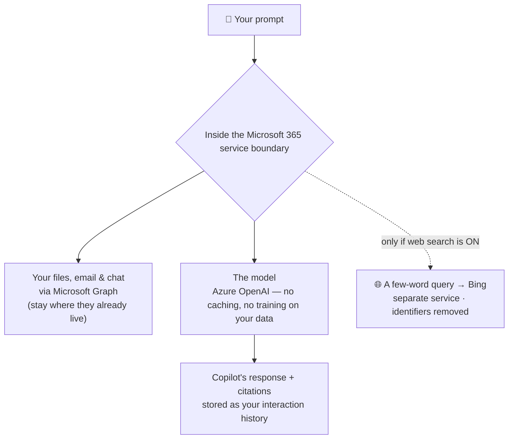
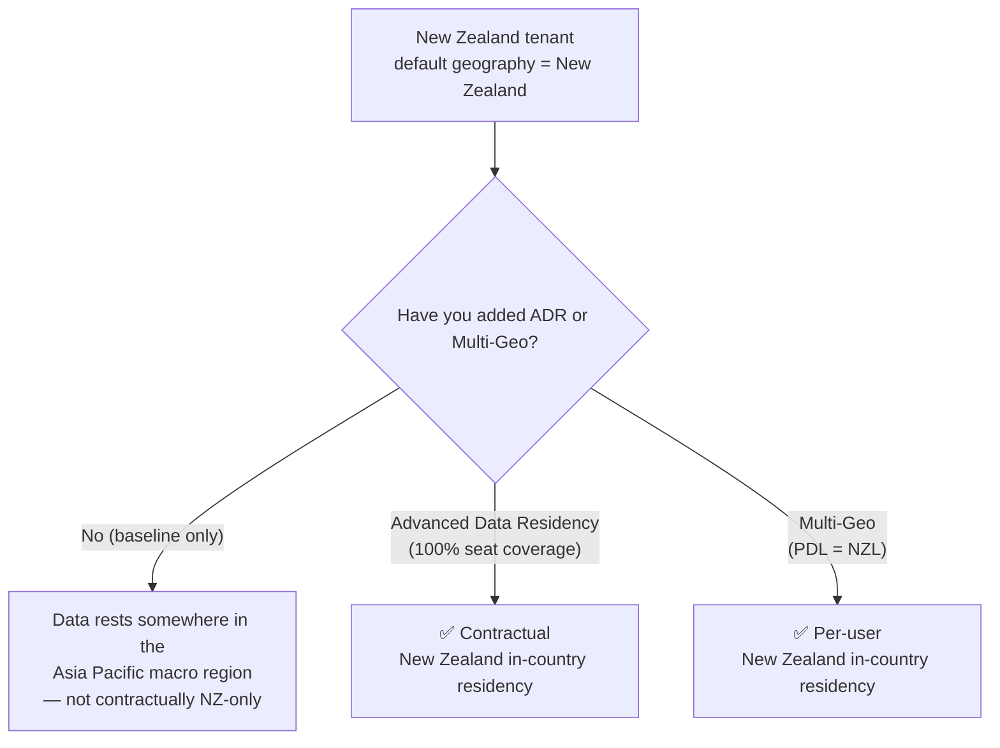

If you're the person preparing a Microsoft 365 Copilot deployment for sign-off — and the security, privacy or assurance team has asked *"where does our data actually live, and does it meet our sovereignty obligations?"* — this one's for you.

I sit in a lot of these reviews across New Zealand and Australia, in enterprise and in the public sector, and the residency questions are the ones that stall a business case the longest. Is it stored in-region? Does the physical location give anyone access? What leaves the tenant? Does it meet our OIA, ISM or IRAP obligations? The answers are genuinely good — but the New Zealand answer has a wrinkle most people don't expect.

So here it is in plain English, with the **official Microsoft documentation linked next to each part**, and the honest caveats up front.

This started as a public-sector sovereignty review. The questions are universal — every regulated organisation asks them.

*Australia gets in-country residency by default; New Zealand needs Advanced Data Residency or Multi-Geo. The optional web query to Bing is the one thing that crosses the boundary.*

**Quick links:**

- [The 30-second answer](#the-30-second-answer)
- [Three different things people mean by "where does our data live"](#three-different-things-people-mean-by-where-does-our-data-live)
- [The Microsoft 365 service boundary](#the-microsoft-365-service-boundary-what-stays-in)
- [The four residency commitments (and which ones you have)](#the-four-residency-commitments-and-which-ones-you-have)
- [Australia: what's guaranteed](#australia-whats-guaranteed)
- [New Zealand: the honest answer](#new-zealand-the-honest-answer)
- [At rest vs in flight: where the model actually runs](#at-rest-vs-in-flight-where-the-model-actually-runs)
- [The web-query exception](#the-web-query-exception)
- [Anthropic models and sovereignty](#anthropic-models-and-sovereignty)
- [Does the location give outsiders access? (No.)](#does-the-location-give-outsiders-access-no)
- [IRAP and sovereignty for government](#irap-and-sovereignty-for-government)
- [US Government clouds (and why they're not your path)](#us-government-clouds-and-why-theyre-not-your-path)
- [Where the commitments actually live](#where-the-commitments-actually-live-source-of-record)
- [Your residency checklist](#your-residency-assurance-checklist)
- [Common misconceptions (the gotchas)](#common-misconceptions-the-residency-gotchas)
- [FAQ](#frequently-asked-questions)

This is a living document. Data residency commitments, region availability and IRAP scope change as Microsoft expands its data centres and assessments. If you spot anything out of date, please [send me feedback](/feedback/) and I'll update it. Last verified: June 2026.

> ⚠️ **The one-line caveat to lead with:** data residency is a commitment about where your data is **stored at rest**. It is *not* the same as where the AI model **runs each request**, and it is *not* a statement about **who can access** the data. Keep those three separate and most of the confusion disappears — this guide does exactly that.

---

## The 30-second answer

If your CISO or assurance lead asks for the short version — here it is.

| The question | The short answer |
|---|---|
| **Where is our Copilot data stored?** | Inside the Microsoft 365 service boundary, in the same region as your other Microsoft 365 data. |
| **Is it in-region for Australia?** | Yes — an Australia-provisioned tenant is committed to Australia-only storage at rest, automatically. |
| **Is it in-region for New Zealand?** | Not by default — you need Advanced Data Residency or Multi-Geo to pin it to New Zealand. |
| **Does the location give outsiders access?** | No. Access is governed by identity and permissions, never by data-centre location. |
| **Does anything leave the tenant?** | Only the optional web search query (a few words to Bing, with user and tenant identifiers removed) — and you can turn that off. |
| **Does it meet our IRAP / sovereignty obligations?** | The platform is IRAP-assessed at PROTECTED; that's an *input* to your own authorisation, not an automatic approval. |

The longer answers — with the exact commitments and the official links — are below.

### The five caveats worth knowing up front

Good assurance teams find the edges anyway, so here they are in one place — each explained in full further down:

1. **New Zealand isn't a default residency region.** Without Advanced Data Residency or Multi-Geo, a New Zealand tenant's data rests *somewhere in the Asia Pacific macro region*, not contractually in New Zealand.
2. **Residency at rest ≠ processing location.** Your stored data stays in-region; the model's compute can be processed in other regions where capacity is available during high demand (unless an in-region processing boundary applies — which for now is essentially the EU's).
3. **The web query crosses a boundary.** For the few-word web search, Microsoft is an independent data *controller* and the DPA and EU Data Boundary don't apply. Turn web search off if that matters.
4. **Anthropic models are on by default in ANZ** — and they sit outside the EU Data Boundary and in-country processing commitments. Decide deliberately.
5. **IRAP is not an Authority to Operate.** It's an assessment of Microsoft's platform you feed into *your* agency's own assessment and authorisation.

---

## Three different things people mean by "where does our data live"

Almost every stalled residency conversation I've seen is really three questions wearing one coat. Separate them and the answers get simple:

| What people ask | What it actually is | The honest answer |
|---|---|---|
| "Where is our data **stored**?" | **Data residency** — where prompts, responses and your content rest. | Committed by contract for Australia; available for New Zealand via add-ons. |
| "Where does the **AI run**?" | **Processing / inference** — where the model computes a response. | Routed to the nearest region, but can use other regions under high demand; a processing boundary applies for the EU. |
| "What goes to the **web**?" | **Web grounding** — the optional Bing search. | A few-word query with identifiers removed, or nothing if you turn it off. |

Here's the data-flow in one picture:

The solid arrows all stay inside the Microsoft 365 boundary. The only dotted line — the one thing that can cross out — is the optional web query, which carries no user or tenant identifiers (though its search terms can still reflect the topic of your prompt). Everything else in this guide is about pinning down exactly where those in-boundary boxes physically sit.

*Source: [Data, privacy, and security for Microsoft 365 Copilot](https://learn.microsoft.com/en-us/copilot/microsoft-365/microsoft-365-copilot-privacy).*

---

## The Microsoft 365 service boundary: what stays in

Start with the foundation, because the rest builds on it. Microsoft 365 Copilot is a **Microsoft 365 core service** — in the same category as Exchange Online, SharePoint, OneDrive and Teams. When you use it:

- Your **prompts**, the **data they retrieve** through Microsoft Graph, and the **generated responses** all remain within the Microsoft 365 service boundary, under the same privacy, security and compliance commitments as the rest of your tenant.
- Processing uses **Azure OpenAI**, not OpenAI's public service. Azure OpenAI **doesn't cache your content**.
- Your prompts, responses and Graph data are **not used to train** the foundation models.
- **Your source content isn't copied into a separate Copilot store** — Copilot reads your existing email, files and chats in place through Microsoft Graph, under their existing permissions and residency. It *does* build a **semantic index** of your organisation's content to ground answers — and that index is **covered by the same at-rest residency commitment** as your interaction data, so it stays in your committed geography too.

Microsoft 365 Copilot has been a **covered data-residency workload since 1 March 2024** (Copilot Chat was added on 1 September 2025) — meaning it's explicitly inside the contractual residency commitments described below, not an exception bolted on the side.

> **Scope note:** throughout this guide, "Copilot" means **Microsoft 365 Copilot and Copilot Chat**. Agents you build in **Copilot Studio** have their own, more variable residency characteristics and are a separate topic — don't assume the commitments here apply unchanged to a custom agent.

> **Why "service boundary" matters more than "data centre":** the boundary is the security and compliance perimeter — isolation, encryption, no training, no caching. *Residency* then narrows down which **region** inside that boundary your data sits in. A reviewer needs both answers; they're different guarantees.

*Sources: [Microsoft 365 Copilot privacy](https://learn.microsoft.com/en-us/copilot/microsoft-365/microsoft-365-copilot-privacy) · [Data residency for Microsoft 365 Copilot](https://learn.microsoft.com/en-us/microsoft-365/enterprise/m365-dr-workload-copilot).*

---

## The four residency commitments (and which ones you have)

Microsoft makes residency commitments through **four mechanisms**. Knowing which ones apply to you is the whole game.

| Mechanism | What it commits | How you get it |
|---|---|---|
| **Product Terms** (baseline) | Stores core service data — including Copilot interactions — at rest only within your geography, *for the geographies on the committed list*. | Included with a qualifying Microsoft 365 / Office 365 licence. No add-on. |
| **Advanced Data Residency (ADR)** | A durable, contractual commitment to your **local country/region**, expanded to more workloads, plus migration services. | Paid add-on. Requires **100% seat coverage**. Adds geographies (like New Zealand) the baseline doesn't cover. |
| **Multi-Geo** | Per-**user** data location via a Preferred Data Location (PDL), across satellite geographies. | Paid add-on (minimum 5% of users). |
| **EU Data Boundary** | Stores *and processes* EU/EFTA customer data within the EU boundary — including **LLM inference** (ANZ has no equivalent processing boundary). | Automatic for EU/EFTA sign-up locations (not relevant to ANZ). |

Two things this table quietly tells you, both of which matter enormously for New Zealand:

1. The **baseline Product Terms commitment only applies to geographies on Microsoft's committed list** — and that list is not the same as "everywhere Microsoft has a data centre."
2. **ADR and Multi-Geo are how you reach geographies the baseline doesn't cover** — which is exactly the New Zealand situation.

*Sources: [Microsoft 365 data residency overview](https://learn.microsoft.com/en-us/microsoft-365/enterprise/m365-dr-overview) · [Advanced Data Residency](https://learn.microsoft.com/en-us/microsoft-365/enterprise/advanced-data-residency) · [Multi-Geo Capabilities](https://learn.microsoft.com/en-us/microsoft-365/enterprise/microsoft-365-multi-geo).*

---

## Australia: what's guaranteed

For Australia the answer is clean and reassuring.

- **Australia is a committed geography in the Product Terms.** If your tenant's default geography is Australia, Microsoft commits to storing your core service data **at rest only within Australia** — and that explicitly includes *"any stored content of interactions with Microsoft 365 Copilot or Microsoft 365 Copilot Chat."*
- This baseline commitment is **automatic** with a qualifying licence — no ADR add-on required just to get Australia-only storage.
- **Advanced Data Residency extends it** to more workloads (Purview, Microsoft Defender for Office Plan 1, the Microsoft 365 web apps, Viva Connections) and adds prioritised migration if your tenant predates the commitment.
- **Multi-Geo** lets you pin specific users to Australia (PDL = `AUS`) inside a multi-geo tenant.

Australia is a Microsoft 365 Local Region Geography with Microsoft 365 data centres in-country, which is what makes the at-rest commitment possible. For most Australian enterprises and agencies, the baseline Product Terms commitment is already what they need.

> **Tip —** confirm your tenant's default geography in the **Microsoft 365 admin center → Settings → Org settings → Organization profile → Data location**. If it says Australia, the at-rest commitment above is already in force.

*Sources: [Data residency for Microsoft 365 Copilot](https://learn.microsoft.com/en-us/microsoft-365/enterprise/m365-dr-workload-copilot) · [Microsoft 365 data residency — Product Terms](https://learn.microsoft.com/en-us/microsoft-365/enterprise/m365-dr-product-terms-dr).*

---

## New Zealand: the honest answer

This is the section that surprises people, so I'll be precise.

**New Zealand is not on the Microsoft 365 Product Terms list of committed data-residency geographies.** The committed list names Australia, the EU, the UK, Japan, India, Canada, Brazil, and others — but **not New Zealand**. So a default New Zealand tenant does not automatically get New Zealand-only storage.

What you *do* get by default is storage somewhere in the **Asia Pacific macro region** — the macro region whose data centres span Australia, Hong Kong SAR, India, Indonesia, Japan, Malaysia, New Zealand, Singapore and South Korea. Microsoft won't move your data *outside* that macro region, but it also won't contractually guarantee it stays *in New Zealand* — unless you add a commitment.

And you can. **New Zealand is an eligible Local Region Geography for Advanced Data Residency, and `NZL` is a valid Multi-Geo Preferred Data Location.** So the in-country answer is available — it's just a deliberate purchase, not a default.

| Your New Zealand setup | Where Copilot data rests |
|---|---|
| Baseline licence, no add-on | Asia Pacific macro region (could be Australia, Singapore, etc.) |
| **+ Advanced Data Residency** (100% coverage) | **New Zealand** — contractual commitment |
| **+ Multi-Geo**, user PDL = `NZL` | **New Zealand** — per-user commitment |

For a New Zealand public-sector reviewer chasing genuine in-country residency, that's the actionable fact: **budget for ADR or Multi-Geo, or accept Asia Pacific macro-region storage**. Don't assume the default gives you New Zealand — it doesn't, and a good assessor will catch it.

> ⚠️ **Don't confuse Azure New Zealand North with Microsoft 365.** The Azure New Zealand North region (Auckland) is for **Azure** infrastructure and platform services. **Microsoft 365** — Exchange, SharePoint, Teams, Copilot — does *not* run on the Azure New Zealand North region, and its residency is governed by the Microsoft 365 mechanisms above, not by Azure regional availability. This single mix-up derails more New Zealand sovereignty conversations than anything else.

*Sources: [Microsoft 365 data residency — Product Terms](https://learn.microsoft.com/en-us/microsoft-365/enterprise/m365-dr-product-terms-dr) · [Advanced Data Residency — eligible Local Region Geographies](https://learn.microsoft.com/en-us/microsoft-365/enterprise/advanced-data-residency) · [Multi-Geo Capabilities](https://learn.microsoft.com/en-us/microsoft-365/enterprise/microsoft-365-multi-geo).*

---

## At rest vs in flight: where the model actually runs

Here's the distinction that separates a confident assurance answer from a vague one.

**Data residency commitments are about data at rest** — where your prompts, responses and content are *stored*. They are not a promise about which data centre's GPUs *process* a given request.

What Microsoft documents about processing:

- Copilot routes large language model calls **to the nearest data centres in your region**, but **can call into other regions where capacity is available during high-demand periods**.
- **EU users get an additional safeguard**: EU traffic stays within the EU Data Boundary even under load, while worldwide traffic can be balanced across regions.
- Australia and New Zealand **don't have an equivalent processing boundary today**, so under peak load the *inference* for a request could be processed in another region — even though the stored data still rests in your committed geography.

So the precise, honest answer to *"does our data leave the region?"* is: **your stored data doesn't; a request's compute might, under load**, unless an in-region processing commitment applies to you. For sovereignty-sensitive workloads that's a real distinction worth stating plainly — and it's one most vendors gloss over.

If a reviewer needs a hard in-region *processing* guarantee, that's a conversation for your Microsoft account team about in-region processing commitments — don't assume residency-at-rest covers it.

*Source: [Microsoft 365 Copilot privacy — data location and processing](https://learn.microsoft.com/en-us/copilot/microsoft-365/microsoft-365-copilot-privacy).*

---

## The web-query exception

When **web search is on**, Copilot can send a search query to Bing — and that's the one path where data handling genuinely changes. I cover this in depth in the [security questions guide](/blog/microsoft-365-copilot-security-questions-answered/#what-actually-gets-sent-to-the-web), so here's the residency-relevant summary:

- Copilot sends a **generated query of a few words**, with **user and tenant identifiers removed** (your Microsoft Entra username, domain and tenant ID). Your **full prompt is generally not sent** — with one documented exception: a **very short prompt** (like "local weather") can be sent verbatim. Your **files and emails are never sent**.
- The **Bing search service operates separately** from Microsoft 365. For these queries Microsoft acts as an **independent data controller**, not your processor.
- As a result, the **Data Protection Addendum and the EU Data Boundary don't apply** to the generated web queries (and neither does HIPAA).
- The queries aren't used to train models, improve Bing, or build ad profiles — they're treated as customer confidential information.

One honest nuance: even with identifiers stripped, the search *terms* can still reflect the **topic** of your prompt. So for a sovereignty-focused organisation, the clean control is simple: **turn web grounding off** — or use Microsoft Purview DLP to restrict how Copilot handles sensitive content in prompts and web searches (covered in the [security questions guide](/blog/microsoft-365-copilot-security-questions-answered/#what-actually-gets-sent-to-the-web)).

*Sources: [Manage public web access in Microsoft 365 Copilot](https://learn.microsoft.com/en-us/copilot/microsoft-365/manage-public-web-access) · [Enterprise data protection](https://learn.microsoft.com/en-us/copilot/microsoft-365/enterprise-data-protection).*

---

## Anthropic models and sovereignty

A newer consideration, and one ANZ government teams should decide on deliberately. Microsoft 365 Copilot can now use **Anthropic (Claude) models** alongside the OpenAI ones, with Anthropic acting as a **Microsoft subprocessor**. For the standard Anthropic models your data isn't stored by or used to train Anthropic, and the Customer Copyright Commitment still applies — but for residency and sovereignty there are specifics that matter:

- They are **on by default for most commercial-cloud tenants outside the EU/EFTA and the UK** — which **includes Australia and New Zealand**. (As of April 2026, EU/EFTA and UK customers can also *opt in* via a new admin-center setting — but ANZ is on by default, and Anthropic stays outside the EU Data Boundary and in-country processing commitments regardless.)
- They are **out of scope for the EU Data Boundary** and for **in-country LLM processing commitments**. So even if your data *rests* in Australia or New Zealand, Anthropic processing may not follow that in-country line.
- They are **not available in US government or sovereign clouds** at all (no FedRAMP authorisation yet).
- There's a separate, **default-off** category — *"Preview models with Data Retention"* — where Anthropic acts under its own terms and **does retain data**. Keep those off unless you've explicitly decided otherwise.

The control: an admin can **restrict Anthropic models to specific users or turn them off** in the Microsoft 365 admin center. For an agency with strict in-country processing requirements, that's a deliberate switch to evaluate, not a default to ignore.

*Source: [Connect to an AI subprocessor (Anthropic)](https://learn.microsoft.com/en-us/copilot/microsoft-365/connect-to-ai-subprocessor).*

---

## Does the location give outsiders access? (No.)

This came up almost word-for-word in a real review: *"we know the servers are in Australia — does that physical location give external parties access to our information?"* It's a common and reasonable worry, and the answer is a clear **no**.

**Location and access are two different things.** Where your data sits is a residency question. Who can reach it is an identity-and-permissions question. They don't cross over.

- Copilot data sits behind **logical tenant isolation** through Microsoft Entra authentication and role-based access control.
- It's **encrypted at rest and in transit**.
- It's reachable only by **identities your tenant authorises** — Copilot only ever surfaces content a user already has permission to open.
- **Microsoft support engineers don't get standing access** to your content. If you enable **Customer Lockbox**, any access needed to service a ticket requires *your* explicit approval — it's **opt-in and off by default**. It's included in **Microsoft 365 / Office 365 E5** and available to **E3** tenants via the **E5 Compliance add-on** (confirm your SKU). Copilot interactions are covered through **Exchange Online's** Lockbox mechanism, because Copilot interaction history is stored in the user's Exchange Online mailbox.
- For agencies that need to hold the **encryption keys** themselves, Microsoft 365 **Customer Key** (bring-your-own-key) lets you supply root keys through Azure Key Vault — so content can't be decrypted by Microsoft, even under a compelled-access demand. Residency answers *where* your data sits; Customer Key answers *who can decrypt it* — a related but separate sovereignty control.

So the precise reassurance for a reviewer is: knowing the region tells an attacker nothing useful, because access never depends on location — it depends on identity and permissions, which are yours to control.

*Sources: [Microsoft 365 Copilot privacy](https://learn.microsoft.com/en-us/copilot/microsoft-365/microsoft-365-copilot-privacy) · [Customer Lockbox](https://learn.microsoft.com/en-us/purview/customer-lockbox-requests) · [Customer Key overview](https://learn.microsoft.com/en-us/purview/customer-key-overview).*

---

## IRAP and sovereignty for government

For Australian and New Zealand government readers, this is the section that matters most — and the one where I most want to be honest rather than reassuring.

**What's true:**

- **IRAP** (the Infosec Registered Assessors Program, governed by the Australian Cyber Security Centre) provides independent assessment of a system's controls against the Australian Government **Information Security Manual (ISM)**.
- The **Microsoft 365 / Office 365 platform** that Copilot runs on has been **IRAP-assessed at the PROTECTED classification**, and Copilot runs on that assessed platform. (Treat "runs on the assessed platform" as informal shorthand, not a formal IRAP scope statement — see Caveat 2.) Microsoft was the first public cloud provider to reach PROTECTED, and the assessed platforms include Azure, Office 365, Dynamics 365, Microsoft Managed Desktop and Windows 365.
- **New Zealand agencies can use Microsoft's IRAP reports too** — the New Zealand assurance frameworks are close enough to the ISM that the IRAP assessments are accepted as an input.

**The two honest caveats a good assessor will want stated:**

> ⚠️ **Caveat 1 — IRAP is an *input*, not an Authority to Operate.** An IRAP assessment evaluates Microsoft's platform controls. It does **not** authorise *your* system. Your agency still runs its own risk assessment, engages its own IRAP assessor for *your* specific deployment, applies its own compensating controls, and issues its own authorisation. The ACSC guidance is explicit that agencies authorise on a risk-managed basis — inheriting Microsoft's controls is the start of your assessment, not the end.

> ⚠️ **Caveat 2 — confirm Copilot's *specific* scope.** Microsoft 365 Copilot is **not separately enumerated** in the IRAP scope documentation published on Microsoft Learn, and the most recent publicly documented assessment predates Copilot's general availability. Copilot inherits the platform assessment, but if you need to evidence Copilot's *current* in-scope status, get it from the **Service Trust Portal** IRAP reports (authenticated) or confirm directly with your Microsoft account team. Don't state "Copilot is IRAP PROTECTED certified" in an assessment without that confirmation.

On **sovereignty** more broadly: **Microsoft Cloud for Sovereignty** is a real offering, but it's primarily an **Azure** framework. There is **no separate Microsoft 365 sovereign cloud for ANZ** equivalent to the US government clouds — Australian and New Zealand agencies use the **commercial cloud** with IRAP assessment and the residency mechanisms in this guide as their assurance basis.

*Sources: [Australia IRAP — Microsoft compliance offering](https://learn.microsoft.com/en-us/compliance/regulatory/offering-ccsl-irap-australia) · [Azure IRAP offering](https://learn.microsoft.com/en-us/azure/compliance/offerings/offering-australia-irap) · [Microsoft Service Trust Portal](https://servicetrust.microsoft.com).*

---

## US Government clouds (and why they're not your path)

ANZ teams sometimes ask whether they should be in a "government cloud." For Microsoft 365 the government clouds are **US-specific**, and they're worth understanding only so you can rule them out:

| Cloud | For whom | Note |
|---|---|---|
| **GCC** | US federal/state/local government | FedRAMP High; US-based data centres; web search off by default |
| **GCC High** | US defence contractors, ITAR data | DISA SRG L4 |
| **DoD** | US Department of Defense | DISA SRG L5 |

These are **not available to Australian or New Zealand government** agencies, and Anthropic models aren't available in them. (Microsoft 365 Copilot *is* available in **GCC** for eligible US agencies — but not in GCC High or DoD.) The ANZ government path is the **commercial cloud** with IRAP — not a US government cloud. (One small but useful detail that *does* travel: in those government clouds **web search is off by default**, which is a sensible posture to mirror voluntarily in any sovereignty-sensitive commercial tenant.)

*Source: [Microsoft 365 Government — how to buy](https://learn.microsoft.com/en-us/office365/servicedescriptions/office-365-platform-service-description/office-365-us-government/microsoft-365-government-how-to-buy).*

---

## Where the commitments actually live (source of record)

When you put a residency answer in a formal response, point reviewers at the **contractual** and **audit** sources — not a blog, and not a salesperson's word (including mine):

- **The commitment is contractual.** Data residency lives in the **Microsoft Product Terms** and the **Data Protection Addendum (DPA)**, with Microsoft acting as your **data processor**. The live Product Terms always supersede any summary.
- **The evidence lives in the Service Trust Portal.** [servicetrust.microsoft.com](https://servicetrust.microsoft.com) is where you (authenticated) pull the **IRAP reports**, **ISO 27001 / 27018 / 27701**, **SOC 1/2/3**, and regional compliance documents. That's the source of record an auditor accepts.
- **Compliance Manager** (in the Microsoft Purview portal) gives you control-mapped templates if you're building the assessment yourself.

> **Tip —** for an RFP, the strongest residency answer is three lines: *(1)* the Product Terms / ADR commitment for our geography, *(2)* the relevant IRAP / ISO / SOC report from the Service Trust Portal, and *(3)* the date you last verified both. Auditors trust dated, sourced answers far more than confident prose.

*Sources: [Microsoft 365 data residency overview](https://learn.microsoft.com/en-us/microsoft-365/enterprise/m365-dr-overview) · [Microsoft Product Terms](https://www.microsoft.com/licensing/terms/product/PrivacyandSecurityTerms/all) · [Service Trust Portal](https://servicetrust.microsoft.com).*

---

## Your residency & assurance checklist

If you do nothing else, do these — in roughly this order:

1. **Confirm your default geography** in the admin center (Settings → Org settings → Organization profile → **Data location**). This is your starting point for every residency answer.
2. **Decide if the baseline is enough.** Australia → usually yes. New Zealand → only if Asia Pacific macro-region storage is acceptable; otherwise plan for **ADR or Multi-Geo**.
3. **Cost the add-on properly.** ADR needs **100% seat coverage**; Multi-Geo needs a per-user licence (minimum 5% of users). Budget before you promise in-country.
4. **Set your web-grounding posture** and the *"Allow web search in Copilot"* policy to match — off if web egress is a concern.
5. **Decide on Anthropic models** — on by default in ANZ; restrict or disable them in the admin center if in-country processing matters.
6. **Pull your evidence pack** from the Service Trust Portal now, not during the RFP scramble: IRAP, ISO 27001/27018, SOC 2.
7. **Set a retention policy** on the *"Microsoft Copilot experiences"* location to match your records schedule — residency and records management are separate obligations.
8. **Write the IRAP framing correctly** in any assessment: platform-assessed, agency-authorised. Never imply an automatic ATO.

---

## Common misconceptions (the residency gotchas)

A few things that trip up even experienced teams:

- **"Our data is in Australia, so nobody overseas can touch it."** Location ≠ access. Access is governed by identity and permissions, not geography.
- **"New Zealand tenant means New Zealand data."** Not by default — that needs ADR or Multi-Geo. Baseline is Asia Pacific macro region.
- **"Azure New Zealand North means Microsoft 365 is in New Zealand."** No — Azure regions and Microsoft 365 residency are governed separately.
- **"Residency means the AI runs in our region."** Residency is about storage at rest; inference can be capacity-routed across regions unless a processing boundary applies.
- **"Nothing ever leaves the tenant."** Almost true — the exception is the optional web query to Bing (your identifiers are removed). Turn it off and it's fully true.
- **"IRAP PROTECTED means we're authorised."** IRAP assesses Microsoft's platform; your agency still runs and signs its own authorisation.
- **"ADR just needs a few licences."** ADR needs **100%** seat coverage to hold the commitment — partial coverage gives you nothing.
- **"Anthropic is covered by our in-country commitment."** It isn't — Anthropic models sit outside the EU Data Boundary and in-country processing commitments.

---

## Frequently asked questions

**Where is our Copilot data stored — Australia or New Zealand?**
Inside the Microsoft 365 service boundary, in the same region as your other Microsoft 365 data. Australia-provisioned tenants get an automatic Australia-only commitment; New Zealand tenants get Asia Pacific macro-region storage unless they add ADR or Multi-Geo.

**Is New Zealand a Microsoft 365 data residency region?**
Not by default — it's absent from the Product Terms committed list. But it *is* an eligible geography for Advanced Data Residency and a valid Multi-Geo Preferred Data Location, so in-country New Zealand residency is available as a deliberate purchase.

**Does the data's physical location give outsiders access?**
No. Access is governed by identity and permissions through Microsoft Entra, with encryption and tenant isolation. The data-centre region grants nobody access.

**Does our data leave the region to be processed?**
The stored data doesn't. The model's compute is routed to the nearest region but can be processed in other regions where capacity is available during high demand — EU users have a boundary safeguard; Australia and New Zealand don't have an equivalent processing boundary today.

**What's the difference between ADR and Multi-Geo?**
ADR is a tenant-wide commitment to your local region (needs 100% seat coverage). Multi-Geo is per-user, via a Preferred Data Location, for satellite geographies. Both can pin data to Australia or New Zealand.

**Is Copilot IRAP PROTECTED certified?**
The platform it runs on is IRAP-assessed at PROTECTED, and Copilot inherits that posture — but Copilot isn't separately listed in the public IRAP scope docs. Confirm current scope via the Service Trust Portal or your account team before stating it in an assessment.

**Does IRAP mean Copilot is authorised for our agency?**
No. IRAP is an input to your own Security Assessment and Authorisation, not an Authority to Operate. Your agency authorises its own deployment.

**Are Anthropic models a sovereignty issue?**
They're on by default in ANZ and sit outside the EU Data Boundary and in-country processing commitments. If in-country processing matters, an admin can restrict or disable them.

**Does the EU Data Boundary apply to us?**
No — it covers EU/EFTA sign-up locations. ANZ relies on Product Terms, ADR and Multi-Geo instead. (Web queries and Anthropic models sit outside the EU boundary even for EU customers.)

**Where do we get the evidence for an RFP?**
The commitment is contractual (Product Terms + DPA); the audit evidence — IRAP, ISO, SOC — is in the Microsoft Service Trust Portal.

**Can we see which geography our data is in?**
Yes — Microsoft 365 admin center → Settings → Org settings → Organization profile → Data location.

**Is there an ANZ sovereign cloud for Microsoft 365?**
No — Microsoft Cloud for Sovereignty is primarily an Azure framework. ANZ government uses the commercial cloud with IRAP as the assurance basis.

---

## Related guides

- [Microsoft 365 Copilot Security: Top Questions Answered](/blog/microsoft-365-copilot-security-questions-answered/) *(the security pillar this residency deep-dive belongs to)*
- [SharePoint Oversharing Controls for Copilot](/blog/sharepoint-oversharing-controls-microsoft-365-copilot/)
- [The Copilot Control System Explained](/blog/microsoft-365-copilot-control-system-complete-guide/)
- [Microsoft 365 Copilot Deployment — The Complete Guide](/blog/microsoft-365-copilot-deployment-best-practices-ultimate-checklist/) *(the IT-admin checklist that anchors this cluster)*
- [Agent 365 Security — Entra, Purview, Defender](/blog/agent-365-security-governance-complete-guide/)

*Everything here is grounded in Microsoft's official documentation, linked inline. Residency commitments, region availability and IRAP scope evolve — if you're putting an answer in a formal response, re-check the live Microsoft page on the day, pull the current report from the Service Trust Portal, and confirm anything tenant-specific (your geography, your licensing, your IRAP scope) with your Microsoft account team.*
