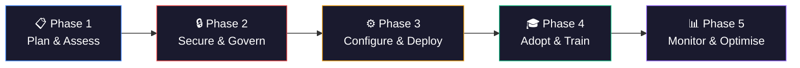
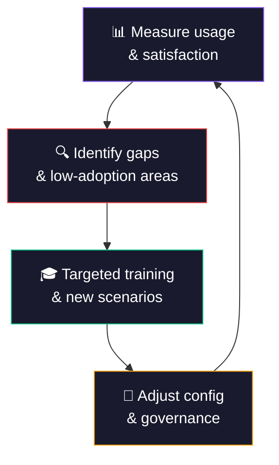

Deploying Microsoft 365 Copilot is not just "assign licences and go." In our experience, deployments that struggle typically trace the problem back to one of three gaps: **permissions weren't audited**, **governance wasn't in place**, or **users weren't prepared**. This guide gives you the complete, phased checklist — from planning through optimisation — so your deployment succeeds the first time.

**Quick links:**

- [TL;DR — The 5-phase deployment framework](#tldr--the-5-phase-deployment-framework)
- [What licence do you need?](#what-licence-do-you-need)
- [Phase 1: Plan & assess](#phase-1-plan--assess)
- [Phase 2: Secure & govern](#phase-2-secure--govern)
- [Phase 3: Configure & deploy](#phase-3-configure--deploy)
- [Phase 4: Adopt & train](#phase-4-adopt--train)
- [Phase 5: Monitor & optimise](#phase-5-monitor--optimise)
- [The complete checklist](#the-complete-checklist--print-this)
- [Common mistakes](#common-mistakes-we-see-in-every-deployment)
- [FAQ](#frequently-asked-questions)

<div class="trainer-tip">

💡 **Trainer tip:** Position Copilot Chat as **"your organisation's approved AI"** — it replaces the need for users to go to consumer AI tools like ChatGPT, Google Gemini, or Claude. Same AI power, but with enterprise data protection built in. This is the **Shadow AI story** — give users a better, safer alternative and they'll stop using unapproved tools.

</div>

<div class="living-doc-banner">

🔄 **This is a living document.** The AI world changes every day — features ship, settings move, and guidance evolves. If you spot anything that's out of date or needs updating, please [send me feedback](/feedback/) and I'll update it. Last verified against Microsoft documentation: April 2026.

</div>

> ⚠️ **Government cloud note:** This guide applies to commercial Microsoft 365 tenants. GCC, GCC High, and DoD tenants may have different feature availability, timelines, and compliance requirements. Verify with your Microsoft account team.

---

## TL;DR — The 5-Phase Deployment Framework

If you only have 60 seconds, here's the framework:



| Phase | Key Action | If You Skip This... |
|-------|-----------|-------------------|
| **1. Plan & Assess** | Run the Optimization Assessment, define pilot group | You deploy blind without understanding your readiness gaps |
| **2. Secure & Govern** | Audit permissions, deploy sensitivity labels, configure DLP | Copilot surfaces confidential data to the wrong people |
| **3. Configure & Deploy** | Assign licences, set Cloud Policy, pilot first | Users hit errors, features don't work, IT gets blamed |
| **4. Adopt & Train** | Champions program, scenario-based training | Users get Copilot but don't know what to do with it — low adoption, wasted licences |
| **5. Monitor & Optimise** | Usage dashboards, feedback loops, iterate | You can't prove ROI and can't justify the licence spend |

> **The #1 rule:** Phase 2 (Secure & Govern) should take **more time** than Phase 3 (Configure & Deploy). Most failed deployments rushed past governance.

### Quick Admin Answers

| Question | Answer |
|----------|--------|
| **What if I do nothing?** | Existing permissions still govern access. Copilot won't create new permissions — but it WILL surface everything a user already has access to, including content they've never seen. Oversharing risk remains if permissions are broad. |
| **What doesn't change?** | SharePoint/OneDrive permissions, sensitivity labels, DLP policies, retention policies, and Conditional Access all work exactly the same with Copilot. Copilot respects your existing security posture. |
| **How do I turn Copilot off for a user?** | Unassign the Copilot licence. For granular control: manage Copilot Chat pinning in Teams admin, disable web search via Cloud Policy per group, or remove agent access. |
| **How do I target specific users?** | Assign Copilot licences to an Entra ID security group. Use Cloud Policy at config.office.com to apply feature-specific policies (web search, content safety) to different groups. |

---

## What Licence Do You Need?

| What You Need | Details |
|--------------|---------|
| **Eligible base licence** | Includes Microsoft 365 Business Basic/Standard/Premium, E3, E5, F1, F3, Office 365 E1/E3/E5, and other qualifying plans ([see full list](https://learn.microsoft.com/en-us/copilot/microsoft-365/microsoft-365-copilot-licensing)) |
| **Copilot add-on** | Microsoft 365 Copilot — pricing varies by plan (check [official pricing](https://www.microsoft.com/en-us/microsoft-365/copilot/compare-plans)) |
| **Annual commitment** | Required for most plans — check your specific agreement |
| **Apps version** | Microsoft 365 Apps on **Current Channel** or **Monthly Enterprise Channel** (version 2308+) |
| **Outlook** | Copilot works with both **classic Outlook and new Outlook**; primary mailbox must be in Exchange Online |
| **Exchange Online** | Mailbox must be provisioned |
| **OneDrive** | Account required for file-based Copilot features |

### What About Free Copilot Chat?

| Feature | Free Copilot Chat (Basic) | Paid M365 Copilot |
|---------|:---:|:---:|
| Copilot Chat (web) | ✅ | ✅ |
| Copilot in Word, Excel, PowerPoint | ❌ | ✅ |
| Copilot in Teams (meetings, chat) | ❌ | ✅ |
| Work Graph grounding (org data) | ❌ | ✅ |
| Agents (Agent Builder, Studio) | ❌ | ✅ |
| Admin controls (harmful content, web search) | Limited | ✅ Full |

> 📚 **Official reference:** [Microsoft 365 Copilot licensing plans](https://learn.microsoft.com/en-us/copilot/microsoft-365/microsoft-365-copilot-licensing) · Confused by Microsoft licensing? Try our [Licensing Simplifier](/licensing/) to compare 59 plans side by side.
>
> 🔍 Want to see exactly which Copilot features are available in each app and licence tier? Check our [Copilot Feature Matrix](/copilot-matrix/) — interactive comparison across 15 apps and 4 tiers.

---

## Phase 1: Plan & Assess

### Who Owns What — The Deployment Roles

Copilot deployment spans multiple teams. Define ownership upfront or execution will stall:

| Role | Responsible For |
|------|----------------|
| **M365 Admin** | Licensing, Copilot settings, service readiness |
| **SharePoint Admin** | Permissions audit, SAM policies, site remediation |
| **Purview / Compliance Admin** | Sensitivity labels, DLP, audit logging, retention |
| **Entra ID / Intune Admin** | Conditional Access, MFA, device compliance |
| **Copilot / Power Platform Admin** | Agent governance, Copilot Studio policies |
| **Adoption Lead** | Champions program, training, communications, feedback |
| **Executive Sponsor** | Visibility, budget, behaviour change authority |

### Run the Optimization Assessment

Before anything else, run Microsoft's free **[Copilot Optimization Assessment](https://www.microsoft.com/solutionassessments/)**. It evaluates:

- Data governance maturity
- Security posture
- Identity configuration
- SharePoint/OneDrive readiness

This gives you a baseline and highlights gaps before you start. You can also try our free [Copilot Readiness Checker](/copilot-readiness/) for an instant scored assessment across 7 pillars.

### Define Your Pilot Group

Don't deploy to everyone at once. Start with a **pilot group of 20-50 users** across different departments:

- **Include a mix of:**
  - Power users who will push Copilot's limits
  - Sceptics who will find the gaps
  - Executives who will champion it
  - IT staff who will support it

- **Good pilot departments:**
  - Marketing/Communications (content creation)
  - HR (document drafting, policy review)
  - Finance (data analysis, reporting)
  - Project Management (meeting summaries, planning)
  - IT (admin tasks, troubleshooting)

### Set Success Criteria

Define what "success" means before deployment:

- **Adoption:** What % of licensed users are active weekly?
- **Productivity:** How many hours saved per user per week?
- **Satisfaction:** What NPS score from pilot users?
- **Security:** Zero oversharing incidents during pilot?

> 📚 **Official reference:** [Microsoft 365 Copilot adoption guide](https://learn.microsoft.com/en-us/copilot/microsoft-365/microsoft-365-copilot-enablement-resources) · [Microsoft Adoption site](https://adoption.microsoft.com/copilot)

---

## Phase 2: Secure & Govern

> ⚠️ **This is the most critical phase.** The majority of deployment issues we see trace back to governance gaps. Spend the time here.

### 2.1 Audit SharePoint & OneDrive Permissions

Copilot surfaces **any data a user has permission to access** — even if they've never seen it before. This is the #1 source of "Copilot showed me something it shouldn't have" complaints.

**What to audit:**

- [ ] Sites shared with "Everyone" or "Everyone except external users"
- [ ] Broadly shared document libraries
- [ ] Teams with open membership
- [ ] OneDrive folders shared with wide groups
- [ ] Legacy sites with inherited permissions that are too broad
- [ ] Stale or inactive sites with outdated permissions

**Tools to use:**

| Tool | What It Does |
|------|-------------|
| **SharePoint Admin Centre** | Review site permissions, sharing settings |
| **SharePoint Advanced Management (SAM)** | Site-level access policies, inactive site management, data access governance reports |
| **Microsoft Graph API** | Deep permission audits at scale |
| **Microsoft Purview Data Access Governance** | Identify overshared content across your tenant |

> 💡 **The oversharing test:** Before deploying Copilot, ask a pilot user: "Search for 'salary' or 'confidential' in Copilot Chat." If they find documents they shouldn't see — fix permissions first.

### 2.1b Use SharePoint Advanced Management (SAM) to Reduce Oversharing

SAM is your most powerful tool for Copilot governance. Use these controls in order:

1. **Find ownerless and inactive sites** — Sites without active owners accumulate stale permissions. Use SAM's inactive site policy to identify and remediate
2. **Run site access reviews** — Require site owners to review and confirm who should have access. Schedule recurring reviews for high-risk sites
3. **Enable Restricted Content Discovery** — Immediately prevent Copilot from surfacing content from specific sites while you remediate permissions (containment control)
4. **Apply Restricted Access Control** — For business-critical sites, enforce strict access control policies that override broad sharing
5. **Review data access governance reports** — Use SAM's reporting to find sites with excessive external sharing or broad internal access
6. **Re-test with Copilot** — After remediation, run the oversharing test again before expanding rollout

> 📚 **Official reference:** [Get ready for Copilot with SharePoint Advanced Management](https://learn.microsoft.com/en-us/sharepoint/get-ready-copilot-sharepoint-advanced-management) · [Site access review](https://learn.microsoft.com/en-us/sharepoint/site-access-review) · [Restricted content discovery](https://learn.microsoft.com/en-us/sharepoint/restricted-content-discovery) · [Restricted access control](https://learn.microsoft.com/en-us/sharepoint/restricted-access-control)

### 2.2 Deploy Sensitivity Labels

Sensitivity labels classify and protect data. Copilot honours these labels — if a document is labelled "Confidential" with encryption, Copilot respects those restrictions.

**Minimum label taxonomy for Copilot:**

1. **Public** — No restrictions
2. **Internal** — Org-only access
3. **Confidential** — Restricted to specific groups
4. **Highly Confidential** — Encrypted with restricted rights (configure EXTRACT/VIEW permissions to control whether Copilot can process this content)

**Where to configure:** Microsoft Purview → Information Protection → Labels

> 📚 **Official reference:** [Sensitivity labels in Microsoft Purview](https://learn.microsoft.com/en-us/purview/sensitivity-labels) · [Configure secure data foundation for Copilot](https://learn.microsoft.com/en-us/copilot/microsoft-365/configure-secure-governed-data-foundation-microsoft-365-copilot)

### 2.3 Configure DLP Policies

Data Loss Prevention policies prevent sensitive data from being included in Copilot prompts and responses.

**Priority DLP policies for Copilot:**

- [ ] Block sharing of financial data (credit card numbers, bank accounts)
- [ ] Block sharing of personal data (national IDs, passport numbers)
- [ ] Block sharing of health information (if applicable)
- [ ] Alert on sensitive data in Copilot interactions

**Where to configure:** Microsoft Purview → Data Loss Prevention → Policies

### 2.4 Enable Audit Logging

Copilot interactions (prompts and responses) can be audited, searched, and retained through Microsoft Purview — subject to your Purview configuration and licensing.

**What to enable:**

- [ ] Copilot activity audit logging (Purview → Audit)
- [ ] Retention policies for Copilot data (Purview → Data lifecycle management)
- [ ] eDiscovery capability for Copilot interactions
- [ ] DSPM for AI monitoring (if licensed)

> 📚 **Official reference:** [Audit log activities for Copilot](https://learn.microsoft.com/en-us/purview/audit-log-activities#copilot-activities) · [Retention for Copilot](https://learn.microsoft.com/en-us/purview/retention-policies-copilot)

### 2.5 Set Conditional Access Policies

Ensure Copilot is only accessed from trusted devices and locations:

- [ ] Require managed devices for Copilot access
- [ ] Require MFA for all Copilot users
- [ ] Block access from untrusted locations (if applicable)
- [ ] Require compliant devices via Intune

**Where to configure:** Microsoft Entra ID → Conditional Access → Policies

> 💡 Need help designing your CA policies? Try our [CA Policy Builder](/ca-builder/) — it has 20 pre-built Zero Trust templates with deploy-ready PowerShell and Graph API exports.

### 2.6 Review Content Safety Controls

Configure how Copilot handles sensitive topics and web content:

- [ ] Decide your **web search policy** (on/off, or Work mode only)
- [ ] Decide if any roles need the **harmful content protection toggle**
- [ ] Review **optional connected experiences** policy

> 📚 **Official reference:** [Manage harmful content protection in Copilot Chat](https://learn.microsoft.com/en-us/copilot/microsoft-365/harmful-content-protection-copilot-chat) · [Manage web search in Copilot](https://learn.microsoft.com/en-us/copilot/microsoft-365/manage-public-web-access) · Also see our [detailed content safety guide](https://www.aguidetocloud.com/blog/microsoft-365-copilot-content-safety-controls-complete-guide-for-admins/)

---

## Phase 3: Configure & Deploy

### 3.1 Technical Prerequisites Checklist

Before assigning a single licence, verify:

- [ ] Microsoft 365 Apps on **Current Channel** or **Monthly Enterprise Channel**
- [ ] **Outlook** updated — Copilot works with classic and new Outlook; primary mailbox must be in Exchange Online
- [ ] **Exchange Online** mailboxes provisioned for all Copilot users
- [ ] **OneDrive** accounts provisioned
- [ ] **Teams** updated to latest version
- [ ] **SharePoint Online** and **OneDrive** services operational
- [ ] **WebSocket connectivity** available from user devices to Microsoft services
- [ ] Required **network endpoints** allowed through firewall ([see official endpoint list](https://learn.microsoft.com/en-us/copilot/microsoft-365/microsoft-365-copilot-requirements))
- [ ] **Modern authentication** enabled (Entra ID)
- [ ] **Restricted SharePoint Search** disabled (if previously enabled)

### 3.2 Assign Licences

1. Go to **Microsoft 365 Admin Centre** → Users → Active Users
2. Select your pilot group users
3. Assign the **Microsoft 365 Copilot** licence
4. Verify assignment via PowerShell:

```powershell
Get-MgUser -Filter "assignedLicenses/any(x:x/skuId eq 'COPILOT_SKU_ID')" | Select DisplayName, UserPrincipalName
```

> 💡 New to PowerShell for M365 admin? Our [PowerShell Command Builder](/ps-builder/) has 68 ready-made recipes for Exchange, Teams, Graph, and more — with copy-paste scripts and beginner-friendly "How to Run This" guides.

### 3.3 Configure Copilot Settings

In the **Microsoft 365 Admin Centre** → Copilot:

- [ ] Review and configure **Copilot settings** (web search, plugins, agents)
- [ ] Set **Cloud Policy** configurations at [config.office.com](https://config.office.com):
  - Web search policy (Allow/Deny per group)
  - Harmful content protection policy (if needed)
  - Optional connected experiences
- [ ] Configure **agent policies** (who can create/share agents)

### 3.4 Agent Governance — Decide Before You Deploy

Agents are one of Copilot's most powerful features — and one of the easiest to lose control of. Set these policies before your pilot:

- **Who can create agents?** Decide if agent creation is open to all Copilot users or restricted to specific groups (IT, power users, approved builders)
- **Who can share agents org-wide?** Restrict org-wide sharing to approved users — prevent untested agents from reaching the entire organisation
- **What approval process exists?** Define whether shared agents need admin review before deployment (available in the Copilot Control System in M365 Admin Centre)
- **Agent Builder vs Copilot Studio** — Agent Builder agents are simpler (M365 Copilot licence). Copilot Studio agents are more powerful (separate licence). Govern them separately
- **Review existing agents** — Before broad rollout, audit any agents already created during pilot. Remove or restrict any that access sensitive data inappropriately

> 📚 **Official reference:** [Manage agents in M365 Admin Centre](https://learn.microsoft.com/en-us/microsoft-365/admin/manage/manage-copilot-agents-integrated-apps) · [Microsoft 365 agents deployment checklist](https://learn.microsoft.com/en-us/microsoft-365/copilot/agent-essentials/m365-agents-checklist) · [Share and manage agents](https://learn.microsoft.com/en-us/microsoft-365/admin/manage/manage-shared-agents)

### 3.5 Pilot Validation

Before scaling beyond the pilot:

- [ ] Verify Copilot appears in all target apps (Word, Excel, Teams, Outlook, Chat)
- [ ] Test DLP policies are triggering correctly
- [ ] Test sensitivity labels are being honoured
- [ ] Run the **oversharing test** (search for sensitive terms)
- [ ] Collect pilot user feedback after 2 weeks
- [ ] Review Copilot audit logs for unexpected data access

> 📚 **Official reference:** [Set up Microsoft 365 Copilot](https://learn.microsoft.com/en-us/copilot/microsoft-365/microsoft-365-copilot-setup) · [Admin setup guide in M365 Admin Centre](https://admin.microsoft.com/Adminportal/Home?Q=learndocs#/modernonboarding/microsoft365copilotsetupguide)

---

## Phase 4: Adopt & Train

> Deploying Copilot without adoption planning is like buying a gym membership and never going. The licence cost is wasted if users don't know how to use it.

### 4.1 Build a Champions Network

Champions are your force multiplier. Identify **5-10 enthusiastic users per 100 Copilot users** who will:

- Test new features early
- Share tips and tricks with colleagues
- Collect feedback and report issues
- Lead department-level training sessions

### 4.2 Scenario-Based Training

Don't train on "how to use Copilot." Train on **"how to do YOUR job faster with Copilot."**

| Role | Top Copilot Scenarios |
|------|----------------------|
| **Executives** | Meeting prep from emails + calendar, executive summaries, board paper drafting |
| **Marketing** | Blog drafts, social media content, campaign analysis |
| **HR** | Job descriptions, policy summaries, interview question generation |
| **Finance** | Data analysis in Excel, financial report drafting, budget comparisons |
| **Project Managers** | Meeting summaries, status report generation, risk analysis |
| **Sales** | Customer prep from CRM data, proposal drafting, competitive analysis |
| **IT** | Troubleshooting guides, documentation, PowerShell script generation |
| **Legal** | Contract review summaries, policy comparison, compliance research |

### 4.3 Communication Plan

**Before launch:**

1. Announcement email from executive sponsor
2. "What is Copilot?" one-pager (link to training resources)
3. FAQ document addressing privacy and data concerns

**At launch:**

1. Welcome email with quick-start guide
2. First-week challenge (e.g., "Try Copilot in 3 different apps this week")
3. Champions available for drop-in help sessions

**Ongoing:**

1. Monthly "Copilot tips" newsletter or Teams post
2. User community channel (Teams or Viva Engage)
3. Quarterly usage review with department leads

### 4.4 Prompt Engineering Training

Most users underperform with Copilot because they write bad prompts. Invest in prompt training:

- **Teach the CRAFT formula:** Context, Role, Action, Format, Tone — our [Prompt Engineering Guide](/prompt-guide/) teaches 8 techniques with hands-on exercises
- **Provide a prompt library** with tested, role-specific prompts — see our [AI Prompt Library](/prompts/) with 84 prompts across 8 platforms
- **Show before/after examples** — try the [Prompt Polisher](/prompt-polisher/) to instantly improve any prompt with a CRAFTS score

> 📚 **Official reference:** [Welcome end users to Copilot](https://learn.microsoft.com/en-us/copilot/microsoft-365/microsoft-365-copilot-enable-users) · [Microsoft Adoption Success Kit](https://adoption.microsoft.com/copilot)

---

## Phase 5: Monitor & Optimise

### 5.1 Usage Dashboards

| Dashboard | What It Shows | Where |
|-----------|--------------|-------|
| **Copilot usage reports** | Active users, feature usage per app, trend over time | M365 Admin Centre → Reports → Usage |
| **Viva Insights Copilot dashboard** | Time savings, meeting efficiency, collaboration patterns | Viva Insights app |
| **Purview audit logs** | Copilot interactions, prompt/response content (subject to configuration and licensing) | Microsoft Purview → Audit |
| **DSPM for AI** | AI data security posture, sensitive data in AI interactions | Microsoft Purview → DSPM for AI |

### 5.2 Key Metrics to Track

| Metric | Target | How to Measure |
|--------|--------|---------------|
| **Weekly active users** | >70% of licensed users | M365 Admin Centre usage reports |
| **Feature breadth** | Users try 3+ apps | Usage reports by app |
| **User satisfaction** | NPS >30 | Survey (monthly) |
| **Time savings** | >2 hours/user/week | Viva Insights + self-report |
| **Oversharing incidents** | Zero | Purview alerts + user reports |
| **Support tickets** | Declining trend | IT ticketing system |

> 💡 Need to build a business case? Our [Copilot ROI Calculator](/roi-calculator/) estimates savings by role with realistic adoption curves — includes a printable executive summary.

### 5.3 Continuous Improvement Loop



---

## The Complete Checklist — Print This

### Phase 1: Plan & Assess

- [ ] Run the [Copilot Optimization Assessment](https://www.microsoft.com/solutionassessments/)
- [ ] Define pilot group (20-50 users across departments)
- [ ] Set success criteria (adoption %, time savings, satisfaction)
- [ ] Identify executive sponsor
- [ ] Establish budget (licences + training + change management)

### Phase 2: Secure & Govern

- [ ] Audit SharePoint/OneDrive permissions for oversharing
- [ ] Remove "Everyone" and "Everyone except external" from sensitive sites
- [ ] Deploy sensitivity labels (minimum 4-tier taxonomy)
- [ ] Configure DLP policies for Copilot interactions
- [ ] Enable Copilot audit logging in Purview
- [ ] Set retention policies for Copilot data
- [ ] Configure Conditional Access (MFA, managed devices)
- [ ] Review and set content safety policies (web search, harmful content toggle)
- [ ] Clean up stale/inactive SharePoint sites
- [ ] Archive redundant, obsolete, or trivial content (ROT)
- [ ] Run SAM inactive site policy and remediate ownerless sites
- [ ] Enable SAM Restricted Content Discovery for high-risk sites
- [ ] Run SAM site access reviews on sensitive sites

### Phase 3: Configure & Deploy

- [ ] Verify Microsoft 365 Apps version (Current or Monthly Enterprise Channel)
- [ ] Ensure Outlook is updated (classic or new Outlook; primary mailbox in Exchange Online)
- [ ] Provision Exchange Online mailboxes
- [ ] Provision OneDrive accounts
- [ ] Verify network endpoints and WebSocket connectivity
- [ ] Disable Restricted SharePoint Search (if enabled)
- [ ] Assign Copilot licences to pilot group
- [ ] Configure Copilot settings in M365 Admin Centre
- [ ] Set Cloud Policy configurations at config.office.com
- [ ] Validate: Copilot appears in all target apps
- [ ] Validate: DLP and sensitivity labels working correctly
- [ ] Validate: Run oversharing test with pilot users
- [ ] Collect pilot feedback after 2 weeks
- [ ] Define agent creation and sharing policies
- [ ] Restrict org-wide agent sharing to approved groups
- [ ] Audit any agents created during pilot

### Pilot Exit Criteria — Go/No-Go Before Scaling

Before expanding beyond the pilot, all of these must be true:

- [ ] No unresolved oversharing findings from the oversharing test
- [ ] DLP policies and sensitivity labels validated and working
- [ ] Helpdesk volume is manageable (not trending up)
- [ ] Weekly active usage is above your target threshold
- [ ] Agent governance policy is documented and in place
- [ ] Executive sponsor approves the next wave of deployment

### Phase 4: Adopt & Train

- [ ] Recruit champions (5-10 per 100 users)
- [ ] Create scenario-based training by department/role
- [ ] Send executive announcement email
- [ ] Distribute quick-start guide and FAQ
- [ ] Launch first-week challenge
- [ ] Set up user community (Teams channel or Viva Engage)
- [ ] Schedule drop-in help sessions
- [ ] Provide prompt engineering training
- [ ] Share prompt library with tested, role-specific prompts

### Phase 5: Monitor & Optimise

- [ ] Set up Copilot usage reports in M365 Admin Centre
- [ ] Configure Viva Insights Copilot dashboard
- [ ] Schedule monthly usage reviews
- [ ] Collect quarterly user satisfaction surveys
- [ ] Review and tighten governance based on audit findings
- [ ] Scale deployment to next wave of users
- [ ] Iterate training based on low-adoption areas

---

## Common Mistakes We See in Every Deployment

| Mistake | What Happens | How to Avoid |
|---------|-------------|-------------|
| **Skipping the permissions audit** | Copilot surfaces confidential docs to the wrong people | Audit before deploying — use SAM + Purview |
| **Deploying to everyone at once** | IT overwhelmed with support requests, low-quality first impression | Phased rollout: pilot → department → org |
| **No training plan** | Users try once, get bad results, give up | Scenario-based training with role-specific prompts |
| **No executive sponsor** | Copilot seen as "another IT project" | Get a visible executive to champion adoption |
| **Not cleaning up legacy data** | Copilot surfaces old, outdated, or embarrassing content | Archive ROT content before deployment |
| **Ignoring the free tier** | Unlicensed users confused about what they can/can't do | Communicate clearly what free vs. paid Copilot includes |
| **No feedback loop** | Problems go unreported, adoption stalls | Champions + community channel + regular surveys |
| **Over-relying on FastTrack** | FastTrack provides guidance, not hands-on configuration | Combine FastTrack guidance with your own admin execution |

---

## Essential Microsoft Resources

| Resource | What It Is | Link |
|----------|-----------|------|
| **Copilot Adoption Guide** | Microsoft's official step-by-step for IT admins | [Learn Docs](https://learn.microsoft.com/en-us/copilot/microsoft-365/microsoft-365-copilot-enablement-resources) |
| **Copilot Optimization Assessment** | Free readiness evaluation tool | [Microsoft Solution Assessments](https://www.microsoft.com/solutionassessments/) |
| **Microsoft Adoption Site** | Success kits, training materials, scenario library | [adoption.microsoft.com/copilot](https://adoption.microsoft.com/copilot) |
| **Copilot Setup Guide** | In-product admin setup wizard | [M365 Admin Centre](https://admin.microsoft.com/Adminportal/Home?Q=learndocs#/modernonboarding/microsoft365copilotsetupguide) |
| **Data Foundation for Copilot** | Security and governance configuration guide | [Learn Docs](https://learn.microsoft.com/en-us/copilot/microsoft-365/configure-secure-governed-data-foundation-microsoft-365-copilot) |
| **Copilot Privacy & Security** | How Copilot handles your data | [Learn Docs](https://learn.microsoft.com/en-us/copilot/microsoft-365/microsoft-365-copilot-privacy) |
| **Network Requirements** | Endpoints and connectivity requirements | [Learn Docs](https://learn.microsoft.com/en-us/copilot/microsoft-365/microsoft-365-copilot-requirements) |
| **Copilot Licensing** | Licence plans and pricing | [Learn Docs](https://learn.microsoft.com/en-us/copilot/microsoft-365/microsoft-365-copilot-licensing) |
| **Implement Copilot (Training Module)** | Free Learn module for admins and architects | [Microsoft Learn Training](https://learn.microsoft.com/en-us/training/modules/implement-microsoft-365-copilot/) |
| **Content Safety Controls** | Our companion guide on content safety | [aguidetocloud.com](https://www.aguidetocloud.com/blog/microsoft-365-copilot-content-safety-controls-complete-guide-for-admins/) |
| **Copilot Readiness Checker** | Free interactive assessment tool | [aguidetocloud.com](https://www.aguidetocloud.com/copilot-readiness/) |

---

---

## Frequently Asked Questions

<div class="blog-faq">

**1. What is the minimum licence needed to deploy Microsoft 365 Copilot?**

You need an eligible base Microsoft 365 licence (E3, E5, Business Premium, F1/F3, or other qualifying plans) plus the Microsoft 365 Copilot add-on. Copilot cannot run as a standalone licence. See the [full licensing list](https://learn.microsoft.com/en-us/copilot/microsoft-365/microsoft-365-copilot-licensing).

**2. What is the biggest risk when deploying Copilot?**

Oversharing. Copilot surfaces any data a user has access to — including documents they technically can reach but have never seen. Audit and fix SharePoint and OneDrive permissions before deploying.

**3. Should I deploy Copilot to all users at once?**

No. Start with a pilot group of 20-50 users across different departments. Validate security controls, measure adoption, then scale in waves.

**4. Do I need sensitivity labels before deploying Copilot?**

Strongly recommended. Sensitivity labels add classification and protection that Copilot honours. Without them, Copilot relies only on existing permissions, which may be too broad.

**5. What happens if I deploy Copilot without changing any permissions?**

Copilot will respect your existing permissions — but it may surface documents that users technically have access to but have never actively sought out. This is the oversharing problem. Fix permissions first.

**6. What security controls does Copilot inherit from my environment?**

All of them. SharePoint/OneDrive permissions, sensitivity labels, DLP policies, Conditional Access, retention policies, and audit logging all apply to Copilot interactions. Copilot does not bypass your existing security posture.

**7. How do I measure Copilot ROI?**

Use Copilot usage reports in the M365 Admin Centre, Viva Insights Copilot dashboard, and user surveys. Track active users, feature usage per app, time savings, and satisfaction scores.

**8. What changes in GCC, GCC High, and DoD environments?**

Feature availability, rollout timelines, and compliance boundaries may differ from commercial tenants. Web search is off by default in GCC/DoD. Verify with your Microsoft account team and check the [Microsoft 365 service descriptions](https://learn.microsoft.com/en-us/office365/servicedescriptions/office-365-platform-service-description/office-365-us-government/office-365-us-government) for your cloud.

**9. Can I audit all Copilot interactions?**

Copilot interactions (prompts and responses) can be audited, searched, and retained via Microsoft Purview — subject to your Purview configuration and licensing. Enable Copilot audit logging before deployment.

**10. What if users report Copilot is surfacing data they shouldn't see?**

This is an oversharing issue, not a Copilot bug. Copilot respects existing permissions. Fix the root cause: review and tighten SharePoint/OneDrive permissions, use sensitivity labels, and consider SharePoint Advanced Management for site-level access policies.

</div>

---

> **Disclaimer:** The views and opinions expressed in this article are my own and do not represent the official positions of Microsoft. This article is not legal, compliance, or product-commitment advice. All information was sourced from official Microsoft documentation at the time of writing — features, settings, and availability are subject to change and may vary by cloud environment, tenant, and licensing. Always refer to [official Microsoft documentation](https://learn.microsoft.com) for the most up-to-date information.
