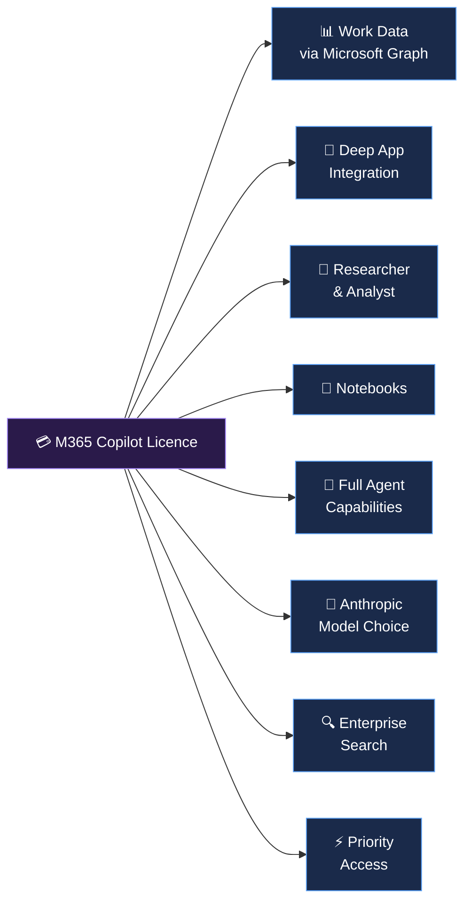
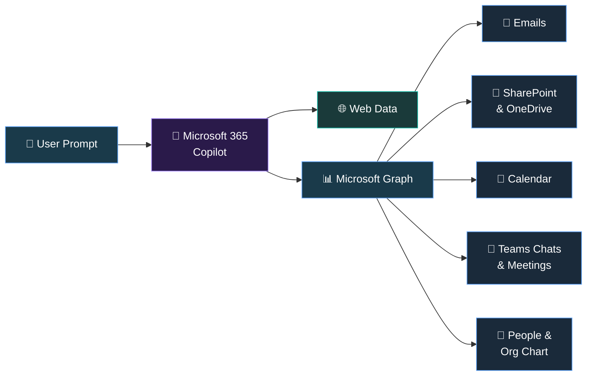
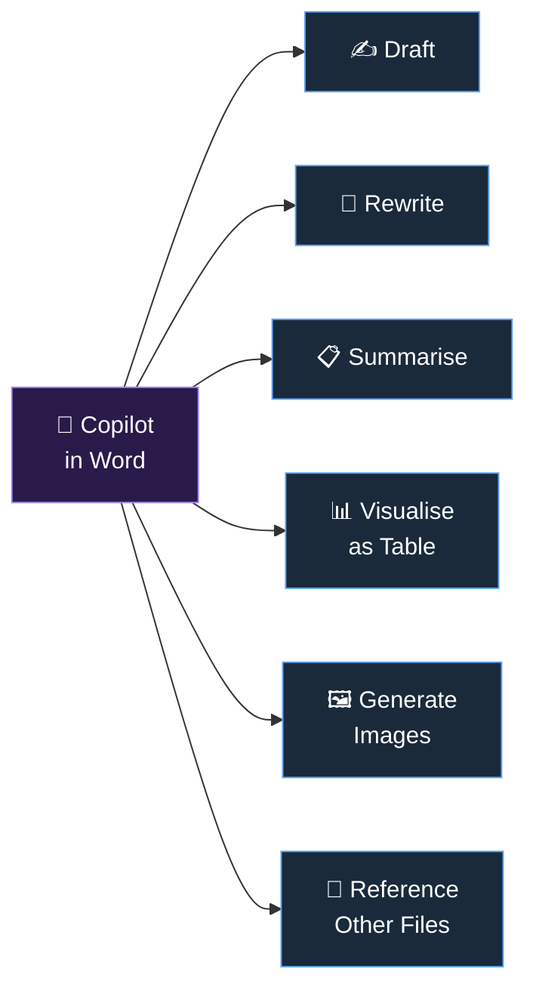
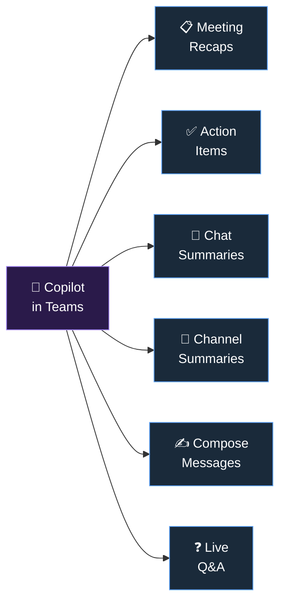
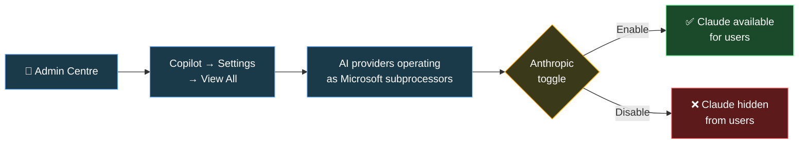

This is the companion guide to our [Copilot Chat (Free) Trainer Guide](/blog/microsoft-365-copilot-chat-complete-guide-for-trainers/). If your users don't have a paid Copilot licence yet, start there — everything in that guide still applies to licensed users too.

This guide covers **everything that the paid Microsoft 365 Copilot licence unlocks** — the features that transform Copilot from a chat tool into an **AI assistant embedded in every app your users touch, every day**.

> 📖 **Companion guide:** Start with our [Copilot Chat (Free) Guide](/blog/microsoft-365-copilot-chat-complete-guide-for-trainers/) for the foundations — security, EDP, chat features, Pages, memory, and custom instructions. Everything there applies here too.

📌 **This is a living document.** The AI landscape changes fast — features get added, renamed, or retired regularly. Rather than printing this guide, I'd recommend **bookmarking this page** or adding it to your browser's reading list. That way you always have the latest, most accurate version.

If you spot something outdated or think something should be added, please [let me know through the feedback page](/feedback/) — I'll update it so everyone benefits. Think of this as **our** shared resource. 🤝

### 📋 Table of Contents

- [What Does the Copilot Licence Unlock?](#what-does-the-microsoft-365-copilot-licence-unlock)
- [Work Data Grounding — The Game Changer](#work-data-grounding--the-game-changer)
- **Copilot in Every App**
  - [Copilot in Word](#copilot-in-word)
  - [Copilot in Excel](#copilot-in-excel)
  - [Copilot in PowerPoint](#copilot-in-powerpoint)
  - [Copilot in Outlook](#copilot-in-outlook)
  - [Copilot in Teams](#copilot-in-teams)
  - [Copilot in OneNote](#copilot-in-onenote)
  - [Copilot in OneDrive](#copilot-in-onedrive)
  - [Copilot in Loop](#copilot-in-loop)
- [Researcher & Analyst Agents](#researcher--analyst--advanced-reasoning-agents)
- [Notebooks — Deep Thinking Workspace](#notebooks--deep-thinking-workspace)
- [Full Agent Capabilities](#full-agent-capabilities)
- [Anthropic Claude — Model Choice](#anthropic-claude--model-choice)
- [AI-Powered Enterprise Search](#ai-powered-enterprise-search)
- [Positioning for Different Audiences](#positioning-copilot--for-ai-change-leads)
- [Pricing & Licensing](#pricing--licensing)
- [Official Microsoft Resources](#official-microsoft-resources)
- [Tools to Help Your Journey](#tools-i-built-to-help-your-copilot-journey)
- [FAQ](#frequently-asked-questions)

---

## What Does the Microsoft 365 Copilot Licence Unlock?

The paid licence transforms Copilot from a **web-grounded chat tool** into an **AI assistant that understands your work** — your emails, files, meetings, chats, and organisational context.

### Everything from Copilot Chat — Plus These Exclusive Features

| Feature | 🆓 Copilot Chat | 💳 M365 Copilot Licence |
|:--|:--|:--|
| **AI Chat (web grounded)** | ✅ Standard access | ✅ Priority access |
| **AI Chat (work data grounded)** | ❌ | ✅ Emails, files, meetings, chats |
| **File Upload** | ✅ Standard | ✅ Priority |
| **Copilot Pages** | ✅ | ✅ |
| **Agents** | ✅ Metered | ✅ Full access included |
| **Create (Designer)** | ✅ Templates | ✅ AI + templates + branding |
| **Memory & Custom Instructions** | ✅ | ✅ |
| **Copilot in Word** | ⚠️ Side pane only (if available) | ✅ Full: Draft, Rewrite, Summarise |
| **Copilot in Excel** | ⚠️ Side pane only (if available) | ✅ Full: Formulas, Charts, Agent Mode |
| **Copilot in PowerPoint** | ⚠️ Side pane only (if available) | ✅ Full: Create, Design, Translate |
| **Copilot in Outlook** | ✅ Chat + inbox grounding | ✅ Full: Draft, Summarise, Coach, Schedule |
| **Copilot in Teams** | ✅ Basic | ✅ Full: Meeting recaps, summaries, compose |
| **Copilot in OneNote** | ⚠️ If available | ✅ Full: Summarise, generate, organise |
| **Researcher agent** | ❌ | ✅ Deep web research with citations |
| **Analyst agent** | ❌ | ✅ Data analysis with Python |
| **Notebooks** | ❌ | ✅ Deep thinking workspace |
| **Enterprise Search** | ✅ Web search | ✅ AI-powered org + web search |
| **Anthropic Claude choice** | ⚠️ Limited (WXP agents) | ✅ Full model choice in apps |
| **Copilot Analytics** | ❌ | ✅ Usage & adoption dashboard |

> 🔧 **Explore every feature in detail:** Use our interactive [Copilot Feature Matrix](/copilot-matrix/) to compare across all tiers.

---

## Work Data Grounding — The Game Changer

This is the **single biggest difference** between Copilot Chat and the paid licence. With work data grounding, Copilot doesn't just search the web — it reads your **organisational data** through **Microsoft Graph**.

### What Copilot Can Access Through Microsoft Graph

| Data Source | Examples |
|:--|:--|
| **Outlook** | Emails, attachments, calendar events, contacts |
| **SharePoint** | Documents, sites, lists, pages |
| **OneDrive** | Personal files, shared documents |
| **Teams** | Chat messages, meeting transcripts, channel posts |
| **People** | Org chart, colleagues, reporting lines |
| **Planner** | Tasks, project plans |

### Security Is Preserved

💡 **Critical for trainers to understand:** Copilot only accesses data that the user **already has permission to see**. It respects all existing access controls, sensitivity labels, and compliance policies. If a user can't see a document in SharePoint, Copilot can't see it either. **No data boundaries are broken.**

🗣️ **Say this to your users:**

*"Copilot can now help you with questions about your actual work — your emails, your files, your meetings. Ask it 'What did Sarah say about the budget in last week's email?' or 'Summarise the key decisions from Tuesday's project meeting.' It finds the answers from your Microsoft 365 data, so you don't have to search manually."*

---

## Copilot in Word

Copilot in Word transforms document creation from a blank page into an AI-assisted workflow. It can **draft, rewrite, summarise, visualise, and reference** other documents.

### What Licensed Users Can Do

| Capability | What It Does | Try This Prompt |
|:--|:--|:--|
| **Draft from prompt** | Generate a full document from a description | *"Draft a project proposal for migrating our email to Microsoft 365. Include timeline, risks, and budget estimate."* |
| **Draft from file** | Create a document using another file as reference | *"Draft an executive summary based on /Q4-Sales-Report.docx"* |
| **Rewrite** | Select text and get alternative versions | Select a paragraph → *"Rewrite this to be more concise and professional"* |
| **Summarise** | Get key points from a long document | *"Summarise this document in 5 bullet points"* |
| **Visualise as table** | Convert text/lists into formatted tables | *"Turn the project phases listed above into a table with columns for Phase, Duration, and Owner"* |
| **Generate images** | Create AI images within the document | *"Add an image that represents digital transformation in a corporate setting"* |
| **Add from other files** | Reference multiple documents | *"Using /Budget-2026.xlsx and /Strategy-Doc.docx, draft a funding request"* |
| **Voice prompts** | Dictate instructions on mobile | Speak: *"Add a conclusion paragraph that summarises the key recommendations"* |

💡 **Trainer tip:** The `/` reference feature is a game-changer — users can type `/` and select files from SharePoint or OneDrive to use as context. Teach this early. It transforms Copilot from "generic AI writer" to "AI that knows our business."

---

## Copilot in Excel

Copilot in Excel turns data analysis from a specialist skill into something every knowledge worker can do. The standout feature is **Edit with Copilot** (formerly Agent Mode) — where Copilot directly modifies your spreadsheet.

### What Licensed Users Can Do

| Capability | What It Does | Try This Prompt |
|:--|:--|:--|
| **Formula suggestions** | Get formulas explained and created | *"Create a formula to calculate the percentage change between Q3 and Q4 revenue"* |
| **Chart creation** | Generate visualisations from your data | *"Create a bar chart comparing revenue by region"* |
| **Data insights** | Discover trends and patterns | *"What are the key trends in this sales data?"* |
| **Conditional formatting** | Highlight important data points | *"Highlight the top 3 values in the Revenue column"* |
| **Sort and filter** | Organise data with natural language | *"Sort this table by revenue, highest to lowest, and filter to only show the APAC region"* |
| **Edit with Copilot** | Copilot directly modifies your data | *"Add a column that calculates profit margin for each product"* |
| **Advanced analysis (Python)** | Complex statistical analysis | *"Run a correlation analysis between marketing spend and revenue using Python"* |
| **Think Deeper mode** | Elaborate analysis with reasoning models | *"Analyse this dataset for outliers and anomalies, explain what they might mean"* |

💡 **Trainer tip:** Excel is where many users first see the "wow" moment with Copilot. Start your demo here — show how a natural language question like *"What's driving our highest costs?"* generates instant insights from their actual data. It makes the value immediately tangible.

---

## Copilot in PowerPoint

Copilot in PowerPoint turns ideas into presentations — from a prompt, a Word document, or even a PDF. It handles design, content, speaker notes, and translations.

### What Licensed Users Can Do

| Capability | What It Does | Try This Prompt |
|:--|:--|:--|
| **Create from prompt** | Generate a full presentation from a description | *"Create a 10-slide presentation about our 2026 sustainability strategy for the board"* |
| **Create from Word/PDF** | Transform documents into slides | *"Create a presentation from /Q4-Strategy-Update.docx using our corporate template"* |
| **Add speaker notes** | Auto-generate notes for all slides | *"Add speaker notes to every slide in this presentation"* |
| **Add/edit slides** | Insert new slides with content | *"Add a slide comparing our pricing vs competitors"* |
| **Organise flow** | Restructure and add sections | *"Organise this presentation into three sections: Introduction, Analysis, and Recommendations"* |
| **Summarise** | Get key points from a long deck | *"Summarise the key findings from this presentation in 5 bullet points"* |
| **Design adjustments** | Change formatting across the deck | *"Make all headings consistent and add our brand colours"* |
| **Translate** | Translate entire presentations | *"Translate this presentation into te reo Māori"* |
| **Explain content** | Right-click any element for explanation | Right-click a chart → *"Explain"* |

💡 **Trainer tip:** The ability to create presentations from Word documents is incredibly powerful for knowledge workers who write reports. Show them the workflow: *Write the report in Word → Let Copilot turn it into a presentation → Add speaker notes → Present.* That's a 2-hour task reduced to 15 minutes.

---

## Copilot in Outlook

Copilot in Outlook helps users stay on top of their inbox, craft better emails, and simplify scheduling. It works with both **new Outlook** and **classic Outlook for Windows**.

### What Licensed Users Can Do

| Capability | What It Does | Try This Prompt |
|:--|:--|:--|
| **Summarise email threads** | Get key points from long conversations | Click *"Summary by Copilot"* on any long thread |
| **Draft emails** | Generate replies or new emails | *"Draft a reply thanking them for the proposal and suggesting a meeting next Tuesday"* |
| **Adjust tone & length** | Refine drafts to match context | *"Make this more formal"* or *"Shorten to 3 sentences"* |
| **Email coaching** | Get feedback on your draft | *"Coach me on this email — is the tone appropriate?"* |
| **Schedule meetings** | Turn emails into meetings | *"Schedule a 30-minute meeting with everyone on this thread for next week"* |
| **Prioritise inbox** | Surface what matters | *"What are my most important emails today?"* |
| **Custom instructions for drafts** | Set default draft preferences | Settings → *"Always use a friendly but professional tone, keep emails under 200 words"* |
| **Meeting recap in calendar** | Review meeting summaries | Open a past calendar event → view AI-generated meeting summary |

🗣️ **Say this to your users:**

*"Copilot in Outlook is like having a personal email assistant. It can summarise a 47-message thread in 10 seconds, draft a reply in your preferred tone, and even turn an email into a meeting invite with one click. The coaching feature is brilliant — it reviews your draft and tells you if the tone is right before you hit send."*

---

## Copilot in Teams

Copilot in Teams is where many users experience the **most immediate time savings**. Meeting recaps alone can save 15-30 minutes per meeting.

### What Licensed Users Can Do

| Capability | Where | Try This Prompt |
|:--|:--|:--|
| **Meeting recap** | During or after meetings | *"What were the key decisions made in this meeting?"* |
| **Action items** | Meetings | *"List all action items and who's responsible"* |
| **Catch-up summary** | Join a meeting late | *"What have I missed so far?"* |
| **Chat summary** | Group chats | *"Summarise this chat from the last 7 days"* |
| **Channel summary** | Channel posts | *"What's been discussed in this channel this week?"* |
| **Compose messages** | Chat/channels | *"Draft a message to the team announcing the new holiday policy. Keep it friendly."* |
| **Q&A during meetings** | Live meetings | *"Did anyone mention the timeline for Phase 2?"* |
| **Follow-up questions** | After meetings | Copilot suggests follow-up questions to ask |

💡 **Trainer tip:** Meeting recaps are the #1 feature that sells Copilot to sceptics. Demo this live in your session — join a Teams call, have a 5-minute conversation, then show the instant recap with action items. The "aha" moment happens every time.

---

## Copilot in OneNote

Copilot in OneNote transforms note-taking from passive recording to active AI-powered synthesis. It's your **thinking partner** for organising ideas, extracting insights, and generating content from your notes.

### What Licensed Users Can Do

| Capability | What It Does | Try This Prompt |
|:--|:--|:--|
| **Summarise notes** | Get key points from lengthy notes | *"Summarise my meeting notes from this page"* |
| **Draft plans** | Generate structured content | *"Create a project plan for the office relocation based on my notes"* |
| **Generate ideas** | Brainstorm and expand | *"Generate 10 creative ideas for our team building day"* |
| **Create task lists** | Extract actionable items | *"Create a to-do list from my notes about the product launch"* |
| **Rewrite text** | Improve clarity and tone | Select text → *"Rewrite this to be clearer and more structured"* |
| **Organise sections** | Restructure notebooks | *"Suggest a better structure for organising these notes"* |

---

## Copilot in OneDrive

Copilot in OneDrive lets you ask questions about your files directly from the OneDrive web interface — without opening each file individually.

**Example prompts:**
- *"Summarise the key findings from Q4-Report.pdf"*
- *"What are the action items mentioned in Meeting-Notes.docx?"*
- *"Compare the budget figures in Budget-v1.xlsx and Budget-v2.xlsx"*

Works with Word, PDF, PowerPoint, Excel, and text files.

---

## Copilot in Loop

Copilot in Loop enables AI-assisted collaborative content creation. Your team can work together on Loop pages while Copilot helps generate, refine, and organise content in real time.

**Key capabilities:**
- Draft collaborative content with AI assistance
- Summarise and share changes with your team using the Recap feature
- See when teammates are actively writing Copilot prompts
- Generate content that can be collaboratively edited by the whole team

---

## Researcher & Analyst — Advanced Reasoning Agents

These are the **premium agents** exclusive to licensed users. They represent a significant step up from regular Copilot chat.

### 🔬 Researcher

Researcher performs **deep, multi-step web research** with citations — like having a junior analyst who can spend hours researching a topic and deliver a comprehensive brief.

| Aspect | Details |
|:--|:--|
| **What it does** | Deep web research with cited sources |
| **How it's different** | Takes more time, does multiple searches, synthesises findings |
| **Model** | Can use Anthropic Claude for advanced reasoning |
| **Best for** | Market analysis, competitive intelligence, topic exploration, due diligence |

**Example prompts to try:**
- *"Research the current state of AI regulation in New Zealand and Australia. Include recent legislation, proposed changes, and how they compare to the EU AI Act."*
- *"Compile a competitive analysis of our top 5 competitors in the cloud consulting space in ANZ. Include strengths, weaknesses, and recent news."*
- *"Research best practices for Microsoft 365 Copilot adoption in organisations with 5,000+ employees."*

### 📊 Analyst

Analyst is a **data analysis agent** that uses Python under the hood to process, visualise, and interpret data. Think of it as a data scientist in your chat.

| Aspect | Details |
|:--|:--|
| **What it does** | Data analysis, visualisation, statistical modelling |
| **How it's different** | Uses Python for computation — not just formulas |
| **Model** | Can use Think Deeper mode for complex analysis |
| **Best for** | Sales analysis, trend detection, forecasting, data cleaning, visual reports |

**Example prompts to try:**
- *Upload a CSV →* *"Analyse this sales data. Show me monthly trends, identify the top-performing products, and flag any anomalies."*
- *"Create a dashboard-style summary with charts showing our Q1 performance vs targets."*
- *"Run a regression analysis to predict next quarter's revenue based on the last 8 quarters."*

💡 **Trainer tip:** Position Researcher and Analyst as the features that justify the Copilot licence for knowledge workers, analysts, and managers. Researcher replaces hours of manual web research. Analyst replaces the need to export data to Python notebooks or hire a data analyst for ad-hoc queries.

---

## Notebooks — Deep Thinking Workspace

Copilot Notebooks is a **secure, AI-powered workspace** for structured problem-solving. Unlike chat (which is transactional), Notebooks maintain context across interactions and let you build up a body of work over time.

### How Notebooks Differ from Chat and Pages

| Feature | Chat | Pages | Notebooks |
|:--|:--|:--|:--|
| **Purpose** | Quick Q&A | Collaborative canvas | Deep thinking workspace |
| **Context** | Single conversation | Shared page | Persistent across sessions |
| **References** | File upload | AI-generated content | Files + communications |
| **Collaboration** | No | Yes, real-time | Yes, via Pages |
| **Audio summaries** | No | No | ✅ Yes |
| **Available to** | Everyone | Everyone | 💳 Licensed users only |

### Use Cases for Notebooks

- **Quarterly forecasting** — Gather financial data, meeting notes, and market intel in one workspace
- **Strategy documents** — Build up research, analysis, and recommendations over multiple sessions
- **Project planning** — Synthesise inputs from multiple stakeholders and documents
- **Support triage** — Collect issue reports, analyse patterns, draft response plans

---

## Full Agent Capabilities

With the paid licence, users get **comprehensive agent access** — no metering, no billing plans needed.

### What Licensed Users Can Do with Agents

| Capability | Free Users | Licensed Users |
|:--|:--|:--|
| **Use pre-built agents** | ✅ | ✅ |
| **Use pay-as-you-go agents** | ✅ (metered) | ✅ (included) |
| **Create agents (web grounded)** | ⚠️ If admin allows | ✅ |
| **Create agents (document grounded)** | 💰 Requires billing | ✅ Included |
| **Create agents (SharePoint grounded)** | 💰 Requires billing | ✅ Included |
| **Researcher** | ❌ | ✅ |
| **Analyst** | ❌ | ✅ |
| **Custom Copilot Studio agents** | ❌ | ✅ |

🗣️ **Say this to your users:**

*"With your Copilot licence, you can create custom AI assistants — called agents — that know about specific topics. For example, you could create an agent grounded in your HR policies document so anyone in the team can ask it questions about leave, benefits, or expenses. Or an agent grounded in your product knowledge base for the sales team."*

---

## Anthropic Claude — Model Choice

Microsoft 365 Copilot now offers **model choice** — users can select between **OpenAI GPT** and **Anthropic Claude** models in certain apps. This is a significant advantage for users who want to compare outputs or leverage Claude's strengths in specific tasks.

### Where Claude Is Available

| App / Feature | Claude Available? | Notes |
|:--|:--|:--|
| **Copilot Chat (Researcher)** | ✅ | Select Claude from model picker |
| **Word** | ✅ | Available since late 2025 |
| **Excel (Agent Mode)** | ✅ | Select Claude from model picker |
| **PowerPoint** | ✅ | Available for content generation |
| **Copilot Studio** | ✅ | Creators select model during agent creation |
| **OneNote** | ❌ | Not yet available |
| **Teams** | ❌ | Not yet available |
| **Outlook** | ❌ | Not yet available |

### How to Enable Anthropic Claude (Admin Steps)

**Step-by-step:**
1. Go to **[Microsoft 365 Admin Center](https://admin.microsoft.com)** → select **Copilot** → **Settings** → **View All**
2. Select **"AI providers operating as Microsoft subprocessors"**
3. Under **Available subprocessors**, find **Anthropic** and click **Enable**
4. Changes take effect within minutes to a few hours

### Regional Defaults

| Region | Default Status | Action Needed |
|:--|:--|:--|
| **Non-EU Commercial** | ✅ Enabled by default | No action needed |
| **EU / EFTA / UK** | ❌ Disabled by default | Admin must opt in |
| **Government (GCC, GCC-H, DoD)** | 🚫 Not available | No toggle shown |

> ⚠️ **Important:** Data sent to Claude is processed **outside** the Microsoft EU Data Boundary. Anthropic acts as a Microsoft subprocessor and does **not** retain or use data for its own training. The Microsoft DPA applies.

### How Users Select Models

In supported apps, users see a **model selector** in the UI — typically at the top right. They can switch between:
- **Auto** — Copilot chooses the best model (default)
- **GPT-5** — OpenAI's latest model
- **Claude** — Anthropic's model (when available)

💡 **Trainer tip:** For most users, recommend **Auto mode** as the default. Only teach model switching to power users who want to compare outputs — for example, trying a complex analysis in both GPT and Claude to see which gives better results. Claude tends to excel at nuanced long-form writing and strategic analysis.

> 📖 **Official reference:** [Anthropic as a subprocessor for Microsoft Online Services](https://learn.microsoft.com/en-us/microsoft-365/copilot/connect-to-ai-subprocessor)

---

## AI-Powered Enterprise Search

For licensed users, **Search** transforms from basic web search into an AI-powered enterprise knowledge finder.

### What Enterprise Search Can Find

| Source | Examples |
|:--|:--|
| **📧 Outlook** | Emails, attachments, calendar items |
| **📄 SharePoint** | Documents, sites, pages, lists |
| **💾 OneDrive** | Personal and shared files |
| **💬 Teams** | Chat messages, channel posts, meeting content |
| **👥 People** | Colleagues, org chart, expertise |
| **📅 Calendar** | Events, meeting details |
| **📦 Archived mailboxes** | Historic emails (append *"from my archives"*) |

**Example prompts:**
- *"Find the presentation Sarah shared about the Melbourne project last month"*
- *"What emails have I received about the budget review this week?"*
- *"Who in our team has expertise in Azure networking?"*

🗣️ **Say this to your users:**

*"Stop digging through SharePoint folders and email threads. With Copilot Search, just ask in plain English — 'Find the contract we signed with Contoso last quarter' or 'What did the marketing team share about the rebrand?' Copilot searches across your emails, files, Teams messages, and more, and gives you the answer directly."*

---

## Positioning Copilot — For AI Change Leads

### For Leadership / Executives

🗣️ **Say this to executives:**

*"Microsoft 365 Copilot is the AI layer across your entire productivity stack. It reads your organisation's data — emails, files, meetings, chats — and turns it into instant insights, drafts, and actions. Early adopters are reporting 30-40% time savings on routine tasks. It's not just a chat tool — it's AI that does your team's busywork so they can focus on strategy."*

### For End Users

🗣️ **Say this to end users:**

*"Copilot is like having a brilliant assistant who's read every email you've sent, every document you've worked on, and every meeting you've attended. Ask it anything about your work and it finds the answer. Ask it to write something and it drafts it in your style. Ask it to analyse data and it creates charts in seconds. And everything it does stays private and secure."*

---

## Pricing & Licensing

| Plan | Price | Minimum | Commitment |
|:--|:--|:--|:--|
| **Enterprise** (E3/E5, 300+ users) | $30 USD/user/month | 1 user | Annual |
| **Business** (< 300 users) | $21 USD/user/month | 1 user | Annual |
| **Education** | Discounted | Varies | Annual |

> 🔧 **Need help understanding licensing?** Use our interactive [Microsoft Licensing Simplifier](/licensing/) to compare all M365 plans side-by-side.

> 💰 **Want to calculate the ROI?** Try our [Copilot ROI Calculator](/roi-calculator/) — estimate time savings, cost recovery, and break-even timeline for your organisation.

---

## Official Microsoft Resources

| Resource | What It Covers | Link |
|:--|:--|:--|
| **M365 Copilot Overview** | Full product overview for admins | [learn.microsoft.com](https://learn.microsoft.com/en-us/copilot/microsoft-365/microsoft-365-copilot-overview) |
| **Copilot App Overview** | App features, licence comparison | [learn.microsoft.com](https://learn.microsoft.com/en-us/microsoft-365/copilot/microsoft-365-copilot-app-overview) |
| **Release Notes** | Latest feature updates | [learn.microsoft.com](https://learn.microsoft.com/en-us/microsoft-365/copilot/release-notes) |
| **Enterprise Data Protection** | Security & compliance details | [learn.microsoft.com](https://learn.microsoft.com/en-us/microsoft-365/copilot/enterprise-data-protection) |
| **Anthropic Subprocessor** | Claude model admin settings | [learn.microsoft.com](https://learn.microsoft.com/en-us/microsoft-365/copilot/connect-to-ai-subprocessor) |
| **Copilot in Word FAQ** | Word features & tips | [support.microsoft.com](https://support.microsoft.com/office/7fa03043-130f-40f3-9e8b-4356328ee072) |
| **Copilot in Excel FAQ** | Excel features & tips | [support.microsoft.com](https://support.microsoft.com/office/7a13758f-d61e-4a56-8440-f2c9a07802ec) |
| **Copilot in PowerPoint FAQ** | PowerPoint features & tips | [support.microsoft.com](https://support.microsoft.com/office/3e229188-9086-4f4c-9f9f-824cd25ae84f) |
| **Copilot in Outlook FAQ** | Outlook features & tips | [support.microsoft.com](https://support.microsoft.com/office/07420c70-099e-4552-8522-7d426712917b) |
| **Copilot in Teams FAQ** | Teams features & tips | [support.microsoft.com](https://support.microsoft.com/office/e8737767-4087-4ae6-b1d8-10264152b05a) |
| **Copilot Success Kit** | Deployment & adoption resources | [adoption.microsoft.com](https://adoption.microsoft.com/copilot/success-kit/) |
| **Copilot Scenarios Library** | Role-based use cases | [adoption.microsoft.com](https://adoption.microsoft.com/copilot/scenarios/) |
| **Copilot Academy** | Training & skilling paths | [learn.microsoft.com](https://learn.microsoft.com/en-us/viva/learning/academy-copilot) |
| **Responsible AI** | Microsoft's AI principles | [microsoft.com](https://www.microsoft.com/ai/responsible-ai) |

---

## Tools I Built to Help Your Copilot Journey

I build free tools to make Copilot adoption easier for everyone. Here are the ones that go hand-in-hand with this guide:

| Tool | What It Helps With |
|:--|:--|
| 🔧 [Copilot Feature Matrix](/copilot-matrix/) | Compare every Copilot feature across Free, Chat, Pro, and M365 tiers |
| 📋 [Copilot Readiness Checker](/copilot-readiness/) | 30-question assessment across 7 pillars — is your org ready? |
| 💰 [Copilot ROI Calculator](/roi-calculator/) | Calculate time savings, cost recovery, and break-even |
| 📜 [Microsoft Licensing Simplifier](/licensing/) | Understand M365 licensing plans side-by-side |
| 📝 [AI Prompt Library](/prompts/) | 84 ready-to-use prompts across 8 platforms |
| ✨ [Prompt Polisher](/prompt-polisher/) | Score and improve any prompt with the CRAFTS framework |
| 🎓 [Prompt Engineering Guide](/prompt-guide/) | Learn 8 prompt engineering techniques with hands-on exercises |

---

## Also Read: The Free Copilot Chat Guide

If your organisation has users who **don't** have a paid Copilot licence, make sure they have this guide too:

👉 **[Microsoft 365 Copilot Chat (Free) — Complete Trainer Guide](/blog/microsoft-365-copilot-chat-complete-guide-for-trainers/)**

It covers everything about the free Copilot Chat experience — security, EDP, chat, file upload, Pages, agents, memory, custom instructions, and the April 15, 2026 changes. All of those foundations apply to licensed users too.

---

> **Disclaimer:** The views and opinions expressed in this article are my own and do not represent the official positions of Microsoft. I work at Microsoft as a Copilot Solution Engineer, but this guide is based on my own research, experience, and publicly available documentation. All pricing mentioned is in USD and was sourced from official Microsoft pricing pages at the time of writing — pricing, features, and availability are subject to change. Always refer to [official Microsoft documentation](https://learn.microsoft.com) for the most up-to-date and accurate information.
