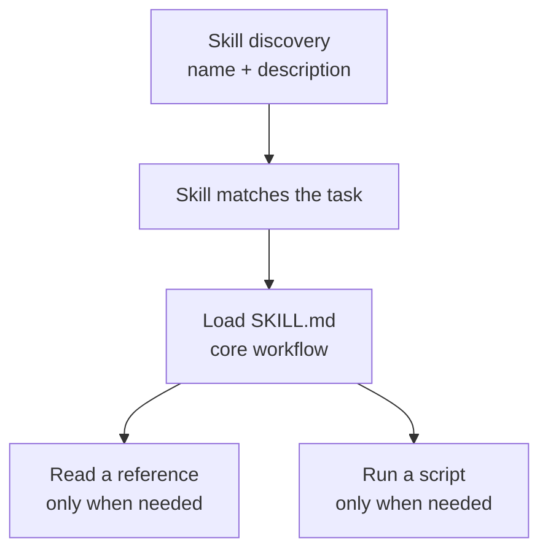

<div class="living-doc-banner">

**Living guide.** Microsoft is rolling Skills into different Copilot surfaces at different speeds. This page separates what is generally available, what is rolling out, and what is still in preview. Public sources last checked: 31 July 2026.

</div>

**A Copilot Skill is a reusable set of instructions for a repeatable task.** Instead of explaining your process from scratch every time, you give Copilot a small instruction package that describes when to use the process, the steps to follow, and what a good result looks like.

The confusing part is not the definition. It is the product map.

PowerPoint has a **Choose skills** experience. Excel has end-user Skills *and* a separate developer preview for Office.js-based custom Skills. Cowork has built-in Skills, personal Skills, and packaged plugin Skills. Word has agentic editing, but I could not find a public Word-specific `SKILL.md` picker at the time of writing.

This guide puts those pieces on one page.

<!-- Screenshot planned: Three-panel montage showing PowerPoint Choose skills, Excel Copilot Skills, and Cowork Customize > Skills. -->

## The short version

- A **Skill** teaches Copilot a reusable method for a task.
- The portable unit is usually a **folder** with a required `SKILL.md` file.
- `SKILL.md` starts with YAML frontmatter, followed by Markdown instructions.
- The required frontmatter fields are `name` and `description`.
- Where the host supports them, a Skill can also include reference material, scripts, and other assets.
- Skills use an [open Agent Skills specification](https://agentskills.io/specification), but each product adds its own limits and packaging rules.
- Microsoft 365 does **not** expose one identical Skills experience everywhere.
- Excel's Office.js custom Skills are **Preview** and Microsoft says not to use them in production.
- Cowork is the clearest example of the full ladder: built-in Skills, personal custom Skills, and packaged Skills deployed through plugins.

One format does not mean one identical product experience. The host still decides what a Skill can access, execute, and publish.

## What is a Copilot Skill?

Microsoft's [PowerPoint Skills support page](https://support.microsoft.com/en-us/powerpoint/copilot/copilot-in-powerpoint-skills) describes a Skill as a reusable, instruction-based capability that gives an AI model domain expertise, workflows, and task-specific guidance.

Microsoft's [Cowork plugin development guide](https://learn.microsoft.com/en-us/microsoft-365/copilot/cowork/cowork-plugin-development) uses plainer language: Skills are prompt-based workflows that teach Cowork new domain expertise.

Put those together and the practical definition is:

**A Skill is a saved method, not a saved answer.**

A useful Skill might teach Copilot how to:

- turn a project update into a five-slide executive deck;
- review a workbook using your team's quality checks;
- create a weekly status report in a fixed format;
- inspect a contract using an approved clause taxonomy;
- prepare a customer brief without inventing missing facts.

The task can change each time. The method stays reusable.

## Skill vs prompt vs plugin vs agent

These words are close enough to get mixed together. They are not interchangeable.

| Term | What it is | Best mental model |
|---|---|---|
| **Prompt** | The instruction you give Copilot for this interaction | A brief for one job |
| **Skill** | Reusable instructions that teach a repeatable method | A recipe card |
| **Plugin** | A Microsoft 365 app package that can contain Skills, connectors, or both | A packaged extension |
| **Connector** | A connection to an external service or API, including a remote MCP server | A governed doorway to another system |
| **Agent** | A broader custom Copilot experience that can combine instructions, knowledge, Skills, actions, connectors, and APIs | A specialist with a defined job |

The distinction matters because the governance boundary changes:

- A personal Skill can be instructions stored in your OneDrive.
- A Cowork plugin can package Skills with connectors that reach external systems.
- An agent can bring together several capabilities and have its own deployment lifecycle.

Microsoft's [Cowork plugin guide](https://learn.microsoft.com/en-us/microsoft-365/copilot/cowork/cowork-plugin-development) defines plugins as packages containing Skills and connectors. The [Microsoft 365 admin guide for agents](https://learn.microsoft.com/en-us/microsoft-365/admin/manage/manage-copilot-agents-integrated-apps?view=o365-worldwide) describes agents as broader custom Copilot experiences. Treating all three as "just a Skill" hides the part an admin actually needs to review.

## Where Copilot Skills are available

There is no single availability label that safely covers every Microsoft 365 surface.

| Surface | Publicly documented state on 31 July 2026 | What you can safely say |
|---|---|---|
| **PowerPoint end-user Skills** | Microsoft Support documents **Choose skills**, `@` mentions, **Manage skills**, personal upload, editing, and deletion. Microsoft's June update says the feature rolled out in July. | Documented and rolling out. The public support page does not give a full platform or licence matrix. |
| **Excel end-user Skills** | Microsoft Support documents **Add work content > All Skills**, `@` mentions, **Manage skills**, and OneDrive-backed custom Skills. Microsoft's 25 June Excel post says pre-built Skills are GA and personal custom Skills were rolling to GA across web, Windows, and Mac in July 2026. | Publicly documented. Confirm the personal custom-Skills rollout in your tenant; the public page does not give a Skills-specific licence matrix. |
| **Excel custom Skills using Office.js** | The developer overview and tutorial are explicitly labelled **Preview**. Both say not to use these Skills in production. | Preview only. Keep this separate from the end-user Skills announcement. |
| **Word** | Microsoft documents **Edit with Copilot** and agentic editing. No public Word-specific `SKILL.md` picker or upload page was found in the sources checked. | Recheck for a Word Skills page if you read this after the last-verified date. |
| **Cowork** | Cowork is generally available. It has built-in Skills, personal custom Skills, uploaded Skills, shared Skills, and plugin Skills. | The most complete public Skills model in Microsoft 365 today. |

<!-- Screenshot planned: PowerPoint Copilot pane with the plus menu open and Choose skills highlighted. -->

<!-- Screenshot planned: Copilot in Excel showing the end-user Skills selector or an active Skill in the workbook experience. -->

<!-- Screenshot planned: Cowork Customize page showing the separate Plugins and Skills tabs. -->

> **Things to know**
>
> A support page proves that a feature is documented. It does not automatically prove that every tenant, platform, channel, or licence has it on the same day. Microsoft uses staged deployment, so the honest label for PowerPoint is **rolling out** until the public release material gives a clearer universal status.

## The anatomy of a Skill folder

The [Agent Skills specification](https://agentskills.io/specification) starts with a directory containing at least one file:

```text
my-skill/
├── SKILL.md          # Required: metadata and instructions
├── references/       # Optional: detailed material loaded when needed
├── scripts/          # Optional: executable utilities
└── assets/           # Optional: templates and other resources
```

Microsoft's Cowork packaging model places one or more of those folders under a `skills/` directory:

```text
my-extension/
└── skills/
    └── weekly-status-report/
        ├── SKILL.md
        ├── references/
        │   └── reporting-rules.md
        └── scripts/
            └── validate-report.py
```

The folder is the Skill. `SKILL.md` is its front door.

<!-- Screenshot planned: Code editor showing a complete Skill folder with SKILL.md, references, and scripts expanded. -->

## Inside SKILL.md

Every `SKILL.md` has two parts:

1. YAML frontmatter between `---` markers.
2. A Markdown body containing the instructions.

Here is a deliberately small example:

```markdown
---
name: weekly-status-report
description: >
  Creates a weekly project status report with progress, risks,
  decisions, and next actions. Use when the user asks for a
  weekly update, project status, or Friday report.
---

# Weekly status report

## Workflow

1. Gather the source material named by the user.
2. Separate confirmed facts from missing information.
3. Draft progress, risks, decisions, and next actions.
4. Ask for confirmation instead of inventing a missing owner or date.

## Output format

Use the headings:

- Progress
- Risks
- Decisions
- Next actions
```

### Required frontmatter

| Field | Requirement |
|---|---|
| `name` | 1-64 characters; lowercase letters, numbers, and hyphens; must match the parent folder name |
| `description` | 1-1024 characters; explain what the Skill does and when it should be used |

The naming rules are strict:

- use lowercase letters, numbers, and hyphens;
- do not start or end with a hyphen;
- do not use consecutive hyphens;
- make the `name` value match the folder exactly.

Microsoft's Cowork development guide calls folder-to-name mismatch the most common cause of Skill failures.

```text
skills/weekly-status-report/SKILL.md
name: weekly-status-report
```

That works.

```text
skills/weekly-status-report/SKILL.md
name: WeeklyStatusReport
```

That does not.

### Optional frontmatter

The open specification also defines optional fields:

| Field | Purpose |
|---|---|
| `license` | Names the licence or points to a bundled licence file |
| `compatibility` | Describes product, package, network, or environment requirements |
| `metadata` | Stores implementation-specific key-value metadata |
| `allowed-tools` | Experimental list of pre-approved tools; host support varies |

Microsoft examples commonly use `metadata` for values such as author, version, category, and tags. Those values can help a host, but they do not replace a clear `description`.

> Things to know
>
> The `description` is not marketing copy. It helps the agent decide whether to load the Skill. Include the real phrases a user is likely to say, but do not make the Skill so broad that it activates for unrelated work.

## How progressive loading works

Skills are designed to avoid loading every instruction into the model all the time.

The open specification describes three levels of progressive disclosure:

| Layer | When it is used | Guidance |
|---|---|---|
| **Metadata** | Available during Skill discovery | Roughly 100 tokens for `name` and `description` |
| **SKILL.md body** | Loaded when the Skill is activated | Keep it under 5,000 tokens and 500 lines as a recommendation |
| **Resources** | Read or used only when the task needs them | Put detailed references, templates, and utilities here |

These are design recommendations from the [Agent Skills specification](https://agentskills.io/specification), not universal upload limits.

Microsoft's Cowork guide adds host-specific behaviour and limits. It recommends roughly 1,500-2,000 words for the main workflow, loads references on demand, and describes scripts as executed rather than placed into the model's context. Another Agent Skills host can make different implementation choices.



The practical rule is simple: keep the method in `SKILL.md`; move the encyclopedia somewhere else.

## The three-level distribution ladder

You will often hear Skills explained in three tiers. It is a useful mental model, with one important warning: it is clearest in Cowork and should not be treated as a universal Microsoft product taxonomy.

| Level | Who supplies it | Example |
|---|---|---|
| **Built-in** | Microsoft ships it with the Copilot surface | Cowork's Word, Excel, PowerPoint, Email, and other built-in Skills |
| **Personal custom** | A user creates or uploads it | A `SKILL.md` saved to the user's OneDrive and used in Cowork or PowerPoint |
| **Packaged and deployed** | A developer packages it; an admin or marketplace distributes it | A Cowork plugin containing Skills and optional connectors |

### Built-in Skills

Cowork publicly documents a built-in Skills set for document creation, email, scheduling, meetings, search, research, and communications. PowerPoint's picker also shows Skills provided by Copilot alongside custom uploads.

### Personal custom Skills

PowerPoint lets a user upload a Skill, paste one through **Add skill**, or place the Skill folder in the OneDrive Skills folder. The uploaded Skill is for that user's personal use.

Cowork provides three personal creation routes:

- a guided flow from **Customize**;
- asking Cowork to build a Skill in chat;
- creating a `SKILL.md` folder manually in OneDrive.

Cowork also accepts `.md`, `.zip`, and `.skill` uploads from its Customize page. Microsoft warns users to upload Skills only from trusted sources because a Skill is an instruction set the AI will follow.

### Packaged and admin-deployed Skills

Cowork plugins use the Microsoft 365 app package model. A package can contain:

- Skills only;
- Skills plus remote connectors;
- connectors only.

Admins can deploy a plugin to everyone or selected groups, allow users to acquire it, or block it. Public plugins can be submitted through Partner Center for the Microsoft 365 App Store.

That packaging and governance story is specific and well documented for Cowork. Do not assume an organization-published Cowork Skill automatically appears in every Office app's Skill picker.

## The open Agent Skills standard

The interesting part of `SKILL.md` is that it is not a Microsoft-only format.

The live [Agent Skills client showcase](https://agentskills.io/clients) lists clients including Claude Code, GitHub Copilot, VS Code, Gemini CLI, Cursor, JetBrains Junie, OpenAI Codex, and many others. Microsoft's Cowork development guide describes the same format as supported by more than 30 AI tools.

That gives a Skill a better starting point for portability:

- the folder structure is recognisable;
- the `name` and `description` fields have shared rules;
- the Markdown body remains readable outside one vendor's tooling;
- references and scripts can travel with the instructions.

But portable does not mean identical.

| Portable part | Host-specific part |
|---|---|
| `SKILL.md` structure | Where Skills are stored |
| Required metadata | Which tools and script runtimes are available |
| Folder naming rules | Upload and package limits |
| Markdown instructions | Permission, approval, and policy enforcement |
| Relative file references | Publishing and admin workflow |

Treat portability as "the same instruction package has a head start," not "every host will execute every line the same way."

## Security and governance

A Skill can look like a harmless Markdown file. The real risk depends on what the host lets that Skill do.

### Cowork does not bypass existing Microsoft 365 permissions

Cowork runs with the signed-in user's permissions. If the user cannot access a file or email, Cowork cannot use that Skill to bypass the permission.

Sensitivity labels and encryption can add another layer of protection. The [current Purview support matrix for Cowork](https://learn.microsoft.com/en-us/purview/ai-copilot-cowork) lists support for sensitivity labels, audit, Insider Risk Management, Communication Compliance, eDiscovery, and Data Lifecycle Management.

### DLP needs precise wording

Do not write that every Skill simply "inherits DLP."

The same Purview support matrix marks Data loss prevention as unsupported for Cowork AI interactions on the public page checked for this guide. Microsoft has announced other DLP controls around Copilot data and external email grounding, but that is not the same as full DLP coverage for every Cowork interaction.

### Connectors change the review

A Skill-only plugin contains instructions. A plugin with a connector can call an external service.

Cowork's remote MCP connector model supports:

- Streamable HTTP over HTTPS;
- JSON-RPC 2.0;
- tool discovery and invocation through MCP;
- anonymous and OAuth vault authentication;
- Dynamic Client Registration when the server supports it.

Credentials are stored through Microsoft's token-store pattern rather than embedded in `SKILL.md`.

Cowork-specific pages show `ApiKeyPluginVault`, while Microsoft's general plugin-authentication table says API key is not supported for MCP plugins. Validate an API-key MCP package in a test tenant before promising that path.

For an authenticated connector, an admin cannot sign in on a user's behalf. Each user completes the sign-in or consent flow the first time the connector is used, unless the connector is anonymous.

### Information Barriers are a current caveat

Microsoft's Cowork plugin development and admin pages say Microsoft Purview Information Barriers are not currently supported for plugin or Skill management and sharing. In tenants with Information Barriers enabled, embedded knowledge-file uploads are blocked at the tenant level, preventing affected plugins and Skills from being uploaded or published.

Scope that statement carefully. It is a documented Cowork plugin and Skill management limitation, not a claim that every Copilot feature ignores Information Barriers.

<!-- Screenshot planned: Microsoft 365 admin center Agents > Tools view showing plugin availability controls. -->

> **Admin note**
>
> Review the instruction *and* its reach. A short `SKILL.md` that only formats a document is a different risk from a packaged Skill that can call a remote system, send data, or take an action.

## Things to know before you write one

1. **Start from a real task.** A generic "help with finance" Skill will be harder to trigger and test than a specific month-end variance review.
2. **Make the trigger precise.** Describe what the Skill does and the wording that should activate it.
3. **Match the folder and name exactly.** This is a validation rule, not a style preference.
4. **Keep the body focused.** Put detailed policy, examples, and schemas in references.
5. **Name the output.** A table, slide structure, checklist, or document outline gives the agent a target.
6. **Handle missing facts.** Tell the Skill when to ask, stop, or mark an unknown instead of guessing.
7. **Test negative cases.** Confirm that the Skill stays quiet when a similar but out-of-scope request appears.
8. **Verify the host.** A script that works in one client might not have the same runtime or permissions in another.
9. **Check the current package schema.** Microsoft's current Cowork pages show both v1.28 and `devPreview` manifest examples.
10. **Treat uploads as code-adjacent.** Read a Skill before trusting it, especially when it includes scripts or connectors.

## Find or record a Skill

You do not always need to start from a blank `SKILL.md`.

### Browse CAT Agent Skills

The [CAT Agent Skills gallery](https://microsoft.github.io/cat-agent-skills/) is a Microsoft-hosted community catalogue for Cowork, Copilot Studio and Scout.

As of 31 July 2026, it lists 71 entries from 38 named authors. Downloads can include scripts, references and assets exactly as contributed.

> Trust the format, then review the content
>
> CAT validates metadata and package shape. It does not publicly claim that every community Skill is security-reviewed, functionally tested or Microsoft-certified. Read the `SKILL.md` and every bundled script before installing.

### Learn from a real workflow

[Microsoft Skill Recorder](/blog/microsoft-skill-recorder-copilot-skills/) is an experimental record-to-Skill source project. It can turn a reviewed workflow analysis into a Scout or Cowork `SKILL.md`, or a Scout automation.

It is not a Microsoft 365 managed service. Analysis sends selected recording data to GitHub Copilot, Copilot Studio output is still coming soon, and v0.3.1 should be tested only with synthetic data in an isolated lab.

## Pick your path

This is the hub. Each spoke goes deeper into one surface or job.

- **[Skills in PowerPoint](/blog/microsoft-365-copilot-skills-powerpoint/)** — Choose skills, `@` mention, Manage skills, personal upload, edit, and delete.
- **[Skills in Excel](/blog/microsoft-365-copilot-skills-excel/)** — the end-user experience, then the separate Office.js developer preview.
- **[Skills in Word](/blog/microsoft-365-copilot-skills-word/)** — what exists today, what does not have public documentation yet, and how Edit with Copilot fits.
- **[Cowork Skill packaging and distribution](/blog/microsoft-365-copilot-skills-cowork-packaging-distribution/)** — Microsoft 365 app packages, connectors, MCP, conversion, validation, and publishing.
- **[Write your first SKILL.md](/blog/write-your-first-skill-md-microsoft-365-copilot/)** — a practical authoring walkthrough with folder rules, references, scripts, and failure patterns.
- **[Microsoft Skill Recorder](/blog/microsoft-skill-recorder-copilot-skills/)** — record a synthetic workflow, review the inferred steps, and generate a Scout or Cowork Skill.
- **[Admin and governance for Copilot Skills](/blog/microsoft-365-copilot-skills-admin-governance/)** — tenant deployment, plugin controls, permissions, Purview, DLP precision, and the Information Barriers caveat.

Already using Cowork? The existing [Cowork Skills and plugins guide](/blog/microsoft-copilot-cowork-skills-and-plugins/) covers the end-user Skills page, built-in Skills, and personal creation flow. The new Cowork spoke in this series is intentionally focused on developer packaging and distribution instead of repeating that walkthrough.

## Official public sources

- [Use custom Skills with Copilot in PowerPoint](https://support.microsoft.com/en-us/powerpoint/copilot/copilot-in-powerpoint-skills)
- [Overview of Copilot Skills for Excel using Office.js](https://learn.microsoft.com/en-us/office/dev/add-ins/excel/excel-skills)
- [Create a Copilot Skill for Excel using Office.js](https://learn.microsoft.com/en-us/office/dev/add-ins/excel/excel-copilot-skill)
- [Build plugins for Copilot Cowork](https://learn.microsoft.com/en-us/microsoft-365/copilot/cowork/cowork-plugin-development)
- [Use Copilot Cowork](https://learn.microsoft.com/en-us/microsoft-365/copilot/cowork/use-cowork)
- [Customize Copilot Cowork](https://learn.microsoft.com/en-us/microsoft-365/copilot/cowork/cowork-customize)
- [Manage Cowork plugins as an administrator](https://learn.microsoft.com/en-us/microsoft-365/copilot/cowork/cowork-manage-plugins)
- [Manage Copilot Cowork for your organization](https://learn.microsoft.com/en-us/microsoft-365/copilot/cowork/cowork-admin-governance)
- [Use Microsoft Purview with Copilot Cowork](https://learn.microsoft.com/en-us/purview/ai-copilot-cowork)
- [Edit with Copilot in Word](https://support.microsoft.com/en-us/word/edit-with-copilot-in-word)
- [Microsoft 365 Copilot June 2026 feature update](https://techcommunity.microsoft.com/blog/Microsoft365CopilotBlog/what%E2%80%99s-new-in-microsoft-365-copilot--june-2026/4529572)
- [Agent Skills specification](https://agentskills.io/specification)
- [Agent Skills client showcase](https://agentskills.io/clients)
- [CAT Agent Skills gallery](https://microsoft.github.io/cat-agent-skills/)
- [Microsoft Skill Recorder](https://github.com/microsoft/skill-recorder)
