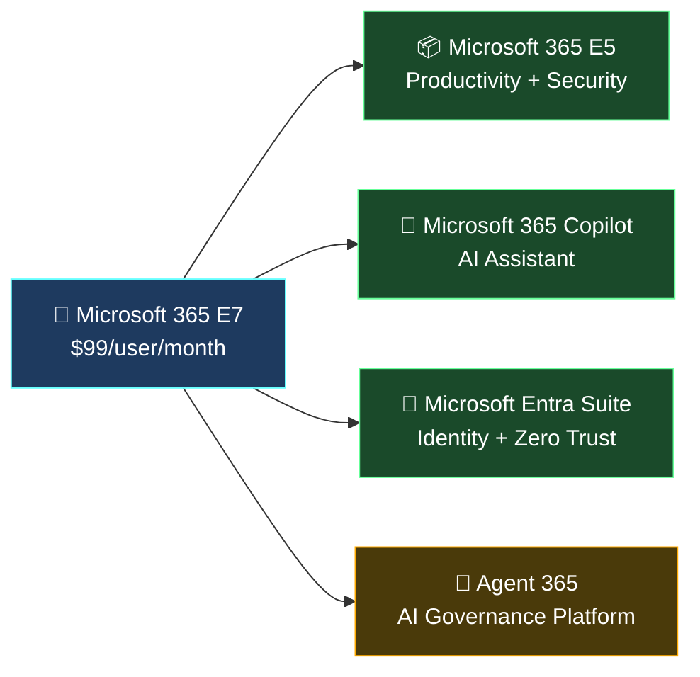
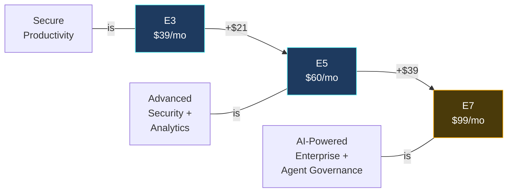
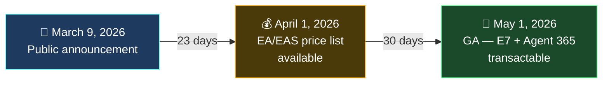
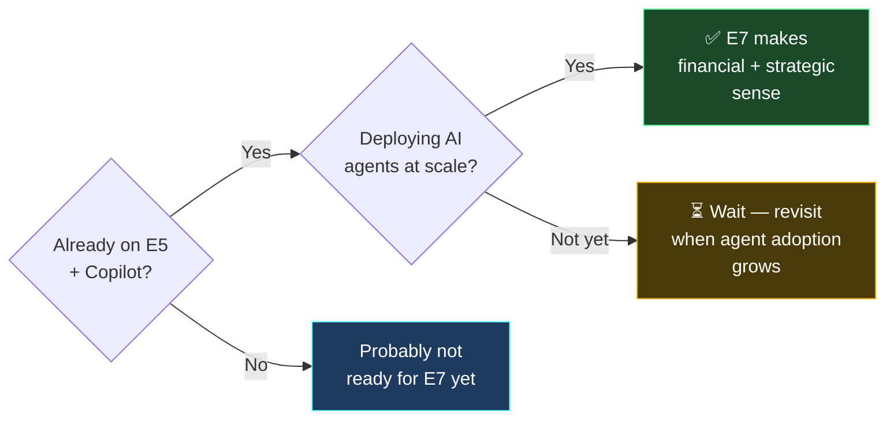

Microsoft just announced its biggest licensing shakeup in years. **Microsoft 365 E7** — codenamed the **"Frontier Suite"** — is a brand-new top-tier plan that bundles E5, Copilot, the Entra Suite, and the entirely new **Agent 365** platform into a single $99/user/month SKU. It goes GA on **May 1, 2026**.

This isn't just "E5 plus Copilot". E7 introduces a **governance layer for AI agents** that doesn't exist in any other plan — making it the first Microsoft 365 suite built for an enterprise where humans and AI agents work side by side.

This guide covers everything: what's inside, how it compares to E3 and E5, what Agent 365 actually does, pricing math, and whether your organisation should upgrade.

**Quick links:** [What's inside?](#whats-inside-microsoft-365-e7) · [E3 vs E5 vs E7](#e3-vs-e5-vs-e7-comparison) · [Agent 365 deep dive](#agent-365--the-new-component-that-changes-everything) · [Pricing](#pricing--is-it-worth-it) · [Timeline](#timeline--availability) · [Who should upgrade?](#who-should-upgrade) · [Admin checklist](#what-should-it-admins-do-now) · [FAQ](#frequently-asked-questions)

---

## What's Inside Microsoft 365 E7?

Microsoft 365 E7 combines **four major products** into one suite:

Here's what each component brings:

### 📦 Microsoft 365 E5 (The Foundation)

Everything enterprise customers already know from E5:

- ✅ **Office apps** — Word, Excel, PowerPoint, Outlook, Teams (desktop/web/mobile)
- ✅ **Cloud services** — Exchange Online, SharePoint, OneDrive, Teams
- ✅ **Windows 11 Enterprise**
- ✅ **Advanced security** — Microsoft Defender for Endpoint, Email, Identity, and Cloud Apps
- ✅ **Compliance** — Microsoft Purview (Information Protection, DLP, Insider Risk, eDiscovery, Audit)
- ✅ **Device management** — Microsoft Intune
- ✅ **Analytics** — Power BI Pro
- ✅ **Voice** — Teams Phone with Calling Plan capabilities

### 🤖 Microsoft 365 Copilot

The AI assistant across all Microsoft 365 apps — previously a $30/user/month add-on, now **included** in E7:

- ✅ Copilot in Word, Excel, PowerPoint, Outlook, Teams, OneNote
- ✅ [Copilot Chat](https://m365.cloud.microsoft/chat) (web and mobile)
- ✅ [Work Graph](https://learn.microsoft.com/en-us/graph/overview) grounding — AI that understands your organisation's data
- ✅ Copilot Studio / Agent Builder for custom agents
- ✅ WXP Agents (Word, Excel, PowerPoint creation agents)

### 🔐 Microsoft Entra Suite

The **full** identity and Zero Trust suite — beyond what's included in E5:

| Feature | In E5 | In E7 (Full Entra Suite) |
|---------|:---:|:---:|
| Entra ID P2 (Conditional Access, PIM) | ✅ | ✅ |
| Entra Internet Access | ❌ | ✅ |
| Entra Private Access (ZTNA — VPN replacement) | ❌ | ✅ |
| Entra ID Governance (full) | ❌ | ✅ |
| Entra Verified ID | ❌ | ✅ |
| Advanced Conditional Access for agents | ❌ | ✅ |

> 💡 The full Entra Suite alone costs $12/user/month as a standalone add-on. It's included in E7.

### 🧠 Agent 365 (Brand New)

This is the component that makes E7 fundamentally different from "E5 + Copilot". [Agent 365](https://www.microsoft.com/en-us/microsoft-agent-365) is a **centralised governance platform for AI agents**. More on this in the [deep dive section below](#agent-365--the-new-component-that-changes-everything).

---

## E3 vs E5 vs E7 Comparison

Here's how the three enterprise tiers stack up:

| Feature | E3 ($39/mo) | E5 ($60/mo) | E7 ($99/mo) |
|---------|:---:|:---:|:---:|
| **Office apps** (desktop/web/mobile) | ✅ | ✅ | ✅ |
| **Exchange, SharePoint, OneDrive, Teams** | ✅ | ✅ | ✅ |
| **Windows 11 Enterprise** | ✅ | ✅ | ✅ |
| **Intune** (device management) | ✅ Basic | ✅ Advanced | ✅ Advanced |
| **Microsoft Defender** | P1 only | ✅ Full suite | ✅ Full suite |
| **Microsoft Purview** | Basic DLP | ✅ Advanced | ✅ Advanced |
| **Power BI Pro** | ❌ | ✅ | ✅ |
| **Teams Phone** | ❌ | ✅ | ✅ |
| **Microsoft 365 Copilot** | ❌ (add-on $30) | ❌ (add-on $30) | ✅ **Included** |
| **Microsoft Entra Suite** | Basic | Entra ID P2 | ✅ **Full suite** |
| **Agent 365** (AI governance) | ❌ | ❌ | ✅ **Included** |
| **Work IQ** (enterprise AI intelligence) | ❌ | ❌ | ✅ **Included** |

### The Simple Way to Think About It

Or as the internal Microsoft talk track puts it:

- **E3** = Secure work
- **E5** = Protect work
- **E7** = **Operate AI safely at scale**

---

## Agent 365 — The New Component That Changes Everything

[Agent 365](https://www.microsoft.com/en-us/microsoft-agent-365) is why E7 exists. It's the world's first enterprise-grade **control plane for AI agents** — think of it as "Intune for AI bots".

### What Problem Does It Solve?

As organisations deploy more AI agents (Copilot agents, custom bots, automated workflows), a critical question emerges: **who governs the agents?**

Without Agent 365:
- ❌ No visibility into which agents exist across the organisation
- ❌ No centralised access control for what agents can do
- ❌ No audit trail of agent actions
- ❌ "Shadow AI" — departments building ungoverned agents

With Agent 365:
- ✅ **Agent Registry** — centralised inventory of all AI agents in your tenant
- ✅ **Entra Agent ID** — every agent gets a unique identity, like a user account
- ✅ **Lifecycle management** — onboard, update, retire, or block agents
- ✅ **Access controls** — policy-based rules for what agents can access
- ✅ **Observability dashboards** — real-time monitoring of agent activity
- ✅ **Security integration** — Defender detects threats from agent behaviour
- ✅ **Compliance** — Purview applies DLP, eDiscovery, and sensitivity labels to agent actions

### Agent 365 Capabilities at a Glance

| Capability | What It Does |
|-----------|-------------|
| **Agent Registry** | Catalogues all agents (Microsoft, third-party, custom) in one place |
| **Entra Agent ID** | Gives each agent a managed identity for authentication and access |
| **Policy Templates** | Pre-built governance policies for agent creation and access |
| **Observability** | Dashboards showing agent activity, performance, and risk signals |
| **Defender Integration** | Threat detection and remediation for agent-related security incidents |
| **Purview Integration** | DLP, sensitivity labels, and audit trails applied to agent actions |
| **Lifecycle Controls** | Auto-expire inactive agents, assign ownership, block risky agents |

> 💡 Agent 365 is also available **standalone** at $15/user/month for organisations that don't need the full E7 bundle.

---

## Pricing — Is It Worth It?

### Headline Pricing

| Plan | Price | What's Included |
|------|-------|----------------|
| Microsoft 365 E3 | **$39 USD/user/month** | Productivity + baseline security |
| Microsoft 365 E5 | **$60 USD/user/month** | E3 + advanced security + analytics + voice |
| Microsoft 365 E7 | **$99 USD/user/month** | E5 + Copilot + Entra Suite + Agent 365 |
| Agent 365 (standalone) | **$15 USD/user/month** | Agent governance only (add-on to any plan) |

### The Bundle Savings Math

If you bought everything in E7 separately:

| Component | Standalone Price |
|-----------|:---:|
| Microsoft 365 E5 | $60/mo |
| Microsoft 365 Copilot | $30/mo |
| Microsoft Entra Suite | $12/mo |
| Agent 365 | $15/mo |
| **Total à la carte** | **$117/mo** |
| **E7 bundle price** | **$99/mo** |
| **You save** | **$18/mo (15%)** |

That's a **15% saving** over buying each component individually — plus simpler procurement and a single renewal.

### Launch Promotions (Until December 31, 2026)

Microsoft is offering introductory CSP discounts:

| Seats | Term | Discount |
|-------|------|:---:|
| 10–9,999 | 1-year annual | **10% off** |
| 100–9,999 | 1-year annual | **15% off** |
| 300–9,999 | 3-year term | **15% off** |

> ⚠️ These promotions are available through the Cloud Solution Provider (CSP) channel and run until **December 31, 2026**. Contact your Microsoft partner for details.

---

## Timeline & Availability

| Date | Milestone |
|------|-----------|
| March 9, 2026 | Public announcement at Microsoft event |
| April 1, 2026 | EA/EAS preview price list available |
| **May 1, 2026** | **GA — Microsoft 365 E7 and Agent 365 transactable** |
| May 1, 2026 | Agent 365 standalone also available |
| December 31, 2026 | CSP promotional pricing ends |

Available through:
- ✅ Enterprise Agreement (EA)
- ✅ Enterprise Agreement Subscription (EAS)
- ✅ Cloud Solution Provider (CSP)
- ✅ Microsoft Customer Agreement (MCA)

---

## Who Should Upgrade?

Not every organisation needs E7. Here's a decision framework:

### ✅ E7 Makes Sense If You…

- Already have E5 **and** Copilot deployed (or plan to)
- Are building or deploying AI agents across the organisation
- Need centralised governance for AI — compliance, audit, identity
- Want the full Entra Suite (ZTNA, Private Access) without a separate add-on
- Have an upcoming EA/EAS renewal and want to simplify your SKU stack

### ⏳ E7 Might Be Too Early If You…

- Haven't deployed Copilot yet — start with E5 + Copilot add-on first
- Are still on E3 — jump to E5 first, then evaluate E7
- Don't have AI agent initiatives — Agent 365 is the key differentiator, and you're paying for it
- Are a small business — E7 is positioned for enterprise (300+ users)

---

## What Should IT Admins Do Now?

### Before May 1 (Preparation)

- [ ] **Audit your current licensing** — are you on E3 or E5? What add-ons do you have?
- [ ] **Check Copilot adoption** — how many users actively use Copilot? (M365 Admin Center → Reports → Usage)
- [ ] **Inventory your AI agents** — which Copilot agents, Power Automate flows, and custom bots exist in your tenant?
- [ ] **Check your EA/EAS renewal date** — E7 may align with your next renewal
- [ ] **Review the Entra Suite** — are you paying for Entra components separately?
- [ ] **Talk to your Microsoft partner** — ask about CSP promotional pricing

### After May 1 (If Upgrading)

- [ ] **Enable Agent 365** — set up the Agent Registry in the M365 Admin Center
- [ ] **Configure Entra Agent ID** — ensure agents get managed identities
- [ ] **Set governance policies** — define who can create agents and what they can access
- [ ] **Enable Defender for agent monitoring** — threat detection for agent behaviour
- [ ] **Communicate to stakeholders** — explain what's changed and what's new

---

## Summary: What Makes E7 Different

| | E5 + Copilot (Today) | E7 (Frontier Suite) |
|---|:---:|:---:|
| Office apps + cloud services | ✅ | ✅ |
| Advanced security (Defender, Purview) | ✅ | ✅ |
| Microsoft 365 Copilot | ✅ (add-on) | ✅ (included) |
| Full Entra Suite (ZTNA, Private Access) | ❌ (extra add-on) | ✅ (included) |
| Agent 365 (AI governance) | ❌ | ✅ (included) |
| Work IQ (enterprise AI intelligence) | ❌ | ✅ (included) |
| Single SKU, single renewal | ❌ (multiple) | ✅ |
| Bundle savings vs à la carte | N/A | 15% cheaper |

---

## Key Links

| Resource | Link |
|----------|------|
| Microsoft 365 E7 announcement | [partner.microsoft.com](https://partner.microsoft.com/blog/article/agent-365-announcement) |
| Agent 365 official page | [microsoft.com/microsoft-agent-365](https://www.microsoft.com/en-us/microsoft-agent-365) |
| Agent 365 documentation | [learn.microsoft.com/microsoft-agent-365](https://learn.microsoft.com/microsoft-agent-365/overview) |
| Agent Registry admin guide | [learn.microsoft.com/.../agent-registry](https://learn.microsoft.com/microsoft-agent-365/admin/agent-registry) |
| Microsoft Entra Suite | [learn.microsoft.com/entra](https://learn.microsoft.com/entra/fundamentals/licensing) |
| Microsoft 365 enterprise pricing | [microsoft.com/microsoft-365/enterprise](https://www.microsoft.com/en-us/microsoft-365/enterprise/office-365-plans-and-pricing) |
| Frontier transformation blog | [microsoft.com/security/blog](https://www.microsoft.com/security/blog/2026/03/09/secure-agentic-ai-for-your-frontier-transformation/) |
| Frontier getting started guide | [adoption.microsoft.com](https://adoption.microsoft.com/files/copilot/Frontier_Getting-started-guide.pdf) |

---

## Frequently Asked Questions

### What is Microsoft 365 E7?

Microsoft 365 E7, also known as the **Frontier Suite**, is Microsoft's new top-tier enterprise plan. It bundles [Microsoft 365 E5](https://www.microsoft.com/en-us/microsoft-365/enterprise/office-365-plans-and-pricing), [Microsoft 365 Copilot](https://learn.microsoft.com/en-us/copilot/microsoft-365/microsoft-365-copilot-overview), [Microsoft Entra Suite](https://learn.microsoft.com/entra/fundamentals/licensing), and the brand-new [Agent 365](https://www.microsoft.com/en-us/microsoft-agent-365) platform into a single SKU at $99/user/month.

### When does Microsoft 365 E7 become available?

**May 1, 2026.** Both E7 and standalone Agent 365 become generally available and transactable through EA, EAS, CSP, and MCA channels.

### How much does Microsoft 365 E7 cost?

**$99 USD per user per month** with an annual commitment. This is 15% cheaper than buying E5 ($60) + Copilot ($30) + Entra Suite ($12) + Agent 365 ($15) separately, which would total $117/month.

### What is Agent 365?

[Agent 365](https://www.microsoft.com/en-us/microsoft-agent-365) is a centralised platform for governing AI agents in your organisation. It provides an agent registry, identity management (via Entra Agent ID), lifecycle controls, observability dashboards, and security integration with Defender and Purview. Think of it as "Intune for AI agents".

### Can I buy Agent 365 without E7?

Yes. Agent 365 is available as a **standalone add-on at $15/user/month** for organisations on any Microsoft 365 plan that includes Copilot.

### Do I need E7 if I already have E5 + Copilot?

Not necessarily. The key differentiators in E7 beyond E5 + Copilot are **Agent 365** (AI governance) and the **full Entra Suite** (ZTNA, Private Access, full ID Governance). If you're not deploying AI agents at scale or don't need the full Entra Suite, staying on E5 + Copilot may be more cost-effective.

### Is Microsoft 365 E7 available for small businesses?

E7 is positioned for **enterprise customers** (typically 300+ users) using EA or CSP licensing. Small businesses on Business Basic, Standard, or Premium should look at the [Microsoft 365 Copilot](https://www.microsoft.com/en-us/microsoft-365/copilot) add-on instead.

### What happens to my existing E3 or E5 plan?

Nothing changes. E3 and E5 continue to exist as they are today. E7 is a **new tier above E5** — migration is optional and depends on your organisation's AI maturity and governance needs.

### Does E7 include consumption-based Azure costs?

No. The $99/user/month covers the platform, governance, and licensing. **Building and running custom AI agents** (in Copilot Studio, Azure AI Foundry, etc.) may incur additional consumption-based Azure costs depending on complexity and usage.

### What is Work IQ?

Work IQ is an intelligence layer built into E7 that gives Copilot and AI agents broader context about organisational data, workflows, and work patterns — improving AI relevance, safety, and usefulness across the enterprise.

---

## Related Articles

- [Microsoft 365 Copilot Chat April 2026 Changes — What Every IT Admin Needs to Know](/blog/microsoft-365-copilot-chat-april-2026-changes-what-admins-need-to-know/)
- [Master All 6 Microsoft 365 Copilot Agents](/blog/master-all-6-microsoft-365-copilot-agents/)
- [Microsoft 365 Copilot March 2026 Updates](/blog/microsoft-365-copilot-march-2026-updates/)
- [Agent Builder in Microsoft 365 Copilot — Create AI Agents Without Code](/blog/agent-builder-microsoft-365-copilot-create-ai-agent/)

---

> **Disclaimer:** The views and opinions expressed in this article are my own and do not represent the official positions of Microsoft. All pricing mentioned is in USD and was sourced from official Microsoft pricing pages at the time of writing — pricing, features, and availability are subject to change. Always refer to [official Microsoft documentation](https://learn.microsoft.com) for the most up-to-date information.

*Published: April 10, 2026 · Last updated: April 10, 2026 · Author: [Sutheesh](https://www.aguidetocloud.com/about/) · Sources: [Microsoft Learn](https://learn.microsoft.com/microsoft-agent-365/overview), [Microsoft Partner Center](https://learn.microsoft.com/partner-center/announcements/2026-march), [Microsoft Security Blog](https://www.microsoft.com/security/blog/2026/03/09/secure-agentic-ai-for-your-frontier-transformation/), community analysis*
