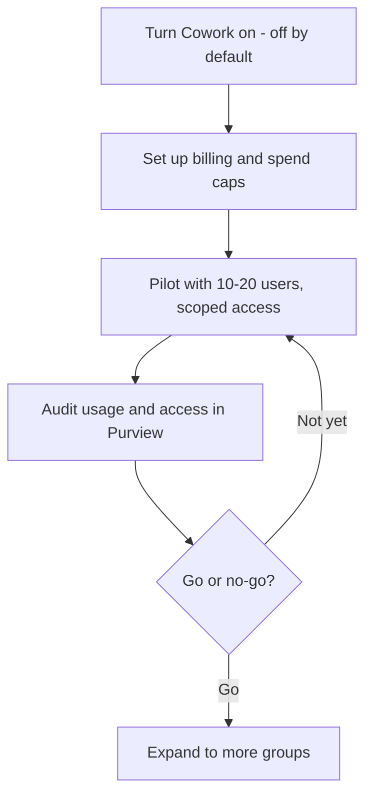

🔄 **Part of the [Microsoft Copilot Cowork — Complete Guide](/blog/microsoft-copilot-cowork-complete-guide/) series.** Copilot Cowork reached **general availability on 16 June 2026** — this page reflects the GA enablement path and governance stack. **Last verified: 17 June 2026 · GA day.**

*The hub for this series — [Microsoft Copilot Cowork — The Complete Guide](/blog/microsoft-copilot-cowork-complete-guide/) — covers what Cowork is and how it works. This spoke is the IT admin playbook.*

---

## TL;DR

- **Cowork is off by default** — nothing happens until an admin turns it on and chooses who gets access
- **It inherits user permissions** — it can only reach what the user already can; it acts *as* them, inside the same guardrails
- **Set up billing and spend caps before users start** — task work is billed in Copilot Credits, so wire up the Cost Management dashboard, set limits, and turn on alerts first
- **Audit SharePoint before broad rollout** — Cowork surfaces over-sharing fast
- **Pilot first** — start with 10–20 users, set a spend cap, review in Purview, then decide go/no-go
- **Governance is enterprise-grade** — Entra ID, audit log, DSPM, eDiscovery, Insider Risk, Data Lifecycle Management, and Communication Compliance at GA (DLP coming soon)

---

## The rollout at a glance

Five moves take you from "off by default" to "rolled out with the budget under control." Each one has its own section below.

The order matters: billing and caps come *before* the pilot, so no one runs up a surprise bill while you're still learning what Cowork costs for your team's work.

---

## How to enable Cowork at GA

If you're an IT admin, here's how to turn Cowork on:

1. **Turn Cowork on** — in the [Microsoft 365 admin center](https://admin.microsoft.com) → Copilot, enable Cowork and choose who gets access (No access / All users / Specific users). Cowork is **off by default** — it's off until you enable it.
2. **Set up usage-based billing** — Cowork's task work is billed in Copilot Credits, so set up billing and spend caps before users start running tasks. Full walkthrough in the next section.
3. **Check model availability** — Cowork runs on Anthropic models (Opus 4.8, Sonnet 4.6) through Microsoft's multi-model system. If your tenant manages AI model providers, confirm Cowork's models are allowed.
4. **Scope the pilot** — three levers people mix up: *availability* (who's allowed), *deployment/pinning* (whether it shows in their Copilot rail), and *plugins* (what it can reach — see governance below). Keep availability to your pilot group first (Specific users). Pilot-first is the sane default.
5. **Communicate** — tell your users it's available, what it does, and that it checks in before sensitive actions.

> ⚠️ **Do this before you enable it broadly:** review your [SharePoint permissions](https://learn.microsoft.com/en-us/sharepoint/modern-experience-sharing-permissions) and [information governance](https://learn.microsoft.com/en-us/purview/information-governance-solution) first. Cowork can reach anything the user can reach — so if your permissions are messy, Cowork surfaces that mess. Full remediation playbook: [SharePoint oversharing controls for Copilot](/blog/sharepoint-oversharing-controls-microsoft-365-copilot/).

---

## Set up billing and cost controls

Cowork's task work is billed in **Copilot Credits** — usage-based, on top of the Microsoft 365 Copilot licence each user already needs. The price of each task comes from four things: the model it uses, how much context it retrieves, how many tool calls it makes, and how long it runs. Because that varies task to task, the most important admin job at rollout is to **set the budget guardrails before anyone starts**.

It all lives in one place: the **Cost Management dashboard** in the [Microsoft 365 admin center](https://admin.microsoft.com). The order I'd do it in:

1. **Turn on usage-based billing.** Choose how you want to pay: **pay-as-you-go** (PayGo — flexible, billed at $0.01 per Copilot Credit), **prepaid credits** (P3 — commit to a volume up front for a discount), or existing capacity you already hold.
2. **Connect an Azure subscription** if you're billing at any real scale — that's what carries the spend.
3. **Define spending policies.** Decide *who* can consume credits, *how much* they can use, and *where* the spend is allocated. You set these at the tenant, group, and user levels — including user-level caps written inside a group policy.
4. **Set hard caps and usage alerts.** Caps stop overspend before it happens; alerts tell you when spend crosses a threshold you care about, and let you pick who gets notified. Set both — don't rely on remembering to check a dashboard.
5. **Know your two reporting tabs.** The **Overview** tab is your real-time "where are we spending, and are we on track?" snapshot — total consumption and remaining capacity. The **Consumption** tab is the drill-down — usage by user, group, service, or agent — so you can find the heavy users and the cost drivers.

> 💳 **Frontier grace period — your setup window.** If your tenant had at least one user who *used* Cowork in the Frontier program (30 March–16 June 2026), you get a grace period: you're **not billed for Cowork until 1 July 2026**. Treat that window as free setup time — turn on billing, set your caps and alerts, and allocate budgets *before* the meter starts. (Full detail in the [pricing spoke](/blog/microsoft-copilot-cowork-pricing-cost-management/).)

Two honest notes:

- **The per-task price shown to the user, in credits, is coming soon after GA.** At launch a user can request more credits from inside Cowork when they hit a wall, but the live "this task cost X credits" readout for them is still rolling out.
- **Cost drifts down over time** — models get cheaper, Cowork gets better at matching the right model to a task, and context and tool use get more efficient. So treat your first month's numbers as a starting point to refine, not a fixed cost.

Full reference: [Copilot Credits and cost management on Microsoft Learn](https://learn.microsoft.com/en-us/microsoft-365/copilot/usage-based-billing-overview-copilot-credits). Our deep dive is the [pricing &amp; cost-management spoke](/blog/microsoft-copilot-cowork-pricing-cost-management/).

---

## Why a user can't see Cowork in Microsoft 365 Copilot

The five usual suspects, in rough order of likelihood:

1. **An admin hasn't turned Cowork on** — it's off by default, so someone has to enable it in the Microsoft 365 admin center.
2. **Usage-based billing isn't set up** — Cowork's work is billed in Copilot Credits, so an admin needs to enable billing first.
3. **No Copilot licence** — the user needs the paid Microsoft 365 Copilot seat.
4. **Access is group-restricted** — an admin scoped Cowork to specific groups, and this user isn't in one.
5. **Model providers aren't configured** — if your tenant manages AI model providers, Cowork's models may need to be allowed first.

If you've ruled out all five and a licensed user still can't see it, give it time to propagate — tenant changes can take a while to roll through — before raising a ticket.

---

## Governance — what's built in

The single most reassuring thing about Cowork for an admin: **it inherits the user's identity and permissions.** It can't see, touch, or send anything the user couldn't already — it's acting *as* them, inside the same guardrails.

Here's the enterprise stack it plugs into out of the box — and where each piece stands at general availability:

| Control | What it does for Cowork | Status at GA |
|---|---|---|
| **Entra ID** | Cowork acts under the user's identity and permissions — no new standing access is created. | Live |
| **Sensitivity labels** | Purview sensitivity labels are inherited and displayed end-to-end on Cowork's inputs and outputs. | Live |
| **Unified audit log** | Cowork's prompts, responses, and actions land in the audit log — you can see what ran, when, and on whose behalf. | Live |
| **DSPM for AI** | Data Security Posture Management gives visibility into Cowork's AI activity and the data it touches. | Live |
| **eDiscovery** | Cowork content is discoverable for legal hold and investigation workflows. | Live |
| **Insider Risk Management** | Cowork activity is in scope for insider-risk policies. | Live |
| **Data Lifecycle Management** | Retention and lifecycle policies apply to Cowork content. | GA 22 June 2026 |
| **Communication Compliance** | Cowork communications are in scope for Communication Compliance policies. | Live |
| **Conditional Access** | Sign-in conditions (device, location, risk) apply to Microsoft 365 Copilot, Cowork included. | Live |
| **Human-in-the-loop checkpoints** | Sensitive actions pause for explicit user approval (see below) — a governance lever, not just a UX nicety. | Live |
| **Data Loss Prevention (DLP)** | Policies that would gate what Cowork can draft, share, or send. | Coming soon |

None of this is bolted on after the fact — Cowork's prompts, responses, and generated artifacts flow through the same Microsoft 365 compliance framework as the rest of your tenant: governed, discoverable, and retained.

> ⏳ **One gap to know at GA: Data Loss Prevention (DLP) for Cowork is *coming soon*.** Until it ships, don't assume DLP policies gate what Cowork drafts and sends — lean on the approval checkpoints and the controls above. As always for an agentic tool, confirm the exact coverage against Microsoft's GA documentation and your own tenant policies before you rely on any single control.

## Approving plugins and custom skills — the review

Out of the box, Cowork reaches your Microsoft 365 — Outlook, Teams, SharePoint, OneDrive, Office files. Two things widen that reach, and both deserve a deliberate yes:

- **Plugins** connect Cowork to systems outside M365 — a CRM, a ticketing tool, a data warehouse. (See the [skills &amp; plugins spoke](/blog/microsoft-copilot-cowork-skills-and-plugins/).)
- **Custom skills** (`SKILL.md` files) teach Cowork a repeatable job in your own words.

Treat **each plugin as its own decision**, one at a time — not a blanket "allow all." A short review to run before you approve one:

1. **Who's asking, and for what job?** Name the actual workflow — "Sales wants monday.com so Cowork can build campaign boards." If there's no real job behind it, it doesn't need to be on.
2. **What can it reach — read, or read &amp; write?** A *read* plugin can only look; a *read &amp; write* plugin can change or create records in that system. Read-only is the safer default; allow write only where the workflow genuinely needs it.
3. **Whose credentials does it use?** Confirm how the connector signs in and whose access it inherits, so the plugin can't quietly reach further than the user could.
4. **Where does the data go?** Check what leaves your tenant, where it lands, and whether that's acceptable for the data classes involved.
5. **Is it audited?** Plugin activity should show up in your audit trail like everything else. If you can't see it, you can't govern it.

Microsoft keeps a dedicated **"Manage plugins for Copilot Cowork"** page on Microsoft Learn for the admin controls — approvals, scope, and audit. Default posture: everything off until reviewed, then on for the teams with a real use for it.

---

## SharePoint oversharing — the most important control to check first

The "permissions amplifier" effect: Cowork can surface anything the user has access to, even if they didn't know they had access to it. If your SharePoint permissions are messy, Cowork makes that mess visible to the user.

For the full remediation playbook see [SharePoint oversharing controls for Microsoft 365 Copilot](/blog/sharepoint-oversharing-controls-microsoft-365-copilot/).

---

## Pilot rollout playbook

Don't roll Cowork out to everyone on day one. A scoped pilot tells you what it actually costs and where the rough edges are, on a small blast radius.

A practical pilot plan:

1. **Pick a small group** — about 10–20 users across 2–3 roles, so you see a real spread of light, medium, and heavy tasks.
2. **Scope access to just that group** — set availability to *Specific users*, not *All users* (see [enablement](#how-to-enable-cowork-at-ga)).
3. **Set a spend cap for the pilot group** — a group-level budget with user-level caps inside it, plus an alert at, say, 75% of the cap so nothing is a surprise.
4. **Brief the group** — what Cowork does, the approval-checkpoint pattern, what's safe to automate, and what to escalate.
5. **Run for 2–4 weeks** and collect both numbers (credit usage, which tasks) and feel (what saved time, what missed).
6. **Audit in Purview** — check the audit log for what Cowork actually did, and use the pilot as a forcing function to fix any SharePoint oversharing it surfaced.
7. **Decide go / no-go** against criteria you set up front — for example: *spend stayed within cap, no governance surprises, and the group would miss it if you took it away.*

A concrete starter policy you can adapt: **10–20 users · Specific-users access · a group spend cap with a 75% alert · 3-week run · weekly Purview check · expand only if spend held and no oversharing surfaced.**

---

## Approval checkpoints — what they protect

The checkpoint system is Cowork's most important governance feature, and it's worth understanding as a *control*, not just a prompt.

- **Actions that send or change something wait for approval.** Sending an email, posting to Teams, scheduling a meeting, creating a file — each pauses for an explicit yes, with a risk indicator and a button that matches the action (**Send**, **Post**, **Create**). If Cowork drafts the wrong thing, you simply don't approve it.
- **You can pause, resume, or cancel** at any time — see a run going sideways and you stop it immediately.
- **You can redirect mid-task.** "Actually, focus on the financial data, not the customer emails" — and it adapts within the current task.
- **A "skip future prompts" option exists.** A dropdown lets users stop being asked for similar low-risk actions — convenient, but it trades safety for speed.

For an admin, the honest framing is that checkpoints **reduce the blast radius — they're not a substitute for review.** A user can still approve the wrong action, or switch off prompts for an action type. And not everything is gated — drafting, reorganising files, or moving calendar items can happen inside a run. So the realistic worst case isn't "nothing"; it's "a user approved something they shouldn't have." Brief your people to treat each approval as a real decision, and to keep the skip-prompts option for genuinely low-stakes, repetitive work.

---

## What to tell legal and security

When you bring Cowork to a security or legal reviewer, here's the short brief — forward it as-is. Every line is something you can stand behind at GA:

- **It's off by default.** Nothing runs until we turn it on and choose who gets access.
- **It's identity-bound.** Cowork acts as the signed-in user, under their Entra ID — it creates no new standing access and can't reach anything the user couldn't already.
- **Permissions are inherited, not widened.** If a user can't open a file today, Cowork can't either.
- **Sensitivity labels follow the data** end-to-end, on what goes in and what comes out.
- **It's auditable and discoverable.** Prompts, responses, and actions land in the unified audit log and are in scope for eDiscovery, Insider Risk, Data Lifecycle Management, and Communication Compliance.
- **Sensitive actions wait for a human.** Sending, posting, scheduling, and creating each pause for explicit approval.
- **One gap to name honestly:** Data Loss Prevention (DLP) for Cowork is **coming soon**, not live at GA — so until it ships, don't assume DLP policies gate what Cowork drafts or sends. Lean on the approval checkpoints and the controls above, and confirm exact coverage against Microsoft's GA documentation.

The one-paragraph version: *Cowork operates inside your existing Microsoft 365 trust boundary, as the user, with the same permissions and the same compliance tooling as the rest of your tenant — plus an approval gate on anything that sends or changes something. DLP support is still on the way; plan around that one.*

---

## What Cowork can't do (yet)

Set expectations honestly with your leadership and users — over-promising is the fastest way to lose a pilot:

- **External systems need Skills or plugins.** Cowork doesn't connect to Salesforce, Jira, or SAP out of the box; partner plugins from the Microsoft 365 App Store and custom skills can bridge the gap. (See the [Skills & plugins spoke](/blog/microsoft-copilot-cowork-skills-and-plugins/).)
- **Check language coverage for your region** — Cowork is generally available worldwide, but confirm full language support for your users.
- **No offline mode** — it's cloud-based and needs a connection.
- **Won't replace deep expertise** — it's strong at coordination, not strategic judgement.
- **It's a permissions amplifier** — if your SharePoint permissions are messy, Cowork makes that mess visible to users who shouldn't see it. This is the one to fix *before* rollout, not after.

These are solvable, and several are on Microsoft's roadmap — but check Microsoft's GA documentation before treating any limit as temporary, and know them before you promise the world.

---

## Known issues

Cowork is new and evolving fast. For the current, authoritative list of limitations and fixes, check Microsoft's [Cowork documentation](https://learn.microsoft.com/en-us/microsoft-365/copilot/cowork/) — and remember Data Loss Prevention (DLP) support is still rolling out (see the governance note above).

---

## Other Cowork spokes

- [Cowork: How to use it step by step](/blog/microsoft-copilot-cowork-how-to-use-step-by-step/)
- [Cowork: Use cases by role](/blog/microsoft-copilot-cowork-use-cases-by-role/)
- [Cowork: Prompts to try](/blog/microsoft-copilot-cowork-prompts-to-try/)
- [Cowork: Pricing and cost management](/blog/microsoft-copilot-cowork-pricing-cost-management/)
- [Cowork: Skills and plugins](/blog/microsoft-copilot-cowork-skills-and-plugins/)
