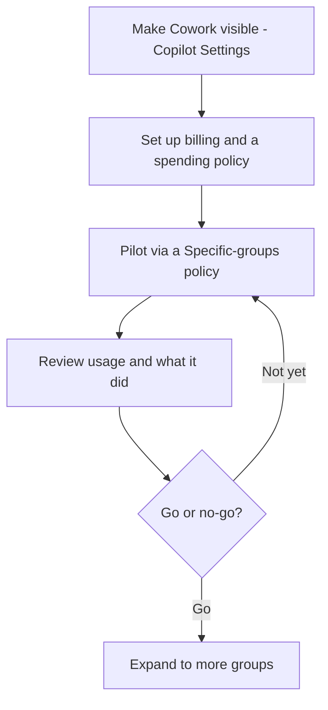

🔄 **Part of the [Microsoft Copilot Cowork — Complete Guide](/blog/microsoft-copilot-cowork-complete-guide/) series.** Copilot Cowork reached **general availability on 16 June 2026** — this page reflects the GA enablement path and governance stack. **Last verified: 17 June 2026 · GA day.**

*The hub for this series — [Microsoft Copilot Cowork — The Complete Guide](/blog/microsoft-copilot-cowork-complete-guide/) — covers what Cowork is and how it works. This spoke is the IT admin playbook.*

---

## TL;DR

- **Cowork is off by default** — nothing happens until an admin turns it on and chooses who gets access
- **It inherits user permissions** — it can only reach what the user already can; it acts *as* them, inside the same guardrails
- **Set up billing and spend caps before users start** — task work is billed in Copilot Credits, so wire up the Cost Management dashboard, set limits, and turn on alerts first
- **Audit SharePoint before broad rollout** — Cowork surfaces over-sharing fast
- **Pilot first** — start with 10–20 users, set a spend cap, review the outputs and spend, then decide go/no-go
- **Governance is identity-bound** — Cowork acts as the user, with sensitivity labels, encryption handling, and Communication Compliance supported today; several other Purview controls (audit, eDiscovery, DSPM, Insider Risk, DLP, and more) aren't enabled for Cowork yet — check the [Cowork Purview page](https://learn.microsoft.com/en-us/purview/ai-copilot-cowork)

---

## The rollout at a glance

Five moves take you from "off by default" to "rolled out with the budget under control." Each one has its own section below.

The order matters: billing and caps come *before* the pilot, so no one runs up a surprise bill while you're still learning what Cowork costs for your team's work.

---

## How to enable Cowork at GA

If you're an IT admin, here's how to turn Cowork on:

1. **Make Cowork discoverable** — in the [Microsoft 365 admin center](https://admin.microsoft.com) → **Copilot → Settings**, turn on **"AI experiences enabled by usage-based billing."** This controls *visibility* — whether users can see Cowork. It's **off by default**.
2. **Set up billing and a spending policy** — go to **Copilot → Cost Management** and select **Get Started**. Activating usage-based billing with a spending policy is what actually *turns Cowork on* and scopes who can use it (**All users** or **Specific groups**). Its work is billed in Copilot Credits, so do this before users start. Full walkthrough in the next section.
3. **Check model availability** — Cowork runs on Anthropic models (Opus 4.8, Sonnet 4.6) through Microsoft's multi-model system. If your tenant manages AI model providers, confirm Cowork's models are allowed.
4. **Scope the pilot** — keep access tight at first. In your Cost Management spending policy, target **Specific groups** (a security group of your pilot users) rather than All users, and decide separately which **plugins** Cowork can reach (see governance below). Pilot-first is the sane default.
5. **Communicate** — tell your users it's available, what it does, and that it checks in before sensitive actions.

*Step 1 — the discovery setting under **Copilot → Settings**. It even tells you the next move: go to **Cost management** to grant access. (Shown in a demo tenant.)*

> ⚠️ **Do this before you enable it broadly:** review your [SharePoint permissions](https://learn.microsoft.com/en-us/sharepoint/modern-experience-sharing-permissions) and [information governance](https://learn.microsoft.com/en-us/purview/information-governance-solution) first. Cowork can reach anything the user can reach — so if your permissions are messy, Cowork surfaces that mess. Full remediation playbook: [SharePoint oversharing controls for Copilot](/blog/sharepoint-oversharing-controls-microsoft-365-copilot/).

---

## Set up billing and cost controls

Cowork's task work is billed in **Copilot Credits** — usage-based, on top of the Microsoft 365 Copilot licence each user already needs. The price of each task comes from four things: the model it uses, how much context it retrieves, how many tool calls it makes, and how long it runs. Because that varies task to task, the most important admin job at rollout is to **set the budget guardrails before anyone starts**.

*The Cost Management dashboard (**Copilot → Cost management**). Note the two banners: billing doesn't start until after the grace period, and this experience covers Cowork and the Work IQ API today.*

It all lives in one place: the **Cost Management dashboard** in the [Microsoft 365 admin center](https://admin.microsoft.com). The order I'd do it in:

1. **Turn on usage-based billing.** Choose how you want to pay: **pay-as-you-go** (PayGo — flexible, billed at $0.01 per Copilot Credit), **prepaid credits** (P3 — commit to a volume up front for a discount), or existing capacity you already hold.
2. **Connect an Azure subscription** if you're billing at any real scale — that's what carries the spend.
3. **Define spending policies.** Decide *who* can consume credits, *how much* they can use, and *where* the spend is allocated. You set these at the tenant, group, and user levels — including user-level caps written inside a group policy.
4. **Set hard caps and usage alerts.** Caps stop overspend before it happens; alerts tell you when spend crosses a threshold you care about, and let you pick who gets notified. Set both — don't rely on remembering to check a dashboard. Not sure where to set the cap? Estimate your team's expected monthly burn first with the **[Cowork Cost Calculator](/cowork-cost-calculator/)**.
5. **Know your two reporting tabs.** The **Overview** tab is your real-time "where are we spending, and are we on track?" snapshot — total consumption and remaining capacity. The **Consumption** tab is the drill-down — usage by user, group, service, or agent — so you can find the heavy users and the cost drivers.

> 💳 **Frontier grace period — your setup window.** If your tenant had at least one user who *used* Cowork in the Frontier program (30 March–16 June 2026), you get a grace period: you're **not billed for Cowork until 1 July 2026**. Treat that window as free setup time — turn on billing, set your caps and alerts, and allocate budgets *before* the meter starts. (Full detail in the [pricing spoke](/blog/microsoft-copilot-cowork-pricing-cost-management/).)

Two honest notes:

- **The per-task price shown to the user, in credits, is coming soon after GA.** At launch a user can request more credits from inside Cowork when they hit a wall, but the live "this task cost X credits" readout for them is still rolling out.
- **Cost drifts down over time** — models get cheaper, Cowork gets better at matching the right model to a task, and context and tool use get more efficient. So treat your first month's numbers as a starting point to refine, not a fixed cost.

Full reference: [Copilot Credits and cost management on Microsoft Learn](https://learn.microsoft.com/en-us/microsoft-365/copilot/usage-based-billing-overview-copilot-credits). Our deep dive is the [pricing &amp; cost-management spoke](/blog/microsoft-copilot-cowork-pricing-cost-management/).

### What the setup looks like, step by step

Selecting **Get started** walks you through one short wizard. Here's the whole thing end to end (from a demo tenant, identifiers redacted):

*1. **Activate the default spending policy** — pick the billing method (subscription redacted) and choose whether to cap monthly spend.*

*2. **Caps and alerts** — add an optional per-user limit, and choose who gets the weekly spend alert (recipients redacted).*

*3. **Review the policy.** This is the one that matters: **User and group access = All users** and **Agents and services = Copilot Cowork**. Switch access to **Specific groups** to scope a pilot instead.*

*4. **Once active**, the **Configuration** tab lists your policy (here, 200 credits per user per month). **Overview** and **Consumption** are where you watch spend, and prepaid **P3** credits live here too.*

*5. **Done** — Cowork is live for the people in that policy. Add more policies any time to scope specific groups or services.*

---

## Why a user can't see Cowork in Microsoft 365 Copilot

The five usual suspects, in rough order of likelihood:

1. **The discovery setting is off** — "AI experiences enabled by usage-based billing" (Copilot → Settings) hasn't been turned on, so Cowork stays hidden.
2. **Usage-based billing isn't set up** — Cowork is gated by usage-based billing, so until an admin creates a spending policy in Copilot → Cost Management, there's nothing to use. (A user can request access from inside the experience; it shows up in the admin's credit requests.)
3. **No Copilot licence** — the user needs the paid Microsoft 365 Copilot seat (the USL).
4. **They're not in a spending policy** — access is scoped by policy; if the user isn't in the All-users policy or a Specific-groups policy that includes Cowork, they won't see it.
5. **The region or models aren't available** — Cowork runs on Anthropic models and is limited to Anthropic-supported regions; if your tenant manages model providers, those models may need to be allowed first.

If you've ruled out all five and a licensed user still can't see it, give it time to propagate — tenant changes can take a while to roll through — before raising a ticket.

---

## Governance — what's built in

The single most reassuring thing about Cowork for an admin: **it inherits the user's identity and permissions.** It can't see, touch, or send anything the user couldn't already — it's acting *as* them, inside the same guardrails.

Here's what actually protects Cowork today, and what's still on the way. Because Cowork runs long, multi-step work across apps, **Microsoft documents its compliance support separately** from the rest of Microsoft 365 Copilot — and several Purview solutions aren't enabled for Cowork yet. Plan against the [Cowork Purview support table](https://learn.microsoft.com/en-us/purview/ai-copilot-cowork) for the current status.

**Protecting Cowork today:**

| Control | What it does for Cowork | Status |
|---|---|---|
| **Entra ID identity** | Cowork acts under the user's identity and permissions — no new standing access is created. | Live |
| **Approval checkpoints** | Sensitive actions pause for explicit user approval (see below) — a real governance lever, not just UX. | Live |
| **Conditional Access** | Sign-in conditions (device, location, risk) apply through Microsoft 365 sign-in. | Live |
| **Sensitivity labels** | Labels are displayed, and inherited onto new Word/PowerPoint/Outlook content Cowork creates from labelled sources. | Supported |
| **Encryption handling** | Encrypted content is honoured — Cowork checks the VIEW and EXTRACT usage rights before returning data. | Supported |
| **Communication Compliance** | Cowork prompts and responses are in scope for Communication Compliance policies. | Supported |
| **Auditing** (unified audit log) | Cowork prompts, responses, and actions are captured in the Purview audit log. | Supported at GA |
| **DSPM / DSPM for AI** | Cowork AI activity shows in DSPM for AI (activity explorer) for data-risk insights and one-click policies. | Supported at GA |
| **eDiscovery** | Cowork content is discoverable for legal holds and investigations. | Supported at GA |
| **Insider Risk Management** | Cowork activity is in scope for Insider Risk Management policies. | Supported at GA |

**Still rolling out** — confirm current status on the [Cowork Purview page](https://learn.microsoft.com/en-us/purview/ai-copilot-cowork) before you rely on any of these:

| Purview solution | Status for Cowork |
|---|---|
| **Data Lifecycle Management** | GA 22 June 2026 (per Microsoft's GA announcement) |
| **Data Loss Prevention (DLP)** | Coming soon |
| **Data classification** | Not supported yet |
| **Compliance Manager** | Not supported yet |

> ⏳ **Read this before you promise compliance coverage.** Cowork's Purview support is documented separately from the rest of Microsoft 365 Copilot, and it's a moving target. The good news at GA: audit log, DSPM, eDiscovery, Insider Risk Management, Communication Compliance, sensitivity labels, and encryption handling are all supported. Still to come: **Data Lifecycle Management (GA 22 June 2026)** and **Data Loss Prevention (coming soon)** — and **data classification** and **Compliance Manager** aren't supported for Cowork yet. The **Cowork-specific Purview page is the one to plan against**, so confirm current status there before you rely on any single control.

## Approving plugins and custom skills — the review

Out of the box, Cowork reaches your Microsoft 365 — Outlook, Teams, SharePoint, OneDrive, Office files. Two things widen that reach, and both deserve a deliberate yes:

- **Plugins** connect Cowork to systems outside M365 — a CRM, a ticketing tool, a data warehouse. (See the [skills &amp; plugins spoke](/blog/microsoft-copilot-cowork-skills-and-plugins/).)
- **Custom skills** (`SKILL.md` files) teach Cowork a repeatable job in your own words.

Treat **each plugin as its own decision**, one at a time — not a blanket "allow all." A short review to run before you approve one:

1. **Who's asking, and for what job?** Name the actual workflow — "Sales wants monday.com so Cowork can build campaign boards." If there's no real job behind it, it doesn't need to be on.
2. **What can it reach — and can it write?** Many connectors are read-only; some can also write (create or update records in that system). Read-only is the safer default; allow write only where the workflow genuinely needs it.
3. **Whose credentials does it use?** Confirm how the connector signs in and whose access it inherits, so the plugin can't quietly reach further than the user could.
4. **Where does the data go?** Check what leaves your tenant, where it lands, and whether that's acceptable for the data classes involved.
5. **How will you keep an eye on it?** Plugin oversight for Cowork is still maturing (see the compliance note above), so lean on the approval checkpoints and a deliberate review rather than assuming full audit coverage.

Microsoft keeps a dedicated **"Manage plugins for Copilot Cowork"** page on Microsoft Learn for the admin controls — admins can deploy plugins to the org or specific groups, and restrict which plugins are visible in the store. A sensible default: keep them off until reviewed, then enable the ones a team genuinely needs.

---

## SharePoint oversharing — the most important control to check first

The "permissions amplifier" effect: Cowork can surface anything the user has access to, even if they didn't know they had access to it. If your SharePoint permissions are messy, Cowork makes that mess visible to the user.

For the full remediation playbook see [SharePoint oversharing controls for Microsoft 365 Copilot](/blog/sharepoint-oversharing-controls-microsoft-365-copilot/).

---

## Pilot rollout playbook

Don't roll Cowork out to everyone on day one. A scoped pilot tells you what it actually costs and where the rough edges are, on a small blast radius.

A practical pilot plan:

1. **Pick a small group** — about 10–20 users across 2–3 roles, so you see a real spread of light, medium, and heavy tasks.
2. **Scope access to just that group** — in your Cost Management spending policy, target **Specific groups** (a security group of your pilot users), not All users (see [enablement](#how-to-enable-cowork-at-ga)).
3. **Set a spend cap for the pilot group** — a group-level budget with user-level caps inside it, plus an alert at, say, 75% of the cap so nothing is a surprise.
4. **Brief the group** — what Cowork does, the approval-checkpoint pattern, what's safe to automate, and what to escalate.
5. **Run for 2–4 weeks** and collect both numbers (credit usage, which tasks) and feel (what saved time, what missed).
6. **Review what it did** — go through the conversations and outputs Cowork produced (Cowork activity is captured in the Purview audit log — see governance above), and use the pilot as a forcing function to fix any SharePoint oversharing it surfaced.
7. **Decide go / no-go** against criteria you set up front — for example: *spend stayed within cap, no governance surprises, and the group would miss it if you took it away.*

A concrete starter policy you can adapt: **10–20 users · Specific-groups access (a pilot security group) · a group spend cap with a 75% alert · 3-week run · weekly review of outputs and spend · expand only if spend held and no oversharing surfaced.**

---

## Approval checkpoints — what they protect

The checkpoint system is Cowork's most important governance feature, and it's worth understanding as a *control*, not just a prompt.

- **Actions that send or change something wait for approval.** Sending an email, posting to Teams, scheduling a meeting, creating a file — each pauses for an explicit yes, with a risk indicator and a button that matches the action (**Send**, **Post**, **Create**). If Cowork drafts the wrong thing, you simply don't approve it.
- **You can pause, resume, or cancel** at any time — see a run going sideways and you stop it immediately.
- **You can redirect mid-task.** "Actually, focus on the financial data, not the customer emails" — and it adapts within the current task.
- **A "skip future prompts" option exists.** A dropdown lets users stop being asked for similar low-risk actions — convenient, but it trades safety for speed.

For an admin, the honest framing is that checkpoints **reduce the blast radius — they're not a substitute for review.** A user can still approve the wrong action, or switch off prompts for an action type. And not every internal step shows a prompt — the gate is for sensitive actions like sending, posting, scheduling, and creating, each with a risk indicator on the medium- and high-risk ones. So the realistic worst case isn't "nothing"; it's "a user approved something they shouldn't have." Brief your people to treat each approval as a real decision, and to keep the skip-prompts option for genuinely low-stakes, repetitive work.

---

## What to tell legal and security

When you bring Cowork to a security or legal reviewer, here's the short brief — forward it as-is. Every line is something you can stand behind at GA:

- **It's off by default.** Nothing runs until we turn it on and choose who gets access.
- **It's identity-bound.** Cowork acts as the signed-in user, under their Entra ID — it creates no new standing access and can't reach anything the user couldn't already.
- **Permissions are inherited, not widened.** If a user can't open a file today, Cowork can't either.
- **Sensitivity labels follow the data** end-to-end, on what goes in and what comes out.
- **What's covered today:** sensitivity labels are displayed and inherited, encrypted content is honoured, and Cowork prompts and responses are in scope for **Communication Compliance**.
- **Sensitive actions wait for a human.** Sending, posting, scheduling, and creating each pause for explicit approval.
- **Name the gaps honestly:** Cowork's Purview support is documented separately from the rest of Microsoft 365 Copilot. Per Microsoft's [Cowork Purview page](https://learn.microsoft.com/en-us/purview/ai-copilot-cowork), supported at GA are auditing, eDiscovery, DSPM, Insider Risk Management, Communication Compliance, sensitivity labels, and encryption handling. The gaps to plan around: **Data Lifecycle Management (GA 22 June 2026), Data Loss Prevention (coming soon), data classification, and Compliance Manager.** Check that page for current status.

The one-paragraph version: *Cowork operates inside your existing Microsoft 365 trust boundary, as the user, with the same permissions as the rest of your tenant, sensitivity-label and encryption handling, Communication Compliance support, and an approval gate on anything that sends or changes something. Auditing, eDiscovery, DSPM, and Insider Risk Management are supported at GA; Data Lifecycle Management (GA 22 June 2026), Data Loss Prevention (coming soon), data classification, and Compliance Manager are still rolling out — so plan around those and track the Cowork Purview page.*

---

## What Cowork can't do (yet)

Set expectations honestly with your leadership and users — over-promising is the fastest way to lose a pilot:

- **Documented limits (from Microsoft's FAQ):** Cowork can't access or edit files stored **locally** on a device (it works in OneDrive and SharePoint); it **can't delete** files or folders in OneDrive or SharePoint; and **attachments must be under 200 MB**. (Encrypted content is handled per the user's usage rights — see the protection table above.)
- **Custom skills aren't validated by Microsoft** — user-created `SKILL.md` skills run as written, so review their outputs.
- **Region-limited** — Cowork runs on Anthropic models and is currently limited to **Anthropic-supported regions**, so "available worldwide" comes with that caveat. Confirm availability for your users.
- **External systems need plugins or skills** — Cowork reaches your Microsoft 365 out of the box; a CRM, ticketing tool, or data warehouse needs a plugin, a custom skill, or an exported file. (See the [Skills &amp; plugins spoke](/blog/microsoft-copilot-cowork-skills-and-plugins/).)
- **It's a permissions amplifier** — if your SharePoint permissions are messy, Cowork makes that mess visible to users who shouldn't see it. Fix this *before* rollout, not after.

These are solvable, and several are on Microsoft's roadmap — but check Microsoft's GA documentation before treating any limit as temporary, and know them before you promise the world.

---

## Known issues

Cowork is new and evolving fast. For the current, authoritative list of limitations and fixes, check Microsoft's [Cowork documentation](https://learn.microsoft.com/en-us/microsoft-365/copilot/cowork/) — and remember Data Loss Prevention (DLP) support is still rolling out (see the governance note above).

---

## Other Cowork spokes

- [Cowork: How to use it step by step](/blog/microsoft-copilot-cowork-how-to-use-step-by-step/)
- [Cowork: Use cases by role](/blog/microsoft-copilot-cowork-use-cases-by-role/)
- [Cowork: Prompts to try](/blog/microsoft-copilot-cowork-prompts-to-try/)
- [Cowork: Pricing and cost management](/blog/microsoft-copilot-cowork-pricing-cost-management/)
- [Cowork: Skills and plugins](/blog/microsoft-copilot-cowork-skills-and-plugins/)
