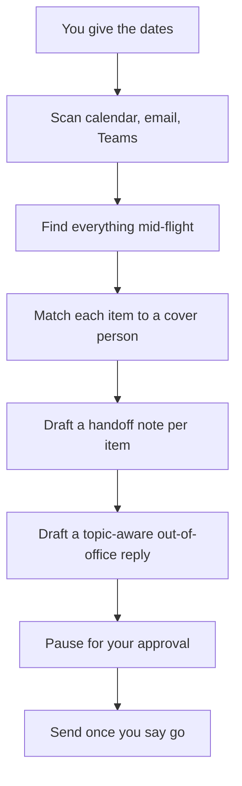

🔄 **Part of the [Microsoft Copilot Cowork — Complete Guide](/blog/microsoft-copilot-cowork-complete-guide/) series.** Copilot Cowork is **generally available** as of 16 June 2026. Living doc — new prompts added as I test them, usefulness ratings updated based on real demo results. **Last verified: 17 June 2026 · GA day.**

*The hub for this series — [Microsoft Copilot Cowork — The Complete Guide](/blog/microsoft-copilot-cowork-complete-guide/) — covers what Cowork is and how it works. This spoke is the demo-ready prompt library.*

---

## How to read the ratings

| Rating | Meaning |
|---|---|
| ⭐⭐⭐⭐⭐ | Works reliably across multiple tries — safe to demo |
| ⭐⭐⭐⭐ | Works most of the time — minor variation in output |
| ⭐⭐⭐ | Works but needs tuning per scenario |
| ⭐⭐ | Works sometimes — not yet demo-ready |
| ⭐ | Interesting but unreliable |
| 🕓 pending | Not yet tested in production |

Each prompt also shows when it was last tested. If you spot one that drifts, [send me feedback](/feedback/) — I will re-test and update.

---

## Which task should you try first? Snack, Meal, or Feast

Not every task is the same size — and the size is roughly what it [costs](/blog/microsoft-copilot-cowork-pricing-cost-management/), too. A simple way to pick your first one:

| Tier | Think of it as | What it looks like | Roughly what it costs |
|---|---|---|---|
| **Snack** | A quick errand | One or two sources, one short result | a *light* task — about 100–300 credits (~$1–3 pay-as-you-go) |
| **Meal** | An hour you'd rather hand off | A few sources, a few steps, one or two finished things | a *medium* task — about 400–700 credits (~$4–7) |
| **Feast** | A half-day project | Lots of sources, deep thinking, a whole set of outputs | a *heavy* task — 700+ credits (~$7 and up) |

**The honest rule of thumb: start with a Snack.** Pick one small thing you already do every week, hand it over, and watch how Cowork plans it. Once you trust the pattern, work up to Meals and Feasts — and turn the ones you repeat into a [saved skill](/blog/microsoft-copilot-cowork-skills-and-plugins/). Each prompt below is tagged with its tier.

> Credit ranges are illustrative — from Microsoft's GA blog, not a fixed price list. The [pricing spoke](/blog/microsoft-copilot-cowork-pricing-cost-management/) has the full story.

---

## Custom skill tests — from my tenant (live, dated, rated)

Real test runs of the custom skills I've built. Each one was invoked against my actual M365 data — outputs sanitised below so I can share without leaking customer or colleague data.

### Skill: `friday-portfolio-digest` — *⭐⭐⭐⭐ · Tested 15 Jun 2026*

**Trigger phrase used:** `friday portfolio digest`

**What I asked it to do:** the one-line trigger above — nothing more.

**What it actually did (in ~45 seconds):**

1. Scanned my calendar for the week (Mon 9 Jun → Mon 15 Jun)
2. Scanned my Sent Items for external outbound mail in the same window
3. Scanned my Inbox (14 days back) for the most-recent inbound per external organisation
4. Classified every customer org as **Active this week**, **Awaiting my reply**, or **Stale (>14 days no touchpoint)**
5. Picked the **Top 3 to action before next Monday**
6. Saved a Word document version to `output/`
7. Surfaced the digest in chat for immediate review

The structure of the output — exactly as the SKILL.md promises:

And the Word document version saved to `output/friday-portfolio-digest-2026-06-15.docx`:

**Honest read of the output (no PII):** 5 active customers this week, 3 awaiting my reply (the longest 10 days waiting), 1 stale account flagged with `[possibly noise — confirm]` because it only matched a single weak signal, and a clean Top 3 list with one-line "why this one" reasoning per item — including a colleague-returns-from-leave detection that the skill picked up from an inbound email.

**Privacy note on the screenshots above:** I asked Atlas (my CLI co-author for this blog) to redact the customer-name and ask-detail columns before publishing. We used **solid-rectangle masks on the chat output** (Shots 1-3) and **heavy gaussian blur on the Word doc** (Shot 4 — my preference) so you can see what the skill produces structurally without exposing my real customer portfolio. If you're a CSE or solution engineer, this pattern is worth copying for any blog post or demo that uses a real tenant.

**Why 4 stars not 5 ⭐⭐⭐⭐:**

- ✅ Hit every section the SKILL.md promised. No missing tables, no fabricated customer names.
- ✅ Honoured all guardrails — flagged a thin-signal customer with `[possibly noise — confirm]` exactly as instructed, derived org names from email domains only, kept the digest in chat + Word for my eyes only.
- ✅ "Top 3 to action" reasoning was genuinely useful — picked out a colleague-returns-from-leave timing window I would have missed.
- 🟡 One Active row had `[confirm]` against the org name because the skill couldn't disambiguate a parent-org / subsidiary lookup (which is exactly what the Edge Cases section in the skill flagged as a known scenario — so this is correct behaviour, just costs a star until I tweak the disambiguation rule).
- 🟡 The Word doc rendered fine but used the default Word template — would be nicer on a custom Friday-digest template. Easy follow-up.

### Skill: `new-account-research-brief` — *⭐⭐⭐⭐⭐ · Tested 16 Jun 2026*

**Trigger phrase used:** `research Contoso Airlines NZ`

**Why a fictional customer:** the previous-day test on a real prospect surfaced rich account intelligence — including internal Microsoft engagement notes that aren't appropriate for a public blog. Re-running on Microsoft's own fictional `Contoso Airlines NZ` brand gave us a clean, publishable test AND happened to demonstrate the most interesting Edge Case in the SKILL.md.

**What I asked it to do:** the one-line trigger above.

**The setup — typing the prompt:**

**Cowork's Thought process (expanded):**

Two things worth pausing on here:

1. **Cowork grounded on my Microsoft directory profile.** It knows my exact role and team — "Sr Solution Engineer in NZ Specialist Sales for Modern Work" — without me telling it. That context shapes how it interprets ambiguous requests.
2. **Cowork reasoned about intent, not just keywords.** Even when the keyword `Contoso` strongly signals "fictional", Cowork stopped to consider whether I might be using the fictional name as a codename for a real customer. That's a much more useful reasoning style than literal-matching.

**The Edge Case response — exactly as the SKILL.md designed:**

This is **end-to-end validation** of the Edge Cases section we added during the Pattern C structural restructure ([see Skill D second iteration in the Skills + Plugins spoke](/blog/microsoft-copilot-cowork-skills-and-plugins/#pattern-c--structural-restructure-to-reach-100)). The behaviour matches the design line by line:

| Designed behaviour (Edge Case #2 in the SKILL.md) | Actual behaviour |
|---|---|
| Detect zero-internal + zero-public scenario | ✅ "Zero real signals found:" with 3 bullets enumerating where it looked |
| Cite where signals came from (or didn't) | ✅ "The only Contoso Airlines hits were Microsoft's own demo GitHub repos and training materials" |
| Suggest likely-correct spellings | ✅ Table of 4 real NZ airlines (a small Levenshtein-style suggestion set) |
| Offer codename-handling fallback | ✅ "if 'Contoso Airlines NZ' is a codename you're using for a real customer, let me know the actual company name" |
| Never generate a blank or fabricated briefing | ✅ Refused to generate research; asked for clarification instead |

**Why 5 stars ⭐⭐⭐⭐⭐:**

- ✅ Cowork recognised the fictional-customer scenario without me having to tell it.
- ✅ Honoured every guardrail in the SKILL.md — no fabricated research, explicit zero-results enumeration, plain-English suggestion table.
- ✅ Surfaced the codename-handling path the SKILL.md asked for.
- ✅ Cited where it looked (internal + public web + demo repo content) so I can verify the search was actually thorough.
- ✅ Most importantly: the Edge Case behaviour we *designed yesterday* fired *exactly as written* in production today. Design → restructure → test, end-to-end.

### Skill: `cowork-skill-author` — *⭐⭐⭐⭐ · Tested 16 Jun 2026 (recursive meta-test)*

**Trigger phrase used:** `author me a skill that produces a daily standup recap from my last 24 hours of Teams DMs, rendered as a self-contained HTML web-app I can bookmark and revisit. Standard tier.` (plus specifications about grouping, action items, refresh button, and a Scheduled hint)

**Why a recursive test:** the meta-skill should be able to CREATE another skill. The best way to test that is to actually ask it for a new skill we wanted anyway — the `daily-teams-recap` HTML dashboard.

**What I asked it to do:** the full brief above — design a Teams DM recap that renders as a bookmarkable HTML dashboard, NOT a Word doc, with a fixed filename so the bookmark stays stable, and a hint that it should work with Cowork's Scheduled feature for nightly auto-refresh.

### What Cowork did

The meta-skill orchestrated a full skill-creation pipeline:

Then the meta-skill **handed off** to the built-in `Skill Management` (`skills`) skill — exactly the architecture the SKILL.md design called for:

### The generated skill's quality report — 91/100 with the now-familiar pattern

### The bonus discovery — a NEW `Scheduled` trigger phrase category

This is the most interesting finding of the entire test. The generated skill's trigger phrases include a category I haven't seen documented anywhere else:

The **`Scheduled`** trigger row bakes the webapp-auto-refresh pattern into the skill itself. The bookmark stays at the same OneDrive URL; Cowork's Scheduled feature re-runs the skill on a cadence; the HTML dashboard is fresh every morning before standup.

**This is the missing piece for "skill as a webapp":**

| Without Scheduled | With Scheduled |
|---|---|
| Skill runs when you invoke it | Skill runs on a recurring cadence (7am weekdays in this case) |
| HTML file generated → opens stale until you re-invoke | HTML file refreshed automatically → bookmark always current |
| Behaves like a Word doc | Behaves like a bookmarkable mini-dashboard |
| Manual workflow | Hands-off workflow |

**Why 4 stars ⭐⭐⭐⭐:**

- ✅ Meta-skill orchestration worked end-to-end (cowork-skill-author → Skill Management → SKILL.md written + scored + ready).
- ✅ The generated skill is genuinely useful — bookmarkable HTML dashboard with auto-refresh hint.
- ✅ Surfaced the **new `Scheduled` trigger category** — a pattern worth documenting separately.
- ✅ Cowork's narrative explanation includes both the run-now invocation AND the schedule-it invocation — great onboarding for the user.
- 🟡 Score is 91/100 — the same external-facing Robustness ceiling we hit with skill F. Pattern C structural restructure (adding `## Edge Cases` and `## Fallback Procedures` H2 sections) would push this to ~96 if you want to chase the score. Logged as a follow-up.
- ✅ And I did run it — see the next section, where the generated skill produced the live HTML dashboard end-to-end.

**Would I demo this to a customer?** Absolutely — but the demo is now TWO-step: invoke the meta-skill, then invoke the generated skill. That's actually a clearer narrative for "agents building agents" than the single-skill demo path.

### Then I ran the generated skill — and the webapp came to life

The real test of "skill as a bookmarkable webapp" is running the generated skill and seeing the HTML actually render. So I invoked `daily teams recap`.

First, Cowork paused for approval before writing to my OneDrive — the human-in-the-loop checkpoint in action:

Once I approved, Cowork's Workspace panel showed the task decomposing in real time:

And then the dashboard rendered — exactly the bookmarkable web-app we designed:

This is the payoff of the whole Word-vs-HTML decision. The output is:

- **A real mini-dashboard** — action items at the top (1 reply owed), decisions section (0 today), messages grouped by sender with collapsible sections and message counts
- **Bookmarkable** — it lives at a fixed OneDrive path (`Documents/Cowork/Dashboards/daily-teams-recap.html`), so the bookmark stays stable
- **Self-dating** — the footer shows exactly when it was generated, so I always know how fresh the data is
- **Has a Refresh button** — a visual cue to re-run the skill (or let the Scheduled cadence do it)

Compared to a Word doc that I'd open, read once, and lose in my Files — this is something I actually *return to*. Sush's instinct ("why can't this be a webapp I bookmark?") was the right product question, and Cowork's `html` skill plus the `Scheduled` trigger made it real.

> 💡 **The Word-vs-HTML decision rule:** if the output is a one-time artefact (a briefing for one meeting, a proposal draft), use the `docx` skill. If it's something you return to repeatedly and want current (a daily dashboard, a portfolio tracker, a status board), use the `html` skill with a fixed filename + the Scheduled trigger. Same data, very different shelf life.

---

### Skill: `linkedin-carousel-microsoft` — *⭐⭐⭐⭐⭐ · Tested 16 Jun 2026*

**Trigger phrase used:** `linkedin carousel about Cowork's built-in skill quality scoring`

**Why this topic:** the most meta test possible — a LinkedIn carousel ABOUT the skill quality scoring feature we'd just spent hours discovering. On-brand, demo-ready, and a real post I might actually publish.

**The make-or-break question:** would the notebook aesthetic from my blog (cream paper, ink-blue text, pen-red underlines, handwritten title font, no emoji) actually survive translation into a PowerPoint slide? That's the whole reason this skill exists.

**What Cowork did (in ~3 minutes):**

It followed its own 8-step SKILL.md workflow:

It generated BOTH a .pptx (for editing) and a .pdf (for LinkedIn's document-upload format), exactly as the SKILL.md specified:

And the chat surfaced a per-slide summary, a ready-to-paste LinkedIn caption (189 characters), and suggested hashtags:

**The payoff — the rendered title slide:**

**It worked.** Cream paper, ink-blue handwritten title, the pen-red underline, the monospace subtitle, zero emoji. The skill translated my blog's CSS notebook aesthetic into a real PowerPoint slide.

**Why 5 stars ⭐⭐⭐⭐⭐:**

- ✅ **The aesthetic survived translation** — this was the make-or-break test and it passed. Cream background, ink-blue title, pen-red underline, typewriter subtitle, no emoji.
- ✅ Generated both .pptx (edit) and .pdf (LinkedIn upload) without being reminded.
- ✅ Followed the 3-hook formula across 7 slides — hook → question → insights → takeaway → resources.
- ✅ Caption came in at 189 characters (inside LinkedIn's sweet spot) with relevant hashtags.
- ✅ **The no-fabrication guardrail fired inside the generated content** — Slide 4 carried a `[confirm — source: Microsoft community]` note flagging a claim it couldn't fully verify. The skill polices its own facts.
- ✅ Resources slide cited the official Microsoft Learn Cowork page + my own blog hub — exactly the references I'd want.

**Would I demo this to a customer?** Yes, and I'd go further — I'd actually post it. This is the first skill output of the four that's ready to ship externally with no edits. The fact that it self-flagged the one unverifiable claim means I know exactly what to double-check before publishing.

**One honest caveat:** the score on this skill was 91/100 (the external-facing Robustness ceiling), and Cowork recommended a "behavioural review" before relying on it. This test WAS that behavioural review — and it passed. So the 91 is more reassuring now than it looked on paper.

---

## ☀️ Morning Triage and Priority Setter

*Tier: **Snack** (light) · Tested: 🕓 pending as a standalone prompt · Best for: everyone — start your day in 60 seconds instead of 20 minutes of inbox scrolling*

Copy this, run it first thing in the morning:

> Good morning! Give me a full briefing for today:
> 1. What meetings do I have today — list them with times and who's attending
> 2. What are my most important unread emails from overnight — flag anything that needs a response before my first meeting
> 3. Any urgent or time-sensitive Teams messages I haven't responded to
> 4. Based on all of this, recommend the 3 things I should prioritise this morning
>
> Then draft quick reply emails for the top 2 urgent items — keep them professional, friendly, and under 3 sentences each. Show me for approval.

**What Cowork does:** reads your calendar, scans unread emails, checks Teams messages, prioritises your morning, and drafts replies — all before your first coffee is cold. Skills chained: Daily Briefing → Calendar → Communications.

> 💡 If you run this every day, turn it into a custom skill (see the [Skills + Plugins spoke](/blog/microsoft-copilot-cowork-skills-and-plugins/#custom-skills--three-paths)) and schedule it for 7am — then it's waiting for you when you sit down.

---

## 🎯 Meeting Prep Autopilot

*Tier: **Meal** (medium) · Tested: 🕓 pending as a standalone prompt — the custom-skill version of this workflow tested well · Best for: anyone with customer meetings, stakeholder reviews, or project check-ins*

> I have a meeting with **[customer/stakeholder name]** about **[topic, e.g. "quarterly review", "project kickoff", "budget approval"]** coming up this week. Look at my calendar to find the meeting, then search my recent emails and Teams chats for any context about **[customer/stakeholder name]** or this topic. Find the most relevant presentation or document I've used recently on this topic from my OneDrive or SharePoint. Create a 1-page Word briefing with: the meeting objective, key attendees, 3 talking points based on what I've discussed with them before, and a link to the deck. Then draft an email to the attendees confirming the session and attaching the briefing.

**What Cowork does:** finds the meeting on your calendar, digs through your email and Teams history with that person, locates the right files in SharePoint, creates a briefing document, and drafts a confirmation email — all from one prompt. Skills: Calendar → Search → Word → Communications.

> 💡 This is the exact workflow my `customer-session-prep` custom skill automates — see the [Skills + Plugins spoke](/blog/microsoft-copilot-cowork-skills-and-plugins/) for how I turned a one-off prompt like this into a reusable skill.

---

## 📬 Post-Session Follow-Up Machine

*Tier: **Meal** (medium) · Tested: 🕓 pending as a standalone prompt · Best for: trainers, presenters, sales reps — anyone who runs sessions and needs to follow up afterwards*

> I just finished a **[session type, e.g. "training session", "client demo", "team workshop"]**. Look at my most recent meeting that ended in the last 2 hours. Find the recording, any slides or documents that were shared during or before that meeting, and summarise the key topics covered based on the meeting transcript. Then draft a follow-up email to all attendees with:
> - A thank you and 2-sentence summary of what we covered
> - Links to the recording and slides
> - A "Questions?" section inviting them to reply
>
> Send it from my Outlook — show me for review before sending.

**What Cowork does:** finds the meeting you just finished, locates the recording and shared materials, reads the transcript for key points, and drafts a complete follow-up email with everything linked — ready for you to review and send. Skills: Meetings → Search → Communications.

> 💡 Cowork drafts but never auto-sends external email — it always shows you the draft first. Good. The custom-skill version (`customer-session-followup`) adds a "strip anything internal before it goes to a customer" guardrail.

---

## 📊 Weekly Team Update Generator

*Tier: **Meal** (medium) · Tested: 🕓 pending as a standalone prompt · Best for: team leads, project managers, and anyone whose manager asks "what did you work on this week?"*

> It's the end of the week. Review my calendar, sent emails, and Teams messages from this week. Create a structured weekly update that includes:
> 1. Key meetings I attended and what was discussed (1 line each)
> 2. Any customer or partner interactions
> 3. Content I created or shared (decks, docs, links)
> 4. Open follow-ups I still need to action
> 5. What's coming next week based on my calendar
>
> Format it as a professional but concise Teams-friendly post, then post it to the **[team channel name, e.g. "Project Alpha", "NZ Sales Team"]** channel for my approval.

**What Cowork does:** reviews your entire week across Calendar, Email, and Teams, creates a structured summary, and posts it to your team channel — with your approval before it goes live. The weekly update nobody has time to write, written in 2 minutes. Skills: Calendar → Search → Communications.

---

## 📚 Knowledge Pack Builder

*Tier: **Meal** (medium) · Tested: 🕓 pending as a standalone prompt · Best for: subject matter experts, consultants, presales — anyone who repeatedly answers the same complex questions*

> A **[recipient role, e.g. "customer CISO", "project sponsor", "new team member"]** has asked me about **[topic, e.g. "Copilot governance and security controls", "our data migration approach", "onboarding process"]**. Search my OneDrive, SharePoint, and recent emails for any documents, presentations, or materials I've shared or worked on about this topic. Also do a deep research on the latest information from Microsoft Learn about **[topic]**.
>
> Create a polished 2-page Word document titled **"[Document title, e.g. 'M365 Copilot Governance Quick Guide']"** that covers the key areas a **[recipient role]** needs to know. Then draft an email to **[recipient name]** attaching this document with a brief "here's what you asked for" message. Show me everything for review.

**What Cowork does:** combines your internal knowledge (SharePoint files, past emails) with fresh external research (Microsoft Learn), creates a polished document, and drafts a delivery email — turning a 2-hour research task into a 5-minute approval. Skills: Search → Deep Research → Word → Communications.

---

## 🏢 Customer Deliverable From Email Brief

*Tier: **Feast** (heavy) · Tested: 🕓 pending as a standalone prompt · Best for: anyone who receives a brief or request via email and needs to deliver something back — slides, reports, proposals*

This is the showcase prompt — the one I open demos with, because it shows Cowork's full multi-step, multi-app power from a single instruction.

> I need to prepare a **[deliverable type, e.g. "slide deck", "report", "proposal"]** for an upcoming session with **[customer/team name]**.
>
> **Step 1 — Find the brief:** Search my emails for a message from **[contact name]** at **[company name]** about **[topic, e.g. "executive training session", "quarterly review", "project kickoff"]**. Extract every topic and agenda item they listed.
>
> **Step 2 — Gather my materials:** Search my OneDrive and SharePoint for any existing decks, documents, or materials I've used on this topic recently.
>
> **Step 3 — Research:** Do a deep research on the latest information about **[topic]** from Microsoft Learn and the web.
>
> **Step 4 — Build the deliverable:** Using the brief as the structure and my materials plus research as content, create a clean, professional PowerPoint presentation covering every item from the brief. Keep it **[audience]-friendly** — no jargon, focus on outcomes. Each slide should answer "why should a busy **[audience role]** care about this?" Make it work as both a presentation AND a standalone cheat sheet they can reference later.
>
> **Step 5 — Draft the reply:** Draft an email to **[contact name]** attaching the deck, confirming I've covered all their agenda items, and asking if there's anything to adjust. Show me everything for review before sending.

**What Cowork does:** reads a customer's email, extracts their requirements, searches your existing materials, researches the latest information, builds a complete slide deck structured around their brief, and drafts a delivery email — all from one prompt. What normally takes 2-3 hours, done in minutes. Skills: Communications → Search → Deep Research → PowerPoint → Communications.

> 💡 **Demo tip:** start a customer demo with the Morning Triage prompt (universal, instant reaction), then show this one to demonstrate the full multi-step power. The gap between "regular Copilot" and "Cowork" clicks the moment people watch it execute across five apps from a single instruction.

---

## The Out-of-Office Handoff

*Tier: **Feast** (heavy) · Tested: 🕓 pending as a standalone prompt · Best for: anyone taking leave who doesn't want things to stall while they're gone*

The idea: step away knowing nothing in flight will quietly stall while you're out. Instead of a one-line "I'm away" auto-reply, you hand the loose ends to the right people.

> I'm out of office from **[start date]** to **[end date]**. Help me hand off cleanly.
>
> 1. Look through my calendar, recent emails, and Teams chats and find everything that's mid-flight — open questions waiting on me, decisions due while I'm away, and meetings I own.
> 2. For each one, suggest who should cover it, and draft a short handoff note to that person with the context they'll need.
> 3. Draft an out-of-office reply that points people to the right cover person by topic — not just "I'm away."
> 4. Show me everything for approval before sending anything.

**What Cowork does:** reads across your calendar, inbox, and chats to find the loose ends, works out who should cover what, and drafts the handoff notes plus a genuinely useful auto-reply. Skills: Daily Briefing → Search → Communications.

Here's the shape of how it thinks it through:

> 💡 Run this the afternoon before you leave. If you take leave often, save it as a skill so next time it's a single line.

---

## Deep Research With a Citation Map

*Tier: **Feast** (heavy) · Tested: 🕓 pending as a standalone prompt · Best for: anyone sitting on a folder of documents they keep meaning to read*

This one moves you from "I have a pile of documents to get through" to "I have a short brief I can act on — and I can see where every point came from."

> I need to get on top of **[topic]**.
>
> Read the documents in **[OneDrive/SharePoint folder]**, plus anything relevant you find in my recent emails and meetings on this topic.
>
> Give me back a structured brief: the key findings, the open questions, and a clear recommendation. For every claim, show me which source it came from so I can check it. Save it as a single HTML page I can bookmark and re-open.

**What Cowork does:** reads across a folder (and your related work), pulls the threads into a findings-and-recommendation brief, and keeps a map of which source backs each point — so you're never trusting a summary blind. Skills: Search → Deep Research → html.

> 💡 The "show me which source each point came from" line is the part worth keeping. A summary you can't trace back is just a nicer-looking guess.

---

## Want more prompts?

The companion [Cowork Prompts library at /prompts/copilot-cowork/](/prompts/copilot-cowork/) holds fourteen individual prompt cards — each with the prompt, the scenario, and the expected outcome. Use those for quick reference; come back here for the curated demo-ready set with ratings.

---

## Other Cowork spokes

- [Cowork: How to use it step by step](/blog/microsoft-copilot-cowork-how-to-use-step-by-step/)
- [Cowork: Use cases by role](/blog/microsoft-copilot-cowork-use-cases-by-role/)
- [Cowork: Pricing and cost management](/blog/microsoft-copilot-cowork-pricing-cost-management/)
- [Cowork: Skills and plugins](/blog/microsoft-copilot-cowork-skills-and-plugins/)
- [Cowork: Admin enablement and governance](/blog/microsoft-copilot-cowork-admin-and-governance/)
