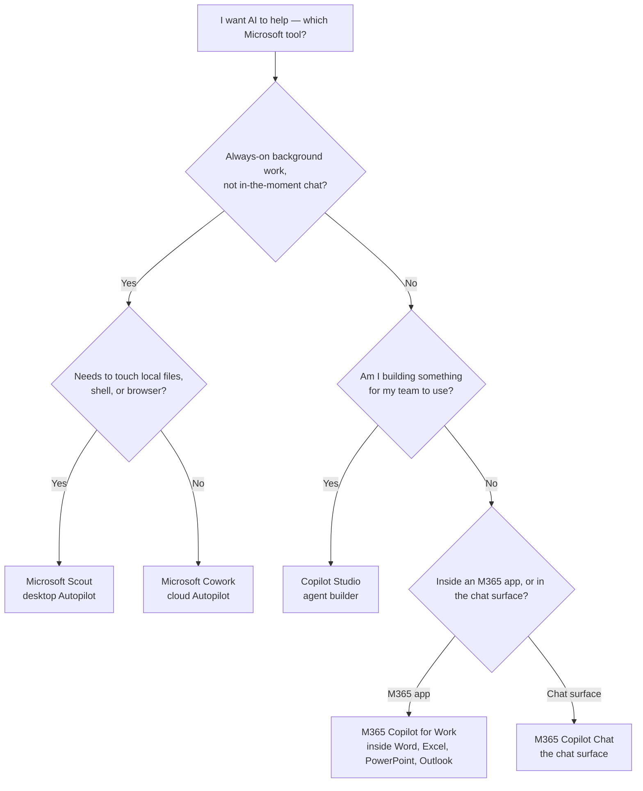

<div class="living-doc-banner">

🔄 **This is a living guide.** Scout is in Frontier preview — releases ship roughly weekly, settings change, new skills land. I update this post every time Microsoft ships something new or I find something worth calling out. If you spot anything out of date, [send me feedback](/feedback/) and I'll patch it. **Last verified: 12 June 2026 · Scout version 0.23.0.20260608.1.**

</div>

Microsoft Scout is the first thing Microsoft has shipped in this Year of Agents that genuinely feels like a *new* tool, not another riff on Copilot. It's an "Autopilot" — Microsoft's name for a new category of agent that works continuously in the background, with its own identity, on your behalf, with your permission.

<p></p>

*Scout's main window in dark mode, fresh chat ready. The five visible prompt cards on the home screen are Microsoft's curated suggestions — they're a good signal for what Scout is built to do (coordination, focus, inbox triage). The input box at the bottom is where the conversational interface lives.*

I've been running it for months. When I first installed it, it wasn't called Scout. It was called Clawpilot. Same app, same bones, same skills folder, new name and a much sharper enterprise story behind it.

This is the guide I wish I'd had when I first opened it. Bookmark it — I'll keep updating it as Microsoft ships and as I keep learning.

📅 **Related guides:** [Microsoft Build 2026 recap](/blog/microsoft-build-2026-recap/) (where Scout was announced) · [Work IQ API — Day 1 hands-on](/blog/microsoft-work-iq-api-day-1-ga/) (the layer Scout uses for context) · [M365 Copilot Brand Kit complete guide](/blog/microsoft-365-copilot-brand-kit-complete-guide/) (same deep-dive shape)

---

## TL;DR — the five things to know

1. **Scout is the first "Autopilot."** Microsoft's new category for always-on agents that work in the background with their own identity. It's not Copilot Chat. It's not a Copilot agent you build in Studio. It's its own thing.
2. **It's in Frontier preview.** Public, but admin-gated. Your org needs to be enrolled in the Microsoft Frontier program, set an Intune policy, complete an attestation form, and assign you a GitHub Copilot Business or Enterprise license. Until all four are in place, sign-in is blocked and the app doesn't show a clear in-product indication of why.
3. **Built on OpenClaw.** Microsoft is open about it — Scout is built on the OpenClaw open-source framework, with the enterprise layer (identity, governance, Purview, Teams, Intune) added on top. Microsoft says it's contributing improvements back upstream.
4. **Lots already in the box.** Seven bundled skills, MCP server support (Work IQ and Playwright shipped in the box), a browser automation engine, a shell, a Teams app, heartbeats every 15-120 minutes, scheduled automations, sub-agent delegation, memory that builds over time through Work IQ.
5. **This guide stays alive.** Bookmark it. Come back. I update it.

**Just want to try Scout?** Jump to [Quick Start](#2--quick-start--download-install-sign-in-update-uninstall) — five-minute path.

**Already running Scout and want to lock it down?** See the [Secure Configuration Guide spoke](/blog/microsoft-scout-secure-configuration-25-settings/) — the bookmark-worthy reference for IT admins.

---

## §1 · What is Microsoft Scout?

The honest answer: it's the same idea you've seen in chat assistants for the last two years, but it doesn't stop when you stop typing.

A Microsoft 365 Copilot conversation is a *turn-by-turn* relationship. You ask, it answers, you ask again, it answers again. When you close the tab, the conversation pauses. That's not a limitation — that's the design of a chat assistant.

Scout is the opposite shape. You give it a piece of work. It goes off and does it. It checks back in when it's done, or when it hits something that needs your approval, or because a scheduled heartbeat just fired and it wanted to tell you what changed. Microsoft's name for this category is **Autopilot** — and Scout is the first one they've shipped.

### The codename evolution — same app, three names

When I first installed Scout — months before Build 2026 — it was called **Clawpilot**. Before that, internal Microsoft teams referred to it just as "the m repo" (you can still see the lineage today: the user skills folder is `~/.copilot/m-skills/`, the local MCP config is `m-mcp-servers.json`, the memory store is `m-memory.json`). At Microsoft Build 2026 on 2 June, Microsoft renamed it to **Microsoft Scout** for its public-facing reveal as the first Autopilot agent.

Same executable lineage, same bones, much sharper enterprise story.

<p></p>

*Scout's thinking and progress panel from a prompt I asked this morning. Note the line that says "using the **Clawpilot theme variables** and theme detection..." — Scout's bundled `web-artifacts-builder` skill still references its Clawpilot lineage in the live runtime. The rebrand was real; the bones are unchanged.*

If you bump into older Microsoft internal docs that still say "Clawpilot," or a Teams thread that references "the m repo," that's all the same product. The current public name is Microsoft Scout.

### A real workflow — from prompt to interactive dashboard in one chat

Here's a real example from this morning. I opened Scout, typed a single prompt:

> *"Show me a sample interactive HTML dashboard for monthly cloud cost trends — use fake data."*

The thinking-panel screenshot above is from that exact prompt. Scout thought for 18 seconds, decided it needed the bundled `web-artifacts-builder` skill, picked up the theme variables (the live runtime still calls them "Clawpilot theme variables" — the rebrand left footprints), then started generating.

Eighteen seconds is the *thinking* time. After that, Scout produces an artifact in one shot — no follow-up prompts, no iteration, no asset-pipeline work for me. Here's the dashboard it returned:

<p></p>

*The interactive dashboard Scout produced from that one-line prompt. Four filter controls, four KPI cards, a stacked monthly bar chart, a donut chart, Export CSV and Share report buttons. All the numbers are demo data; everything around them — the layout, the filters, the colour palette, the responsive grid — came out in one shot.*

What's worth calling out, before we keep going:

- **No iteration needed.** First prompt, single result, ready to share. The output is a self-contained HTML file that opens in any browser.
- **Skill routing was automatic.** I didn't say "use the web-artifacts-builder skill." Scout picked it based on the description in `SKILL.md` matching what I asked for. Same pattern Copilot Chat uses for tool selection; in Scout it routes to a skill rather than a Microsoft 365 connector.
- **Permission was implicit.** Reading documentation, generating HTML, writing the artifact file to my workspace — those are all in my pre-approved permission bucket. If Scout had wanted to send an email or run a shell command, I'd have got an approval card first.
- **The "Clawpilot" reference in the thinking panel is real.** The bundled `web-artifacts-builder` skill's `SKILL.md` still uses the original Clawpilot theme-variable naming. Scout's behaviour is identical; the lineage just shows in the source.

That's an Autopilot moment — a request that would have taken an hour of HTML + CSS + chart wiring, returned in under a minute, on a desktop app I've already configured. It's also why "is Scout just another Copilot?" is the wrong question. Copilot Chat is for thinking together; Scout is for handing off the doing.

---

### What it can do (Microsoft's words)

Direct from the [official Microsoft 365 Blog announcement](https://www.microsoft.com/en-us/microsoft-365/blog/2026/06/02/introducing-microsoft-scout-your-always-on-personal-agent/) on 2 June 2026:

> Microsoft Scout is integrated across the Microsoft 365 apps you use every day, keeping it grounded in your flow of work. It operates across cloud, desktop, and web, connecting to Teams, Outlook, OneDrive, and SharePoint, and to the data that powers your day, including chats, email, calendar, and contacts. You interact with it in Teams, and extend its reach through the desktop app to your browser, local resources, and model context protocol servers.

Translated into plain English — Scout can:

- **Read and write files** in your approved workspace (Word, Excel, PowerPoint, code, anything)
- **Run shell commands** with a tiered permission system (auto-approve, prompt, block)
- **Drive a browser** via Playwright — navigate pages, fill forms, click buttons, interact with web apps
- **Query your Microsoft 365 data** — email, calendar, Teams messages, OneDrive files, meetings, contacts
- **Work autonomously in the background** — heartbeats every 15-120 minutes, scheduled automations
- **Delegate to specialised sub-agents** — parallel research, code review, complex multi-step tasks

The bundled skills (covered in the [bundled skills spoke](/blog/microsoft-scout-bundled-skills-and-features/)) handle the common cases out of the box: Word docs, Excel, PowerPoint, Loop pages, interactive HTML dashboards, diagrams, even Microsoft Dynamics expense reports.

### What it can't do (yet)

Honest take, from someone who's been using it for months:

- **No native iOS or Android app.** Scout is desktop-only today (Windows 11+ and macOS 12+). You can interact with Scout *via Teams* on mobile, which gets you a long way, but the full desktop experience isn't there on phone.
- **No app-only / unattended runs.** Like the Work IQ API it sits on top of, Scout always runs in the context of a signed-in user. No batch jobs, no nightly unattended runs without your account.
- **No "use any LLM you want" model picker.** You're on Microsoft's approved provider list. Admins can pin it tighter via ADMX (block specific models or providers).
- **No rollback to a previous version** during preview. If a release breaks something for you, you wait for the next one.
- **No "always-on" without a license.** If your Microsoft 365 Copilot license is removed, Scout stops working — same as M365 Copilot itself.

### Built on OpenClaw — and Microsoft is honest about it

Microsoft says it directly in the launch post:

> [Microsoft Scout] is powered by OpenClaw open-source technology, reflecting our commitment to building with the community while extending capabilities to meet enterprise needs… We are contributing policy conformance directly upstream to OpenClaw.

[OpenClaw](https://github.com/openclaw) is an open-source MIT-licensed personal AI framework that ships its own "OpenClaw Companion" desktop app for end users to run on their own machine, with their own choice of model. Microsoft took that open-source framework, added the enterprise layer (governed Entra identity per agent, scoped credentials, Purview DLP enforcement, Intune ADMX policies, the Teams app surface, Frontier admin gating, GitHub Copilot license linkage), and shipped Scout.

Two things this means in practice:

1. **OpenClaw and Scout share lineage.** If you've used OpenClaw Companion at home and you start using Scout at work, the mental model carries over. Skills are markdown files. MCP servers are how you extend the toolset. Heartbeats and automations work the same way.
2. **Microsoft's stewardship of the enterprise layer is its own thing.** The Frontier preview gates, the Intune policies, the attestation form, the GitHub Copilot license requirement — these are Microsoft's enterprise additions, not the open-source project. That's the trade-off of choosing the Microsoft-managed build over the community build.

---

## §2 · Quick Start — Download, Install, Sign-in, Update, Uninstall

For the impatient reader. The full admin install walkthrough lives in the [admin install spoke](/blog/microsoft-scout-admin-install-frontier-enrollment/).

### Headline check first — can I even use Scout right now?

Tick all four before downloading:

- ✓ My organisation is enrolled in the Microsoft Frontier program (or my admin can enrol us)
- ✓ I have a **Microsoft 365 Copilot license** assigned to me
- ✓ I have a **GitHub Copilot Business or Enterprise license** assigned to me
- ✓ My device meets the OS minimum (Windows 11 or later, or macOS 12 Monterey or later)

Any of these are **No**? See the [admin install spoke](/blog/microsoft-scout-admin-install-frontier-enrollment/) and walk it through with your IT admin first. Installing without the gates in place leaves you with an app that opens but won't let you sign in.

### Step 1 — Download

Two routes, both end up at the same installer:

- Short URL: **[aka.ms/msscout](https://aka.ms/msscout)**
- Direct: **[Microsoft Download Center](https://www.microsoft.com/en-us/download/details.aspx?id=108685)** (search for "Microsoft Scout (Frontier)")

The download page picks the right installer for your platform: Windows x64, Windows ARM64, macOS Intel, or macOS Apple Silicon. Installer size varies by platform — verify the current version and size on the Download Center page before deploying.

 · public Frontier release v0.22.333 · 6 June 2026 · 4 installers for Windows x64/ARM64 and macOS Intel/Apple Silicon · Microsoft's own tagline confirms the surface: 'desktop AI app helps you get work done across your local files, browser, and Microsoft 365 surfaces while keeping sensitive actions under your control'")

**Note on naming.** Microsoft's official product name on this page is **"Microsoft Scout (Frontier)"** — the *(Frontier)* suffix flags that the product ships under the Frontier preview program. The friendly name is just "Microsoft Scout" everywhere else (Teams app, Settings, Microsoft 365 admin centre). Both names refer to the same product.

**Note on version numbers.** The screenshot above shows the **public Frontier release** at v0.22.333 (6 June 2026). If you're on a Microsoft-internal build (corp tenant) you may see a slightly higher version like v0.23.x — that's normal; corp builds sometimes run a minor version ahead of the public Download Center. Whichever stream you're on, "Beta updates" in Settings → About controls whether you get the slightly newer cuts.

### Step 2 — Install

Run the installer. Follow your organisation's install policy — Microsoft Learn lists local administrator permissions as a prerequisite, so check with your IT team if you don't normally have them.

- **Install location:** `C:\Program Files (x86)\Microsoft Scout\` (system-wide despite the per-user installer)
- **Profile location:** `%APPDATA%\Microsoft Scout\` on Windows, `~/Library/Application Support/Microsoft Scout/` on macOS
- **Quiet install for IT pros:** silent install via the standard installer flag — check Microsoft's published guidance for the version you're deploying, since the installer filename and supported flags vary by platform and build.

<!-- 📸 Screenshot 05 — installer wizard, welcome screen (placeholder) -->
<!-- 📸 Screenshot 06 — install complete + Launch button (placeholder) -->

### Step 3 — First sign-in

Two flows in sequence: Microsoft 365 first (your work account), then GitHub Copilot (Scout uses your GitHub account for token billing).

**If sign-in returns an error:** Scout shows a generic message rather than identifying the specific missing prerequisite. Almost always it's because one of the admin gates isn't complete — Frontier isn't turned on for you, or the Intune policy isn't deployed, or the attestation form hasn't been submitted. The quickest path is to ask your admin to confirm all three gates are green before troubleshooting the client. Full admin install walkthrough in the [Admin Install & Frontier Setup spoke](/blog/microsoft-scout-admin-install-frontier-enrollment/).

<!-- 📸 Screenshot 07 — sign-in dialogs (M365 + GitHub, combined view) (placeholder) -->

### Step 4 — Check your version

In Scout: **Settings → About**. The version string looks like `0.23.0.20260608.1` — that's `major.minor.patch.YYYYMMDD.buildnumber`.

From PowerShell, no Scout window needed:

```powershell
(Get-Item "C:\Program Files (x86)\Microsoft Scout\Microsoft Scout.exe").VersionInfo.ProductVersion
```

<p></p>

*Settings → About in my own install. The version, the Check for updates button, the Beta updates toggle (mine is on because I'm running on the developer/power-user preset — most enterprise pilots will leave it off per the secure-config table row 26), and the Microsoft Privacy Statement link all surface here.*

### Step 5 — How updates work

**Automatic. Channel-based. You don't manage them.**

Microsoft pushes new builds through the **Frontier release channel** when they're ready. Scout switches over on next launch — the in-app "Check for updates" button (in Settings → About, visible in the screenshot above) is mostly a manual channel-sync trigger; the actual rollout cadence is Microsoft's, and there's no separate updater for you to manage.

- **Release cadence:** roughly weekly during preview
- **Release notes:** Microsoft Learn at [learn.microsoft.com/microsoft-scout](https://learn.microsoft.com/microsoft-scout) and the M365 Message Center (admin-only, search "Scout")
- **What admins can control:** ADMX policies in the [microsoft/scout-resources](https://github.com/microsoft/scout-resources) repo, plus Intune deployment rings if you want to stagger rollouts
- **Forcing an update:** click "Check for updates" in Settings → About to trigger a channel sync. Still not picking up the new build? Re-download from the portal and re-install — your profile survives, so you don't lose settings or memory.
- **Rollback / downgrade:** not supported during preview. Microsoft can pull a release server-side if a build regresses; you can't roll back yourself.

### Step 6 — Uninstall

- **GUI path:** Windows Settings → Apps → Apps & features → Microsoft Scout → **Uninstall**
- **Command line:** `"C:\Program Files (x86)\Microsoft Scout\Uninstall Microsoft Scout.exe" /allusers`

**Profile data survives uninstall.** Your settings, memory, custom skills, MCP server configurations all live in `%APPDATA%\Microsoft Scout\` and they stay there even after the app is gone. Re-install later and everything comes back.

To wipe completely (e.g. when you're testing on a clean profile):

```powershell
# After uninstalling Scout from Apps & features
Remove-Item -Recurse -Force "$env:APPDATA\Microsoft Scout"
```

That's the impatient path. Read on for everything else.

---

## §3 · Scout vs Microsoft 365 Copilot (vs Cowork vs Copilot Studio)

Microsoft's AI lineup has grown fast in 2026 — Copilot Chat, Copilot for Work, Cowork, Copilot Studio, Scout. Five surfaces with overlapping vocabulary, and most of the reader confusion I see in customer sessions starts here.

Here's the map I use, plain English.

### Five Microsoft AI products, what each is actually for

| | M365 Copilot Chat | M365 Copilot for Work | Microsoft Cowork | Copilot Studio | **Microsoft Scout** |
|---|---|---|---|---|---|
| Microsoft's category | Assistant | Productivity | Autopilot (cloud) | Builder | **Autopilot (desktop)** |
| Runs where | Microsoft cloud | Inside the M365 apps | Microsoft cloud | Hosted by Microsoft | **Your desktop + Teams + cloud** |
| Acts as whose identity | You | You | Its own Entra identity | The agent you build | **Its own Entra identity** |
| Time horizon | In the moment | In the moment | Always-on, cloud | Build time | **Always-on, desktop** |
| Touches local files, shell, browser? | No | No | No | No | **Yes — with your approval** |
| Default model | OpenAI | OpenAI | Anthropic Claude | Your pick | Microsoft-approved model options; configurable by user/admin |
| Pricing today | Free with M365 subscription | $30 / user / month | $30 / user / month (or M365 E7 bundle $99 / user / month) | Seat or consumption | **Free in Frontier preview** (prerequisites cost separately) |
| Best for | Q&A, drafts, search across your work | In-the-flow tasks inside Word, Excel, PowerPoint, Outlook, Teams | Multi-step cloud workflows that span M365 services | Building custom agents your team uses | **Persistent desktop work — local files, browser automation, shell, M365** |

Two columns in that table do all the heavy lifting:

**"Runs where"** — Cowork lives in Microsoft's cloud, Scout lives on your desktop (with reach back into the cloud). That's the cleanest line between the two Autopilots. If you want to use AI agents for purely server-side workflows, Cowork is the right tool. If you want an agent that can edit a Word doc on your laptop, run a shell command, drive a browser, and *then* reach back into M365 — Scout is the right tool.

**"Touches local files, shell, browser?"** — None of the other four products do this. Copilot Chat, Copilot for Work, Cowork, and Studio all stay within Microsoft's hosted boundary. Scout is the one with a foot on each side. That's the new capability the category is unlocking — and the reason Scout's permission model is more elaborate than the others'.

### Decision tree — which Microsoft AI tool fits this job?



### When to reach for which — plain-English decoder

**Reach for Microsoft 365 Copilot Chat when** the job is in-the-moment: a question, a draft, a summary, a search across your work. Free with your Microsoft 365 subscription. The default starting point for anyone who hasn't yet decided whether to invest in paid AI.

**Reach for Microsoft 365 Copilot for Work when** you're already inside Word, Excel, PowerPoint, Outlook, or Teams and you want AI inside that workflow — generate a slide, summarise an email thread, build a spreadsheet formula. $30 / user / month. The most-used surface across enterprise AI today.

**Reach for Microsoft Cowork when** you want an agent to do multi-step work in the cloud — coordinate meetings across calendars, manage a workflow across Outlook + Teams + SharePoint, run a process autonomously inside the Microsoft 365 boundary. Same $30 / user / month as Copilot for Work, or bundled inside the E7 $99 / user / month tier launched 1 May 2026. Powered by Anthropic Claude.

**Reach for Copilot Studio when** you're *building*, not running — a custom agent your team will use, a workflow with specific business logic, an agent that wraps a particular dataset. Studio is the builder surface; the agents you create from it eventually run inside Copilot Chat or Teams.

**Reach for Microsoft Scout when** the work needs your laptop to be in the loop — editing local files, running shell commands, driving a browser to fill out a web form, building an interactive HTML dashboard with the bundled web-artifacts skill, running heartbeats on a schedule. The desktop Autopilot is the only one in the lineup that can sit at your keyboard and act through your tools.

### Honest take — Scout doesn't replace Copilot

If you only take one thing from this section: **Scout is not a replacement for Microsoft 365 Copilot.** It's a different category of tool with different jobs. Most people who use Scout will keep using Copilot Chat and Copilot for Work alongside it — they cover non-overlapping needs.

The mental shortcut I've found useful, after months of running both:

> Copilot is what I reach for when I need to *think* faster. Scout is what I reach for when I need work to *happen* while I'm thinking about something else.

Different verbs. Different categories. Built to live next to each other, not on top of each other.

---

## §4 · What it costs · who can use it today

Here's the honest read on pricing and access today.

### What Scout itself costs

**Nothing extra during preview.** There is no separate per-seat Microsoft Scout license today. Scout is bundled with the Frontier program, which is included with eligible Microsoft 365 subscriptions.

What that means in practice: you pay for the *prerequisites* that surround Scout, but you don't pay an additional dollar to get Scout itself.

### The prerequisites you *do* pay for

| Prerequisite | What it costs | Who has it |
|---|---|---|
| **Microsoft 365 Copilot license** | $30/user/month | Anyone with a paid M365 Copilot seat (E3 + Copilot, E5 + Copilot, Business Standard + Copilot, etc.) |
| **GitHub Copilot Business or Enterprise license** | $19/user/month (Business) or $39/user/month (Enterprise) | Anyone in a GitHub org with Copilot enabled and assigned |
| **Microsoft Frontier program enrollment** | Included — no additional fee | Eligible Microsoft 365 organisations (and Microsoft 365 Family / Personal / Premium on the consumer side, though Scout-via-Frontier-on-consumer is still narrow today) |

The GitHub Copilot license is the prerequisite most people miss when planning a Scout rollout. Scout uses your GitHub account for token billing — every model call Scout makes runs through GitHub Copilot's metering. So even if you've never written a line of code, Scout requires a GitHub Copilot license assigned to you.

### The two-gate admin access model

Microsoft is clear about this in [the official admin documentation](https://learn.microsoft.com/en-us/microsoft-scout/admin-access-overview): there are **two separate admin gates** and both must be complete before Scout will let any user sign in.

**Gate 1 — Frontier enrollment in the Microsoft 365 admin center.** Your admin enables Copilot Frontier for the tenant and picks who gets access: all users, specific users, or no access.

**Gate 2 — Three more things in combination:**

1. **Intune policy.** Your admin deploys the Scout Intune policy on your device.
2. **Attestation form.** Your admin signs the Microsoft attestation form opting your organisation in to Frontier data handling (Scout may route to GitHub for inference, so attestation is required).
3. **GitHub Copilot license assignment.** Your admin assigns GitHub Copilot Business/Enterprise to you.

> ✓ Complete both gates → users can sign in.
> ✗ One or more gates missing → users can install Scout, but sign-in is blocked and the app doesn't show a clear in-product indication of why. The fix lives on the admin side.

That last bullet is the most-asked support question for Scout — and it's the reason I always tell readers to confirm both admin gates *before* digging into the client.

### Where you actually do the admin steps

The whole Frontier toggle lives inside the Microsoft 365 admin center, in the **Copilot → Settings** area. Search for *Frontier* and Microsoft surfaces the Copilot Frontier setting:

<p></p>

*The "Turn on Frontier features" flyout in the Microsoft 365 admin center — Microsoft 365 Copilot Settings → Copilot Frontier. The captured screenshot is from a CDX/Contoso demo tenant with Specific users selected and three demo users (MOD Administrator, Amber Rodriguez, Sonia Rees) enrolled. The TAP note at the top is worth reading carefully — Microsoft Technology Adoption Program participants get Frontier access through a separate path that isn't reflected on this page.*

Three things in that screenshot that I keep coming back to:

1. **"Changes may take up to 3 hours to process."** Microsoft means it. Don't enable Frontier at 9 a.m. and expect Scout sign-in to work at 9:01. Tell your test users to wait until lunch.
2. **"These users must have a M365 Copilot license to experience Frontier."** This is the prerequisite repeated as an in-product reminder — if a user is in the Specific users list but doesn't have a Copilot license assigned, the Frontier toggle does nothing for them.
3. **The TAP note.** If your organisation is in Microsoft's Technology Adoption Program (TAP), the people Microsoft enrolled through that programme have early access but won't show up in this admin panel. Microsoft's own guidance: consult your TAP program lead, don't try to manage them from here.

### Who can use Scout today (and who can't)

**Yes, today:**

- Enterprise customers whose admins have completed both gates and assigned the prerequisite licenses
- Microsoft employees (Scout has been internal-dogfood for months)
- TAP participants Microsoft has individually enrolled
- A small number of Microsoft Frontier "select customers" Microsoft has individually invited into private preview

**Not yet, today:**

- Anyone whose organisation hasn't enrolled in Frontier
- Anyone whose admin hasn't deployed the Intune policy or signed the attestation
- Anyone without both a Microsoft 365 Copilot license AND a GitHub Copilot Business/Enterprise license
- Anyone on an OS older than Windows 11 or macOS 12 Monterey

**Not yet, period:**

- Generally available retail purchase as a standalone product
- Anyone whose Microsoft 365 account type doesn't include Scout eligibility (Scout is currently scoped to work/school accounts in eligible enterprise organisations)
- Mobile-native app (Teams interaction on mobile is the workaround today)

This is preview software. Frontier access is the price of seeing it early. The wider the rollout gets, the more of these "not yet" rows move into "yes today."

<!-- 📸 Screenshot 09 — GitHub Copilot license assignment screen (placeholder — Sush to capture in GitHub org settings) -->

---

## §5 · Pick your path — five spokes for five jobs

This guide is structured as a hub. Each big topic that needed real depth has its own spoke. Read the hub to get your bearings, then jump straight to the spoke that matches who you are.

### Start here · use Scout day-to-day

- **[All 7 Bundled Skills Explained](/blog/microsoft-scout-bundled-skills-and-features/)** — the seven bundled skills (Microsoft Learn documents five; the install ships seven), the bundled MCP servers, browser automation, shell, the M365 connections, and the sub-agent surface.
- **[Automations, Memory, Heartbeats](/blog/microsoft-scout-automations-memory-heartbeats/)** — Scout's always-on engine. Heartbeats every 15-120 minutes, named automations, layered memory, and the curated persona picker for tuning Scout's voice.

### Deploy Scout to your team

- **[Admin Install & Frontier Setup](/blog/microsoft-scout-admin-install-frontier-enrollment/)** — the two-gate access model end-to-end. Gate 1 in the M365 admin centre, Gate 2 covering Intune policy + attestation form + GitHub Copilot license assignment. The walkthrough most onboarding teams need on day one.

### Run Scout safely in your org

- **[Secure Configuration Guide](/blog/microsoft-scout-secure-configuration-25-settings/)** — every Scout setting that matters, with Microsoft's default, my recommendation, and why. The bookmark-worthy reference for IT admins and security teams — opens with three role-based presets (starter / regulated / developer) before the full-row table.

### Extend Scout with your own servers and skills

- **[MCP Servers & Custom Skills](/blog/microsoft-scout-mcp-servers-and-custom-skills/)** — extending Scout with your own MCP servers (local stdio, stdio with env, remote HTTP + OAuth) and authoring SKILL.md files using the markdown-not-code pattern. Same skills folder Copilot CLI uses.

---

## §6 · Sush's honest take, FAQ, and what to read next

### Honest take after months of running Scout

A few things I'd tell a customer over a coffee, after months of running Scout under both its old name and its current one.

**What works well**

- **Skills feel right.** Markdown-not-code is a low-ceremony pattern that actually lasts. Months in, my skills folder is still under 20 files and each one is still readable end-to-end. No build pipelines, no version managers, no "what version of the framework am I on" friction.
- **The bundled skills are well-chosen.** Word, Excel, PowerPoint, Loop, and Web Artifacts Builder cover the most common requests; Excalidraw and Expense Report (the two undocumented skills) hit specific high-impact workflows that would have been the next thing to build anyway.
- **The permission model is granular.** The combination of in-app per-action prompts, ADMX policy for org-wide constraints, and Purview / Entra integration is the right shape for an enterprise agent that can touch local files and the shell.
- **The Teams surface is the unsung feature.** Scout-via-Teams is what makes Scout usable from a phone. Not a polished mobile app yet, but a working surface that ships today.
- **MCP is real extensibility.** The bundled `@microsoft/workiq` + `@playwright/mcp` combination covers most of what you'd want to do; the extension path for adding your own is straightforward.

**What to watch for**

- **Preview status means weekly change.** Scout is in Frontier. Releases ship roughly weekly. Settings can move, defaults can shift, new capabilities can land between two Tuesday morning standups. Pin a "last verified" date on any documentation you build internally.
- **The two-gate access model creates real onboarding friction.** First-time Scout deployment requires Frontier enrollment + Intune policy + attestation + GitHub Copilot license assignment. That's a sequence; don't promise users a same-day rollout.
- **Memory cloud sync is a trade-off to evaluate, not a setting to ignore.** Most users want the cloud sync (it's what makes Scout get smarter across devices). A small minority of high-sensitivity users want local-only. Decide which you are before your first hundred memory entries land.
- **Browser automation can surprise people.** Playwright drives a real visible browser. The first time Scout opens Edge and starts clicking through a form on your behalf, it's startling even when you asked for it. Tell pilot users to expect this.
- **No rollback if a release regresses something for you.** Workaround until the next release lands. Plan to give Microsoft feedback through Frontier channels rather than expecting an undo button.
- **The GitHub Copilot license is a real budget line.** Anyone using Scout needs a GitHub Copilot Business or Enterprise license assigned to them, on top of the Microsoft 365 Copilot license. Worth modelling before you size a pilot.

### Monday-morning checklist

If you're a Microsoft 365 admin reading this on a Sunday evening and want to act before standup tomorrow, here's the sequence I'd run:

1. **This morning (5 min):** Check whether your org is enrolled in the Frontier program. M365 admin centre → Copilot → Settings → search "Frontier" → Copilot Frontier. If it's set to *No access*, you have a decision to make.
2. **This morning (5 min):** Confirm your own admin account has a Microsoft 365 Copilot license assigned. Without it, the Frontier setting won't render.
3. **This morning (5 min):** Decide your pilot scope. 3-10 users from across functions is a sensible starting size for a *Specific users* enrollment. Pick people with low fear and high curiosity.
4. **This week (30 min):** Walk through both admin gates end-to-end for the pilot group. Intune policy + attestation form + GitHub Copilot license. Use the [official admin overview](https://learn.microsoft.com/en-us/microsoft-scout/admin-access-overview) and refer back to the [admin install spoke](/blog/microsoft-scout-admin-install-frontier-enrollment/) as you go.
5. **This week (30 min):** Install Scout on your own device, sign in, run one simple task end-to-end. Don't try to break it on day one. Just feel the shape.
6. **This week (30 min):** Walk through the five high-impact settings from the [secure config spoke](/blog/microsoft-scout-secure-configuration-25-settings/) — RestrictToWorkspace ADMX, browser egress allow-list, single-tenant sign-in, MCP allow-list, telemetry region pin. Closes the bulk of the practical risk.
7. **Next week (15 min):** Try one automation. Morning brief is the universal starter — see the [automations spoke](/blog/microsoft-scout-automations-memory-heartbeats/).
8. **Ongoing:** Bookmark this guide. Come back as Scout evolves.

If you're an end user whose admin has already done the gating work, your checklist is shorter:

1. Download from [aka.ms/msscout](https://aka.ms/msscout)
2. Install
3. Sign in (work account, then GitHub Copilot)
4. Approve the initial permissions you're comfortable with (leave the rest off until you need them)
5. Run one simple task — *"summarise the last five emails I had with [colleague]"* is a good first prompt
6. Read the [feature tour spoke](/blog/microsoft-scout-bundled-skills-and-features/) to see what else is in the box

### What to read next

**Stay in this series — the five spokes:**

- **[Admin Install & Frontier Setup](/blog/microsoft-scout-admin-install-frontier-enrollment/)** — the two-gate admin install walkthrough
- **[All 7 Bundled Skills Explained](/blog/microsoft-scout-bundled-skills-and-features/)** — Word, Excel, PowerPoint, Loop, Web Artifacts, Excalidraw, Expense Report
- **[Secure Configuration Guide](/blog/microsoft-scout-secure-configuration-25-settings/)** — the bookmark-worthy reference for IT admins
- **[MCP Servers & Custom Skills](/blog/microsoft-scout-mcp-servers-and-custom-skills/)** — extending Scout with your own MCP servers and SKILL.md files
- **[Automations, Memory, Heartbeats](/blog/microsoft-scout-automations-memory-heartbeats/)** — Scout's always-on engine

**Adjacent context across the site:**

- **[Microsoft Build 2026 — the full recap](/blog/microsoft-build-2026-recap/)** — where Scout was announced, alongside Microsoft IQ, Microsoft Foundry's production layer, Copilot Credits, Agent 365 expansion, and the rest of the Build story
- **[Microsoft Work IQ API — Day 1 walkthrough](/blog/microsoft-work-iq-api-day-1-ga/)** — the workplace intelligence layer that Scout uses for context. Worth understanding if you want to know what Scout is actually *doing* when it "looks at your inbox"
- **[Microsoft 365 Copilot Brand Kit — complete guide](/blog/microsoft-365-copilot-brand-kit-complete-guide/)** — same deep-dive shape, for the brand and template side of the Copilot story
- **The monthly Microsoft 365 Copilot recaps** — [January](/blog/microsoft-365-copilot-january-2026-updates/) · [February](/blog/microsoft-365-copilot-february-2026-updates/) · [March](/blog/microsoft-365-copilot-march-2026-updates/) · [April](/blog/microsoft-365-copilot-april-2026-updates/) · [May](/blog/microsoft-365-copilot-may-2026-updates/) — the running narrative of what Microsoft ships month by month
- **The [official Microsoft Scout documentation](https://learn.microsoft.com/en-us/microsoft-scout/)** — the source of truth for any setting or policy that diverges from what's written here. Always cross-check against Microsoft Learn before locking down a production tenant

---

## §7 · What changed since publish

A living changelog. Updated every time Microsoft ships, or I find something worth flagging.

- **13 June 2026 (v0.3)** — Phase B screenshot expansion. Added 13 new screenshots across the spokes: live demos of all 7 bundled skills with **copy-paste prompts** in code blocks for customer demos and pilots (`docx`, `xlsx`, `pptx`, `loop`, `excalidraw`, `expense-report`, plus a cross-skill chain and a Playwright browser demo). Added the Microsoft Forms attestation page (welcome terms + form fields) to the admin-install spoke so admins can see exactly what they're accepting. Added Privacy & Data section and the Allow/Deny permission card to the secure-config spoke under "What the most-asked-about UI rows actually look like." A handful of Phase B captures (fresh-install wizard, CDX-Intune walkthrough, GitHub Copilot license assignment screen) are still pending a clean-machine capture session — they'll land in v0.4.
- **12 June 2026 (v0.2)** — Pivoted to hub-and-spoke architecture. Hub trimmed to ~5k words covering identity, vs-Copilot positioning, pricing/access, and honest take. Five new spokes published: [Admin Install & Frontier Setup](/blog/microsoft-scout-admin-install-frontier-enrollment/) · [All 7 Bundled Skills Explained](/blog/microsoft-scout-bundled-skills-and-features/) · [Secure Configuration Guide](/blog/microsoft-scout-secure-configuration-25-settings/) · [MCP Servers & Custom Skills](/blog/microsoft-scout-mcp-servers-and-custom-skills/) · [Automations, Memory, Heartbeats](/blog/microsoft-scout-automations-memory-heartbeats/). Each spoke is independently bookmarkable and SEO-targeted.
- **12 June 2026 (v0.1)** — First publish. Covers Scout `0.23.0.20260608.1` and the Frontier program access model as documented at Microsoft Build 2026.

---

*This guide is updated as Microsoft ships and as I keep learning. Bookmark it, come back, send feedback if I've missed something or got something wrong. — Sush*
