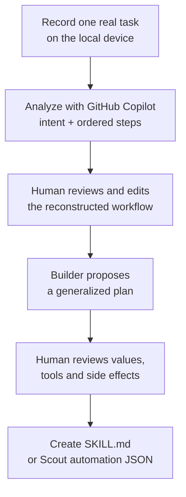

<div class="living-doc-banner">

**Experimental source project.** I tested the exact public **v0.3.1** release and its synthetic evals on 31 July 2026. I did not record my personal desktop or send a real work session for cloud analysis. Capabilities and risks below are tied to that release.

</div>

*This is part of the [Microsoft 365 Copilot Skills series](/blog/microsoft-365-copilot-skills-explained/).*

The idea is huge: do a task once, then let an AI turn that real workflow into a reusable Skill.

The current tool is much smaller than that idea.

[Microsoft Skill Recorder](https://github.com/microsoft/skill-recorder) is a new open-source Electron application. It records screen and activity signals locally, asks GitHub Copilot to reconstruct your intent and steps, and then helps you create:

- an on-demand **Scout Skill**;
- an on-demand **Cowork Skill**; or
- a scheduled or condition-triggered **Scout Automation**.

It is also a **v0.3.1 source-only release**, published on 30 July 2026, with no prebuilt application attached and several open hardening issues.

<p></p>

*The recording controls in Skill Recorder v0.3.1. Source: [the exact v0.3.1 image](https://github.com/microsoft/skill-recorder/blob/32fd0b57e02c3ea1e016cca0d64e59052e93a9b9/docs/images/recorder.png), MIT licence.*

## The short version

| Question | Honest answer for v0.3.1 |
|---|---|
| Is the record-to-Skill idea important? | Yes — it changes Skill authoring from remembering a process to demonstrating it |
| Is this a click-replay macro recorder? | No — it reconstructs intent and prefers native agent tools |
| Scout Skill | Supported and installed to the local Skills folder |
| Cowork Skill | Supported as an exported `SKILL.md` for manual installation |
| Scout Automation | Supported as exported `automation.json` |
| Copilot Studio | Shown as **Coming soon** in the source |
| GitHub Copilot | Required for analysis and building; not an output target |
| Prebuilt signed installer | No — v0.3.1 is source-only |
| Automatic secret redaction | No, not in the tested release |
| Production-ready | No — use an isolated lab with synthetic data |

Big authoring idea. Small, early implementation. Keep both truths in your head.

## What Skill Recorder actually does

The workflow has two AI stages and two human review points.



### 1. Record

Start from the application or use the global shortcut:

- macOS: `Command + Shift + R`
- Windows: `Ctrl + Shift + R`

Narration is optional and off by default. The recording bar lets you switch microphone or language while the session is running.

### 2. Analyze

Select **Analyze** when the task is complete.

GitHub Copilot reconstructs:

- one overall intent;
- an ordered list of meaningful steps;
- the applications involved;
- what the task was trying to achieve.

You can edit, remove, add, or reorder those steps before building anything.

<p></p>

*The reconstructed intent and editable step list. Source: [the exact v0.3.1 image](https://github.com/microsoft/skill-recorder/blob/32fd0b57e02c3ea1e016cca0d64e59052e93a9b9/docs/images/library.png), MIT licence.*

### 3. Plan

Choose what to build.

The builder separates:

- **calculations** — read, derive, filter, decide or format;
- **actions** — submit, send, create, edit, delete or otherwise change something.

It also extracts fixed values, such as a canonical URL or repository name, into editable tokens rather than scattering them through every step.

### 4. Create

After you approve the plan, the tool creates the final artifact.

The goal is not to replay coordinates or reproduce every window switch. The builder instructions explicitly prefer:

- native agent tools;
- Microsoft 365 tools;
- APIs;
- first-class Skills;
- authenticated CLIs such as `gh`, `git` or `az`;
- browser automation only when a task is genuinely UI-only.

## What it records

Skill Recorder's public documentation says recording and storage stay on the device until you select Analyze.

### Local while recording

- active app and window changes;
- window or document titles;
- browser URLs on macOS; Windows captures a best-effort address-bar display value; Ubuntu has no URL provider in v0.3.1;
- low-rate screen recording and extracted frames;
- short clipboard previews;
- optional microphone narration;
- on-device Whisper transcription.

The Whisper model is a separate first-use download of roughly 252 MB.

### Sent to GitHub's cloud on Analyze

- event timeline;
- app, window and document titles;
- captured URLs from supported platforms;
- clipboard previews;
- extracted screen images;
- narration text.

The raw screen video is not listed as an Analyze upload, but selected frames are.

> **Privacy boundary**
>
> A filename, browser tab, notification, copied value or background window can reveal information you did not intend to teach. Microsoft 365 Purview, DLP, retention, eDiscovery and tenant-audit coverage are not documented for this Recorder workflow. Do not assume the Microsoft 365 Copilot trust boundary applies to data sent to GitHub Copilot.

## No automatic redaction in v0.3.1

The release warns before recording:

- keep passwords off screen;
- do not type or paste tokens;
- do not copy API keys;
- do not narrate confidential information.

That warning is the current protection.

As checked on 31 July 2026, an [on-device sensitive-detail detection and redaction pull request](https://github.com/microsoft/skill-recorder/pull/32) exists, but it is explicitly marked **DO NOT MERGE**, does not typecheck, and says screenshot redaction still needs an OCR/blur design.

So the safe assumption is:

If a sensitive value appears on screen, in a title, in the clipboard or in narration, the current release might capture it.

## What it can create today

The repository source is clearer than the launch summary.

| Target | Current output | Placement |
|---|---|---|
| **Scout Skill** | `SKILL.md` | Installed under `~/.copilot/skills/<name>/SKILL.md` |
| **Cowork Skill** | `SKILL.md` | Exported to a folder you choose; install manually |
| **Scout Automation** | `automation.json` | Exported under `~/.copilot/automations/<name>/` for Scout import |
| **Copilot Studio** | Nothing yet | Source displays **Coming soon** |

GitHub Copilot is the analysis engine. It is not one of the generated targets.

### Skills are one file today

The current builder renders one `SKILL.md`.

It does not yet generate:

- `references/`;
- `scripts/`;
- `assets/`;
- an MCP configuration;
- a Cowork Microsoft 365 app package.

[Supporting-file creation and MCP discovery](https://github.com/microsoft/skill-recorder/issues/26) are still open investigation items.

That means a generated Cowork Skill is not the same as a complete packaged Cowork plugin. Use the separate [Cowork packaging guide](/blog/microsoft-365-copilot-skills-cowork-packaging-distribution/) when you need app-manifest distribution, connectors or tenant deployment.

## Hands-on v0.3.1 lab results

I used the exact release commit:

```text
v0.3.1
32fd0b57e02c3ea1e016cca0d64e59052e93a9b9
```

I did not run the one-line `irm | iex` installer or record this desktop. I cloned the exact tag and used the project's own synthetic fixtures.

```powershell
git clone --depth 1 --branch v0.3.1 https://github.com/microsoft/skill-recorder.git
cd skill-recorder
npm ci
npm run compliance:licenses
npm test
npm run build
```

### Build and test results

| Gate | Result |
|---|---|
| Licence preparation | 171 package licences prepared |
| TypeScript/Vite production build | Passed |
| Eval harness typecheck | Passed |
| Unit/compliance tests | 58/58 passed after Git's `unzip` was added to PATH |
| Describer evals | 9/9 passed, all scored 100% |
| Scout/Cowork Skill-plan evals | 5/5 passed, all scored 100% |
| Scout Automation-plan evals | 8/10 passed |

The initial unit run was 57/58 because one test shells out to an `unzip` executable that was not on this Windows PATH. The same test passed when Git's bundled `unzip.exe` was added.

### Why the Automation suite was 8/10

The two failed scenarios produced readable browser-based plans for UI-only web apps.

The scorer expected exact terms such as:

- `browser_`;
- `browser automation`;
- `web_fetch`;
- Work IQ.

The generated plan said **use the browser**, so the intent looked reasonable to a human, but it missed the evaluator's accepted token list. I would treat that as useful evidence of eval/builder alignment work—not claim 10/10 and not dismiss the official failure.

## Dependency audit snapshot

`npm ci` installed the exact lockfile successfully.

The 31 July `npm audit` snapshot reported:

- **1 critical** advisory;
- **30 high** advisories;
- 609 dependencies in the tree.

The critical finding was in transitive `tar`. High findings included direct or transitive dependencies such as `@electron/asar`, `@huggingface/transformers`, `adm-zip`, `archiver`, `electron-builder` and `sharp`.

These are npm dependency advisories, not proof of exploitability, reachability, or a Microsoft security finding. No remediation was applied.

Advisory counts change over time. This is not a permanent score, but it is a strong reason not to install v0.3.1 casually on a production workstation.

> **Do not auto-fix the release**
>
> Running `npm audit fix --force` would mutate the exact release and could break its reviewed compliance boundary. Use a newer release when maintainers update dependencies, or test any remediation as a separate fork.

## Open hardening issues that matter

The project is unusually transparent about its current risks.

### Generated tools can exceed the reviewed plan

As checked on 31 July 2026, [Issue #8](https://github.com/microsoft/skill-recorder/issues/8) says the final Skill creation turn can add `allowed-tools` entries that were not in the human-approved plan.

Until fixed:

- diff the final `allowed-tools`;
- compare them with the reviewed plan;
- remove anything broader;
- do not auto-install without inspection.

### Recording can crash or wedge

As checked on 31 July 2026, two open issues whose reporters label them `[High]` document:

- [unhandled stream errors that can crash recording](https://github.com/microsoft/skill-recorder/issues/7);
- [state transitions that can leave recording stuck](https://github.com/microsoft/skill-recorder/issues/9).

### Support is not ready

The current `SUPPORT.md` is still the unedited Microsoft template.

As checked on 31 July 2026, an [open documentation pull request](https://github.com/microsoft/skill-recorder/pull/24) proposes the honest wording: experimental research project, GitHub Issues best-effort support, no Microsoft CSS support or SLA, and mandatory review of generated Skills.

That language is not merged into v0.3.1, but it is the right risk posture.

## Installation reality

The v0.3.1 release published on 30 July 2026 has:

- no prebuilt application;
- no attached installer;
- no portable binary.

The source installer downloads a pinned Node.js 24 runtime, the exact source commit, Electron and dependencies, runs `npm ci`, checks licences, builds locally, and adds a **Skill Recorder (Source)** shortcut.

Supported source-install paths:

- macOS — primary target;
- Windows 11 x64;
- Windows 11 ARM64;
- Ubuntu.

The [inspect-first installation procedure](https://github.com/microsoft/skill-recorder/blob/v0.3.1/INSTALL.md#inspect-first-installation) is safer than piping a remote script directly into a shell.

Enterprise controls can still block the locally assembled app:

- Gatekeeper;
- Smart App Control;
- application-control policy;
- endpoint protection.

## CAT Agent Skills: find before you record

Before creating a new Skill, check whether someone has already shared one in the [CAT Agent Skills gallery](https://microsoft.github.io/cat-agent-skills/).

<p></p>

*CAT Agent Skills on 31 July 2026. This is a community gallery and example implementation—not a Microsoft-supported marketplace.*

### Gallery snapshot

| Item | 31 July snapshot |
|---|---:|
| Total entries | 71 |
| Skills | 67 |
| Scout automations | 3 |
| Grandfathered plugin | 1 |
| Named authors | 38 |
| Community-attributed entries | 70 |
| Entries with downloadable bundles | 50 |

Platform counts overlap:

- Copilot Studio: 61
- Cowork: 38
- Scout: 30

The gallery also exposes a static [`skills.json` catalogue feed](https://microsoft.github.io/cat-agent-skills/skills.json) that can be searched or used for lightweight discovery automation.

### Trust model

CAT validates metadata, folder shape and site build.

It does not publicly claim that every Skill is:

- security-reviewed;
- malware-reviewed;
- functionally tested;
- Microsoft-certified;
- supported by Microsoft Support.

Bundles can include scripts, references and assets exactly as submitted. Ratings are community GitHub reactions, not a certification.

Read every downloaded `SKILL.md` and script before installing it.

## Safe pilot checklist

### Use safe source material

- [ ] Synthetic task and files only
- [ ] No customer, employee, health, finance or legal data
- [ ] Close unrelated applications and notifications
- [ ] Empty the clipboard before recording
- [ ] Keep narration off for the first run
- [ ] Do not show passwords, tokens or account IDs

### Review what the AI inferred

- [ ] Intent matches the real goal
- [ ] Off-task windows were removed
- [ ] Specific examples became a general loop
- [ ] Fixed paths and URLs are genuinely fixed
- [ ] Calculations and actions are separated
- [ ] Side effects are explicit

### Review the generated artifact

- [ ] `description` triggers only the intended task
- [ ] `allowed-tools` is no broader than the approved plan
- [ ] No recorded secrets, names or paths remain
- [ ] Native tools are preferred over UI automation
- [ ] Destructive actions require target-agent approval
- [ ] Test in a non-production account first

## Should you use it?

| Situation | Recommendation |
|---|---|
| Learning how record-to-Skill authoring could work | Yes — isolated synthetic lab |
| Drafting a low-risk Scout or Cowork Skill | Yes, with line-by-line review |
| Recording customer or employee workflows | No |
| Recording a password, payment, HR or admin task | No |
| Enterprise rollout | Not yet |
| Copilot Studio Skill generation | Not supported in v0.3.1 |
| Publishing directly to CAT Gallery | No built-in path; review and contribute separately |

## Continue the Copilot Skills series

- **[Microsoft 365 Copilot Skills, explained](/blog/microsoft-365-copilot-skills-explained/)** — the hub.
- **[Write your first SKILL.md](/blog/write-your-first-skill-md-microsoft-365-copilot/)** — manual authoring and evals.
- **[Cowork Skill packaging and distribution](/blog/microsoft-365-copilot-skills-cowork-packaging-distribution/)** — turn a Skill into a governed app package.
- **[Admin and governance for Copilot Skills](/blog/microsoft-365-copilot-skills-admin-governance/)** — tenant controls and Purview boundaries.

## Official public sources

- [Microsoft Skill Recorder repository](https://github.com/microsoft/skill-recorder)
- [Skill Recorder v0.3.1 release](https://github.com/microsoft/skill-recorder/releases/tag/v0.3.1)
- [Skill Recorder installation guide](https://github.com/microsoft/skill-recorder/blob/v0.3.1/INSTALL.md)
- [Skill Recorder Windows validation](https://github.com/microsoft/skill-recorder/blob/v0.3.1/WINDOWS-VALIDATION.md)
- [Skill Recorder eval documentation](https://github.com/microsoft/skill-recorder/blob/v0.3.1/evals/README.md)
- [CAT Agent Skills gallery](https://microsoft.github.io/cat-agent-skills/)
- [CAT Agent Skills contribution guide](https://github.com/microsoft/cat-agent-skills/blob/main/CONTRIBUTING.md)
- [Agent Skills specification](https://agentskills.io/specification)
