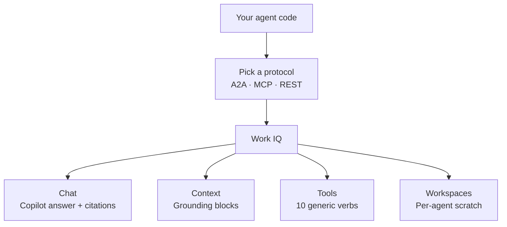

Microsoft's Work IQ API goes generally available on **16 June 2026**. Ahead of GA, I walked through every part of it on a lab tenant — both halves. The **admin half** (one URL + one workaround for the famous AADSTS650052 trap). The **user half** (four install paths to choose from + the EULA). And three real walkthroughs against a synthetic *Project Adventure* dataset so you can see what good looks like before you build. This post is the plain-English version of what I learned, structured so any team can follow along on their own tenant.

If you've been reading the announcement headlines and wondering *"is this another Microsoft Graph?"* — the short answer is **no, it's a different shape of API**. The long answer is the rest of this post.

I also built [**two tiny working samples**](https://github.com/susanthgit/aguidetocloud-workiq-samples) you can fork on Day 1 — a morning brief generator (Node script) and an embeddable web-app (Express + browser UI). Both call Work IQ directly via the A2A protocol. Links + full walkthrough later in this post.

<div class="living-doc-banner">

🔄 This is a living document. The AI world changes every day — features roll out, names change, and new capabilities appear. If you spot anything out of date, please [send me feedback](/feedback/) and I'll update it. Last verified: 11 June 2026 (pre-GA on a lab tenant — refreshed on / after 16 June with live production checks).

</div>

**Quick Links**

- [The Translator Analogy — What Work IQ Actually Is](#the-translator-analogy--what-work-iq-actually-is)
- [When to Reach for Work IQ vs Microsoft Graph](#when-to-reach-for-work-iq-vs-microsoft-graph)
- [What Microsoft Announced, In 12 Plain Words](#what-microsoft-announced-in-12-plain-words)
- [The Four Components of Work IQ](#the-four-components-of-work-iq)
- [The 10 Verbs — A Jeweller's Screwdriver, Not An IKEA Box](#the-10-verbs--a-jewellers-screwdriver-not-an-ikea-box)
- [Setup — The Admin Journey (One URL + One Workaround)](#setup--the-admin-journey-one-url--one-workaround)
- [Setup — The User Journey (Pick An Install Path)](#setup--the-user-journey-pick-an-install-path)
- [Build Something With It — Two Samples + The Repo](#build-something-with-it--two-samples--the-repo)
- [What It Costs — Copilot Credits Explained](#what-it-costs--copilot-credits-explained)
- [What Changes When This Lands — Outlook, Scout, Custom Apps](#what-changes-when-this-lands--outlook-scout-custom-apps)
- [The Honest Limitations](#the-honest-limitations)
- [Top 5 Errors You'll Hit (And What To Do)](#top-5-errors-youll-hit-and-what-to-do)
- [Where To Go Next](#where-to-go-next)

## The Translator Analogy — What Work IQ Actually Is

Imagine you're a manager in a multilingual company.

Microsoft Graph is the **raw transcript service** — it hands you every email, calendar event, file, and chat exactly as written. If you want to know who's the right person to ask about the Q3 deck, you have to read the transcripts yourself, work out who keeps replying to whom, and build a mental picture of who's actually involved.

Work IQ is the **translator who's been sitting in every meeting for the last two years**. You ask "who's the right person for the Q3 deck?" and you get a person, not a transcript. The translator already understands who collaborates with whom, what *Q3 deck* means in this tenant, and which meeting was the one where the customer pushed back.

Both layers exist. Both are useful. They do different jobs.

Heads up: this metaphor isn't a perfect map. Graph isn't *just* the raw data — it has its own enrichment. But "raw transcript vs translator" is the closest one-line analogy I've found for the shape difference between the two surfaces.

That shape difference is why Microsoft is pitching Work IQ as **the recommended foundation for new agent applications on M365 data**. Agents are not browser users. They don't want a paginated list of 500 messages; they want the *meaning*. Work IQ packages the meaning server-side, before the answer leaves the building.

## When to Reach for Work IQ vs Microsoft Graph

The honest follow-up to the translator analogy: *"so do I throw Graph away?"* No. Pick whichever fits the job in front of you.

| Scenario | Work IQ | Microsoft Graph | Why |
|---|---|---|---|
| Agent answering an end-user question over their M365 content | ✅ | — | Server-side context packaging + delegated auth = built for this |
| Building a Copilot-style "what changed on Project Adventure this week?" surface | ✅ | — | Chat + Context APIs do the orchestration for you |
| Scheduled nightly export of mailbox / SharePoint / Teams data | — | ✅ | Work IQ has no app-only auth — Graph batch jobs are right tool |
| Sending mail / creating events on a user's behalf inside an agent flow | ✅ | ✅ | Both work; Work IQ Tools (`do_action /me/sendMail`) keeps your agent on one API surface |
| Running an unattended back-office automation as a service principal | — | ✅ | Application-only auth not supported on Work IQ |
| Building a Teams bot that responds when a user @-mentions it | ✅ | — | The agent always has a signed-in user context, so Work IQ fits |
| Pulling Power BI datasets / Intune device records / Defender alerts | — | ✅ | Outside the M365-content scope Work IQ covers today |
| Migrating an existing Graph-based assistant to take advantage of Copilot's reasoning | ✅ (Chat + Context) | ✅ (keep your Graph plumbing) | Hybrid is normal — most teams will run both for a long time |

The pattern: if your agent runs **as a signed-in user reasoning over M365 content**, start with Work IQ. If your code runs **as a service** (batch, background, unattended) or touches **non-M365 data**, stay on Graph. The two are designed to coexist.

## What Microsoft Announced, In 12 Plain Words

Microsoft's announcement, paraphrased: *"a workplace intelligence layer that gives agents a real understanding of everything happening across your business — context, relationships, and patterns — so agents can deliver faster, more accurate, more secure responses than connector-only approaches."*

That's 30 enterprise words. The 12-word version: **"the brain that's behind Copilot is now its own API for your agents."**

That's the whole thing. Everything else — the four components, the 10 verbs, the three protocols, the Copilot Credits billing — is implementation detail of that single idea.

Microsoft's pitch comes with four quantitative claims, all from their own internal testing:

| Claim | What Microsoft says |
|---|---|
| Data footprint | Average Fortune 500 tenant has 600+ TB of data Work IQ continuously understands |
| Speed | 2× faster than equivalent raw-Graph operations for agent workloads (Microsoft's benchmark phrasing: "run time per second" — roughly throughput / tokens-per-second) |
| Efficiency | 80% fewer tokens used vs raw-Graph approaches in coding harnesses |
| Scale | Architected for the high-frequency continuous traffic agents generate, not human-app patterns |

These are Microsoft's published numbers. I'm planning to measure them directionally on my own tenant — the same question asked via `workiq ask` versus the equivalent raw-Graph chain, with token counts captured on both sides — and update this post with what I see. The *architectural reason* the gains are plausible is solid: server-side context packaging beats client-side stitching every time, and that's exactly what Work IQ does.

## The Four Components of Work IQ

Work IQ has four parts. Microsoft sometimes calls them "components", sometimes "domains", sometimes "layers" — same thing.

| Component | What it gives you | When you'd use it |
|---|---|---|
| **Chat** | Programmatic access to the full M365 Copilot reasoning stack — the answer Copilot would give a user, with citations | Your agent needs an *answer*, not raw data — same as if a user asked Copilot directly |
| **Context** | Same source content Copilot would aggregate for an answer — but returned as agent-ready context blocks, not a synthesized response | Your agent has its own reasoning logic and just wants the *grounded context* to think with |
| **Tools** | 10 generic verbs against resource paths (Entity tools via Microsoft Graph; Copilot tools invoke M365 Copilot; Schema tools introspect Work IQ's own path registry) | Your agent needs to *do things* — send mail, create events, upload files — not just read |
| **Workspaces** | Per-agent durable scratch space inside the tenant trust boundary | Long-running agents (Microsoft Scout, or any custom agent that needs memory between calls) that need to stash intermediate state without leaking it outside the tenant |

Most early Work IQ integrations will combine Context + Tools. Chat is the heaviest call (it does all the reasoning Copilot would). Workspaces is mostly relevant for larger orgs running long-lived agents — only matters if your agent runs longer than a single request/response.

If you want a one-glance picture of how the four components, three protocols, and your code fit together:



You pick a protocol, call one or more of the four components, and Work IQ does the orchestration into Graph or Copilot for you. Your code never has to wire those parts together itself.

## The 10 Verbs — A Jeweller's Screwdriver, Not An IKEA Box

This is the part of Work IQ that took me longest to get my head around — and the part where the design principle pays off.

Microsoft did not ship 100 specific verbs (`sendMail`, `createEvent`, `getMessages`, `uploadFile`, …). They shipped **10 generic verbs that compose against resource paths**. A jeweller's screwdriver: a small set of bits that fit a huge variety of screws — not the IKEA box where every part has its own dedicated tool.

The 10, organised by category:

| Category | Verbs | What they do |
|---|---|---|
| **Entity tools** | `fetch` · `create_entity` · `update_entity` · `delete_entity` · `do_action` · `call_function` | CRUD operations and actions on M365 resources via Microsoft Graph |
| **Copilot tools** | `ask` · `list_agents` | Invoke M365 Copilot for natural-language reasoning · discover available agents |
| **Schema tools** | `get_schema` · `search_paths` | Runtime introspection — discover available paths and retrieve OpenAPI schemas on demand |

Heads up: the MCP overview page on Microsoft Learn introduces these as "four categories" in its prose, but the table directly below shows three (Entity, Copilot, Schema), and so does the Tool Reference. 6 + 2 + 2 = 10 either way — three is the count to use in your design notes.

The design principle Microsoft repeats every chance they get: ***fewer tools, more paths***. When a new workload ships — say, Loop pages — Microsoft doesn't add a `getLoopPage` verb. They add a `/me/loopPages` resource path. Your agent calls `fetch /me/loopPages`. The tool surface stays at 10 forever.

Two consequences of this design that matter for builders:

1. **Agent prompts get a lot shorter.** Instead of teaching the model that `sendMail` exists, that `replyToMessage` exists, that `forwardMessage` exists — you teach it that `do_action` exists and that it can hit `/me/sendMail`, `/me/messages/{id}/reply`, and `/me/messages/{id}/forward`. The action verbs become resource paths in the prompt, not tools in the registry.
2. **Schema discovery is runtime, not bundled.** Your agent doesn't pre-load thousands of OpenAPI type definitions. It calls `search_paths` to find what's available, then `get_schema` on the specific path it wants. This trades a bit of latency for a *huge* drop in context tokens — which is exactly where Microsoft's "80% fewer tokens" claim comes from.

A handful of real invocations to make it concrete:

```text
fetch /me/messages                              → read my emails
do_action /me/sendMail                          → send an email
create_entity /me/events                        → create a calendar event
fetch /me/chats/{id}/messages                   → read Teams chat messages
call_function /search/query                     → semantic search across the tenant
ask "What deals closed this quarter?"           → invoke Copilot reasoning
list_agents                                     → discover available agents
get_schema /me/events                           → OpenAPI for the calendar resource
```

## Setup — The Admin Journey (One URL + One Workaround)

This is the part the IT admin does once for the whole tenant. If you're not the admin, send this section to whoever is — they need 15 minutes.

**Before you begin (admin prereqs)** — these are the things the section below assumes you have. If any of them are missing, that's the first thing to fix:

| Prereq | How to check / get it |
|---|---|
| **An admin role** — one of: Global Admin, Cloud Application Admin, Application Admin, or Privileged Role Administrator | `entra.microsoft.com` → Identity → Roles & admins → search for your own account |
| **Microsoft 365 Copilot licences in the tenant** | `admin.microsoft.com` → Billing → Licenses · look for "Microsoft 365 Copilot" |
| **Your tenant ID** (a GUID — for the consent URL) | `entra.microsoft.com` → Overview · or PowerShell: `(Get-AzContext).Tenant.Id` |
| **PowerShell 7+** (`pwsh`), if you hit the AADSTS650052 workaround in Step 2.5 | `pwsh -v` should print 7.x. If missing, install from [aka.ms/powershell](https://aka.ms/powershell) |
| **Git** (only if you'll clone the microsoft/work-iq repo in Step 2.5) | `git --version` — if missing, [install Git](https://git-scm.com/downloads) or just download the script directly from the repo's web UI |
| **A browser that allows Microsoft pop-up sign-ins** | Default browsers all work. If your org uses a strict CA policy that blocks pop-ups from PowerShell, see Step 2.5's `-UseDeviceCode` option |

The whole admin journey, end to end:

1. Confirm there are Copilot licences in the tenant
2. Click one URL to grant tenant-wide consent
3. (If needed) run one PowerShell script to unblock a known consent error
4. Confirm in Entra that the Work IQ CLI app is registered

That's it. Once those four steps are done, every Copilot-licensed user in the tenant can install the CLI and start querying.

### Admin Step 1 — Confirm Copilot licences

Work IQ rides on Microsoft 365 Copilot. Open the M365 admin centre → **Billing → Licenses**. Look for **Microsoft 365 Copilot**. Any user who'll invoke Work IQ — or whose context an agent will read on their behalf — needs one assigned.

If you don't have licences yet, that's the slowest step in this whole process — there's a 24-hour propagation lag after you assign them. Plan ahead.

<figure>
  
  <figcaption style="text-align: center; font-size: 0.85rem; color: #6E7892; margin-top: 0.4rem; font-style: italic;">Admin centre → Billing → Licenses. The Microsoft 365 Copilot row is your Work IQ prereq.</figcaption>
</figure>

### Admin Step 2 — Click the consent URL

Open this URL in your browser, replacing the tenant ID with yours:

```
https://login.microsoftonline.com/{your-tenant-id}/adminconsent?client_id=ba081686-5d24-4bc6-a0d6-d034ecffed87
```

Sign in as a **Global Admin** (or Cloud Application Admin, Application Admin, or Privileged Role Admin), click **Accept**, and you've granted tenant-wide consent for the seven delegated Graph permissions Work IQ uses:

| Permission | What it reads |
|---|---|
| `Sites.Read.All` | Items in all SharePoint site collections |
| `Mail.Read` | User mail |
| `People.Read.All` | Users' relevant-people lists |
| `OnlineMeetingTranscript.Read.All` | Online meeting transcripts |
| `Chat.Read` | User chat messages |
| `ChannelMessage.Read.All` | All Teams channel messages |
| `ExternalItem.Read.All` | External items (Copilot connectors) |

**What this consent does NOT grant — for admins worried about scope.** Every scope above is **read-only**. Work IQ cannot write to mailboxes, edit calendar events, send mail, modify Teams channels, or change SharePoint content with this consent. It cannot read other admins' mailboxes outside the user's own delegated permissions. It cannot bypass Conditional Access, DLP, sensitivity labels, or Purview policies — those still apply to every Graph call Work IQ makes on a user's behalf. It cannot access non-M365 data (Power BI datasets, Intune devices, Defender alerts, third-party SaaS). The only "write" pathway is the separate `do_action` / `create_entity` Tools, and those require the **end user's own delegated permissions** at call time — the admin consent here doesn't pre-authorise them.

<figure>
  
  <figcaption style="text-align: center; font-size: 0.85rem; color: #6E7892; margin-top: 0.4rem; font-style: italic;">The live consent dialog covers the seven Graph scopes plus fourteen MCP-server scopes and "Ask Work IQ agents on behalf of the user" — about twenty-three permissions in total. Worth a heads-up before you click Accept; the live prompt itself is the source of truth on what's being requested.</figcaption>
</figure>

<figure>
  
  <figcaption style="text-align: center; font-size: 0.85rem; color: #6E7892; margin-top: 0.4rem; font-style: italic;">After Accept you get a localhost-refused page — that's normal. The Quick Start URL uses localhost as its callback. Look for <code>admin_consent=True</code> in the URL bar; that's the success signal.</figcaption>
</figure>

### Admin Step 2.5 — The AADSTS650052 trap

Some tenants will see this when clicking the URL above:

```
AADSTS650052: The app needs access to a service that
your organization has not subscribed to or enabled.
```

<figure>
  
  <figcaption style="text-align: center; font-size: 0.85rem; color: #6E7892; margin-top: 0.4rem; font-style: italic;">Hit this on the Quick Start URL? Don't panic. It just means the script below needs to run first.</figcaption>
</figure>

This is not your fault. The **Work IQ Tools MCP Server** resource (and a few related ones — Mail, Calendar, Teams, OneDrive, SharePoint, Word, Admin, Me, M365 Copilot) doesn't have a service principal auto-provisioned in your tenant. The consent flow assumes they do and stops.

The fix is one PowerShell script:

```powershell
# Clone the repo first (or download the scripts/ folder)
git clone https://github.com/microsoft/work-iq.git
cd work-iq

# Optional first — read-only check for what's missing
.\scripts\Verify-WorkIQTenant.ps1

# Then the fix — provisions the missing SPs and grants consent
.\scripts\Enable-WorkIQToolsForTenant.ps1
```

**Before you run it, two things you need to know about the script** (it's well-behaved but does talk to your tenant in a few non-obvious ways):

| What happens | What you need |
|---|---|
| Auto-installs the `Microsoft.Graph` PowerShell modules from PSGallery if missing | Say **Yes** to the PSGallery trust prompt the first time |
| Runs `Connect-MgGraph` partway through with scopes `Application.ReadWrite.All` + `DelegatedPermissionGrant.ReadWrite.All` | A **browser pop-up appears for admin sign-in**. Sign in as a tenant admin |
| Requires one of: Global Admin, Cloud Application Admin, or Application Admin | Sign in with an account that holds one of these roles |
| Auto-disconnects from Graph when done | Nothing — clean exit |

If you're on a server / headless box / SSH session where a browser pop won't work, pass `-UseDeviceCode` and the script gives you a `https://microsoft.com/devicelogin` code to enter on any device:

```powershell
.\scripts\Enable-WorkIQToolsForTenant.ps1 -UseDeviceCode
```

If your execution policy is Restricted, run with a bypass for the session only:

```powershell
pwsh -ExecutionPolicy Bypass -File .\scripts\Enable-WorkIQToolsForTenant.ps1
```

After the script finishes, **re-try the consent URL** from Admin Step 2 — it'll go through.

<figure>
  
  <figcaption style="text-align: center; font-size: 0.85rem; color: #6E7892; margin-top: 0.4rem; font-style: italic;">The script's <em>own</em> auth prompt. Tick "Consent on behalf of your organization" and Accept. This is the script asking — separate from the Work IQ consent in Step 2.</figcaption>
</figure>

<figure>
  
  <figcaption style="text-align: center; font-size: 0.85rem; color: #6E7892; margin-top: 0.4rem; font-style: italic;">"Work IQ tenant enablement complete!" — what you want to see. Now go re-try the consent URL.</figcaption>
</figure>

If you're reading this *before* clicking the consent URL: just run `Enable-WorkIQToolsForTenant.ps1` first. It works whether your tenant needs the workaround or not. Five minutes of friction saved.

**Heads up on the companion Verify script.** The repo ships a read-only `Verify-WorkIQTenant.ps1` next to the Enable script — handy in theory for checking what's missing without changing anything. As of writing it has a PowerShell parse error in the current GitHub copy and won't run. Skip Verify and run Enable directly; Enable is idempotent, so running it on a tenant that doesn't need the workaround won't break anything. Keep an eye on the GitHub repo — this is the kind of small thing that usually gets patched quickly.

<figure>
  
  <figcaption style="text-align: center; font-size: 0.85rem; color: #6E7892; margin-top: 0.4rem; font-style: italic;">The Verify script with a parse error — running it gets you nothing useful. Skip it; run Enable directly.</figcaption>
</figure>

### Admin Step 3 — Verify in Entra

After consent, head to **[Microsoft Entra admin centre](https://entra.microsoft.com) → Identity → Applications → Enterprise applications**. Filter or search for **Work IQ CLI**. You should see it listed with admin consent granted (the **Permissions** tab confirms the 7 Graph scopes). The full set of MCP-server-related SPs (Work IQ Tools, Mail, Calendar, Teams, OneDrive, SharePoint, Word, Admin, Me, M365 Copilot) should also be present in the same list — that's how you know the Step 2.5 script (if you ran it) did its job.

To view this page you need at least **Cloud Application Administrator** or **Application Administrator** (read access). Global Admin works too.

<figure>
  
  <figcaption style="text-align: center; font-size: 0.85rem; color: #6E7892; margin-top: 0.4rem; font-style: italic;">A faster way to verify than clicking through menus — type "work iq" in the Entra search bar and you should see all ten service principals grouped under Enterprise applications.</figcaption>
</figure>

That completes the admin journey. Your users can now install + use Work IQ.

## Setup — The User Journey (Pick An Install Path)

Now it's the user's turn. Once admin consent is done, every Copilot-licensed user installs Work IQ on their own machine in a few minutes.

**Before you begin (user prereqs — the floor below is required no matter which path you pick)** —

| Prereq | How to check / get it |
|---|---|
| **A work account with a Microsoft 365 Copilot licence assigned** | Ask your admin · features may take up to 24 hours to appear after assignment |
| **Admin consent already granted for your tenant** | Admin journey above must be done first · ask your admin |
| **A browser that allows Microsoft sign-in pop-ups** | All major browsers work; you'll see a Microsoft sign-in page once during EULA acceptance |

Each install path below adds its own extras. Pick whichever path matches how you work.

### Path A — Copilot CLI plugin (featured — fastest, lowest friction)

If you already use the [GitHub Copilot CLI](https://github.com/features/copilot/cli/), this is a three-command setup.

Two official Microsoft sources, two slightly different install paths — both work. The GitHub `microsoft/work-iq` README uses the commands shown below. Microsoft Learn's CLI doc uses `/plugin marketplace add github/copilot-plugins` then `/plugin install workiq@copilot-plugins` instead. Pick whichever you find first; the underlying plugin binary is the same.

**Path A prereqs:**

| Prereq | How to check / get it |
|---|---|
| **GitHub Copilot subscription** (Pro, Business, or Enterprise) | [github.com/features/copilot](https://github.com/features/copilot) |
| **GitHub Copilot CLI installed** | `copilot --version` from any terminal · install via [docs.github.com/copilot/github-copilot-cli](https://docs.github.com/en/copilot/how-tos/use-copilot-agents/use-copilot-in-the-command-line) |

Then:

```bash
copilot
/plugin marketplace add microsoft/work-iq
/plugin install workiq@work-iq
```

Restart Copilot CLI (`exit` then `copilot` again) and the `workiq` tool is available inside the same chat surface:

```text
You: What are my upcoming meetings this week?
You: Summarise emails from Sarah about the budget.
You: Find documents I worked on yesterday.
```

<figure>
  
  <figcaption style="text-align: center; font-size: 0.85rem; color: #6E7892; margin-top: 0.4rem; font-style: italic;">Honest-take moment: if you're already on Microsoft Scout, the marketplace is pre-registered. The "already registered" error is fine — just continue to the install command.</figcaption>
</figure>

<figure>
  
  <figcaption style="text-align: center; font-size: 0.85rem; color: #6E7892; margin-top: 0.4rem; font-style: italic;">The install is idempotent — runs cleanly whether the marketplace was already there or not.</figcaption>
</figure>

### Path B — VS Code one-click install (GUI-driven, no terminal-typing)

If your daily driver is VS Code (or VS Code Insiders) and you'd prefer a button to click rather than commands to type, Microsoft ships a one-click install badge in the [GitHub README](https://github.com/microsoft/work-iq).

**Path B prereqs:**

| Prereq | How to check / get it |
|---|---|
| **VS Code 1.99 or later** (MCP server support arrived in spring 2026) | `code --version` · [code.visualstudio.com](https://code.visualstudio.com) |
| **GitHub Copilot extension installed in VS Code** | Open VS Code → Extensions sidebar → search "GitHub Copilot" → Install |
| **Node.js LTS** (Copilot uses `npx` to launch the MCP server under the hood) | `node --version` should print 18 or higher · install from [nodejs.org](https://nodejs.org) |
| **Browser allowed to open the `vscode:` protocol handler** | First time you click the badge, the browser asks permission · click "Open" |

Click the **"Install in VS Code"** badge in the GitHub README — VS Code opens with an MCP install dialog pre-filled. Click **Install**, and Work IQ is registered as an MCP server in your VS Code workspace. Copilot Chat in VS Code can then call Work IQ as a tool.

<!-- skipped: 08, 09 — install-paths section demoted; samples section below shows real-world build patterns instead -->

There's an equivalent badge for **VS Code Insiders** in the same README.

### Path C — Microsoft Scout users (already installed)

If you already use **Microsoft Scout** (the always-on Autopilot agent Microsoft [launched on 2 June 2026](https://www.microsoft.com/en-us/microsoft-365/blog/2026/06/02/introducing-microsoft-scout-your-always-on-personal-agent/)), the Work IQ CLI is already bundled in your install.

**Path C prereqs:**

| Prereq | How to check / get it |
|---|---|
| **Microsoft Scout installed** | Look for "Microsoft Scout" in Windows Start menu · install via your tenant's Scout rollout |
| **Scout's CLI shim on PATH** | Open a NEW terminal (so it picks up the installer's PATH change) and run `workiq --version` |

Try this in a terminal:

```powershell
workiq --version
```

If you see something like `0.4.1.19742+d4efecc4df...`, you're set — Scout ships the same binary the standalone install does. You still need to `workiq accept-eula` once (per account) before first use.

If `workiq` is not found even after a Scout install, the bundled shim lives at `%USERPROFILE%\.copilot\bin\workiq.cmd` — open a new terminal (or restart your existing one) so the updated PATH takes effect.

<!-- skipped: 10 — covered by the marketplace-already-registered screenshot above (same insight) -->

### Path D — npm global / npx (universal terminal path)

For anyone outside the Copilot CLI / VS Code / Scout world — or anyone who wants the absolute minimum dependencies — npm is the universal path.

**Path D prereqs:**

| Prereq | How to check / get it |
|---|---|
| **Node.js LTS** (version 18 or higher) | `node --version` — install the LTS release from [nodejs.org](https://nodejs.org) if missing |
| **npm + npx on PATH** (bundled with Node.js) | `npm --version` and `npx --version` should both work |
| **Global-install permission** (only for the `npm install -g` flow) | On macOS/Linux this usually needs `sudo`; on Windows the npm install-location is your user folder by default — no admin needed |

Then:

```bash
# Global install (persistent)
npm install -g @microsoft/workiq

# OR on-demand via npx (always pulls the latest, no install)
npx -y @microsoft/workiq mcp
```

Works on Windows (x64 + ARM64), Linux, macOS, and WSL. The npx form is what most MCP-aware tools (Claude Desktop, Cursor, etc.) use under the hood when you add Work IQ to their JSON config:

```json
{
  "workiq": {
    "command": "npx",
    "args": ["-y", "@microsoft/workiq", "mcp"]
  }
}
```

### Accepting the EULA (one-time, per user)

Whichever path you picked, before your first query you accept the EULA:

```bash
workiq accept-eula
```

This pops a browser for Microsoft sign-in. Use your work account — the one that has the Copilot licence assigned. Once accepted, your token is cached locally and you don't see this flow again unless you `workiq logout` or your tenant invalidates the token.

**What can go wrong here, and what to do:**

| If you see… | Cause | Fix |
|---|---|---|
| The browser doesn't open / nothing happens | You're on a headless / SSH / remote session OR pop-ups are blocked | Try a workstation with a browser, or follow your terminal's prompt for the device-code URL if it offers one |
| "AADSTS50058" or "no user signed in" | You hit Cancel on the sign-in page, or used a personal Microsoft account by mistake | Re-run `workiq accept-eula` and sign in with your work account |
| "User account is not yet provisioned for Work IQ" | Admin consent hasn't been granted for your tenant yet, OR your Copilot licence is still propagating (up to 24h) | Wait 24h after licence assignment · ask your admin to verify the Admin Journey was completed |
| "License required" | You don't have a Copilot licence | Ask your admin to assign Microsoft 365 Copilot to your account |

<!-- skipped 11+12: generic Microsoft sign-in pages, don't add reader value -->

### Your first query (the moment it clicks)

```bash
workiq --account <your-work-email> ask -q "What's on my calendar this week?" --verbose
```

Replace `<your-work-email>` with your full UPN — e.g., `admin@contoso.onmicrosoft.com` or `j.smith@yourcompany.com`. If you only have one Microsoft account on this machine, you can drop the `--account` flag and workiq uses the cached one.

**What `--verbose` adds:** the conversation ID and request ID. You can later use `workiq debug <conversationId>` to generate a shareable diagnostic link — useful when you want to compare what an agent saw across runs, or when you raise a support ticket.

**Don't know your tenant domain?** Sign in to [outlook.office365.com](https://outlook.office365.com) — the email address in the top-right corner is your UPN. Your tenant domain is everything after the `@`.

<!-- skipped 13: CLI first query — the install paths above demonstrate the plugin works; for richer real-world output see the Build Something section below -->

That's the user journey. Five minutes if you're on the Copilot CLI plugin path, ten minutes via VS Code, less than that if Scout is already on the box.

## Build Something With It — Two Samples + The Repo

Asking Work IQ questions in a CLI is fine, but it's not why the API exists. The actual point is to build things *on top of* it — automations, custom UIs, integrations that wire Work IQ into where your team already works.

To make that concrete, here are two small samples (~270 lines total) we shipped to a public repo as Day-1 companion code. Both deliberately stay small so you can read them end-to-end, fork, and adapt:

**👉 [github.com/susanthgit/aguidetocloud-workiq-samples](https://github.com/susanthgit/aguidetocloud-workiq-samples) (MIT, fork away)**

---

### Sample 1 — Morning brief generator (`morning-brief/`)

A 190-line Node.js script that runs once at 8am, asks Work IQ three orchestrated questions, and writes a markdown standup brief to disk:

- *"Summarise everything that's happened with Project X in the last 7 days"*
- *"What's on my calendar today and tomorrow?"*
- *"What commitments have I made that I haven't followed up on?"*

Schedule it with **Windows Task Scheduler** or **cron** and you've got an auto-generated brief in your inbox every morning — built on top of Work IQ's agent orchestration, not a single CLI question. The script makes three sequential A2A calls and stitches the results.

<figure>
  
  <figcaption style="text-align: center; font-size: 0.85rem; color: #6E7892; margin-top: 0.4rem; font-style: italic;">What the script produces — six themed sections on Project Adventure, clean <strong>bold</strong> labels for sources, citation noise stripped. The script's <code>cleanForBrief()</code> post-processor handles that — Work IQ's raw output has long Outlook/SharePoint URLs and inline citation markers that look terrible in a markdown file; the cleaner makes them readable.</figcaption>
</figure>

It's adaptable. Pipe it into email with `nodemailer`. Post it to a Teams incoming webhook. Render as HTML and serve. The brief is just markdown — adapt it to your workflow.

### Sample 2 — Web-app (`web-app/`)

A tiny Express server + single-page HTML interface (~270 lines) for asking Work IQ questions in a browser. Demonstrates the embed pattern for adding Work IQ to any internal web app.

The full UX, three screenshots:

<figure>
  
  <figcaption style="text-align: center; font-size: 0.85rem; color: #6E7892; margin-top: 0.4rem; font-style: italic;">Empty state — just an input, four example chips, your account chip in the header.</figcaption>
</figure>

<figure>
  
  <figcaption style="text-align: center; font-size: 0.85rem; color: #6E7892; margin-top: 0.4rem; font-style: italic;">When you ask: question pins to the top, answer card shows "Asking Work IQ…" Work IQ A2A typically takes 10–30 seconds — honest about the latency.</figcaption>
</figure>

<figure>
  
  <figcaption style="text-align: center; font-size: 0.85rem; color: #6E7892; margin-top: 0.4rem; font-style: italic;">The answer — rendered markdown with sectioned structure, clickable source links, citation chips. All of that comes from the A2A endpoint; the frontend just runs <code>marked</code> + <code>DOMPurify</code> on the response.</figcaption>
</figure>

The frontend is ~200 lines of vanilla HTML/CSS/JS — no React, no build step. Backend is ~150 lines of Express + MSAL. Multi-turn conversations work via Work IQ's `contextId` (the server holds a Map of conversationId → A2A contextId across turns).

---

### The architecture we landed on (and the false starts)

Both samples authenticate via **MSAL device-code flow** and call the Work IQ **A2A REST endpoint** directly with a bearer token. Here's the honest history of how we got there:

| Tried | Why we dropped it |
|---|---|
| `workiq` CLI subprocess via Node `child_process.exec` | CLI's MSAL auth uses WAM (Windows Account Manager broker), which requires a windowed terminal with a parent HWND. Doesn't work in any non-GUI shell — legacy PowerShell, SSH session, CI runner, even GitHub Copilot CLI's embedded terminal. Sub-process inherits the same constraint. |
| Work IQ MCP server (`workiq mcp`) as stdio subprocess + JSON-RPC | Same WAM auth issue. *Also* the MCP server silently ignored the `--account` flag and the `WORKIQ_ACCOUNT` env var, defaulting to whatever account was last cached. On a workstation where you've ever signed into multiple Microsoft accounts, the agent silently used the wrong tenant. Real risk for multi-tenant developers. |
| MSAL device-code → A2A REST (what we shipped) | Works in any terminal — device code prints a URL + code, you enter it once in any browser, refresh token cached for ~90 days. Account routing is unambiguous (the token's UPN claim IS the auth identity). No WAM. |

The A2A endpoint lives at `https://workiq.svc.cloud.microsoft/a2a/`. It speaks JSON-RPC 2.0 with an `A2A-Version: 1.0` header. You POST a `SendMessage` method with a question in the `parts[].text`, get back a `task` object with `artifacts[].parts[].text` containing the answer.

A REST API in the same shape is "coming soon" per Microsoft Learn — when it lands, the migration is one endpoint URL change.

### Open invitation

These samples are deliberately small + unopinionated. Real production runs would add: retries, structured logging, per-tenant config, secrets management, rate limiting, streaming responses, multi-user OAuth federation. None of that is here. They're starting points.

If you build something interesting on top of these, [send me a link](/feedback/) — I'd love to feature what the community builds first.

## What It Costs — Copilot Credits Explained

Work IQ API usage is billed through **Copilot Credits**, a consumption model. There's no separate per-user licence on top of the M365 Copilot licence the user already needs.

**The unit:** 1 Copilot Credit = **$0.01 USD** ([source — Microsoft Copilot Studio estimator](https://microsoft.github.io/copilot-studio-estimator/)).

**The two cost components:**

| Component | Pricing shape | What you pay for |
|---|---|---|
| **Tools** (the 10 verbs) | **Fixed** per call | Each invocation of `fetch`, `do_action`, `create_entity`, etc. is a flat per-call charge regardless of token count. Expected rate at GA: 5 credits per call ($0.05) — confirm against your own usage. |
| **Chat + Context** | **Variable**, token-based | Charged per input + output tokens, varies by model. The model selection (GPT-5.5 vs GPT-5 mini vs Claude Sonnet 4.6, etc.) is the biggest cost lever you control. |

The per-model token rates published by Microsoft are denominated in credits per million tokens. Expected rates at GA, based on the broader Copilot Credits pricing model:

| Model | Input ($/1M tok) | Cached input | Output ($/1M tok) |
|---|---|---|---|
| GPT-5.5 (powerful) | $5 | $0.50 | $30 |
| GPT-5 mini (default) | $0.25 | — | $2 |
| Claude Sonnet 4.6 | $3 | $0.30 | $15 |

These rates are what the community is reporting pre-GA — confirm against the official Microsoft pricing page that goes live with GA. The structure (fixed Tools + variable Chat/Context) is locked.

The **new admin-centre cost dashboard** that launched with Work IQ is where this gets manageable:

- Choose **prepaid** or **pay-as-you-go** billing
- Set **spending limits per tenant, group, or user**
- See **real-time usage** per agent and per service
- Handle **credit-request workflows** when users hit their limits

Work IQ is the *first* product managed through this dashboard — Copilot Studio and others migrate in over time. If you've ever wished M365 admin centre had real cost controls on Copilot consumption, this is the first version of that.

> _Cost dashboard screenshots will land here once Microsoft ships the new admin-centre Copilot Credits surface (post-GA day). The post is updated when they do._

**Plain-English summary on cost:**

- Three or four daily Work IQ queries per user is going to be measured in cents per user per day on the GPT-5 mini default. Pennies.
- Heavy multi-turn agent loops on GPT-5.5 with a lot of tool calls can add up — that's where the spending-limit configuration earns its keep.
- The honest planning posture: turn on PAYG with a per-user daily cap for the first two weeks, watch the dashboard, then formalise budgets.

### A worked example — 50-user pilot

Let's make the abstract concrete. Imagine a 50-user pilot — say, your customer-success team — using a Work IQ-powered agent for a *"what's new on my accounts today?"* morning brief each weekday morning. Each brief averages 3 Work IQ calls (Tools + Context + Chat). Numbers are based on the expected GA rates above; verify against your own admin-centre dashboard once GA lands.

| Line item | Calculation | Monthly $ (GPT-5 mini default) | Monthly $ (GPT-5.5 powerful) |
|---|---|---|---|
| **Tools** (fixed 5 cr / call) | 50 users × 1 brief × 3 tool-style calls/brief × 22 working days × 5 cr × $0.01 | **$165** | $165 |
| **Chat + Context** (variable, token-based — ~2K input / 1K output per brief) | 50 × 1 × 22 × (2K input + 1K cached + 1K output) | **~$15 input + $44 output ≈ $59** | $220 + $660 = **~$880** |
| **Subtotal Work IQ** | — | **~$224 / month** | **~$1,045 / month** |
| **Per-user Copilot licences** (prerequisite — $30 / user / month) | 50 × $30 | **$1,500 / month** | $1,500 / month |
| **Total monthly cost** | — | **~$1,724 / month** ($34.48 / user) | **~$2,545 / month** ($50.90 / user) |

A few honest reads on these numbers:
- **The Copilot licences are by far the dominant cost.** Work IQ consumption is a rounding error on a small pilot at default-model rates.
- **Model choice is where things move.** GPT-5.5 costs ~15× more per output token than GPT-5 mini. Don't reach for the powerful model unless the use case demonstrably needs it.
- **Output tokens are the lever.** A morning brief that returns "in 4 bullets" rather than "in 4 paragraphs" can halve your Chat bill.
- **Cap before you scale.** Set a per-user daily Work IQ spending limit at $1 or $2 the first two weeks of the pilot. The admin-centre dashboard will tell you whether to relax or tighten before you roll out to the wider org.

These figures are illustrative — pre-GA model rates and an assumed token budget. Treat as ballpark planning, not contract numbers. The admin-centre cost dashboard is your source of truth once GA lands.

## What Changes When This Lands — Outlook, Scout, Custom Apps

Work IQ being a *layer* — not a product end-users open — means the visible changes show up in other Microsoft surfaces over time.

**Microsoft Scout** — the [first Autopilot agent Microsoft announced](https://www.microsoft.com/en-us/microsoft-365/blog/2026/06/02/introducing-microsoft-scout-your-always-on-personal-agent/) on 2 June 2026 — builds context powered by Work IQ over time. Per the Scout announcement, Scout *"builds context powered by Work IQ, learning how you work, what you care about, and what needs to happen next."* It's open-source-based (OpenClaw) and lives across Teams, Outlook, OneDrive, SharePoint. When you ask Scout to "block prep time for Thursday's customer meeting" or "flag any decisions that have been stalled for more than 5 days", what's happening underneath is Scout's reasoning loop calling Work IQ's Tools, Context, and Chat APIs in a sequence.

**Custom apps built by partners and ISVs** — every agent platform that supports MCP can now point a tool config at the Work IQ MCP server and gain access to any user's M365 tenant in a structured way. That includes Claude Desktop, every IDE with MCP support, custom agent frameworks like LangGraph and AutoGen, and any product anyone builds on top of MCP. The bar to integrate is lower than it's ever been — five lines of JSON config.

**Inside the M365 chrome itself** — Microsoft signals that more of Outlook's commitments tracking, Teams' decision-extraction, OneDrive's smart-folder behaviour will increasingly be backed by Work IQ as a shared back-end. You won't see Work IQ as a UI; you'll see Outlook quietly getting smarter about what you've committed to.

**What does NOT change** — Microsoft Graph is not deprecated. Work IQ is *the recommended foundation for new agent applications*. For batch jobs, scheduled imports, app-only services, and existing automations that work — stay on Graph. The two coexist for the long haul.

## The Honest Limitations

In the spirit of *honest > charming*, here's what surprised me on Day 1.

1. **Delegated-only auth is a real constraint.** If your existing architecture relies on app-only / unattended-agent / service-principal auth (most batch jobs, most scheduled imports), Work IQ is not for you yet. Microsoft has been clear they don't support it. This rules out a lot of analytics, reporting, and back-office automation patterns. Use Graph for those.
2. **Pricing details are still rolling out.** The Tools fixed-fee and per-model token rates I cited above are the best community consensus pre-GA. Microsoft's pricing page and the new admin-centre cost dashboard are the source of truth — verify against your own usage before committing to budgets.
3. **The first call is slower than subsequent ones.** Semantic-index warmup matters. Build for the warm-path numbers, but flag the cold-path latency to users in any UX where the first query is "instant" expectations.
4. **Agents need to be taught to use the resource-path style.** The shift from `sendMail`-as-tool to `do_action /me/sendMail`-as-resource-path is genuinely different. Your prompts and your agent system messages need updating. Don't expect a one-line swap to work out of the box.
5. **REST is "coming soon" — A2A and MCP are GA today.** If your architecture wants plain HTTPS REST and can't use MCP or A2A, you're waiting. No date announced.

## Top 5 Errors You'll Hit (And What To Do)

Save yourself the doomscroll. Five errors cover ~90% of the support questions in the first month of using Work IQ. Quick-reference here, full context lives in the relevant sections above.

| Error you'll see | Most likely cause | First thing to try |
|---|---|---|
| **AADSTS650052** — *"The app needs access to a service…that your org has not subscribed to."* on the admin consent URL | The parent Work IQ service principal (`fdcc1f02-fc51-4226-8753-f668596af7f7`) isn't yet provisioned in your tenant — Quick Start consent URL assumes it is | Run `.\scripts\Enable-WorkIQToolsForTenant.ps1` from the [microsoft/work-iq](https://github.com/microsoft/work-iq) repo. Idempotent — safe to re-run. Then re-try the consent URL. (Full context: [Admin Step 2.5](#admin-step-25--if-step-2-failed-with-aadsts650052)) |
| **AADSTS50058** / *"no user signed in"* on `workiq accept-eula` | Cancelled the sign-in pop / signed in with a personal Microsoft account by mistake | Re-run `workiq accept-eula` and sign in with the work account that has the Copilot licence assigned |
| **WAM / "user cancelled"** on `workiq accept-eula` inside Copilot CLI, SSH, conhost, or a CI runner | Work IQ MSAL uses WAM (Windows Account Manager), which needs a windowed terminal with a parent HWND it can attach to | Run `workiq accept-eula` from a regular Windows Terminal or PowerShell window first (one-time). Token caches, then any embedded terminal works |
| `workiq ask` returns *"User does not have access to Microsoft 365 Copilot"* | Account is signed in correctly but doesn't have a Copilot licence assigned | Have an admin assign a Microsoft 365 Copilot licence in `admin.microsoft.com → Billing → Licenses → Microsoft 365 Copilot → Assign licenses` |
| Your MCP-based code picks up the **wrong account** even though you passed `--account user@tenant` | The `workiq mcp` server silently ignores `--account` and `WORKIQ_ACCOUNT` env var — defaults to the last-cached account in `~/.workiq/` | For multi-tenant dev workstations, isolate accounts with `$env:USERPROFILE` reassignment per session, OR call A2A REST directly (see [the samples repo](https://github.com/susanthgit/aguidetocloud-workiq-samples) — MSAL device-code per-tenant, no MCP server) |

Two general debug tools worth knowing:
- `workiq ask --verbose` — prints the conversation ID and request ID; pair with `workiq debug <conversationId>` to generate a shareable diagnostic link Microsoft support can read.
- `workiq logout` — clears the MSAL token cache. Useful when you suspect token staleness.

## Where To Go Next

Four doors:

1. **[microsoft/work-iq on GitHub](https://github.com/microsoft/work-iq)** — the source for the CLI, ADMIN-INSTRUCTIONS.md, and the `Enable-WorkIQToolsForTenant.ps1` script. Star it.
2. **[Work IQ overview on Microsoft Learn](https://learn.microsoft.com/en-us/microsoft-365/copilot/extensibility/work-iq/)** — canonical conceptual docs, updated frequently.
3. **[Work IQ API overview on Microsoft Learn](https://learn.microsoft.com/en-us/microsoft-365/copilot/extensibility/work-iq/api-overview)** — protocol reference (A2A, MCP, REST coming soon) with worked request/response examples.
4. **[Work IQ MCP overview on Microsoft Learn](https://learn.microsoft.com/en-us/microsoft-365/copilot/extensibility/work-iq/mcp/overview)** — the 10-verbs reference and design principles in Microsoft's own words.

If you build something on Work IQ and want to compare notes — [send me a message](/feedback/). I'm planning a follow-up post measuring real-tenant performance on the 80% / 2× claims, and a deeper dive on the cost-management dashboard once a couple of months of usage data is in.

---

## Sources

- [Microsoft 365 Blog — Announcing the new Work IQ APIs](https://www.microsoft.com/en-us/microsoft-365/blog/2026/06/02/announcing-the-new-work-iq-apis/) (2 Jun 2026)
- [Microsoft 365 Blog — Introducing Microsoft Scout](https://www.microsoft.com/en-us/microsoft-365/blog/2026/06/02/introducing-microsoft-scout-your-always-on-personal-agent/) (2 Jun 2026)
- [Microsoft Learn — Work IQ overview](https://learn.microsoft.com/en-us/microsoft-365/copilot/extensibility/work-iq/)
- [Microsoft Learn — Work IQ API overview](https://learn.microsoft.com/en-us/microsoft-365/copilot/extensibility/work-iq/api-overview)
- [Microsoft Learn — Work IQ MCP overview](https://learn.microsoft.com/en-us/microsoft-365/copilot/extensibility/work-iq/mcp/overview)
- [Microsoft Learn — Work IQ CLI](https://learn.microsoft.com/en-us/microsoft-365/copilot/extensibility/work-iq/cli)
- [microsoft/work-iq GitHub repo](https://github.com/microsoft/work-iq)
- [microsoft/work-iq ADMIN-INSTRUCTIONS.md](https://github.com/microsoft/work-iq/blob/main/ADMIN-INSTRUCTIONS.md)
- [Microsoft Copilot Studio Estimator](https://microsoft.github.io/copilot-studio-estimator/) (1 Copilot Credit = $0.01 USD anchor)
