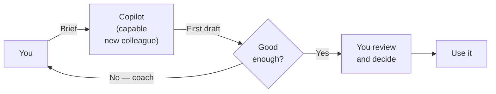
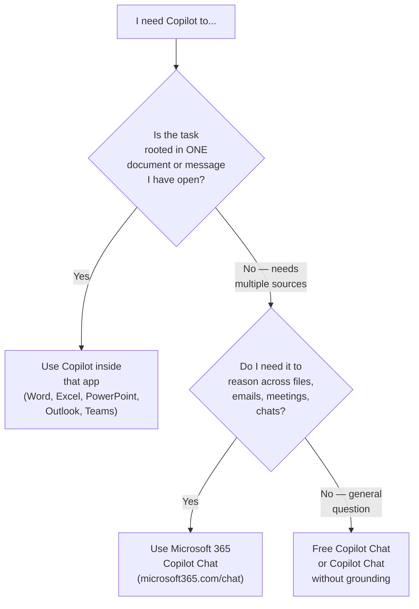

**Prompt engineering is just learning how to brief Microsoft 365 Copilot properly.** That's the whole skill. Not magic, not coding, not a course. A working brief.

I had to look this up three times before it clicked. Then I taught it to a recruitment team, a finance team, an operations team. Same four blocks every time. Same lightbulb moment. So this is the slow, plain-English version of the brief I wish someone had handed me on day one.

> 🏃 **TL;DR for skimmers**
>
> Microsoft 365 Copilot is a **capable new colleague on day one**. Strong at language, fast at drafting, knows nothing about your company until you tell it. Your job is the brief.
>
> Microsoft's official prompt framework is four blocks: **Goal** · **Context** · **Expectations** · **Source**. Add one habit on top: **iterate**. That's the whole skill.
>
> Start here: [Cheat Sheet](#cheat-sheet) · [4-block framework](#four-blocks) · [Per-app prompts](#apps) · [10 mistakes](#mistakes)

**Quick navigation:**

🚀 **Start here (10-min read):**

1. [Mental model — a capable new colleague](#mental-model)
2. [One working prompt — before & after](#first-prompt)
3. [The Cheat Sheet](#cheat-sheet)
4. [The 4-block framework](#four-blocks)
5. [The habit that makes the framework work — iterate](#iterate)

⭐ **Power moves (most underused):**

- [Build your prompt library — Prompt Gallery + saving prompts](#library)
- [Set-and-forget — scheduled prompts](#scheduled)

📚 **Deep dives:**

- [Where you can prompt — Chat vs the apps](#where)
- [The grounding unlock — slash commands and file pickers](#grounding)
- [Before you paste anything into Copilot](#privacy)
- [App-by-app quick wins](#apps) — [Chat](#app-chat) · [Word](#app-word) · [Excel](#app-excel) · [PowerPoint](#app-pp) · [Outlook](#app-outlook) · [Teams](#app-teams) · [OneNote](#app-onenote) · [Loop](#app-loop)
- [10 prompt mistakes to avoid](#mistakes)
- [The honest take — what Copilot won't do](#honest)
- [3 real scenarios](#scenarios) · [4-week practice plan](#practice) · [Where to next](#next)

🔄 **Living document.** Microsoft 365 Copilot ships changes monthly. The four-block framework and the underlying skills don't move — but a button position, a feature name, or a specific slash command may have shifted by the time you read this. Spotted something off? [Let me know](/feedback/) and I'll update.

## The 30-second mental model — a capable new colleague {#mental-model}

Picture this. You've just hired someone brilliant. First language is English, can read fast, can write in any tone, can find patterns in numbers, can summarise a 40-page document in two minutes. The catch: it's day one. They know nothing about your company, your team, your style, your customers, your filing system or your acronyms.

If you want a useful piece of work from them, you'd give them a proper brief. A specific task. Some background. What good looks like. The right documents to read. You'd review their first draft and ask for a second.

That's the whole job of a prompt. A prompt is a brief for a capable new colleague who knows nothing about your world.

Hold that picture. The rest of this guide just unpacks it.

Notice what Copilot does **not** do in that diagram. It doesn't decide. It doesn't publish. It doesn't email customers on your behalf without you seeing it. You stay in the loop because you're the human and you have the judgment. Copilot does the typing and the structuring — fast.

This is the whole reason "AI replaces jobs" is the wrong frame. AI replaces the typing. Judgment is still the job.

## One working prompt — before and after {#first-prompt}

Before we go deep on theory, let's prove the skill exists. Here are two prompts asking for the same thing. Try them in your Copilot Chat right now if you have it.

> ❌ **Before (vague):**
>
> *"Write me something about the project."*

You'll get something. Probably a generic 200 words about "the project" that could apply to any project anywhere. Not useful.

> ✅ **After (briefed properly):**
>
> *"Draft a 200-word status update for the customer migration project, aimed at the steering committee. Use the meeting recap from yesterday and the risk log from last week. Lead with the three biggest risks, then this week's wins, then next week's asks. Plain English, no jargon, no marketing tone."*

Now you'll get something useful on the first try. Notice what changed:

- **Goal:** Draft a 200-word status update
- **Context:** Customer migration project, steering committee audience
- **Expectations:** Lead with risks, then wins, then asks. Plain English, no jargon.
- **Source:** The meeting recap from yesterday + the risk log from last week

Four blocks. Microsoft calls them **Goal**, **Context**, **Expectations**, **Source**. Those are the bones of every good prompt. The rest of this guide is detail.

## The Cheat Sheet {#cheat-sheet}

If you only screenshot one thing, screenshot this. Yes, print it. Stick it next to your monitor. Past-me would have saved hours.

### The 4-block prompt recipe

| Block | Plain-English question | Example |
|---|---|---|
| **Goal** | What do you want Copilot to do? | "Draft an interview guide for…" |
| **Context** | What does Copilot need to know? | "…a senior data engineer role at a regulated bank…" |
| **Expectations** | What does good look like? | "…6 behavioural questions, 4 technical questions, no leading language…" |
| **Source** | Where should it ground its answer? | "…using /Senior DE Job Description and /Interview rubric." |

### The habit on top: **iterate**

Treat the first answer as a draft. Coach Copilot with one sentence at a time:

- *"Shorter. Cut to 6 bullets."*
- *"Less marketing tone. Plainer."*
- *"Use the names from the source document."*
- *"Remove anything you can't ground in /Source File."*

### Slash-command grounding (when your Copilot supports it)

| You type | What it does |
|---|---|
| `/file name` | Grounds the answer in that file |
| `/person name` | Adds what's known about that person |
| `/meeting name` | Pulls in that meeting's recap |
| `/email subject` | Pulls in that email thread |

If slash auto-complete doesn't appear, use the **file picker** / **Add files** button in the chat composer — that's the proper fallback for grounding. Pasting a filename into the prompt does **not** ground; pasting the actual content works for one-shot tasks but isn't equivalent to a real source reference.

### App-by-app one-liner

| App | One thing to try first |
|---|---|
| **Copilot Chat** | "Catch me up on /[project name] across emails, files, and Teams" |
| **Word** | "Draft a one-page brief based on /[long document]" |
| **Excel** | "Find the three biggest variances in this sheet and explain them" |
| **PowerPoint** | "Turn /[Word doc] into a 6-slide deck for [audience]" |
| **Outlook** | "Reply saying yes, propose Thursday, keep it warm" |
| **Teams** | "Recap this meeting in 5 bullets and list the action items by owner" |
| **OneNote** | "Summarise my notes from this notebook into key decisions" |
| **Loop** | "Draft a project kickoff page with goals, owners, and milestones" |

### 5 rules that fix 90% of bad prompts

1. **Be specific.** "Write something" gets you anything. "Draft a 150-word email" gets you that email.
2. **Tell Copilot the audience.** A steering committee reads differently to a customer.
3. **Name the format.** Bullets, table, paragraph, slide outline — say which.
4. **Ground it.** Point at the real file. Don't make Copilot guess your facts.
5. **Iterate.** First answer is a draft. The second one is usually the good one.

### Safety strip — three rules that go on every prompt

**Right Copilot for the data** · **Ground it in a real source** · **You review before it goes out.**

The full version of these three lives in the [Before you paste anything](#privacy) section below. Read it before your first real prompt.

## The 4-block framework — Goal · Context · Expectations · Source {#four-blocks}

This is Microsoft's official framework. You'll see it in [Microsoft Learn](https://learn.microsoft.com/en-us/training/modules/write-effective-prompts-do-more-prompting/) and in the [Microsoft 365 Copilot support pages](https://support.microsoft.com/en-us/microsoft-365-copilot/get-started-writing-prompts-in-microsoft-365-copilot). Four blocks, one habit.

### Block 1 — Goal

The task. The verb. What you want done.

- "Summarise…"
- "Draft…"
- "Compare…"
- "Find…"
- "Reword…"
- "Translate…"
- "Explain…"
- "Organise…"

> ❌ "Help me with the customer email."  
> ✅ "**Draft a reply** to the customer email."

The first is a wish. The second is a task. Copilot answers tasks well.

### Block 2 — Context

What does Copilot need to know about the situation? Who is the audience? What's already true? Why is this happening?

- Audience: *"…for a steering committee that hasn't been close to the detail."*
- Background: *"…the customer escalated last Friday and we missed the SLA."*
- Tone: *"…warm but factual — not defensive."*
- Constraints: *"…we cannot offer a refund."*

Context is the section most people skip. It's also where the biggest quality jump lives. Vague context = generic answer. Specific context = answer that sounds like you.

### Block 3 — Expectations

What does "good" look like? This is the section that turns a wall of text into a deliverable.

- **Length:** "in 150 words", "in 5 bullets", "as a one-page brief", "as a 6-slide outline"
- **Format:** "as a table with columns Risk · Likelihood · Owner · Next step"
- **Tone:** "plain English, no jargon, no marketing voice"
- **Style:** "in my normal email tone — see the example below"
- **Limits:** "don't speculate beyond what's in the source documents", "don't rank candidates", "flag anything missing"

If you don't say what good looks like, Copilot picks a default. The default is rarely what you wanted.

### Block 4 — Source

Which documents, emails, meetings, or chats should Copilot use?

- **Files** in SharePoint or OneDrive (use the file picker or `/file name`)
- **Emails** in your mailbox (in supported experiences, with grounding enabled)
- **Meeting recaps** from Teams (the meeting must have a recap)
- **Teams chats** in supported experiences
- **Public web pages** (when web grounding is enabled and the URL is supported)

Without a Source, Copilot writes from general knowledge. That's fine for a brainstorm. It's not fine when the answer needs to reflect *your* customer, *your* policy, *your* numbers. Most "Copilot got it wrong" stories I hear are actually "Copilot wasn't given the source".

A grounded prompt looks like this:

> *"Using /Q3 forecast and the last three /Weekly business review meetings, summarise the three biggest revenue risks for the steering committee. 150 words, plain English, no jargon."*

Four blocks. Goal, Context, Expectations, Source. Once you've written ten of these you'll never go back to vague prompting.

### Output-format priming — be explicit about the shape

The Expectations block becomes much more useful when you describe the **exact shape** of the output, not just the length. Most readers stop at *"in 150 words"* — but you can prime the format precisely:

> *"Output as a markdown table with columns Risk · Likelihood · Impact · Owner · Next step. Then a 2-sentence summary below the table. Then a numbered list of 3 follow-up questions."*

That single sentence saves you 2-3 iterations. Other format primers worth knowing:

| When you want… | Try this in Expectations |
|---|---|
| A scannable comparison | "Output as a table with rows X, Y, Z and columns A, B, C" |
| An exec-ready brief | "One page. Heading · 3-bullet TL;DR · 2-paragraph body · 3 next steps" |
| A working draft to send | "Email format. Subject line · 100-word body · clear ask in the final sentence" |
| Something to paste into a deck | "6-slide outline. Each slide: title · 3 bullets · 1-sentence talk track underneath" |
| Structured data to analyse | "CSV-format output with header row. No commentary outside the CSV." |
| A staged 3-step analysis | "Output in 3 numbered sections: (1) facts only, (2) hypothesised drivers (marked as hypotheses), (3) executive narrative." |

Format priming costs you 10 seconds in the prompt. It saves you 5 minutes of cleanup after.

### Other framings you might see

GCES (Goal · Context · Expectations · Source) is Microsoft's official framework — the spine of this guide. You'll see other framings on LinkedIn, YouTube, and other AI tools. They're not wrong, they're just different containers for the same ideas. Here's how the popular ones compare:

| Framing | Where you'll see it | When it helps |
|---|---|---|
| **GCES** — Goal · Context · Expectations · Source | Microsoft official; this guide | Default for M365 Copilot work |
| **CRAFT** — Context · Role · Audience · Format · Task | Marketing / writing AI communities | When *audience* is the trickiest variable in your task |
| **STAR** — Situation · Task · Action · Result | Interview preparation | For drafting interview answers, performance stories, or behavioural-style content |
| **Role-Task-Format-Tone** | Common with consumer ChatGPT / Anthropic users | When you're using a non-M365 AI tool and need a quick mental model |

Pick the one that fits your task. The blocks are interchangeable in spirit — the discipline of writing all of them down is what matters, not the acronym.

### How the 4 blocks map to the deeper techniques

The [Prompt Engineering Guide](/prompt-guide/) on this site teaches 8 techniques in more depth. Those techniques aren't replaced by the 4-block framework — they're **what each block looks like in practice**.

| Deeper technique (from /prompt-guide/) | Fits inside the block |
|---|---|
| [Give clear instructions](/prompt-guide/give-clear-instructions/) | **Goal** |
| [Set a role](/prompt-guide/set-a-role/) | **Context** (often) or **Expectations** (sometimes) |
| [Add context](/prompt-guide/add-context/) | **Context** |
| [Give examples](/prompt-guide/give-examples/) | **Context** or **Expectations** |
| [Define the format](/prompt-guide/define-the-format/) | **Expectations** |
| [Set constraints](/prompt-guide/set-constraints/) | **Expectations** |
| [Specify audience and tone](/prompt-guide/specify-audience-and-tone/) | **Context** + **Expectations** |
| [Think step by step](/prompt-guide/think-step-by-step/) | **Expectations** + iteration |

The 4-block framework is the container. The 8 techniques are how you fill each container with precision.

## The habit that makes the framework work — iterate {#iterate}

The four blocks get you a good first draft. **Iteration** gets you the answer you actually wanted.

Iteration is not a fifth block. It's a habit. After Copilot answers, you stay in the chat and coach it one sentence at a time. The brilliant new colleague analogy keeps holding — you wouldn't expect a real new hire to nail it first try either.

A few patterns that work:

- *"Shorter — cut to 5 bullets."*
- *"Plainer — drop the marketing words."*
- *"Use the names and numbers from /Source File, not generic placeholders."*
- *"Give me the options with pros and cons — don't just hedge, but stay grounded in the source."*
- *"Remove anything that isn't grounded in the source documents."*
- *"Now turn this into a slide outline."*
- *"Now write a 2-line summary suitable for an exec preview."*

> 💡 **Tip from a few hundred sessions:** the answer you wanted is almost always the **third** answer. First is generic. Second is closer but over-polished. Third is the one. Plan for three rounds — it's faster than starting from scratch.

If iteration isn't getting you there, the original brief was probably under-specified. Open a new chat and rewrite the prompt with more in the Context and Expectations blocks.

### Advanced: few-shot prompting — give Copilot examples

The single biggest quality jump after the 4-block framework is **showing Copilot what good looks like before asking**. Paste 2-3 examples of the output you want, then ask for the new task in the same shape.

How it looks in practice:

> *"Here are three of my past customer follow-up emails. Match this tone, length, and structure for the next one.*
> *[Example 1 pasted in]*
> *[Example 2 pasted in]*
> *[Example 3 pasted in]*
> *Now draft a follow-up to /Customer ABC about the migration delay. 120 words. Same warm tone, same closing style."*

This is the technique that turns Copilot from "generic AI assistant" to *your* AI assistant. Useful for: drafting emails in your voice, writing meeting recaps in your team's style, generating reports matching your existing template, customer communications matching brand voice.

The mental model: a new hire shadows you for a day before drafting on your behalf. Few-shot prompting is that shadow day, compressed into three pasted examples.

### Advanced: self-critique — let Copilot grade its own answer

After Copilot answers, ask it to critique its own response. This catches things you'd otherwise miss:

> *"Now review your own answer. What did you miss? What's unsupported by the source documents? Where might a reader push back?"*

Then follow up with:

> *"Now rewrite the answer addressing those points."*

This single move catches the bulk of soft hallucinations and weak claims. Costs you 30 seconds. If you adopt one advanced technique from this guide, make it this one.

### The iteration script library

After enough rounds with Copilot, you end up with the same follow-up phrases on repeat. Bookmark these — they work in every app, every role, every surface.

| When the first answer is... | Try saying... |
|---|---|
| Too long | "Cut to 6 bullets" or "100 words max" |
| Too generic | "Use the names, dates, and numbers from /[Source File], not placeholders" |
| Too marketing-y | "Plain English. Drop the marketing words." |
| Too hedge-y | "Give me options with pros and cons. Stay grounded in the source." |
| Wrong format | "Now turn this into [table / slide outline / email / brief]" |
| Misses something | "What did you miss? Now rewrite addressing it." |
| Wrong audience | "Now rewrite for [audience]. Plain English." |
| Wrong tone | "Warmer." / "More skeptical." / "More direct." |
| Over-confident | "Where are you uncertain? Mark uncertainty inline." |
| Need alternatives | "Now give me 3 versions with different angles." |
| Need a counter-view | "Now critique this from the opposite POV." |
| Need translation | "Now translate to [language]." or "Re-target for [audience]." |
| Lacks evidence | "Cite the specific paragraph from /[Source File] for each claim." |

> 💡 **Tip:** print or screenshot this table. Stick it next to your monitor. After a week, you'll know which 4-5 lines you use daily — that's your personal core.

## Build your prompt library — Prompt Gallery + saving prompts {#library}

Once you have a great prompt, you shouldn't have to rewrite it from scratch next time. Microsoft 365 Copilot has **two built-in ways** to build your personal library — and most users miss both.

### Microsoft's Prompt Gallery — the curated starting library

Inside Microsoft 365 Copilot Chat, there's a **Prompt Gallery** with hundreds of pre-written, role-aware prompts curated by Microsoft. Browse by app, task, or role. Click one to use it. Modify to fit your context.

Where to find it:

- **Inside M365 Copilot Chat** — click the prompt icon in the composer, or look for "View prompts" / "Browse prompts" links near the input box.
- **Microsoft Copilot Lab** at **adoption.microsoft.com/copilot-lab** — the public-facing version with prompts organised by app, role, and task type.

When to use it:

- You're stuck on a blank chat — browse to find a prompt close to what you need.
- You're new to Copilot — the gallery teaches what good prompts look like by example.
- You want to discover capabilities you didn't know existed (image generation prompts, code prompts, data analysis prompts, etc.).

### Save your own prompts

When you craft a prompt that works really well — usually after iterating two or three times — **save it**. The third version of a prompt is almost always 10× better than the first. Saving means you start from "good" tomorrow, not from blank.

In Microsoft 365 Copilot Chat:

- Look for the **pin / save / star icon** beside a prompt or chat message — that bookmarks it for re-use.
- Use the **"Save prompt"** action where it appears in the chat surface.
- For frequently-used prompts, the **prompt history** lets you scroll back to anything you've sent recently.

Where saved prompts live varies by surface. Some are tenant-private (synced to your M365 account). Some are visible only on the device. Check with your IT admin if you can't see saved prompts across devices.

### Build a personal library on your own terms

For prompts that matter more than chat history alone can preserve, build an external library:

- Keep a **OneNote section** or **Loop page** called *"My Copilot Prompts"*
- Save each working prompt with a 2-line note on context + when to use it
- Tag by app or task ("Outlook · weekly digest", "Excel · variance commentary")
- Review weekly — promote the best ones to a shared Loop page or Teams channel for your team

> 📎 **The shift:** prompting moves from *"what should I type?"* to *"let me grab the one that worked last time and tweak it."* That's the muscle that compounds. Most people who plateau on Copilot have not built this library.

## Set-and-forget — scheduled prompts {#scheduled}

The most underused feature in Microsoft 365 Copilot. You can schedule a prompt to run on a **recurring basis** — daily, weekly, monthly — and have the output delivered to you automatically. No clicks needed at the scheduled time.

### What it looks like in practice

Imagine: every Monday at 7am, before standup, Copilot has already:

1. Read your last 7 days of emails, meetings, and Teams chats
2. Summarised by `/project`
3. Flagged anything that needs your reply today
4. Delivered the digest to your inbox

The 30-minute morning catch-up that used to start your week now happens while you make coffee. Set it once. Read it forever.

### How to schedule a prompt

The scheduling pattern in Microsoft 365 Copilot Chat (exact UI evolves):

1. **Craft a prompt that works** on real data — use the 4-block framework. Iterate until the output is what you actually want.
2. **Test it on a few different days' worth of data** so you know it holds up across normal variation.
3. **Open the scheduling option** — look for a **clock / schedule icon** in the composer, or the **"Schedule"** action under saved prompts. Availability varies by surface and tenant configuration.
4. **Pick a cadence** — daily / weekly / monthly / custom.
5. **Pick delivery** — chat (default), Outlook email, Teams DM, depending on what your tenant supports.
6. **Save and forget.**

For deeper schedule logic — multiple steps, conditional outputs, or sharing across a team — that's where **Agent Builder scheduled agents** come in. Covered in the [Agent Builder Field Guide](/blog/m365-agent-builder-explained/).

### Scheduled prompts per persona — high-ROI examples

Copy these. Adapt for your tenant. Each one is a small recurring win that compounds across a quarter.

| Role | What it does | Cadence |
|---|---|---|
| **Everyone** | "Read my unread emails. Group by sender priority — manager, direct reports, peers, external, newsletters. One-line summary per email. Flag anything needing a reply today." | Daily, 8am |
| **Recruiter** | "Summarise candidate-stage movements over the last 7 days from /ATS export. Flag anyone stuck >5 days. List action owners." | Weekly, Friday 4pm |
| **Ops lead** | "Catch me up on /[major project] across emails, meetings, and Teams chats from last 7 days. Lead with decisions made, blockers, asks." | Weekly, Monday 7am |
| **Finance manager** | "Scan /Forecast model for material changes since last week. Flag anything >5% movement with hypothesised drivers (clearly labelled as hypotheses)." | Weekly, Friday 5pm |
| **IT admin** | "Summarise the past 7 days of /Service Health alerts. Group by service. Flag any recurring incident or pattern across users." | Weekly, Monday 8am |
| **Sales lead** | "Summarise pipeline movements from /CRM export over the past 7 days. Flag deals at risk. List my asks for my manager." | Weekly, Friday 4pm |
| **Manager** | "From the last week's 1:1 notes for my direct reports (/1:1 notes folder), surface any recurring themes, blockers raised more than once, and people I haven't met with this week." | Weekly, Sunday 5pm |

### Why this matters

Scheduled prompts shift Copilot from "tool I open when I remember" to "AI that works for me even when I'm not at the keyboard". For most knowledge workers, this is the unlock that moves them from occasional Copilot use to daily-driver use.

Set up ONE scheduled prompt this week. It will change how you think about Copilot more than any other feature in this guide.

## Where you can prompt — Microsoft 365 Copilot Chat vs the apps {#where}

Copilot shows up in two flavours inside Microsoft 365: a **general chat surface** and **task-specific assistants inside each app**. The same brain, different doors.

The shortcut rule: **inside one file → use the app's Copilot. Across many sources → use Copilot Chat.** Everything else is a refinement of that rule.

Need to understand the licensing behind these surfaces? The [Copilot Pro vs Microsoft 365 Copilot guide](/blog/copilot-pro-vs-microsoft-365-copilot/) on this site covers it end-to-end.

### Two more surfaces worth knowing — Pages and Notebooks

Beyond Chat and the in-app Copilots, Microsoft 365 Copilot offers two **sustained-work surfaces** that most users miss:

- **Copilot Pages** — a collaborative AI canvas. Start with a Copilot Chat answer you like, click *"Edit in Pages"*, and the content opens in a shared, real-time-editable doc you can co-author with humans and Copilot together. Use it when: a chat answer is good but needs another iteration with a teammate. *"Send me the Page link and we'll riff."*
- **Copilot Notebooks** — multi-source workspaces. Pin several files, emails, and meetings into one notebook, then ask questions across the lot in one place. Use it when: a project has 5+ relevant sources and you'll come back to them across multiple sessions. *"Open the project Notebook, all the context is there."*

Both surfaces are best discovered hands-on — they shift Copilot from "one-shot chat" to "ongoing collaboration on a body of work".

### Beyond text — multi-modal and voice prompting

Copilot accepts more than typed text on most surfaces:

- **Paste an image** — a chart, a screenshot, a whiteboard photo, a UI mockup. Then ask Copilot what's in it, or to summarise, or to draft text from it. *"Paste a sales chart screenshot → 'what's the headline trend here, and what's the question I should be asking my team about it?'"*
- **Voice prompts** — in Teams meetings, on mobile, and increasingly in desktop Copilot, you can speak the prompt. Useful when typing slows you down or you're not at the keyboard. Voice + grounded files = "Copilot, using last week's leadership recap, draft me an update for the board" while driving.
- **Mixed in-line** — paste an image, type a follow-up question that references it. Copilot reasons across both.

Mode availability varies by surface and tenant — your Copilot may support image input but not voice, or both. When in doubt, just try.

## The grounding unlock — slash commands and file pickers {#grounding}

The biggest quality jump in your prompting is the day you stop relying on general knowledge and start grounding Copilot in your real work.

**Grounding** means pointing Copilot at the specific files, emails, meetings, or chats that should inform its answer. When your Copilot experience supports it, the easiest way to ground is the **slash command** — type `/` and start typing a name. Copilot will offer matching files, people, meetings, or emails.

A few patterns that pay off:

| Pattern | What it does |
|---|---|
| `/Project alpha brief` | Grounds Copilot in that specific document |
| `/Steering committee 12 May` | Pulls in that meeting's recap and decisions |
| `/email subject line` | Brings in an email thread (in supported experiences) |
| `/person name` | Surfaces what's known about that person from your org graph |

If your Copilot doesn't surface slash auto-complete, use the **file picker** in the chat composer instead — it does the same thing under the hood. The label might be "Add files", "Reference content", or a paperclip icon depending on which surface you're in.

> 📎 **Why this matters:** Without grounding, Copilot is writing from general knowledge plus whatever it remembers from the recent chat. That's fine for brainstorming and writing scaffolds. It is **not** fine when your answer needs to reflect a specific customer, policy, decision, or set of numbers. Most "Copilot hallucinated" stories I hear are really "Copilot wasn't given the source".

A grounded prompt for the same status-update task above looks like:

> *"Using /Customer migration weekly recap (the most recent three) and /Risk register, draft a 200-word status update for the steering committee. Lead with the three biggest risks, then this week's wins, then next week's asks. Plain English, no jargon."*

Same four blocks. Now Copilot is reading **your** recaps and **your** risk register — not generic project-management filler.

> 🚨 **Heads-up — slash availability varies.** Slash-command coverage depends on which Copilot surface you're in, your tenant's connectors, the file's index status, and whether the source is supported on that surface. If `/filename` doesn't auto-complete, use the **file picker** or **Add files** button in the chat composer — that's the proper grounding fallback. Pasting a filename as plain text into the prompt does NOT ground; pasting the file's actual content works for a one-shot prompt but isn't equivalent to a real source reference.

## Before you paste anything into Copilot {#privacy}

A short, important section that comes BEFORE the app-by-app tips — because the cleanest way to learn is to start with the right Copilot for the right data, not patch it later.

**1. Use the right Copilot for the data.** Work data → your organisation's Microsoft 365 Copilot (the licensed enterprise version). Personal data → Copilot Pro or the free consumer chat. **Never paste customer data, candidate PII, internal financials, or anything regulated into a consumer AI tool.**

**2. Respect existing permissions.** Copilot only sees what you can already see. That includes things you can see but probably shouldn't — over-permissioned SharePoint folders, an old shared drive, a Teams channel you joined for one meeting two years ago. Before you ground Copilot in something sensitive, check who has access to the source.

**3. Validate before you publish.** Copilot drafts. You publish. Always check facts, names, numbers, dates, customer identifiers, and especially anything regulated. Treat the first answer the way you'd treat a confident new hire's first draft — useful but in need of a once-over.

> 📎 **One more.** If you're unsure whether your Copilot is the licensed enterprise version, check inside the chat surface itself — look for "Microsoft 365 Copilot" branding, the Work tab, or an admin-approved indicator. A work account is **necessary but not sufficient** for tenant-data grounding; you also need to be in a licensed Microsoft 365 Copilot experience (or an approved work-grounded Copilot Chat surface) — not the free consumer chat. When in doubt, ask IT.

## App-by-app quick wins {#apps}

The four blocks apply everywhere. But each app has a handful of prompts that pay off immediately. Here are the ones I keep coming back to.

### Copilot Chat (microsoft365.com/chat) {#app-chat}

The most versatile surface. Best for reasoning across files, emails, meetings, and Teams chats — anywhere you'd otherwise be opening five tabs and copy-pasting between them.

Three prompts to try first:

> 1. *"Catch me up on /[project name] across the last two weeks — emails, meetings, and Teams chats. What changed, who decided what, what's blocked? 200 words, plain English, bullet points."*

> 2. *"Summarise the three biggest themes from /[meeting series name] over the last month. Highlight any decisions, action owners, and unresolved questions."*

> 3. *"Find any email or chat from /[person name] where they raised a concern about [topic]. Quote the relevant sentence and give me the link."*

Copilot Chat is also the right surface for cross-app drafting: *"Draft a one-pager based on /Brief doc, then turn it into a 5-slide outline and an exec email summary."*

### Word — drafting, rewriting, structuring {#app-word}

Word's Copilot lives inside the document. Best for everything that ends in a finished document: briefs, reports, policies, FAQs.

Three prompts to try first:

> 1. *"Draft a one-page project brief based on /Discovery notes. Sections: Goal, Approach, Risks, Milestones, Asks. Plain English, no marketing tone."*

> 2. *"Rewrite this paragraph in a warmer, more confident tone. Keep the facts unchanged."*

> 3. *"Turn this long document into a 200-word executive summary, then list the open questions at the end."*

Word Copilot is also the easiest place to learn the iteration habit — you can see exactly what changed and revert if you don't like it.

### Excel — analyse, formulas, insights {#app-excel}

Excel's Copilot is best for the question *"what does this data actually say?"* — not yet ideal for very large or messy datasets, but excellent for cleaned-up tables.

Three prompts to try first:

> 1. *"Find the three biggest variances between forecast and actuals in this sheet. Explain each in one sentence and propose a likely driver."*

> 2. *"Generate the formula to count unique customers who appear in column B but not column F."*

> 3. *"Build a chart showing monthly trend by region for column G. Pick the chart type that best fits this data."*

For very messy data, do a cleaning pass in Copilot Chat first — paste a sample, ask *"what formatting inconsistencies should I fix before analysing this?"* — then bring it back into Excel.

### PowerPoint — turn content into slides, redesign, simplify {#app-pp}

PowerPoint's Copilot is the fastest way to get from "I have a long document" to "I have a draft deck". The first draft will not be perfect. That's fine — it'll be 80% there and your iteration habit takes you the rest of the way.

Three prompts to try first:

> 1. *"Create a 6-slide presentation from /Project brief. Audience is the steering committee. Title slide, 4 content slides covering Goal · Approach · Risks · Asks, and a closing slide with next steps."*

> 2. *"Redesign this slide to be cleaner and more readable. Reduce the text and use a clearer structure."*

> 3. *"Make this slide simpler — cut the bullets to 3, larger font, plain English."*

The key with PowerPoint is to start from a Source. Empty-PowerPoint prompts give you generic decks. Document-grounded prompts give you your deck.

### Outlook — summarise, reply, schedule {#app-outlook}

Outlook's Copilot is where the daily wins live. Most people I've taught feel the time savings on email triage and drafting within a week.

Three prompts to try first:

> 1. *"Summarise this long thread in 4 bullets. What was decided, what's open, who owns what next?"*

> 2. *"Reply saying I'll attend, propose Thursday afternoon as an alternative, and keep the tone warm."*

> 3. *"Draft a polite follow-up to this email — no response in 10 days, soft deadline of next Friday, professional but not pushy. 100 words."*

The single biggest unlock here is the iteration habit. First reply too formal? Just say *"warmer"*. Too long? *"Cut to 60 words"*. Done in 15 seconds.

### Teams — recaps, action items, meeting prep {#app-teams}

Teams Copilot does two things really well: **meeting recaps after** and **meeting prep before**.

Three prompts to try first:

> 1. *"Recap this meeting in 5 bullets. List the action items by owner. Flag any decisions made and any open questions."*

> 2. *"What did I miss from /[meeting name] last Tuesday? Focus on decisions and anything I'm now responsible for."*

> 3. *"Help me prepare for a 30-minute meeting with /[person] tomorrow. Pull recent emails, chats, and shared files. What's on their mind and what should I ask?"*

The third one is a quiet superpower. Used well, it makes every internal meeting more focused.

### OneNote — summarise, organise, find {#app-onenote}

If you take notes by hand or paste-and-pray into OneNote, Copilot turns it into something useful.

Three prompts to try first:

> 1. *"Summarise my notes from this notebook into key decisions, action items, and unresolved questions."*

> 2. *"Find the meeting where we agreed on the migration date. Quote the relevant note."*

> 3. *"Turn these scattered notes into a one-page brief organised by Goal, Approach, Risks, Next steps."*

### Loop — collaborate, plan, structure {#app-loop}

Loop is where Copilot helps you start a shared workspace cleanly — kickoff pages, planning grids, joint notes.

Three prompts to try first:

> 1. *"Draft a project kickoff page with sections for Goal, Owners, Milestones, Risks, and an open-questions log."*

> 2. *"Turn this brainstorm into a structured planning grid — columns for Idea, Owner, Effort, Impact, Next step."*

> 3. *"Suggest a meeting agenda for the kickoff based on this kickoff page."*

## 10 prompt mistakes to avoid {#mistakes}

These are the ones I see most often. None of them are technical. All of them are habits.

**1. Vague verbs.** *"Help me with the report."* Use a real verb — draft, summarise, compare, find.

**2. No audience.** A customer reads differently to a steering committee reads differently to your mum. Say which.

**3. No format.** "Bullet points", "table", "200 words", "slide outline". Pick one. Default formats are rarely what you wanted.

**4. No source.** If the answer needs your facts, you need to give Copilot the source. Otherwise you'll get generic.

**5. Quitting after the first answer.** The first answer is a draft. Coach it. The third answer is usually the keeper.

**6. Pasting sensitive data into the wrong Copilot.** Never paste customer or candidate PII into a consumer AI tool. Use your organisation's enterprise Copilot or don't paste at all.

**7. Asking Copilot to decide.** Hiring, performance, financial decisions, customer-facing approvals — these stay with humans. Use Copilot to summarise and structure. Use yourself to decide.

**8. Treating output as truth without checking.** Names, dates, numbers, citations. Copilot will sometimes invent things that look plausible. Validate before you publish.

**9. Over-engineering the prompt.** A specific 30-word prompt beats a 200-word prompt with elaborate role-play. Be specific, not fancy.

**10. Forgetting the iteration habit.** If the first answer wasn't right, that's not a bug — that's the workflow. Coach Copilot. Don't start over.

## The honest take — what Copilot won't do for you {#honest}

Worth saying clearly, because the marketing softens it.

- **Copilot will not make decisions for you.** It will draft, summarise, compare, structure. Hiring outcomes, performance ratings, financial commitments, customer commitments — those are yours.
- **Copilot will not learn your company without grounding.** Without `/file` and the file picker, it's writing from general knowledge.
- **Copilot will sometimes be wrong.** Language models hallucinate. The mitigation is grounding + validation, not blind trust.
- **Copilot will not replace judgment.** It will free up the time you used to spend typing, so you can spend more time on the judgment work.
- **Copilot is not the same in every surface.** Consumer Copilot, Copilot Pro, and Microsoft 365 Copilot are three different products with different data access and different governance. [The licensing guide](/blog/copilot-pro-vs-microsoft-365-copilot/) covers this in detail.

If those four things stay true in your head, you'll get a lot of value from Copilot without any of the surprises.

## Three real scenarios {#scenarios}

The framework is one thing. Watching it in action is another. Three short scenarios — names changed.

### "Mei the recruiter, drowning in CVs"

> **Situation:** Mei is a senior recruiter at a 2,000-person company. 80 applicants for a senior data engineer role. She has two days to give the hiring manager a structured longlist.

She doesn't ask Copilot to rank candidates — that decision stays with her and the hiring manager. She uses Copilot to **summarise each CV against the role criteria**, in a consistent shape. One prompt, applied to each CV individually:

> *"Using /Senior DE Job Description, summarise this CV against the essential criteria only. Output a table: Criterion · Evidence in CV · Missing or unclear. Do not rank. Do not recommend. Flag where evidence is missing."*

Now Mei has 80 consistent summaries. She reads through them faster. The decisions are still hers — but the typing isn't.

She'll also use prompts for **inclusive job advert drafting**, **interview guide creation**, and **candidate communication** — covered in detail in the [Recruiters & HR field guide](/blog/microsoft-365-copilot-for-recruiters-and-hr/).

### "Priya the ops lead, weekly business review prep"

> **Situation:** Priya runs a 12-person operations team. Every Tuesday she presents to her director: what shipped, what slipped, what's at risk. It used to take her Sunday afternoon.

She grounds Copilot Chat in three weeks of meeting recaps, the team's Loop planning page, and a Teams chat: *"Using /WBR meetings (last three) and /Ops planning page and /Ops leads chat from the last 7 days, draft a 4-bullet weekly business review for my director. Lead with: shipped, slipped, at risk, asks. Plain English. No marketing tone."*

First draft is 80% there. She iterates a few times — shorter on the wins, more specific on the risks, swap one phrasing. The job that used to eat her Sunday afternoon is done before Monday's first coffee.

### "Tom the finance manager, variance commentary"

> **Situation:** Tom owns monthly variance commentary for his business unit. Forecast vs actuals, by category, with a one-paragraph "why" on each big variance. It's the most disliked task on his desk.

He grounds Copilot in his variance Excel: *"In this sheet, find the three biggest unfavourable variances and the two biggest favourable ones. For each, draft a one-sentence likely driver based on the row data. Do not speculate beyond what's in the sheet — flag if a driver isn't clear."*

He spends the saved time on the actual judgment call — which variances need exec attention, which need a deeper investigation, which are noise. The typing is gone; the thinking is still his.

## Your 4-week practice plan {#practice}

If you've got this far, you've got the theory. Now build the habit.

| Week | Do this |
|---|---|
| **1 — Outlook** | Use Copilot to summarise long email threads and draft three replies a day. Iterate on each reply at least once. By Friday, the iteration habit feels normal. |
| **2 — Word** | Draft one document a day grounded in a real source file. Use the 4-block framework explicitly — write Goal · Context · Expectations · Source in your prompt every time. |
| **3 — Excel + Teams** | Two simple Excel "what does this data say?" prompts a week + a recap after every Teams meeting. By end of week you'll feel the time savings. |
| **4 — Copilot Chat** | Move to cross-source prompts. *"Catch me up on /project across emails, files, meetings."* This is where the real productivity unlock is. |

> 💡 **Track what you save.** I genuinely recommend a one-line note at the end of each day in week 1-2: *"Today Copilot helped me on X — felt like it saved me real time."* By the end of two weeks you'll have your own evidence. Your mileage will vary, but the trend usually tells the story.

## Where to go next {#next}

You now have the framework, the per-app tips, the privacy guardrails, and a practice plan. A few places worth knowing about on this site:

- 📚 **[The Prompt Engineering Guide](/prompt-guide/)** — 8 deeper techniques (clear instructions, set a role, add context, define the format, give examples, set constraints, specify audience and tone, think step by step). Hands-on practice for each.
- 🧪 **[The Advanced Prompt Lab](/prompt-lab/)** — 12 expert techniques (Chain of Thought, Tree of Thought, Few-Shot, ReAct, Meta-Prompting, and more). For when the four blocks aren't enough.
- 📋 **[The Prompt Library](/prompts/)** — 500+ tested prompts organised by app and persona. Customisable starting points for almost any task.
- 🎯 **[The Prompt Polisher](/prompt-polisher/)** — paste your prompt, get a score and an improved version. Brutal but useful.
- 🧪 **[The Prompt Tester](/prompt-tester/)** — A/B test two prompts side by side to see which one Copilot likes better.

**Role-specific deep dives:**

- 🧑‍💼 **[Microsoft 365 Copilot — A Plain-English Playbook for 5 Personas](/blog/microsoft-365-copilot-by-persona-playbook/)** — the role-specific companion. Recruiters & HR · Operations · Finance · IT Admin · Sales & Marketing. Day-in-the-life workflows, worked prompts, persona-specific guardrails, and the safety patterns that matter in each role.

**Related licensing and architecture guides:**

- [Copilot Pro vs Microsoft 365 Copilot — Which Do You Need?](/blog/copilot-pro-vs-microsoft-365-copilot/)
- [How Microsoft 365 Copilot Works, Layer by Layer](/blog/how-microsoft-365-copilot-works-layer-by-layer/)
- [M365 Agent Builder — Plain-English Field Guide](/blog/m365-agent-builder-explained/)
- [22 Copilot features you should be using](/blog/20-copilot-features-you-should-be-using/)

---

✎ **One more thought.** The biggest mindset shift, the thing that made prompt engineering click for me, was treating Copilot as a capable new colleague rather than a search engine. Search engines reward keywords. Colleagues reward a clear brief. The four blocks are just the structure of a clear brief.

You don't need a course. You need the habit. Try the framework on your next email reply. Iterate once. Notice what changed. Do it again tomorrow. By the end of a week, prompting will feel as ordinary as writing.

— Sush

## FAQ {#faq}

The most common questions I get from people new to prompting Microsoft 365 Copilot.

