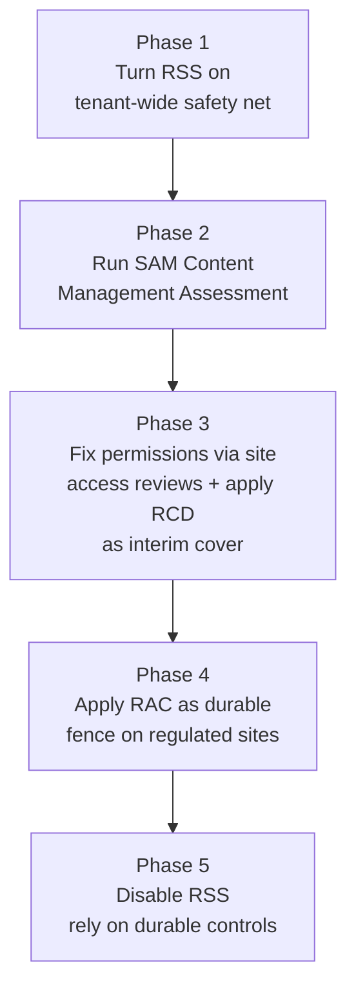

A CISO I met last month described their Copilot pilot like this: *"We turned it on for the leadership team. Within a week, someone summarised an internal HR document from a SharePoint site no one remembered existed. No breach, no policy violation — but the wrong people now knew about a redundancy plan."*

That's the conversation this post is for. Copilot doesn't bypass your permissions. It just makes existing oversharing instantly searchable in plain English.

Microsoft gives you four controls in SharePoint to handle this — an engine that maps your oversharing, and three "fences" you can apply once you know where to put them *(the [deployment checklist](/blog/microsoft-365-copilot-deployment-best-practices-ultimate-checklist/) shows where this fits in rollout).* The engine is SharePoint Advanced Management. The fences are RSS, RCD and RAC. By the end of this post you'll know which one to use when, what each one doesn't do, and the rollout sequence that actually works.

I'm a Copilot Solution Engineer at Microsoft NZ. The "wrong people now knew about a redundancy plan" story is anonymised but very real — and it's the most common Copilot rollout pause-and-restart pattern I see.

**Three patterns I keep seeing in real rollouts:**

1. **The Legal Green Light.** Legal initially blocks Copilot entirely citing discovery risk. After seeing the controls in this post — particularly RCD on legal sites and audit trails for Copilot interactions — they approve a controlled pilot.
2. **The False Sense of Safety.** *"We've had M365 for years, we're fine."* The first SAM scan shows the average employee has technical access to millions of files. Copilot becomes the trigger for the long-overdue data cleanup.
3. **The HR Wake-Up Call.** Like the CISO story above. No breach, no policy violation — but the rollout pauses while permissions get tidied.

The fix isn't to slow Copilot down. The fix is to use the four controls below in the right order so Copilot lands on a tidy library, not a chaotic one.

**Quick links:**

- [The mental model — a library, doors and a building survey](#mental-model)
- [TL;DR — the four controls in a sentence each](#tldr)
- [The engine first — SAM, DAG and the Content Management Assessment](#sam-engine)
- [RSS — the rope across the door](#rss)
- [RCD — making a site AI-invisible](#rcd)
- [RAC — the membership fence](#rac)
- [Container labels and sharing defaults](#defaults)
- [The "Everyone except external users" landmine](#eeeu)
- [How to actually roll this out](#rollout)
- [Microsoft's official blueprint](#blueprint)
- [What I'm not covering here](#not-covered)
- [Common mistakes I see admins make](#mistakes)
- [FAQ](#faq)

<div class="living-doc-banner">

🔄 **Living document. Verified May 2026.** Microsoft renames features, ships preview-to-GA, and updates licence bundles regularly — what you read here may differ from today's docs. For exact GA dates and PowerShell syntax, Microsoft Learn is the source of truth (links throughout). Spotted something stale? [Let me know](/feedback/) and I'll update.

</div>

---

## The Mental Model — A Library, Doors and a Building Survey {#mental-model}

Imagine your SharePoint tenant as a research library. There are thousands of rooms (sites), millions of books (files), and one front desk where readers ask questions. Copilot is a very fast, very polite librarian standing at that front desk.

By default, the librarian can walk into every room a reader has a key to, pull every book that reader is allowed to touch, and read the contents aloud in a clear summary. Most of the time that's wonderful. Some of the time — when the room labelled "Strategy 2018" still has the door propped open from a temporary project five years ago — it's a problem.

Microsoft gives you one engine and three fences to handle this:

**SAM = the building survey.** Before you put fences anywhere, somebody needs to walk the corridors and tell you which rooms have doors propped open, which have lost their owners, and which are accessed weekly by people who shouldn't have keys. That's what SharePoint Advanced Management, DAG reports, and the Content Management Assessment do. Without it, you're guessing.

**RSS = a rope across the front entrance.** The librarian is only allowed to walk into the rooms on a list you tape to the rope. Everything else is off limits — including rooms readers absolutely have keys to. It's a fast way to calm the building down while you decide which rooms actually need a real lock. Microsoft explicitly designs RSS as temporary.

**RCD = an "invisible" tag on a specific room.** The room is still there, members can still walk in directly, and Copilot can even help them with a book they have open inside the room. But when readers ask at the front desk, the librarian acts as if the room doesn't exist — *with one carve-out*: if a reader has touched a book from that room recently, or owns content in it, the librarian still remembers and can mention it. Sensitive sites that you want to keep accessible-but-quiet — HR archives, legal matters, board materials — are good candidates.

**RAC = a guard at the door of a specific room.** Only readers on a named list (a Microsoft 365 group or Entra security group) may enter, regardless of whether they have a key. Even sharing-link tricks don't help. This is real access control — the strongest oversharing fence Microsoft ships.

The library metaphor is mine — Microsoft's own docs use the "guardrails" framing. Use whichever lands with your audience. Engineers like RSS-RCD-RAC. CISOs prefer doors and fences.

---

## TL;DR — The Four Controls in One Sentence Each {#tldr}

| Control | What it does in one sentence | Scope | Changes permissions? |
|---|---|---|---|
| **SAM + DAG + CMA** | Finds the overshared sites and tells you which need a fence | Tenant-wide reporting | No |
| **RSS** | Temporarily limits Copilot to an allow-list of up to 100 sites | Tenant | No |
| **RCD** | Makes a specific site invisible to Copilot and tenant search | Per site | No |
| **RAC** | Blocks everyone outside a named group from opening the site at all | Per site | **Yes** |

**One sentence:** SAM tells you what's overshared. RSS is a temporary safety net. RCD hides a site from Copilot. RAC blocks access to a site entirely. They are not interchangeable.

Permissions hygiene is a multi-year journey for most organisations. The four controls above let you ship Copilot before you finish the journey — and ship it safely.

---

## The Engine First — SAM, DAG and the Content Management Assessment {#sam-engine}

Before any fence, you need to know which rooms have doors propped open. That's what SharePoint Advanced Management (SAM) does.

**The single most important thing to know:** If anyone in your tenant has a Microsoft 365 Copilot licence, SAM is unlocked for all SharePoint admins automatically. You don't buy it separately. It is also available as a standalone "SharePoint Advanced Management Plan 1" add-on for tenants without Copilot — see [Microsoft's licensing page](https://learn.microsoft.com/en-us/sharepoint/sharepoint-advanced-management-licensing) for current pricing — but the most common situation is "we already have it and didn't realise."

SAM unlocks four things that out-of-box SharePoint doesn't have:

### Data Access Governance (DAG) reports

DAG is a suite of reports in the SharePoint Admin Centre that surfaces site-level oversharing risk:

| Report | What it shows |
|---|---|
| **Everyone Except External Users** | Top 100 sites where content was shared with EEEU in the past 28 days |
| **Sharing links** | Sites with the most "Anyone" links, org-wide links, or specific-people links |
| **Site permissions baseline** | Full snapshot of org-wide access exposure across all SharePoint and OneDrive sites |
| **Site permissions for a user** | Every site a specific user can access — useful for VIP audits |
| **Sensitivity label snapshot** | Sites containing files with specific labels (requires E5) |

DAG is where you start. Don't try to "clean up SharePoint" centrally — you'll drown. Use DAG to prioritise.

### Content Management Assessment (CMA)

CMA is the newer SAM dashboard that consolidates DAG, lifecycle, and governance signals into a single Copilot-readiness scorecard. Microsoft explicitly recommends running it before turning on Copilot and re-running it every 30 days.

It's a manual scan (it doesn't run automatically), and Microsoft documents that the included reports can take **2 to 72 hours** depending on tenant size. The output is a prioritised list of sites that need attention — overshared, ownerless, stale, or all three.

📖 [Get ready for Copilot with SharePoint Advanced Management — Microsoft Learn](https://learn.microsoft.com/en-us/sharepoint/get-ready-copilot-sharepoint-advanced-management)

### Site access reviews

Once DAG has surfaced a risky site, you can delegate the actual remediation to the site owner without needing to give IT access to the files themselves. Site owners get a contextual notification ("this site is shared with EEEU; is that still required?") and can confirm or change the sharing settings. This is how you scale remediation past the first 10 sites.

> 💡 **The trap to avoid:** Some admins try to fix oversharing centrally from IT. With more than ~100 sites, this never works. Site access reviews exist specifically because the site owner is the only person who knows whether "EEEU access on /sites/strategy-2024" is still appropriate.

### Site lifecycle policies

Inactive site policies, ownerless-site policies, and site attestation policies all sit in SAM. They reduce the long tail of stale or orphaned sites that Copilot will otherwise happily index. If a site hasn't been touched in 18 months and has no owner, it should not be feeding Copilot's responses.

A clean tenant isn't one where Copilot is blocked from things — it's one where there isn't much pointless stuff for Copilot to look at in the first place.

---

## RSS — The Rope Across the Door {#rss}

**Restricted SharePoint Search (RSS)** is a tenant-wide setting that limits Microsoft Search and Copilot grounding to an allow-list of up to 100 SharePoint sites.

When RSS is on, Copilot Chat and Copilot agents ground only on:
- Sites you've added to the allow-list
- The user's own OneDrive content, plus chats, emails and calendars they have access to
- Files from the user's **frequently visited** SharePoint sites
- Files the user has been directly shared
- Files the user has viewed, edited or created

> 💡 **Watch the 2,000 cap.** The total of the last three categories above (frequently visited + directly shared + viewed/edited/created) is capped at the **last 2,000 entities per user**. A site that's not on the allow-list but is frequently visited by a particular user can still surface for that user — RSS reduces ambient discovery, it doesn't fence each individual user.

Everything else in SharePoint is excluded from Copilot for users who haven't recently touched it.

### When to use RSS

Microsoft's own documentation calls RSS a *short-term* control. It's the rope you put across the door on day zero so Copilot doesn't surprise anyone while you do the SAM audit and start fixing permissions. RSS is a triage tool, not a long-term governance answer.

### The 100-site cap

There's a hard ceiling of 100 sites on the allow-list. **Hub sites count as one entry**, and their associated child sites inherit RSS without consuming additional slots — so if your information architecture is hub-aligned, 100 hub entries can cover thousands of child sites.

If you can't fit your business in 100 hub entries, RSS isn't the right tool. Skip to RCD or RAC.

### How to enable it

There's no toggle in the SharePoint Admin Centre. RSS is PowerShell-only via the SharePoint Online Management Shell:

```
# Connect first
Connect-SPOService -Url https://<tenant>-admin.sharepoint.com

# Turn RSS on
Set-SPOTenantRestrictedSearchMode -Mode Enabled

# Add allow-list sites
Add-SPOTenantRestrictedSearchAllowedList -SitesList @(
  "https://<tenant>.sharepoint.com/sites/hr-public",
  "https://<tenant>.sharepoint.com/sites/it-public"
)

# Check status
Get-SPOTenantRestrictedSearchMode
```

Changes take effect within about an hour.

### The biggest gotcha

> ⚠️ **RSS is not a security boundary.** From Microsoft's own docs: *"Restricted SharePoint Search doesn't guarantee that only sites on the allowed list show up in search or Copilot."* If a user recently accessed a site, or was sent a file from it via Teams or Outlook, that content can still surface in Copilot's responses regardless of the allow-list. RSS reduces ambient discovery — it doesn't enforce access.

### When to turn RSS off

Microsoft recommends disabling RSS once permissions are cleaned up and RCD or RAC are in place on the genuinely sensitive sites. RSS is the only one of the three fences that is *meant* to be temporary.

📖 [Restricted SharePoint Search overview — Microsoft Learn](https://learn.microsoft.com/en-us/sharepoint/restricted-sharepoint-search) · [Admin scripts](https://learn.microsoft.com/en-us/sharepoint/restricted-sharepoint-search-admin-scripts)

---

## RCD — Making a Site AI-Invisible {#rcd}

**Restricted Content Discovery (RCD)** is a per-site toggle that excludes one specific SharePoint site from tenant-wide search and Copilot Chat grounding — while leaving the site fully accessible to its members.

It's the surgical opposite of RSS. RSS is an allow-list applied to the whole tenant. RCD is a denylist applied site by site.

### What RCD does and doesn't change

**RCD does:**
- Remove the site's content from Copilot Chat grounding for users who haven't recently interacted with it and don't own content there
- Remove the site's content from organisation-wide search (SharePoint home, Office.com, Bing)
- Remove the site's content from tenant-scope Copilot agent grounding

**RCD does NOT:**
- Change site permissions in any way
- Affect users who walk into the site directly — they still see everything they always saw
- Affect site-scoped search (searching inside the site itself still works)
- Affect Copilot "data-in-use" scenarios — if a user opens a Word file from an RCD site, *"Summarise this document"* still works inside Word
- Hide content from users who **own** files in the site or have **recently interacted** with them — content owners and recent visitors still see references in Copilot
- Affect Purview features (eDiscovery, auto-labelling, retention) — content stays in the index
- Apply to OneDrive (RCD is SharePoint sites only)

### When to use RCD

RCD is the right tool for sites you want to keep accessible-but-quiet:
- HR and personnel records
- Legal and contracts
- Board and executive materials
- M&A and strategy archives
- Any legacy site where the permissions are messy but you don't want to spend three months untangling

### How to configure it

SharePoint Admin Centre → Sites → Active sites → select site → Settings → "Restrict content from Microsoft 365 Copilot" toggle.

Or via PowerShell:

```
Set-SPOSite -Identity https://<tenant>.sharepoint.com/sites/hr-confidential `
            -RestrictContentOrgWideSearch $true
```

To delegate RCD to site admins (so site owners can mark their own sites):

```
Set-SPOTenant -DelegateRestrictedContentDiscoverabilityManagement $true
```

Site-admin delegation is documented and available — a useful improvement for organisations that want federated control rather than a central admin bottleneck.

### The biggest gotcha

> ⚠️ **Large sites propagate slowly.** Microsoft documents that for sites with more than 500,000 items, RCD propagation can take more than a week to fully take effect. Plan accordingly — RCD on a huge legacy site isn't an instant fix.

### When NOT to use RCD

Don't blanket-apply RCD to half your tenant. Microsoft explicitly warns that overuse degrades Copilot response quality: the model has less context to ground answers on, so users get vague or "I don't know" responses for legitimate queries. RCD is a scalpel, not a hammer.

📖 [Restricted Content Discovery — Microsoft Learn](https://learn.microsoft.com/en-us/sharepoint/restricted-content-discovery)

---

## RAC — The Membership Fence {#rac}

**Restricted Access Control (RAC)** is the only one of the three fences that actually changes access. It limits a SharePoint site to members of one or more named Entra security groups or Microsoft 365 groups — and blocks everyone else, regardless of existing permissions, sharing links, or historical access.

### What makes RAC different

Both RSS and RCD are *discovery* controls. They affect what Copilot can see. They don't stop a user who has a direct link from opening the file.

RAC stops the user. If you're not in the RAC group, you can't open the site or any file in it — full stop, regardless of how you got the link.

### What RAC does and doesn't change

**RAC does:**
- Block file access attempts for anyone not in the RAC group, regardless of existing permissions or sharing links
- Apply at file-open time (direct navigation, sharing links, click-through from search — all blocked)
- Support dynamic Entra security groups (attribute-based access)
- Support up to 10 groups per site

**RAC does NOT:**
- Suppress files from search results — users with direct file permissions can still see filenames in search and Copilot citations, they just can't open the files. The CISO-relevant nuance is that Copilot may still *mention* "Board minutes Q3 — access denied" rather than hide it entirely.
- Automatically grant access just by being in the group — users still need site/content permissions on top of group membership
- Cascade to shared or private Teams channel sites (those are separate; configure RAC on each)
- Apply to OneDrive in the same way (this section covers SharePoint site-level RAC; OneDrive has separate access restriction controls under SAM — out of scope for this post)

### The two-factor gotcha

> ⚠️ **Adding someone to the RAC group doesn't give them access.** From Microsoft's docs: *"Adding people to the RAC group doesn't automatically give users access to the site or content."* You need BOTH membership in the RAC group AND existing site/content permissions. Admins frequently expect group membership to be enough and are confused when users still can't open files. The simplest fix: use the RAC group as the only group with site permissions, so the two requirements collapse into one.

### When to use RAC

RAC is the right tool for high-value, defined-membership sites where you want a hard fence:
- Board and executive materials
- M&A data rooms
- Regulated workloads (financial reporting, clinical trial data)
- Anything where the audit question is *"who can technically open this?"* rather than *"who would Copilot mention this to?"*

### How to configure it

Tenant-level enable first:

```
Set-SPOTenant -EnableRestrictedAccessControl $true
```

Then per-site:

```
Set-SPOSite -Identity https://<tenant>.sharepoint.com/sites/board-materials `
            -RestrictedAccessControl $true
Set-SPOSite -Identity https://<tenant>.sharepoint.com/sites/board-materials `
            -AddRestrictedAccessControlGroups "GUID-of-board-members-group"
```

Or via the SharePoint Admin Centre: Policies → Access control → Site-level access restriction → enable, then per-site under Active sites → Settings.

📖 [Restricted Access Control — Microsoft Learn](https://learn.microsoft.com/en-us/sharepoint/restricted-access-control)

---

## Container Labels and Sharing Defaults {#defaults}

The three fences above are powerful, but they treat symptoms. The hygiene below treats causes.

### Container labels for SharePoint sites

Container labels (sometimes called "groups and sites" labels) are sensitivity labels that govern the *workspace settings* of a SharePoint site, Microsoft 365 group, or Team. The main settings relevant for oversharing are:

- Public vs private at the container level
- External sharing settings (block, allow guests, etc.)
- Access from unmanaged devices
- Authentication contexts (linking an existing Conditional Access policy to the container — the label doesn't create CA rules, it references one you've already configured in Entra)

Container labels expose more settings than the four above (private Teams discoverability, default sharing link type via PowerShell, shared channels control, default label for channel meetings) — but these four are the ones that bite on oversharing.

**The critical nuance:** A container label on a site does NOT label or encrypt the files inside it. A "Highly Confidential" site label controls how the *site* is configured — it doesn't make the documents inside automatically "Highly Confidential." Files need their own labels for item-level protection.

This trips up a lot of admins. Container labels are about workspace governance. Item-level labels are about content protection. You need both.

### Sharing-link defaults

The single biggest configuration change you can make before Copilot rollout is changing the default sharing link type from "Anyone with the link" to "Specific people."

SharePoint Admin Centre → Policies → Sharing → Default link type → **Specific people**.

Or via PowerShell (note: the value is `Direct` for "Specific people" — not `DirectLink`):

```
Set-SPOTenant -DefaultSharingLinkType Direct
Set-SPOTenant -RequireAnonymousLinksExpireInDays 30
```

> ⚠️ **Two different behaviours, often confused:**
> - **Changing the default link type** ("Anyone" → "Specific people") only affects *new* links created after the change. Existing "Anyone" links keep working.
> - **Changing the anonymous link expiry** (`-RequireAnonymousLinksExpireInDays`) may shorten the expiry on existing Anyone links if the new value is shorter than what was already set — verify behaviour in your own tenant before rolling out.
>
> Use the SAM Sharing Links DAG report to find the sites with the most legacy "Anyone" links and clean those up explicitly.

---

## The "Everyone Except External Users" Landmine {#eeeu}

If there's one thing in this post that will change your Copilot rollout the most, it's auditing for EEEU.

"Everyone except external users" (EEEU) is a built-in SharePoint group that includes every internal user in the tenant. It's the default group SharePoint suggests when a site owner clicks "share with my organisation." Five years of one-click sharing later, you have hundreds of sites where every employee can read everything.

When Copilot is turned on, EEEU oversharing isn't an academic concern — it's the most common source of *"why did Copilot show me that?"* moments.

**How to find it:**

- SAM DAG → "Everyone Except External Users activity" report → top 100 sites in past 28 days
- DSPM for AI weekly assessments
- Site permissions baseline snapshot

**How to fix it:**

1. Site access review to confirm whether EEEU is still required (most aren't)
2. Replace EEEU with appropriately-scoped security groups
3. Apply RCD as an interim shield while you fix the underlying permissions
4. Apply RAC if the site is genuinely sensitive

EEEU isn't a bug. It's a five-year accumulation of "share with everyone" being the easiest button. The first SAM scan will surprise even tenants that consider themselves well-governed.

---

## How to Actually Roll This Out {#rollout}

Here's the practical five-phase sequence — drawn from the Restricted SharePoint Search docs, the SAM "Get ready for Copilot" page, and the Secure and govern foundational deployment blueprint. Microsoft itself frames the bigger picture as three pillars (covered below) rather than five phases — but this is the implementation shape that maps cleanly to the controls in this post.



### Phase 1 — Turn RSS on (Days 0–7)

Goal: stop the bleed. RSS goes on tenant-wide before any Copilot licence is assigned. This buys you time. Pick 5–10 known-clean sites for the allow-list — Communications, IT support, public HR, the staff intranet. Nothing sensitive, nothing messy.

### Phase 2 — Run the SAM Content Management Assessment (Days 7–21)

Goal: know what you're dealing with. CMA gives you a prioritised list of overshared, ownerless, and stale sites. Don't try to fix everything. Pick the top 50 by impact. Re-run CMA every 30 days during the rollout.

### Phase 3 — Fix permissions via site access reviews, apply RCD as interim cover (Weeks 3–12)

Goal: remediate at scale without IT becoming the bottleneck. Use SAM site access reviews to delegate the EEEU and "Anyone link" cleanup to site owners. While owners are working through reviews, apply RCD as **interim cover** on the most sensitive sites — it stops Copilot from surfacing them during the cleanup window even before the underlying permissions are fixed. Track progress in the CMA dashboard.

### Phase 4 — Apply RAC as the durable fence where needed (Weeks 6–14)

Goal: durable membership-based access control on sites that truly require it.
- RAC on sites that should be membership-fenced regardless of historical sprawl (board materials, M&A, regulated data)
- Keep RCD applied to sites that should be invisible to Copilot but accessible to their members (HR, Legal, exec materials)

### Phase 5 — Disable RSS (Week 12+)

Goal: switch off the temporary safety net. RSS goes off once permissions are cleaned up, RCD and RAC are in place on the genuinely sensitive sites, and SAM lifecycle policies are running. From this point onward, you're relying on *durable* controls instead of an allow-list.

> 💡 **The pattern that works in practice:** Pilot Copilot with 5–10% of users during phases 1–3. Don't expand until phase 4 is largely complete. Don't disable RSS (phase 5) until at least one full CMA re-run shows the cleanup actually held.

---

## Microsoft's Official Blueprint {#blueprint}

Microsoft publishes **Secure and govern Microsoft 365 Copilot: Foundational deployment guidance** — a three-pillar framework that wraps everything in this post inside a broader governance model.

| Pillar | Activities | Where this post fits |
|---|---|---|
| **1. Remediate Oversharing** | DSPM + SAM CMA → apply RCD as interim cover → fix permissions → remove interim controls when clean | **This post sits inside Pillar 1** |
| **2. Set Up Guardrails** | Sharing defaults → RAC for business-critical → auto-labelling → DLP for Copilot → DSPM Activity Explorer | Container labels + sharing defaults from this post |
| **3. Meet Regulations** | Compliance Manager → retention policies → lifecycle policies | Out of scope here |

**Useful Microsoft shortlinks:**
- Blueprint PDF: [aka.ms/Copilot/SecureGovernBlueprintPDF](https://aka.ms/Copilot/SecureGovernBlueprintPDF)
- PowerPoint deck: [aka.ms/Copilot/SecureGovernBlueprintPPT](https://aka.ms/Copilot/SecureGovernBlueprintPPT)
- Learn implementation guide: [aka.ms/Copilot/SecureGovernBlueprintLearn](https://aka.ms/Copilot/SecureGovernBlueprintLearn)
- Get ready for Copilot with SAM: [Microsoft Learn](https://learn.microsoft.com/en-us/sharepoint/get-ready-copilot-sharepoint-advanced-management)

The four-step sequence inside Pillar 1 (RSS → SAM CMA → fix → disable RSS) maps to phases 1, 2, 3 and 5 in this post — phase 4 (RAC) corresponds to Pillar 2 of the blueprint.

---

## What I'm Not Covering Here {#not-covered}

Oversharing is one of four layers of Copilot data control. This post is layer one — the SharePoint piece. The other three deserve their own posts because they're complete topics in their own right:

- **Conditional Access for Copilot** — how to require compliant devices, MFA, or named locations before Copilot will respond. The gotcha most admins miss: a Conditional Access policy targeting "Office 365" doesn't reliably catch Copilot — the right setup pattern deserves its own post.
- **DLP for Microsoft 365 Copilot** — the only control that can say *"even if the user has access, Copilot must not use this content."* Item-level sensitivity labels enforce EXTRACT denial via encryption; the dedicated Copilot DLP location adds prompt-level blocking and label-based response suppression — post coming.
- **Microsoft Purview DSPM for AI** — the observability layer that tells you whether all the controls above are actually working. Weekly oversharing risk assessments, AI Activity Explorer, one-click remediation policies — post coming.

For the broader umbrella framework, see [Copilot Control System — the plain-English guide](/blog/microsoft-365-copilot-control-system-complete-guide/). For the architecture that sits underneath all of this, see [How Microsoft 365 Copilot works, layer by layer](/blog/how-microsoft-365-copilot-works-layer-by-layer/).

If you're waiting on one of the above, [send me a note](/feedback/) and I'll prioritise it.

---

## Common Mistakes I See Admins Make {#mistakes}

**1. Confusing RCD with RAC.** RCD hides; RAC blocks. A site marked RCD but not RAC is still accessible to anyone with a link — Copilot just won't surface it via tenant search. If you wanted the file to be inaccessible, you needed RAC.

**2. Relying on container labels for item protection.** A "Confidential" label on a site does not encrypt the files inside. Use container labels for workspace governance; use item-level labels (with encryption and EXTRACT denial) for content protection.

**3. Trying to fix oversharing from IT.** With more than ~100 risky sites, central cleanup is impossible. SAM site access reviews exist for a reason — site owners know their own context. Delegate.

**4. Forgetting Teams private channels.** RAC on the main team site does not cascade to private or shared channels. Each needs RAC configured separately. Most admins miss this.

**5. Blanket-applying RCD.** Microsoft explicitly warns this degrades Copilot response quality. RCD is a scalpel for sensitive sites — not a substitute for fixing permissions.

> 💡 **Quick admin checklist:** Use the [Copilot Readiness Checker](/copilot-readiness/) to assess oversharing risk before rolling out. Use the [Copilot Cost Calculator](/copilot-cost-calculator/) to model what Copilot will cost across your organisation. Use the [Copilot Feature Matrix](/copilot-matrix/) to see which controls map to which licence tier.

---

## FAQ {#faq}

### What is Restricted SharePoint Search (RSS)?

Restricted SharePoint Search is a tenant-wide setting that limits Microsoft Search and Microsoft 365 Copilot to an allow-list of up to 100 SharePoint sites. Anything not on the list is excluded from organisation-wide search and Copilot grounding — but permissions are not changed. Microsoft explicitly describes RSS as a temporary safety net while you audit and fix permissions, not a long-term control.

### What is the difference between RSS, RCD and RAC?

RSS (Restricted SharePoint Search) is a tenant-wide allow-list — only listed sites are discoverable to Copilot. RCD (Restricted Content Discovery) is the opposite: a site-level toggle that hides a specific site from Copilot and tenant search, even though members can still walk into the site directly. RAC (Restricted Access Control) is the only one of the three that actually changes access — it limits a site to members of a specified Entra security or Microsoft 365 group, blocking everyone else even if they have a sharing link. Think of it as: RSS is an allow-list, RCD is a denylist, RAC is a fence.

### Do I need SharePoint Advanced Management for Copilot?

If anyone in your tenant has a Microsoft 365 Copilot licence, SharePoint Advanced Management (SAM) is included automatically — you don't buy it separately. SAM gives you the Data Access Governance reports, the Content Management Assessment dashboard, site access reviews, inactive site policies, RCD, and RAC. These are the tools you actually use to find and fix oversharing before Copilot makes it visible. SAM is also available as a standalone "SharePoint Advanced Management Plan 1" add-on for tenants without Copilot — check Microsoft's licensing page for current pricing.

### Does Copilot honour sensitivity labels on SharePoint files?

Yes, but only when the label actually enforces something. If a label applies encryption AND removes the EXTRACT usage right (shown in the Purview portal as 'Copy'), Copilot can cite the file's existence but cannot summarise its contents. If the label is purely visual (header, watermark, no encryption), Copilot can still read and summarise the file. The common mistake is assuming a 'Confidential' label alone blocks Copilot — it doesn't. You need encryption with EXTRACT denied, or a DLP for Copilot policy that explicitly blocks the label.

### How long does Restricted Content Discovery take to take effect?

For most sites, RCD takes effect within a few hours of being enabled. For very large sites with more than 500,000 items, Microsoft documents that propagation can take more than a week. RCD does not change permissions and does not affect site-scoped search — users who have direct access can still open the site, search within it, and use Copilot in Word or Excel on files they have open. It only removes the site from tenant-wide search and Copilot Chat grounding.

### What is the "Everyone except external users" group and why does it matter for Copilot?

"Everyone except external users" (often shortened to EEEU) is a built-in SharePoint group that includes every internal user in your tenant. When a SharePoint site grants EEEU access, every employee can read everything on that site. EEEU is the single biggest source of accidental oversharing in Copilot scenarios — a HR site shared with EEEU "just for now" five years ago means Copilot can summarise its contents for any employee who asks. The SAM Data Access Governance reports surface the top sites with EEEU sharing so you can prioritise remediation.

### Can I block Copilot from accessing specific SharePoint sites?

Yes, in two ways. Restricted Content Discovery (RCD) is the most common: a site-level toggle in the SharePoint Admin Centre that excludes a site from Copilot and tenant search while leaving direct access untouched. Restricted Access Control (RAC) goes further — it blocks the site entirely from anyone who is not in a specified Entra group, regardless of existing permissions. Use RCD when you want a site to be invisible to Copilot but accessible to its members. Use RAC when only a defined group should be able to open the site at all.

### What is Microsoft's official blueprint for SharePoint oversharing before Copilot rollout?

Microsoft publishes "Secure and govern Microsoft 365 Copilot: Foundational deployment guidance", a three-pillar framework: (1) Remediate Oversharing — fix existing permission sprawl, (2) Set Up Guardrails — enforce labels, sharing defaults, RAC, (3) Meet Regulations — retention, audit, compliance. Inside Pillar 1, Microsoft recommends a remediation sequence: turn on Restricted SharePoint Search as a safety net, run the SharePoint Advanced Management Content Management Assessment, fix permissions and apply RCD or RAC where needed, then disable RSS. Available at [aka.ms/Copilot/SecureGovernBlueprintLearn](https://aka.ms/Copilot/SecureGovernBlueprintLearn).

---

## What to Read Next

> 📖 If you want the umbrella framework: [Copilot Control System (CCS) — Plain-English Guide](/blog/microsoft-365-copilot-control-system-complete-guide/)
>
> 📖 If you want the architecture underneath: [How Microsoft 365 Copilot works, layer by layer](/blog/how-microsoft-365-copilot-works-layer-by-layer/)
>
> 📖 If you want the full deployment checklist: [Microsoft 365 Copilot Deployment Best Practices — Ultimate Checklist](/blog/microsoft-365-copilot-deployment-best-practices-ultimate-checklist/)

Have a question I haven't answered, or spotted something out of date? [Send me feedback](/feedback/) — I update these posts when readers flag issues.
