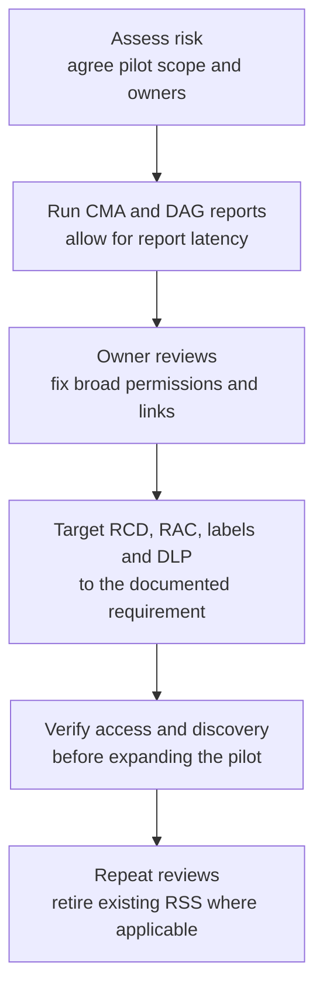

A CISO I spoke with before this post's original publication described their Copilot pilot like this: *"We turned it on for the leadership team. Within a week, someone summarised an internal HR document from a SharePoint site no one remembered existed. No breach, no policy violation — but the wrong people now knew about a redundancy plan."*

That's the conversation this post is for. Copilot respects permissions, but it can make an overly broad permission grant easier to notice.

SharePoint Advanced Management helps you find and review risky sharing. RCD limits discovery; RAC adds an access restriction. They do different jobs, and neither replaces fixing the underlying permissions. RSS also appears here because older rollout guides still recommend it, but new enablement is now blocked.

I'm a Copilot Solution Engineer at Microsoft NZ. The "wrong people now knew about a redundancy plan" story is anonymised but very real — and it's the most common Copilot rollout pause-and-restart pattern I see.

Three patterns I keep seeing in real rollouts:

1. **The Legal Green Light.** Legal initially blocks Copilot entirely citing discovery risk. After seeing the controls in this post — particularly RCD on legal sites and audit trails for Copilot interactions — they approve a controlled pilot.
2. **The False Sense of Safety.** *"We've had M365 for years, we're fine."* The first SAM scan shows the average employee has technical access to millions of files. Copilot becomes the trigger for the long-overdue data cleanup.
3. **The HR Wake-Up Call.** Like the CISO story above. No breach, no policy violation — but the rollout pauses while permissions get tidied.

The aim is a pilot with reviewed permissions and clear acceptance checks, not a promise that one toggle makes every site safe.

**Quick links:**

- [The mental model — a library, doors and a building survey](#mental-model)
- [TL;DR: the controls and their limits](#tldr)
- [The engine first — SAM, DAG and the Content Management Assessment](#sam-engine)
- [RSS: retirement and existing configurations](#rss)
- [RCD: limiting site discovery](#rcd)
- [RAC — the membership fence](#rac)
- [Container labels and sharing defaults](#defaults)
- [The "Everyone except external users" landmine](#eeeu)
- [How to actually roll this out](#rollout)
- [Microsoft's official blueprint](#blueprint)
- [What I'm not covering here](#not-covered)
- [Common mistakes I see admins make](#mistakes)
- [FAQ](#faq)

<div class="living-doc-banner">

**Documentation reviewed: 15 September 2026.** This update checks public Microsoft documentation, not tenant behaviour. Existing screenshots are illustrative. No policies were exercised for this review. RCD's recent-content exception is inconsistent across the current docs; the uncertainty is explained below. [Let me know](/feedback/) if something changes.

</div>

---

<p></p>

*Source: [Data access governance reports](https://learn.microsoft.com/en-us/sharepoint/data-access-governance-reports) — Microsoft. This is the "building survey" the whole post is about. (Microsoft demo data.)*

## The Mental Model — A Library, Doors and a Building Survey {#mental-model}

Imagine your SharePoint tenant as a research library. There are thousands of rooms (sites), millions of books (files), and one front desk where readers ask questions. Copilot is a very fast, very polite librarian standing at that front desk.

The librarian can find relevant content the reader is permitted to access, subject to indexing and content-protection controls. If the room labelled "Strategy 2018" still has the door propped open from a temporary project, the problem starts with that access.

The useful distinctions are:

**SAM = the building survey.** Before you put fences anywhere, somebody needs to walk the corridors and tell you which rooms have doors propped open, which have lost their owners, and which are accessed weekly by people who shouldn't have keys. That's what SharePoint Advanced Management, DAG reports, and the Content Management Assessment do. Without it, you're guessing.

**RSS = a retiring front-desk restriction.** Existing configurations use an allow-list, but personal and previously accessed content can be exceptions. It never made everything outside the list off limits. New enablement has been blocked since 31 July 2026.

**RCD = less discovery at the front desk.** It does not lock the room. Permitted readers can still go directly to it, and Copilot can help with a file they already have open. Microsoft's current documentation disagrees about discovery of owned or recently used content. Do not promise that RCD makes a room invisible.

**RAC = an additional check at the door.** For users in scope, a key is not enough: they also need membership in an allowed Microsoft 365 or Entra security group. Current SharePoint search and Copilot honour this restriction after indexing. External participants in shared Teams channels are a documented exception.

The library metaphor is mine — Microsoft's own docs use the "guardrails" framing. Use whichever lands with your audience. Engineers like RSS-RCD-RAC. CISOs prefer doors and fences.

---

## TL;DR: The Controls and Their Limits {#tldr}

| Control | What it does in one sentence | Scope | Access effect |
|---|---|---|---|
| **SAM + DAG + CMA** | Helps prioritise sites and owner reviews | Tenant reporting | Reports do not change access |
| **RSS** | Retiring discovery restriction; new enablement blocked | Existing tenant configurations | No permission change |
| **RCD** | Limits discovery, with documented boundaries and a recent-content ambiguity | SharePoint site | No permission change |
| **RAC** | Requires existing permission **and** allowed-group membership, with exceptions | SharePoint site | Adds an access condition; does not rewrite ACLs |

Assess first, fix permissions, then choose discovery, access or content-processing controls for the specific risk.

A control's presence is not evidence that it has propagated or covers the way your users work. Include those checks in the pilot.

---

## The Engine First — SAM, DAG and the Content Management Assessment {#sam-engine}

Before any fence, you need to know which rooms have doors propped open. That's what SharePoint Advanced Management (SAM) does.

**Check the inclusion table, not just the product name.** An eligible base subscription and at least one qualifying Copilot licence **assigned to a user** include listed SAM deployment features. The user need not be a SharePoint admin. Included features currently cover RCD, RAC, block download, DAG, CMA, site owner reviews and active or simulated lifecycle policies. Restricted site creation by apps still requires standalone SAM Plan 1; sensitivity-label reports require E5/G5. See the [Copilot feature table](https://learn.microsoft.com/en-us/sharepoint/sharepoint-advanced-management-features-copilot-license) and [prerequisites](https://learn.microsoft.com/en-us/sharepoint/sharepoint-advanced-management-prerequisites).

SAM unlocks four things that out-of-box SharePoint doesn't have:

### Data Access Governance (DAG) reports

DAG is a suite of reports in the SharePoint Admin Centre that surfaces site-level oversharing risk:

| Report | What it shows |
|---|---|
| **Everyone Except External Users** | Top 100 sites where content was shared with EEEU in the past 28 days |
| **Sharing links** | Sites with the most "Anyone" links, org-wide links, or specific-people links |
| **Site permissions baseline** | Permission and sharing counts, with separate SharePoint and OneDrive reports and documented exclusions |
| **Site permissions for a user** | Reported sites and permissions for a selected user, within the report's coverage |
| **Sensitivity label snapshot** | Sites containing files with specific labels (requires E5/G5) |

Use DAG to prioritise, not certify completeness. The [site-permissions report](https://learn.microsoft.com/en-us/sharepoint/data-access-governance-site-permissions-report) excludes archived and NoAccess sites. Its first run can take **up to five days**, later runs **up to 24 hours**, and data can be **48 hours stale**. It can be rerun every 30 days. Check EEEU and broad-link counts separately: the total permissioned-user count does not count every potential user behind those grants.

### Content Management Assessment (CMA)

CMA brings together sharing, lifecycle and governance reports to help prepare for Copilot. Microsoft recommends it for deployment readiness; the assessment can be rerun every 30 days.

It's a manual scan (it doesn't run automatically), and Microsoft documents that the included reports can take **2 to 72 hours** depending on tenant size. The output is a prioritised list of sites that need attention — overshared, ownerless, stale, or all three.

📖 [Get ready for Copilot with SharePoint Advanced Management — Microsoft Learn](https://learn.microsoft.com/en-us/sharepoint/get-ready-copilot-sharepoint-advanced-management)

### Site access reviews

Once DAG has surfaced a risky site, you can delegate the actual remediation to the site owner without needing to give IT access to the files themselves. Site owners get a contextual notification ("this site is shared with EEEU; is that still required?") and can confirm or change the sharing settings. This is how you scale remediation past the first 10 sites.

> **Use owners' context.** Central IT can coordinate and verify remediation, while owners explain which sharing is still needed. There is no fixed site-count threshold above which central cleanup becomes impossible.

### Site lifecycle policies

Inactive, ownership and attestation policies sit in SAM. They help identify stale or orphaned sites for review. Confirm business and retention needs before restricting, archiving or deleting content.

A clean tenant isn't one where Copilot is blocked from things — it's one where there isn't much pointless stuff for Copilot to look at in the first place.

---

## RSS: Retirement and Existing Configurations {#rss}

**Restricted SharePoint Search is retiring. New enablement has been blocked since 31 July 2026.** The [current public Microsoft Learn overview](https://learn.microsoft.com/en-us/sharepoint/restricted-sharepoint-search) does not specify a full-removal date. Do not use RSS as step one of a new Copilot rollout, even if an older guide or a lower section of the docs still shows enablement commands.

For a tenant that already has RSS enabled, the documented allowed sources include:
- Sites you've added to the allow-list
- The user's own OneDrive content, plus chats, emails and calendars they have access to
- Files from the user's **frequently visited** SharePoint sites
- Files the user has been directly shared
- Files the user has viewed, edited or created

> **Existing-configurations detail:** The last three categories above share a 2,000-entity per-user limit. These exceptions are one reason RSS is not an allow-list-only security boundary.

RSS does not change the underlying access permissions.

### What to do instead {#when-to-use-rss}

Start with risk assessment and owner reviews. Correct broad permissions, then use targeted RCD, RAC, sharing defaults, labels and DLP according to the risk. Agree pilot acceptance criteria before expanding access.

### The 100-site cap

The 100-site allowance describes existing RSS configurations, not a current deployment recommendation. Associated hub sites do not count against that limit, but still need correct permissions.

Do not redesign a new rollout around this retiring allowance.

### Existing-tenant checks {#how-to-enable-it}

An authorised admin can inspect an existing configuration with the SharePoint Online Management Shell:

```
# Connect first
Connect-SPOService -Url https://<tenant>-admin.sharepoint.com

# Check status
Get-SPOTenantRestrictedSearchMode
```

This is a read-only status check, not an enablement recipe. No command was run against a tenant for this review.

### The biggest gotcha

> ⚠️ **RSS is not a security boundary.** From Microsoft's own docs: *"Restricted SharePoint Search doesn't guarantee that only sites on the allowed list show up in search or Copilot."* If a user recently accessed a site, or was sent a file from it via Teams or Outlook, that content can still surface in Copilot's responses regardless of the allow-list. RSS reduces ambient discovery — it doesn't enforce access.

### When to turn RSS off

For existing deployments, review the retirement guidance, remediate risky access, validate replacement controls and plan RSS removal with users and agent owners. Do not assume you can re-enable it as a rollback. RCD is also documented as a temporary measure during remediation, not a reason to leave permissions unfixed.

📖 [Restricted SharePoint Search overview — Microsoft Learn](https://learn.microsoft.com/en-us/sharepoint/restricted-sharepoint-search) · [Admin scripts](https://learn.microsoft.com/en-us/sharepoint/restricted-sharepoint-search-admin-scripts)

---

## RCD: Limiting Site Discovery {#rcd}

<p></p>

*Source: [Restrict discovery of SharePoint sites and content](https://learn.microsoft.com/en-us/sharepoint/restricted-content-discovery) — Microsoft. The "Restrict content from Microsoft 365 Copilot" toggle, per-site. (Microsoft demo data.)*

**Restricted Content Discovery (RCD)** limits discovery of a SharePoint site's content in organisation-wide search and Copilot. It does not change permissions, and permitted users retain direct access.

**An important documentation conflict:** the RCD page dated 11 September 2026 says in its introduction that the restriction includes recently interacted files. Its later "How it works" section says users can still discover owned or recently interacted content; the SAM Copilot inclusion table repeats that exception. I cannot certify either a universal block or a reliable exception from those conflicting statements. Treat RCD as discovery reduction, and validate those cases before relying on it.

### What RCD does and doesn't change

**RCD does:**
- Restrict content discovery in organisation-wide search and Copilot, subject to the uncertainty above
- Remove documented SharePoint AI entry points on the site: the Copilot button, AI actions including agent creation, and Create pages with AI
- Support up to 20,000 SharePoint sites

**RCD does NOT:**
- Change site permissions in any way
- Affect users who walk into the site directly — they still see everything they always saw
- Affect site-scoped search (searching inside the site itself still works)
- Affect Copilot "data-in-use" scenarios — if a user opens a Word file from an RCD site, *"Summarise this document"* still works inside Word
- Provide a settled guarantee about owned or recently interacted content in the current documentation
- Affect Purview features (eDiscovery, auto-labelling, retention) — content stays in the index
- Apply to OneDrive (RCD is SharePoint sites only)

### When to use RCD

Consider RCD as temporary discovery reduction while owners review sites such as:
- HR and personnel records
- Legal and contracts
- Board and executive materials
- M&A and strategy archives
- Legacy sites with unresolved permission reviews

It is not a substitute for restricting access to sensitive content that users should not be able to open.

### How to configure it

SharePoint Admin Centre → Sites → Active sites → select site → Settings → "Restrict content from Microsoft 365 Copilot" toggle.

Or via PowerShell:

```
Set-SPOSite -Identity https://<tenant>.sharepoint.com/sites/hr-confidential `
            -RestrictContentOrgWideSearch $true
```

To let site administrators manage RCD for their own sites:

```
Set-SPOTenant -DelegateRestrictedContentDiscoverabilityManagement $true
```

This [delegation applies to site administrators](https://learn.microsoft.com/en-us/sharepoint/restricted-content-discovery#delegate-management-to-site-administrators), not everyone in a site's Owners group. [Site administrators](https://learn.microsoft.com/en-us/sharepoint/site-permissions#site-admins) have additional authority beyond ordinary site-owner permissions. Check that role before delegating management.

### The biggest gotcha

> **Allow for propagation.** Timing depends on site size and concurrent changes. Sites with more than 500,000 items can take over a week. The current docs do not promise that all smaller sites complete in a few hours.

### When NOT to use RCD

Don't blanket-apply RCD to half your tenant. Microsoft explicitly warns that overuse degrades Copilot response quality: the model has less context to ground answers on, so users get vague or "I don't know" responses for legitimate queries. RCD is a scalpel, not a hammer.

📖 [Restricted Content Discovery — Microsoft Learn](https://learn.microsoft.com/en-us/sharepoint/restricted-content-discovery)

---

## RAC — The Membership Fence {#rac}

<p></p>

*Source: [Restrict SharePoint site access with groups](https://learn.microsoft.com/en-us/sharepoint/restricted-access-control) — Microsoft. Turn this on at the org level first, then apply per site. (Microsoft demo data.)*

**Restricted Access Control (RAC)** adds an access condition to a SharePoint site. A user in scope needs **both** existing site/content permission and membership in an allowed Microsoft 365 or Entra security group. RAC does not rewrite the site's ACLs or grant permission on its own.

### What makes RAC different

RSS and RCD are discovery controls. They do not prevent a user with valid permission from opening a file directly.

RAC enforces the additional membership check. **Exception:** external participants in shared Teams channels are not evaluated against RAC. Their channel and site permissions still apply. Review that collaboration path separately.

### What RAC does and doesn't change

**RAC does:**
- Block access for users in scope who lack allowed-group membership, even if they have an underlying file permission
- Apply at file-open time (direct navigation, sharing links, click-through from search — all blocked)
- Support dynamic Entra security groups (attribute-based access)
- Support up to 10 groups per site
- Restrict results in current SharePoint organisation-wide search and Copilot for excluded users, after indexing reflects the change

**RAC does NOT:**
- Guarantee immediate search-result removal; indexing latency depends on site size
- Automatically grant access just by being in the group — users still need site/content permissions on top of group membership
- Cascade to shared or private Teams channel sites (those are separate; configure RAC on each)
- Apply to OneDrive in the same way (this section covers SharePoint site-level RAC; OneDrive has separate access restriction controls under SAM — out of scope for this post)

### The two-factor gotcha

> **Two requirements, not two names for the same setting.** Allowed-group membership and existing site/content permission are both required. Keep least-privilege file permissions where needed; do not broaden them simply to make the two lists identical.

### When to use RAC

RAC is the right tool for high-value, defined-membership sites where you want a hard fence:
- Board and executive materials
- M&A data rooms
- Regulated workloads (financial reporting, clinical trial data)
- Anything where the audit question is *"who can technically open this?"* rather than *"who would Copilot mention this to?"*

### How to configure it

Tenant-level enable first:

```
Set-SPOTenant -EnableRestrictedAccessControl $true
```

Then per-site:

```
Set-SPOSite -Identity https://<tenant>.sharepoint.com/sites/board-materials `
            -RestrictedAccessControl $true
Set-SPOSite -Identity https://<tenant>.sharepoint.com/sites/board-materials `
            -AddRestrictedAccessControlGroups "GUID-of-board-members-group"
```

Or via the SharePoint Admin Centre: Policies → Access control → Site-level access restriction → enable, then per-site under Active sites → Settings.

📖 [Restricted Access Control — Microsoft Learn](https://learn.microsoft.com/en-us/sharepoint/restricted-access-control)

---

## Container Labels and Sharing Defaults {#defaults}

Discovery and access restrictions help contain a risk. Sharing hygiene helps prevent it recurring.

### Container labels for SharePoint sites

Container labels (sometimes called "groups and sites" labels) are sensitivity labels that govern the *workspace settings* of a SharePoint site, Microsoft 365 group, or Team. The main settings relevant for oversharing are:

- Public vs private at the container level
- External sharing settings (block, allow guests, etc.)
- Access from unmanaged devices
- Authentication contexts (linking an existing Conditional Access policy to the container — the label doesn't create CA rules, it references one you've already configured in Entra)

Container labels expose more settings than the four above (private Teams discoverability, default sharing link type via PowerShell, shared channels control, default label for channel meetings) — but these four are the ones that bite on oversharing.

A site or Team label does not automatically label or encrypt its files. Its configured workspace access and sharing protections still apply. Item-level classification and encryption require item-level protection. See Microsoft's [container-label guidance](https://learn.microsoft.com/en-us/purview/sensitivity-labels-teams-groups-sites).

This trips up a lot of admins. Container labels are about workspace governance. Item-level labels are about content protection. You need both.

### Sharing-link defaults

A useful default to review before rollout is "Specific people", rather than anonymous or organisation-wide links.

SharePoint Admin Centre → Policies → Sharing → Default link type → **Specific people**.

Or via PowerShell (note: the value is `Direct` for "Specific people" — not `DirectLink`):

```
Set-SPOTenant -DefaultSharingLinkType Direct
Set-SPOTenant -RequireAnonymousLinksExpireInDays 30
```

> ⚠️ **Two different behaviours, often confused:**
> - **Changing the default link type** ("Anyone" → "Specific people") only affects *new* links created after the change. Existing "Anyone" links keep working.
> - **Requiring anonymous link expiry** (`-RequireAnonymousLinksExpireInDays`) sets an expiry requirement for new user-created links. Do not rely on it to revoke old links; review and remediate those explicitly.
>
> Use the SAM Sharing Links DAG report to find the sites with the most legacy "Anyone" links and clean those up explicitly.

The [Set-SPOTenant reference](https://learn.microsoft.com/en-us/powershell/module/microsoft.online.sharepoint.powershell/set-spotenant?view=sharepoint-ps#-requireanonymouslinksexpireindays) documents that expiry requirement for links created after the policy.

---

## The "Everyone Except External Users" Landmine {#eeeu}

<p></p>

*Source: [Site permissions report](https://learn.microsoft.com/en-us/sharepoint/data-access-governance-site-permissions-report) — Microsoft. The EEEU permission count column is the one to scan first. (Microsoft demo data.)*

If there's one thing in this post that will change your Copilot rollout the most, it's auditing for EEEU.

EEEU represents internal users. A grant to EEEU can expose content far more broadly than the owner intended, but its effect depends on the grant's scope, inheritance and other access controls. It does not automatically mean every employee can read every file on a site.

Inappropriate EEEU grants are worth prioritising because Copilot may surface content the user was already permitted to access.

**How to find it:**

- SAM DAG → "Everyone Except External Users activity" report → top 100 sites in past 28 days
- DSPM for AI weekly assessments
- Site permissions baseline snapshot

**How to fix it:**

1. Ask the owner whether each EEEU grant is still required
2. Replace EEEU with appropriately-scoped security groups
3. Consider RCD for interim discovery reduction, without treating it as access protection
4. Apply RAC if the site is genuinely sensitive

EEEU isn't a bug. It's a five-year accumulation of "share with everyone" being the easiest button. The first SAM scan will surprise even tenants that consider themselves well-governed.

---

## How to Actually Roll This Out {#rollout}

Here is a suggested sequence based on the current assessment, access-control and deployment guidance. It is not a Microsoft-prescribed timetable, and this review did not run these steps in a tenant.


```mermaid
flowchart TD
    A["Assess risk<br/>agree pilot scope and owners"] --> B["Run CMA and DAG reports<br/>allow for report latency"]
    B --> C["Owner reviews<br/>fix broad permissions and links"]
    C --> D["Target RCD, RAC, labels and DLP<br/>to the documented requirement"]
    D --> E["Verify access and discovery<br/>before expanding the pilot"]
    E --> F["Repeat reviews<br/>retire existing RSS where applicable"]
```

### Phase 1: Agree the risk and pilot scope {#phase-1--turn-rss-on-days-07}

Identify sensitive sites, accountable owners, intended users and unacceptable access. Choose a manageable pilot cohort and a documented review gate. Do not enable RSS: new enablement is blocked. If RSS already exists, include its retirement in the plan rather than assuming it is a rollback option.

### Phase 2: Run the assessment and permission reports {#phase-2--run-the-sam-content-management-assessment-days-721}

Use CMA and the relevant DAG reports to prioritise overshared, ownerless and stale sites. Allow 2–72 hours for CMA, versus up to five days for the first site-permissions report. Record report dates and exclusions. Rerun on the documented 30-day interval; use direct permission checks for changes made between snapshots.

### Phase 3: Review with owners and fix permissions {#phase-3--fix-permissions-via-site-access-reviews-apply-rcd-as-interim-cover-weeks-312}

Remove inappropriate broad grants and legacy links after owner review. Keep legitimate collaboration intact. RCD can reduce discovery during remediation, but direct access remains and the current recent-content guidance conflicts. If an unauthorised person can open a sensitive file, fix access rather than waiting for RCD.

### Phase 4: Add targeted controls and verify them {#phase-4--apply-rac-as-the-durable-fence-where-needed-weeks-614}

Use RAC where allowed-group membership must be an extra access condition. Configure private/shared channel sites separately and account for external shared-channel participants. Use item encryption or Copilot DLP where permitted users must not have content processed. For each control, check direct access, organisation-wide search, Copilot, already-open files and relevant agent paths after propagation.

### Phase 5: Expand only after the review gate {#phase-5--disable-rss-week-12}

Record the pilot evidence, unresolved exceptions and owner approval before expanding. For tenants with existing RSS, follow Microsoft's migration guidance and validate the effect of removing it. Revisit temporary RCD restrictions once permissions are corrected. Keep lifecycle reviews running.

> **A useful acceptance gate:** intended users can do their work, excluded users cannot open restricted content, expected search behaviour has propagated, and owners have reviewed the remaining exceptions. A clean dashboard alone is not enough.

---

## Microsoft's Official Blueprint {#blueprint}

Microsoft publishes Secure and govern Microsoft 365 Copilot: Foundational deployment guidance — a three-pillar framework that wraps everything in this post inside a broader governance model.

| Pillar | Activities | Where this post fits |
|---|---|---|
| **1. Remediate Oversharing** | DSPM + SAM CMA → apply RCD as interim cover → fix permissions → remove interim controls when clean | **This post sits inside Pillar 1** |
| **2. Set Up Guardrails** | Sharing defaults → RAC for business-critical → auto-labelling → DLP for Copilot → DSPM Activity Explorer | Container labels + sharing defaults from this post |
| **3. Meet Regulations** | Compliance Manager → retention policies → lifecycle policies | Out of scope here |

**Useful Microsoft shortlinks:**
- Blueprint PDF: [aka.ms/Copilot/SecureGovernBlueprintPDF](https://aka.ms/Copilot/SecureGovernBlueprintPDF)
- PowerPoint deck: [aka.ms/Copilot/SecureGovernBlueprintPPT](https://aka.ms/Copilot/SecureGovernBlueprintPPT)
- Learn implementation guide: [aka.ms/Copilot/SecureGovernBlueprintLearn](https://aka.ms/Copilot/SecureGovernBlueprintLearn)
- Get ready for Copilot with SAM: [Microsoft Learn](https://learn.microsoft.com/en-us/sharepoint/get-ready-copilot-sharepoint-advanced-management)

The [current foundational guidance](https://learn.microsoft.com/en-us/microsoft-365/copilot/secure-govern-copilot-foundational-deployment-guidance) uses those three pillars. The phases above are my suggested implementation sequence. They deliberately replace this post's earlier RSS-first recipe because new RSS enablement is blocked.

---

## What I'm Not Covering Here {#not-covered}

Oversharing is one of four layers of Copilot data control. This post is layer one — the SharePoint piece. The other three deserve their own posts because they're complete topics in their own right:

- **Conditional Access**: require appropriate sign-in and device controls for the work resources in scope. This does not by itself block a user from signing into consumer AI with a personal account.
- **Item protection and Copilot DLP**: a label name alone is not a block. Supported encrypted-file summarisation requires VIEW and EXTRACT. The Rights Management owner and recipients granted the encryption usage right Full control (OWNER) have EXTRACT; SharePoint ownership or SharePoint Full Control does not establish those rights. The documented Edge active-tab exception also matters. Label-based DLP can exclude file/email processing, though citations may remain. Prompt sensitive-information-type blocking is separately documented as preview, does not scan uploaded files, and can take up to four hours to propagate. See [encryption usage rights](https://learn.microsoft.com/en-us/purview/ai-m365-copilot-considerations#copilot-honors-existing-protection-with-the-extract-usage-right) and [Copilot DLP](https://learn.microsoft.com/en-us/purview/dlp-microsoft365-copilot-location-learn-about).
- **Microsoft Purview DSPM**: risk assessments and collected activity help investigation. They do not prove that every control covers every path. See the [audit guide](/blog/auditing-microsoft-365-copilot/) for the distinction between metadata and conversation content.

For the broader umbrella framework, see [Copilot Control System — the plain-English guide](/blog/microsoft-365-copilot-control-system-complete-guide/). For the architecture that sits underneath all of this, see [How Microsoft 365 Copilot works, layer by layer](/blog/how-microsoft-365-copilot-works-layer-by-layer/).

If you're waiting on one of the above, [send me a note](/feedback/) and I'll prioritise it.

---

## Common Mistakes I See Admins Make {#mistakes}

**1. Confusing discovery with access.** RCD does not revoke permission. A direct link still works for a user with valid access. RAC adds an allowed-group requirement for users in scope; removing inappropriate ACL grants is still necessary.

**2. Relying on container labels for item encryption.** A "Confidential" site label applies its configured workspace protections but does not automatically label or encrypt the files. Use item-level protection and scoped DLP where needed, accounting for the rights and application exceptions above.

**3. Leaving owners out.** IT can coordinate remediation, but owners should confirm business need. Delegate reviews and verify the resulting permissions rather than treating an owner response as proof of completion.

**4. Forgetting Teams private channels.** RAC on the main team site does not cascade to private or shared channels. Each needs RAC configured separately. Most admins miss this.

**5. Blanket-applying RCD.** Microsoft explicitly warns this degrades Copilot response quality. RCD is a scalpel for sensitive sites — not a substitute for fixing permissions.

> 💡 **Quick admin checklist:** Use the [Copilot Readiness Checker](/copilot-readiness/) to assess oversharing risk before rolling out. Use the [Copilot Cost Calculator](/copilot-cost-calculator/) to model what Copilot will cost across your organisation. Use the [Copilot Feature Matrix](/copilot-matrix/) to see which controls map to which licence tier.

---

## FAQ {#faq}

### What is Restricted SharePoint Search (RSS)?

RSS is a retiring tenant-wide discovery restriction. New enablement has been blocked since 31 July 2026. The [current public Microsoft Learn overview](https://learn.microsoft.com/en-us/sharepoint/restricted-sharepoint-search) does not specify a full-removal date. Existing configurations have a 100-site allow-list with personal-content and recent-interaction exceptions. RSS does not change permissions or guarantee allow-list-only results.

### What is the difference between RSS, RCD and RAC?

RSS is retiring. RCD limits discovery without changing permissions; direct access and already-open-file summarisation remain. Current RCD documentation conflicts on owned or recently used content, so it is not a universal Copilot block. SharePoint RAC requires both existing content permission and membership in an allowed group, with documented exceptions including external shared-channel participants.

### Do I need SharePoint Advanced Management for Copilot?

An eligible base subscription and at least one qualifying Copilot licence assigned to a user include listed SAM deployment features, including RCD, RAC, block download, reporting, site owner reviews and lifecycle policies. This is not every SAM feature: restricted site creation by apps needs standalone SAM Plan 1, and sensitivity-label reports need E5/G5. Check the [current inclusion table](https://learn.microsoft.com/en-us/sharepoint/sharepoint-advanced-management-features-copilot-license) and [prerequisites](https://learn.microsoft.com/en-us/sharepoint/sharepoint-advanced-management-prerequisites).

### Does Copilot honour sensitivity labels on SharePoint files?

A label name alone does not block Copilot. For supported encrypted content, summarisation needs VIEW and EXTRACT rights; a link can still appear without EXTRACT. The Rights Management owner and recipients granted the encryption usage right Full control (OWNER) have EXTRACT. Do not infer those rights from SharePoint site ownership or SharePoint Full Control. See [Microsoft's usage-rights explanation](https://learn.microsoft.com/en-us/purview/ai-m365-copilot-considerations#copilot-honors-existing-protection-with-the-extract-usage-right). Edge has an active-tab exception unless DLP in Edge applies. Label-based Copilot DLP can exclude file/email processing. A site label does not automatically label or encrypt its files; its configured workspace access and sharing protections still apply.

### How long does Restricted Content Discovery take to take effect?

There is no universal few-hours guarantee. Propagation depends on item count and concurrent site changes; sites with more than 500,000 items can take over a week. RCD leaves permissions, direct access, site search and already-open-file summarisation intact. It also removes documented SharePoint AI entry points. Verify the relevant experiences after propagation.

### What is the "Everyone except external users" group and why does it matter for Copilot?

EEEU represents internal users. Granting it access can expose content much more broadly than intended, but access still depends on the grant's scope, inheritance and other controls. It does not mean every internal user can read every file. Use DAG reports and owner reviews to identify and remove inappropriate grants.

### Can I block Copilot from accessing specific SharePoint sites?

Choose the control for the requirement. RCD reduces discovery but is not a complete Copilot-access block. RAC adds a group-membership requirement to existing SharePoint permissions, and current search and Copilot honour that restriction after indexing. For permitted users whose content must not be processed, assess item encryption and Copilot DLP, including their documented limits.

### What is Microsoft's official blueprint for SharePoint oversharing before Copilot rollout?

Microsoft's blueprint has three pillars: remediate oversharing, set up guardrails and meet regulations. For a new rollout, start with assessment, owner reviews and least privilege, then targeted discovery, access and content-protection controls and pilot checks. Do not follow an old RSS-enablement recipe: new enablement is blocked. See the [current blueprint](https://learn.microsoft.com/en-us/microsoft-365/copilot/secure-govern-copilot-foundational-deployment-guidance).

---

## What to Read Next

> 📖 If you want the umbrella framework: [Copilot Control System (CCS) — Plain-English Guide](/blog/microsoft-365-copilot-control-system-complete-guide/)
>
> 📖 If you want the architecture underneath: [How Microsoft 365 Copilot works, layer by layer](/blog/how-microsoft-365-copilot-works-layer-by-layer/)
>
> 📖 If you want the full deployment checklist: [Microsoft 365 Copilot Deployment Best Practices — Ultimate Checklist](/blog/microsoft-365-copilot-deployment-best-practices-ultimate-checklist/)

Have a question I haven't answered, or spotted something out of date? [Send me feedback](/feedback/) — I update these posts when readers flag issues.
