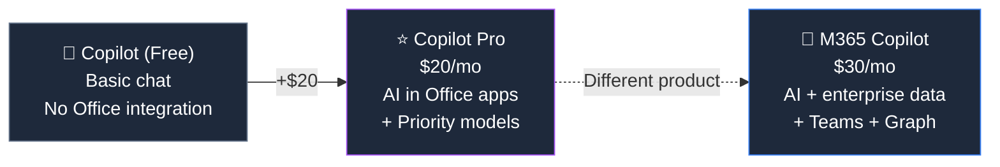

## What Is Copilot Pro?

Copilot Pro is Microsoft's **personal AI subscription** — the consumer equivalent of [Microsoft 365 Copilot](/licensing/microsoft-365-copilot/). It adds AI capabilities to your Office apps, gives you priority access to the latest AI models, and unlocks premium features in the Copilot chat experience.

> **⚠️ Not for businesses.** If you're an IT admin looking for Copilot for your organisation, see the [Microsoft 365 Copilot](/licensing/microsoft-365-copilot/) page instead. Copilot Pro is a personal consumer subscription.

## What You Get with Copilot Pro

| Feature | What It Does |
|---------|-------------|
| **AI in Word** | Draft, rewrite, summarise documents using AI prompts |
| **AI in Excel** | Generate formulas, analyse data trends, create charts from prompts |
| **AI in PowerPoint** | Create presentations from prompts, transform documents into slides |
| **AI in Outlook** | Draft emails, summarise threads, coach your writing tone |
| **AI in OneNote** | Summarise notes, generate plans, brainstorm ideas |
| **Priority model access** | First access to GPT-4 Turbo and latest OpenAI models during peak times |
| **Enhanced image creation** | Up to 100 AI-generated images per day (vs 15 on free tier) |
| **Copilot in Designer** | AI image editing and creation tools |

### What You DON'T Get (vs M365 Copilot)

| Feature | Copilot Pro | [M365 Copilot](/licensing/microsoft-365-copilot/) |
|---------|:----------:|:---------------:|
| AI in Word, Excel, PPT, Outlook | ✅ | ✅ |
| **Access to company emails/files** | ❌ | ✅ |
| **AI in Teams meetings** | ❌ | ✅ |
| **Grounded on enterprise data (Graph)** | ❌ | ✅ |
| **Copilot Studio (agent building)** | ❌ | ✅ |
| **IT admin controls** | ❌ | ✅ |
| **Compliance (SOC 2, GDPR)** | ❌ | ✅ |
| Priority model access | ✅ | ✅ |

> **💡 The key difference in plain English:** Copilot Pro is like having a smart assistant that can help you write — but it doesn't know anything about your work. Microsoft 365 Copilot knows your emails, meetings, files, and Teams conversations. That context is the $10/month difference.

## Prerequisites — What You Need

Copilot Pro requires a **Microsoft 365 Personal or Family** subscription to unlock AI features in desktop Office apps:

| Combination | Monthly Cost | What You Get |
|------------|:-----------:|-------------|
| M365 Personal + Copilot Pro | **$27/mo** | AI in Office apps for 1 person |
| M365 Family + Copilot Pro | **$30/mo** | AI in Office apps (Pro is per-user, Family shares M365) |
| Copilot Pro alone (no M365) | $20/mo | Web chat only — no AI in Office apps |

> **⚠️ Important:** Without a M365 Personal/Family subscription, Copilot Pro only gives you the web chat experience. The AI-in-Office-apps features require M365.

## Copilot Pro vs Microsoft 365 Copilot — Full Comparison

This is the **#1 confusion point** in Microsoft's AI lineup:

| Feature | Copilot (Free) | Copilot Pro ($20/mo) | [M365 Copilot](/licensing/microsoft-365-copilot/) ($30/mo) |
|---------|:--------------:|:-------------------:|:---------------------:|
| AI chat (web/mobile) | ✅ | ✅ | ✅ |
| **AI in desktop Office apps** | ❌ | ✅ | ✅ |
| **Access to enterprise data** | ❌ | ❌ | ✅ |
| **Teams meeting summaries** | ❌ | ❌ | ✅ |
| **Copilot Studio (agents)** | ❌ | ❌ | ✅ |
| Priority model access | ❌ | ✅ | ✅ |
| Enhanced image generation | ❌ | ✅ | ✅ |
| **Who can buy** | Anyone | Individuals | Organisations (via IT admin) |
| **Base requirement** | None | M365 Personal/Family | M365 E3/E5/Biz Std/Prem |
| **Total cost** | Free | ~$27/mo (with M365 Personal) | $69-99/mo (with base plan) |

> **💡 Decision guide:** Personal use → Copilot Pro ($20). Business use → [M365 Copilot](/licensing/microsoft-365-copilot/) ($30). AI at enterprise scale → [M365 E7](/licensing/microsoft-365-e7/) ($99, Copilot included).

## Who Should Buy Copilot Pro?

**Copilot Pro makes sense if:**

- ✅ You're an **individual or freelancer** who writes a lot in Word
- ✅ You use **Excel heavily** and want AI-powered analysis
- ✅ You create **presentations regularly** and want AI to help
- ✅ You already have **M365 Personal or Family**
- ✅ You want **priority access** to the latest AI models

**Copilot Pro is NOT for you if:**

- ❌ You need AI that knows your **work emails and Teams data** — get [M365 Copilot](/licensing/microsoft-365-copilot/)
- ❌ Your **company** wants to deploy Copilot — that's M365 Copilot via IT admin
- ❌ You only use Office **in the browser** — the free Copilot Chat may suffice
- ❌ You want to **build AI agents** — that requires [Copilot Studio](/licensing/copilot-studio/)

## Frequently Asked Questions

**1. What is Microsoft Copilot Pro?**

Copilot Pro is a $20/month personal AI subscription that adds Copilot capabilities to Word, Excel, PowerPoint, Outlook, and OneNote. It requires a Microsoft 365 Personal ($7/mo) or Family ($10/mo) subscription.

**2. What is the difference between Copilot Pro and Microsoft 365 Copilot?**

Copilot Pro ($20/mo) is for individuals — AI in Office apps but no access to business data. [Microsoft 365 Copilot](/licensing/microsoft-365-copilot/) ($30/mo) is for organisations — AI grounded on your company's emails, files, meetings, and Teams data via Microsoft Graph.

**3. Do I need Microsoft 365 to use Copilot Pro?**

Yes. Copilot Pro requires Microsoft 365 Personal ($7/month) or Microsoft 365 Family ($10/month) to unlock AI features in desktop Office apps. Without a qualifying subscription, Copilot Pro only works in the web chat.

**4. Can I use Copilot Pro for work?**

Technically yes, but it cannot access your organisation's data (emails, SharePoint, Teams). It only works with your personal files. For work use, your IT admin should deploy [Microsoft 365 Copilot](/licensing/microsoft-365-copilot/) ($30/user/month) instead.

**5. Is Copilot Pro worth $20 a month?**

If you heavily use Word, Excel, and PowerPoint for personal or freelance work, the drafting and analysis features can save hours per week. If you only use web email and basic documents, the free Copilot Chat may be enough.

**6. Can my company buy Copilot Pro for employees?**

No. Copilot Pro is a personal consumer subscription. For business and enterprise use, deploy [Microsoft 365 Copilot](/licensing/microsoft-365-copilot/) ($30/user/month) which requires M365 E3, E5, Business Standard, or Business Premium.
