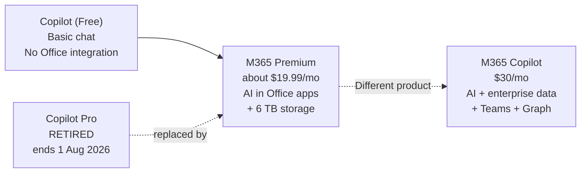

## What Is Copilot Pro?

> **⚠️ Copilot Pro has been retired.** Microsoft stopped selling the standalone $20/month plan in late 2025, and support for existing subscribers ends on **1 August 2026**. The replacement is **[Microsoft 365 Premium](/blog/microsoft-365-premium-explained/)** (about $19.99/month), which bundles the same in-app AI with the Microsoft 365 apps and up to 6 TB of storage. Microsoft 365 Personal (about $9.99) and Family (about $12.99) now include Copilot for the subscription owner too. This page is kept as a reference for what Copilot Pro was and what to move to — see the [full Copilot pricing breakdown](/blog/microsoft-copilot-pricing-tiers-explained/) for the current picture.

Copilot Pro *was* Microsoft's **personal AI subscription** — the consumer equivalent of [Microsoft 365 Copilot](/licensing/microsoft-365-copilot/). It added AI capabilities to your Office apps, gave you priority access to the latest AI models, and unlocked premium features in the Copilot chat experience.

> **⚠️ Not for businesses.** If you're an IT admin looking for Copilot for your organisation, see the [Microsoft 365 Copilot](/licensing/microsoft-365-copilot/) page instead. Copilot Pro is a personal consumer subscription.

```mermaid
flowchart LR
    FREE["Copilot (Free)<br/>Basic chat<br/>No Office integration"]
    PREM["M365 Premium<br/>about $19.99/mo<br/>AI in Office apps<br/>+ 6 TB storage"]
    M365["M365 Copilot<br/>$30/mo<br/>AI + enterprise data<br/>+ Teams + Graph"]
    PRO["Copilot Pro<br/>RETIRED<br/>ends 1 Aug 2026"]
    FREE --> PREM
    PRO -.->|"replaced by"| PREM
    PREM -.->|"Different product"| M365
```

## What You Get with Copilot Pro

| Feature | What It Does |
|---------|-------------|
| **AI in Word** | Draft, rewrite, summarise documents using AI prompts |
| **AI in Excel** | Generate formulas, analyse data trends, create charts from prompts |
| **AI in PowerPoint** | Create presentations from prompts, transform documents into slides |
| **AI in Outlook** | Draft emails, summarise threads, coach your writing tone |
| **AI in OneNote** | Summarise notes, generate plans, brainstorm ideas |
| **Priority model access** | First access to the latest frontier models during peak times |
| **Enhanced image creation** | Up to 100 AI-generated images per day (vs 15 on free tier) |
| **Copilot in Designer** | AI image editing and creation tools |

### What You DON'T Get (vs M365 Copilot)

| Feature | Copilot Pro | [M365 Copilot](/licensing/microsoft-365-copilot/) |
|---------|:----------:|:---------------:|
| AI in Word, Excel, PPT, Outlook | ✅ | ✅ |
| **Access to company emails/files** | ❌ | ✅ |
| **AI in Teams meetings** | ❌ | ✅ |
| **Grounded on enterprise data (Graph)** | ❌ | ✅ |
| **Copilot Studio (agent building)** | ❌ | ✅ |
| **IT admin controls** | ❌ | ✅ |
| **Compliance (SOC 2, GDPR)** | ❌ | ✅ |
| Priority model access | ✅ | ✅ |

> **💡 The key difference in plain English:** Copilot Pro was like having a smart assistant that could help you write — but it didn't know anything about your work. Microsoft 365 Copilot knows your emails, meetings, files, and Teams conversations. That context is what you're paying the difference for.

## Prerequisites — What You Needed

Copilot Pro required a **Microsoft 365 Personal or Family** subscription to unlock AI features in desktop Office apps. For reference, this is how it stacked up while it was on sale:

| Combination | Monthly Cost | What You Got |
|------------|:-----------:|-------------|
| M365 Personal + Copilot Pro | **$27/mo** | AI in Office apps for 1 person |
| M365 Family + Copilot Pro | **$30/mo** | AI in Office apps (Pro is per-user, Family shares M365) |
| Copilot Pro alone (no M365) | $20/mo | Web chat only — no AI in Office apps |

> **⚠️ These prices are historical.** Copilot Pro is no longer sold, and the base plans have changed since: Microsoft 365 Personal is now around **$9.99/month** and Family around **$12.99/month**, and both include Copilot for the subscription owner. **[Microsoft 365 Premium](/blog/microsoft-365-premium-explained/)** (about $19.99/month) is the plan that carries the full Copilot Pro feature set today.

## Copilot Pro vs Microsoft 365 Copilot — Full Comparison

This was the **#1 confusion point** in Microsoft's AI lineup:

| Feature | Copilot (Free) | Copilot Pro (retired) | [M365 Copilot](/licensing/microsoft-365-copilot/) ($30/mo) |
|---------|:--------------:|:-------------------:|:---------------------:|
| AI chat (web/mobile) | ✅ | ✅ | ✅ |
| **AI in desktop Office apps** | ❌ | ✅ | ✅ |
| **Access to enterprise data** | ❌ | ❌ | ✅ |
| **Teams meeting summaries** | ❌ | ❌ | ✅ |
| **Copilot Studio (agents)** | ❌ | ❌ | ✅ |
| Priority model access | ❌ | ✅ | ✅ |
| Enhanced image generation | ❌ | ✅ | ✅ |
| **Who could buy** | Anyone | Individuals | Organisations (via IT admin) |
| **Base requirement** | None | M365 Personal/Family | M365 E3/E5/Biz Std/Prem |
| **Total cost** | Free | about $27/mo (with M365 Personal) | $69-99/mo (with base plan) |

> **💡 Decision guide (2026):** Personal use → [Microsoft 365 Premium](/blog/microsoft-365-premium-explained/) (about $19.99). Business use → [M365 Copilot](/licensing/microsoft-365-copilot/) ($30). AI at enterprise scale → [M365 E7](/licensing/microsoft-365-e7/) ($99, Copilot included).

## Who Was Copilot Pro For?

**Copilot Pro made sense if:**

- ✅ You're an **individual or freelancer** who writes a lot in Word
- ✅ You use **Excel heavily** and want AI-powered analysis
- ✅ You create **presentations regularly** and want AI to help
- ✅ You already have **M365 Personal or Family**
- ✅ You want **priority access** to the latest AI models

**Copilot Pro is NOT for you if:**

- ❌ You need AI that knows your **work emails and Teams data** — get [M365 Copilot](/licensing/microsoft-365-copilot/)
- ❌ Your **company** wants to deploy Copilot — that's M365 Copilot via IT admin
- ❌ You only use Office **in the browser** — the free Copilot Chat may suffice
- ❌ You want to **build AI agents** — that requires [Copilot Studio](/licensing/copilot-studio/)

## Frequently Asked Questions

**1. What is Microsoft Copilot Pro?**

Copilot Pro was a $20/month personal AI subscription that added Copilot capabilities to Word, Excel, PowerPoint, Outlook, and OneNote. Microsoft retired it in late 2025 and support for existing subscribers ends on 1 August 2026. [Microsoft 365 Premium](/blog/microsoft-365-premium-explained/) (about $19.99/month) is the replacement.

**2. What is the difference between Copilot Pro and Microsoft 365 Copilot?**

Copilot Pro (retired) was for individuals — AI in Office apps but no access to business data. Microsoft 365 Premium (about $19.99/month) is its consumer replacement. [Microsoft 365 Copilot](/licensing/microsoft-365-copilot/) ($30/mo) is for organisations — AI grounded on your company's emails, files, meetings, and Teams data via Microsoft Graph.

**3. Do I need Microsoft 365 to use Copilot Pro?**

Copilot Pro is no longer sold. While it existed it required Microsoft 365 Personal or Family to unlock AI in the desktop Office apps. Today Personal (about $9.99/month) and Family (about $12.99/month) include Copilot for the subscription owner, and Microsoft 365 Premium (about $19.99/month) carries the full Copilot Pro feature set.

**4. Can I use Copilot Pro for work?**

Copilot Pro is retired, but the answer applied to its replacement too: consumer plans cannot access your organisation's data (emails, SharePoint, Teams). They only work with your personal files. For work use, your IT admin should deploy [Microsoft 365 Copilot](/licensing/microsoft-365-copilot/) ($30/user/month) instead.

**5. Is Copilot Pro worth $20 a month?**

It is no longer available to buy. The live question now is whether Microsoft 365 Premium (about $19.99/month) is worth it — if you heavily use Word, Excel, and PowerPoint for personal or freelance work, the drafting and analysis features can save hours per week, and Premium bundles the Office apps and up to 6 TB of storage. If you only use web email and basic documents, free Copilot may be enough.

**6. Can my company buy Copilot Pro for employees?**

No — and it is no longer sold in any case. Consumer plans such as Microsoft 365 Premium are personal subscriptions. For business and enterprise use, deploy [Microsoft 365 Copilot](/licensing/microsoft-365-copilot/) ($30/user/month) which requires M365 E3, E5, Business Standard, or Business Premium.
