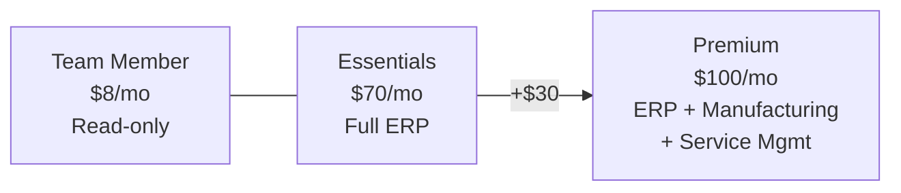

## Who Is Business Central Essentials For?

Business Central is the **ERP for growing SMBs** — the natural step up from spreadsheets and basic accounting tools. Essentials is the most common tier.

**Essentials is right for you if:**

- ✅ You're **outgrowing QuickBooks/Xero** and need real ERP
- ✅ You need **financial management** — GL, AP/AR, bank reconciliation, budgeting
- ✅ You manage **inventory and supply chain** — purchase orders, stock tracking, warehousing
- ✅ You run **projects** and need to track time, costs, and budgets
- ✅ You want an ERP that **integrates with Microsoft 365** (Outlook, Teams, Excel)

**Upgrade to Premium if:**

- ❌ You're a **manufacturer** needing BOMs, production orders, capacity planning
- ❌ You have a **service management** operation (field service scheduling)

## Essentials vs Premium vs Team Member

| Feature | Team ($8) | Essentials ($70) | Premium ($100) |
|---------|:---------:|:----------------:|:--------------:|
| View reports & dashboards | ✅ | ✅ | ✅ |
| Approve workflows | ✅ | ✅ | ✅ |
| **Financial management** | ❌ | ✅ | ✅ |
| **Supply chain & inventory** | ❌ | ✅ | ✅ |
| **Project management** | ❌ | ✅ | ✅ |
| **Basic CRM** | ❌ | ✅ | ✅ |
| **Manufacturing** | ❌ | ❌ | ✅ |
| **Service management** | ❌ | ❌ | ✅ |

## What's Included in Essentials

### 💰 Financial Management
- General ledger, chart of accounts, dimensions
- Accounts payable and receivable
- Bank reconciliation and cash management
- Fixed assets management
- Budgeting and financial reporting
- Multi-currency and multi-entity support
- VAT/GST handling and tax reporting

### 📦 Supply Chain & Inventory
- Purchase orders and vendor management
- Inventory tracking with serial/lot numbers
- Warehouse management (bins, picks, put-aways)
- Assembly management
- Item tracking and availability

### 📋 Project Management
- Job costing and project budgets
- Time tracking and resource allocation
- WIP (work in progress) calculations
- Project invoicing

### 🤝 Basic CRM
- Contact management
- Opportunity tracking
- Sales quotes and orders
- Customer segments

## Frequently Asked Questions

**0. Can I migrate from QuickBooks to Business Central?**

Yes. Microsoft provides data migration tools for QuickBooks, and most implementation partners offer migration services. Typical migration takes 2-4 weeks.

**1. Is Business Central cloud-only?**

Business Central is primarily cloud (SaaS on Azure), but on-premises deployment is available for specific compliance needs. The cloud version gets updates automatically.

**2. Does it integrate with Power BI?**

Yes — Business Central has built-in Power BI integration. Financial reports, dashboards, and KPIs can be embedded directly in the BC interface.

