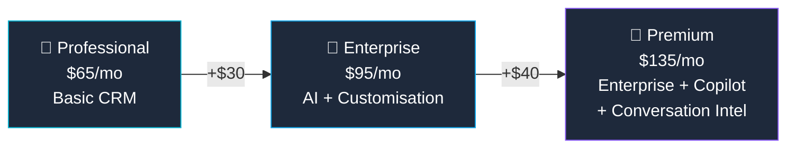

## Who Is D365 Sales Enterprise For?

D365 Sales Enterprise is the **go-to CRM for mid-to-large sales organisations** that need more than a basic contact database. It's the most popular D365 Sales tier.

**Enterprise is right for you if:**

- ✅ You have a **structured sales team** with pipeline management needs
- ✅ You want **AI-powered forecasting** to predict revenue
- ✅ You use **LinkedIn** for prospecting (Sales Navigator integration)
- ✅ You need to **customise** the CRM with Power Platform (custom entities, workflows)
- ✅ You want **relationship analytics** — auto-track email/meeting engagement health

## Professional vs Enterprise vs Premium

| Feature | Professional ($65) | Enterprise ($95) | Premium ($135) |
|---------|:------------------:|:----------------:|:--------------:|
| Leads & Opportunities | ✅ | ✅ | ✅ |
| Quotes, Orders, Invoices | ✅ | ✅ | ✅ |
| **Sales Forecasting (AI)** | ❌ | ✅ | ✅ |
| **Relationship Analytics** | ❌ | ✅ | ✅ |
| **LinkedIn Sales Navigator** | ❌ | ✅ | ✅ |
| **Power Platform Customisation** | Limited | ✅ | ✅ |
| **Copilot for Sales** | ❌ | ❌ | ✅ |
| **Conversation Intelligence** | ❌ | ❌ | ✅ |

> **💡 Attach pricing:** If a user already has one D365 app, additional apps cost significantly less (around $20/user/month). This is called "attach licensing."

## Key Features in Enterprise

### 📊 Sales Forecasting
AI-powered revenue predictions based on pipeline, historical data, and seller behaviour. Managers get real-time forecast accuracy and risk indicators.

### 🤝 Relationship Analytics
Automatically analyses emails, meetings, and calls to score relationship health with each contact. Flags accounts going cold before your reps notice.

### 💼 LinkedIn Integration
Pull LinkedIn profile data directly into D365 contact records. See shared connections, recent activity, and InMail from within the CRM.

### ⚡ Power Platform Customisation
Build custom dashboards, workflows, and entities using Power Apps and Power Automate. Enterprise gives full customisation rights that Professional limits.

## Frequently Asked Questions

**1. Do I need a separate M365 licence?**

Yes. D365 Sales is a standalone product. You'll typically pair it with M365 E3 or E5 for email, Teams, and Office apps.

**2. Can I start with Professional and upgrade?**

Yes — upgrade anytime. Your data migrates seamlessly. Downgrading is also possible but you'll lose access to Enterprise features.

**3. What about Salesforce vs D365?**

D365 Sales integrates natively with the Microsoft ecosystem (Outlook, Teams, Power Platform, Azure). If you're already a Microsoft shop, D365 eliminates integration complexity and third-party costs.

