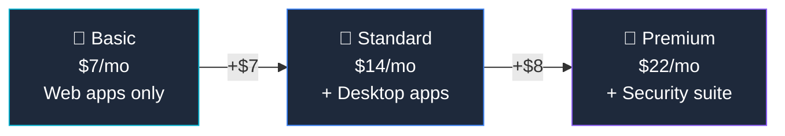

## Who Is Business Basic For?

Business Basic is the **cheapest way to get Teams and business email** under your own domain. No desktop apps — everything runs in the browser or on mobile.

**Basic is right for you if:**

- ✅ Your team only needs **email, Teams, and cloud storage**
- ✅ Everyone works in **web browsers** (no desktop app requirement)
- ✅ Budget is the **top priority** — $7/user is the lowest M365 price
- ✅ Under **300 users**
- ✅ You provide desktop apps separately (e.g., via Microsoft 365 Apps for Business)

**You'll probably outgrow Basic if:**

- ❌ Users need **desktop Word, Excel, or PowerPoint** installed on their computers
- ❌ You want **Microsoft 365 Copilot** — Basic is not eligible
- ❌ You need **any security features** (Intune, Defender, Conditional Access)

## What's Included in Business Basic

### 📧 Productivity & Communication

| Feature | What You Get |
|---------|-------------|
| **Web & Mobile Office Apps** | Word, Excel, PowerPoint, Outlook — browser and iOS/Android only |
| **Exchange Online** | **50 GB mailbox** per user, custom domain email, shared mailboxes |
| **Microsoft Teams** | Chat, video meetings (up to 300 participants), screen sharing |
| **SharePoint Online** | Team sites, document libraries, intranet |
| **OneDrive for Business** | **1 TB** cloud storage per user |
| **Microsoft Lists** | Track information with customisable lists |
| **Microsoft Forms** | Surveys, quizzes, and polls |
| **Microsoft Planner** | Basic task management boards |
| **Microsoft Sway** | Interactive presentations and newsletters |
| **Microsoft Bookings** | Online appointment scheduling |

### ⚠️ What's NOT Included

| Missing Feature | What You Need Instead |
|----------------|----------------------|
| Desktop Office apps | Upgrade to [Business Standard](/licensing/microsoft-365-business-standard/) ($14) |
| Intune (device management) | Upgrade to [Premium](/licensing/microsoft-365-business-premium/) ($22) |
| Defender for Business | Upgrade to Premium |
| Conditional Access / Entra P1 | Upgrade to Premium |
| Microsoft 365 Copilot eligibility | Upgrade to Standard or Premium |

## Business Basic vs Standard vs Premium

| Feature | Basic ($7) | [Standard](/licensing/microsoft-365-business-standard/) ($14) | [Premium](/licensing/microsoft-365-business-premium/) ($22) |
|---------|:----------:|:--------------:|:-------------:|
| Web & Mobile Office Apps | ✅ | ✅ | ✅ |
| **Desktop Office Apps** | ❌ | ✅ | ✅ |
| Exchange (50 GB) + Teams | ✅ | ✅ | ✅ |
| OneDrive (1 TB) | ✅ | ✅ | ✅ |
| **Webinar hosting** | ✅ | ✅ | ✅ |
| **Microsoft Bookings** | ✅ | ✅ | ✅ |
| **Intune + Defender** | ❌ | ❌ | ✅ |
| **Entra ID P1 (Conditional Access)** | ❌ | ❌ | ✅ |
| **Copilot eligible** | ❌ | ✅ | ✅ |
| Max users | 300 | 300 | 300 |

> **💡 Honest advice:** Basic is fine for very small teams that only need email and Teams. But most businesses quickly outgrow it — desktop apps and Copilot eligibility make [Standard](/licensing/microsoft-365-business-standard/) the sweet spot.

## Business Basic vs Enterprise Plans

If you're comparing Basic to enterprise options:

| Feature | Basic ($7) | [O365 E1](/licensing/office-365-e1/) ($10) | [M365 E3](/licensing/microsoft-365-e3/) ($39) |
|---------|:----------:|:----------:|:----------:|
| Web & Mobile Apps | ✅ | ✅ | ✅ |
| Desktop Apps | ❌ | ❌ | ✅ |
| Mailbox | 50 GB | 50 GB | 100 GB |
| Security suite | ❌ | ❌ | ✅ |
| User limit | **300** | Unlimited | Unlimited |
| Copilot eligible | ❌ | ❌ | ✅ |

> **💡 Choosing between Basic and E1:** If you have under 300 users, Basic at $7 saves $3/user/month over E1 for essentially the same features. If you might exceed 300 users, start with E1 to avoid a migration later.

## Frequently Asked Questions

**1. Does Business Basic include desktop Office apps?**

No. Business Basic only includes web and mobile versions of Office apps. For desktop apps (installed Word, Excel, PowerPoint), upgrade to [Business Standard](/licensing/microsoft-365-business-standard/) ($14) or [Business Premium](/licensing/microsoft-365-business-premium/) ($22).

**2. Can I add Copilot to Business Basic?**

No. [Microsoft 365 Copilot](/licensing/microsoft-365-copilot/) requires Business Standard or Premium as a base plan. Business Basic is not eligible for the Copilot add-on.

**3. What is the difference between Business Basic and Office 365 E1?**

Very similar features — both offer web apps, email, and Teams. Business Basic ($7) is cheaper but capped at 300 users. [Office 365 E1](/licensing/office-365-e1/) ($10) has no user limit and is designed for enterprises.

**4. How much storage do I get with Business Basic?**

Each user gets a 50 GB Exchange mailbox and 1 TB of OneDrive storage. SharePoint offers 1 TB base plus 10 GB per user.

**5. Can I upgrade from Basic to Standard later?**

Yes — it's an instant upgrade in the Microsoft 365 admin centre. No data migration needed. Users keep all email and files.

**6. Is Business Basic enough for a small team?**

If your team only needs email, Teams, and cloud storage — and everyone works in web browsers — yes. But most businesses quickly outgrow it because desktop apps and [Copilot](/licensing/microsoft-365-copilot/) eligibility require Standard or Premium.
