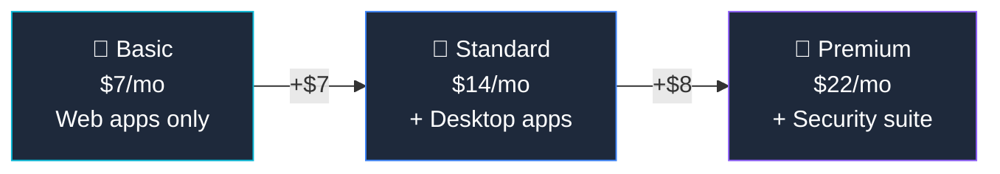

## Who Is Business Basic For?

Business Basic is the **cheapest way to get Teams and business email** under your own domain. No desktop apps — everything runs in the browser.

**Basic is right for you if:**
- ✅ Your team only needs **email, Teams, and cloud storage**
- ✅ Everyone works in **web browsers** (no desktop app requirement)
- ✅ Budget is the **top priority**
- ✅ Under 300 users

## Basic vs Standard vs Premium

| Feature | Basic ($7) | Standard ($14) | Premium ($22) |
|---------|:----------:|:--------------:|:-------------:|
| Web & Mobile Office Apps | ✅ | ✅ | ✅ |
| **Desktop Office Apps** | ❌ | ✅ | ✅ |
| Exchange (50 GB) + Teams | ✅ | ✅ | ✅ |
| OneDrive (1 TB) | ✅ | ✅ | ✅ |
| **Webinar hosting** | ❌ | ✅ | ✅ |
| **Intune + Defender** | ❌ | ❌ | ✅ |
| **Copilot eligible** | ❌ | ✅ | ✅ |

> **💡 Honest advice:** Basic is fine for very small teams that only need email and Teams. But most businesses quickly outgrow it — desktop apps and Copilot eligibility make Standard the sweet spot.

## Frequently Asked Questions

**1. What's the difference between Business Basic and Office 365 E1?**

Very similar features. Business Basic ($7) is cheaper but limited to 300 users. Office 365 E1 ($10) has no user limit. Choose Basic for small businesses, E1 for enterprises.

**2. Can I upgrade from Basic to Standard later?**

Yes — instant upgrade in the admin centre. No data migration needed.
