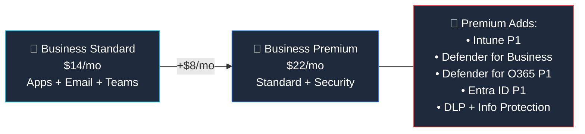

## Who Is Business Premium For?

Business Premium is the **"grown-up" plan for SMBs** — the one IT consultants recommend when a small business says "we need to take security seriously."

**Premium is right for you if:**

- ✅ You're a **small business (under 300 users)** handling customer data
- ✅ You need to **manage company devices** (laptops, phones) centrally
- ✅ You want **protection against phishing and ransomware**
- ✅ You need to meet **cyber insurance requirements** (MFA, endpoint protection)
- ✅ You're a **Microsoft 365 Business Standard** customer ready to level up security

## Business Standard vs Business Premium

| Feature | Standard ($14) | Premium ($22) |
|---------|:--------------:|:-------------:|
| Desktop Office Apps | ✅ | ✅ |
| Exchange (50 GB) | ✅ | ✅ |
| Teams, SharePoint, OneDrive | ✅ | ✅ |
| **Intune P1 (device management)** | ❌ | ✅ |
| **Defender for Business (EDR)** | ❌ | ✅ |
| **Defender for Office 365 P1** | ❌ | ✅ |
| **Entra ID P1 (Conditional Access)** | ❌ | ✅ |
| **Data Loss Prevention** | ❌ | ✅ |
| **Sensitivity Labels** | ❌ | ✅ |
| Max users | 300 | 300 |

> **💡 The value proposition:** Buying Intune ($8) + Defender for Business ($3) + Entra P1 separately would cost **$11+ per user**. Premium bundles them all for just **$8 more** than Standard. It's the best security deal in M365.

## What's Included in Business Premium

### 📧 Productivity (Same as Standard)
- Desktop Office apps (Word, Excel, PowerPoint, Outlook)
- Exchange Online (50 GB mailbox)
- Teams, SharePoint, OneDrive (1 TB)
- Webinar hosting, Microsoft Bookings

### 🔐 Security (Premium-Only)

| Feature | What It Does | Plain English |
|---------|-------------|---------------|
| **Intune P1** | MDM/MAM for all devices | "Remotely manage, secure, and wipe laptops and phones" |
| **Defender for Business** | Enterprise-grade endpoint protection | "Stops ransomware, malware, and suspicious activity on PCs" |
| **Defender for Office 365 P1** | Email threat protection | "Scans every link and attachment before you click" |
| **Entra ID P1** | Conditional Access, MFA, SSO | "Block risky logins — only allow trusted devices and locations" |
| **DLP** | Data Loss Prevention | "Prevent employees from accidentally emailing credit card numbers" |
| **Information Protection** | Sensitivity labels, encryption | "Label documents as Confidential — they stay encrypted everywhere" |

## When to Upgrade to Enterprise

If you hit the **300-user limit** or need more advanced features, here's the upgrade path:

| Need | Business Premium ($22) | Enterprise Alternative |
|------|:---------------------:|----------------------|
| More than 300 users | 300 max | **M365 E3** ($39) — unlimited |
| Advanced compliance | Basic DLP | **M365 E5** ($60) — Insider Risk, eDiscovery Premium |
| Teams Phone | ❌ | **M365 E5** ($60) — included |
| Copilot | Add-on ($30) | **M365 E7** ($99) — included |

## Frequently Asked Questions

**1. Is Business Premium enough for cyber insurance?**

For most SMBs, yes. It includes MFA (Entra P1), endpoint protection (Defender), device management (Intune), and email security — the four things insurers look for.

**2. Can I add Copilot to Business Premium?**

Yes. The Microsoft 365 Copilot add-on ($30/user/month) works with Business Premium.

**3. What about HIPAA/PCI compliance?**

Business Premium provides the foundational tools (DLP, encryption, Intune), but serious compliance needs may require Enterprise E5 with Purview Suite.

