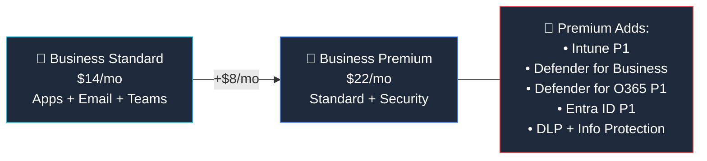
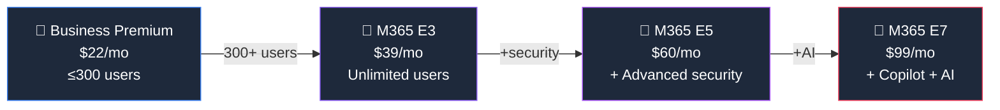

## Who Is Business Premium For?

Business Premium is the **"grown-up" plan for SMBs** — the one IT consultants recommend when a small business says "we need to take security seriously."

**Premium is right for you if:**

- ✅ You're a **small business (under 300 users)** handling customer data
- ✅ You need to **manage company devices** (laptops, phones) centrally
- ✅ You want **protection against phishing and ransomware**
- ✅ You need to meet **cyber insurance requirements** (MFA, endpoint protection)
- ✅ You're a [Business Standard](/licensing/microsoft-365-business-standard/) customer ready to level up security
- ✅ You want **DLP and sensitivity labels** to prevent accidental data leaks

**Premium is probably not enough if:**

- ❌ You have **more than 300 users** — move to [M365 E3](/licensing/microsoft-365-e3/) ($39)
- ❌ You need **advanced compliance** (Insider Risk, eDiscovery Premium) — that's [M365 E5](/licensing/microsoft-365-e5/)
- ❌ You need **Teams Phone** — that's E5 or a separate add-on
- ❌ You want **Copilot included** (not as an add-on) — that's [M365 E7](/licensing/microsoft-365-e7/)

## Business Standard vs Business Premium

| Feature | [Standard](/licensing/microsoft-365-business-standard/) ($14) | Premium ($22) |
|---------|:--------------:|:-------------:|
| Desktop Office Apps | ✅ | ✅ |
| Exchange (50 GB) | ✅ | ✅ |
| Teams, SharePoint, OneDrive | ✅ | ✅ |
| **Intune P1 (device management)** | ❌ | ✅ |
| **Defender for Business (EDR)** | ❌ | ✅ |
| **Defender for Office 365 P1** | ❌ | ✅ |
| **Entra ID P1 (Conditional Access)** | ❌ | ✅ |
| **Data Loss Prevention** | ❌ | ✅ |
| **Sensitivity Labels** | ❌ | ✅ |
| **Windows Autopilot** | ❌ | ✅ |
| Max users | 300 | 300 |

> **💡 The value proposition:** Buying Intune ($8) + Defender for Business ($3) + Entra P1 separately would cost **$11+ per user**. Premium bundles them all for just **$8 more** than Standard. It's the best security deal in M365.

## What's Included in Business Premium

### 📧 Productivity (Same as Standard)

| Feature | What You Get |
|---------|-------------|
| **Desktop Office Apps** | Word, Excel, PowerPoint, Outlook, OneNote, Access, Publisher — up to 5 devices per user |
| **Exchange Online** | 50 GB mailbox, shared mailboxes, custom domain |
| **Microsoft Teams** | Chat, video meetings, webinars (up to 300 attendees) |
| **SharePoint Online** | Intranet, team sites, document libraries |
| **OneDrive for Business** | 1 TB per user |
| **Microsoft Bookings** | Online appointment scheduling |

### 🔐 Security (Premium-Only)

| Feature | What It Does | Plain English |
|---------|-------------|---------------|
| **Intune P1** | MDM/MAM for all devices | "Remotely manage, secure, and wipe laptops and phones" |
| **Defender for Business** | Enterprise-grade endpoint protection | "Stops ransomware, malware, and suspicious activity on PCs" |
| **Defender for Office 365 P1** | Email threat protection | "Scans every link and attachment before you click" |
| **Entra ID P1** | Conditional Access, MFA, SSO | "Block risky logins — only allow trusted devices and locations" |
| **DLP** | Data Loss Prevention | "Prevent employees from accidentally emailing credit card numbers" |
| **Information Protection** | Sensitivity labels, encryption | "Label documents as Confidential — they stay encrypted everywhere" |
| **Windows Autopilot** | Zero-touch device deployment | "Ship a laptop — the user signs in and it configures itself" |

### Cyber Insurance Checklist

Most cyber insurers now require these controls. Premium covers all four:

| Insurer Requirement | Business Premium |
|-------------------|:---------------:|
| ✅ Multi-Factor Authentication (MFA) | Entra ID P1 |
| ✅ Endpoint protection (EDR) | Defender for Business |
| ✅ Email security (anti-phishing) | Defender for O365 P1 |
| ✅ Device management (MDM) | Intune P1 |
| ✅ Data encryption | Sensitivity Labels |

## When to Upgrade to Enterprise

If you hit the **300-user limit** or need more advanced features, here's the upgrade path:

| Need | Business Premium ($22) | Enterprise Alternative |
|------|:---------------------:|----------------------|
| More than 300 users | 300 max | [M365 E3](/licensing/microsoft-365-e3/) ($39) — unlimited |
| Advanced compliance | Basic DLP | [M365 E5](/licensing/microsoft-365-e5/) ($60) — Insider Risk, eDiscovery Premium |
| Teams Phone | ❌ | [M365 E5](/licensing/microsoft-365-e5/) ($60) — included |
| Copilot included | Add-on ($30) | [M365 E7](/licensing/microsoft-365-e7/) ($99) — included |
| 100 GB mailbox | 50 GB | [M365 E3](/licensing/microsoft-365-e3/) — 100 GB |

## Common Add-Ons for Business Premium

| Need | Add-On | Price |
|------|--------|-------|
| AI assistant in Office apps | [Microsoft 365 Copilot](/licensing/microsoft-365-copilot/) | +$30/user/mo |
| PSTN calling through Teams | Teams Phone Standard | +$8/user/mo |
| Advanced endpoint management | Intune Suite | +$10/user/mo |

## Frequently Asked Questions

**1. What is the difference between Business Standard and Business Premium?**

Premium adds Intune P1 (device management), Defender for Business (endpoint protection), Defender for Office 365 P1 (email security), Entra ID P1 (Conditional Access), and DLP. [Standard](/licensing/microsoft-365-business-standard/) has none of these security features.

**2. Is Business Premium worth the extra $8 over Standard?**

If you manage any company devices or handle sensitive data — absolutely yes. Buying Intune and Defender separately would cost $11+ per user. Premium bundles them for $8 more.

**3. Can I use Business Premium with more than 300 users?**

No. All Business plans cap at 300 users. For larger organisations, use [Microsoft 365 E3](/licensing/microsoft-365-e3/) ($39) which is the enterprise equivalent with similar security features.

**4. Is Business Premium enough for cyber insurance?**

For most SMBs, yes. It includes MFA (Entra P1), endpoint protection (Defender), device management (Intune), and email security — the four things cyber insurers look for.

**5. Can I add Copilot to Business Premium?**

Yes. The [Microsoft 365 Copilot](/licensing/microsoft-365-copilot/) add-on ($30/user/month) works with Business Premium. Total cost would be $52/user/month.

**6. What is the difference between Business Premium and Microsoft 365 E3?**

Similar security features, different target audience. Business Premium ($22) is capped at 300 users with 50 GB mailboxes. [M365 E3](/licensing/microsoft-365-e3/) ($39) has unlimited users, 100 GB mailboxes, Windows Enterprise, and more compliance tools.

