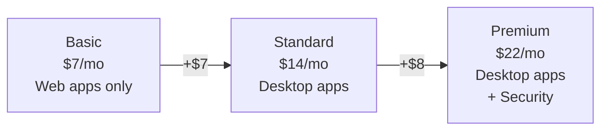

## Who Is Business Standard For?

Business Standard is the **most popular SMB plan** — the one you get when you need "real Office" (not just web apps) plus Teams and email. It's the sweet spot between Basic (too limited) and Premium (more security than some SMBs need).

**Standard is right for you if:**

- ✅ You're a **small business under 300 users**
- ✅ You need **desktop Office apps** (not just browser versions)
- ✅ You want **Teams, email, and file sharing** in one package
- ✅ Security is handled by a **third-party tool** or isn't a priority yet
- ✅ Budget matters — you want productivity without the security premium

**Consider upgrading to Premium if:**

- ❌ You need to **manage employee devices** (laptops, phones)
- ❌ You handle **sensitive customer data** (healthcare, finance)
- ❌ Your **cyber insurance** requires endpoint protection and MFA

## Business Basic vs Standard vs Premium

| Feature | Basic ($7) | Standard ($14) | Premium ($22) |
|---------|:----------:|:--------------:|:-------------:|
| Web & Mobile Office Apps | ✅ | ✅ | ✅ |
| **Desktop Office Apps** | ❌ | ✅ | ✅ |
| Exchange (50 GB) | ✅ | ✅ | ✅ |
| Teams, SharePoint, OneDrive (1 TB) | ✅ | ✅ | ✅ |
| Webinar hosting | ❌ | ✅ | ✅ |
| Microsoft Bookings | ❌ | ✅ | ✅ |
| **Intune (device management)** | ❌ | ❌ | ✅ |
| **Defender for Business** | ❌ | ❌ | ✅ |
| **Entra ID P1** | ❌ | ❌ | ✅ |
| Max users | 300 | 300 | 300 |

> **💡 Rule of thumb:** If your team just needs email and Teams → Basic. If they need desktop Office apps → Standard. If they handle sensitive data or you manage devices → Premium.

## What's Included

### 📧 Productivity
- **Desktop Office Apps** — Word, Excel, PowerPoint, Outlook, OneNote, Access (Windows), Publisher (Windows) — installed on up to 5 devices per user
- **Exchange Online** — 50 GB mailbox, shared mailboxes, custom domain email
- **Teams** — Chat, video meetings, webinars (up to 300 attendees), live events
- **SharePoint Online** — Intranet, team sites, document libraries
- **OneDrive for Business** — 1 TB per user
- **Microsoft Bookings** — Online appointment scheduling
- **Microsoft Forms, Lists, Planner, Stream**

### ⚠️ What's NOT Included (Security Gap)
- No **Intune** — you can't manage devices centrally
- No **Defender for Business** — only basic Windows AV
- No **Conditional Access** — can't block risky sign-ins
- No **DLP** — can't prevent accidental data leaks
- No **Sensitivity Labels** — can't encrypt documents automatically

> **💡 Honest advice:** Business Standard is a great productivity plan, but it has **zero enterprise security**. If you're an IT admin recommending this, budget for Business Premium or third-party security tools.

## Frequently Asked Questions

**1. What's the difference between Office 365 and Microsoft 365 Business Standard?**

Microsoft 365 Business Standard is the current name. "Office 365 Business" was the old branding. Same product, new name.

**2. Can I upgrade from Standard to Premium later?**

Yes — it's a simple licence change in the admin centre. No data migration. Your users keep all their files and email.

**3. Is 300 users really the limit?**

Yes. If you grow past 300 users, you must switch to Enterprise plans (E3 at $39/user/month). Plan the transition early.

