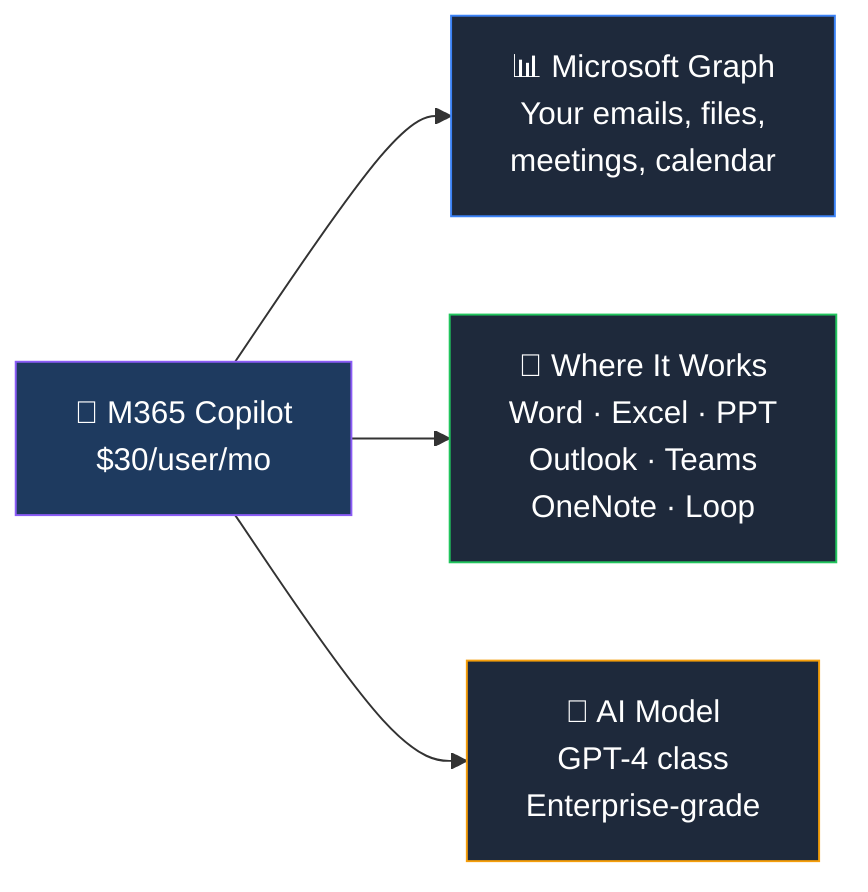
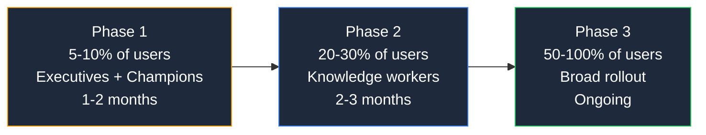

## What Does Microsoft 365 Copilot Do?

Copilot is an **AI assistant embedded directly in the Office apps you use every day**. Unlike Copilot Chat (which is a standalone chatbot), M365 Copilot is grounded on your **enterprise data** — your emails, files, meetings, calendar, and Teams conversations.

### What It Does in Each App

| App | What Copilot Does | Example |
|-----|------------------|---------|
| **Word** | Draft, rewrite, summarise documents | "Draft a project proposal based on last quarter's report" |
| **Excel** | Analyse data, create formulas, generate charts | "What are the top 5 trends in this sales data?" |
| **PowerPoint** | Create presentations from prompts or documents | "Turn this Word doc into a 10-slide deck" |
| **Outlook** | Summarise email threads, draft replies, schedule | "Summarise this 47-email thread in 3 bullet points" |
| **Teams** | Meeting recap, action items, catch-up summaries | "What did I miss in the 2pm meeting?" |
| **OneNote** | Organise notes, generate summaries, draft plans | "Create a project plan from these meeting notes" |
| **Loop** | Co-author with AI, brainstorm, draft collaboratively | "Help me brainstorm 10 marketing campaign ideas" |

## Copilot Chat vs Microsoft 365 Copilot

This is the **#1 confusion point**:

| Feature | Copilot Chat (Free) | M365 Copilot ($30/mo) |
|---------|:-------------------:|:---------------------:|
| Price | Free | $30/user/month |
| AI chat interface | ✅ | ✅ |
| **Access to your enterprise data** | ❌ | ✅ |
| **Works inside Office apps** | ❌ | ✅ |
| **Meeting summaries in Teams** | ❌ | ✅ |
| **Email summaries in Outlook** | ❌ | ✅ |
| Available in Word/Excel/PPT | ❌ (removed April 2026) | ✅ |

> **💡 Plain English:** Copilot Chat is like talking to ChatGPT — it doesn't know your work. M365 Copilot knows your emails, files, meetings, and calendar. That's the $30/month difference.

## Which Plans Support Copilot?

| Base Plan | Copilot Add-On? | Total Cost |
|-----------|:--------------:|:----------:|
| M365 E3 ($39) | ✅ | $69/user/mo |
| M365 E5 ($60) | ✅ | $90/user/mo |
| **M365 E7 ($99)** | **Included** | $99/user/mo |
| Business Standard ($14) | ✅ | $44/user/mo |
| Business Premium ($22) | ✅ | $52/user/mo |
| Business Basic ($7) | ❌ | — |
| Office 365 E1/E3/E5 | ❌ | — |
| Frontline F1/F3 | ❌ | — |

> **💡 Tip:** If you're on E5 and buying Copilot ($90 total), compare with E7 at $99 — you get Copilot PLUS Agent 365 and the full Entra Suite for $9 more.

## Requirements Before Deploying

1. **Qualifying base licence** — see table above
2. **Entra ID authentication** — users must sign in via Entra (formerly Azure AD)
3. **Latest apps** — New Outlook, current Teams, OneDrive enabled
4. **Data governance review** — Copilot surfaces data the user can access. Review permissions first!
5. **Network** — No special requirements, but ensure Teams/Office connectivity

> **⚠️ Critical:** Copilot will surface **everything a user has access to**. If your SharePoint permissions are overly broad, Copilot will expose data that was technically accessible but practically hidden. **Audit permissions before deploying.**

## Deployment Strategy

Most organisations don't deploy Copilot to everyone at once. The recommended approach:

## Frequently Asked Questions

**1. Is Copilot worth $30/user/month?**

It depends on the user. For knowledge workers who live in Outlook and Teams, the meeting summaries alone can save 30+ minutes per day. For users who rarely use Office apps, it's probably not worth it.

**2. Can I try Copilot before committing?**

Yes. Microsoft offers trial licences (typically 25 seats for 30 days). Ask your Microsoft rep or partner.

**3. Does Copilot store my prompts?**

Copilot follows your Microsoft 365 compliance and data residency policies. Prompts are not used to train the AI model. Data stays within your tenant's geographic boundary.

