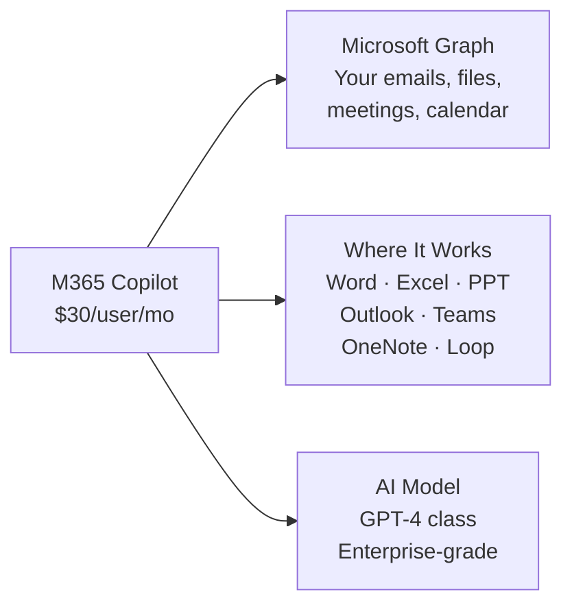
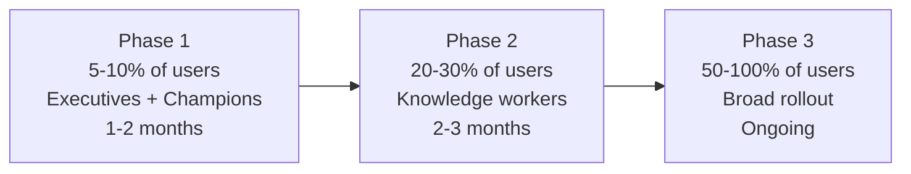

## What Does Microsoft 365 Copilot Do?

Copilot is an **AI assistant embedded directly in the Office apps you use every day**. Unlike Copilot Chat (which is a standalone chatbot), M365 Copilot is grounded on your **enterprise data** — your emails, files, meetings, calendar, and Teams conversations.

```mermaid
flowchart LR
    COP["M365 Copilot<br/>$30/user/mo"]
    GRAPH["Microsoft Graph<br/>Your emails, files,<br/>meetings, calendar"]
    APPS["Where It Works<br/>Word · Excel · PPT<br/>Outlook · Teams<br/>OneNote · Loop"]
    LLM["AI Model<br/>GPT-4 class<br/>Enterprise-grade"]
    COP --> GRAPH
    COP --> APPS
    COP --> LLM
```

### What It Does in Each App

| App | What Copilot Does | Example |
|-----|------------------|---------|
| **Word** | Draft, rewrite, summarise documents | "Draft a project proposal based on last quarter's report" |
| **Excel** | Analyse data, create formulas, generate charts | "What are the top 5 trends in this sales data?" |
| **PowerPoint** | Create presentations from prompts or documents | "Turn this Word doc into a 10-slide deck" |
| **Outlook** | Summarise email threads, draft replies, schedule | "Summarise this 47-email thread in 3 bullet points" |
| **Teams** | Meeting recap, action items, catch-up summaries | "What did I miss in the 2pm meeting?" |
| **OneNote** | Organise notes, generate summaries, draft plans | "Create a project plan from these meeting notes" |
| **Loop** | Co-author with AI, brainstorm, draft collaboratively | "Help me brainstorm 10 marketing campaign ideas" |

## Copilot Chat vs Microsoft 365 Copilot

This is the **#1 confusion point**:

| Feature | Copilot Chat (Free) | M365 Copilot ($30/mo) |
|---------|:-------------------:|:---------------------:|
| Price | Free | $30/user/month |
| AI chat interface | ✅ | ✅ |
| **Access to your enterprise data** | ❌ | ✅ |
| **Works inside Office apps** | ❌ | ✅ |
| **Meeting summaries in Teams** | ❌ | ✅ |
| **Email summaries in Outlook** | ❌ | ✅ |
| Available in Word/Excel/PPT | ❌ (removed April 2026) | ✅ |

> **💡 Plain English:** Copilot Chat is like talking to ChatGPT — it doesn't know your work. M365 Copilot knows your emails, files, meetings, and calendar. That's the $30/month difference.

## Which Plans Support Copilot?

| Base Plan | Copilot Add-On? | Total Cost |
|-----------|:--------------:|:----------:|
| M365 E3 ($39) | ✅ | $69/user/mo |
| M365 E5 ($60) | ✅ | $90/user/mo |
| **M365 E7 ($99)** | **Included** | $99/user/mo |
| Business Standard ($14) | ✅ | $44/user/mo |
| Business Premium ($22) | ✅ | $52/user/mo |
| Business Basic ($7) | ✅ | $37/user/mo |
| Office 365 E1/E3/E5 | ✅ | Base + $30 |
| Frontline F1/F3 | ✅ | Base + $30 |

The list is wider than people expect. Microsoft also allows the add-on on Microsoft 365 Apps, Teams, Exchange, SharePoint, OneDrive, Planner and Project, Visio, and Clipchamp plans. If you're on a Microsoft plan at all, it's worth checking rather than assuming you're excluded — [the full eligibility list is on Microsoft Learn ↗](https://learn.microsoft.com/en-us/microsoft-365/copilot/microsoft-365-copilot-licensing).

> **💡 Tip:** If you're on E5 and buying Copilot ($90 total), compare with E7 at $99 — you get Copilot PLUS Agent 365 and the full Entra Suite for $9 more.

> **💡 Smaller org?** If you have up to **300 seats** on a Microsoft 365 **Business** plan (Basic / Standard / Premium), you can buy **Microsoft 365 Copilot Business** instead — the **same capabilities** at a lower list price (around **$21/user/month**, annual commitment). Organisations above 300 seats use the Microsoft 365 Copilot add-on above. [Copilot Business FAQ ↗](https://learn.microsoft.com/en-us/microsoft-365/copilot/copilot-business-faq)

## What the Seat Doesn't Cover

The $30 seat is not always the whole bill. **Cowork** tasks draw on **Copilot Credits**, which are consumption-based and charged separately from the licence.

Agents are the part people get wrong. If a user has the $30 Microsoft 365 Copilot seat, Microsoft charges [no extra fee for using connectors, agents or plugins ↗](https://learn.microsoft.com/en-us/microsoft-365/copilot/extensibility/cost-considerations) — those are covered by the licence. Credits come into it when someone *without* the add-on uses Copilot Chat against shared tenant data, or when you run agents on pay-as-you-go.

Credits are roughly **$0.01 each** on pay-as-you-go, where you are billed only for what you actually use. Prepaid capacity packs are the other model — those replenish monthly and unused credits don't roll over. So a seat is a fixed cost, and credits are a variable one alongside it.

If you're building a budget, these are worth reading before you commit:

- [Copilot Credits explained](/blog/copilot-credits-explained/) — what a credit is and what burns them
- [Copilot messages vs Copilot Credits](/blog/copilot-messages-vs-copilot-credits/) — two things that sound the same and aren't
- [Cowork pricing and cost management](/blog/microsoft-copilot-cowork-pricing-cost-management/) — what Cowork actually costs to run
- [Copilot cost management](/blog/microsoft-365-copilot-cost-management/) — caps, alerts, and keeping the bill predictable

## Requirements Before Deploying

1. **Qualifying base licence** — see table above
2. **Entra ID authentication** — users must sign in via Entra (formerly Azure AD)
3. **Latest apps** — New Outlook, current Teams, OneDrive enabled
4. **Data governance review** — Copilot surfaces data the user can access. Review permissions first!
5. **Network** — No special requirements, but ensure Teams/Office connectivity

> **⚠️ Critical:** Copilot will surface **everything a user has access to**. If your SharePoint permissions are overly broad, Copilot will expose data that was technically accessible but practically hidden. **Audit permissions before deploying.**

## Deployment Strategy

Most organisations don't deploy Copilot to everyone at once. The recommended approach:

```mermaid
flowchart LR
    P1["Phase 1<br/>5-10% of users<br/>Executives + Champions<br/>1-2 months"]
    P2["Phase 2<br/>20-30% of users<br/>Knowledge workers<br/>2-3 months"]
    P3["Phase 3<br/>50-100% of users<br/>Broad rollout<br/>Ongoing"]
    P1 --> P2 --> P3
```

## Frequently Asked Questions

**1. Is Copilot worth $30/user/month?**

It depends on the user. For knowledge workers who live in Outlook and Teams, the meeting summaries alone can save 30+ minutes per day. For users who rarely use Office apps, it's probably not worth it.

**2. Can I try Copilot before committing?**

Yes. Microsoft offers trial licences (typically 25 seats for 30 days). Ask your Microsoft rep or partner.

**3. Does Copilot store my prompts?**

Copilot follows your Microsoft 365 compliance and data residency policies. Prompts are not used to train the AI model. Data stays within your tenant's geographic boundary.

