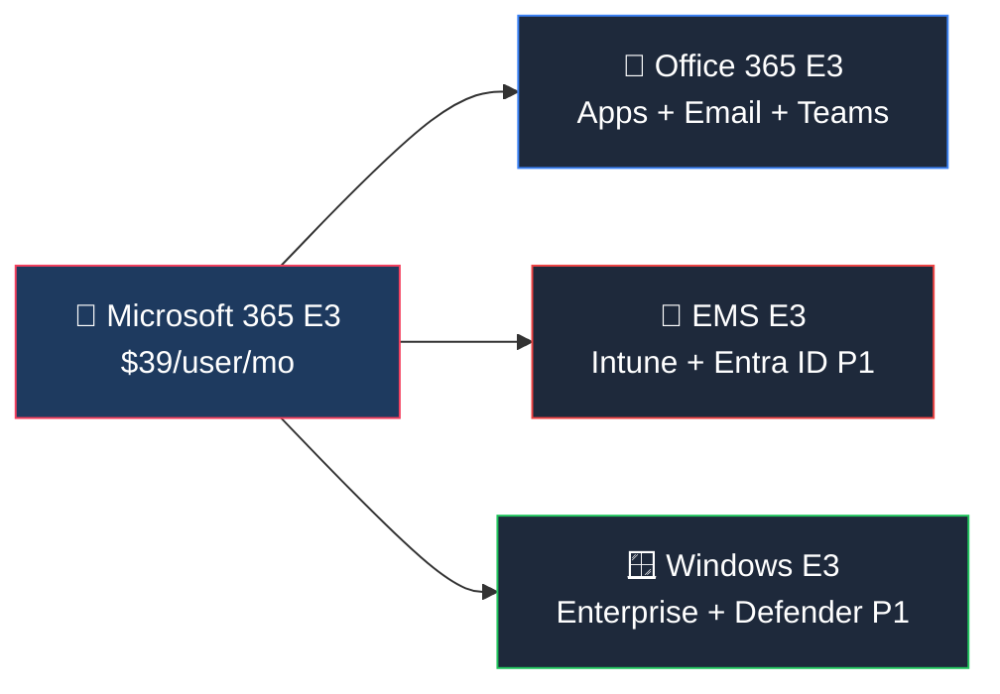
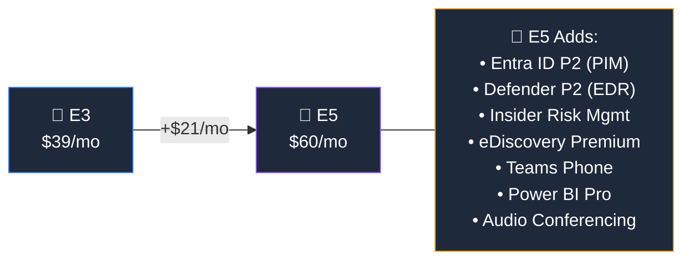
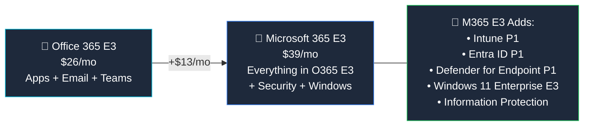

## Who Is Microsoft 365 E3 For?

Microsoft 365 E3 is the **most popular enterprise plan** — and for good reason. It's the plan most IT admins recommend when an organisation outgrows Business Premium (300-user cap) or needs proper enterprise security and device management.

**E3 is right for you if:**

- ✅ You have **300+ users** (no upper limit)
- ✅ You need **desktop Office apps** on every device
- ✅ You want **Intune** for device management (no SCCM-only environments)
- ✅ You need **Conditional Access** to control who can access what, and from where
- ✅ You want **basic compliance** — DLP, retention policies, eDiscovery
- ✅ You're running **Windows 11 Enterprise** across the org

**E3 is probably NOT enough if:**

- ❌ You need **Teams Phone** (PSTN calling) — that's E5 or a separate add-on
- ❌ You need **advanced threat hunting** (Defender for Endpoint P2) — that's E5
- ❌ You're in a **heavily regulated industry** needing Insider Risk Management — that's E5 or Purview add-on
- ❌ You want **Copilot included** (not as an add-on) — that's E7

## What's Inside Microsoft 365 E3?

Think of E3 as **three products bundled together**:

### 📧 Productivity & Communication

| Feature | What You Get |
|---------|-------------|
| **Desktop Office Apps** | Word, Excel, PowerPoint, Outlook, OneNote, Access, Publisher — installed on up to 5 PCs/Macs per user |
| **Web & Mobile Apps** | Office apps in the browser and on iOS/Android |
| **Exchange Online** | **100 GB mailbox** per user, shared mailboxes, in-place archiving, litigation hold |
| **Microsoft Teams** | Chat, video meetings, webinars, live events, recording & transcription |
| **SharePoint Online** | Intranet, document libraries, team sites, records management |
| **OneDrive for Business** | **Unlimited storage** (for tenants with 5+ users, otherwise 1 TB) |
| **Microsoft Loop** | Collaborative workspaces with real-time co-authoring |
| **Microsoft Forms** | Surveys, quizzes, and polls |
| **Microsoft Planner** | Task management boards (basic, not Premium) |
| **Microsoft Stream** | Video hosting and sharing across the org |

### 🔐 Security & Identity

| Feature | What It Does | Plain English |
|---------|-------------|---------------|
| **Entra ID P1** | Conditional Access, MFA, SSO, self-service password reset | "Control who logs in, from where, and how" |
| **Defender for Endpoint P1** | Next-gen antimalware, attack surface reduction, device control | "Protects your PCs from malware and attacks" |
| **Defender for Office 365 P1** | Safe Links, Safe Attachments, anti-phishing | "Scans every email link and attachment before you click" |
| **DLP (Basic)** | Data Loss Prevention policies for email, SharePoint, OneDrive | "Stops people accidentally sharing sensitive data" |
| **Information Protection** | Sensitivity labels, encryption, rights management | "Label and encrypt documents so only the right people can read them" |

> **💡 New in 2026:** Defender for Office 365 Plan 1 is now **included in E3** at no extra cost (previously a paid add-on). This is a significant security upgrade.

### 📱 Device Management

| Feature | What It Does | Plain English |
|---------|-------------|---------------|
| **Intune P1** | MDM + MAM — manage phones, tablets, PCs from the cloud | "Remotely configure, secure, and wipe any device" |
| **Windows Autopilot** | Zero-touch device deployment | "Ship a laptop to a new employee — they sign in and it configures itself" |
| **Endpoint Analytics** | Device health and performance insights | "See which devices are slow, outdated, or causing problems" |
| **Windows 11 Enterprise E3** | Credential Guard, BitLocker, AppLocker, LTSC access | "Enterprise-grade Windows with extra security locked in" |

### 📋 Compliance & Governance

| Feature | Tier | What It Does |
|---------|------|-------------|
| **eDiscovery** | Standard | Content search, legal hold, basic case management |
| **Retention Policies** | Standard | Auto-delete or retain emails and files after X days |
| **Audit Logs** | Standard | Track who did what across M365 services |
| **Compliance Manager** | Basic | Compliance score dashboard with improvement actions |
| **Communication Compliance** | Basic | Monitor for code of conduct violations |

## E3 vs E5 — What's the Difference?

This is the **#1 question** IT admins ask. Here's the honest answer:

| Feature | E3 ($39) | E5 ($60) |
|---------|:--------:|:--------:|
| Desktop Office Apps | ✅ | ✅ |
| Exchange 100 GB | ✅ | ✅ |
| Teams (meetings, chat) | ✅ | ✅ |
| SharePoint + OneDrive | ✅ | ✅ |
| Entra ID P1 (Conditional Access) | ✅ | ✅ |
| **Entra ID P2 (PIM, risk-based)** | ❌ | ✅ |
| Defender for Endpoint P1 | ✅ | ✅ |
| **Defender for Endpoint P2 (full EDR)** | ❌ | ✅ |
| Defender for Office 365 P1 | ✅ | ✅ |
| **Defender for Office 365 P2** | ❌ | ✅ |
| Intune P1 | ✅ | ✅ |
| DLP (Basic) | ✅ | ✅ |
| **DLP (Advanced + Endpoint DLP)** | ❌ | ✅ |
| eDiscovery (Standard) | ✅ | ✅ |
| **eDiscovery (Premium)** | ❌ | ✅ |
| **Insider Risk Management** | ❌ | ✅ |
| **Teams Phone System** | ❌ | ✅ |
| **Power BI Pro** | ❌ | ✅ |
| **Audio Conferencing** | ❌ | ✅ |
| Windows Enterprise E3 | ✅ | ✅ |
| **Windows Enterprise E5** | ❌ | ✅ |

> **💡 Rule of thumb:** If you need Teams Phone, Power BI, or are in a regulated industry — go E5. Otherwise, E3 covers 80% of enterprise needs.

## Office 365 E3 vs Microsoft 365 E3 — What's the Difference?

This is the **second most confusing** licensing question. Here's the simple version (see the full [Office 365 E3 guide](/licensing/office-365-e3/) for details):

**In short:** Microsoft 365 E3 = Office 365 E3 + Windows + Security. The extra $13/user/month gets you Intune, Entra ID P1, Defender, and Windows Enterprise. For most organisations, this is worth it.

## Common Add-Ons for E3

If E3 almost covers your needs but you need one more thing, here are the most common add-ons:

| Need | Add-On | Price |
|------|--------|-------|
| AI assistant in Office apps | **Microsoft 365 Copilot** | +$30/user/mo |
| PSTN calling through Teams | **Teams Phone Standard** | +$8/user/mo |
| Advanced endpoint protection | **Defender for Endpoint P2** | +$5.20/user/mo |
| Full compliance suite | **Purview Suite** | +$12/user/mo |
| Advanced identity (PIM) | **Entra ID P2** | +$9/user/mo |
| Employee experience | **Viva Suite** | +$12/user/mo |

> **💡 Tip:** If you're adding 3+ add-ons to E3, do the maths — [E5 at $60/mo](/licensing/microsoft-365-e5/) might be cheaper than E3 ($39) plus individual add-ons. And if you want Copilot, check [E7 at $99/mo](/licensing/microsoft-365-e7/) — it includes Copilot, Agent 365, and the full Entra Suite.

## Pricing History & What's Coming

| Date | Change |
|------|--------|
| **July 2026** | Price increases to $39/mo (from $36). Defender for Office 365 P1 now included at no extra cost. |
| **May 2026** | M365 E7 ($99/mo) launches — first plan with Copilot built in |
| **April 2026** | Copilot Chat removed from Word/Excel/PPT for users without Copilot licence |
| **2025** | Expanded Intune features (remote help, advanced analytics) added to E3 |

## Frequently Asked Questions

**1. What is included in Microsoft 365 E3?**

Microsoft 365 E3 includes desktop Office apps (Word, Excel, PowerPoint, Outlook), Exchange Online with 100 GB mailbox, Teams, SharePoint, OneDrive, Entra ID P1, Intune P1, Defender for Endpoint P1, Defender for Office 365 P1, Windows 11 Enterprise E3, and basic compliance tools like DLP and eDiscovery.

**2. How much does Microsoft 365 E3 cost?**

Microsoft 365 E3 costs $39 per user per month (USD list price). From July 2026, this price applies to new customers and renewals. Enterprise Agreement and CSP pricing may differ.

**3. What is the difference between Microsoft 365 E3 and E5?**

[E5](/licensing/microsoft-365-e5/) adds advanced security (Defender P2, Entra ID P2), advanced compliance (Insider Risk, eDiscovery Premium), Teams Phone System, Power BI Pro, and Audio Conferencing. E5 costs $60/user/month vs E3's $39.

**4. What is the difference between Office 365 E3 and Microsoft 365 E3?**

Microsoft 365 E3 includes everything in [Office 365 E3](/licensing/office-365-e3/) PLUS Windows 11 Enterprise E3, Enterprise Mobility + Security E3 (Intune P1, Entra ID P1), and Defender for Endpoint P1. Microsoft 365 E3 is the more complete package.

**5. Should I upgrade from E3 to E5 or E7?**

If you need advanced security (EDR, CASB, PIM) or Teams Phone — upgrade to [E5](/licensing/microsoft-365-e5/) ($60). If you also want Copilot, Agent 365, and the full Entra Suite — go directly to [E7](/licensing/microsoft-365-e7/) ($99). If you only want Copilot, add it as a [$30 add-on](/licensing/microsoft-365-copilot/) to E3.

**6. Can I add Copilot to Microsoft 365 E3?**

Yes. [Microsoft 365 Copilot](/licensing/microsoft-365-copilot/) is available as a $30/user/month add-on for E3 ($69 total). Alternatively, [M365 E7](/licensing/microsoft-365-e7/) ($99) includes Copilot plus Agent 365 and the full Entra Suite.

