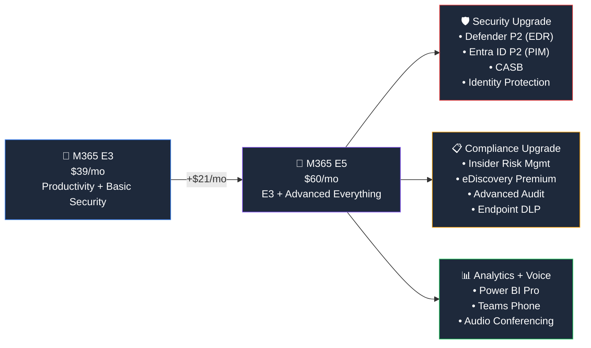
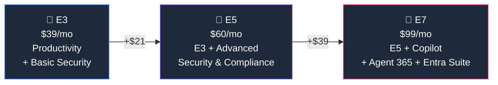

## Who Is Microsoft 365 E5 For?

E5 is the **security-first enterprise plan**. If your organisation handles sensitive data, faces regulatory requirements, or wants to consolidate multiple security vendors into one Microsoft stack — E5 is your plan.

**E5 is right for you if:**

- ✅ You need **advanced threat protection** — full EDR, threat hunting, automated investigation
- ✅ You're in a **regulated industry** — finance, healthcare, government, legal
- ✅ You want **Teams Phone** — replace your PBX with cloud calling
- ✅ You need **Power BI Pro** for every user
- ✅ You want to **replace third-party CASB, DLP, or SIEM tools** with Microsoft's suite
- ✅ You need **Privileged Identity Management** (PIM) for admin access control

**You might not need E5 if:**

- ❌ Basic antivirus and conditional access is enough (E3 covers that)
- ❌ You don't use Teams for phone calls
- ❌ Budget is the primary concern

## What E5 Adds Over E3

Think of E5 as **E3 + the full security/compliance/analytics upgrade**:

## Security Features — The E5 Advantage

| Feature | E3 | E5 | Plain English |
|---------|:---:|:---:|--------------|
| Entra ID P1 (Conditional Access) | ✅ | ✅ | Control who logs in and from where |
| **Entra ID P2 (PIM, risk-based)** | ❌ | ✅ | Just-in-time admin access, auto-detect risky sign-ins |
| Defender for Endpoint P1 | ✅ | ✅ | Basic endpoint antimalware |
| **Defender for Endpoint P2 (full EDR)** | ❌ | ✅ | Threat hunting, automated investigation, forensics timeline |
| Defender for Office 365 P1 | ✅ | ✅ | Safe Links and Attachments |
| **Defender for Office 365 P2** | ❌ | ✅ | Attack simulation, auto-remediation, threat trackers |
| **Defender for Identity** | ❌ | ✅ | Detect credential theft and lateral movement in AD |
| **Defender for Cloud Apps (CASB)** | ❌ | ✅ | Shadow IT discovery, SaaS app control, real-time monitoring |

> **💡 The "replace your third-party tools" story:** E5 can replace standalone CASB (like Netskope), EDR (like CrowdStrike), and SIEM (partially, with Sentinel integration). Do the maths — you might save money.

## Compliance Features

| Feature | E3 | E5 | Why It Matters |
|---------|:---:|:---:|---------------|
| DLP (Basic) | ✅ | ✅ | Stop accidental data leaks |
| **DLP (Advanced + Endpoint DLP)** | ❌ | ✅ | Block USB copy, screen capture, printing of sensitive docs |
| eDiscovery (Standard) | ✅ | ✅ | Legal hold and content search |
| **eDiscovery (Premium)** | ❌ | ✅ | Machine learning, predictive coding, custodian management |
| **Insider Risk Management** | ❌ | ✅ | Auto-detect data theft by leavers, policy violations |
| **Communication Compliance** | ❌ | ✅ | Monitor Teams/Outlook for code of conduct violations |
| Audit (Standard, 90 days) | ✅ | ✅ | Track user actions |
| **Audit (Advanced, up to 10 years)** | ❌ | ✅ | Long-term retention for regulatory compliance |

## Analytics & Voice

| Feature | E3 | E5 |
|---------|:---:|:---:|
| **Power BI Pro** | ❌ | ✅ |
| **Teams Phone System** | ❌ | ✅ |
| **Audio Conferencing** | ❌ | ✅ |
| **Windows Enterprise E5** | ❌ | ✅ |

## E3 vs E5 vs E7 — The Full Picture

| What You Get | E3 ($39) | E5 ($60) | E7 ($99) |
|-------------|:--------:|:--------:|:--------:|
| Desktop Office Apps | ✅ | ✅ | ✅ |
| Full Security Suite | Basic | **Advanced** | **Advanced** |
| Full Compliance Suite | Basic | **Advanced** | **Advanced** |
| Teams Phone | ❌ | ✅ | ✅ |
| Power BI Pro | ❌ | ✅ | ✅ |
| **Microsoft 365 Copilot** | ❌ | ❌ | ✅ |
| **Agent 365** | ❌ | ❌ | ✅ |
| **Full Entra Suite** | ❌ | Partial | ✅ |

## Common Add-Ons for E5

E5 already includes most security and compliance features, but some organisations still add:

| Need | Add-On | Price |
|------|--------|-------|
| AI assistant in Office apps | **Microsoft 365 Copilot** | +$30/user/mo |
| Advanced endpoint management | **Intune Suite** | +$10/user/mo |
| Employee experience | **Viva Suite** | +$12/user/mo |
| Full Entra Suite (ZTNA, Internet Access) | **Entra Suite** | Varies |

> **💡 Tip:** If you're on E5 and adding the $30 Copilot add-on ($90 total), compare that to E7 at $99 — you get Copilot PLUS Agent 365 and the full Entra Suite for just $9 more.

## Frequently Asked Questions

**1. Should I give E5 to all users or just some?**

Most organisations use **mixed licensing** — E5 for security teams, executives, finance, and legal; E3 for everyone else. This is fully supported and the most cost-effective approach.

**2. Does E5 replace CrowdStrike/Netskope/Splunk?**

Potentially. Defender for Endpoint P2 competes with CrowdStrike, Defender for Cloud Apps competes with Netskope, and Sentinel (separate) competes with Splunk. Many organisations consolidate to save costs and reduce integration complexity.

**3. Is Teams Phone in E5 a full phone system?**

Yes — E5 includes the Teams Phone System (cloud PBX). You still need a **Calling Plan** or **Direct Routing** for actual PSTN connectivity (making/receiving external calls). The phone system itself is included.

