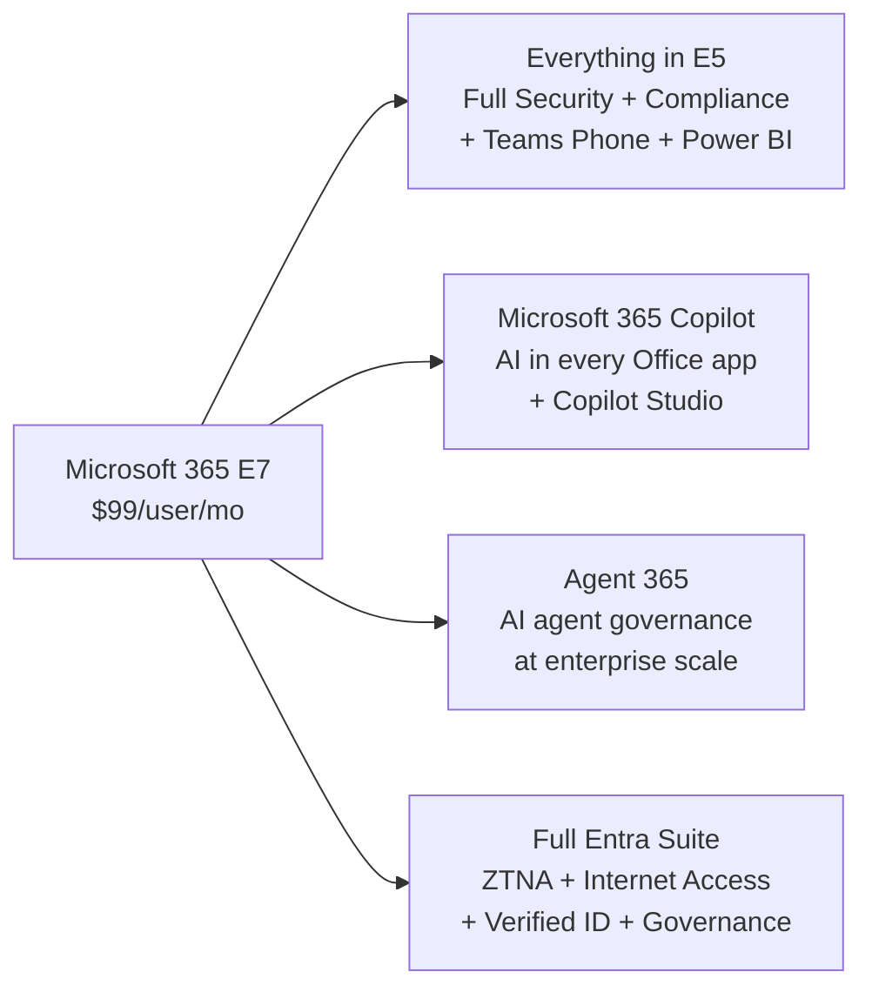
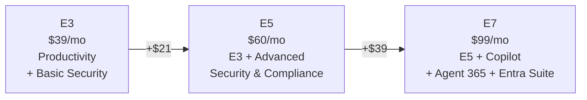

## Who Is Microsoft 365 E7 For?

E7 is for organisations that are **ready to go all-in on AI** — not just experimenting with Copilot, but deploying AI agents at scale with proper governance.

**E7 is right for you if:**

- ✅ You want **Copilot for all enterprise users** (not as an add-on)
- ✅ You're deploying **AI agents** and need governance at scale
- ✅ You want the **full Entra Suite** — Zero Trust Network Access, Internet Access, Verified ID
- ✅ You're already on E5 + Copilot and want Agent 365 for just $9 more
- ✅ You want a **single SKU** that covers everything — no add-on management
- ✅ You're in a **regulated industry** and need centralised AI governance and audit trails
- ✅ You want to **replace your VPN** with Entra Private Access (ZTNA)

**You probably don't need E7 if:**

- ❌ You're not ready for Copilot yet — stick with [E3](/licensing/microsoft-365-e3/) or [E5](/licensing/microsoft-365-e5/)
- ❌ You don't plan to use AI agents
- ❌ Budget is constrained — E3 + targeted add-ons is more cost-effective
- ❌ You only need Copilot for a small group (add the [$30 Copilot add-on](/licensing/microsoft-365-copilot/) to E3/E5 instead)

## What's Inside Microsoft 365 E7?

E7 is four products in one SKU. Everything in [E5](/licensing/microsoft-365-e5/) carries over — then E7 adds Copilot, Agent 365, and the full Entra Suite on top.

### What You Inherit from E5

Because E7 is a superset of [E5](/licensing/microsoft-365-e5/), you get **all of these** included:

| Category | What's Included |
|----------|----------------|
| **Productivity** | Desktop Office apps, Exchange (100 GB), Teams, SharePoint, OneDrive (unlimited), Loop, Planner |
| **Security** | Defender for Endpoint P2 (full EDR), Defender for Office 365 P2, Defender for Identity, Defender for Cloud Apps (CASB), Entra ID P2 (PIM) |
| **Compliance** | Insider Risk Management, eDiscovery Premium, Advanced Audit (10 years), Communication Compliance, Endpoint DLP |
| **Analytics & Voice** | Power BI Pro, Teams Phone System, Audio Conferencing |
| **Device Management** | Intune P1 + P2, Windows 11 Enterprise, Autopilot |

> **💡 Already on E5?** You keep everything. E7 only adds — it never removes features. See the [E5 guide](/licensing/microsoft-365-e5/) for the full security deep dive.

### 🤖 Microsoft 365 Copilot (Included)

Copilot is the AI assistant embedded in every Office app you use. In E7, it's included — no $30/user/month add-on required.

| App | What Copilot Does | Example |
|-----|------------------|---------|
| **Word** | Draft, rewrite, summarise | "Draft a project proposal based on last quarter's report" |
| **Excel** | Analyse data, create formulas, generate charts | "What are the top 5 trends in this sales data?" |
| **PowerPoint** | Create presentations from prompts or docs | "Turn this Word doc into a 10-slide deck" |
| **Outlook** | Summarise threads, draft replies | "Summarise this 47-email thread in 3 bullet points" |
| **Teams** | Meeting recap, action items, catch-up | "What did I miss in the 2pm meeting?" |
| **OneNote** | Organise notes, generate summaries | "Create a project plan from these meeting notes" |

E7 also includes **Copilot Studio agent-building capabilities** — create custom agents and workflows within the M365 Copilot entitlement. Note: the standalone [Copilot Studio](/licensing/copilot-studio/) SKU ($200/tenant/month) provides additional message capacity and features beyond what's included in the M365 Copilot licence. See the [Copilot guide](/licensing/microsoft-365-copilot/) for deployment tips.

### 🤖 Agent 365 (New in E7)

Agent 365 is the management plane for the **agentic AI era** — treating AI agents with the same governance as human users.

| Feature | What It Does | Why It Matters |
|---------|-------------|----------------|
| **Agent Inventory** | Central view of all AI agents across the tenant | Know exactly what agents exist and who owns them |
| **Security Policies** | Apply Conditional Access and DLP to agents | Agents can't access data they shouldn't |
| **Usage Tracking** | Monitor which agents are used, by whom, how often | Spot shadow AI and low-value agents |
| **Lifecycle Management** | Approve, deploy, update, retire agents | No orphaned agents running unsupervised |
| **Compliance Integration** | Entra + Defender + Purview for agents | Full audit trail for regulated industries |

> **💡 Why this matters:** As organisations deploy more AI agents (via Copilot Studio, Power Automate, custom apps), governing them becomes critical. Without Agent 365, you have "shadow AI" — agents nobody tracks, with unknown data access.

Agent 365 is also available standalone at **$15/user/month** for organisations not ready for E7.

### 🔐 Full Entra Suite (Beyond E5)

E5 includes Entra ID P2. E7 goes further with the **full Entra Suite** — Microsoft's complete identity, access, and network security platform.

| Feature | E3 | E5 | E7 | Plain English |
|---------|:---:|:---:|:---:|--------------|
| Entra ID P1 (Conditional Access) | ✅ | ✅ | ✅ | Control who logs in and from where |
| Entra ID P2 (PIM, risk-based) | ❌ | ✅ | ✅ | Just-in-time admin access, risky sign-in detection |
| **Full Identity Governance** | ❌ | Partial | ✅ | Automated joiner/mover/leaver workflows, access certifications |
| **Entra Private Access (ZTNA)** | ❌ | ❌ | ✅ | Replace VPN with identity-based access to private apps |
| **Entra Internet Access** | ❌ | ❌ | ✅ | Secure web gateway — filter and control web/SaaS traffic |
| **Entra Verified ID** | ❌ | ❌ | ✅ | Digital identity verification for employees and partners |

> **💡 The VPN replacement story:** Entra Private Access is a genuine VPN alternative. Users connect to internal apps through an identity-aware, Zero Trust tunnel — no full network access, no split tunnelling headaches. If you're still running a legacy VPN, this alone might justify E7.

## Microsoft 365 E7 Pricing — The Bundle Math

If you buy each component separately (at USD list prices):

| Component | Standalone Price |
|-----------|:---------------:|
| Microsoft 365 E5 | $60/user/mo |
| Microsoft 365 Copilot add-on | $30/user/mo |
| Entra Suite add-on | $12/user/mo |
| Agent 365 add-on | $15/user/mo |
| **À la carte total** | **$117/user/mo** |
| **E7 bundle price** | **$99/user/mo** |
| **You save** | **$18/user/mo (15%)** |

For a 1,000-user deployment, that's **$18,000/month saved** — or $216,000 annually.

> **⚠️ Note:** These are USD list prices. Actual pricing depends on your licensing channel (EA, CSP, Web Direct) and volume. E5 customers may get step-up pricing for the Entra Suite that differs from standalone list prices. Always confirm with your Microsoft rep or partner.

> **💡 The real comparison for most E5 customers:** If you're already paying $90/user (E5 + Copilot add-on), E7 at $99 adds Agent 365 ($15 standalone value) and the full Entra Suite for just **$9 more**. That's the strongest upgrade case.

## Microsoft 365 E7 vs E5 vs E3 — Complete Comparison

| What You Get | [E3](/licensing/microsoft-365-e3/) ($39) | [E5](/licensing/microsoft-365-e5/) ($60) | E7 ($99) |
|-------------|:--------:|:--------:|:--------:|
| Desktop Office Apps | ✅ | ✅ | ✅ |
| Exchange (100 GB) + Teams | ✅ | ✅ | ✅ |
| Entra ID P1 (Conditional Access) | ✅ | ✅ | ✅ |
| Intune P1 (device management) | ✅ | ✅ | ✅ |
| Defender for Endpoint P1 | ✅ | ✅ | ✅ |
| **Entra ID P2 (PIM)** | ❌ | ✅ | ✅ |
| **Full Security Suite (EDR, CASB)** | ❌ | ✅ | ✅ |
| **Full Compliance Suite** | ❌ | ✅ | ✅ |
| **Teams Phone + Power BI Pro** | ❌ | ✅ | ✅ |
| **[Microsoft 365 Copilot](/licensing/microsoft-365-copilot/)** | ❌ | ❌ | ✅ |
| **Agent 365** | ❌ | ❌ | ✅ |
| **Full Entra Suite (ZTNA, Web Filter)** | ❌ | Partial | ✅ |

> **💡 Decision framework:** E3 for productivity. E5 for security. E7 for AI at scale. Most organisations mix all three based on role.

## Migration Path from E5 to E7

Already on E5? Here's the upgrade path:

1. **Audit current add-ons** — if you're paying for Copilot ($30) and/or Entra Suite ($12) add-ons, calculate your current per-user cost. If it's $90+, E7 at $99 is cheaper.

2. **Pilot with 50-100 users** — assign E7 licences to your AI champions and security team first. Validate Copilot adoption, Agent 365 setup, and Entra Private Access.

3. **Switch licence in admin centre** — it's a simple licence swap. No data migration needed. Users keep all E5 features and gain E7 extras immediately.

4. **Configure Agent 365** — set up the agent inventory, define security policies, and enable usage tracking. This is net-new and requires planning.

5. **Deploy Entra Private Access** — if replacing VPN, plan a phased rollout. Start with a pilot group accessing one internal app, then expand.

6. **Review licensing channels** — check whether your EA, CSP, or Web Direct contract supports the upgrade. Teams opt-out pricing may be available.

> **⚠️ Important:** E7 is available in a **without-Teams variant** at a reduced price, primarily for the **EEA and Switzerland** where regulatory requirements restrict bundled communications. In most other regions, E7 includes Teams by default.

## What E7 Does NOT Include

Even the top-tier plan has boundaries. Know these before you commit:

| Not Included | What You Need | Cost |
|-------------|---------------|------|
| **PSTN Calling** | Calling Plan, Operator Connect, or Direct Routing | Varies by country |
| **Microsoft Sentinel (SIEM)** | Consumption-based Azure service | Pay-as-you-go |
| **Copilot Studio full entitlement** | Standalone SKU for high-volume agent messaging | $200/tenant/mo |
| **Power BI Premium** | Power BI PPU or Premium capacity | $20/user or $4,995/capacity |
| **Entra Private Access infrastructure** | Connector servers in your network | IT deployment effort |

> **💡 The PSTN catch:** E7 includes **Teams Phone System** (cloud PBX), but not the actual phone number or call minutes. You still need a Calling Plan, Operator Connect, or Direct Routing for making and receiving external calls.

## Licensing Channels & Availability

| Channel | Available | Notes |
|---------|:---------:|-------|
| Enterprise Agreement (EA) | ✅ | Volume pricing, annual/triennial terms |
| Cloud Solution Provider (CSP) | ✅ | Monthly billing, partner-managed |
| Web Direct | ✅ | Self-service purchase from Microsoft |
| Microsoft Customer Agreement (MCA) | ✅ | Standard enterprise terms |
| Teams opt-out variant | ✅ | Reduced price without Teams for EEA/Switzerland regulatory compliance |

## Frequently Asked Questions

**1. What is Microsoft 365 E7?**

E7 (also called Frontier Suite) is the top-tier enterprise plan at $99/user/month. It includes everything in E5 plus Microsoft 365 Copilot, Agent 365 (AI agent governance), and the full Microsoft Entra Suite — all in a single SKU.

**2. When is M365 E7 available?**

M365 E7 is Generally Available (GA) from **May 1, 2026**, worldwide via Enterprise Agreement (EA), Cloud Solution Provider (CSP), and Web Direct.

**3. Is M365 E7 cheaper than buying everything separately?**

Yes. At USD list prices: E5 ($60) + Copilot ($30) + Entra Suite ($12) + Agent 365 ($15) = $117/user. E7 at $99 saves you $18/user/month — about 15% off the à la carte price. Actual pricing depends on your licensing channel and volume.

**4. What is Agent 365?**

Agent 365 is a governance platform for managing AI agents across your organisation. It provides an agent inventory, security policies, usage tracking, and lifecycle management — treating AI agents with the same compliance as human users.

**5. Does E7 include Teams Phone?**

Yes. E7 inherits everything from [E5](/licensing/microsoft-365-e5/), which includes Teams Phone System (cloud PBX). You still need a Calling Plan or Direct Routing for PSTN connectivity.

**6. Can I mix E5 and E7 licences in the same tenant?**

Yes. Give E7 to power users, AI champions, and security teams who need Copilot and Agent 365. Keep [E5](/licensing/microsoft-365-e5/) for users who don't need AI capabilities, and [E3](/licensing/microsoft-365-e3/) for general staff.

**7. Is E7 just E5 + Copilot repackaged?**

No. E7 adds the **full Entra Suite** (ZTNA, Internet Access, Verified ID) and **Agent 365** — neither of which is available in E5 even with the Copilot add-on. It's a genuine upgrade with unique components.

**8. What if I only want Agent 365, not the full E7?**

Agent 365 is available standalone at **$15/user/month**. You can add it to any E3 or E5 licence. The full Entra Suite is also available as a separate add-on.

